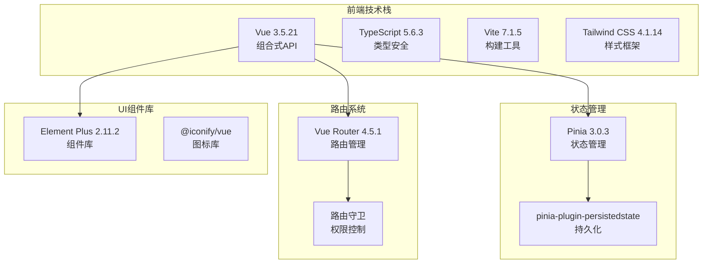
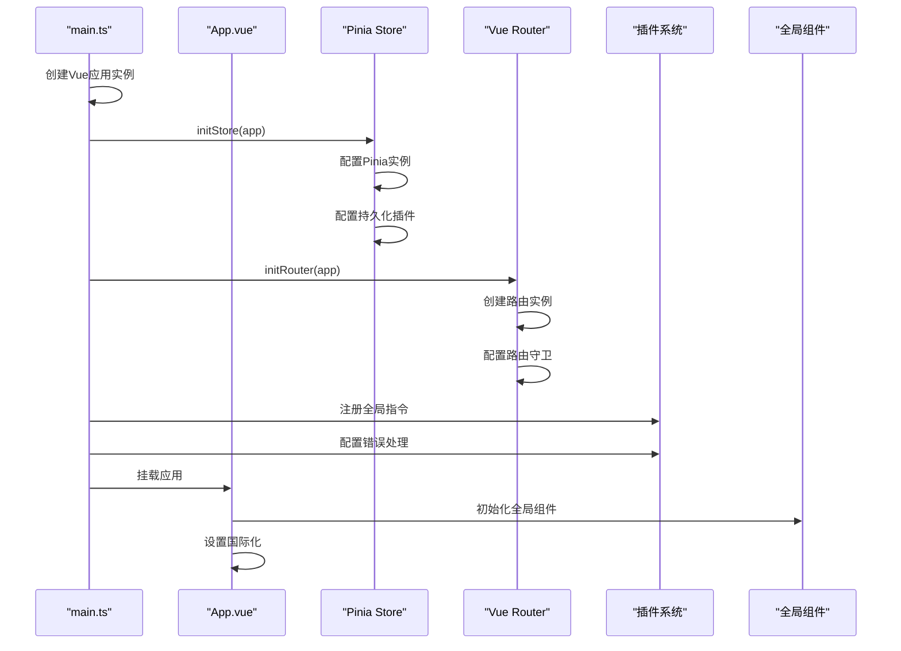
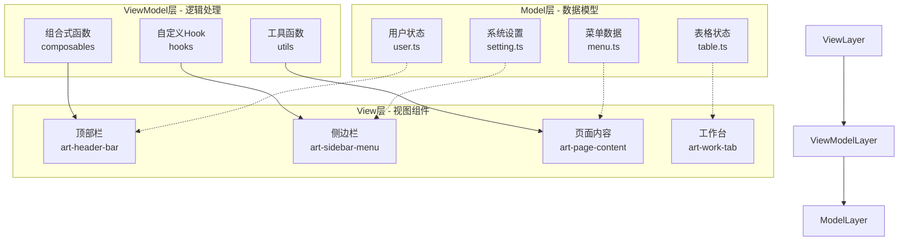
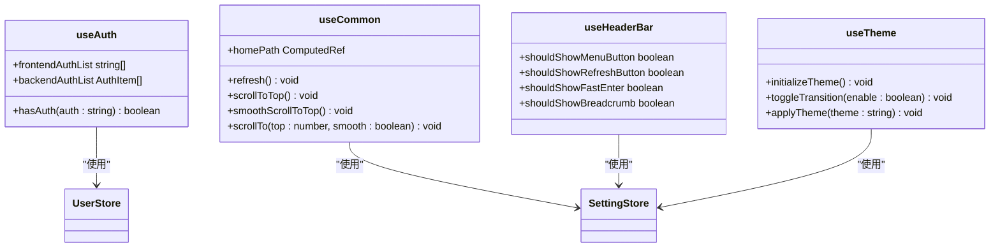
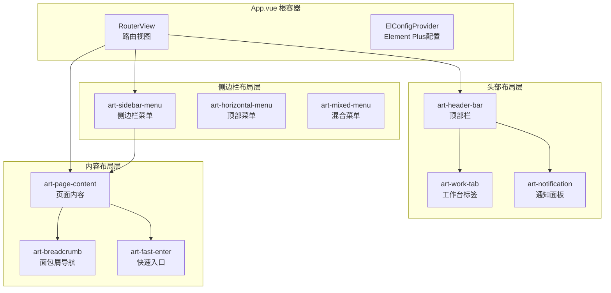
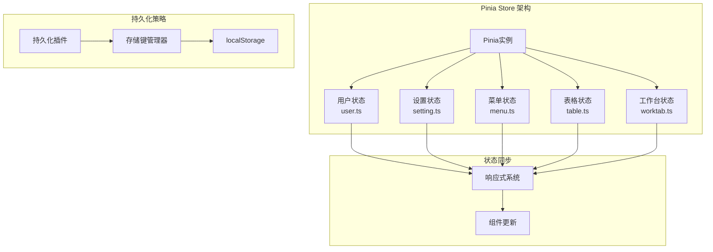
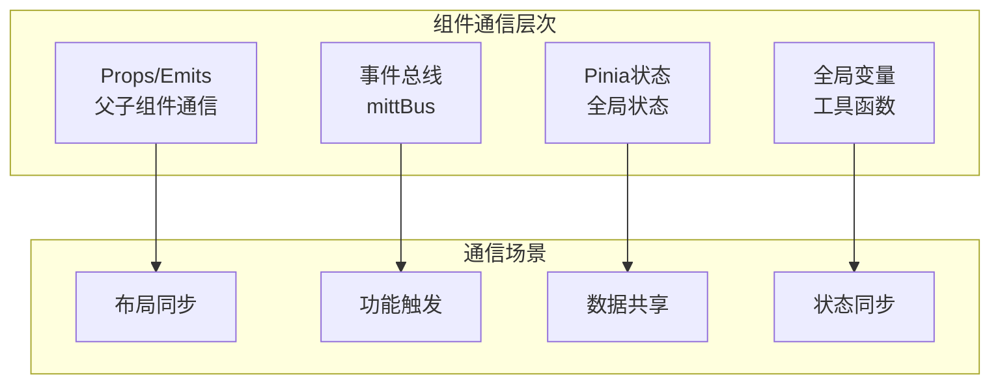
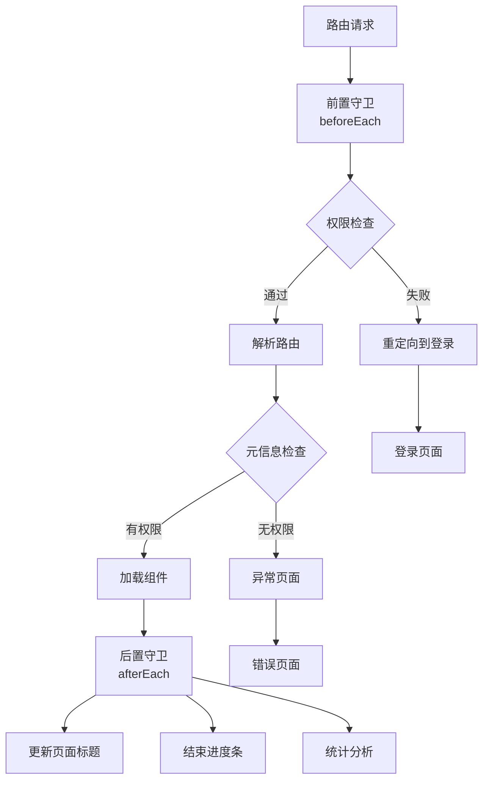
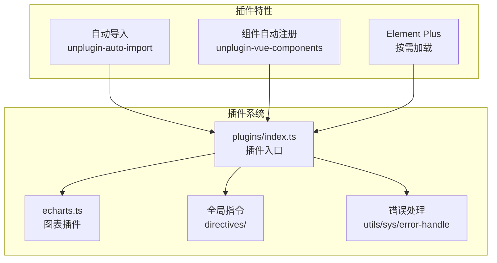
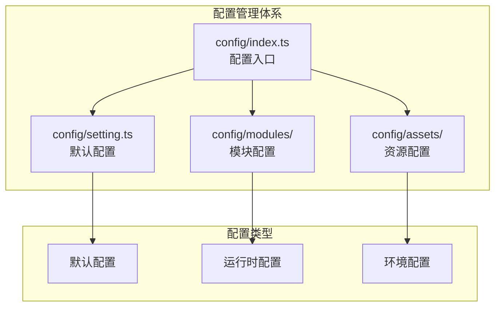

# Art Design Pro 核心架构文档

<cite>
**本文档引用的文件**
- [main.ts](file://src/main.ts)
- [App.vue](file://src/App.vue)
- [router/index.ts](file://src/router/index.ts)
- [store/index.ts](file://src/store/index.ts)
- [plugins/index.ts](file://src/plugins/index.ts)
- [components/core/layouts/art-header-bar/index.vue](file://src/components/core/layouts/art-header-bar/index.vue)
- [components/core/layouts/art-page-content/index.vue](file://src/components/core/layouts/art-page-content/index.vue)
- [components/core/layouts/art-menus/art-sidebar-menu/index.vue](file://src/components/core/layouts/art-menus/art-sidebar-menu/index.vue)
- [store/modules/user.ts](file://src/store/modules/user.ts)
- [store/modules/setting.ts](file://src/store/modules/setting.ts)
- [hooks/core/useAuth.ts](file://src/hooks/core/useAuth.ts)
- [hooks/core/useCommon.ts](file://src/hooks/core/useCommon.ts)
- [utils/sys/mittBus.ts](file://src/utils/sys/mittBus.ts)
- [package.json](file://package.json)
</cite>

## 目录
1. [项目概述](#项目概述)
2. [应用初始化流程](#应用初始化流程)
3. [MVVM架构模式](#mvvm架构模式)
4. [组合式API实现机制](#组合式api实现机制)
5. [核心布局组件](#核心布局组件)
6. [状态管理架构](#状态管理架构)
7. [组件通信机制](#组件通信机制)
8. [路由系统设计](#路由系统设计)
9. [插件生态系统](#插件生态系统)
10. [架构设计原则](#架构设计原则)
11. [性能优化策略](#性能优化策略)
12. [总结](#总结)

## 项目概述

Art Design Pro是一个基于Vue 3 + TypeScript + Vite构建的企业级后台管理系统，采用现代化的MVVM架构模式和组合式API开发方式。项目遵循模块化、组件化的设计理念，提供了完整的布局解决方案和丰富的业务组件库。

### 技术栈概览

**图表来源**
- [package.json](file://package.json#L54-L80)
- [main.ts](file://src/main.ts#L1-L25)

## 应用初始化流程

### main.ts应用启动序列

应用的初始化过程遵循严格的顺序，确保各个模块能够正确加载和初始化。

**图表来源**
- [main.ts](file://src/main.ts#L18-L25)
- [store/index.ts](file://src/store/index.ts#L50-L53)
- [router/index.ts](file://src/router/index.ts#L15-L20)

### 初始化流程详解

1. **应用实例创建** (`createApp(App)`)
   - 创建Vue应用实例，传入根组件App.vue
   - 配置应用的基础配置选项

2. **状态管理初始化** (`initStore(app)`)
   - 创建Pinia实例
   - 配置持久化插件，支持localStorage存储
   - 设置版本化存储键管理

3. **路由系统初始化** (`initRouter(app)`)
   - 创建Vue Router实例，使用hash模式
   - 配置静态路由和动态路由
   - 设置路由守卫进行权限控制

4. **插件系统注册**
   - 注册全局指令
   - 配置错误处理机制
   - 加载第三方插件

**章节来源**
- [main.ts](file://src/main.ts#L1-L25)
- [store/index.ts](file://src/store/index.ts#L1-L53)
- [router/index.ts](file://src/router/index.ts#L1-L24)

## MVVM架构模式

### Model-View-ViewModel三层架构

Art Design Pro严格遵循MVVM架构模式，实现了清晰的关注点分离：

**图表来源**
- [store/modules/user.ts](file://src/store/modules/user.ts#L1-L236)
- [store/modules/setting.ts](file://src/store/modules/setting.ts#L1-L451)
- [components/core/layouts/art-header-bar/index.vue](file://src/components/core/layouts/art-header-bar/index.vue#L1-L486)

### 数据绑定机制

项目采用双向数据绑定和响应式数据流：

1. **响应式数据源**
   - 使用`ref()`和`reactive()`创建响应式数据
   - 通过`computed()`创建计算属性
   - 利用`watch()`监听数据变化

2. **单向数据流**
   - 父组件通过props向下传递数据
   - 子组件通过emit向上发送事件
   - 全局状态通过Pinia进行统一管理

**章节来源**
- [App.vue](file://src/App.vue#L1-L35)
- [store/modules/user.ts](file://src/store/modules/user.ts#L50-L236)

## 组合式API实现机制

### 组合式函数设计模式

项目大量使用组合式API，通过自定义Hook实现逻辑复用：

**图表来源**
- [hooks/core/useAuth.ts](file://src/hooks/core/useAuth.ts#L43-L75)
- [hooks/core/useCommon.ts](file://src/hooks/core/useCommon.ts#L22-L88)

### 逻辑复用策略

1. **权限验证Hook** (`useAuth`)
   - 统一的权限检查机制
   - 支持前端和后端两种权限模式
   - 类型安全的权限标识

2. **通用功能Hook** (`useCommon`)
   - 页面刷新功能
   - 滚动控制方法
   - 路径获取工具

3. **主题管理Hook** (`useTheme`)
   - 主题初始化
   - 动画切换控制
   - 样式应用管理

**章节来源**
- [hooks/core/useAuth.ts](file://src/hooks/core/useAuth.ts#L1-L75)
- [hooks/core/useCommon.ts](file://src/hooks/core/useCommon.ts#L1-L88)

## 核心布局组件

### 布局架构设计

Art Design Pro采用灵活的布局架构，支持多种菜单布局模式：

**图表来源**
- [App.vue](file://src/App.vue#L1-L35)
- [components/core/layouts/art-header-bar/index.vue](file://src/components/core/layouts/art-header-bar/index.vue#L1-L486)
- [components/core/layouts/art-page-content/index.vue](file://src/components/core/layouts/art-page-content/index.vue#L1-L137)

### 布局组件职责分工

1. **art-header-bar (顶部栏)**
   - 用户身份验证和登出
   - 系统设置和主题切换
   - 全局搜索和通知功能
   - 语言切换和全屏控制

2. **art-sidebar-menu (侧边栏菜单)**
   - 一级菜单导航
   - 二级菜单展开控制
   - 菜单主题样式管理
   - 移动端菜单适配

3. **art-page-content (页面内容)**
   - 路由视图渲染
   - 页面缓存管理
   - 过渡动画控制
   - 全屏模式支持

**章节来源**
- [components/core/layouts/art-header-bar/index.vue](file://src/components/core/layouts/art-header-bar/index.vue#L1-L486)
- [components/core/layouts/art-menus/art-sidebar-menu/index.vue](file://src/components/core/layouts/art-menus/art-sidebar-menu/index.vue#L1-L356)
- [components/core/layouts/art-page-content/index.vue](file://src/components/core/layouts/art-page-content/index.vue#L1-L137)

## 状态管理架构

### Pinia状态管理模块

项目采用Pinia作为状态管理解决方案，实现了模块化的状态管理：

**图表来源**
- [store/index.ts](file://src/store/index.ts#L25-L53)
- [store/modules/user.ts](file://src/store/modules/user.ts#L50-L236)
- [store/modules/setting.ts](file://src/store/modules/setting.ts#L47-L451)

### 状态模块职责

1. **用户状态模块** (`user.ts`)
   - 用户认证信息管理
   - 登录状态控制
   - 语言设置和搜索历史
   - 锁屏功能支持

2. **系统设置模块** (`setting.ts`)
   - 菜单布局配置
   - 主题和样式设置
   - 功能开关控制
   - 用户偏好管理

3. **菜单状态模块** (`menu.ts`)
   - 菜单数据管理
   - 路由权限控制
   - 菜单激活状态
   - 首页路径配置

**章节来源**
- [store/modules/user.ts](file://src/store/modules/user.ts#L1-L236)
- [store/modules/setting.ts](file://src/store/modules/setting.ts#L1-L451)

## 组件通信机制

### 多层次通信体系

项目建立了完善的组件通信机制，支持不同层次的数据交换：

**图表来源**
- [utils/sys/mittBus.ts](file://src/utils/sys/mittBus.ts#L1-L64)
- [components/core/layouts/art-header-bar/index.vue](file://src/components/core/layouts/art-header-bar/index.vue#L297-L343)

### 通信机制详解

1. **Props/Emits通信**
   - 父子组件间的数据传递
   - 事件回调和状态更新
   - 类型安全的接口定义

2. **事件总线机制** (`mittBus`)
   - 跨层级组件通信
   - 全局功能触发
   - 解耦组件间的直接依赖

3. **Pinia状态共享**
   - 全局状态管理
   - 组件间数据同步
   - 持久化状态存储

**章节来源**
- [utils/sys/mittBus.ts](file://src/utils/sys/mittBus.ts#L1-L64)
- [components/core/layouts/art-header-bar/index.vue](file://src/components/core/layouts/art-header-bar/index.vue#L297-L343)

## 路由系统设计

### 路由架构和权限控制

项目实现了完善的路由系统，支持动态路由和权限控制：

**图表来源**
- [router/index.ts](file://src/router/index.ts#L1-L24)

### 路由守卫机制

1. **前置守卫** (`beforeEach`)
   - 用户认证检查
   - 权限验证
   - 路由白名单校验

2. **后置守卫** (`afterEach`)
   - 页面标题更新
   - 进度条控制
   - 访问统计

**章节来源**
- [router/index.ts](file://src/router/index.ts#L1-L24)

## 插件生态系统

### 插件架构设计

项目采用插件化架构，支持第三方库的统一管理和配置：

**图表来源**
- [plugins/index.ts](file://src/plugins/index.ts#L1-L7)

### 插件功能特性

1. **ECharts图表插件**
   - 图表组件封装
   - 主题配置支持
   - 响应式图表

2. **全局指令系统**
   - 权限指令
   - 角色指令
   - 业务指令

3. **错误处理机制**
   - 全局错误捕获
   - 错误上报
   - 友好提示

**章节来源**
- [plugins/index.ts](file://src/plugins/index.ts#L1-L7)

## 架构设计原则

### 可维护性设计

项目遵循以下架构设计原则：

1. **单一职责原则**
   - 每个模块专注特定功能
   - 组件职责明确划分
   - Hook功能单一抽象

2. **开放封闭原则**
   - 对扩展开放
   - 对修改封闭
   - 插件化架构支持功能扩展

3. **依赖倒置原则**
   - 依赖抽象而非具体
   - 通过接口解耦
   - 组件间松耦合

### 配置集中化管理

**图表来源**
- [config/setting.ts](file://src/config/setting.ts)
- [config/index.ts](file://src/config/index.ts)

## 性能优化策略

### 渲染性能优化

1. **组件懒加载**
   - 路由级别的代码分割
   - 组件级别的动态导入
   - 按需加载减少初始包大小

2. **虚拟滚动**
   - 大数据量表格优化
   - 列表组件性能提升
   - 内存占用控制

3. **缓存策略**
   - KeepAlive组件缓存
   - 路由缓存管理
   - 数据缓存机制

### 状态管理优化

1. **状态分片**
   - 模块化状态管理
   - 避免全局状态污染
   - 局部状态优化

2. **持久化策略**
   - 智能存储键管理
   - 版本化数据迁移
   - 存储空间优化

## 总结

Art Design Pro展现了现代Vue 3应用的最佳实践，通过MVVM架构模式和组合式API的完美结合，构建了一个高度模块化、可维护性强的企业级后台管理系统。

### 核心优势

1. **架构清晰** - MVVM模式确保了关注点分离
2. **开发高效** - 组合式API提升了开发效率
3. **易于维护** - 模块化设计降低了维护成本
4. **性能优秀** - 多层次优化保证了应用性能
5. **扩展性强** - 插件化架构支持功能扩展

### 最佳实践总结

1. **合理使用组合式API** - 通过Hook实现逻辑复用
2. **模块化状态管理** - Pinia的正确使用
3. **完善的通信机制** - 多层次组件通信
4. **严格的权限控制** - 路由守卫和权限Hook
5. **性能优先设计** - 从架构层面考虑性能

这个架构为大型Vue应用提供了优秀的参考范例，展示了如何在保持代码质量的同时实现复杂的功能需求。