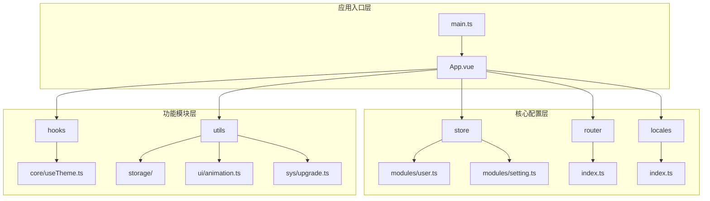
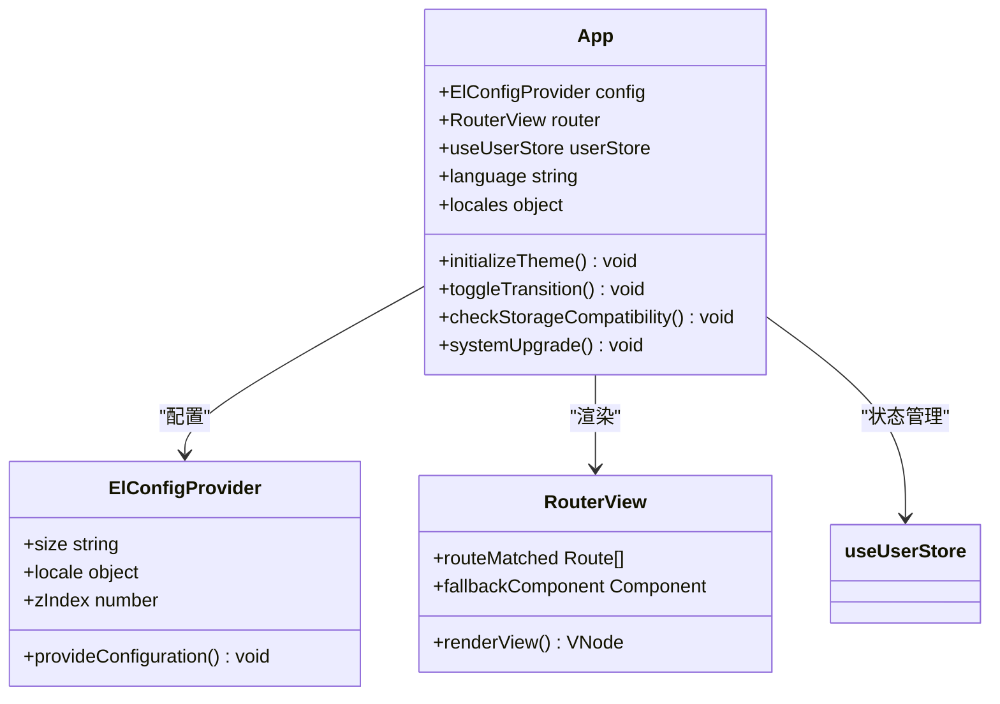
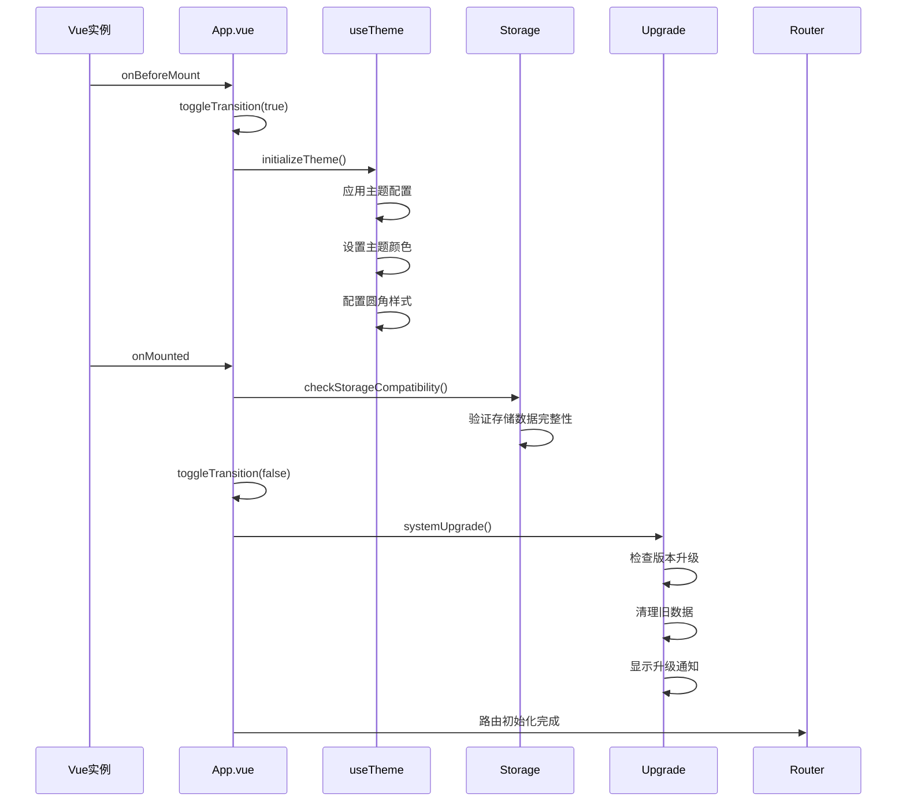
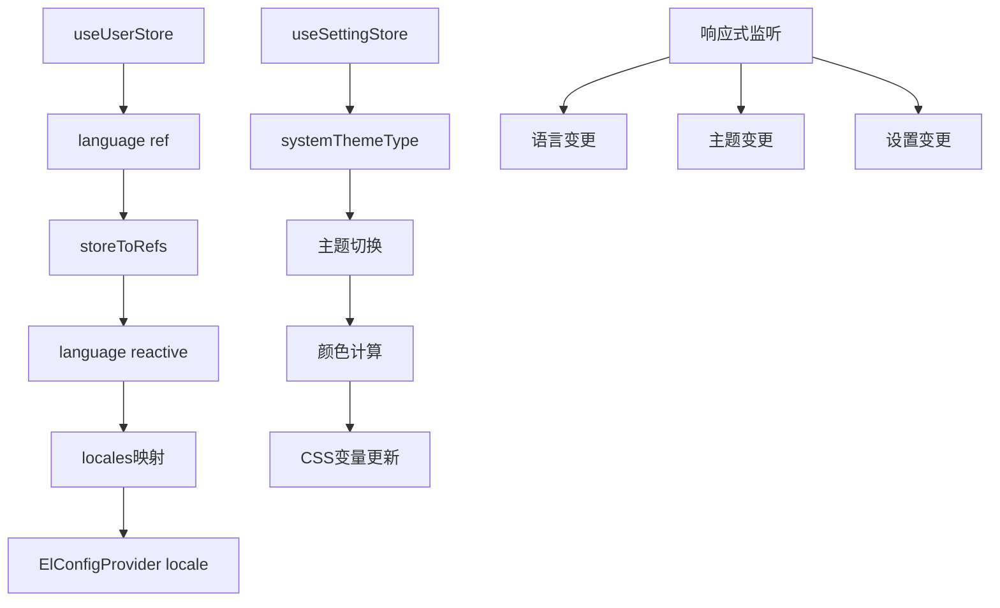
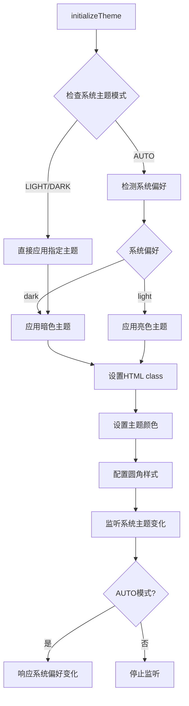
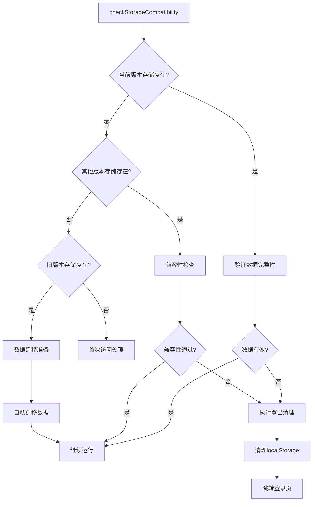
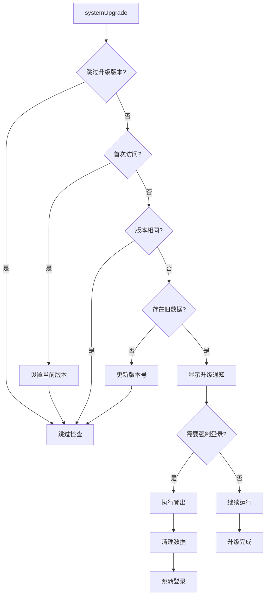
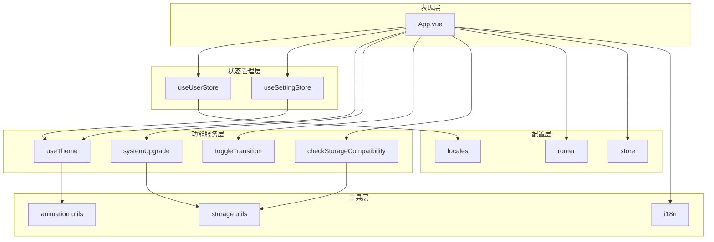

# 根组件设计

<cite>
**本文档中引用的文件**
- [App.vue](file://src/App.vue)
- [main.ts](file://src/main.ts)
- [store/index.ts](file://src/store/index.ts)
- [router/index.ts](file://src/router/index.ts)
- [hooks/core/useTheme.ts](file://src/hooks/core/useTheme.ts)
- [store/modules/user.ts](file://src/store/modules/user.ts)
- [store/modules/setting.ts](file://src/store/modules/setting.ts)
- [utils/storage/index.ts](file://src/utils/storage/index.ts)
- [utils/sys/upgrade.ts](file://src/utils/sys/upgrade.ts)
- [utils/ui/animation.ts](file://src/utils/ui/animation.ts)
- [locales/index.ts](file://src/locales/index.ts)
</cite>

## 目录
1. [简介](#简介)
2. [项目结构概览](#项目结构概览)
3. [核心组件分析](#核心组件分析)
4. [架构设计](#架构设计)
5. [详细组件分析](#详细组件分析)
6. [依赖关系分析](#依赖关系分析)
7. [性能考虑](#性能考虑)
8. [故障排除指南](#故障排除指南)
9. [结论](#结论)

## 简介

Art Design Pro的根组件App.vue作为整个Vue应用的顶层容器，承担着应用初始化、主题管理、国际化配置和路由渲染的核心职责。该组件巧妙地整合了Element Plus的配置提供者、Vue Router的视图渲染机制，以及基于Pinia的状态管理系统，形成了一个高度集成且响应式的应用架构。

本文档将深入分析App.vue的设计理念、核心功能实现，以及它如何与其他核心模块协同工作，为开发者提供全面的技术参考。

## 项目结构概览

Art Design Pro采用现代化的Vue 3 + TypeScript架构，具有清晰的模块化组织结构：

**图表来源**
- [main.ts](file://src/main.ts#L1-L25)
- [App.vue](file://src/App.vue#L1-L35)

**章节来源**
- [main.ts](file://src/main.ts#L1-L25)
- [App.vue](file://src/App.vue#L1-L35)

## 核心组件分析

### App.vue作为应用顶层容器

App.vue作为Vue应用的根组件，其设计体现了单一职责原则和组合模式的最佳实践：

**图表来源**
- [App.vue](file://src/App.vue#L2-L4)
- [store/modules/user.ts](file://src/store/modules/user.ts#L50-L236)

### ElConfigProvider配置机制

ElConfigProvider组件提供了全局的Element Plus配置，实现了统一的组件库配置管理：

| 配置项 | 类型 | 默认值 | 说明 |
|--------|------|--------|------|
| size | string | "default" | 组件尺寸配置，支持 default、small、large |
| locale | object | locales[language] | 国际化语言配置，动态切换中英文 |
| z-index | number | 3000 | 全局z-index层级，防止组件堆叠冲突 |

**章节来源**
- [App.vue](file://src/App.vue#L2-L4)

## 架构设计

### 生命周期钩子执行流程

App.vue的生命周期钩子精心设计，确保应用初始化的顺序性和一致性：

**图表来源**
- [App.vue](file://src/App.vue#L24-L33)
- [hooks/core/useTheme.ts](file://src/hooks/core/useTheme.ts#L129-L174)

### 响应式状态绑定机制

App.vue通过Pinia store实现了响应式的状态管理：

**图表来源**
- [App.vue](file://src/App.vue#L16-L18)
- [store/modules/user.ts](file://src/store/modules/user.ts#L54-L99)

**章节来源**
- [App.vue](file://src/App.vue#L24-L33)
- [hooks/core/useTheme.ts](file://src/hooks/core/useTheme.ts#L129-L174)

## 详细组件分析

### 主题初始化机制

initializeTheme函数负责应用启动时的主题配置，确保用户偏好的主题设置得到正确应用：

**图表来源**
- [hooks/core/useTheme.ts](file://src/hooks/core/useTheme.ts#L129-L174)

### 过渡动画控制系统

toggleTransition函数实现了主题切换时的平滑过渡效果：

| 参数 | 类型 | 说明 |
|------|------|------|
| enable | boolean | 是否启用过渡效果 |
| 临时禁用 | CSS类 | theme-change |
| 过渡时间 | 300ms | 自动移除过渡类 |

**章节来源**
- [hooks/core/useTheme.ts](file://src/hooks/core/useTheme.ts#L129-L174)
- [utils/ui/animation.ts](file://src/utils/ui/animation.ts#L66-L81)

### 存储兼容性检查机制

checkStorageCompatibility函数确保应用启动时的存储数据完整性：

**图表来源**
- [utils/storage/storage.ts](file://src/utils/storage/storage.ts#L136-L217)

### 系统升级检测流程

systemUpgrade函数处理应用版本升级的各种场景：

**图表来源**
- [utils/sys/upgrade.ts](file://src/utils/sys/upgrade.ts#L232-L277)

**章节来源**
- [utils/storage/storage.ts](file://src/utils/storage/storage.ts#L136-L217)
- [utils/sys/upgrade.ts](file://src/utils/sys/upgrade.ts#L232-L277)

## 依赖关系分析

### 组件依赖关系图

App.vue与各个核心模块之间的依赖关系展现了清晰的分层架构：

**图表来源**
- [App.vue](file://src/App.vue#L8-L14)
- [store/index.ts](file://src/store/index.ts#L30-L53)
- [router/index.ts](file://src/router/index.ts#L8-L24)

### 模块间协作模式

各模块通过明确的接口和事件机制实现松耦合协作：

| 模块 | 职责 | 接口 | 事件 |
|------|------|------|------|
| App.vue | 应用容器 | 生命周期钩子 | 初始化事件 |
| useUserStore | 用户状态 | 语言、登录状态 | 状态变更 |
| useSettingStore | 系统设置 | 主题、界面配置 | 设置更新 |
| useTheme | 主题管理 | 主题切换 | 主题变更 |
| Router | 路由管理 | 视图渲染 | 路由变化 |

**章节来源**
- [App.vue](file://src/App.vue#L8-L14)
- [store/modules/user.ts](file://src/store/modules/user.ts#L50-L236)
- [store/modules/setting.ts](file://src/store/modules/setting.ts#L47-L451)

## 性能考虑

### 初始化性能优化

App.vue的初始化过程经过精心优化，确保应用启动的高效性：

- **异步处理**：systemUpgrade采用setTimeout延迟执行，避免阻塞主线程
- **条件检查**：存储兼容性检查只在必要时执行，减少不必要的计算
- **资源预加载**：主题初始化在onBeforeMount阶段完成，确保首屏渲染质量

### 内存管理策略

- **响应式清理**：生命周期钩子确保组件卸载时清理相关资源
- **存储优化**：版本化存储键管理避免数据冗余
- **缓存控制**：合理使用CSS变量缓存主题相关计算结果

## 故障排除指南

### 常见问题及解决方案

| 问题类型 | 症状 | 可能原因 | 解决方案 |
|----------|------|----------|----------|
| 主题不生效 | 界面颜色异常 | 主题初始化失败 | 检查initializeTheme调用 |
| 语言切换失效 | 界面语言未更新 | 语言状态未绑定 | 验证storeToRefs使用 |
| 存储异常 | 数据丢失或错误 | 存储兼容性问题 | 执行checkStorageCompatibility |
| 升级流程卡住 | 无法进入应用 | 版本升级处理失败 | 检查systemUpgrade逻辑 |

### 调试技巧

1. **开发工具监控**：使用Vue DevTools观察store状态变化
2. **控制台日志**：关注关键函数的执行日志输出
3. **网络检查**：验证升级日志等外部资源加载情况
4. **存储检查**：确认localStorage中的版本信息和数据结构

**章节来源**
- [utils/storage/storage.ts](file://src/utils/storage/storage.ts#L136-L217)
- [utils/sys/upgrade.ts](file://src/utils/sys/upgrade.ts#L232-L277)

## 结论

Art Design Pro的根组件App.vue展现了现代前端应用架构的最佳实践。通过精心设计的生命周期管理、响应式状态绑定、以及与核心模块的深度集成，它成功构建了一个稳定、高效且易于维护的应用基础框架。

该设计的核心优势包括：

- **模块化架构**：清晰的职责分离和依赖管理
- **响应式设计**：基于Vue 3的响应式特性和组合式API
- **状态管理**：基于Pinia的集中式状态管理
- **国际化支持**：灵活的语言切换机制
- **主题系统**：完整的主题管理和切换功能
- **存储兼容性**：智能的数据迁移和兼容性检查

这种设计不仅确保了应用的稳定性和可维护性，还为未来的功能扩展提供了良好的基础架构支持。对于希望构建高质量Vue应用的开发者而言，App.vue的设计模式和实现细节具有重要的参考价值。