# Pinia状态管理集成

<cite>
**本文档中引用的文件**
- [src/store/index.ts](file://src/store/index.ts)
- [src/store/modules/user.ts](file://src/store/modules/user.ts)
- [src/store/modules/menu.ts](file://src/store/modules/menu.ts)
- [src/store/modules/worktab.ts](file://src/store/modules/worktab.ts)
- [src/store/modules/setting.ts](file://src/store/modules/setting.ts)
- [src/utils/storage/storage-key-manager.ts](file://src/utils/storage/storage-key-manager.ts)
- [src/utils/storage/storage-config.ts](file://src/utils/storage/storage-config.ts)
- [src/App.vue](file://src/App.vue)
- [src/components/core/layouts/art-header-bar/index.vue](file://src/components/core/layouts/art-header-bar/index.vue)
- [src/components/core/layouts/art-global-search/index.vue](file://src/components/core/layouts/art-global-search/index.vue)
- [src/utils/sys/mittBus.ts](file://src/utils/sys/mittBus.ts)
</cite>

## 目录
1. [简介](#简介)
2. [项目架构概览](#项目架构概览)
3. [核心模块分析](#核心模块分析)
4. [storeToRefs响应式数据同步](#storetorefs响应式数据同步)
5. [模块化Store设计](#模块化store设计)
6. [持久化策略](#持久化策略)
7. [状态订阅与事件通信](#状态订阅与事件通信)
8. [最佳实践](#最佳实践)
9. [性能优化](#性能优化)
10. [常见问题排查](#常见问题排查)
11. [Vuex迁移对比](#vuex迁移对比)

## 简介

Art Design Pro采用Pinia作为集中式状态管理解决方案，提供了完整的响应式状态管理架构。该系统基于Vue3 Composition API深度集成，实现了用户信息、菜单状态、工作标签、系统设置等核心功能的状态管理。

Pinia在Art Design Pro中的核心优势包括：
- **TypeScript友好**：完整的类型推导和IDE支持
- **开发体验优秀**：时间旅行调试、热重载
- **模块化设计**：清晰的职责分离和可维护性
- **持久化支持**：自动数据持久化和跨版本迁移
- **响应式集成**：与Vue3 Composition API无缝结合

## 项目架构概览

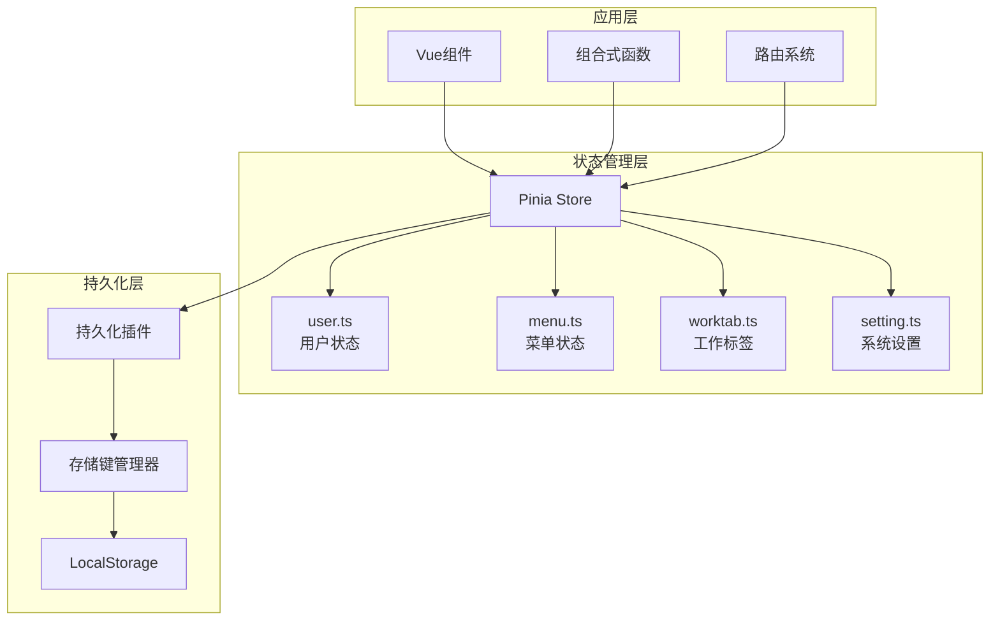

**图表来源**
- [src/store/index.ts](file://src/store/index.ts#L30-L52)
- [src/store/modules/user.ts](file://src/store/modules/user.ts#L50-L236)
- [src/store/modules/menu.ts](file://src/store/modules/menu.ts#L41-L110)
- [src/store/modules/worktab.ts](file://src/store/modules/worktab.ts#L56-L569)
- [src/store/modules/setting.ts](file://src/store/modules/setting.ts#L47-L451)

**章节来源**
- [src/store/index.ts](file://src/store/index.ts#L1-L52)

## 核心模块分析

### 用户状态管理 (user.ts)

用户状态管理负责维护用户的登录状态、个人信息、令牌信息等核心数据。

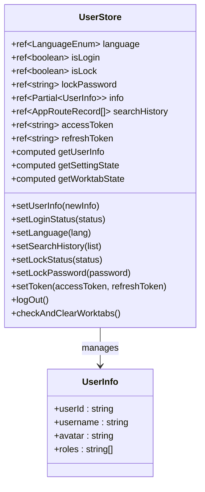

**图表来源**
- [src/store/modules/user.ts](file://src/store/modules/user.ts#L53-L236)

**主要功能**：
- 用户登录状态管理
- 用户信息存储和更新
- 访问令牌和刷新令牌管理
- 语言设置和切换
- 搜索历史记录
- 锁屏状态和密码管理
- 登出时的自动清理逻辑

**章节来源**
- [src/store/modules/user.ts](file://src/store/modules/user.ts#L1-L236)

### 菜单状态管理 (menu.ts)

菜单状态管理负责动态菜单的加载、路由注册和管理。

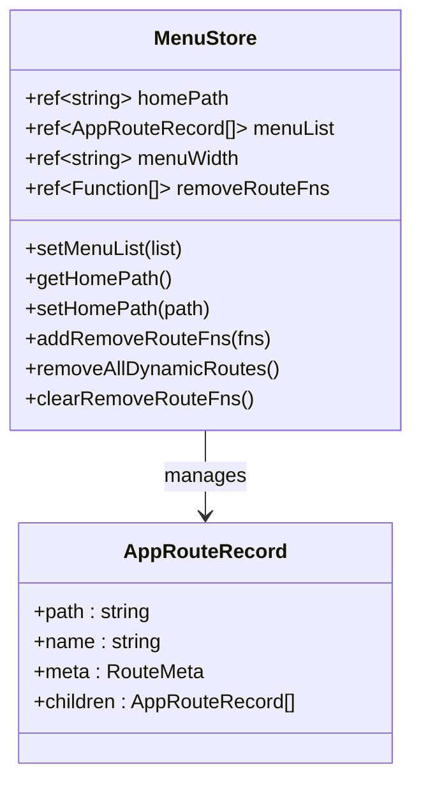

**图表来源**
- [src/store/modules/menu.ts](file://src/store/modules/menu.ts#L41-L110)

**核心特性**：
- 动态菜单列表管理
- 首页路径配置
- 路由移除函数管理
- 菜单宽度配置
- 登出时的路由清理

**章节来源**
- [src/store/modules/menu.ts](file://src/store/modules/menu.ts#L1-L110)

### 工作标签状态管理 (worktab.ts)

工作标签管理提供了完整的多标签页功能，包括标签的打开、关闭、固定等功能。

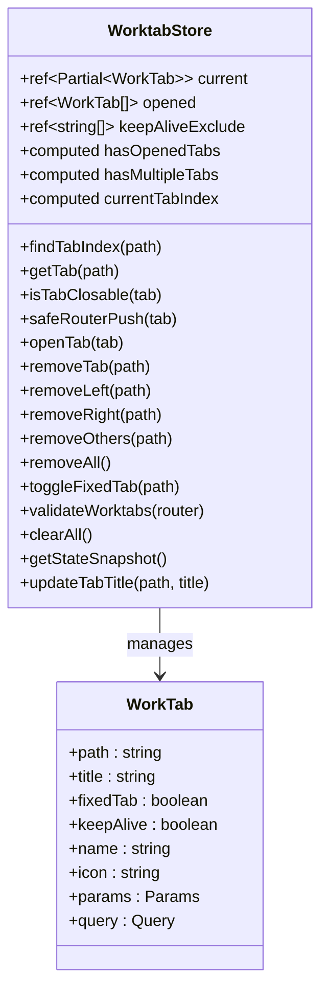

**图表来源**
- [src/store/modules/worktab.ts](file://src/store/modules/worktab.ts#L47-L569)

**核心功能**：
- 标签页的智能复用
- 固定标签页保护
- KeepAlive缓存排除管理
- 批量关闭操作
- 路由有效性验证

**章节来源**
- [src/store/modules/worktab.ts](file://src/store/modules/worktab.ts#L1-L569)

### 系统设置状态管理 (setting.ts)

系统设置管理涵盖了应用的所有界面配置和主题设置。

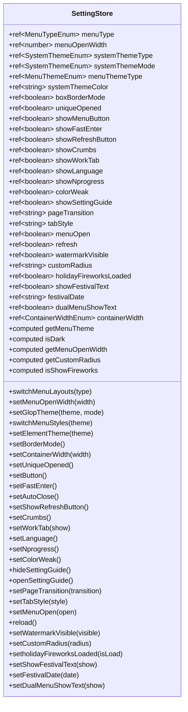

**图表来源**
- [src/store/modules/setting.ts](file://src/store/modules/setting.ts#L47-L451)

**配置范围**：
- 菜单布局配置（左侧、顶部、混合、双栏）
- 主题管理（亮色、暗色、自动）
- 界面显示开关
- 功能开关（手风琴模式、色弱模式、水印等）
- 样式配置（边框、圆角、容器宽度、页面过渡）

**章节来源**
- [src/store/modules/setting.ts](file://src/store/modules/setting.ts#L1-L451)

## storeToRefs响应式数据同步

`storeToRefs`是Pinia提供的核心API，用于将store中的响应式状态转换为普通的ref对象，确保在Composition API中获得最佳的响应式体验。

### 响应式数据同步机制

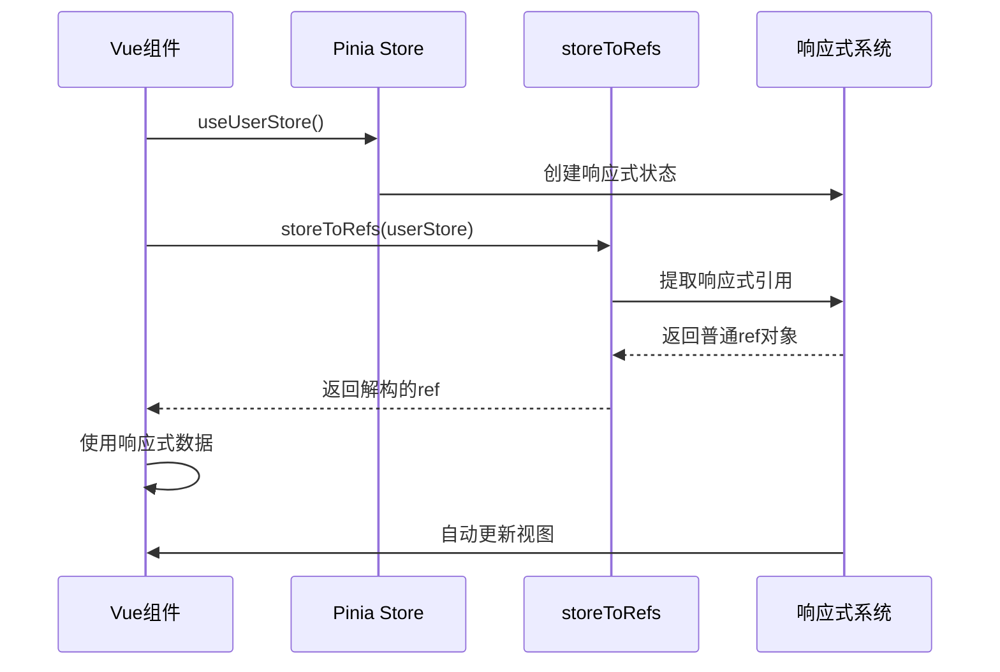

**图表来源**
- [src/App.vue](file://src/App.vue#L16-L17)
- [src/components/core/layouts/art-header-bar/index.vue](file://src/components/core/layouts/art-header-bar/index.vue#L217-L220)

### 实际使用示例

在Art Design Pro中，`storeToRefs`被广泛应用于各个组件中：

#### 应用级别使用
```typescript
// App.vue - 应用级别的语言响应式绑定
const userStore = useUserStore()
const { language } = storeToRefs(userStore)
```

#### 组件级别使用
```typescript
// 头部栏组件 - 多个store状态的响应式绑定
const settingStore = useSettingStore()
const userStore = useUserStore()
const menuStore = useMenuStore()

const { menuOpen, systemThemeColor, showSettingGuide, menuType, isDark, tabStyle } = 
  storeToRefs(settingStore)
const { language } = storeToRefs(userStore)
const { menuList } = storeToRefs(menuStore)
```

#### 搜索组件使用
```typescript
// 全局搜索组件 - 菜单和搜索历史的响应式绑定
const { menuList } = storeToRefs(useMenuStore())
const { searchHistory: historyResult } = storeToRefs(userStore)
```

### 与Vue3 Composition API的深度集成

`storeToRefs`与Vue3 Composition API的集成体现在以下几个方面：

1. **解构赋值支持**：可以像普通ref一样进行解构
2. **响应式追踪**：自动追踪状态变化
3. **模板绑定**：可以直接在模板中使用
4. **组合式函数**：可以在组合式函数中使用

**章节来源**
- [src/App.vue](file://src/App.vue#L1-L35)
- [src/components/core/layouts/art-header-bar/index.vue](file://src/components/core/layouts/art-header-bar/index.vue#L170-L220)
- [src/components/core/layouts/art-global-search/index.vue](file://src/components/core/layouts/art-global-search/index.vue#L96-L117)

## 模块化Store设计

Art Design Pro采用了高度模块化的Store设计，每个模块都有明确的职责划分和边界。

### 模块职责划分

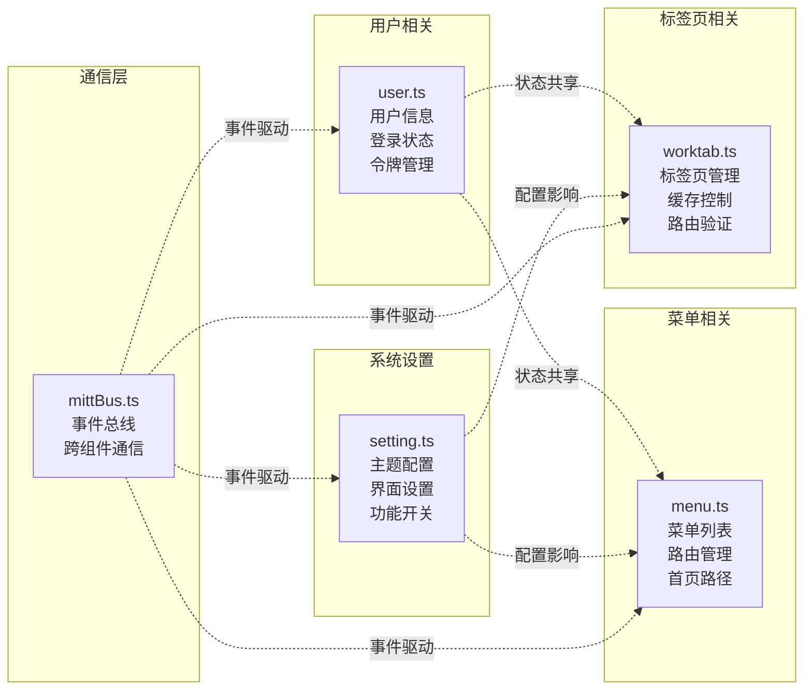

**图表来源**
- [src/store/modules/user.ts](file://src/store/modules/user.ts#L1-L30)
- [src/store/modules/menu.ts](file://src/store/modules/menu.ts#L1-L30)
- [src/store/modules/worktab.ts](file://src/store/modules/worktab.ts#L1-L35)
- [src/store/modules/setting.ts](file://src/store/modules/setting.ts#L1-L35)

### 相互协作方式

#### 1. 状态共享机制
- **计算属性依赖**：通过computed访问其他store的状态
- **模块间调用**：直接调用其他store的actions
- **事件通信**：通过mittBus进行松耦合通信

#### 2. 数据流设计
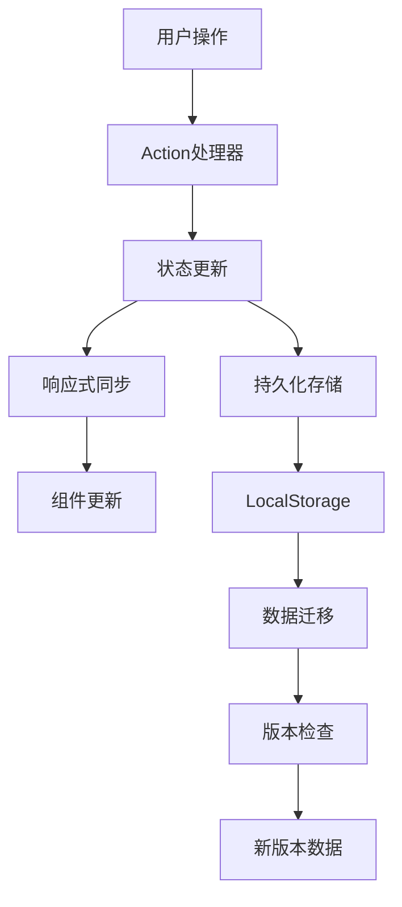

**图表来源**
- [src/store/modules/user.ts](file://src/store/modules/user.ts#L70-L76)
- [src/store/modules/worktab.ts](file://src/store/modules/worktab.ts#L432-L477)

### 模块间通信模式

#### 直接状态访问
```typescript
// 用户store中访问其他store的状态
const getUserInfo = computed(() => info.value)
const getSettingState = computed(() => useSettingStore().$state)
const getWorktabState = computed(() => useWorktabStore().$state)
```

#### 事件驱动通信
```typescript
// 通过mittBus进行跨模块通信
mittBus.emit('openSetting')  // 打开设置面板
mittBus.emit('openSearchDialog')  // 打开搜索对话框
```

**章节来源**
- [src/store/modules/user.ts](file://src/store/modules/user.ts#L70-L76)
- [src/store/modules/worktab.ts](file://src/store/modules/worktab.ts#L432-L477)
- [src/utils/sys/mittBus.ts](file://src/utils/sys/mittBus.ts#L1-L64)

## 持久化策略

Art Design Pro实现了完整的状态持久化策略，确保用户数据在页面刷新和浏览器重启后仍然可用。

### 持久化插件配置

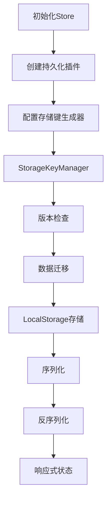

**图表来源**
- [src/store/index.ts](file://src/store/index.ts#L35-L45)
- [src/utils/storage/storage-key-manager.ts](file://src/utils/storage/storage-key-manager.ts#L80-L96)

### 版本化存储键管理

系统使用智能的版本化存储键管理，支持跨版本数据迁移：

#### 存储键格式
```
sys-v{version}-{storeId}
示例：sys-v1.0.0-user, sys-v1.0.0-setting
```

#### 数据迁移机制
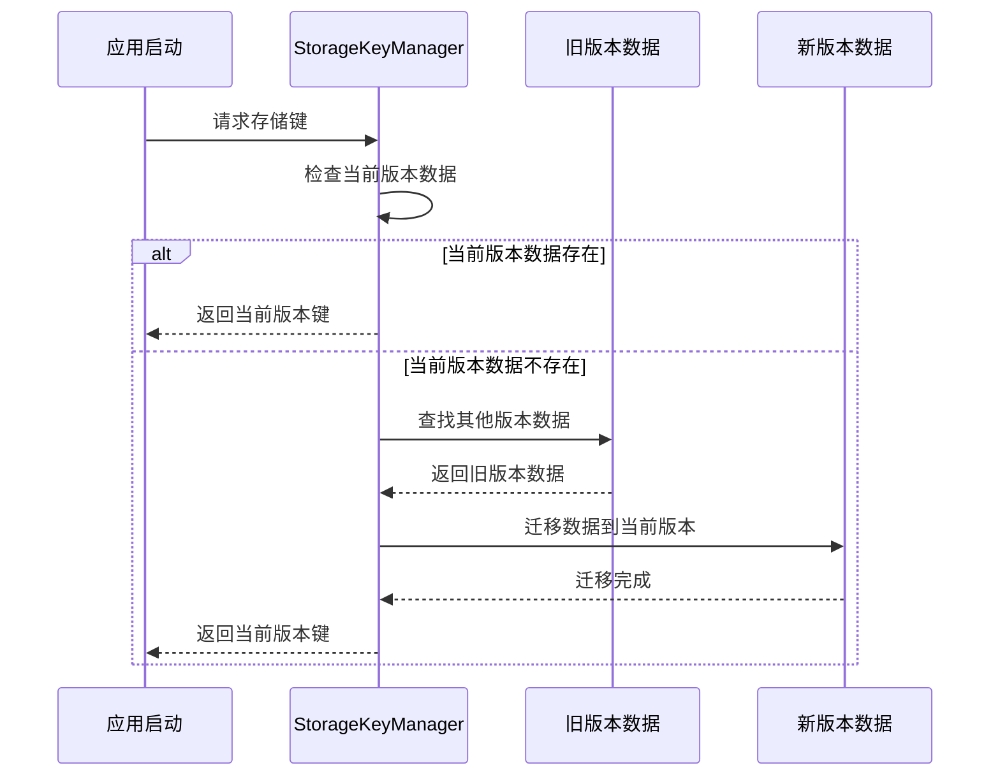

**图表来源**
- [src/utils/storage/storage-key-manager.ts](file://src/utils/storage/storage-key-manager.ts#L80-L96)

### 各模块持久化配置

#### 用户模块持久化
```typescript
{
  persist: {
    key: 'user',
    storage: localStorage
  }
}
```

#### 菜单模块持久化
```typescript
{
  persist: {
    key: 'menu',
    storage: localStorage
  }
}
```

#### 工作标签模块持久化
```typescript
{
  persist: {
    key: 'worktab',
    storage: localStorage
  }
}
```

#### 系统设置模块持久化
```typescript
{
  persist: {
    key: 'setting',
    storage: localStorage
  }
}
```

### 登出时的数据清理

系统在用户登出时会智能地清理相关数据：

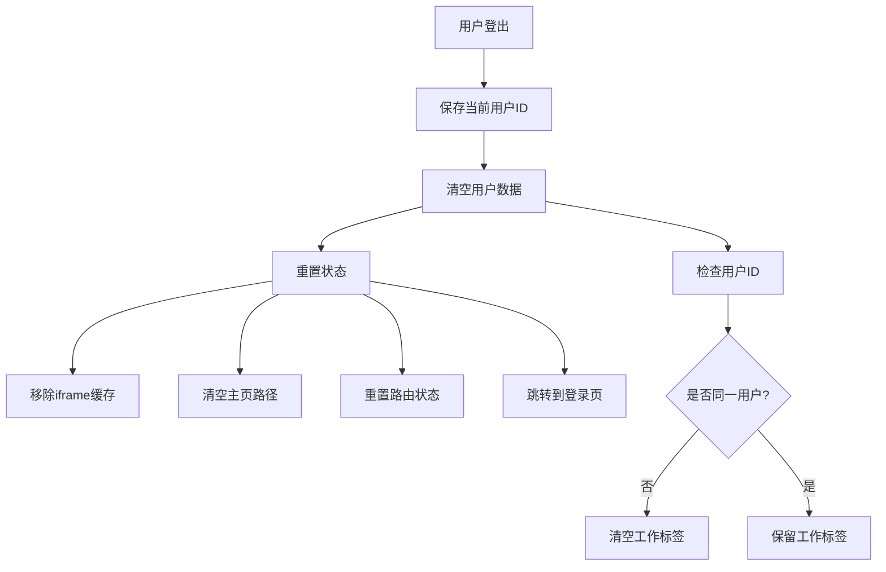

**图表来源**
- [src/store/modules/user.ts](file://src/store/modules/user.ts#L143-L175)

**章节来源**
- [src/store/index.ts](file://src/store/index.ts#L1-L52)
- [src/utils/storage/storage-key-manager.ts](file://src/utils/storage/storage-key-manager.ts#L1-L98)
- [src/utils/storage/storage-config.ts](file://src/utils/storage/storage-config.ts#L1-L123)
- [src/store/modules/user.ts](file://src/store/modules/user.ts#L143-L204)

## 状态订阅与事件通信

Art Design Pro采用了多层次的状态订阅和事件通信机制，确保组件间的高效协作。

### mittBus事件总线

系统使用基于mitt的类型安全事件总线进行全局通信：

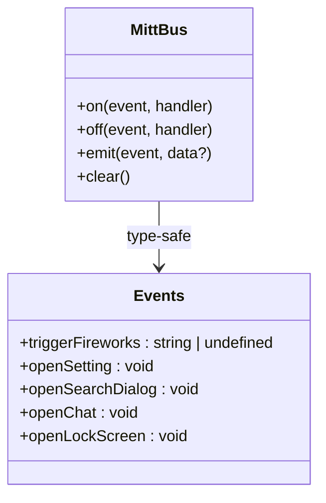

**图表来源**
- [src/utils/sys/mittBus.ts](file://src/utils/sys/mittBus.ts#L47-L58)

### 事件通信模式

#### 1. 组件间通信
```typescript
// 订阅事件
mittBus.on('openSetting', () => {
  // 打开设置面板逻辑
})

// 发布事件
mittBus.emit('openSetting')
```

#### 2. 跨层级通信
```typescript
// 子组件触发全局事件
mittBus.emit('triggerFireworks', imageUrl)

// 父组件监听特效事件
mittBus.on('triggerFireworks', (imageUrl) => {
  // 显示烟花特效
})
```

### 状态订阅最佳实践

#### 1. 响应式状态监听
```typescript
// 监听用户语言变化
watch(language, (newLang) => {
  // 更新UI语言
  updateUILanguage(newLang)
})

// 监听菜单状态变化
watch(menuOpen, (isOpen) => {
  // 调整布局
  adjustLayout(isOpen)
})
```

#### 2. 计算属性依赖
```typescript
// 基于多个store状态的计算属性
const isFeatureEnabled = computed(() => {
  return settingStore.showMenuButton && 
         userStore.isLogin && 
         menuStore.menuList.length > 0
})
```

#### 3. 生命周期管理
```typescript
// 组件挂载时订阅事件
onMounted(() => {
  mittBus.on('openSearchDialog', openSearchDialog)
})

// 组件卸载时清理订阅
onUnmounted(() => {
  mittBus.off('openSearchDialog', openSearchDialog)
})
```

### 事件驱动的工作流

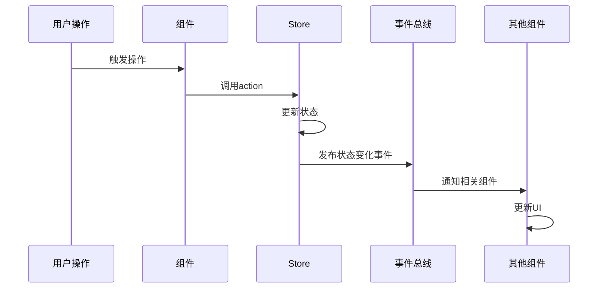

**章节来源**
- [src/utils/sys/mittBus.ts](file://src/utils/sys/mittBus.ts#L1-L64)
- [src/components/core/layouts/art-global-search/index.vue](file://src/components/core/layouts/art-global-search/index.vue#L125-L132)

## 最佳实践

### Store设计原则

#### 1. 单一职责原则
每个store模块只负责特定领域的状态管理：
- **user.ts**：用户相关状态
- **menu.ts**：菜单和路由状态  
- **worktab.ts**：标签页状态
- **setting.ts**：系统设置状态

#### 2. 状态规范化
```typescript
// 推荐：规范化状态结构
interface UserState {
  userInfo: UserInfo
  loginStatus: boolean
  tokens: Tokens
}

// 避免：扁平化过度的状态
interface BadUserState {
  userId: string
  username: string
  avatar: string
  isLoggedIn: boolean
  accessToken: string
  refreshToken: string
}
```

#### 3. 类型安全
```typescript
// 使用严格的类型定义
interface WorkTab {
  path: string
  title: string
  fixedTab?: boolean
  keepAlive?: boolean
  name?: string
  icon?: string
  params?: Params
  query?: Query
}

// 使用泛型确保类型安全
const useTypedStore = defineStore<'user', UserState, {}, Actions>(
  'user',
  () => ({/* state */}),
  { /* actions and getters */ }
)
```

### 性能优化实践

#### 1. 状态分割
```typescript
// 将大型状态分割为更小的部分
const useUserStore = defineStore('user', () => {
  // 用户基本信息
  const userInfo = ref<UserInfo>({ /* ... */ })
  
  // 用户偏好设置
  const preferences = ref<UserPreferences>({ /* ... */ })
  
  // 用户统计数据
  const stats = ref<UserStats>({ /* ... */ })
  
  return { userInfo, preferences, stats }
})
```

#### 2. 计算属性优化
```typescript
// 使用memoized计算属性
const getFilteredMenu = computedMemo(() => {
  return menuList.value.filter(item => !item.meta?.isHide)
})

// 避免在模板中使用复杂的计算
const complexCalculation = computed(() => {
  // 避免在这里执行复杂计算
  return heavyComputation(state.value)
})
```

#### 3. 响应式更新优化
```typescript
// 使用批量更新减少重渲染
const updateUserProfile = (updates: Partial<UserInfo>) => {
  // 批量更新避免多次触发响应式
  Object.assign(userInfo.value, updates)
}

// 使用深拷贝避免意外修改
const cloneState = () => {
  return JSON.parse(JSON.stringify(state.value))
}
```

### 错误处理最佳实践

#### 1. 状态验证
```typescript
const setUserProfile = (profile: UserInfo) => {
  // 验证输入数据
  if (!profile.userId) {
    throw new Error('用户ID不能为空')
  }
  
  // 验证数据完整性
  if (!isValidUserProfile(profile)) {
    throw new Error('用户资料格式不正确')
  }
  
  userInfo.value = profile
}
```

#### 2. 异常恢复
```typescript
const recoverFromError = (error: Error) => {
  // 记录错误
  console.error('状态恢复失败:', error)
  
  // 重置到安全状态
  resetToDefaultState()
  
  // 通知用户
  notifyUser('操作失败，请稍后重试')
}
```

#### 3. 网络状态处理
```typescript
const syncWithServer = async () => {
  try {
    const response = await api.syncUserData()
    mergeRemoteData(response.data)
  } catch (error) {
    // 网络错误时使用本地缓存
    useLocalBackup()
  }
}
```

### 测试策略

#### 1. 单元测试
```typescript
describe('UserStore', () => {
  let store: ReturnType<typeof useUserStore>
  
  beforeEach(() => {
    store = useUserStore()
  })
  
  it('should set user info correctly', () => {
    const userInfo = { userId: '1', username: 'test' }
    store.setUserInfo(userInfo)
    expect(store.userInfo).toEqual(userInfo)
  })
  
  it('should handle login/logout', () => {
    store.setLoginStatus(true)
    expect(store.isLogin).toBe(true)
    
    store.logOut()
    expect(store.isLogin).toBe(false)
  })
})
```

#### 2. 集成测试
```typescript
it('should synchronize state between stores', () => {
  const userStore = useUserStore()
  const settingStore = useSettingStore()
  
  userStore.setLanguage('en')
  expect(settingStore.language).toBe('en')
})
```

## 性能优化

### 状态更新优化

#### 1. 批量状态更新
```typescript
// 推荐：批量更新
const updateMultipleStates = () => {
  const batchUpdates = {
    menuOpen: true,
    showWorkTab: false,
    systemThemeType: 'dark'
  }
  
  Object.entries(batchUpdates).forEach(([key, value]) => {
    (settingStore as any)[key] = value
  })
}

// 避免：逐个更新
const updateSequentially = () => {
  settingStore.setMenuOpen(true)
  settingStore.setWorkTab(false)
  settingStore.setGlopTheme('dark', 'dark')
}
```

#### 2. 响应式粒度控制
```typescript
// 使用浅层响应式避免深层监听
const shallowState = shallowRef(initialValue)

// 对于大型数组使用代理优化
const optimizedArray = reactive({
  items: [] as LargeItemType[],
  get length() {
    return this.items.length
  }
})
```

### 内存管理优化

#### 1. 自动清理机制
```typescript
// 标签页过多时自动清理
const cleanupOldTabs = () => {
  if (worktabStore.opened.length > MAX_TABS) {
    const oldTabs = worktabStore.opened.slice(0, MAX_TABS - 10)
    oldTabs.forEach(tab => {
      worktabStore.removeTab(tab.path)
    })
  }
}
```

#### 2. 缓存策略
```typescript
// 智能缓存管理
const cacheManager = {
  maxSize: 100,
  cache: new Map(),
  
  set(key: string, value: any) {
    if (this.cache.size >= this.maxSize) {
      const firstKey = this.cache.keys().next().value
      this.cache.delete(firstKey)
    }
    this.cache.set(key, value)
  },
  
  get(key: string) {
    return this.cache.get(key)
  }
}
```

### 渲染性能优化

#### 1. 虚拟化长列表
```typescript
// 对于大量菜单项使用虚拟化
const virtualizedMenu = computed(() => {
  const visibleItems = menuList.value.slice(0, VISIBLE_ITEMS)
  return visibleItems
})
```

#### 2. 条件渲染优化
```typescript
// 延迟渲染非关键内容
const renderOptionalContent = computed(() => {
  return isFeatureEnabled.value ? 
    h(OptionalComponent) : 
    h('div', '功能未启用')
})
```

## 常见问题排查

### 状态丢失问题

#### 1. 检查持久化配置
```typescript
// 确认store配置了持久化
const useTestStore = defineStore('test', () => {
  const value = ref('')
  
  return {
    value,
    // 确保persist配置正确
  }
}, {
  persist: {
    key: 'test',
    storage: localStorage
  }
})
```

#### 2. 检查存储键冲突
```typescript
// 避免存储键冲突
const storeKey = computed(() => {
  return `${__APP_VERSION__}-${storeId}`
})
```

#### 3. 数据迁移问题
```typescript
// 检查数据迁移日志
console.log('Migration logs:', localStorage.getItem('migration_logs'))
```

### 响应式失效问题

#### 1. 检查引用更新
```typescript
// 正确更新对象
const updateObject = () => {
  // ✅ 使用Vue.set或直接赋值
  state.value.newProperty = 'value'
  
  // ❌ 避免直接修改属性
  // state.value['newProperty'] = 'value'
}

// 正确更新数组
const updateArray = () => {
  // ✅ 使用数组方法
  state.value.items.push(newItem)
  
  // ❌ 避免直接替换整个数组
  // state.value.items = [...state.value.items, newItem]
}
```

#### 2. 检查计算属性依赖
```typescript
// 确保计算属性正确依赖
const computedValue = computed(() => {
  // 确保访问所有依赖的属性
  return store.someState.property + localState.value
})
```

### 性能问题诊断

#### 1. 状态更新频率监控
```typescript
// 监控状态更新频率
let updateCount = 0
const monitorUpdates = () => {
  updateCount++
  if (updateCount % 100 === 0) {
    console.warn(`状态更新过于频繁: ${updateCount}次`)
  }
}
```

#### 2. 内存泄漏检测
```typescript
// 检测内存泄漏
const detectMemoryLeak = () => {
  const initialMemory = performance.memory?.usedJSHeapSize || 0
  
  setInterval(() => {
    const currentMemory = performance.memory?.usedJSHeapSize || 0
    const memoryDiff = currentMemory - initialMemory
    
    if (memoryDiff > THRESHOLD) {
      console.warn('检测到内存增长:', memoryDiff)
    }
  }, 1000)
}
```

### 调试技巧

#### 1. 状态快照
```typescript
// 创建状态快照用于调试
const createStateSnapshot = () => {
  return {
    timestamp: Date.now(),
    user: userStore.$state,
    menu: menuStore.$state,
    worktab: worktabStore.$state,
    setting: settingStore.$state
  }
}
```

#### 2. 时间旅行调试
```typescript
// 启用时间旅行调试
const enableDevTools = () => {
  if (process.env.NODE_ENV === 'development') {
    window.__PINIA_DEVTOOLS__ = true
  }
}
```

## Vuex迁移对比

### 架构差异

#### Pinia vs Vuex：设计理念对比

| 特性 | Pinia | Vuex |
|------|-------|------|
| 类型支持 | 完整TypeScript支持 | 有限的TypeScript支持 |
| 开发体验 | 时间旅行调试、热重载 | 有限的调试支持 |
| API设计 | Composition API友好 | Options API为主 |
| 模块化 | 自然的模块化 | 需要手动模块化 |
| 持久化 | 内置插件支持 | 需要额外库 |

#### 迁移优势

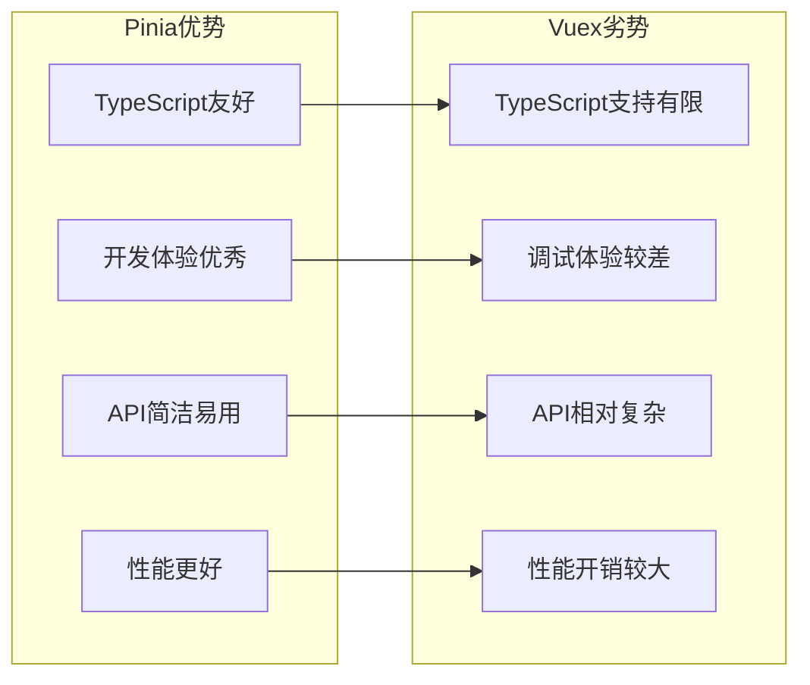

### 迁移步骤

#### 1. 环境准备
```bash
# 安装Pinia
npm install pinia

# 移除Vuex
npm uninstall vuex@4
```

#### 2. Store重构
```typescript
// Vuex Store
export const useVuexStore = () => useStore()

// Pinia Store
export const usePiniaStore = () => useUserStore()
```

#### 3. 组件适配
```typescript
// Vuex使用方式
computed: {
  user() {
    return this.$store.state.user
  }
}

// Pinia使用方式
const userStore = useUserStore()
const { user } = storeToRefs(userStore)
```

#### 4. 持久化迁移
```typescript
// Vuex持久化
plugins: [createPersistedState()]

// Pinia持久化
store.use(createPersistedState({
  key: (storeId) => `app-${storeId}`,
  storage: localStorage
}))
```

### 迁移收益

#### 1. 开发效率提升
- 更好的TypeScript支持
- 更直观的API设计
- 更优秀的开发工具支持

#### 2. 代码质量改善
- 更清晰的模块边界
- 更少的样板代码
- 更好的类型推导

#### 3. 性能优化
- 减少不必要的响应式开销
- 更高效的状态更新
- 更小的包体积

### 迁移注意事项

#### 1. 数据结构兼容性
```typescript
// 确保数据结构兼容
const migrateState = (oldState) => ({
  ...oldState,
  // 调整字段名或结构
})
```

#### 2. 事件处理调整
```typescript
// Vuex mutations
commit('SET_USER', user)

// Pinia actions
userStore.setUser(user)
```

#### 3. 测试用例更新
```typescript
// 更新测试断言
expect(store.state.user).toEqual(expectedUser)
// VS
expect(userStore.user).toEqual(expectedUser)
```

**章节来源**
- [src/store/index.ts](file://src/store/index.ts#L1-L52)
- [src/utils/sys/mittBus.ts](file://src/utils/sys/mittBus.ts#L1-L64)