# 事件总线通信模式

<cite>
**本文档引用的文件**
- [mittBus.ts](file://src/utils/sys/mittBus.ts)
- [art-header-bar/index.vue](file://src/components/core/layouts/art-header-bar/index.vue)
- [art-settings-panel/index.vue](file://src/components/core/layouts/art-settings-panel/index.vue)
- [art-fireworks-effect/index.vue](file://src/components/core/layouts/art-fireworks-effect/index.vue)
- [art-global-search/index.vue](file://src/components/core/layouts/art-global-search/index.vue)
- [useSettingsPanel.ts](file://src/components/core/layouts/art-settings-panel/composables/useSettingsPanel.ts)
- [useSettingsHandlers.ts](file://src/components/core/layouts/art-settings-panel/composables/useSettingsHandlers.ts)
- [useCeremony.ts](file://src/hooks/core/useCeremony.ts)
- [widgets-fireworks/index.vue](file://src/views/widgets/fireworks/index.vue)
- [festival.ts](file://src/config/modules/festival.ts)
</cite>

## 目录
1. [简介](#简介)
2. [项目架构概览](#项目架构概览)
3. [核心组件分析](#核心组件分析)
4. [事件总线系统详解](#事件总线系统详解)
5. [实际应用场景](#实际应用场景)
6. [最佳实践指南](#最佳实践指南)
7. [常见问题与解决方案](#常见问题与解决方案)
8. [性能优化建议](#性能优化建议)
9. [故障排除指南](#故障排除指南)
10. [总结](#总结)

## 简介

事件总线（Event Bus）是一种基于发布/订阅模式的通信机制，它允许应用程序中的不同组件之间进行松耦合的通信。在本项目中，我们基于mitt库构建了一个类型安全的全局事件系统，实现了跨层级组件间的解耦通信。

### 核心特性

- **类型安全**：基于TypeScript的强类型事件定义
- **全局通信**：支持任意组件间的跨层级通信
- **解耦设计**：避免复杂的props层层传递
- **高性能**：基于mitt库的轻量级实现
- **易于调试**：完整的事件监听和调试支持

## 项目架构概览

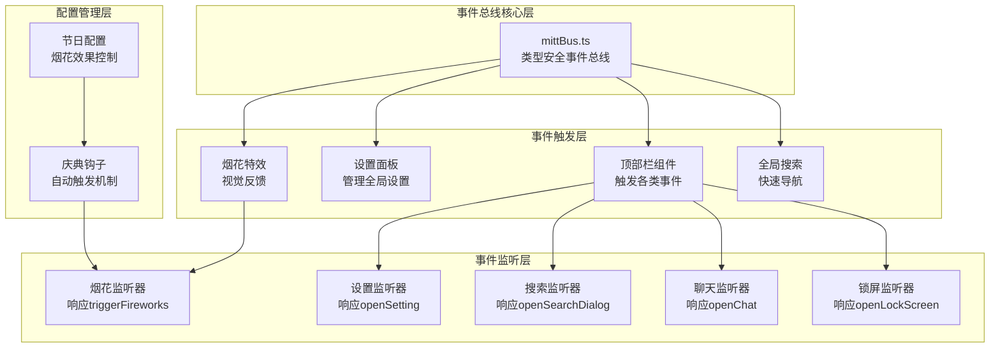

**图表来源**
- [mittBus.ts](file://src/utils/sys/mittBus.ts#L44-L63)
- [art-header-bar/index.vue](file://src/components/core/layouts/art-header-bar/index.vue#L297-L343)
- [art-fireworks-effect/index.vue](file://src/components/core/layouts/art-fireworks-effect/index.vue#L595-L597)

## 核心组件分析

### mittBus事件总线核心

事件总线是整个通信系统的核心，基于mitt库实现类型安全的事件管理。

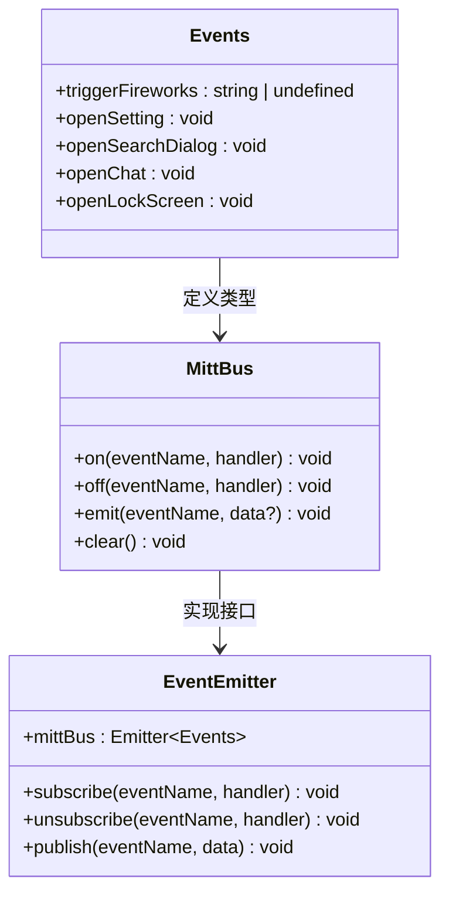

**图表来源**
- [mittBus.ts](file://src/utils/sys/mittBus.ts#L47-L58)

**章节来源**
- [mittBus.ts](file://src/utils/sys/mittBus.ts#L1-L63)

### 顶部栏组件事件触发

顶部栏作为全局导航的核心组件，负责触发各种系统功能事件。

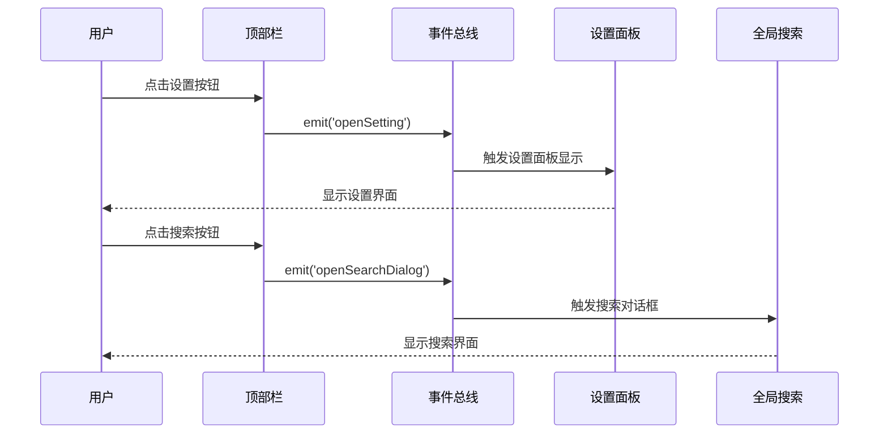

**图表来源**
- [art-header-bar/index.vue](file://src/components/core/layouts/art-header-bar/index.vue#L297-L311)

**章节来源**
- [art-header-bar/index.vue](file://src/components/core/layouts/art-header-bar/index.vue#L297-L343)

## 事件总线系统详解

### 类型安全的事件定义

系统定义了五种核心事件类型，每种事件都有明确的用途和参数结构：

| 事件名称 | 参数类型 | 描述 | 使用场景 |
|---------|---------|------|----------|
| `triggerFireworks` | `string \| undefined` | 触发烟花效果事件 | 系统庆祝、视觉反馈 |
| `openSetting` | `void` | 打开设置面板事件 | 全局设置管理 |
| `openSearchDialog` | `void` | 打开搜索对话框事件 | 快速内容查找 |
| `openChat` | `void` | 打开聊天窗口事件 | 即时通讯功能 |
| `openLockScreen` | `void` | 打开锁屏事件 | 安全保护机制 |

### 事件触发机制

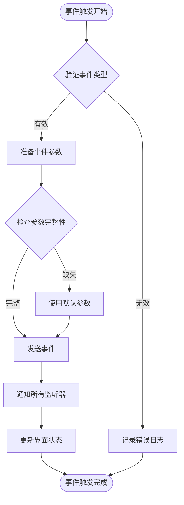

**图表来源**
- [mittBus.ts](file://src/utils/sys/mittBus.ts#L23-L31)

**章节来源**
- [mittBus.ts](file://src/utils/sys/mittBus.ts#L47-L58)

### 事件监听生命周期管理

为了防止内存泄漏和确保组件正确清理，事件监听器需要在组件卸载时正确移除。

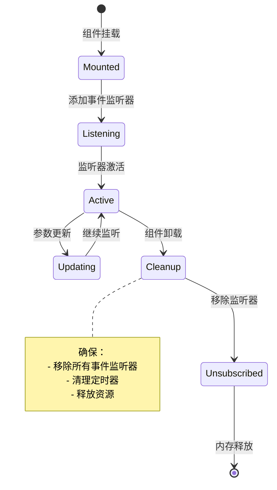

**章节来源**
- [art-fireworks-effect/index.vue](file://src/components/core/layouts/art-fireworks-effect/index.vue#L629-L632)

## 实际应用场景

### 烟花特效播放场景

烟花特效是事件总线系统最直观的应用场景之一，展示了如何通过事件驱动实现复杂的视觉效果。

#### 触发流程

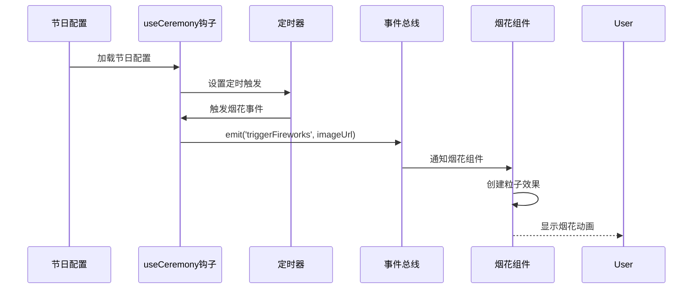

**图表来源**
- [useCeremony.ts](file://src/hooks/core/useCeremony.ts#L116-L118)
- [art-fireworks-effect/index.vue](file://src/components/core/layouts/art-fireworks-effect/index.vue#L595-L597)

#### 烟花系统核心架构

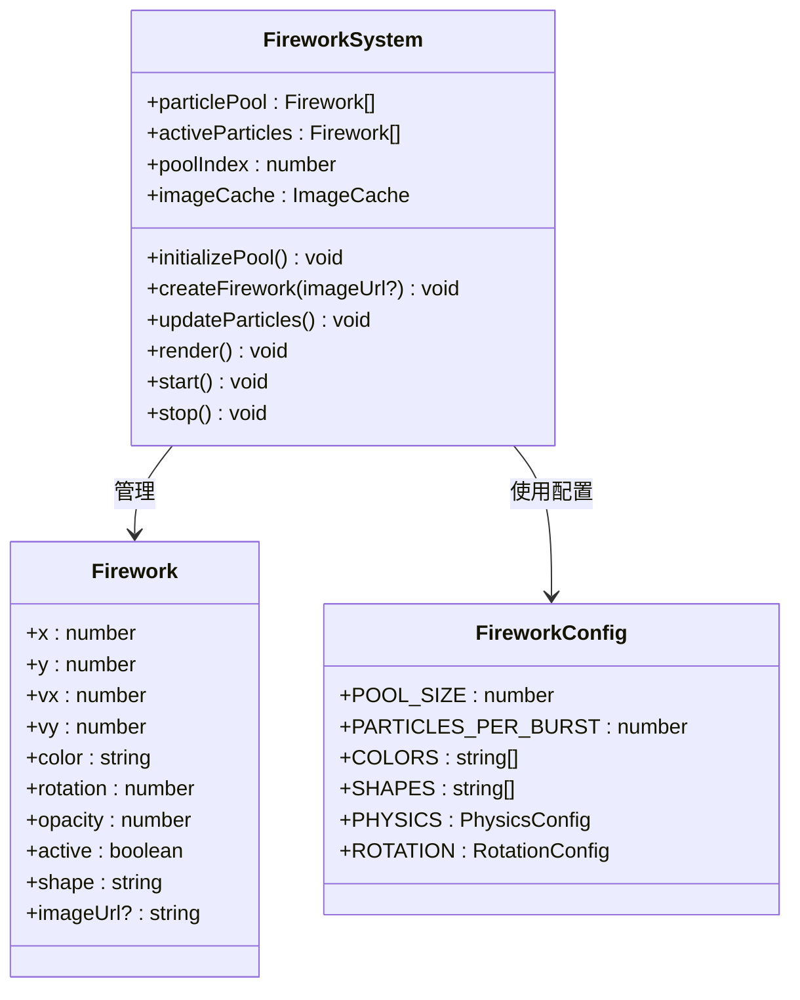

**图表来源**
- [art-fireworks-effect/index.vue](file://src/components/core/layouts/art-fireworks-effect/index.vue#L177-L230)

**章节来源**
- [art-fireworks-effect/index.vue](file://src/components/core/layouts/art-fireworks-effect/index.vue#L1-L633)
- [useCeremony.ts](file://src/hooks/core/useCeremony.ts#L116-L118)

### 设置面板开启场景

设置面板是系统配置的核心组件，通过事件总线实现全局访问。

#### 设置面板通信流程

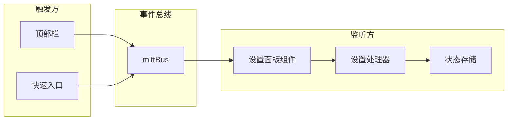

**图表来源**
- [art-header-bar/index.vue](file://src/components/core/layouts/art-header-bar/index.vue#L297-L303)
- [useSettingsPanel.ts](file://src/components/core/layouts/art-settings-panel/composables/useSettingsPanel.ts#L155-L155)

**章节来源**
- [art-settings-panel/index.vue](file://src/components/core/layouts/art-settings-panel/index.vue#L1-L73)
- [useSettingsPanel.ts](file://src/components/core/layouts/art-settings-panel/composables/useSettingsPanel.ts#L155-L155)

### 全局搜索对话框场景

全局搜索提供了快速定位系统内内容的能力，通过事件总线实现一键触发。

#### 搜索功能实现

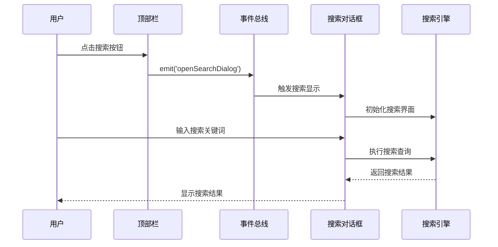

**图表来源**
- [art-header-bar/index.vue](file://src/components/core/layouts/art-header-bar/index.vue#L309-L311)
- [art-global-search/index.vue](file://src/components/core/layouts/art-global-search/index.vue#L100-L100)

**章节来源**
- [art-global-search/index.vue](file://src/components/core/layouts/art-global-search/index.vue#L1-L109)

## 最佳实践指南

### 事件命名规范

为了确保代码的可读性和维护性，建议遵循以下事件命名规范：

| 命名模式 | 示例 | 说明 |
|---------|------|------|
| 动词+名词 | `openSetting` | 表示动作触发 |
| 动词+名词+状态 | `settingSaved` | 表示动作完成 |
| 动词+名词+结果 | `searchCompleted` | 表示动作结果 |
| 状态变化 | `themeChanged` | 表示状态变更 |
| 错误事件 | `errorOccurred` | 表示异常情况 |

### 事件参数设计原则

1. **最小化原则**：只传递必要的参数
2. **类型安全**：使用TypeScript确保类型正确
3. **可扩展性**：预留参数扩展空间
4. **一致性**：保持相同类型事件的参数结构一致

### 内存泄漏防范策略

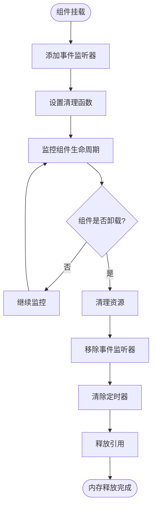

**章节来源**
- [art-fireworks-effect/index.vue](file://src/components/core/layouts/art-fireworks-effect/index.vue#L629-L632)

### 调试工具集成

为了便于开发和调试，建议集成以下调试工具：

1. **事件日志记录**：记录所有事件的触发和处理过程
2. **性能监控**：监控事件处理的性能指标
3. **错误追踪**：捕获和报告事件处理中的错误
4. **可视化调试**：提供事件流的可视化界面

## 常见问题与解决方案

### 事件监听未生效

**问题描述**：事件监听器注册后无法接收到事件

**可能原因**：
1. 事件名称拼写错误
2. 监听器注册时机不当
3. 组件生命周期问题
4. 类型定义不匹配

**解决方案**：
```typescript
// 正确的做法
onMounted(() => {
  mittBus.on('openSetting', handleSettingOpen)
})

onUnmounted(() => {
  mittBus.off('openSetting', handleSettingOpen)
})
```

### 重复绑定事件监听器

**问题描述**：同一个监听器被多次绑定导致重复执行

**解决方案**：
```typescript
// 使用唯一标识符
const listenerId = Symbol('settingListener')

onMounted(() => {
  mittBus.on(listenerId, 'openSetting', handleSettingOpen)
})

onUnmounted(() => {
  mittBus.off(listenerId, 'openSetting', handleSettingOpen)
})
```

### 内存泄漏问题

**问题描述**：组件卸载后事件监听器仍然存在

**预防措施**：
1. 在组件卸载时移除所有事件监听器
2. 使用正确的生命周期钩子
3. 避免在事件处理函数中创建循环引用

**章节来源**
- [art-fireworks-effect/index.vue](file://src/components/core/layouts/art-fireworks-effect/index.vue#L629-L632)

## 性能优化建议

### 事件处理优化

1. **防抖处理**：对于高频事件（如窗口大小变化）使用防抖
2. **节流控制**：限制事件处理函数的执行频率
3. **异步处理**：将耗时操作移到微任务队列
4. **批量处理**：合并多个相关事件的处理

### 内存管理优化

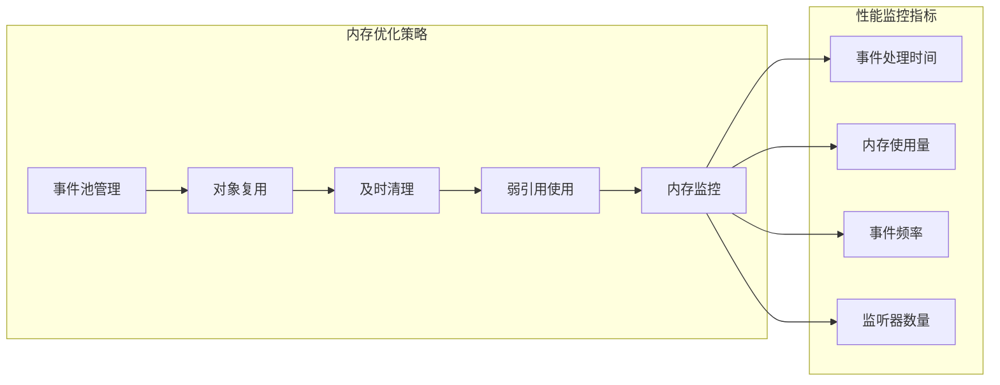

### 事件总线扩展性设计

为了支持未来的功能扩展，建议采用以下设计原则：

1. **插件化架构**：支持动态加载事件处理器
2. **中间件模式**：支持事件处理的中间件链
3. **优先级系统**：支持事件处理的优先级控制
4. **条件过滤**：支持基于条件的事件过滤

## 故障排除指南

### 诊断工具

建立完善的诊断工具来帮助识别和解决问题：

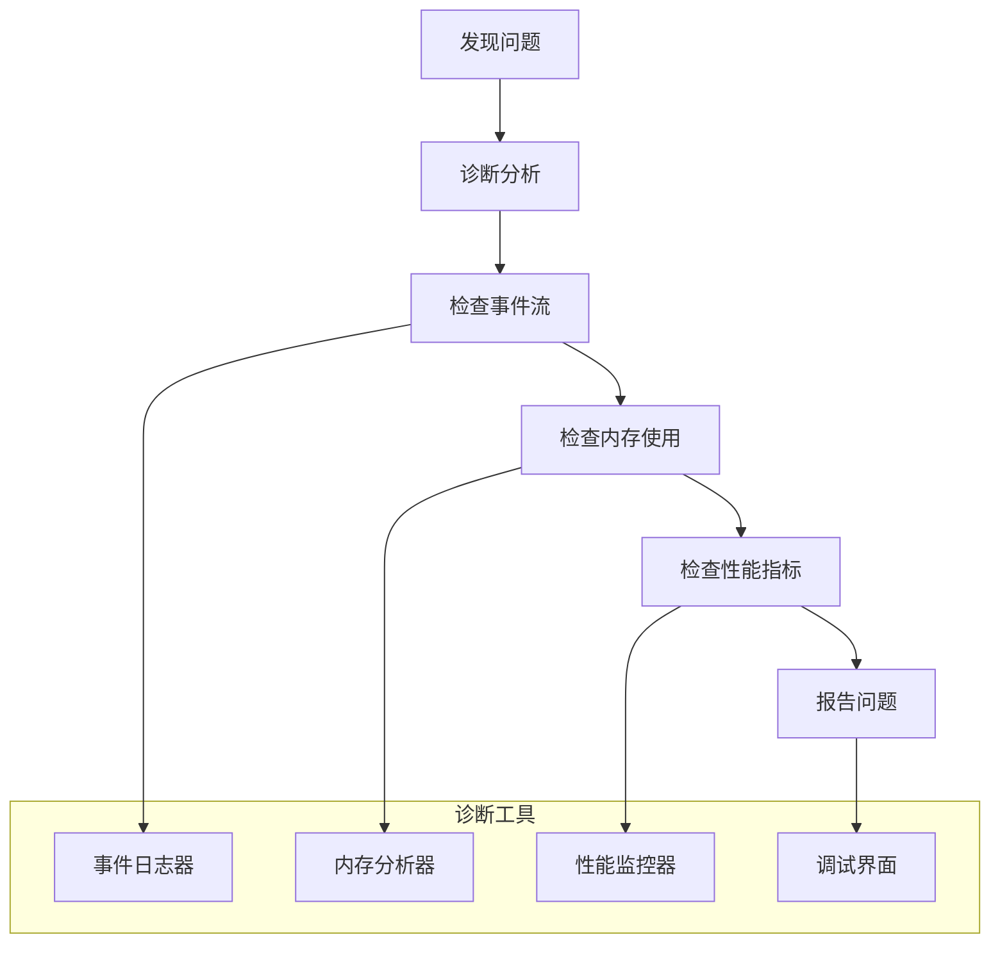

### 常见故障模式

| 故障类型 | 症状 | 可能原因 | 解决方案 |
|---------|------|---------|----------|
| 事件丢失 | 监听器收不到事件 | 监听器未正确注册 | 检查注册时机和事件名称 |
| 内存泄漏 | 内存持续增长 | 监听器未正确移除 | 确保在组件卸载时清理 |
| 性能下降 | 响应变慢 | 事件处理过于频繁 | 添加防抖和节流机制 |
| 类型错误 | TypeScript编译错误 | 事件类型定义不匹配 | 检查Events类型定义 |

**章节来源**
- [mittBus.ts](file://src/utils/sys/mittBus.ts#L1-L63)

## 总结

事件总线通信模式为现代前端应用提供了一种优雅的组件间通信解决方案。通过本项目的实践，我们可以看到：

### 核心优势

1. **解耦设计**：完全避免了复杂的props传递链
2. **类型安全**：基于TypeScript的强类型保证
3. **易于维护**：清晰的事件定义和处理流程
4. **性能优异**：基于mitt库的高效实现

### 应用价值

- **提升开发效率**：简化组件间通信逻辑
- **增强系统灵活性**：支持动态的功能组合
- **改善用户体验**：提供流畅的交互体验
- **降低维护成本**：清晰的代码结构和调试支持

### 未来发展方向

随着应用复杂度的增加，事件总线系统可以进一步演进：

1. **分布式事件**：支持跨应用的事件通信
2. **事件持久化**：支持事件的存储和回放
3. **智能路由**：基于规则的事件路由系统
4. **可视化管理**：提供事件流的可视化管理界面

通过合理的设计和实施，事件总线通信模式能够显著提升应用的质量和开发效率，是现代前端架构中不可或缺的重要组成部分。