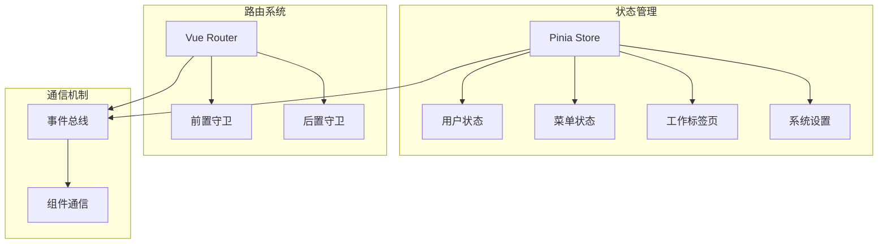
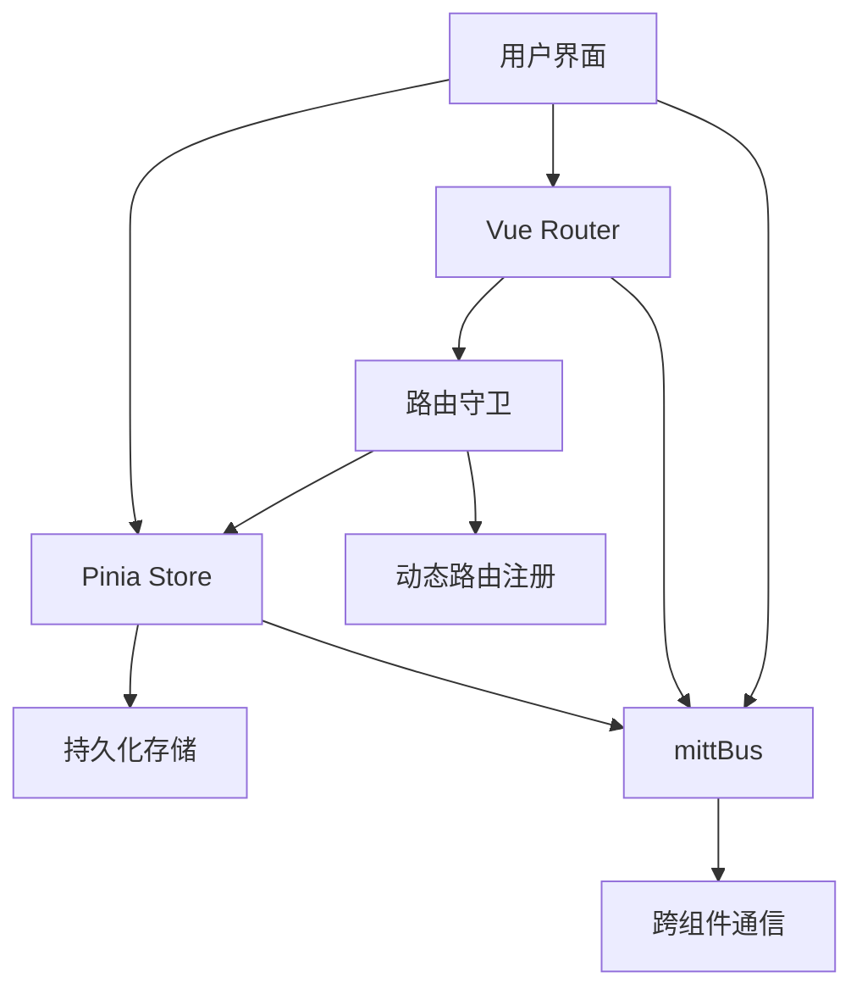
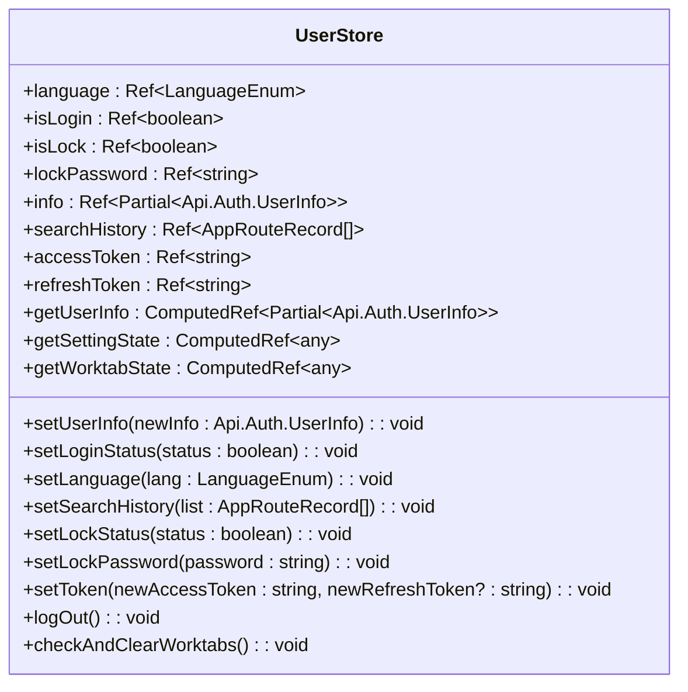
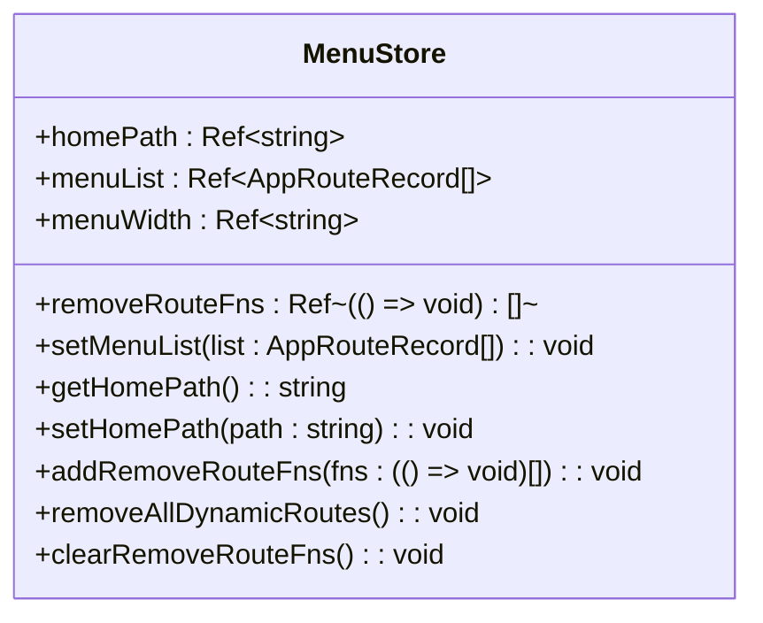
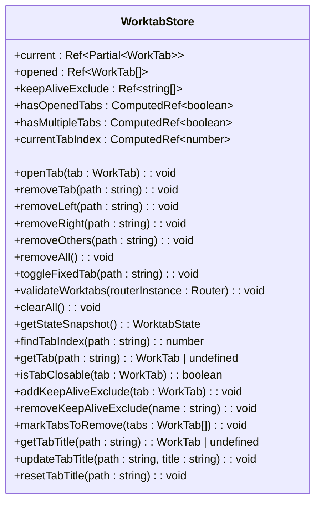
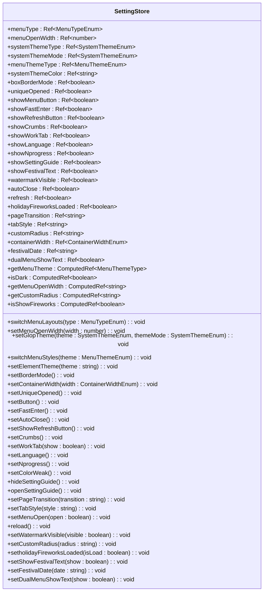
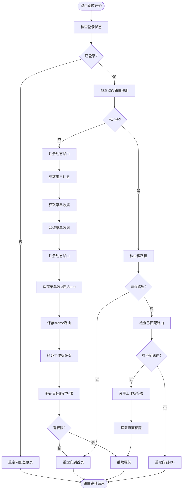
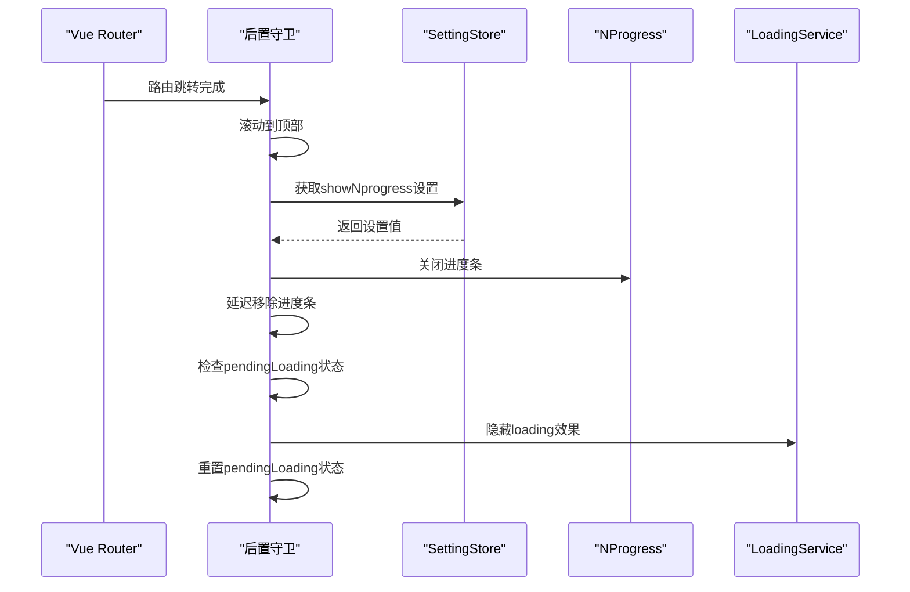
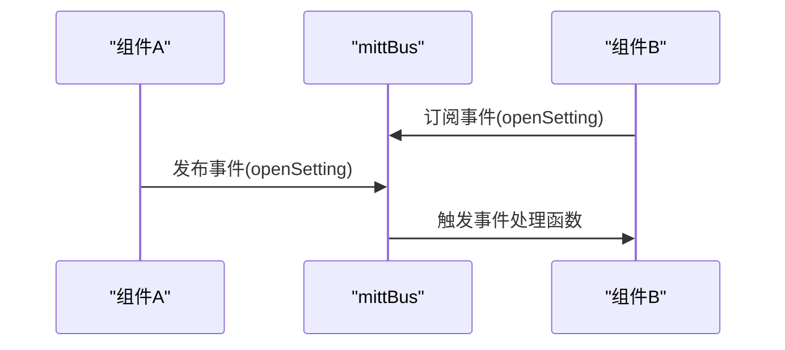
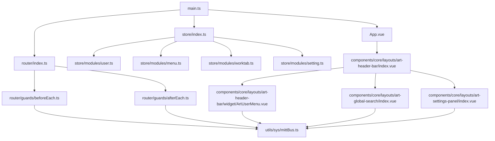

# 状态通信机制

<cite>
**本文档引用文件**  
- [main.ts](file://src/main.ts)
- [App.vue](file://src/App.vue)
- [index.ts](file://src/store/index.ts)
- [user.ts](file://src/store/modules/user.ts)
- [menu.ts](file://src/store/modules/menu.ts)
- [worktab.ts](file://src/store/modules/worktab.ts)
- [setting.ts](file://src/store/modules/setting.ts)
- [mittBus.ts](file://src/utils/sys/mittBus.ts)
- [beforeEach.ts](file://src/router/guards/beforeEach.ts)
- [afterEach.ts](file://src/router/guards/afterEach.ts)
- [art-header-bar/index.vue](file://src/components/core/layouts/art-header-bar/index.vue)
- [art-header-bar/widget/ArtUserMenu.vue](file://src/components/core/layouts/art-header-bar/widget/ArtUserMenu.vue)
- [art-global-search/index.vue](file://src/components/core/layouts/art-global-search/index.vue)
- [art-settings-panel/index.vue](file://src/components/core/layouts/art-settings-panel/index.vue)
</cite>

## 目录
1. [引言](#引言)
2. [项目结构](#项目结构)
3. [核心组件](#核心组件)
4. [架构概述](#架构概述)
5. [详细组件分析](#详细组件分析)
6. [依赖分析](#依赖分析)
7. [性能考虑](#性能考虑)
8. [故障排除指南](#故障排除指南)
9. [结论](#结论)

## 引言
Art Design Pro 是一个现代化的前端应用框架，其状态通信机制是整个应用的核心。本技术文档将深入剖析该应用的状态管理与组件通信策略，涵盖 Pinia 状态管理、Vue Router 路由守卫以及 mittBus 事件总线等关键技术。通过分析这些机制的实现原理和协同工作方式，我们将全面理解应用内多维度状态管理的完整架构。

## 项目结构
Art Design Pro 项目采用模块化的目录结构，将不同功能的代码组织在相应的目录中。核心的状态管理相关文件位于 `src/store` 目录下，包括全局状态配置和各个功能模块的状态管理。路由相关的代码位于 `src/router` 目录，包含路由守卫和路由配置。事件总线实现在 `src/utils/sys/mittBus.ts` 文件中，为跨组件通信提供支持。



**图示来源**  
- [index.ts](file://src/store/index.ts)
- [user.ts](file://src/store/modules/user.ts)
- [menu.ts](file://src/store/modules/menu.ts)
- [worktab.ts](file://src/store/modules/worktab.ts)
- [setting.ts](file://src/store/modules/setting.ts)
- [beforeEach.ts](file://src/router/guards/beforeEach.ts)
- [afterEach.ts](file://src/router/guards/afterEach.ts)
- [mittBus.ts](file://src/utils/sys/mittBus.ts)

**本节来源**  
- [index.ts](file://src/store/index.ts)
- [beforeEach.ts](file://src/router/guards/beforeEach.ts)
- [mittBus.ts](file://src/utils/sys/mittBus.ts)

## 核心组件
Art Design Pro 的状态通信机制由三个核心组件构成：Pinia 状态管理、Vue Router 路由守卫和 mittBus 事件总线。这些组件共同协作，实现了应用内复杂的状态管理和组件通信需求。

**本节来源**  
- [index.ts](file://src/store/index.ts)
- [beforeEach.ts](file://src/router/guards/beforeEach.ts)
- [mittBus.ts](file://src/utils/sys/mittBus.ts)

## 架构概述
Art Design Pro 的状态通信架构采用分层设计，将状态管理、路由控制和事件通信分离，同时通过精心设计的接口实现它们之间的协同工作。这种架构既保证了各组件的独立性，又实现了高效的通信和状态同步。



**图示来源**  
- [index.ts](file://src/store/index.ts)
- [beforeEach.ts](file://src/router/guards/beforeEach.ts)
- [mittBus.ts](file://src/utils/sys/mittBus.ts)

## 详细组件分析

### Pinia 状态管理分析
Pinia 作为 Art Design Pro 的核心状态管理库，提供了集中式的状态管理解决方案。通过 `storeToRefs`，组件可以安全地访问和修改状态，同时保持响应式特性。

#### 用户状态管理
用户状态管理模块负责管理用户登录状态、个人信息、语言设置等。它通过持久化插件将状态保存在 localStorage 中，确保页面刷新后状态不丢失。



**图示来源**  
- [user.ts](file://src/store/modules/user.ts)

#### 菜单状态管理
菜单状态管理模块负责管理应用的菜单列表、首页路径和动态路由。它与路由系统紧密协作，实现动态菜单加载和权限控制。



**图示来源**  
- [menu.ts](file://src/store/modules/menu.ts)

#### 工作标签页管理
工作标签页管理模块实现了多标签页功能的完整状态管理，包括标签页的打开、关闭、固定、批量操作以及缓存管理。



**图示来源**  
- [worktab.ts](file://src/store/modules/worktab.ts)

#### 系统设置管理
系统设置管理模块提供了完整的系统设置状态管理，包括菜单布局、主题管理、界面显示开关、功能开关和样式配置等。



**图示来源**  
- [setting.ts](file://src/store/modules/setting.ts)

### Vue Router 路由守卫分析
Vue Router 的路由守卫机制与状态管理紧密结合，实现了权限控制和导航逻辑。前置守卫在路由跳转前进行登录状态验证、动态路由注册和权限检查，后置守卫则负责页面标题设置和加载状态管理。

#### 路由前置守卫流程


**图示来源**  
- [beforeEach.ts](file://src/router/guards/beforeEach.ts)

#### 路由后置守卫流程


**图示来源**  
- [afterEach.ts](file://src/router/guards/afterEach.ts)

### mittBus 事件总线分析
mittBus 事件总线为跨层级组件通信提供了轻量级的解决方案。它基于 mitt 库实现，支持类型安全的事件定义和调用，解耦了组件间的直接依赖。

#### 事件总线使用流程


**图示来源**  
- [mittBus.ts](file://src/utils/sys/mittBus.ts)

#### 事件总线实际应用场景
```mermaid
flowchart TD
A[顶部栏] --> |点击设置按钮| B[mittBus.emit('openSetting')]
B --> C[设置面板]
C --> |监听openSetting事件| D[打开设置面板]
E[用户菜单] --> |点击锁屏| F[mittBus.emit('openLockScreen')]
F --> G[锁屏组件]
G --> |监听openLockScreen事件| H[打开锁屏]
I[顶部栏] --> |点击搜索| J[mittBus.emit('openSearchDialog')]
J --> K[搜索组件]
K --> |监听openSearchDialog事件| L[打开搜索对话框]
M[顶部栏] --> |点击聊天| N[mittBus.emit('openChat')]
N --> O[聊天组件]
O --> |监听openChat事件| P[打开聊天窗口]
Q[节日功能] --> |触发烟花| R[mittBus.emit('triggerFireworks', 'image-url')]
R --> S[烟花组件]
S --> |监听triggerFireworks事件| T[显示烟花效果]
```

**图示来源**  
- [art-header-bar/index.vue](file://src/components/core/layouts/art-header-bar/index.vue)
- [art-header-bar/widget/ArtUserMenu.vue](file://src/components/core/layouts/art-header-bar/widget/ArtUserMenu.vue)
- [art-global-search/index.vue](file://src/components/core/layouts/art-global-search/index.vue)
- [art-settings-panel/index.vue](file://src/components/core/layouts/art-settings-panel/index.vue)
- [mittBus.ts](file://src/utils/sys/mittBus.ts)

### 三种通信模式对比分析
Art Design Pro 应用中采用了三种主要的组件通信模式：props/emits、状态共享和事件总线。每种模式都有其适用场景和性能特征。

#### 通信模式对比表
| 通信模式 | 适用场景 | 性能特征 | 优点 | 缺点 |
|---------|---------|---------|------|------|
| props/emits | 父子组件通信 | 高性能，直接通信 | 类型安全，易于调试 | 层级过深时传递繁琐 |
| 状态共享(Pinia) | 多层级组件共享状态 | 中等性能，响应式更新 | 集中式管理，持久化支持 | 状态过多时难以维护 |
| 事件总线(mittBus) | 跨层级组件通信 | 低性能，事件广播 | 解耦组件依赖，灵活通信 | 难以追踪事件流，可能产生内存泄漏 |

**本节来源**  
- [user.ts](file://src/store/modules/user.ts)
- [menu.ts](file://src/store/modules/menu.ts)
- [worktab.ts](file://src/store/modules/worktab.ts)
- [setting.ts](file://src/store/modules/setting.ts)
- [mittBus.ts](file://src/utils/sys/mittBus.ts)
- [art-header-bar/index.vue](file://src/components/core/layouts/art-header-bar/index.vue)
- [art-header-bar/widget/ArtUserMenu.vue](file://src/components/core/layouts/art-header-bar/widget/ArtUserMenu.vue)
- [art-global-search/index.vue](file://src/components/core/layouts/art-global-search/index.vue)
- [art-settings-panel/index.vue](file://src/components/core/layouts/art-settings-panel/index.vue)

## 依赖分析
Art Design Pro 的状态通信机制依赖于多个核心库和模块，它们之间形成了复杂的依赖关系网络。



**图示来源**  
- [main.ts](file://src/main.ts)
- [App.vue](file://src/App.vue)
- [index.ts](file://src/store/index.ts)
- [beforeEach.ts](file://src/router/guards/beforeEach.ts)
- [afterEach.ts](file://src/router/guards/afterEach.ts)
- [mittBus.ts](file://src/utils/sys/mittBus.ts)
- [art-header-bar/index.vue](file://src/components/core/layouts/art-header-bar/index.vue)
- [art-header-bar/widget/ArtUserMenu.vue](file://src/components/core/layouts/art-header-bar/widget/ArtUserMenu.vue)
- [art-global-search/index.vue](file://src/components/core/layouts/art-global-search/index.vue)
- [art-settings-panel/index.vue](file://src/components/core/layouts/art-settings-panel/index.vue)

## 性能考虑
在设计和实现状态通信机制时，需要考虑多个性能因素，以确保应用的响应速度和用户体验。

1. **状态管理性能**：Pinia 的响应式系统基于 Vue 3 的 Composition API，具有高效的依赖追踪和更新机制。但过多的状态订阅可能导致性能下降，建议合理使用 `storeToRefs` 和计算属性。

2. **事件总线性能**：事件总线的性能相对较低，因为事件是广播式的，所有订阅者都会收到通知。应避免在高频事件中使用事件总线，或在事件处理函数中进行复杂的计算。

3. **路由守卫性能**：路由守卫中的异步操作（如获取用户信息、菜单数据）会影响导航速度。建议对这些操作进行缓存或预加载，以减少用户等待时间。

4. **持久化性能**：状态的持久化操作（如 localStorage 的读写）是同步的，可能阻塞主线程。对于大型状态对象，建议使用异步存储方案或分块存储。

**本节来源**  
- [index.ts](file://src/store/index.ts)
- [beforeEach.ts](file://src/router/guards/beforeEach.ts)
- [mittBus.ts](file://src/utils/sys/mittBus.ts)

## 故障排除指南
在使用状态通信机制时，可能会遇到一些常见问题。以下是针对这些问题的排查和解决方案。

1. **状态更新不生效**：检查是否正确使用了 `storeToRefs`，确保在组件中引用的是响应式引用而不是普通值。

2. **事件未触发**：确认事件名称拼写正确，订阅和发布事件的组件都已正确初始化，且没有在组件销毁前忘记取消订阅。

3. **路由守卫无限循环**：检查路由守卫中的重定向逻辑，确保不会因为条件判断错误导致无限重定向。

4. **持久化数据丢失**：确认 localStorage 的存储键是否正确，检查浏览器的存储限制和隐私设置。

5. **内存泄漏**：在组件销毁时，记得取消事件订阅和清除定时器，避免产生内存泄漏。

**本节来源**  
- [user.ts](file://src/store/modules/user.ts)
- [menu.ts](file://src/store/modules/menu.ts)
- [worktab.ts](file://src/store/modules/worktab.ts)
- [setting.ts](file://src/store/modules/setting.ts)
- [mittBus.ts](file://src/utils/sys/mittBus.ts)
- [beforeEach.ts](file://src/router/guards/beforeEach.ts)

## 结论
Art Design Pro 的状态通信机制通过 Pinia 状态管理、Vue Router 路由守卫和 mittBus 事件总线的有机结合，实现了高效、灵活的应用内通信。这种分层架构既保证了各组件的独立性，又实现了复杂的业务需求。通过合理使用这三种通信模式，开发者可以构建出响应迅速、易于维护的现代化前端应用。