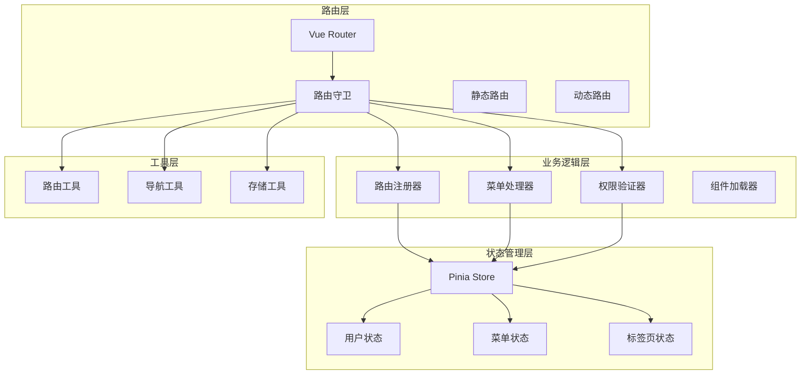
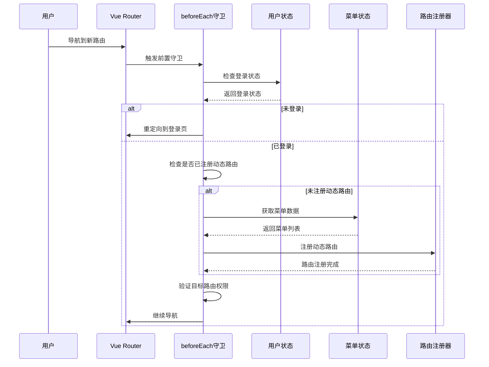
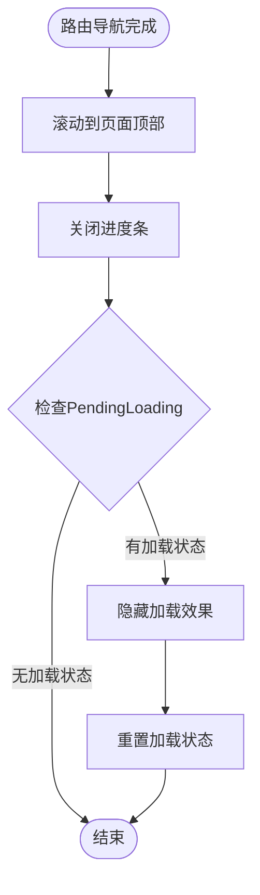
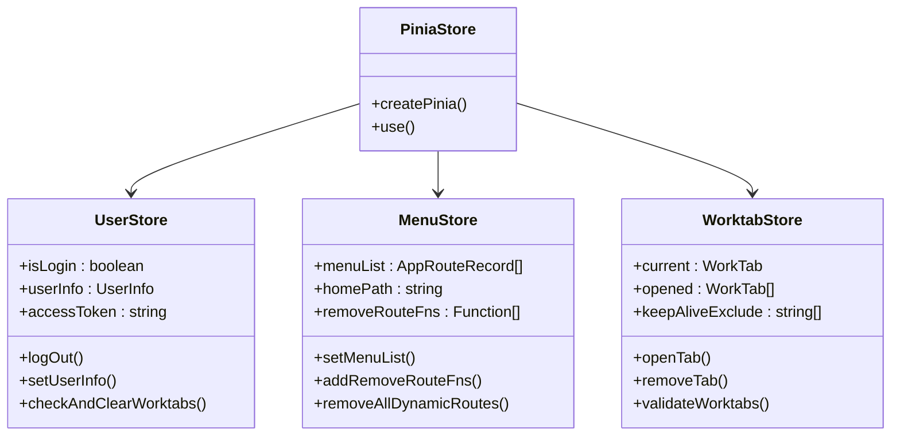
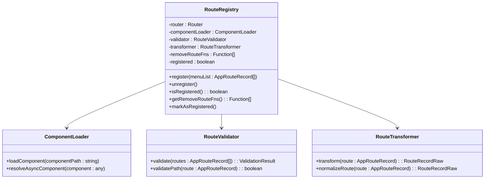
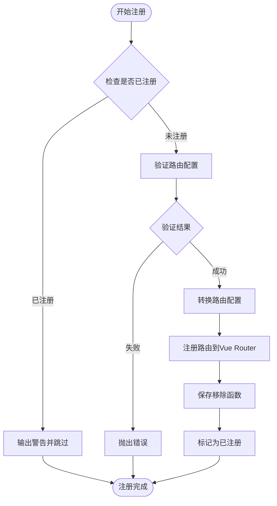
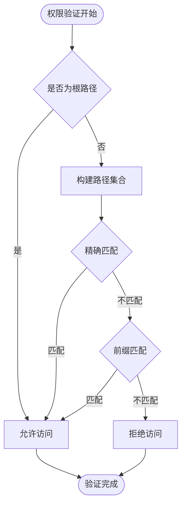
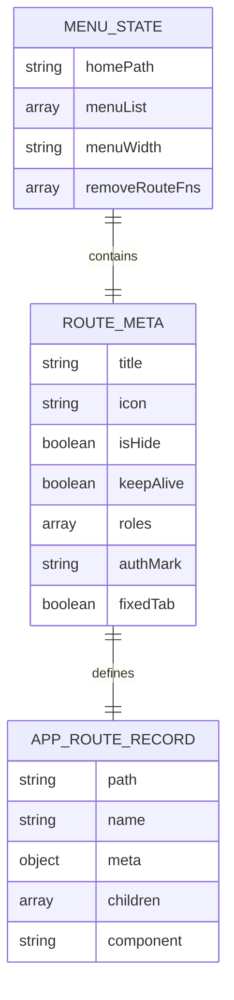
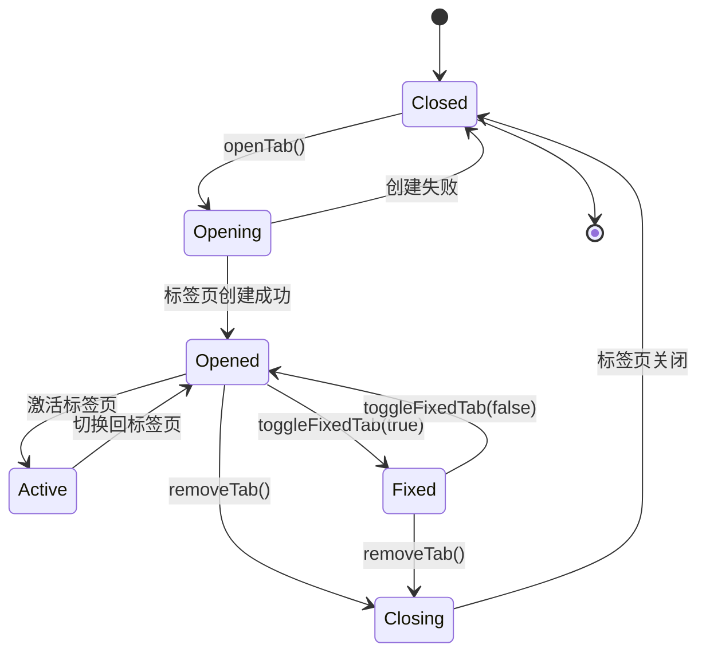

# 路由状态协同机制

<cite>
**本文档中引用的文件**
- [src/router/index.ts](file://src/router/index.ts)
- [src/store/index.ts](file://src/store/index.ts)
- [src/router/guards/beforeEach.ts](file://src/router/guards/beforeEach.ts)
- [src/router/guards/afterEach.ts](file://src/router/guards/afterEach.ts)
- [src/store/modules/menu.ts](file://src/store/modules/menu.ts)
- [src/store/modules/user.ts](file://src/store/modules/user.ts)
- [src/store/modules/worktab.ts](file://src/store/modules/worktab.ts)
- [src/router/routes/asyncRoutes.ts](file://src/router/routes/asyncRoutes.ts)
- [src/router/core/RouteRegistry.ts](file://src/router/core/RouteRegistry.ts)
- [src/router/core/MenuProcessor.ts](file://src/router/core/MenuProcessor.ts)
- [src/router/core/RoutePermissionValidator.ts](file://src/router/core/RoutePermissionValidator.ts)
- [src/types/router/index.ts](file://src/types/router/index.ts)
- [src/utils/router.ts](file://src/utils/router.ts)
- [src/utils/navigation/route.ts](file://src/utils/navigation/route.ts)
- [src/hooks/core/useCommon.ts](file://src/hooks/core/useCommon.ts)
</cite>

## 目录
1. [概述](#概述)
2. [系统架构](#系统架构)
3. [路由守卫机制](#路由守卫机制)
4. [状态管理协同](#状态管理协同)
5. [动态路由注册](#动态路由注册)
6. [权限控制流程](#权限控制流程)
7. [菜单状态同步](#菜单状态同步)
8. [工作标签页管理](#工作标签页管理)
9. [调试与监控](#调试与监控)
10. [最佳实践](#最佳实践)

## 概述

Vue Router与Pinia状态库的协同机制是Art Design Pro框架的核心设计之一，它实现了完整的路由权限控制、动态菜单管理和状态同步体系。该机制通过路由守卫、状态管理和组件通信的深度集成，提供了安全、高效的单页应用体验。

### 核心特性

- **动态路由权限控制**：基于用户角色的动态路由注册和权限验证
- **状态实时同步**：路由变化时自动更新菜单激活状态和页面标题
- **智能缓存管理**：结合KeepAlive实现高效的状态缓存
- **异常处理机制**：完善的错误捕获和降级处理
- **性能优化**：懒加载和按需注册的路由加载策略

## 系统架构

**图表来源**
- [src/router/index.ts](file://src/router/index.ts#L1-L24)
- [src/store/index.ts](file://src/store/index.ts#L1-L53)
- [src/router/guards/beforeEach.ts](file://src/router/guards/beforeEach.ts#L1-L361)

## 路由守卫机制

### beforeEach前置守卫

beforeEach守卫是整个路由状态协同的核心入口，负责执行登录验证、动态路由注册和权限控制。

**图表来源**
- [src/router/guards/beforeEach.ts](file://src/router/guards/beforeEach.ts#L118-L158)

#### 登录状态验证

守卫首先检查用户的登录状态，未登录用户会被重定向到登录页面，并携带当前路由地址作为重定向参数。

#### 动态路由注册

首次访问时，守卫会触发动态路由注册流程：
1. 获取用户信息和菜单数据
2. 验证菜单数据的有效性
3. 注册动态路由到Vue Router
4. 更新菜单状态到Pinia store

#### 权限验证

守卫会对每个路由进行权限验证，确保用户只能访问其权限范围内的页面。

**章节来源**
- [src/router/guards/beforeEach.ts](file://src/router/guards/beforeEach.ts#L132-L158)

### afterEach后置守卫

afterEach守卫负责路由导航完成后的状态更新和资源清理。

**图表来源**
- [src/router/guards/afterEach.ts](file://src/router/guards/afterEach.ts#L13-L34)

#### 页面标题更新

afterEach守卫会根据路由元信息更新页面标题，提供良好的用户体验。

#### 加载状态管理

守卫负责关闭前置守卫中启动的加载效果，确保界面状态的一致性。

**章节来源**
- [src/router/guards/afterEach.ts](file://src/router/guards/afterEach.ts#L1-L35)

## 状态管理协同

### Pinia Store架构

系统采用模块化的Pinia store设计，每个模块负责特定的功能领域。

**图表来源**
- [src/store/modules/user.ts](file://src/store/modules/user.ts#L50-L236)
- [src/store/modules/menu.ts](file://src/store/modules/menu.ts#L41-L110)
- [src/store/modules/worktab.ts](file://src/store/modules/worktab.ts#L56-L569)

### 状态同步机制

#### 用户状态同步

用户登录状态的变化会触发路由守卫重新验证权限，确保状态一致性。

#### 菜单状态同步

菜单状态的任何变化都会影响路由注册和权限验证，形成闭环同步。

#### 标签页状态同步

标签页的状态变化会直接影响路由的激活状态和KeepAlive缓存策略。

**章节来源**
- [src/store/modules/user.ts](file://src/store/modules/user.ts#L143-L176)
- [src/store/modules/menu.ts](file://src/store/modules/menu.ts#L55-L88)

## 动态路由注册

### RouteRegistry核心类

RouteRegistry负责动态路由的注册、验证和管理，是整个动态路由系统的核心组件。

**图表来源**
- [src/router/core/RouteRegistry.ts](file://src/router/core/RouteRegistry.ts#L16-L91)

### 路由注册流程

**图表来源**
- [src/router/core/RouteRegistry.ts](file://src/router/core/RouteRegistry.ts#L34-L58)

### 异步组件加载

系统支持异步组件加载，通过ComponentLoader实现按需加载和错误处理。

**章节来源**
- [src/router/core/RouteRegistry.ts](file://src/router/core/RouteRegistry.ts#L1-L91)

## 权限控制流程

### RoutePermissionValidator权限验证器

RoutePermissionValidator提供了完整的路由权限验证功能，支持精确匹配和前缀匹配。

**图表来源**
- [src/router/core/RoutePermissionValidator.ts](file://src/router/core/RoutePermissionValidator.ts#L35-L46)

### 菜单权限过滤

MenuProcessor根据用户角色对菜单进行权限过滤，确保用户只能看到其权限范围内的菜单项。

#### 前端权限控制

在前端模式下，系统根据用户角色直接过滤菜单，无需后端参与。

#### 后端权限控制

在后端模式下，系统从后端API获取完整的菜单数据，然后进行权限过滤。

**章节来源**
- [src/router/core/MenuProcessor.ts](file://src/router/core/MenuProcessor.ts#L42-L61)
- [src/router/core/RoutePermissionValidator.ts](file://src/router/core/RoutePermissionValidator.ts#L1-L120)

## 菜单状态同步

### 菜单数据结构

菜单状态通过menuList维护，包含完整的路由元信息和权限配置。

**图表来源**
- [src/store/modules/menu.ts](file://src/store/modules/menu.ts#L42-L108)
- [src/types/router/index.ts](file://src/types/router/index.ts#L29-L70)

### 菜单激活状态

菜单激活状态通过路由路径匹配实现，支持多级菜单的层级激活。

### 首页路径管理

系统支持动态设置首页路径，首页路径可以从菜单配置中自动推导。

**章节来源**
- [src/store/modules/menu.ts](file://src/store/modules/menu.ts#L55-L72)
- [src/utils/navigation/route.ts](file://src/utils/navigation/route.ts#L55-L78)

## 工作标签页管理

### WorktabStore标签页状态

WorktabStore提供了完整的多标签页功能，支持标签页的打开、关闭、固定和批量操作。

**图表来源**
- [src/store/modules/worktab.ts](file://src/store/modules/worktab.ts#L114-L164)

### KeepAlive缓存管理

系统通过keepAliveExclude数组管理组件的缓存状态，支持动态排除不需要缓存的组件。

### 标签页验证

validateWorktabs方法会定期验证标签页的有效性，清理无效的标签页路由。

**章节来源**
- [src/store/modules/worktab.ts](file://src/store/modules/worktab.ts#L435-L477)

## 调试与监控

### 路由状态调试

系统提供了多种调试工具和监控机制：

#### 路由守卫状态跟踪

- `getPendingLoading()`：获取当前加载状态
- `resetPendingLoading()`：重置加载状态
- 错误日志记录和异常处理

#### 状态同步监控

- 路由注册状态监控
- 菜单数据变化监听
- 标签页状态变化追踪

### 性能监控建议

#### 路由加载性能

- 监控路由注册耗时
- 组件加载时间统计
- 内存使用情况监控

#### 状态管理性能

- Store更新频率监控
- 状态序列化性能
- 持久化存储效率

### 异常处理机制

系统建立了完善的异常处理体系：

#### 路由异常处理

- 401未授权错误处理
- 404路由不存在处理
- 500服务器内部错误处理

#### 状态异常处理

- 数据验证失败处理
- 网络请求超时处理
- 存储空间不足处理

**章节来源**
- [src/router/guards/beforeEach.ts](file://src/router/guards/beforeEach.ts#L275-L296)
- [src/router/guards/beforeEach.ts](file://src/router/guards/beforeEach.ts#L351-L361)

## 最佳实践

### 路由设计原则

1. **清晰的路由层次结构**：合理组织路由层级，避免过深的嵌套
2. **语义化的路由命名**：使用有意义的路由名称和路径
3. **合理的权限配置**：在路由元信息中明确配置权限要求

### 状态管理最佳实践

1. **模块化设计**：按功能划分store模块，保持职责单一
2. **状态持久化**：合理选择需要持久化的状态
3. **状态同步**：确保路由状态与业务状态的一致性

### 性能优化策略

1. **懒加载组件**：使用异步组件减少初始包大小
2. **路由预加载**：对高频访问的路由进行预加载
3. **缓存策略**：合理使用KeepAlive和浏览器缓存

### 安全考虑

1. **权限验证**：前后端双重权限验证
2. **敏感数据保护**：避免在URL中传递敏感信息
3. **CSRF防护**：实施适当的CSRF防护措施

### 开发调试技巧

1. **使用Vue DevTools**：利用Vue DevTools调试状态变化
2. **路由守卫断点**：在关键路由守卫处设置断点
3. **状态快照**：定期保存状态快照用于问题排查

通过以上深入分析，我们可以看到Art Design Pro的路由状态协同机制是一个设计精良、功能完备的系统。它不仅提供了强大的权限控制能力，还通过状态管理实现了高度的自动化和用户体验优化。这种设计模式值得在类似的大型单页应用中借鉴和应用。