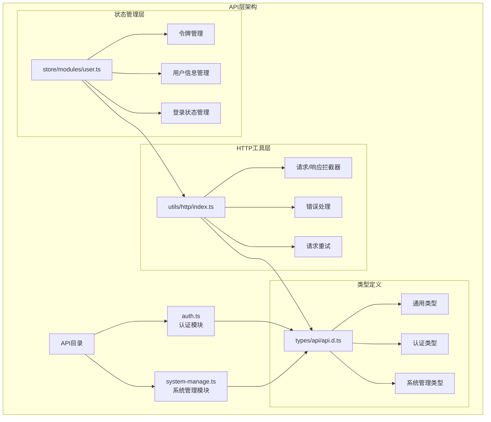
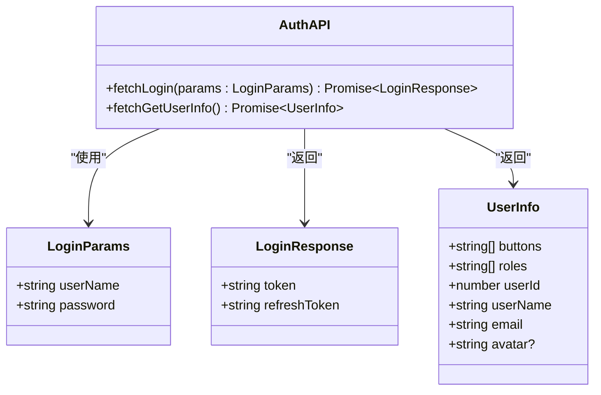
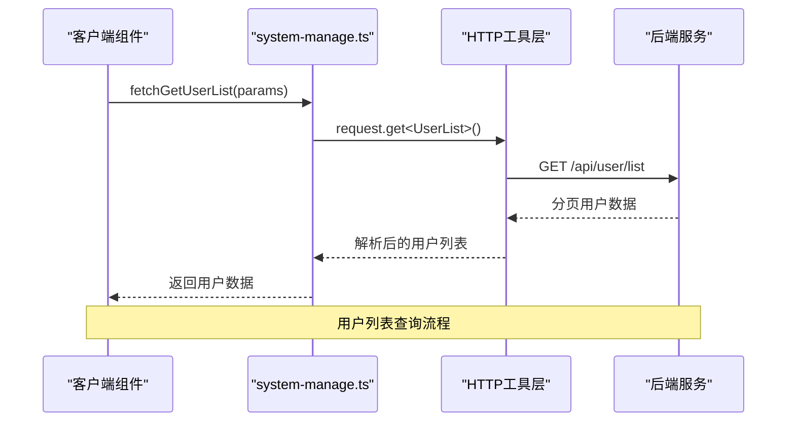
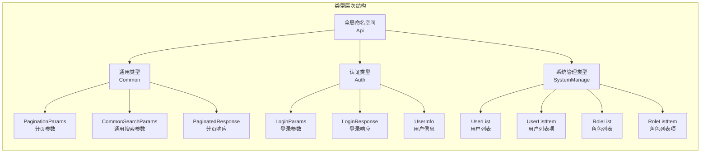
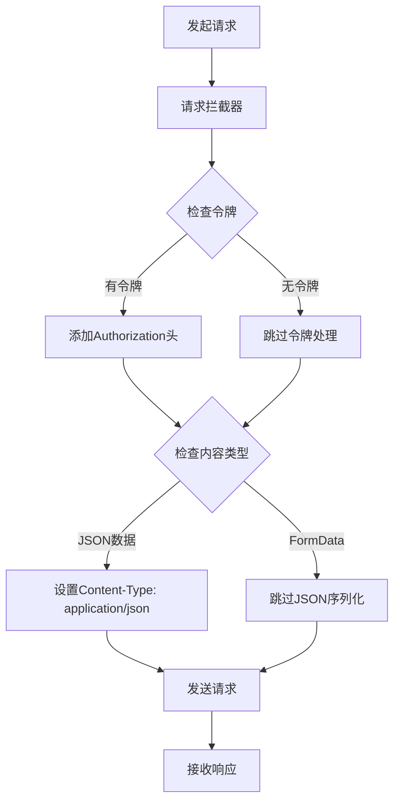
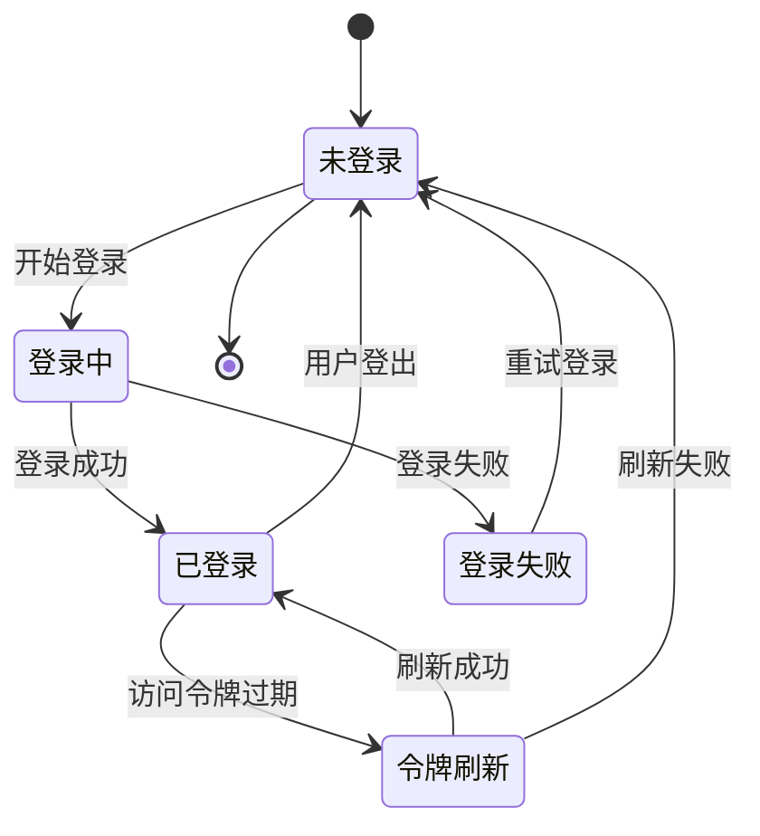
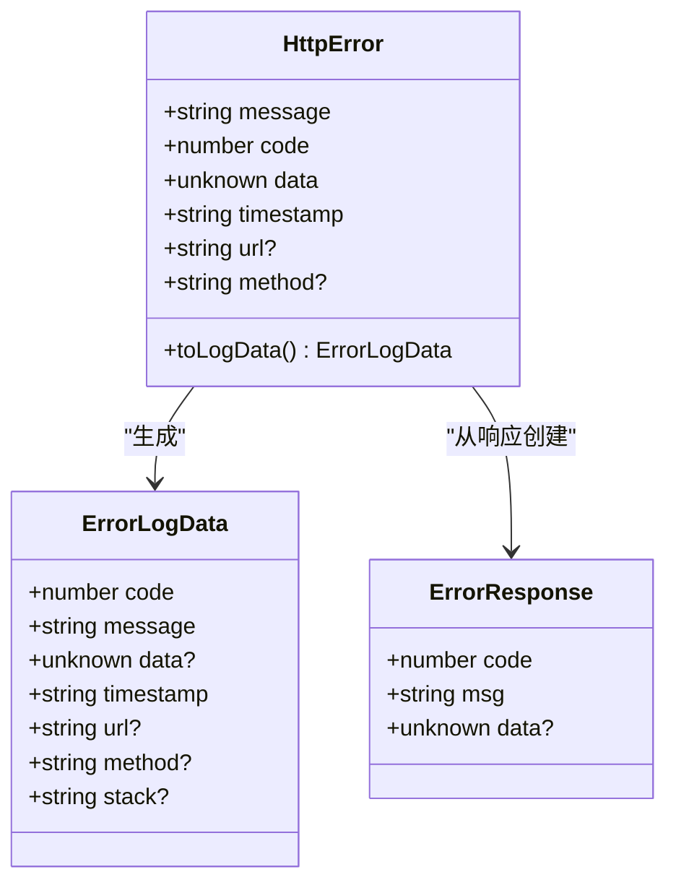

# API 目录设计与实现详解

<cite>
**本文档引用的文件**
- [src/api/auth.ts](file://src/api/auth.ts)
- [src/api/system-manage.ts](file://src/api/system-manage.ts)
- [src/types/api/api.d.ts](file://src/types/api/api.d.ts)
- [src/store/modules/user.ts](file://src/store/modules/user.ts)
- [src/utils/http/index.ts](file://src/utils/http/index.ts)
- [src/utils/http/error.ts](file://src/utils/http/error.ts)
- [src/utils/http/status.ts](file://src/utils/http/status.ts)
- [src/hooks/core/useAuth.ts](file://src/hooks/core/useAuth.ts)
- [src/views/auth/login/index.vue](file://src/views/auth/login/index.vue)
- [src/views/examples/permission/switch-role/index.vue](file://src/views/examples/permission/switch-role/index.vue)
</cite>

## 目录
1. [项目概述](#项目概述)
2. [API目录结构](#api目录结构)
3. [认证API模块详解](#认证api模块详解)
4. [系统管理API模块详解](#系统管理api模块详解)
5. [类型安全的API设计](#类型安全的api设计)
6. [HTTP请求工具层](#http请求工具层)
7. [状态管理集成](#状态管理集成)
8. [错误处理机制](#错误处理机制)
9. [使用示例与最佳实践](#使用示例与最佳实践)
10. [扩展新API模块指南](#扩展新api模块指南)

## 项目概述

Art Design Pro采用现代化的前端架构，将API层设计为独立的模块化结构，通过类型安全的接口定义、统一的请求处理机制和完善的错误处理体系，为整个应用提供可靠的后端通信能力。

### 核心设计理念

- **模块化设计**：按功能领域划分API模块，职责清晰
- **类型安全**：基于TypeScript的完整类型定义体系
- **统一处理**：集中式的请求/响应拦截和错误处理
- **状态同步**：与Pinia状态管理深度集成
- **开发友好**：提供丰富的开发工具和调试支持

## API目录结构



**图表来源**
- [src/api/auth.ts](file://src/api/auth.ts#L1-L30)
- [src/api/system-manage.ts](file://src/api/system-manage.ts#L1-L26)
- [src/types/api/api.d.ts](file://src/types/api/api.d.ts#L1-L136)

**章节来源**
- [src/api/auth.ts](file://src/api/auth.ts#L1-L30)
- [src/api/system-manage.ts](file://src/api/system-manage.ts#L1-L26)
- [src/types/api/api.d.ts](file://src/types/api/api.d.ts#L1-L136)

## 认证API模块详解

### 模块功能概览

认证API模块负责处理用户身份验证相关的所有接口调用，包括登录、登出、用户信息获取等核心功能。



**图表来源**
- [src/api/auth.ts](file://src/api/auth.ts#L8-L29)
- [src/types/api/api.d.ts](file://src/types/api/api.d.ts#L65-L85)

### 登录接口实现

登录接口采用简洁明了的函数式设计，提供类型安全的参数传递和响应处理。

**关键特性：**
- **类型约束**：严格限制输入参数类型
- **泛型支持**：自动推导响应数据类型
- **配置灵活**：支持自定义请求头和消息显示

### 用户信息获取

用户信息获取接口提供当前登录用户的详细信息，支持按钮权限和角色信息的获取。

**数据流转：**
1. 从HTTP请求头提取访问令牌
2. 后端验证令牌有效性
3. 返回用户基本信息和权限数据
4. 更新状态管理中的用户信息

**章节来源**
- [src/api/auth.ts](file://src/api/auth.ts#L1-L30)
- [src/types/api/api.d.ts](file://src/types/api/api.d.ts#L64-L85)

## 系统管理API模块详解

### 模块组织架构

系统管理API模块按照功能域进行组织，提供用户管理、角色管理和菜单管理三大核心功能。



**图表来源**
- [src/api/system-manage.ts](file://src/api/system-manage.ts#L5-L9)
- [src/utils/http/index.ts](file://src/utils/http/index.ts#L196-L212)

### 用户管理接口

用户管理接口提供完整的CRUD操作支持，包括用户列表查询、分页参数处理和搜索条件过滤。

**接口特点：**
- **分页支持**：内置分页参数类型定义
- **搜索优化**：支持多种字段的模糊查询
- **类型安全**：严格的参数和响应类型约束

### 角色管理接口

角色管理接口专注于权限控制相关的数据操作，提供角色列表查询和权限分配功能。

**数据模型：**
- **角色基本信息**：角色ID、名称、编码、描述
- **状态管理**：启用/禁用状态
- **时间信息**：创建时间和更新时间

### 菜单管理接口

菜单管理接口负责动态菜单树的获取和管理，支持复杂的嵌套关系处理。

**技术实现：**
- **类型推导**：自动推导路由记录类型
- **递归结构**：支持无限层级的菜单嵌套
- **权限集成**：与用户权限系统无缝对接

**章节来源**
- [src/api/system-manage.ts](file://src/api/system-manage.ts#L1-L26)
- [src/types/api/api.d.ts](file://src/types/api/api.d.ts#L88-L134)

## 类型安全的API设计

### 类型定义体系

Art Design Pro构建了完整的类型定义体系，确保API层的类型安全和开发体验。



**图表来源**
- [src/types/api/api.d.ts](file://src/types/api/api.d.ts#L35-L135)

### 通用类型定义

通用类型提供了跨模块复用的基础类型定义，包括分页参数、搜索条件和响应结构。

**核心类型：**
- **分页参数**：`PaginationParams` - 当前页码、每页数量、总条数
- **搜索参数**：`CommonSearchParams` - 基于分页参数的简化版本
- **分页响应**：`PaginatedResponse<T>` - 泛型化的分页响应结构

### 认证类型定义

认证模块的类型定义涵盖了登录认证的所有数据结构，确保前后端数据一致性。

**类型层次：**
- **登录参数**：用户名和密码的强类型约束
- **登录响应**：包含访问令牌和刷新令牌
- **用户信息**：完整的用户身份和权限信息

### 系统管理类型定义

系统管理模块的类型定义体现了复杂业务场景下的类型设计原则。

**设计原则：**
- **继承复用**：通过`Partial`和`Pick`实现类型复用
- **可选字段**：合理使用可选字段减少冗余
- **泛型支持**：利用泛型增强类型灵活性

**章节来源**
- [src/types/api/api.d.ts](file://src/types/api/api.d.ts#L1-L136)

## HTTP请求工具层

### 请求拦截器设计

HTTP工具层实现了统一的请求拦截机制，自动处理令牌注入、内容类型设置和错误预处理。



**图表来源**
- [src/utils/http/index.ts](file://src/utils/http/index.ts#L65-L79)

### 响应拦截器机制

响应拦截器负责统一处理API响应，包括状态码验证、错误提取和数据解构。

**处理流程：**
1. **状态码检查**：验证响应状态码
2. **业务逻辑处理**：提取业务数据
3. **错误处理**：统一处理业务错误
4. **401特殊处理**：自动触发登出流程

### 错误处理策略

HTTP工具层实现了多层次的错误处理策略，确保系统的健壮性。

**错误分类：**
- **网络错误**：连接超时、DNS解析失败等
- **服务器错误**：5xx状态码的服务器内部错误
- **业务错误**：200状态码但业务逻辑失败
- **认证错误**：401未授权的特殊处理

### 请求重试机制

为了提高请求的可靠性，HTTP工具层实现了智能的请求重试机制。

**重试条件：**
- **超时重试**：请求超时（408）自动重试
- **服务器错误**：5xx服务器错误重试
- **网关错误**：502网关错误重试
- **服务不可用**：503服务不可用重试

**章节来源**
- [src/utils/http/index.ts](file://src/utils/http/index.ts#L1-L215)
- [src/utils/http/error.ts](file://src/utils/http/error.ts#L1-L182)
- [src/utils/http/status.ts](file://src/utils/http/status.ts#L1-L19)

## 状态管理集成

### 用户状态管理架构

用户状态管理模块与API层深度集成，实现了认证状态的实时同步和持久化。



**图表来源**
- [src/store/modules/user.ts](file://src/store/modules/user.ts#L50-L235)

### 令牌管理机制

令牌管理是用户状态管理的核心功能，负责访问令牌和刷新令牌的存储、更新和同步。

**令牌生命周期：**
1. **登录获取**：登录成功后获取两个令牌
2. **状态存储**：存储到Pinia状态和localStorage
3. **自动注入**：请求拦截器自动添加访问令牌
4. **过期检测**：响应拦截器检测令牌过期
5. **自动刷新**：401错误触发令牌刷新
6. **失效处理**：刷新失败自动登出

### 用户信息同步

用户信息的获取和同步确保了前端界面与后端数据的一致性。

**同步流程：**
1. **登录完成**：登录成功后立即获取用户信息
2. **状态更新**：更新Pinia中的用户信息状态
3. **界面刷新**：触发相关组件的重新渲染
4. **权限更新**：更新权限验证状态

### 登录状态管理

登录状态的管理涉及多个层面的状态同步和清理工作。

**状态清理：**
- **用户信息清空**：重置用户基本信息
- **令牌清理**：清除访问和刷新令牌
- **路由重置**：重置路由状态和缓存
- **工作台清理**：根据用户ID判断是否清理标签页

**章节来源**
- [src/store/modules/user.ts](file://src/store/modules/user.ts#L1-L236)

## 错误处理机制

### 错误类型体系

Art Design Pro建立了完整的错误类型体系，支持不同类型错误的精确处理。



**图表来源**
- [src/utils/http/error.ts](file://src/utils/http/error.ts#L56-L93)

### 错误拦截处理

错误拦截机制负责将各种类型的错误转换为标准化的HttpError对象。

**处理步骤：**
1. **错误分类**：识别错误类型（网络错误、HTTP错误、业务错误）
2. **信息提取**：提取错误状态码、消息和附加数据
3. **标准化**：转换为HttpError对象
4. **日志记录**：记录错误日志用于调试和监控

### 国际化错误消息

错误消息的国际化处理确保了多语言环境下的用户体验。

**实现方式：**
- **状态码映射**：将HTTP状态码映射到国际化键值
- **动态替换**：支持参数化的错误消息
- **默认处理**：提供默认的错误消息作为后备

### 错误恢复策略

针对不同的错误类型，系统实现了相应的恢复策略。

**恢复策略：**
- **网络错误**：提示用户检查网络连接
- **认证错误**：自动跳转到登录页面
- **业务错误**：显示具体的业务错误信息
- **系统错误**：记录错误日志并提示技术支持

**章节来源**
- [src/utils/http/error.ts](file://src/utils/http/error.ts#L1-L182)
- [src/utils/http/status.ts](file://src/utils/http/status.ts#L1-L19)

## 使用示例与最佳实践

### 登录功能实现

以下展示了如何在组件中使用认证API模块：

**登录组件示例：**
```typescript
// 登录表单提交处理
const handleSubmit = async () => {
  try {
    // 表单验证
    const valid = await formRef.value.validate()
    if (!valid) return
    
    // 登录请求
    const { token, refreshToken } = await fetchLogin({
      userName: formData.username,
      password: formData.password
    })
    
    // 存储认证信息
    userStore.setToken(token, refreshToken)
    userStore.setLoginStatus(true)
    
    // 获取用户信息
    const userInfo = await fetchGetUserInfo()
    userStore.setUserInfo(userInfo)
    
    // 跳转到目标页面
    router.push('/')
  } catch (error) {
    // 错误处理
    if (error instanceof HttpError) {
      // 处理业务错误
    }
  }
}
```

### 系统管理功能使用

系统管理功能的使用展示了如何处理复杂的数据操作：

**用户列表查询示例：**
```typescript
// 用户列表查询
const fetchUserList = async (params: Api.SystemManage.UserSearchParams) => {
  try {
    const userList = await fetchGetUserList(params)
    return userList.records
  } catch (error) {
    // 处理查询错误
    console.error('获取用户列表失败:', error)
    return []
  }
}

// 角色列表查询
const fetchRoleList = async (params: Api.SystemManage.RoleSearchParams) => {
  try {
    const roleList = await fetchGetRoleList(params)
    return roleList.records
  } catch (error) {
    // 处理查询错误
    console.error('获取角色列表失败:', error)
    return []
  }
}
```

### 权限验证集成

权限验证的集成展示了如何在组件中使用认证API和状态管理：

```typescript
// 权限检查示例
const { hasAuth } = useAuth()

// 按钮权限控制
const showEditButton = computed(() => hasAuth('edit'))

// 页面级权限控制
onMounted(async () => {
  if (!hasAuth('view')) {
    router.push('/403')
    return
  }
  
  // 加载页面数据
  await loadPageData()
})
```

### 错误处理最佳实践

**统一错误处理：**
```typescript
// 组件级别的错误处理
try {
  const data = await fetchData()
  processData(data)
} catch (error) {
  if (error instanceof HttpError) {
    // 业务错误处理
    ElMessage.error(`操作失败: ${error.message}`)
  } else {
    // 系统错误处理
    ElMessage.error('系统错误，请稍后重试')
    console.error('系统错误:', error)
  }
}
```

**章节来源**
- [src/views/auth/login/index.vue](file://src/views/auth/login/index.vue#L203-L255)
- [src/views/examples/permission/switch-role/index.vue](file://src/views/examples/permission/switch-role/index.vue#L176-L194)
- [src/hooks/core/useAuth.ts](file://src/hooks/core/useAuth.ts#L1-L75)

## 扩展新API模块指南

### 创建新的API模块

扩展新的API模块需要遵循既定的设计模式和命名规范。

**步骤1：创建API文件**
```typescript
// src/api/new-module.ts
import request from '@/utils/http'

// 获取新模块列表
export function fetchNewModuleList(params: Api.NewModule.SearchParams) {
  return request.get<Api.NewModule.List>({
    url: '/api/new-module/list',
    params
  })
}

// 创建新模块
export function createNewModule(data: Api.NewModule.CreateParams) {
  return request.post<Api.NewModule.Item>({
    url: '/api/new-module/create',
    data
  })
}
```

**步骤2：更新类型定义**
```typescript
// src/types/api/api.d.ts
declare namespace Api {
  namespace NewModule {
    // 搜索参数
    interface SearchParams {
      keyword?: string
      status?: string
      page: number
      pageSize: number
    }
    
    // 列表项
    interface Item {
      id: number
      name: string
      description: string
      status: string
      createdAt: string
    }
    
    // 列表响应
    type List = Api.Common.PaginatedResponse<Item>
    
    // 创建参数
    interface CreateParams {
      name: string
      description?: string
      status?: string
    }
  }
}
```

### 集成状态管理

对于需要状态管理的新模块，需要相应地扩展用户状态管理：

```typescript
// 在user.ts中添加新模块的状态管理
const newModuleInfo = ref<Api.NewModule.Item[]>([])

const setNewModuleInfo = (modules: Api.NewModule.Item[]) => {
  newModuleInfo.value = modules
}

return {
  // ... 现有状态
  newModuleInfo,
  setNewModuleInfo
}
```

### 最佳实践建议

**命名规范：**
- API函数使用`fetch`前缀
- 类型定义使用模块名作为命名空间
- 参数和响应类型使用具体描述

**错误处理：**
- 统一使用HttpError进行错误处理
- 提供有意义的错误消息
- 实现适当的重试机制

**性能优化：**
- 合理使用分页查询
- 实现请求去重机制
- 优化数据缓存策略

**测试覆盖：**
- 编写单元测试覆盖主要功能
- 测试边界情况和错误场景
- 实现端到端测试验证集成

通过遵循这些指导原则，可以确保新扩展的API模块与现有系统保持一致的质量标准和架构风格。