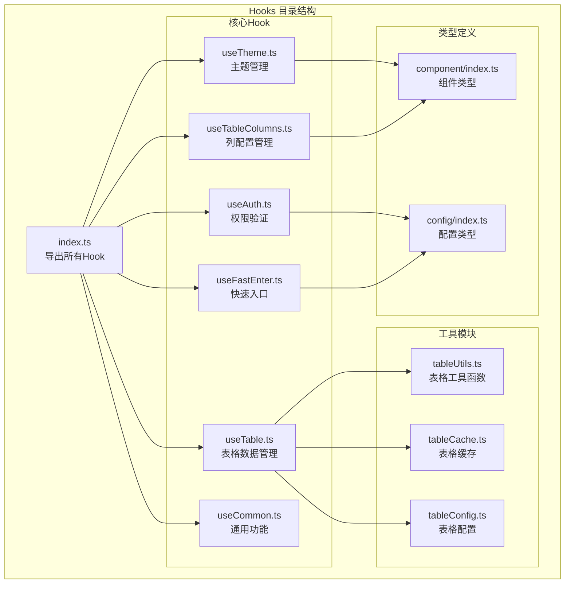
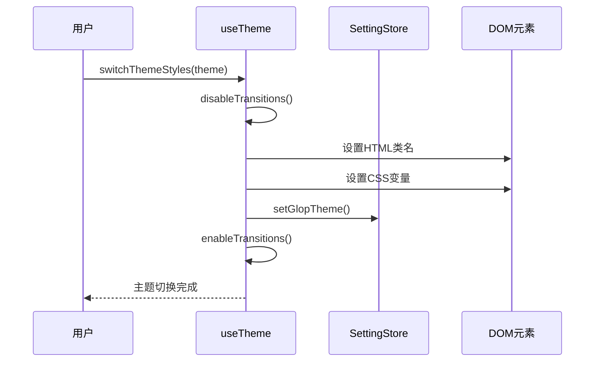
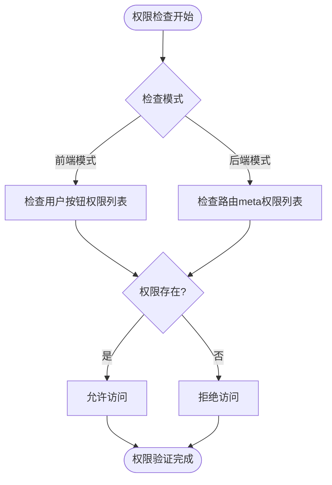
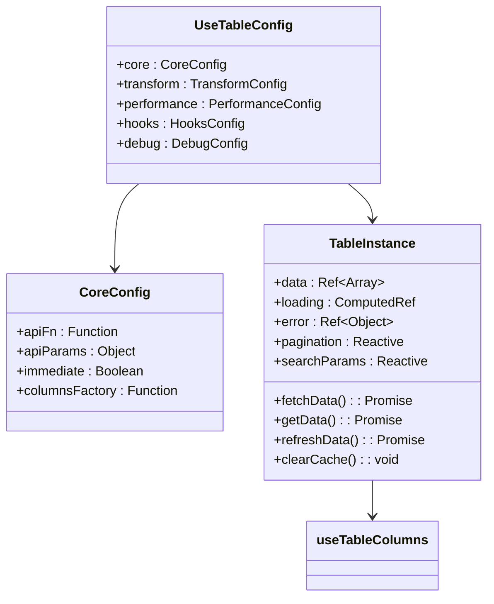
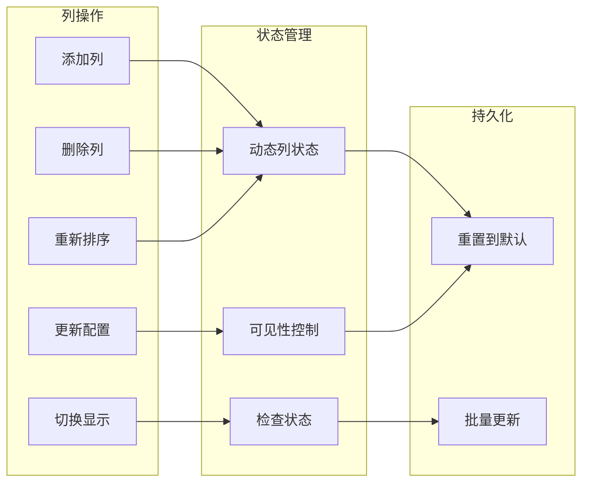
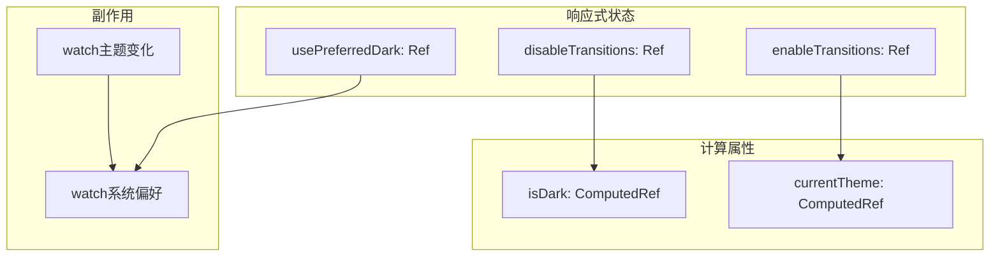
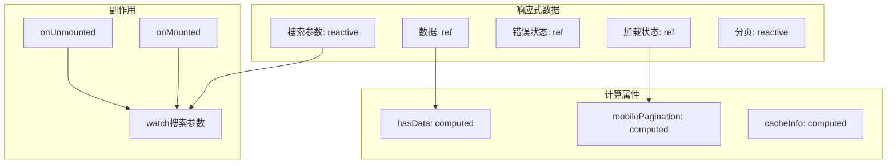
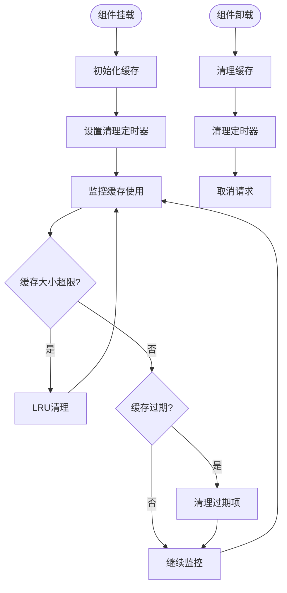

# Hooks 目录深度解析

<cite>
**本文档引用的文件**
- [src/hooks/index.ts](file://src/hooks/index.ts)
- [src/hooks/core/useTheme.ts](file://src/hooks/core/useTheme.ts)
- [src/hooks/core/useAuth.ts](file://src/hooks/core/useAuth.ts)
- [src/hooks/core/useTable.ts](file://src/hooks/core/useTable.ts)
- [src/hooks/core/useTableColumns.ts](file://src/hooks/core/useTableColumns.ts)
- [src/hooks/core/useFastEnter.ts](file://src/hooks/core/useFastEnter.ts)
- [src/types/component/index.ts](file://src/types/component/index.ts)
- [src/types/config/index.ts](file://src/types/config/index.ts)
- [src/utils/table/tableUtils.ts](file://src/utils/table/tableUtils.ts)
- [src/utils/table/tableCache.ts](file://src/utils/table/tableCache.ts)
- [src/views/examples/tables/basic.vue](file://src/views/examples/tables/basic.vue)
- [src/views/system/user/index.vue](file://src/views/system/user/index.vue)
</cite>

## 目录
1. [概述](#概述)
2. [项目架构](#项目架构)
3. [核心Hook详解](#核心hook详解)
4. [响应式API应用](#响应式api应用)
5. [实际使用示例](#实际使用示例)
6. [最佳实践与优化](#最佳实践与优化)
7. [总结](#总结)

## 概述

src/hooks/目录是Art Design Pro项目中组合式函数的核心集合，提供了六个主要的Hook：`useTheme`、`useAuth`、`useTable`、`useTableColumns`、`useFastEnter`和`useCommon`。这些Hook通过Vue 3的响应式API封装了可复用的业务逻辑，实现了状态管理和行为共享。

### 主要特点

- **模块化设计**：每个Hook专注于特定的功能领域
- **响应式集成**：充分利用Vue 3的响应式系统
- **类型安全**：完整的TypeScript类型定义
- **高度可复用**：可在多个组件间共享状态和行为
- **性能优化**：内置缓存、防抖等性能优化机制

## 项目架构



**图表来源**
- [src/hooks/index.ts](file://src/hooks/index.ts#L1-L33)
- [src/hooks/core/useTheme.ts](file://src/hooks/core/useTheme.ts#L1-L175)
- [src/hooks/core/useAuth.ts](file://src/hooks/core/useAuth.ts#L1-L75)
- [src/hooks/core/useTable.ts](file://src/hooks/core/useTable.ts#L1-L737)

## 核心Hook详解

### useTheme - 主题切换逻辑

`useTheme`是一个强大的主题管理系统，支持亮色、暗色和自动模式的主题切换。

#### 核心功能

- **主题切换**：支持三种主题模式（亮色、暗色、自动）
- **颜色适配**：自动调整主题色的明暗变体（9个层级）
- **过渡优化**：切换时临时禁用过渡效果，避免闪烁
- **状态持久化**：主题设置自动保存到store

#### 实现原理



**图表来源**
- [src/hooks/core/useTheme.ts](file://src/hooks/core/useTheme.ts#L61-L98)

#### 关键特性

- **自动模式检测**：使用`usePreferredDark`检测系统主题偏好
- **颜色计算**：通过`getDarkColor`和`getLightColor`动态计算颜色变体
- **性能优化**：使用`requestAnimationFrame`确保过渡效果的正确应用

**章节来源**
- [src/hooks/core/useTheme.ts](file://src/hooks/core/useTheme.ts#L1-L175)

### useAuth - 认证状态管理

`useAuth`提供了统一的权限验证功能，支持前端和后端两种权限模式。

#### 权限验证流程



**图表来源**
- [src/hooks/core/useAuth.ts](file://src/hooks/core/useAuth.ts#L56-L69)

#### 双模式支持

- **前端模式**：从用户信息中获取按钮权限列表（如`['add', 'edit', 'delete']`）
- **后端模式**：从路由meta配置中获取权限列表（如`[{ authMark: 'add' }]`）

**章节来源**
- [src/hooks/core/useAuth.ts](file://src/hooks/core/useAuth.ts#L1-L75)

### useTable - 表格通用逻辑

`useTable`是企业级表格数据管理的完整解决方案，封装了表格开发中的所有常见需求。

#### 核心架构



**图表来源**
- [src/hooks/core/useTable.ts](file://src/hooks/core/useTable.ts#L44-L113)
- [src/hooks/core/useTable.ts](file://src/hooks/core/useTable.ts#L132-L731)

#### 高级功能

- **智能缓存系统**：基于参数的LRU缓存，支持多种失效策略
- **防抖搜索**：智能防抖函数，支持取消和立即执行
- **分页控制**：移动端适配、智能页码边界处理
- **刷新策略**：五种刷新方法适配不同业务场景

**章节来源**
- [src/hooks/core/useTable.ts](file://src/hooks/core/useTable.ts#L1-L737)

### useTableColumns - 列配置管理

`useTableColumns`提供了动态的表格列配置管理能力，支持运行时灵活控制列的显示、隐藏、排序等操作。

#### 列管理功能



**图表来源**
- [src/hooks/core/useTableColumns.ts](file://src/hooks/core/useTableColumns.ts#L82-L135)

**章节来源**
- [src/hooks/core/useTableColumns.ts](file://src/hooks/core/useTableColumns.ts#L1-L257)

### useFastEnter - 快捷入口功能

`useFastEnter`管理顶部栏的快速入口功能，提供应用列表和快速链接的配置和过滤。

#### 配置管理

- **应用列表管理**：获取启用的应用列表，自动按排序权重排序
- **快速链接管理**：获取启用的快速链接，支持自定义排序
- **响应式配置**：所有配置自动响应变化，无需手动更新
- **宽度控制**：提供最小显示宽度配置，支持响应式布局

**章节来源**
- [src/hooks/core/useFastEnter.ts](file://src/hooks/core/useFastEnter.ts#L1-L56)

## 响应式API应用

### ref vs reactive vs computed

在这些Hook中，Vue 3的响应式API得到了充分的应用：

#### useTheme中的响应式应用



**图表来源**
- [src/hooks/core/useTheme.ts](file://src/hooks/core/useTheme.ts#L42-L123)

#### useTable中的复杂响应式



**图表来源**
- [src/hooks/core/useTable.ts](file://src/hooks/core/useTable.ts#L186-L242)

### 响应式模式对比

| Hook | 主要响应式模式 | 用途 |
|------|---------------|------|
| useTheme | ref + computed | 状态标记 + 计算派生状态 |
| useAuth | ref + computed | 权限状态 + 权限判断 |
| useTable | 复合模式 | 复杂状态管理 + 性能优化 |
| useTableColumns | ref + watch + computed | 动态列状态 + 响应式更新 |
| useFastEnter | computed | 配置计算 + 过滤排序 |

## 实际使用示例

### 基础表格使用

以下是一个典型的表格使用示例：

```typescript
// 基础表格实现
const { data, columns, loading, pagination, handleSizeChange, handleCurrentChange } = useTable({
  core: {
    apiFn: fetchGetUserList,
    apiParams: {
      current: 1,
      size: 20,
      userName: '',
      userPhone: '',
      userEmail: ''
    },
    columnsFactory: () => [
      { prop: 'id', label: 'ID' },
      { prop: 'nickName', label: '昵称' },
      { prop: 'userGender', label: '性别', sortable: true },
      { prop: 'userPhone', label: '手机号' },
      { prop: 'userEmail', label: '邮箱' }
    ]
  }
})
```

**章节来源**
- [src/views/examples/tables/basic.vue](file://src/views/examples/tables/basic.vue#L21-L63)

### 高级表格配置

```typescript
// 高级表格配置示例
const {
  columns,
  columnChecks,
  data,
  loading,
  pagination,
  getData,
  searchParams,
  resetSearchParams,
  handleSizeChange,
  handleCurrentChange,
  refreshData
} = useTable({
  core: {
    apiFn: fetchGetUserList,
    apiParams: {
      current: 1,
      size: 20,
      ...searchForm.value
    },
    columnsFactory: () => [
      { type: 'selection' },
      { type: 'index', width: 60, label: '序号' },
      {
        prop: 'userInfo',
        label: '用户名',
        width: 280,
        formatter: (row) => {
          return h('div', { class: 'user flex-c' }, [
            h(ElImage, {
              class: 'size-9.5 rounded-md',
              src: row.avatar,
              previewSrcList: [row.avatar],
              previewTeleported: true
            }),
            h('div', { class: 'ml-2' }, [
              h('p', { class: 'user-name' }, row.userName),
              h('p', { class: 'user-email' }, row.email)
            ])
          ])
        }
      }
    ]
  },
  performance: {
    enableCache: true,
    cacheTime: 5 * 60 * 1000,
    debounceTime: 300
  },
  hooks: {
    onSuccess: (data, response) => {
      console.log('数据加载成功', data)
    },
    onError: (error) => {
      console.error('数据加载失败', error)
    }
  }
})
```

**章节来源**
- [src/views/system/user/index.vue](file://src/views/system/user/index.vue#L95-L139)

### 主题切换示例

```typescript
// 主题切换实现
const { switchThemeStyles, setSystemAutoTheme } = useTheme()

// 切换到暗色主题
switchThemeStyles(SystemThemeEnum.DARK)

// 切换到亮色主题  
switchThemeStyles(SystemThemeEnum.LIGHT)

// 切换到自动模式
switchThemeStyles(SystemThemeEnum.AUTO)
```

### 权限验证示例

```typescript
// 权限验证使用
const { hasAuth } = useAuth()

// 检查权限
if (hasAuth('add')) {
  // 显示新增按钮
}

// 在模板中使用
<el-button v-if="hasAuth('edit')">编辑</el-button>
<el-button v-if="hasAuth('delete')">删除</el-button>
```

### 快速入口配置

```typescript
// 快速入口使用
const { enabledApplications, enabledQuickLinks, minWidth } = useFastEnter()

// 应用列表
enabledApplications.value.forEach(app => {
  console.log(app.name, app.icon)
})

// 快速链接
enabledQuickLinks.value.forEach(link => {
  console.log(link.name, link.link)
})
```

## 最佳实践与优化

### 性能优化策略

#### useTable性能优化

1. **智能缓存机制**
   - 基于参数的LRU缓存
   - 多种缓存失效策略
   - 自动过期管理

2. **防抖搜索优化**
   - 智能防抖函数
   - 支持取消和立即执行
   - 自动去重请求

3. **分页优化**
   - 移动端适配
   - 智能页码边界处理
   - 响应式分页配置

#### 内存管理



**图表来源**
- [src/hooks/core/useTable.ts](file://src/hooks/core/useTable.ts#L595-L616)

### 类型安全实践

#### 泛型支持

```typescript
// useTable泛型使用示例
interface User {
  id: number
  name: string
  email: string
  role: string
}

const { data, loading, error } = useTable<{
  (params: { current: number; size: number; name?: string }): Promise<Api.Common.PaginatedResponse<User>>
}>({
  core: {
    apiFn: fetchUsers,
    apiParams: {
      current: 1,
      size: 10
    }
  }
})
```

#### 类型推导优势

- **自动类型推导**：根据API函数自动推导参数和返回值类型
- **接口约束**：完整的TypeScript类型定义
- **IDE支持**：丰富的代码提示和错误检查

### 错误处理最佳实践

#### 统一错误处理

```typescript
const { data, loading, error, refreshData } = useTable({
  core: {
    apiFn: fetchUserData,
    immediate: true
  },
  hooks: {
    onError: (error) => {
      // 统一错误处理
      if (error.code === 'NETWORK_ERROR') {
        ElMessage.error('网络连接失败，请检查您的网络')
      } else if (error.code === 'AUTH_ERROR') {
        router.push('/login')
      } else {
        ElMessage.error(error.message || '数据加载失败')
      }
    }
  }
})
```

### 测试友好设计

#### Hook的可测试性

1. **纯函数分离**：将纯逻辑与Vue响应式分离
2. **依赖注入**：支持Mock和测试替身
3. **清晰的接口**：明确的输入输出定义

```typescript
// 测试友好的Hook设计
export function createTestableTable(config: UseTableConfig) {
  return useTable(config)
}

// 测试示例
describe('useTable', () => {
  it('should handle data loading', async () => {
    const mockApi = jest.fn().mockResolvedValue(mockResponse)
    const { data, loading } = useTable({
      core: { apiFn: mockApi, immediate: false }
    })
    
    expect(loading.value).toBe(false)
    await getData()
    expect(loading.value).toBe(true)
    await flushPromises()
    expect(loading.value).toBe(false)
    expect(data.value).toEqual(expectedData)
  })
})
```

## 总结

Art Design Pro的Hooks目录展现了现代Vue 3应用开发的最佳实践：

### 核心价值

1. **代码复用性**：通过组合式函数封装通用逻辑，减少重复代码
2. **响应式集成**：充分利用Vue 3的响应式系统，实现高效的状态管理
3. **类型安全**：完整的TypeScript支持，提供良好的开发体验
4. **性能优化**：内置缓存、防抖等性能优化机制
5. **可测试性**：清晰的接口设计，便于单元测试

### 设计原则

- **单一职责**：每个Hook专注特定功能领域
- **组合优先**：通过组合多个Hook实现复杂功能
- **响应式优先**：充分利用Vue 3的响应式特性
- **类型安全**：提供完整的类型定义
- **性能优先**：内置多种性能优化策略

### 应用建议

1. **合理组合**：根据业务需求合理组合不同的Hook
2. **性能监控**：关注缓存命中率和内存使用情况
3. **错误处理**：建立统一的错误处理机制
4. **测试覆盖**：为关键Hook编写单元测试
5. **文档维护**：保持Hook文档的及时更新

这些Hook不仅提升了开发效率，更为项目的长期维护奠定了坚实的基础。通过深入理解和正确使用这些组合式函数，开发者可以构建出更加健壮、高效的Vue 3应用程序。