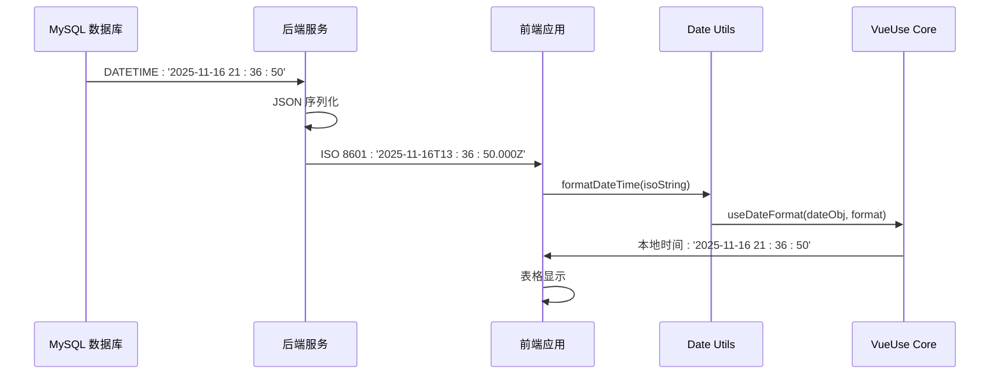
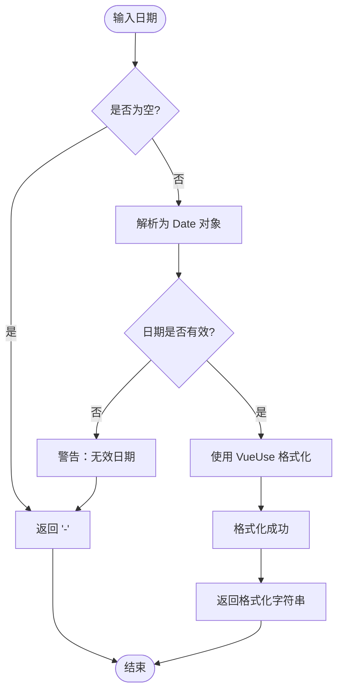
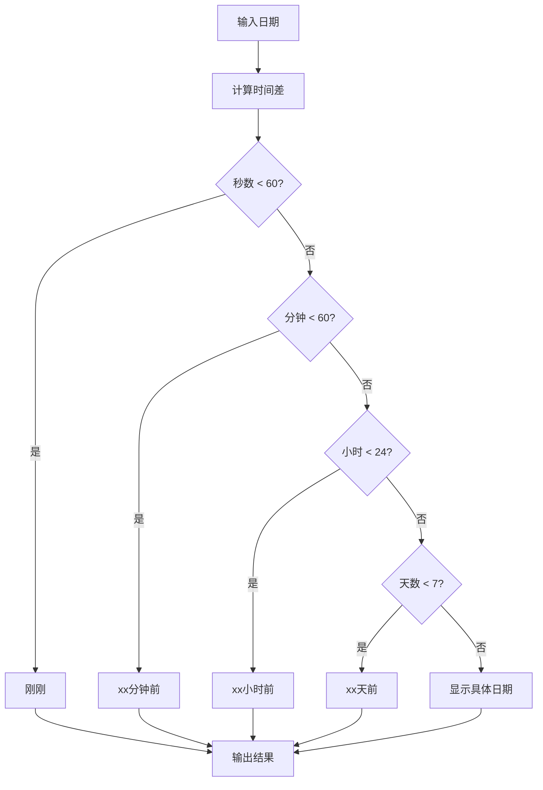

# Date Utils 日期工具

<cite>
**本文档引用的文件**
- [src/utils/date.ts](file://src/utils/date.ts)
- [src/utils/index.ts](file://src/utils/index.ts)
- [src/views/system/user/index.vue](file://src/views/system/user/index.vue)
- [src/views/system/role/index.vue](file://src/views/system/role/index.vue)
- [src/types/api/api.d.ts](file://src/types/api/api.d.ts)
- [项目文档/日期时间格式全局优化说明.md](file://项目文档/日期时间格式全局优化说明.md)
- [项目文档/字段映射与转换规则.md](file://项目文档/字段映射与转换规则.md)
- [src/hooks/core/useTable.ts](file://src/hooks/core/useTable.ts)
</cite>

## 目录

1. [简介](#简介)
2. [项目结构](#项目结构)
3. [核心组件](#核心组件)
4. [架构概览](#架构概览)
5. [详细组件分析](#详细组件分析)
6. [依赖关系分析](#依赖关系分析)
7. [性能考虑](#性能考虑)
8. [故障排除指南](#故障排除指南)
9. [结论](#结论)

## 简介

Date Utils 是 Art Design Pro 项目中的核心日期时间处理工具库，专门负责统一处理前后端日期时间格式转换、时区处理和格式化显示。该工具库解决了前端展示与数据库存储之间的时间格式差异问题，提供了完整的日期时间处理解决方案。

### 主要特性

- **统一格式化**：提供一致的日期时间显示格式
- **时区自动转换**：自动处理 UTC 到本地时间的转换
- **多种格式支持**：支持标准格式、中文格式等多种显示格式
- **类型安全**：完整的 TypeScript 类型定义
- **错误处理**：优雅的空值和无效日期处理
- **响应式支持**：基于 VueUse 的响应式日期格式化

## 项目结构

```mermaid
graph TB
subgraph "日期工具模块"
A[src/utils/date.ts] --> B[格式化函数]
A --> C[格式枚举]
A --> D[辅助函数]
E[src/utils/index.ts] --> A
F[统一导出]
end
subgraph "应用层"
G[src/views/system/user/index.vue] --> A
H[src/views/system/role/index.vue] --> A
I[表格列配置] --> A
end
subgraph "类型定义"
J[src/types/api/api.d.ts] --> K[日期字段类型]
L[API 接口定义] --> K
end
A --> M[@vueuse/core]
```

**图表来源**

- [src/utils/date.ts](file://src/utils/date.ts#L1-L199)
- [src/utils/index.ts](file://src/utils/index.ts#L1-L38)

**章节来源**

- [src/utils/date.ts](file://src/utils/date.ts#L1-L50)
- [src/utils/index.ts](file://src/utils/index.ts#L1-L38)

## 核心组件

### 日期格式化工具函数

Date Utils 提供了完整的日期时间处理功能，包括格式化、解析和相对时间计算。

#### 主要函数

1. **formatDateTime()** - 核心格式化函数
2. **formatDate()** - 仅显示日期部分
3. **formatTime()** - 仅显示时间部分
4. **getRelativeTime()** - 相对时间描述
5. **isToday()** - 判断是否为今天

#### 格式枚举

```typescript
enum DateFormat {
  DateTime = 'YYYY-MM-DD HH:mm:ss', // 日期时间
  Date = 'YYYY-MM-DD', // 仅日期
  Time = 'HH:mm:ss', // 仅时间
  DateTimeShort = 'YYYY-MM-DD HH:mm', // 日期时间（短）
  DateTimeCN = 'YYYY年MM月DD日 HH:mm:ss', // 中文日期时间
  DateCN = 'YYYY年MM月DD日' // 中文日期
}
```

**章节来源**

- [src/utils/date.ts](file://src/utils/date.ts#L15-L28)
- [src/utils/date.ts](file://src/utils/date.ts#L58-L97)

## 架构概览



**图表来源**

- [项目文档/日期时间格式全局优化说明.md](file://项目文档/日期时间格式全局优化说明.md#L155-L178)

## 详细组件分析

### 格式化函数实现

#### formatDateTime() 核心函数

该函数是整个日期工具的核心，负责将各种格式的日期时间转换为本地时间格式。



**图表来源**

- [src/utils/date.ts](file://src/utils/date.ts#L67-L96)

#### 辅助函数分析

##### formatDate() - 日期格式化

专门用于提取日期部分，简化常用场景的使用。

##### formatTime() - 时间格式化

专门用于提取时间部分，适用于时间显示场景。

##### getRelativeTime() - 相对时间

提供人性化的相对时间描述，提升用户体验。



**图表来源**

- [src/utils/date.ts](file://src/utils/date.ts#L169-L198)

**章节来源**

- [src/utils/date.ts](file://src/utils/date.ts#L58-L97)
- [src/utils/date.ts](file://src/utils/date.ts#L111-L129)
- [src/utils/date.ts](file://src/utils/date.ts#L169-L198)

### 应用集成分析

#### 用户管理页面集成

在用户管理页面中，日期工具被广泛应用于表格列的格式化显示。

```typescript
// 表格列配置示例
{
  prop: 'createTime',
  label: '创建日期',
  sortable: true,
  formatter: (row) => formatDateTime(row.createTime)
}
```

#### 角色管理页面集成

角色管理页面同样采用相同的日期格式化策略，确保一致性。

**章节来源**

- [src/views/system/user/index.vue](file://src/views/system/user/index.vue#L180-L185)
- [src/views/system/role/index.vue](file://src/views/system/role/index.vue#L147-L152)

### 类型系统集成

#### API 类型定义

项目中的 API 类型系统包含了完整的日期字段定义，确保类型安全。

```typescript
interface UserListItem {
  id: number
  avatar: string
  status: string
  userName: string
  userGender: number
  nickName: string
  userPhone: string
  userEmail: string
  userRoles: string[]
  createTime: string // 来自数据库的 ISO 8601 格式
  updateTime: string
}
```

**章节来源**

- [src/types/api/api.d.ts](file://src/types/api/api.d.ts#L95-L106)

## 依赖关系分析

```mermaid
graph LR
A[date.ts] --> B[@vueuse/core]
C[index.ts] --> A
D[user/index.vue] --> A
E[role/index.vue] --> A
F[api.d.ts] --> G[类型定义]
B --> H[useDateFormat]
H --> I[响应式日期格式化]
style A fill:#e1f5fe
style B fill:#f3e5f5
style C fill:#e8f5e8
```

**图表来源**

- [src/utils/date.ts](file://src/utils/date.ts#L10)
- [src/utils/index.ts](file://src/utils/index.ts#L37)

### 外部依赖

- **@vueuse/core**: 提供 useDateFormat 响应式日期格式化功能
- **TypeScript**: 完整的类型定义和编译时检查

### 内部依赖

- **统一导出**: 通过 `src/utils/index.ts` 提供统一的导入路径
- **API 类型**: 与后端 API 类型定义保持一致

**章节来源**

- [src/utils/date.ts](file://src/utils/date.ts#L10)
- [src/utils/index.ts](file://src/utils/index.ts#L37)

## 性能考虑

### 缓存策略

虽然日期工具本身不包含复杂的缓存机制，但其设计考虑了以下性能优化：

1. **响应式集成**: 利用 VueUse 的响应式系统，避免不必要的重新计算
2. **类型安全**: 通过 TypeScript 预防运行时错误，提高性能
3. **错误处理**: 优雅的错误处理减少异常情况下的性能损失

### 时区处理优化

- **自动时区转换**: JavaScript 的 Date 对象自动处理时区转换
- **浏览器本地时间**: 直接使用浏览器的本地时间设置，无需额外计算

## 故障排除指南

### 常见问题及解决方案

#### 1. 日期显示为 ISO 格式

**问题**: 表格中仍然显示 `2025-11-16T13:36:50.000Z` 而不是本地时间

**解决方案**:

- 确保在表格列配置中使用 `formatter` 函数
- 检查是否正确导入了 `formatDateTime` 函数
- 验证数据源中的日期字段是否为 ISO 8601 格式

#### 2. 空值处理

**问题**: 空值导致显示异常

**解决方案**:

```typescript
// 自动处理空值
formatDateTime(null) // 返回 '-'
formatDateTime(undefined) // 返回 '-'
formatDateTime('') // 返回 '-'
```

#### 3. 无效日期格式

**问题**: 无效的日期格式导致错误

**解决方案**:

- 函数内部已进行有效性检查
- 无效日期返回 `'-'`
- 控制台会有相应的警告信息

**章节来源**

- [src/utils/date.ts](file://src/utils/date.ts#L63-L65)
- [src/utils/date.ts](file://src/utils/date.ts#L81-L83)
- [src/utils/date.ts](file://src/utils/date.ts#L86-L89)

## 结论

Date Utils 是 Art Design Pro 项目中不可或缺的日期时间处理工具，它成功解决了前端展示与数据库存储之间的格式差异问题。通过统一的格式化策略、完善的类型定义和优雅的错误处理，该工具库为项目提供了稳定可靠的日期时间处理能力。

### 主要优势

1. **一致性**: 确保项目中所有日期时间显示格式的一致性
2. **易用性**: 简洁的 API 设计，一行代码即可完成格式化
3. **可靠性**: 完善的错误处理和类型安全
4. **扩展性**: 支持多种格式和自定义需求
5. **性能**: 基于 VueUse 的响应式设计，性能优异

### 应用范围

目前该工具已在以下页面中应用：

- 用户管理页面 (`src/views/system/user/index.vue`)
- 角色管理页面 (`src/views/system/role/index.vue`)

### 未来发展方向

1. **更多格式支持**: 可以考虑添加更多国际化日期格式
2. **时间范围选择器**: 与 Element Plus 的 DatePicker 组件深度集成
3. **批量处理**: 支持大量日期数据的高效处理
4. **配置化**: 提供更灵活的配置选项

通过持续的优化和完善，Date Utils 将继续为 Art Design Pro 项目提供高质量的日期时间处理服务。
