# 工具函数目录

<cite>
**本文档引用的文件**  
- [src/utils/index.ts](file://src/utils/index.ts)
- [src/utils/http/index.ts](file://src/utils/http/index.ts)
- [src/utils/http/error.ts](file://src/utils/http/error.ts)
- [src/utils/http/status.ts](file://src/utils/http/status.ts)
- [src/utils/storage/index.ts](file://src/utils/storage/index.ts)
- [src/utils/storage/storage.ts](file://src/utils/storage/storage.ts)
- [src/utils/storage/storage-config.ts](file://src/utils/storage/storage-config.ts)
- [src/utils/storage/storage-key-manager.ts](file://src/utils/storage/storage-key-manager.ts)
- [src/utils/router.ts](file://src/utils/router.ts)
- [src/utils/navigation/index.ts](file://src/utils/navigation/index.ts)
- [src/utils/navigation/jump.ts](file://src/utils/navigation/jump.ts)
- [src/utils/navigation/worktab.ts](file://src/utils/navigation/worktab.ts)
- [src/utils/navigation/route.ts](file://src/utils/navigation/route.ts)
- [src/utils/table/tableCache.ts](file://src/utils/table/tableCache.ts)
- [src/utils/table/tableConfig.ts](file://src/utils/table/tableConfig.ts)
- [src/utils/table/tableUtils.ts](file://src/utils/table/tableUtils.ts)
- [src/utils/sys/index.ts](file://src/utils/sys/index.ts)
- [src/utils/sys/mittBus.ts](file://src/utils/sys/mittBus.ts)
- [src/utils/sys/error-handle.ts](file://src/utils/sys/error-handle.ts)
- [src/utils/sys/console.ts](file://src/utils/sys/console.ts)
- [src/utils/sys/upgrade.ts](file://src/utils/sys/upgrade.ts)
</cite>

## 目录

1. [简介](#简介)
2. [项目结构](#项目结构)
3. [核心组件](#核心组件)
4. [架构概述](#架构概述)
5. [详细组件分析](#详细组件分析)
6. [依赖分析](#依赖分析)
7. [性能考虑](#性能考虑)
8. [故障排除指南](#故障排除指南)
9. [结论](#结论)
10. [附录](#附录)（如有必要）

## 简介

本文档全面介绍了 `src/utils/` 目录中各类工具函数的分类与用途。重点说明 `http/` 模块如何封装 axios 实例、请求拦截、响应处理和错误码映射；`storage/` 模块如何提供统一的本地存储接口；`router.ts` 如何封装路由跳转逻辑；`table/` 模块如何处理表格缓存与配置；`sys/` 模块如何实现全局事件总线（mittBus）和错误处理。强调工具函数的纯函数特性、类型安全和可测试性，并提供典型使用场景示例，帮助开发者正确调用这些工具函数以提升开发效率。

## 项目结构

`src/utils/` 目录是项目的核心工具函数集合，采用模块化设计，每个子模块负责特定领域的功能。这种结构提高了代码的可维护性和可复用性。

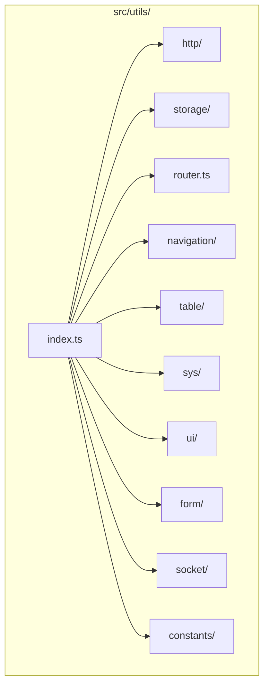

**图示来源**

- [src/utils/index.ts](file://src/utils/index.ts)

## 核心组件

`src/utils/` 目录的核心组件包括 HTTP 请求封装、本地存储管理、路由导航、表格处理和系统级工具。这些组件共同构成了应用的基础支撑体系。

**章节来源**

- [src/utils/index.ts](file://src/utils/index.ts)

## 架构概述

整个工具函数库采用分层架构，`index.ts` 作为统一入口，各子模块独立实现具体功能，通过类型安全的接口对外暴露。模块间低耦合，便于独立维护和测试。

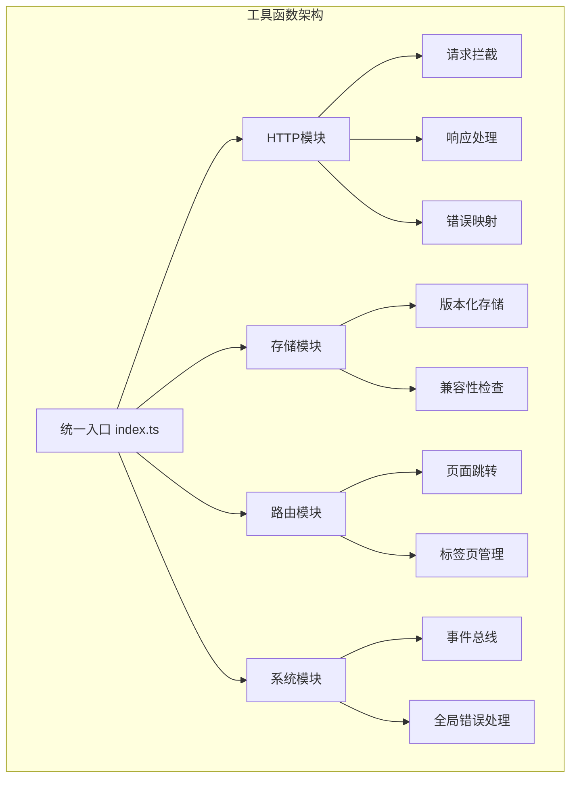

**图示来源**

- [src/utils/index.ts](file://src/utils/index.ts)
- [src/utils/http/index.ts](file://src/utils/http/index.ts)
- [src/utils/storage/storage.ts](file://src/utils/storage/storage.ts)
- [src/utils/navigation/jump.ts](file://src/utils/navigation/jump.ts)
- [src/utils/sys/mittBus.ts](file://src/utils/sys/mittBus.ts)

## 详细组件分析

本节将深入分析 `src/utils/` 目录下的各个关键组件，包括其实现原理、设计模式和使用方法。

### HTTP 模块分析

`http/` 模块基于 Axios 封装，提供了统一的请求/响应处理、错误处理和消息提示功能。

#### HTTP 请求封装

该模块通过创建 Axios 实例并配置拦截器，实现了请求的统一处理。请求拦截器自动添加 Token 和 Content-Type，响应拦截器则处理 401 未授权状态和业务错误码。

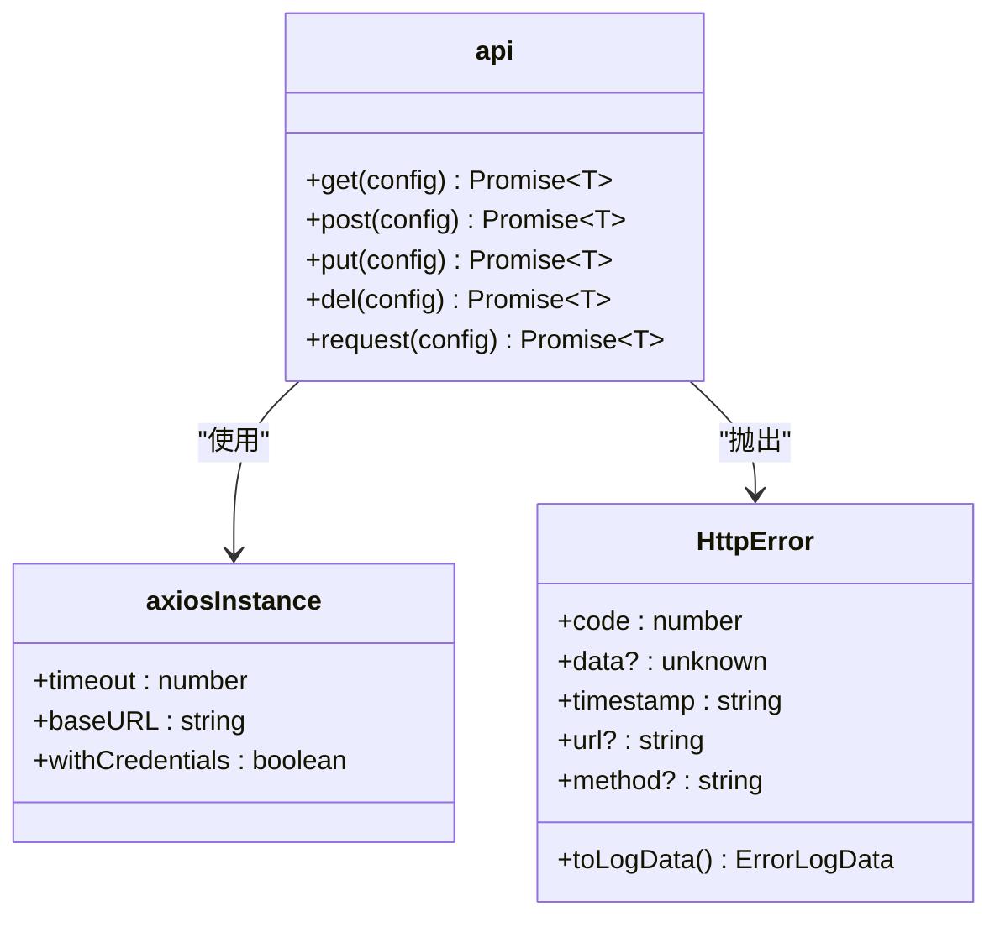

**图示来源**

- [src/utils/http/index.ts](file://src/utils/http/index.ts)
- [src/utils/http/error.ts](file://src/utils/http/error.ts)

#### 请求/响应处理流程

HTTP 模块实现了完整的请求生命周期管理，包括请求配置、拦截、重试和响应处理。

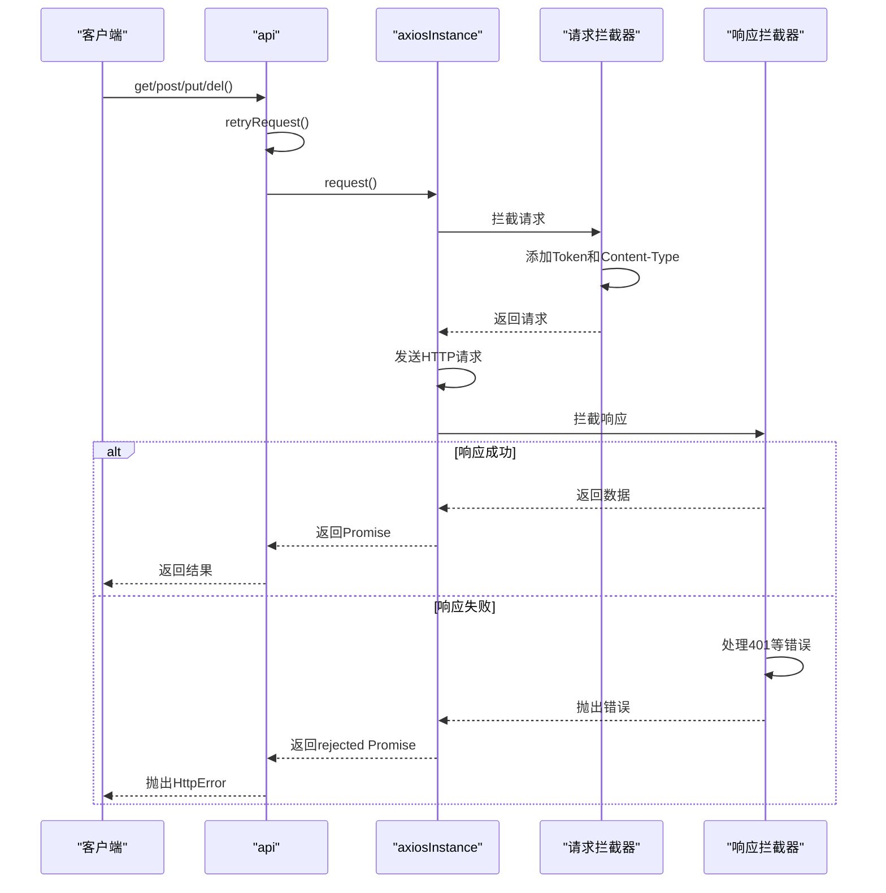

**图示来源**

- [src/utils/http/index.ts](file://src/utils/http/index.ts)

#### 错误码映射机制

HTTP 模块通过 `status.ts` 定义了标准的 API 状态码，并在 `error.ts` 中实现了错误码到用户友好消息的映射。

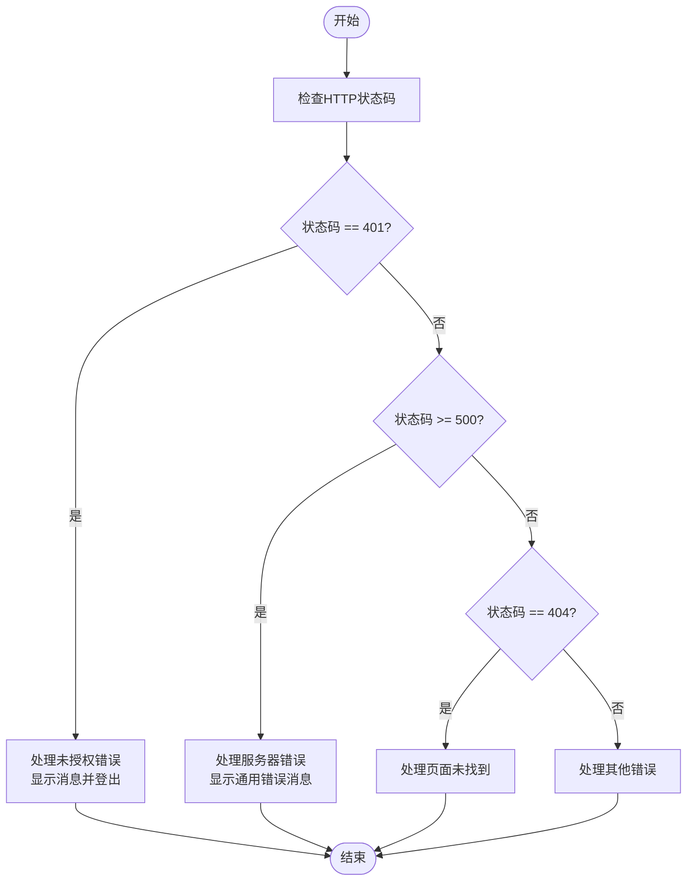

**图示来源**

- [src/utils/http/status.ts](file://src/utils/http/status.ts)
- [src/utils/http/error.ts](file://src/utils/http/error.ts)

### 存储模块分析

`storage/` 模块提供了一套完整的本地存储解决方案，支持版本化存储、数据兼容性检查和异常恢复。

#### 统一存储接口

该模块通过 `storage.ts`、`storage-config.ts` 和 `storage-key-manager.ts` 三个文件协同工作，提供了统一的存储接口。

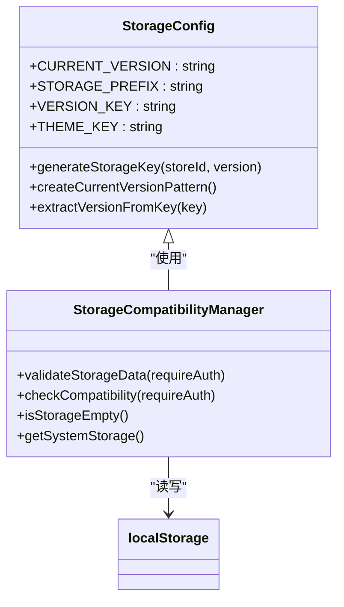

**图示来源**

- [src/utils/storage/storage-config.ts](file://src/utils/storage/storage-config.ts)
- [src/utils/storage/storage.ts](file://src/utils/storage/storage.ts)

#### 版本化存储机制

存储模块采用版本化键名策略，确保不同版本的应用数据隔离，避免升级时的数据冲突。

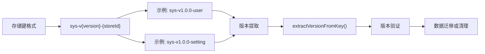

**图示来源**

- [src/utils/storage/storage-config.ts](file://src/utils/storage/storage-config.ts)

### 路由模块分析

`router.ts` 文件封装了与路由相关的工具函数，主要用于设置页面标题和配置导航进度条。

#### 路由跳转逻辑封装

虽然主要的路由跳转逻辑在 `navigation/` 目录下，但 `router.ts` 提供了基础的路由工具函数。

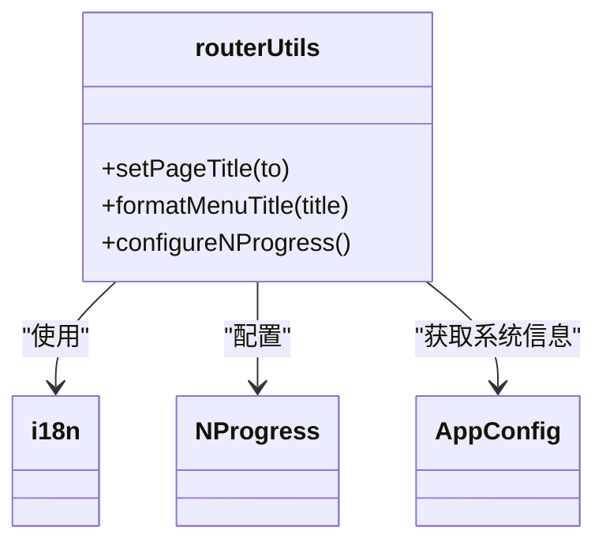

**图示来源**

- [src/utils/router.ts](file://src/utils/router.ts)

#### 导航跳转实现

`navigation/` 目录下的工具函数处理了复杂的导航逻辑，包括外部链接跳转和菜单项跳转。

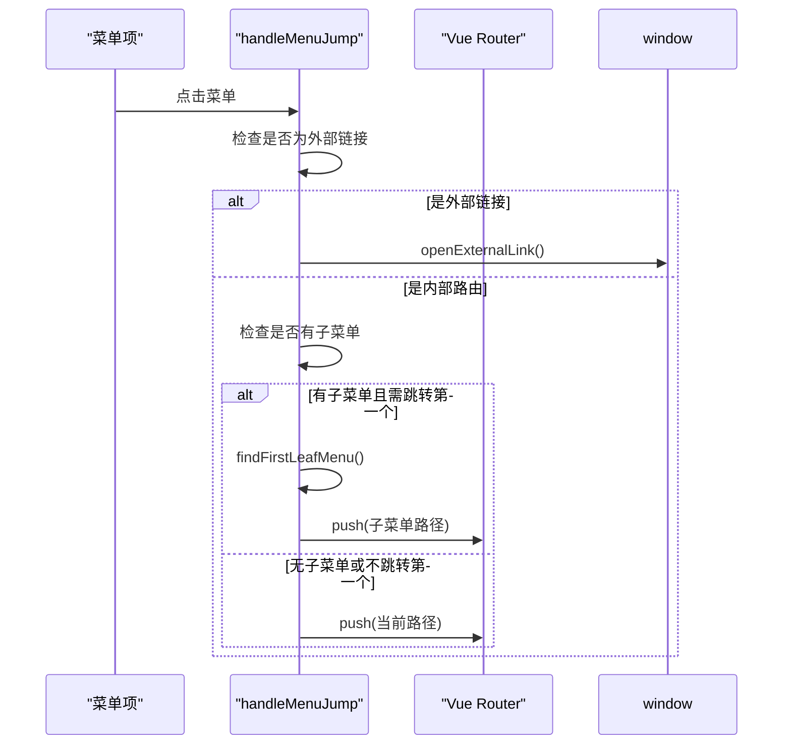

**图示来源**

- [src/utils/navigation/jump.ts](file://src/utils/navigation/jump.ts)

### 表格模块分析

`table/` 模块提供了表格数据缓存和配置管理功能，显著提升了表格组件的性能和用户体验。

#### 表格缓存管理

`tableCache.ts` 实现了一个基于 LRU（最近最少使用）策略的高性能缓存系统。

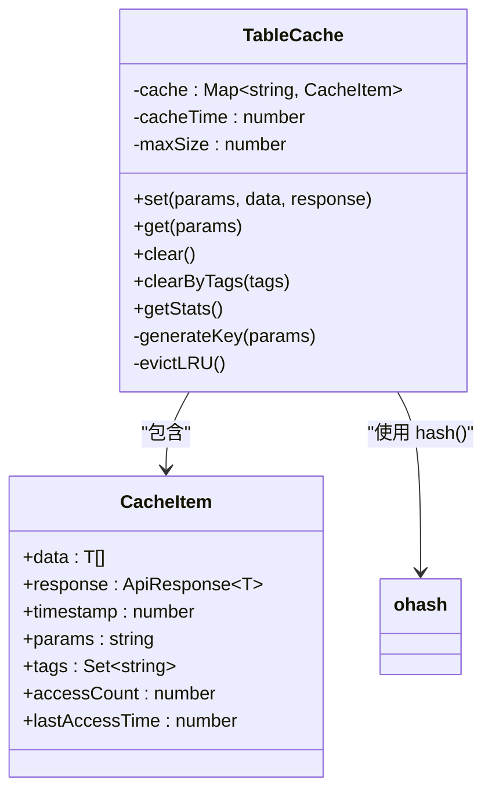

**图示来源**

- [src/utils/table/tableCache.ts](file://src/utils/table/tableCache.ts)

#### 表格配置管理

`tableConfig.ts` 定义了表格与后端接口的字段映射配置，支持多种常见的分页接口格式。

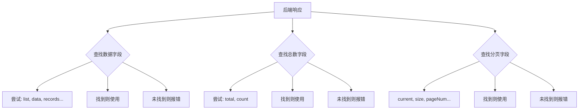

**图示来源**

- [src/utils/table/tableConfig.ts](file://src/utils/table/tableConfig.ts)

### 系统模块分析

`sys/` 模块包含了全局性的系统工具，如事件总线和错误处理，是应用的基础设施。

#### 全局事件总线实现

`mittBus.ts` 基于 mitt 库实现了类型安全的全局事件总线，用于组件间的解耦通信。

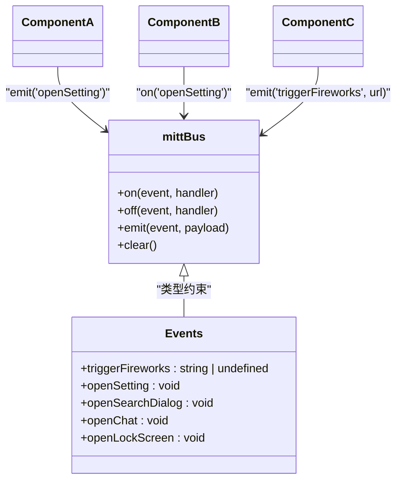

**图示来源**

- [src/utils/sys/mittBus.ts](file://src/utils/sys/mittBus.ts)

#### 全局错误处理机制

`error-handle.ts` 提供了统一的错误捕获和处理机制，覆盖了 Vue 运行时错误、脚本错误、Promise 错误和资源加载错误。

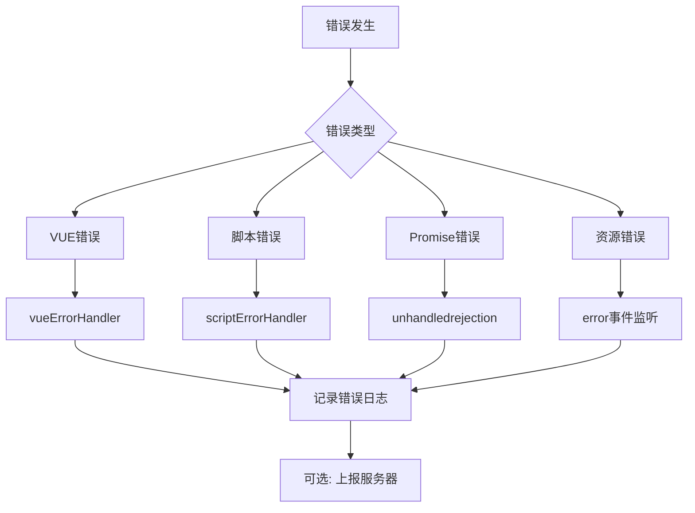

**图示来源**

- [src/utils/sys/error-handle.ts](file://src/utils/sys/error-handle.ts)

## 依赖分析

`src/utils/` 目录下的各个模块之间保持了低耦合，主要依赖外部库和项目内的核心模块。

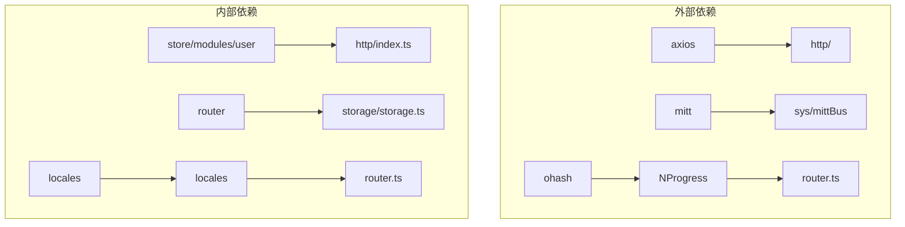

**图示来源**

- [src/utils/http/index.ts](file://src/utils/http/index.ts)
- [src/utils/sys/mittBus.ts](file://src/utils/sys/mittBus.ts)
- [src/utils/table/tableCache.ts](file://src/utils/table/tableCache.ts)
- [src/utils/router.ts](file://src/utils/router.ts)
- [src/utils/storage/storage.ts](file://src/utils/storage/storage.ts)

## 性能考虑

各个工具模块在设计时都充分考虑了性能因素。HTTP 模块通过请求重试和防抖机制提升了稳定性；存储模块通过版本化键名和兼容性检查避免了数据冲突；表格模块通过 LRU 缓存策略显著减少了重复的 API 请求；事件总线通过类型安全的设计减少了运行时错误。

## 故障排除指南

当遇到工具函数相关的问题时，可以参考以下指南进行排查：

1. **HTTP 请求失败**：检查网络连接，确认 baseURL 配置正确，查看控制台是否有 401 错误。
2. **存储数据丢失**：检查浏览器是否禁用了 localStorage，确认版本号是否正确。
3. **路由跳转异常**：检查路由配置是否正确，确认菜单项的 path 或 link 属性是否有效。
4. **事件总线无响应**：确认事件名称拼写正确，检查订阅和发布的时机是否合理。
5. **表格缓存未生效**：确认请求参数是否稳定，检查缓存键生成逻辑。

**章节来源**

- [src/utils/http/error.ts](file://src/utils/http/error.ts)
- [src/utils/storage/storage.ts](file://src/utils/storage/storage.ts)
- [src/utils/navigation/jump.ts](file://src/utils/navigation/jump.ts)
- [src/utils/sys/mittBus.ts](file://src/utils/sys/mittBus.ts)

## 结论

`src/utils/` 目录中的工具函数经过精心设计，具有良好的模块化结构、类型安全性和可测试性。通过合理使用这些工具函数，开发者可以显著提升开发效率，减少重复代码，并确保应用的稳定性和一致性。建议在项目中遵循这些工具函数的设计模式，以保持代码风格的统一。

## 附录

### 典型使用场景示例

#### HTTP 请求示例

```typescript
import api from '@/utils/http'

// 获取用户列表
const users = await api.get({ url: '/api/users', showSuccessMessage: true })

// 创建新用户
await api.post({
  url: '/api/users',
  data: userData,
  showErrorMessage: true
})
```

#### 存储操作示例

```typescript
import { checkStorageCompatibility } from '@/utils/storage'

// 在应用启动时检查存储兼容性
if (!checkStorageCompatibility(true)) {
  // 存储异常，需要重新登录
}
```

#### 事件总线使用示例

```typescript
import mittBus from '@/utils/sys/mittBus'

// 订阅设置面板打开事件
mittBus.on('openSetting', () => {
  console.log('设置面板已打开')
})

// 发布烟花效果事件
mittBus.emit('triggerFireworks', 'https://example.com/fireworks.gif')
```

#### 表格缓存使用示例

```typescript
import { TableCache } from '@/utils/table/tableCache'

const cache = new TableCache(300000, 50) // 5分钟缓存，最多50条

// 缓存数据
cache.set(params, data, response)

// 获取缓存
const cached = cache.get(params)
if (cached) {
  // 使用缓存数据
}
```
