# 状态模块目录

<cite>
**本文档中引用的文件**
- [src/store/modules/menu.ts](file://src/store/modules/menu.ts)
- [src/store/modules/setting.ts](file://src/store/modules/setting.ts)
- [src/store/modules/user.ts](file://src/store/modules/user.ts)
- [src/store/modules/worktab.ts](file://src/store/modules/worktab.ts)
- [src/store/modules/table.ts](file://src/store/modules/table.ts)
- [src/store/index.ts](file://src/store/index.ts)
- [src/types/store/index.ts](file://src/types/store/index.ts)
- [src/config/setting.ts](file://src/config/setting.ts)
- [src/enums/appEnum.ts](file://src/enums/appEnum.ts)
- [src/utils/storage/storage-key-manager.ts](file://src/utils/storage/storage-key-manager.ts)
</cite>

## 目录
1. [概述](#概述)
2. [项目结构](#项目结构)
3. [核心模块分析](#核心模块分析)
4. [状态持久化机制](#状态持久化机制)
5. [模块间通信](#模块间通信)
6. [使用示例](#使用示例)
7. [最佳实践](#最佳实践)
8. [总结](#总结)

## 概述

Art Design Pro 采用 Pinia 作为状态管理解决方案，提供了完整的模块化状态管理架构。该架构通过五个核心模块（menu、setting、user、worktab、table）实现了应用状态的精细化管理，每个模块都遵循单一职责原则，具有明确的功能边界和清晰的命名空间。

### 主要特点

- **模块化设计**：每个状态模块独立管理特定领域的状态
- **命名空间隔离**：通过模块名称避免状态冲突
- **持久化支持**：自动处理状态的本地存储和恢复
- **类型安全**：完整的 TypeScript 类型定义
- **组合式 API**：充分利用 Vue 3 的 Composition API 特性

## 项目结构

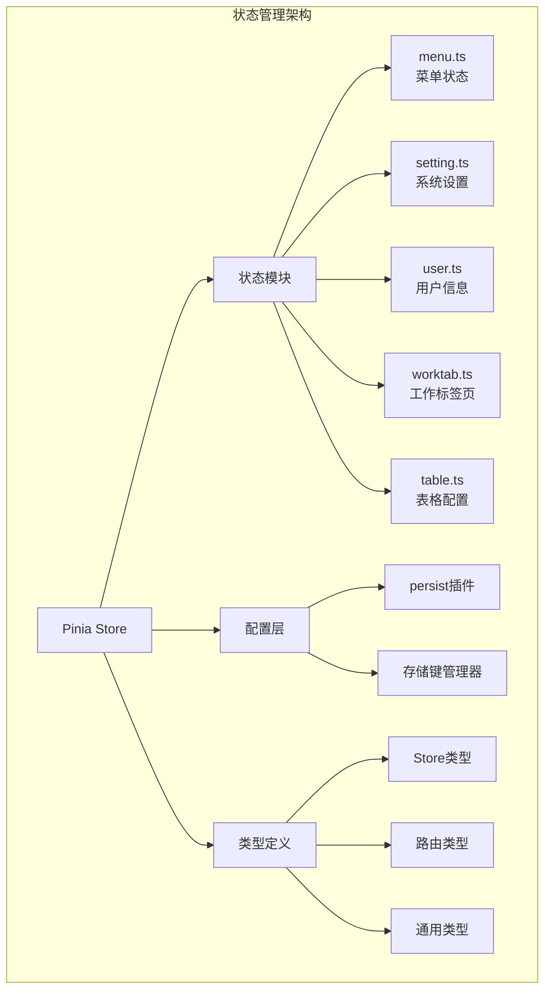

**图表来源**
- [src/store/index.ts](file://src/store/index.ts#L1-L53)
- [src/store/modules/menu.ts](file://src/store/modules/menu.ts#L1-L110)
- [src/store/modules/setting.ts](file://src/store/modules/setting.ts#L1-L451)

**章节来源**
- [src/store/index.ts](file://src/store/index.ts#L1-L53)
- [src/store/modules/menu.ts](file://src/store/modules/menu.ts#L1-L110)
- [src/store/modules/setting.ts](file://src/store/modules/setting.ts#L1-L451)
- [src/store/modules/user.ts](file://src/store/modules/user.ts#L1-L236)
- [src/store/modules/worktab.ts](file://src/store/modules/worktab.ts#L1-L569)
- [src/store/modules/table.ts](file://src/store/modules/table.ts#L1-L98)

## 核心模块分析

### menu.ts - 菜单状态管理

menu 模块负责管理应用的菜单系统和动态路由状态，是整个应用导航的核心控制器。

#### 核心功能架构

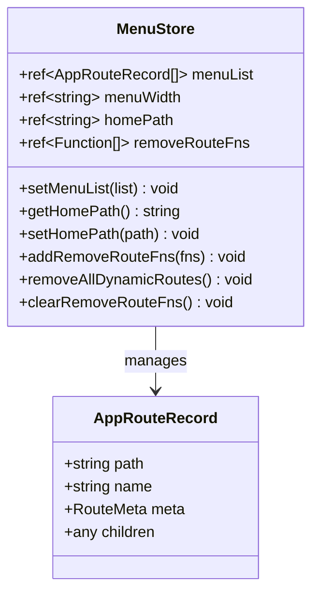

**图表来源**
- [src/store/modules/menu.ts](file://src/store/modules/menu.ts#L41-L108)

#### 状态设计原则

- **state 层**：包含菜单列表、宽度、首页路径和路由移除函数
- **getters 层**：提供状态查询方法，如获取首页路径
- **actions 层**：包含菜单设置、路由管理、清理等功能

#### 工作流程

1. **菜单初始化**：通过 `setMenuList` 设置菜单路由记录
2. **路由注册**：动态添加路由并保存移除函数
3. **状态维护**：管理菜单宽度和首页路径
4. **资源清理**：登出时移除所有动态路由

**章节来源**
- [src/store/modules/menu.ts](file://src/store/modules/menu.ts#L1-L110)

### setting.ts - 系统设置管理

setting 模块是最复杂的状态模块，管理应用的所有系统设置，包括主题、布局、界面显示等。

#### 状态分类架构

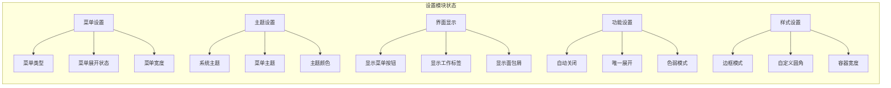

**图表来源**
- [src/store/modules/setting.ts](file://src/store/modules/setting.ts#L47-L120)

#### 计算属性设计

设置模块大量使用计算属性来派生状态：

- `getMenuTheme()`：根据主题类型和模式返回菜单主题
- `isDark()`：判断是否为暗色模式
- `getMenuOpenWidth()`：获取菜单展开宽度
- `getCustomRadius()`：获取自定义圆角值
- `isShowFireworks()`：判断是否显示烟花效果

#### 功能开关管理

模块提供了丰富的功能开关，通过统一的命名规范实现：

- `setButton()`：切换菜单按钮显示
- `setWorkTab(show)`：设置工作标签显示
- `setColorWeak()`：切换色弱模式
- `setAutoClose()`：切换自动关闭功能

**章节来源**
- [src/store/modules/setting.ts](file://src/store/modules/setting.ts#L1-L451)

### user.ts - 用户信息管理

user 模块专门管理用户相关的状态，包括认证信息、个人资料、语言设置等。

#### 状态层次结构

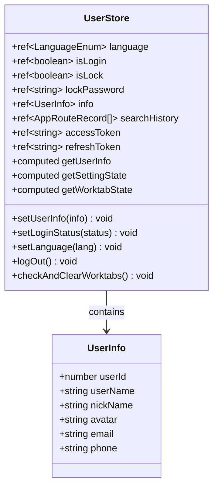

**图表来源**
- [src/store/modules/user.ts](file://src/store/modules/user.ts#L50-L227)

#### 认证状态管理

- **登录状态**：`isLogin` 控制用户认证状态
- **令牌管理**：同时维护访问令牌和刷新令牌
- **用户信息**：存储完整的用户资料信息
- **搜索历史**：记录用户的搜索行为

#### 登出流程设计

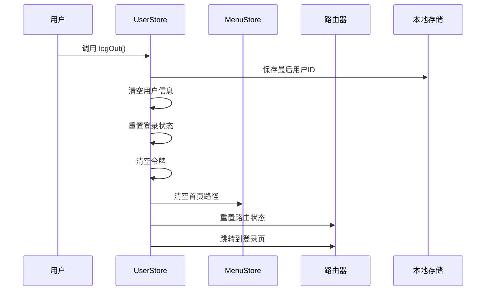

**图表来源**
- [src/store/modules/user.ts](file://src/store/modules/user.ts#L139-L176)

**章节来源**
- [src/store/modules/user.ts](file://src/store/modules/user.ts#L1-L236)

### worktab.ts - 工作标签页管理

worktab 模块实现了复杂的多标签页功能，是用户体验的核心组件之一。

#### 标签页状态模型

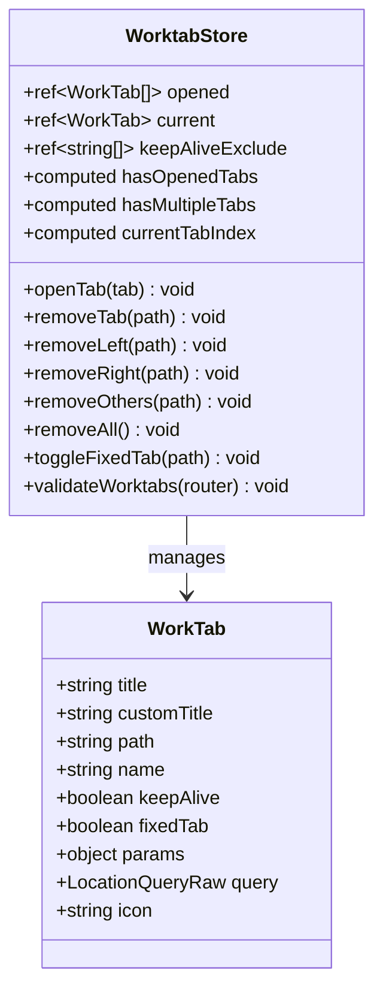

**图表来源**
- [src/store/modules/worktab.ts](file://src/store/modules/worktab.ts#L47-L560)

#### 标签页生命周期

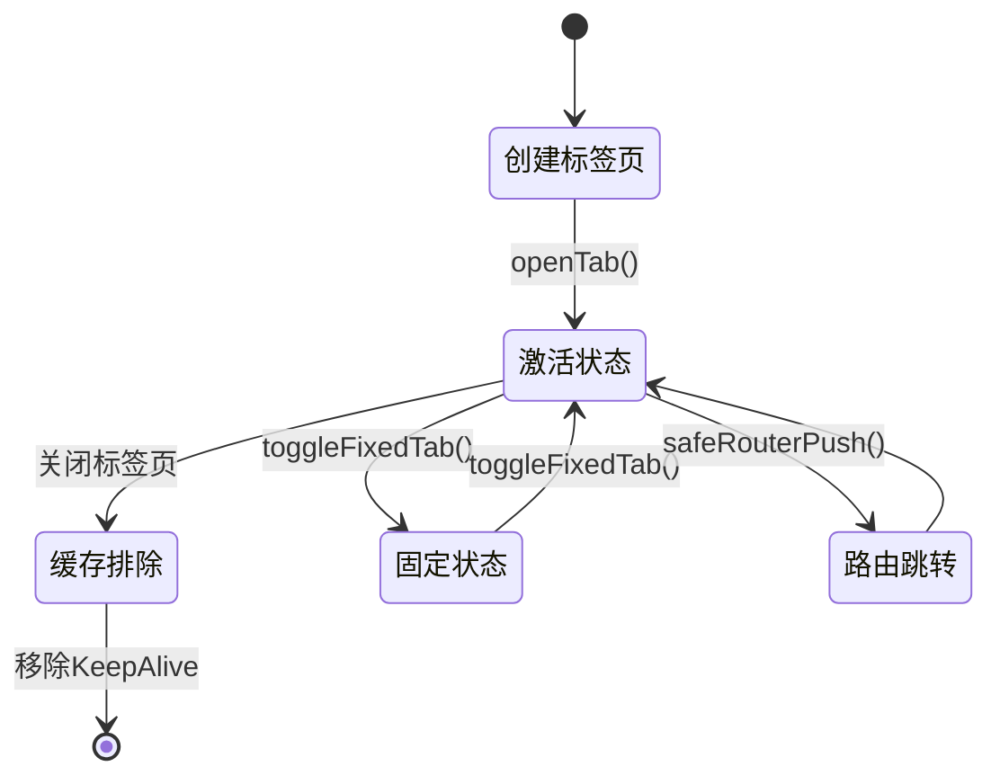

**图表来源**
- [src/store/modules/worktab.ts](file://src/store/modules/worktab.ts#L112-L223)

#### 批量操作功能

worktab 模块提供了强大的批量标签页操作：

- **左侧关闭**：`removeLeft(path)` - 关闭指定标签页左侧的所有可关闭标签
- **右侧关闭**：`removeRight(path)` - 关闭指定标签页右侧的所有可关闭标签  
- **其他关闭**：`removeOthers(path)` - 保留当前标签页和其他固定标签页
- **全部关闭**：`removeAll()` - 关闭所有可关闭的标签页

**章节来源**
- [src/store/modules/worktab.ts](file://src/store/modules/worktab.ts#L1-L569)

### table.ts - 表格配置管理

table 模块相对简单，专注于表格显示样式的配置管理。

#### 配置状态设计

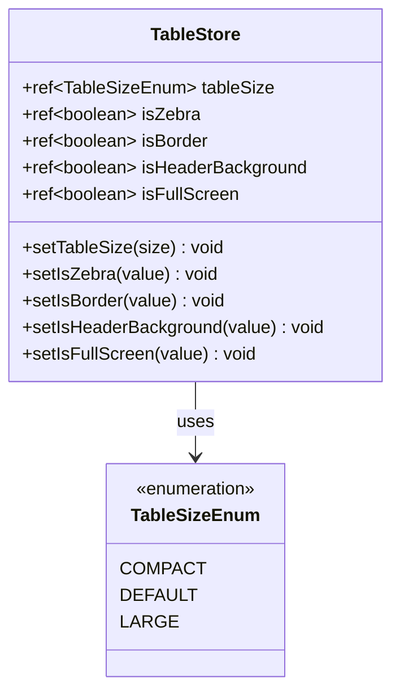

**图表来源**
- [src/store/modules/table.ts](file://src/store/modules/table.ts#L32-L89)

**章节来源**
- [src/store/modules/table.ts](file://src/store/modules/table.ts#L1-L98)

## 状态持久化机制

### 持久化架构

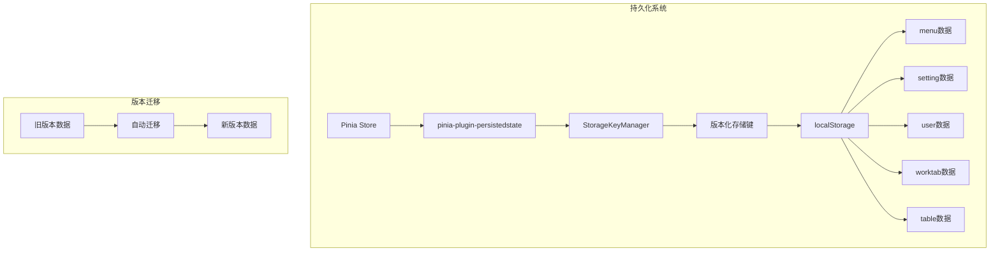

**图表来源**
- [src/store/index.ts](file://src/store/index.ts#L36-L45)
- [src/utils/storage/storage-key-manager.ts](file://src/utils/storage/storage-key-manager.ts#L38-L97)

### 存储键管理

StorageKeyManager 实现了智能的版本化存储键管理：

#### 键名生成规则

- **格式**：`sys-v{version}-{storeId}`
- **示例**：`sys-v1.0.0-setting`
- **版本检测**：优先使用当前版本数据
- **自动迁移**：未找到当前版本数据时查找并迁移旧版本

#### 数据迁移流程

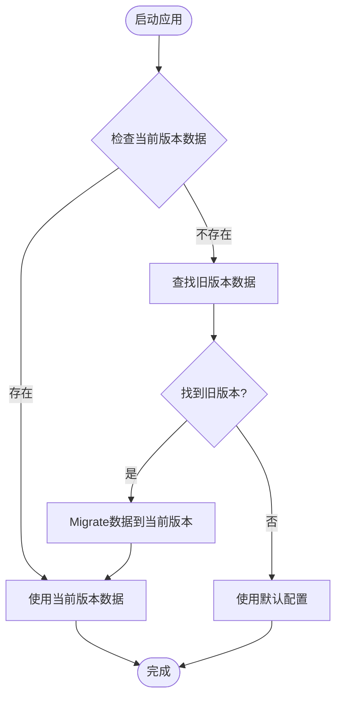

**图表来源**
- [src/utils/storage/storage-key-manager.ts](file://src/utils/storage/storage-key-manager.ts#L78-L95)

**章节来源**
- [src/store/index.ts](file://src/store/index.ts#L1-L53)
- [src/utils/storage/storage-key-manager.ts](file://src/utils/storage/storage-key-manager.ts#L1-L98)

## 模块间通信

### 依赖关系图

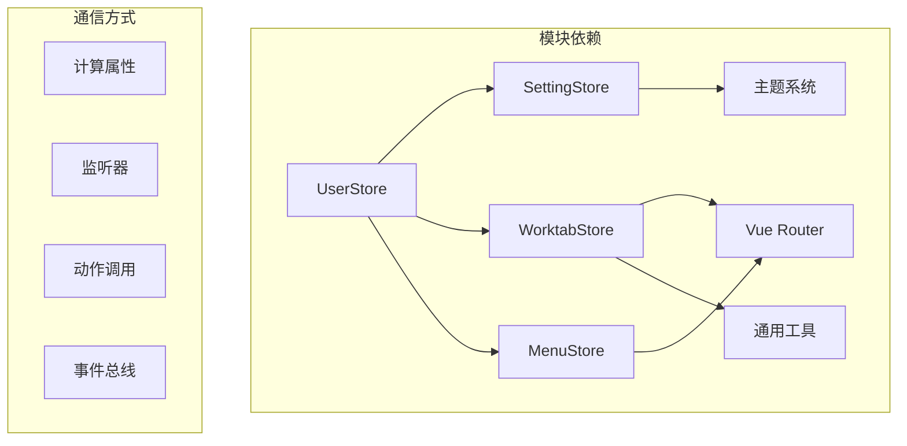

**图表来源**
- [src/store/modules/user.ts](file://src/store/modules/user.ts#L72-L76)
- [src/store/modules/worktab.ts](file://src/store/modules/worktab.ts#L435-L476)

### 状态共享模式

#### 1. 计算属性共享

用户模块通过计算属性访问其他模块状态：

```typescript
// 在 user.ts 中
const getSettingState = computed(() => useSettingStore().$state)
const getWorktabState = computed(() => useWorktabStore().$state)
```

#### 2. 模块间协作

- **用户登出**：清理菜单状态和工作标签页
- **设置变更**：通知相关模块更新状态
- **路由变化**：工作标签页自动同步当前路由

#### 3. 状态验证

worktab 模块提供了路由有效性验证功能，确保标签页状态与实际路由一致。

**章节来源**
- [src/store/modules/user.ts](file://src/store/modules/user.ts#L72-L76)
- [src/store/modules/worktab.ts](file://src/store/modules/worktab.ts#L435-L476)

## 使用示例

### 基础使用模式

#### 在组件中使用 Store

```typescript
<script setup lang="ts">
import { useMenuStore, useSettingStore, useUserStore, useWorktabStore, useTableStore } from '@/store'

// 获取各个模块的 store 实例
const menuStore = useMenuStore()
const settingStore = useSettingStore()
const userStore = useUserStore()
const worktabStore = useWorktabStore()
const tableStore = useTableStore()

// 状态读取
const menuList = computed(() => menuStore.menuList)
const isDarkMode = computed(() => settingStore.isDark)
const isLoggedIn = computed(() => userStore.isLogin)

// 动作调用
const toggleDarkMode = () => settingStore.setGlopTheme('dark', 'dark')
const logout = () => userStore.logOut()
const openNewTab = (route) => worktabStore.openTab(route)
</script>
```

#### 状态响应式绑定

```vue
<template>
  <div>
    <!-- 菜单状态 -->
    <el-menu :collapse="menuStore.menuOpen">
      <!-- 菜单项 -->
    </el-menu>
    
    <!-- 设置状态 -->
    <div v-if="settingStore.isDark">
      暗色主题已启用
    </div>
    
    <!-- 用户状态 -->
    <div v-if="userStore.isLogin">
      {{ userStore.info.userName }} 已登录
    </div>
    
    <!-- 工作标签页 -->
    <work-tab v-model:tabs="worktabStore.opened" />
    
    <!-- 表格配置 -->
    <el-table :size="tableStore.tableSize" :stripe="tableStore.isZebra">
      <!-- 表格内容 -->
    </el-table>
  </div>
</template>
```

### 高级使用模式

#### 状态监听和副作用

```typescript
<script setup lang="ts">
import { watch, onMounted } from 'vue'
import { useSettingStore, useUserStore } from '@/store'

const settingStore = useSettingStore()
const userStore = useUserStore()

// 监听主题变化
watch(() => settingStore.isDark, (isDark) => {
  document.body.classList.toggle('dark', isDark)
})

// 监听用户登录状态
watch(() => userStore.isLogin, (isLoggedIn) => {
  if (isLoggedIn) {
    // 用户登录后的初始化操作
    initializeUserData()
  } else {
    // 用户登出后的清理操作
    cleanupUserData()
  }
})

// 生命周期钩子
onMounted(() => {
  // 初始化设置
  settingStore.setGlopTheme('auto', 'auto')
  
  // 验证工作标签页状态
  worktabStore.validateWorktabs(router)
})
</script>
```

#### 模块间协调

```typescript
<script setup lang="ts">
import { watchEffect } from 'vue'
import { useUserStore, useWorktabStore } from '@/store'

const userStore = useUserStore()
const worktabStore = useWorktabStore()

// 协调用户状态和工作标签页
watchEffect(() => {
  if (userStore.isLogin) {
    // 用户登录后检查是否需要清理标签页
    userStore.checkAndClearWorktabs()
  }
})

// 监听工作标签页变化
watchEffect(() => {
  const tabsCount = worktabStore.opened.length
  if (tabsCount > 10) {
    // 警告用户标签页过多
    console.warn('标签页数量超过限制')
  }
})
</script>
```

**章节来源**
- [src/components/core/layouts/art-work-tab/index.vue](file://src/components/core/layouts/art-work-tab/index.vue#L100-L469)

## 最佳实践

### 1. 模块命名规范

- **模块名称**：使用描述性的模块名称，如 `menu`、`setting`、`user`
- **状态变量**：使用名词形式，如 `menuList`、`isLogin`
- **动作方法**：使用动词开头，如 `setMenuList`、`logOut`
- **计算属性**：使用 `get` 前缀或直接描述，如 `isDark`、`getUserInfo`

### 2. 状态设计原则

#### 单一职责原则
每个模块只负责特定领域的状态管理：

```typescript
// menu.ts - 仅管理菜单状态
// setting.ts - 仅管理系统设置
// user.ts - 仅管理用户状态
// worktab.ts - 仅管理标签页状态
// table.ts - 仅管理表格配置
```

#### 状态最小化原则
只存储必要的状态，避免冗余：

```typescript
// 好的做法：只存储必要状态
const menuOpen = ref(true) // 仅存储展开状态

// 避免：存储可以通过计算属性推导的状态
const menuOpen = ref(true)
const menuClosed = ref(false) // 冗余状态
```

### 3. 持久化策略

#### 选择合适的模块进行持久化

- **需要持久化的模块**：`setting`、`user`、`worktab`
- **不需要持久化的模块**：`menu`（动态生成）、`table`（临时配置）

#### 持久化配置优化

```typescript
{
  persist: {
    key: 'setting', // 使用有意义的键名
    storage: localStorage, // 选择合适的存储介质
    paths: ['systemThemeType', 'menuThemeType'] // 仅持久化关键状态
  }
}
```

### 4. 性能优化

#### 计算属性缓存

```typescript
// 使用计算属性缓存复杂计算结果
const getMenuTheme = computed(() => {
  const list = AppConfig.themeList.filter(item => item.theme === menuThemeType.value)
  return isDark.value ? AppConfig.darkMenuStyles[0] : list[0]
})
```

#### 状态分割

对于大型状态对象，考虑分割为更小的模块：

```typescript
// 不推荐：单一大状态对象
interface LargeState {
  menu: MenuState
  setting: SettingState
  user: UserState
  worktab: WorktabState
  table: TableState
}

// 推荐：模块化状态管理
// 分别在不同模块中管理各自的状态
```

### 5. 错误处理

#### 状态验证

```typescript
// 在状态变更时进行验证
const setUserInfo = (newInfo: Api.Auth.UserInfo) => {
  if (!newInfo.userId) {
    throw new Error('用户ID不能为空')
  }
  info.value = newInfo
}
```

#### 异常恢复

```typescript
// 在异常情况下恢复到默认状态
try {
  // 状态操作
} catch (error) {
  console.error('状态操作失败:', error)
  // 恢复到安全状态
  resetToDefaultState()
}
```

### 6. 类型安全

#### 完整的类型定义

```typescript
// 在 types/store/index.ts 中定义完整的类型
export interface SettingStoreState {
  systemThemeType: SystemThemeEnum
  menuThemeType: MenuThemeEnum
  // ... 其他状态
}

// 在 store 模块中使用类型
export const useSettingStore = defineStore('settingStore', () => {
  const systemThemeType = ref<SystemThemeEnum>(SystemThemeEnum.AUTO)
  // ...
})
```

#### 类型守卫

```typescript
// 在状态使用前进行类型检查
const validateUserState = (state: UserState): boolean => {
  return !!state.userInfo && typeof state.token === 'string'
}
```

## 总结

Art Design Pro 的 Pinia 状态管理架构展现了现代前端应用状态管理的最佳实践。通过五个精心设计的模块，实现了功能明确、职责分离的状态管理体系。

### 核心优势

1. **模块化设计**：每个模块专注特定领域，便于维护和扩展
2. **类型安全**：完整的 TypeScript 类型定义确保开发时的类型安全
3. **持久化支持**：自动处理状态的本地存储和版本迁移
4. **组合式 API**：充分利用 Vue 3 的新特性，提供更好的开发体验
5. **模块间协作**：通过计算属性和监听器实现优雅的模块间通信

### 技术亮点

- **智能持久化**：StorageKeyManager 实现自动版本迁移
- **状态验证**：worktab 模块提供路由有效性验证
- **响应式设计**：充分利用 Vue 3 的响应式系统
- **命名空间隔离**：避免状态冲突，提高代码可维护性

这套状态管理架构不仅满足了当前应用的需求，也为未来的功能扩展奠定了坚实的基础。通过遵循模块化设计原则和最佳实践，开发者可以轻松地在现有架构上添加新功能，而不会影响现有代码的稳定性。