# 目录结构

<cite>
**本文档引用的文件**
- [main.ts](file://src/main.ts)
- [App.vue](file://src/App.vue)
- [vite.config.ts](file://vite.config.ts)
- [package.json](file://package.json)
- [router/index.ts](file://src/router/index.ts)
- [store/index.ts](file://src/store/index.ts)
- [hooks/index.ts](file://src/hooks/index.ts)
- [api/auth.ts](file://src/api/auth.ts)
- [api/system-manage.ts](file://src/api/system-manage.ts)
- [components/core/layouts/art-header-bar/index.vue](file://src/components/core/layouts/art-header-bar/index.vue)
- [utils/http/index.ts](file://src/utils/http/index.ts)
- [utils/navigation/route.ts](file://src/utils/navigation/route.ts)
- [views/dashboard/analysis/index.vue](file://src/views/dashboard/analysis/index.vue)
- [store/modules/user.ts](file://src/store/modules/user.ts)
</cite>

## 目录结构

Art Design Pro项目采用清晰的分层架构设计，通过合理的目录结构组织实现代码的高内聚、低耦合。项目遵循Vue 3 + TypeScript技术栈的最佳实践，采用模块化、组件化的开发模式，使得代码结构清晰、职责分明，极大提升了代码的可维护性和团队协作效率。

```mermaid
graph TD
A[src/] --> B[api/]
A --> C[assets/]
A --> D[components/]
A --> E[config/]
A --> F[directives/]
A --> G[enums/]
A --> H[hooks/]
A --> I[locales/]
A --> J[mock/]
A --> K[plugins/]
A --> L[router/]
A --> M[store/]
A --> N[types/]
A --> O[utils/]
A --> P[views/]
A --> Q[App.vue]
A --> R[main.ts]
B --> B1[auth.ts]
B --> B2[system-manage.ts]
D --> D1[business/]
D --> D2[core/]
D2 --> D2a[banners/]
D2 --> D2b[base/]
D2 --> D2c[cards/]
D2 --> D2d[charts/]
D2 --> D2e[forms/]
D2 --> D2f[layouts/]
D2 --> D2g[media/]
D2 --> D2h[others/]
D2 --> D2i[tables/]
D2 --> D2j[text-effect/]
D2 --> D2k[theme/]
D2 --> D2l[views/]
D2 --> D2m[widget/]
H --> H1[core/]
H --> H2[index.ts]
L --> L1[core/]
L --> L2[guards/]
L --> L3[modules/]
L3 --> L3a[article.ts]
L3 --> L3b[dashboard.ts]
L3 --> L3c[examples.ts]
L3 --> L3d[exception.ts]
L3 --> L3e[help.ts]
L3 --> L3f[result.ts]
L3 --> L3g[safeguard.ts]
L3 --> L3h[system.ts]
L3 --> L3i[template.ts]
L3 --> L3j[widgets.ts]
M --> M1[modules/]
M1 --> M1a[menu.ts]
M1 --> M1b[setting.ts]
M1 --> M1c[table.ts]
M1 --> M1d[user.ts]
M1 --> M1e[worktab.ts]
O --> O1[constants/]
O --> O2[form/]
O --> O3[http/]
O --> O4[navigation/]
O --> O5[socket/]
O --> O6[storage/]
O --> O7[sys/]
O --> O8[table/]
O --> O9[ui/]
O --> O10[index.ts]
O --> O11[router.ts]
P --> P1[article/]
P --> P2[auth/]
P --> P3[change/log/]
P --> P4[dashboard/]
P4 --> P4a[analysis/]
P4 --> P4b[console/]
P4 --> P4c[ecommerce/]
P --> P5[examples/]
P --> P6[exception/]
P --> P7[index/]
P --> P8[outside/]
P --> P9[result/]
P --> P10[safeguard/]
P --> P11[system/]
P --> P12[template/]
P --> P13[widgets/]
```

**图示来源**
- [src/main.ts](file://src/main.ts)
- [src/App.vue](file://src/App.vue)
- [vite.config.ts](file://vite.config.ts)

**本节来源**
- [package.json](file://package.json#L1-L124)
- [src/main.ts](file://src/main.ts#L1-L25)
- [src/App.vue](file://src/App.vue#L1-L35)

## 核心目录职责划分

### api/ - RESTful接口封装

`api/`目录专门用于封装所有与后端服务的RESTful接口调用。该目录下的每个文件对应一个业务模块的API集合，如`auth.ts`负责认证相关接口，`system-manage.ts`负责系统管理相关接口。通过统一的HTTP请求工具（`utils/http/index.ts`）进行封装，实现了请求拦截、响应处理、错误统一处理、Token自动注入等功能，确保了网络请求的安全性和一致性。

**本节来源**
- [src/api/auth.ts](file://src/api/auth.ts#L1-L30)
- [src/api/system-manage.ts](file://src/api/system-manage.ts#L1-L26)
- [src/utils/http/index.ts](file://src/utils/http/index.ts#L1-L215)

### components/ - 可复用UI组件组织

`components/`目录按功能分类组织了项目中所有可复用的UI组件，采用分层结构进行管理：
- `business/`：存放业务相关的复合组件
- `core/`：存放基础UI组件，进一步细分为`banners`、`base`、`cards`、`charts`、`forms`、`layouts`、`media`、`others`、`tables`、`text-effect`、`theme`、`views`、`widget`等子目录，便于快速定位和维护

这种分类方式使得组件查找和复用变得极为高效，同时也保证了组件的单一职责原则。

**本节来源**
- [src/components/core/layouts/art-header-bar/index.vue](file://src/components/core/layouts/art-header-bar/index.vue#L1-L486)
- [src/components/core/base/art-logo/index.vue](file://src/components/core/base/art-logo/index.vue)
- [src/components/core/charts/art-line-chart/index.vue](file://src/components/core/charts/art-line-chart/index.vue)

### hooks/ - 组合式函数逻辑复用

`hooks/`目录存放了所有组合式函数（Composables），用于实现逻辑复用。通过Vue 3的Composition API，将通用的业务逻辑、状态管理、事件处理等抽取为独立的可复用函数。`core/`子目录中的`useAppMode.ts`、`useAuth.ts`、`useChart.ts`等文件分别封装了应用模式、权限控制、图表处理等核心逻辑，`index.ts`文件统一导出所有hooks，便于在组件中按需引入。

**本节来源**
- [src/hooks/index.ts](file://src/hooks/index.ts#L1-L33)
- [src/hooks/core/useAuth.ts](file://src/hooks/core/useAuth.ts)
- [src/hooks/core/useTheme.ts](file://src/hooks/core/useTheme.ts)

### router/modules/ - 路由模块化拆分

`router/modules/`目录实现了路由的模块化拆分，每个文件对应一个功能模块的路由配置，如`dashboard.ts`、`system.ts`、`article.ts`等。这种设计使得路由配置更加清晰、易于维护，避免了单个路由文件过于庞大的问题。通过`routes/staticRoutes.ts`文件统一导入和注册所有模块化路由，实现了路由的动态管理和按需加载。

**本节来源**
- [src/router/index.ts](file://src/router/index.ts#L1-L24)
- [src/router/modules/dashboard.ts](file://src/router/modules/dashboard.ts)
- [src/router/modules/system.ts](file://src/router/modules/system.ts)

### store/modules/ - Pinia状态模块管理

`store/modules/`目录采用Pinia进行状态管理，每个文件对应一个状态模块，如`user.ts`、`menu.ts`、`setting.ts`等。这种模块化的设计使得状态管理更加清晰、可预测，避免了状态的混乱和冲突。通过`index.ts`文件统一创建和配置Pinia实例，并集成`pinia-plugin-persistedstate`插件实现状态的持久化存储，确保了用户设置、登录状态等关键数据在页面刷新后依然存在。

**本节来源**
- [src/store/index.ts](file://src/store/index.ts#L1-L53)
- [src/store/modules/user.ts](file://src/store/modules/user.ts#L1-L236)
- [src/store/modules/setting.ts](file://src/store/modules/setting.ts)

### utils/ - 工具函数集中管理

`utils/`目录集中管理了项目中所有通用的工具函数，按功能细分为多个子目录：
- `constants/`：常量定义
- `form/`：表单相关工具
- `http/`：HTTP请求工具
- `navigation/`：导航相关工具
- `storage/`：存储相关工具
- `sys/`：系统级工具
- `table/`：表格相关工具
- `ui/`：UI相关工具

这种组织方式使得工具函数的查找和复用变得极为方便，同时也保证了工具函数的单一职责和高内聚性。

**本节来源**
- [src/utils/http/index.ts](file://src/utils/http/index.ts#L1-L215)
- [src/utils/navigation/route.ts](file://src/utils/navigation/route.ts#L1-L79)
- [src/utils/storage/index.ts](file://src/utils/storage/index.ts)

### views/ - 页面级组件存放

`views/`目录存放了项目中所有页面级组件，每个子目录对应一个功能模块，如`dashboard/`、`system/`、`article/`等。每个页面组件通常由多个`components/`中的基础组件组合而成，形成完整的用户界面。通过`router/modules/`中的路由配置，将URL路径与具体的页面组件进行映射，实现了前端路由的导航功能。

**本节来源**
- [src/views/dashboard/analysis/index.vue](file://src/views/dashboard/analysis/index.vue#L1-L51)
- [src/views/system/user/index.vue](file://src/views/system/user/index.vue)
- [src/views/auth/login/index.vue](file://src/views/auth/login/index.vue)

## 分层架构优势

Art Design Pro项目的分层架构设计带来了显著的优势：
1. **高可维护性**：清晰的目录结构和职责划分使得代码易于理解和维护，新开发者可以快速上手。
2. **高可复用性**：组件、hooks、utils等模块的设计充分考虑了复用性，减少了代码重复。
3. **高可扩展性**：模块化的架构使得新功能的添加变得简单，只需在相应目录下创建新文件即可。
4. **高效团队协作**：明确的职责划分使得团队成员可以并行开发不同模块，减少了代码冲突。
5. **易于测试**：独立的模块和组件使得单元测试和集成测试更加容易实施。

## 新功能开发指南

当需要开发新功能时，开发者应遵循以下文件放置指南：
1. **页面开发**：在`views/`目录下创建对应的功能模块目录，存放页面级组件。
2. **组件开发**：在`components/`目录下根据功能类型选择合适的子目录存放新组件。
3. **API开发**：在`api/`目录下创建或修改对应业务模块的API文件。
4. **状态管理**：在`store/modules/`目录下创建新的状态模块或扩展现有模块。
5. **路由配置**：在`router/modules/`目录下创建新的路由模块文件。
6. **工具函数**：在`utils/`目录下根据功能类型选择合适的子目录存放新工具函数。
7. **组合式函数**：在`hooks/core/`目录下创建新的组合式函数，并在`hooks/index.ts`中导出。

通过遵循这一指南，可以确保新功能的代码被正确地组织和管理，保持项目整体结构的一致性和规范性。

**本节来源**
- [src/main.ts](file://src/main.ts#L1-L25)
- [src/App.vue](file://src/App.vue#L1-L35)
- [vite.config.ts](file://vite.config.ts#L1-L157)
- [package.json](file://package.json#L1-L124)