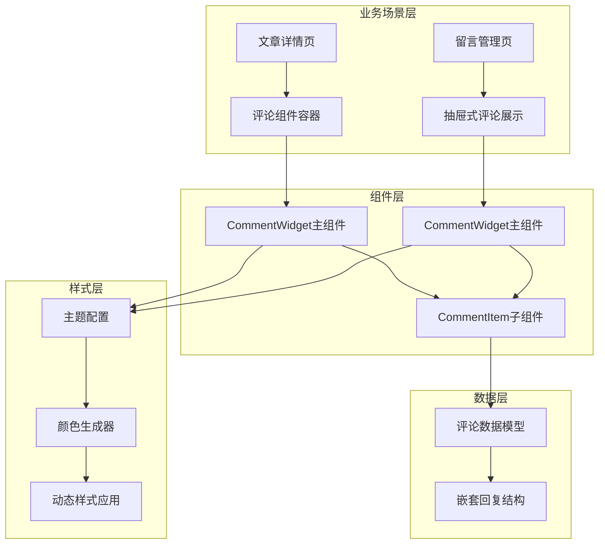
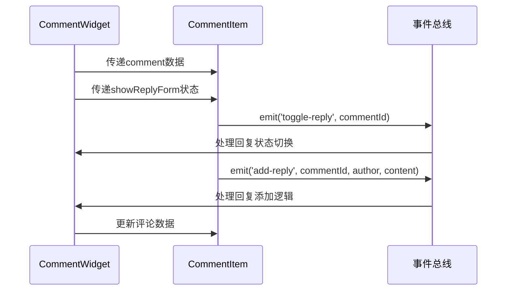
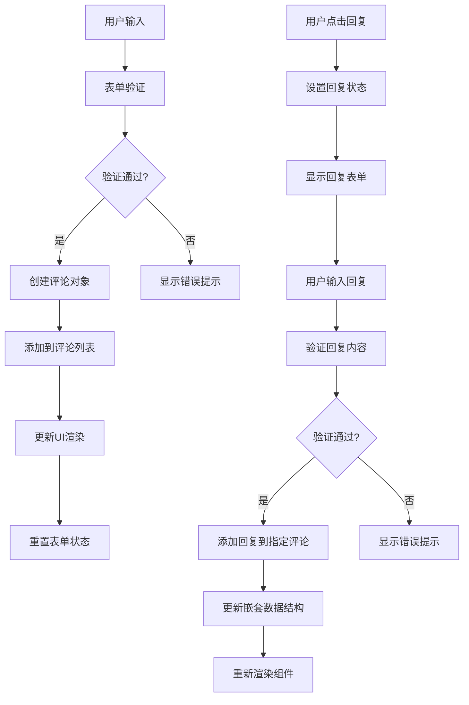
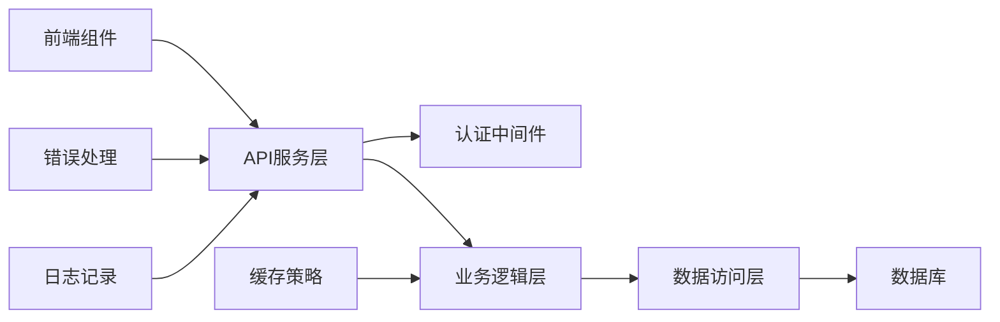
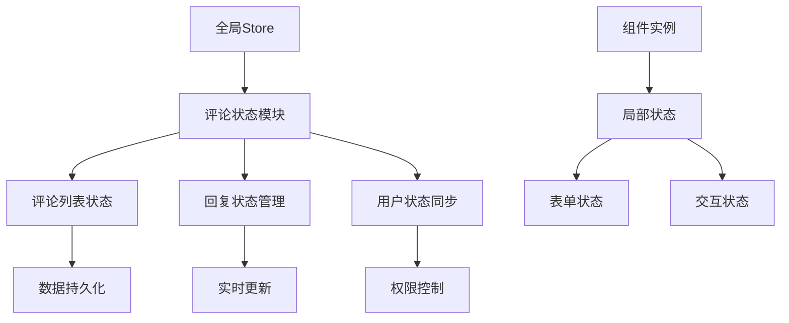
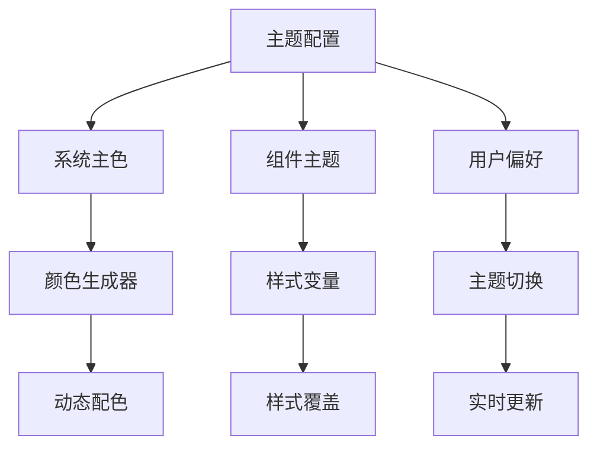

# 业务场景组件设计与使用文档

<cite>
**本文档引用的文件**
- [index.vue](file://src/components/business/comment-widget/index.vue)
- [CommentItem.vue](file://src/components/business/comment-widget/widget/CommentItem.vue)
- [commentList.ts](file://src/mock/temp/commentList.ts)
- [commentDetail.ts](file://src/mock/temp/commentDetail.ts)
- [ArticleComment.vue](file://src/views/article/comment/index.vue)
- [ArticleDetail.vue](file://src/views/article/detail/index.vue)
- [app.scss](file://src/assets/styles/core/app.scss)
- [mixin.scss](file://src/assets/styles/core/mixin.scss)
- [config/index.ts](file://src/config/index.ts)
</cite>

## 目录
1. [项目概述](#项目概述)
2. [评论组件架构](#评论组件架构)
3. [核心组件分析](#核心组件分析)
4. [父子组件通信机制](#父子组件通信机制)
5. [数据流管理](#数据流管理)
6. [分页加载策略](#分页加载策略)
7. [API集成模式](#api集成模式)
8. [用户交互行为实现](#用户交互行为实现)
9. [全局状态管理集成](#全局状态管理集成)
10. [业务场景集成示例](#业务场景集成示例)
11. [样式定制与主题兼容性](#样式定制与主题兼容性)
12. [错误处理与性能优化](#错误处理与性能优化)
13. [总结](#总结)

## 项目概述

本文档详细分析了Art Design Pro框架中的业务场景组件设计与实现，重点关注评论组件（comment-widget）的整体架构和使用模式。该组件采用Vue 3 Composition API构建，支持嵌套回复、动态样式生成和主题兼容性，广泛应用于文章详情页等业务场景。

## 评论组件架构

评论组件采用分层架构设计，包含以下核心层次：



**图表来源**
- [index.vue](file://src/components/business/comment-widget/index.vue#L1-L112)
- [CommentItem.vue](file://src/components/business/comment-widget/widget/CommentItem.vue#L1-L122)

**章节来源**
- [index.vue](file://src/components/business/comment-widget/index.vue#L1-L112)
- [CommentItem.vue](file://src/components/business/comment-widget/widget/CommentItem.vue#L1-L122)

## 核心组件分析

### CommentWidget主组件

CommentWidget主组件负责评论表单管理和评论列表渲染，采用响应式设计和双向绑定机制。

#### 组件结构特点：
- **表单验证**：内置评论内容和作者名称的必填验证
- **评论计数**：实时显示评论总数
- **倒序渲染**：最新评论优先显示
- **状态管理**：使用ref管理回复表单状态

#### 数据模型设计：
```typescript
interface Comment {
  id: number
  author: string
  content: string
  timestamp: string
  replies: Comment[]
}
```

**章节来源**
- [index.vue](file://src/components/business/comment-widget/index.vue#L44-L111)
- [commentDetail.ts](file://src/mock/temp/commentDetail.ts#L1-L80)

### CommentItem子组件

CommentItem组件实现单条评论的渲染和交互功能，支持递归渲染嵌套回复。

#### 核心功能特性：
- **作者头像**：自动生成首字母头像和随机背景色
- **时间格式化**：本地化时间显示
- **递归渲染**：支持无限层级回复嵌套
- **条件渲染**：根据回复状态动态显示表单

#### 交互行为：
- **回复切换**：点击"回复"按钮显示/隐藏回复表单
- **表单提交**：支持取消和确认操作
- **事件传播**：通过emit向上级组件传递事件

**章节来源**
- [CommentItem.vue](file://src/components/business/comment-widget/widget/CommentItem.vue#L60-L122)

## 父子组件通信机制

组件间采用Vue 3的事件驱动通信模式，通过props传递数据，通过emit触发事件。



**图表来源**
- [index.vue](file://src/components/business/comment-widget/index.vue#L35-L36)
- [CommentItem.vue](file://src/components/business/comment-widget/widget/CommentItem.vue#L77-L79)

### 通信协议

#### Props传递：
- `comment`: 当前评论对象
- `showReplyForm`: 当前活跃的回复表单ID

#### Events触发：
- `toggle-reply`: 切换回复表单显示状态
- `add-reply`: 添加新回复

**章节来源**
- [index.vue](file://src/components/business/comment-widget/index.vue#L35-L36)
- [CommentItem.vue](file://src/components/business/comment-widget/widget/CommentItem.vue#L77-L79)

## 数据流管理

评论组件采用响应式数据流管理模式，确保数据的一致性和实时更新。

### 数据流向图：



**图表来源**
- [index.vue](file://src/components/business/comment-widget/index.vue#L56-L93)

### 数据持久化策略

- **内存管理**：使用Vue响应式系统管理数据状态
- **深度克隆**：避免直接修改原始数据
- **状态同步**：确保父子组件状态一致性

**章节来源**
- [index.vue](file://src/components/business/comment-widget/index.vue#L47-L48)
- [index.vue](file://src/components/business/comment-widget/index.vue#L99-L109)

## 分页加载策略

虽然当前实现使用静态数据，但架构已预留分页加载扩展点。

### 分页设计原则：
- **虚拟滚动**：对于大量评论采用虚拟滚动技术
- **懒加载**：按需加载深层嵌套回复
- **缓存机制**：缓存已加载的评论数据
- **无限滚动**：支持滚动到底部自动加载更多

### 扩展建议：
```typescript
// 分页加载伪代码结构
interface PaginationState {
  currentPage: number
  pageSize: number
  totalComments: number
  loading: boolean
  hasMore: boolean
}

// API调用示例
async function loadComments(page: number, size: number) {
  const response = await api.getComments({ 
    current: page, 
    size: size 
  })
  return response.records
}
```

## API集成模式

评论组件采用模拟数据进行演示，实际生产环境应集成RESTful API。

### API集成架构：



### 接口规范建议：

| 接口路径 | 方法 | 功能描述 | 参数 |
|---------|------|----------|------|
| `/api/comments` | GET | 获取评论列表 | `{postId, page, size}` |
| `/api/comments` | POST | 创建新评论 | `{postId, author, content}` |
| `/api/comments/{id}/replies` | POST | 添加回复 | `{parentId, author, content}` |
| `/api/comments/{id}` | DELETE | 删除评论 | `{id}` |

### 错误处理策略：
- **网络错误**：重试机制和降级处理
- **业务错误**：友好的错误提示
- **权限错误**：引导用户登录或授权

## 用户交互行为实现

### 交互功能矩阵：

| 功能模块 | 交互方式 | 实现方式 | 状态反馈 |
|---------|----------|----------|----------|
| 评论发表 | 表单提交 | Enter键快捷提交 | 成功/失败提示 |
| 回复操作 | 点击按钮 | 状态切换动画 | 加载状态指示 |
| 删除评论 | 右键菜单 | 确认对话框 | 删除确认提示 |
| 点赞功能 | 图标点击 | 状态切换 | 数字更新动画 |
| 编辑功能 | 双击编辑 | 编辑模式切换 | 保存/取消选项 |

### 交互优化策略：
- **防抖处理**：防止快速连续提交
- **状态锁定**：避免重复操作
- **用户体验**：即时反馈和进度指示

**章节来源**
- [index.vue](file://src/components/business/comment-widget/index.vue#L56-L93)
- [CommentItem.vue](file://src/components/business/comment-widget/widget/CommentItem.vue#L85-L99)

## 全局状态管理集成

评论组件与全局状态管理系统集成，支持跨组件状态共享。

### 状态管理架构：



### 集成要点：
- **状态同步**：确保全局状态与组件状态一致
- **性能优化**：避免不必要的状态更新
- **数据一致性**：保证多实例间的数据同步

## 业务场景集成示例

### 文章详情页集成

在文章详情页中，评论组件作为独立模块集成，提供完整的评论功能。

#### 集成步骤：

1. **组件引入**：
```typescript
import CommentWidget from '@/components/business/comment-widget/index.vue'
```

2. **数据初始化**：
```typescript
// 基于文章ID获取评论数据
const comments = ref<Comment[]>([])
const postId = computed(() => route.params.id)

onMounted(async () => {
  comments.value = await fetchComments(postId.value)
})
```

3. **事件监听**：
```typescript
// 评论添加事件
const handleAddComment = async (comment: Comment) => {
  try {
    const result = await api.addComment({
      ...comment,
      postId: postId.value
    })
    comments.value.unshift(result)
  } catch (error) {
    ElMessage.error('评论发布失败')
  }
}
```

4. **错误处理**：
```typescript
// 统一错误处理
const handleError = (error: any) => {
  console.error('评论操作失败:', error)
  ElMessage.error(error.message || '操作失败，请稍后重试')
}
```

**章节来源**
- [ArticleDetail.vue](file://src/views/article/detail/index.vue#L1-L137)
- [ArticleComment.vue](file://src/views/article/comment/index.vue#L1-L133)

### 留言管理页集成

在留言管理页面中，采用抽屉式展示方式，提供更丰富的交互体验。

#### 特色功能：
- **网格布局**：支持多种屏幕尺寸的响应式布局
- **颜色主题**：为每个留言分配独特颜色
- **详情查看**：点击进入详细评论界面
- **批量操作**：支持批量删除和标记

**章节来源**
- [ArticleComment.vue](file://src/views/article/comment/index.vue#L1-L133)

## 样式定制与主题兼容性

### 主题系统架构

评论组件完全兼容Art Design Pro的主题系统，支持亮色、暗色和自动切换主题。



**图表来源**
- [config/index.ts](file://src/config/index.ts#L120-L128)
- [CommentItem.vue](file://src/components/business/comment-widget/widget/CommentItem.vue#L110-L120)

### 样式定制方案

#### 1. 颜色系统：
- **系统主色**：从配置中读取预设颜色数组
- **随机配色**：避免重复颜色，确保视觉多样性
- **对比度优化**：保证文字与背景的可读性

#### 2. 响应式设计：
- **断点适配**：针对不同屏幕尺寸调整布局
- **触摸友好**：大按钮和间距适应移动设备
- **字体缩放**：支持系统字体大小设置

#### 3. 动画效果：
- **平滑过渡**：使用CSS过渡实现自然动画
- **性能优化**：避免影响滚动性能的复杂动画
- **可访问性**：提供减少动画的用户选项

**章节来源**
- [CommentItem.vue](file://src/components/business/comment-widget/widget/CommentItem.vue#L110-L120)
- [app.scss](file://src/assets/styles/core/app.scss#L1-L200)

### 主题兼容性测试

#### 测试维度：
- **颜色对比度**：确保符合WCAG标准
- **视觉一致性**：在不同主题下保持统一风格
- **交互反馈**：确保按钮和链接在各主题下清晰可见
- **无障碍支持**：支持屏幕阅读器和键盘导航

## 错误处理与性能优化

### 错误处理策略

#### 1. 输入验证：
- **必填检查**：确保作者名称和评论内容不为空
- **长度限制**：防止过长的评论内容
- **字符过滤**：防止恶意字符注入

#### 2. 网络错误：
- **超时处理**：设置合理的请求超时时间
- **重试机制**：自动重试失败的请求
- **降级策略**：在网络异常时提供本地缓存数据

#### 3. 数据错误：
- **格式校验**：确保返回数据格式正确
- **默认值**：为缺失字段提供合理默认值
- **错误边界**：防止单个组件错误影响整体应用

### 性能优化措施

#### 1. 渲染优化：
- **虚拟滚动**：对于大量评论采用虚拟滚动
- **懒加载**：延迟加载深层嵌套内容
- **防抖节流**：优化频繁的DOM操作

#### 2. 内存管理：
- **组件卸载**：及时清理事件监听器和定时器
- **数据压缩**：对大型评论数据进行压缩存储
- **缓存策略**：合理使用浏览器缓存

#### 3. 网络优化：
- **请求合并**：将多个小请求合并为批量请求
- **CDN加速**：使用CDN分发静态资源
- **压缩传输**：启用gzip压缩减少传输量

## 总结

Art Design Pro的评论组件展现了现代前端开发的最佳实践，具有以下核心优势：

### 技术亮点：
- **模块化设计**：清晰的组件分层和职责分离
- **响应式架构**：基于Vue 3 Composition API的现代化开发
- **类型安全**：完整的TypeScript类型定义
- **主题兼容**：完全支持深色模式和自定义主题

### 业务价值：
- **用户体验**：简洁直观的操作界面和流畅的交互体验
- **扩展性强**：良好的架构设计便于功能扩展
- **维护性佳**：清晰的代码结构和完善的注释
- **性能优异**：优化的渲染策略和资源管理

### 应用前景：
该评论组件不仅适用于文章评论场景，还可扩展应用于：
- 社交媒体平台
- 电商平台的商品评价
- 论坛和社区系统
- 客户反馈收集

通过持续的功能迭代和性能优化，该组件将成为Art Design Pro框架中不可或缺的核心业务组件，为开发者提供强大而灵活的评论解决方案。