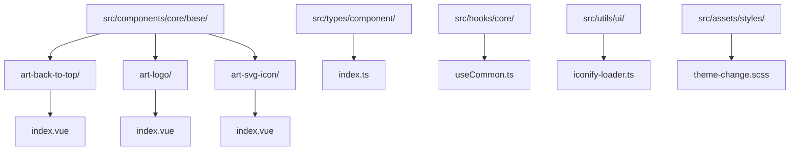
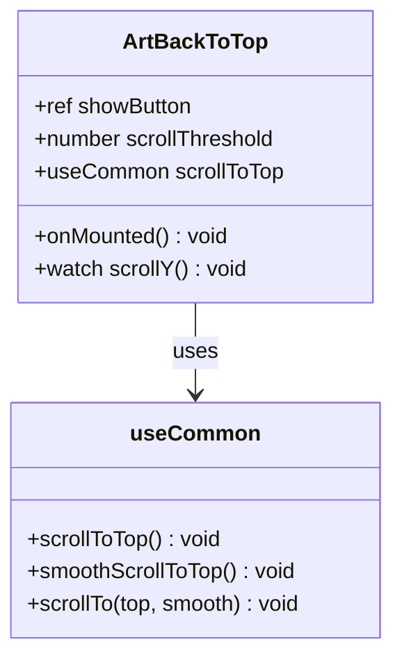
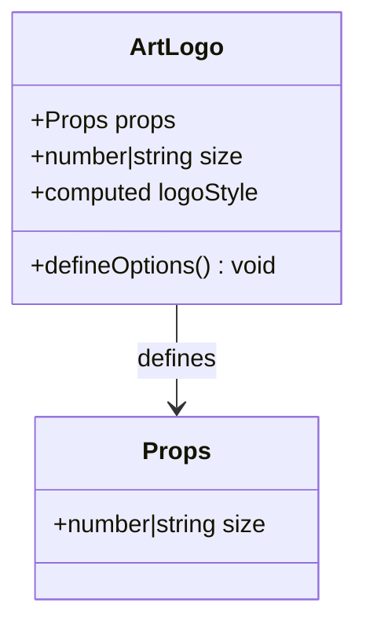
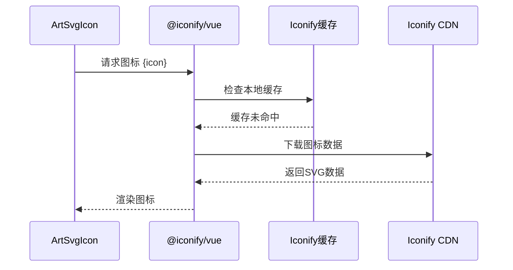
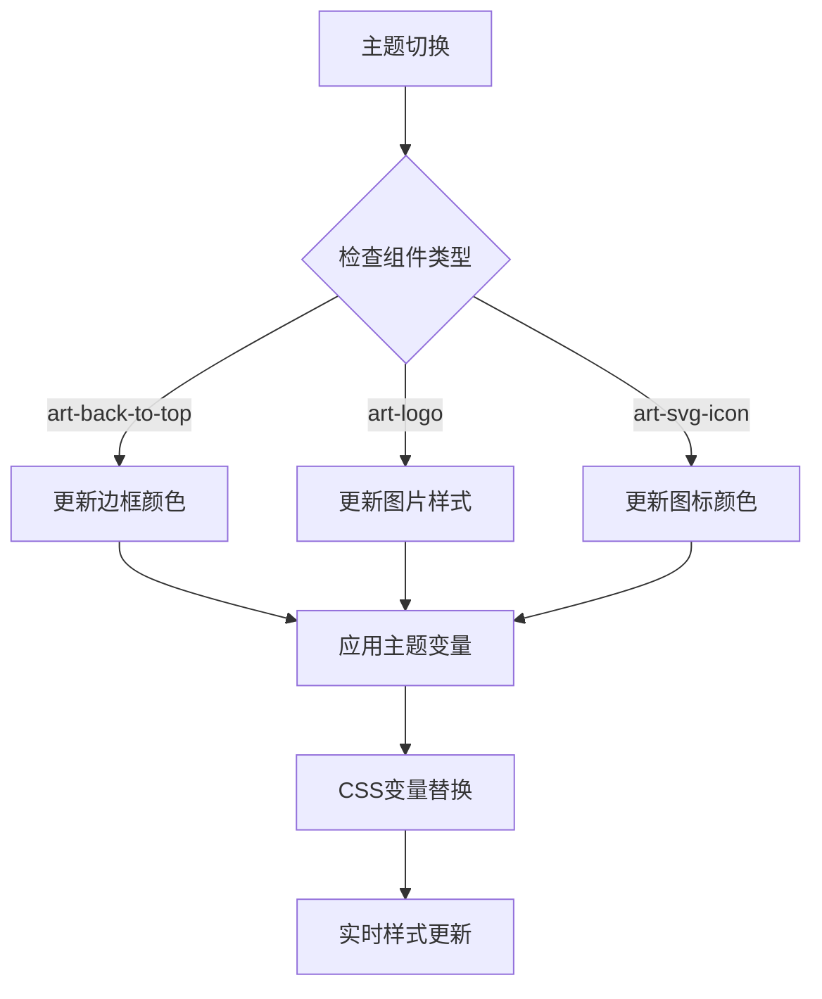

# 基础组件库文档

<cite>
**本文档引用的文件**
- [art-back-to-top/index.vue](file://src/components/core/base/art-back-to-top/index.vue)
- [art-logo/index.vue](file://src/components/core/base/art-logo/index.vue)
- [art-svg-icon/index.vue](file://src/components/core/base/art-svg-icon/index.vue)
- [useCommon.ts](file://src/hooks/core/useCommon.ts)
- [iconify-loader.ts](file://src/utils/ui/iconify-loader.ts)
- [useTheme.ts](file://src/hooks/core/useTheme.ts)
- [theme-change.scss](file://src/assets/styles/core/theme-change.scss)
- [mixin.scss](file://src/assets/styles/core/mixin.scss)
- [index.ts](file://src/types/component/index.ts)
</cite>

## 目录
1. [简介](#简介)
2. [项目结构](#项目结构)
3. [核心组件概览](#核心组件概览)
4. [art-back-to-top 组件详解](#art-back-to-top-组件详解)
5. [art-logo 组件详解](#art-logo-组件详解)
6. [art-svg-icon 组件详解](#art-svg-icon-组件详解)
7. [类型定义与接口规范](#类型定义与接口规范)
8. [主题系统集成](#主题系统集成)
9. [实际使用示例](#实际使用示例)
10. [常见问题与解决方案](#常见问题与解决方案)
11. [总结](#总结)

## 简介

Art Design Pro 基础组件库提供了三个核心的原子组件：`art-back-to-top`（返回顶部按钮）、`art-logo`（品牌标识）和 `art-svg-icon`（SVG图标）。这些组件设计简洁、功能明确，具有良好的可定制性和主题适配能力，是构建现代Web界面的基础元素。

## 项目结构

基础组件位于 `src/components/core/base/` 目录下，每个组件都采用独立的目录结构：



**图表来源**
- [art-back-to-top/index.vue](file://src/components/core/base/art-back-to-top/index.vue#L1-L41)
- [art-logo/index.vue](file://src/components/core/base/art-logo/index.vue#L1-L22)
- [art-svg-icon/index.vue](file://src/components/core/base/art-svg-icon/index.vue#L1-L25)

## 核心组件概览

这三个基础组件各自承担不同的UI职责：

| 组件名称 | 主要功能 | 核心特性 |
|---------|---------|---------|
| art-back-to-top | 页面滚动控制 | 滚动监听、平滑动画、阈值配置 |
| art-logo | 品牌标识展示 | 尺寸可调、响应式设计、样式继承 |
| art-svg-icon | 图标渲染 | Iconify集成、缓存机制、动态属性 |

## art-back-to-top 组件详解

### 组件架构

`art-back-to-top` 组件是一个智能的滚动控制按钮，具备以下核心功能：



**图表来源**
- [art-back-to-top/index.vue](file://src/components/core/base/art-back-to-top/index.vue#L21-L40)
- [useCommon.ts](file://src/hooks/core/useCommon.ts#L21-L86)

### 滚动监听机制

组件通过监听滚动容器的垂直位置来控制按钮的显示状态：

#### 配置参数
- **scrollThreshold**: 默认阈值为300px，当页面滚动超过此高度时显示按钮
- **scrollContainer**: 依赖于DOM元素 `#app-main`，这是主内容区域的标识

#### 实现原理
1. **DOM查询**: 组件挂载后查找 `#app-main` 元素作为滚动容器
2. **滚动监听**: 使用 `useScroll` Hook 监听容器的 `y` 坐标变化
3. **状态管理**: 通过 `showButton` ref 控制按钮的可见性
4. **条件渲染**: 使用 Vue 的 `v-show` 指令实现按钮的显示/隐藏

### 动画实现

组件采用 Vue Transition 组件实现平滑的显示/隐藏动画：

#### 动画配置
- **进入动画**: `tad-300 ease-out`（300ms 缓出动画）
- **离开动画**: `tad-200 ease-in`（200ms 缓入动画）
- **入场效果**: 透明度从0到100%，垂直位移从2px到0px
- **出场效果**: 透明度从100%到0%，垂直位移从0px到2px

### smooth 滚动行为

组件集成了多种滚动控制方法：

#### 方法对比
| 方法 | 参数 | 效果 | 使用场景 |
|------|------|------|----------|
| scrollToTop | 无 | 立即滚动到顶部 | 快速返回 |
| smoothScrollToTop | 无 | 平滑滚动到顶部 | 用户友好体验 |
| scrollTo | top, smooth | 指定位置滚动 | 高级控制 |

**章节来源**
- [art-back-to-top/index.vue](file://src/components/core/base/art-back-to-top/index.vue#L1-L41)
- [useCommon.ts](file://src/hooks/core/useCommon.ts#L21-L86)

## art-logo 组件详解

### 组件设计

`art-logo` 组件是一个简洁的品牌标识展示组件，专注于提供一致的品牌视觉体验。



**图表来源**
- [art-logo/index.vue](file://src/components/core/base/art-logo/index.vue#L11-L21)

### 品牌标识渲染逻辑

#### 属性配置
- **size**: 支持数字和字符串格式，默认值为36px
- **图片源**: 使用 WebP 格式的品牌Logo图片
- **替代文本**: 设置 `alt="logo"` 提升可访问性

#### 渲染机制
1. **响应式尺寸**: 通过 `computed` 属性动态计算样式宽度
2. **Flex布局**: 使用 `flex-cc` 类实现居中对齐
3. **图片优化**: 采用 WebP 格式提升加载性能

### 可定制化属性

#### 尺寸控制
```typescript
// 基础用法
<ArtLogo />

// 自定义尺寸
<ArtLogo :size="48" />
<ArtLogo size="56px" />
```

#### 样式继承
组件通过CSS类名实现样式的灵活控制：
- `flex-cc`: 弹性盒模型居中对齐
- `w-full h-full`: 占满父容器尺寸
- `size-9.5`: Tailwind CSS 尺寸类

**章节来源**
- [art-logo/index.vue](file://src/components/core/base/art-logo/index.vue#L1-L22)

## art-svg-icon 组件详解

### 图标加载策略

`art-svg-icon` 组件基于 Iconify 构建，提供强大的图标管理和加载能力。



**图表来源**
- [art-svg-icon/index.vue](file://src/components/core/base/art-svg-icon/index.vue#L1-L25)

### Iconify集成方案

#### 核心特性
- **多图标库支持**: 支持 Remix Icon、Solar、Tabler Icons 等多个图标库
- **按需加载**: 只加载使用的图标，减少包体积
- **离线支持**: 通过 iconify-loader 实现离线图标加载

#### 集成步骤
1. **安装图标集**: `pnpm add -D @iconify-json/[icon-set-name]`
2. **注册图标**: 在 `iconify-loader.ts` 中导入并注册
3. **使用图标**: 在组件中直接引用图标名称

### 缓存机制

#### 缓存策略
- **浏览器缓存**: 利用浏览器的HTTP缓存机制
- **内存缓存**: Iconify 内置的内存缓存
- **本地存储**: 支持将常用图标存储在本地

#### 性能优化
- **懒加载**: 只在需要时加载图标
- **压缩传输**: 使用SVG格式减少传输体积
- **批量加载**: 支持一次性加载多个图标

### 动态属性绑定

组件实现了灵活的属性传递机制：

#### 属性处理流程
1. **属性提取**: 使用 `useAttrs()` 获取所有传入属性
2. **属性过滤**: 通过 `computed` 属性筛选需要绑定的属性
3. **动态绑定**: 使用 `v-bind` 动态绑定到 Icon 组件

#### 支持的属性类型
- **class**: 字符串类型的类名
- **style**: 字符串类型的内联样式
- **其他**: 任何 Iconify 支持的属性

**章节来源**
- [art-svg-icon/index.vue](file://src/components/core/base/art-svg-icon/index.vue#L1-L25)
- [iconify-loader.ts](file://src/utils/ui/iconify-loader.ts#L1-L32)

## 类型定义与接口规范

### Props 接口规范

根据 `types/component/index.ts` 中的定义，基础组件的类型系统提供了完整的类型安全保障：

#### art-back-to-top Props
```typescript
interface BackToTopProps {
  // 滚动阈值配置
  scrollThreshold?: number;
  // 显示状态控制
  showButton?: boolean;
}
```

#### art-logo Props
```typescript
interface LogoProps {
  /** logo 大小 */
  size?: number | string;
}
```

#### art-svg-icon Props
```typescript
interface SvgIconProps {
  /** Iconify icon name */
  icon?: string;
}
```

### 事件回调机制

#### art-back-to-top 事件
- **onClick**: 点击事件回调
- **onScroll**: 滚动事件监听

#### art-logo 事件
- **onLoad**: 图片加载完成事件
- **onError**: 图片加载失败事件

#### art-svg-icon 事件
- **onLoad**: 图标加载完成事件
- **onError**: 图标加载失败事件

### 插槽使用方式

虽然基础组件相对简单，但仍然支持插槽扩展：

#### 默认插槽
- **art-back-to-top**: 可以在按钮内部插入自定义内容
- **art-logo**: 可以在Logo周围添加装饰元素

#### 命名插槽
- **art-svg-icon**: 支持图标周围的文本或其他元素

**章节来源**
- [index.ts](file://src/types/component/index.ts#L1-L146)

## 主题系统集成

### 样式继承机制

基础组件深度集成到 Art Design Pro 的主题系统中，支持完整的主题切换：



**图表来源**
- [useTheme.ts](file://src/hooks/core/useTheme.ts#L42-L98)
- [theme-change.scss](file://src/assets/styles/core/theme-change.scss#L1-L12)

### 主题变量映射

#### 颜色变量
- `--el-color-primary`: 主题色
- `--el-color-primary-light-1` 到 `--el-color-primary-light-9`: 主题色明暗变体
- `--default-box-color`: 默认背景色

#### 边框颜色
- `border-g-300`: 灰色边框
- `hover:bg-g-200`: 悬停背景色

### 样式覆盖方法

#### CSS变量覆盖
```scss
.art-back-to-top {
  --button-border: var(--el-color-primary-light-3);
  --button-hover-bg: var(--el-color-primary-light-7);
}
```

#### SCSS Mixin 使用
```scss
@import '@/assets/styles/core/mixin.scss';

.custom-back-to-top {
  @include circle(40px, var(--el-color-primary));
  @include border(var(--el-color-primary-light-3));
}
```

**章节来源**
- [useTheme.ts](file://src/hooks/core/useTheme.ts#L1-L175)
- [mixin.scss](file://src/assets/styles/core/mixin.scss#L1-L158)

## 实际使用示例

### 基础使用场景

#### 页面布局中的应用
```vue
<template>
  <!-- 侧边栏固定位置 -->
  <aside class="sidebar">
    <ArtLogo :size="48" />
    <nav>
      <!-- 导航链接 -->
    </nav>
  </aside>
  
  <!-- 主内容区域 -->
  <main id="app-main" class="content">
    <!-- 页面内容 -->
    <ArtBackToTop />
  </main>
</template>
```

#### 表单组件中的应用
```vue
<template>
  <form class="user-profile">
    <div class="avatar-section">
      <ArtSvgIcon icon="ri:user-line" class="text-4xl text-g-500" />
      <label for="avatar">上传头像</label>
    </div>
    
    <div class="info-section">
      <ArtSvgIcon icon="ri:mail-line" class="mr-2 text-g-700" />
      <span>用户邮箱</span>
    </div>
  </form>
</template>
```

### 高级配置示例

#### 自定义滚动阈值
```vue
<script setup>
const customThreshold = ref(500)

onMounted(() => {
  // 动态调整滚动阈值
  customThreshold.value = window.innerHeight * 0.5
})
</script>

<template>
  <ArtBackToTop :scroll-threshold="customThreshold" />
</template>
```

#### 主题适配的图标
```vue
<template>
  <div class="theme-aware-icons">
    <ArtSvgIcon 
      icon="ri:sun-line" 
      class="text-lg theme-icon"
    />
    <ArtSvgIcon 
      icon="ri:moon-line" 
      class="text-lg theme-icon"
    />
  </div>
</template>

<style>
.theme-icon {
  color: var(--el-color-primary);
}
</style>
```

### 组件组合使用

#### 导航栏组件
```vue
<template>
  <nav class="navbar">
    <ArtLogo :size="32" />
    
    <div class="nav-actions">
      <ArtSvgIcon icon="ri:search-line" class="cursor-pointer" />
      <ArtSvgIcon icon="ri:notification-line" class="cursor-pointer" />
      <ArtSvgIcon icon="ri:user-line" class="cursor-pointer" />
    </div>
    
    <ArtBackToTop />
  </nav>
</template>
```

**章节来源**
- [widgets/icon/index.vue](file://src/views/widgets/icon/index.vue#L1-L110)

## 常见问题与解决方案

### 图标不显示问题

#### 问题诊断
1. **图标名称错误**: 检查 `icon` 属性是否正确
2. **图标库未加载**: 确认对应的图标库已安装
3. **网络问题**: 检查CDN连接状态

#### 解决方案
```typescript
// 检查图标是否存在
import { iconExists } from '@iconify/vue'

if (!iconExists('ri:home-line')) {
  console.warn('图标不存在，请检查图标名称')
}

// 使用备用图标
<ArtSvgIcon 
  :icon="iconExists('ri:home-line') ? 'ri:home-line' : 'ri:question-line'"
/>
```

### 返回顶部按钮不出现

#### 原因分析
1. **滚动容器问题**: `#app-main` 元素不存在
2. **阈值过高**: `scrollThreshold` 设置过大
3. **样式冲突**: CSS 样式影响了按钮显示

#### 解决步骤
```javascript
// 检查滚动容器
const container = document.getElementById('app-main')
if (!container) {
  console.error('缺少滚动容器 #app-main')
  // 添加容器或修改组件配置
}

// 调整阈值
const threshold = 300 // 默认值
if (window.innerHeight < 768) {
  threshold = 200 // 移动端阈值
}
```

### 主题样式不生效

#### 问题排查
1. **CSS变量未定义**: 检查主题变量是否正确设置
2. **样式优先级**: 确认组件样式优先级
3. **主题初始化**: 验证主题系统是否正确初始化

#### 解决策略
```scss
// 强制覆盖样式
.art-back-to-top {
  border-color: var(--el-color-primary-light-3) !important;
  background-color: var(--el-color-primary-light-7) !important;
}

// 使用主题变量
.art-logo {
  img {
    filter: brightness(var(--theme-brightness));
  }
}
```

### 性能优化建议

#### 图标加载优化
```typescript
// 批量预加载常用图标
import { addCollection } from '@iconify/vue'

// 只加载必要的图标集
addCollection(require('@iconify-json/ri/icons.json'))
```

#### 滚动性能优化
```javascript
// 使用防抖优化滚动监听
import { debounce } from 'lodash'

const handleScroll = debounce((newY) => {
  showButton.value = newY > scrollThreshold
}, 100)
```

**章节来源**
- [art-back-to-top/index.vue](file://src/components/core/base/art-back-to-top/index.vue#L30-L38)
- [art-svg-icon/index.vue](file://src/components/core/base/art-svg-icon/index.vue#L1-L25)

## 总结

Art Design Pro 基础组件库的三个核心组件展现了现代前端开发的最佳实践：

### 技术亮点
1. **模块化设计**: 每个组件职责单一，易于维护和测试
2. **类型安全**: 完整的 TypeScript 类型定义保障开发质量
3. **主题适配**: 深度集成主题系统，支持动态样式切换
4. **性能优化**: 智能的缓存机制和按需加载策略

### 开发建议
1. **合理使用**: 根据具体需求选择合适的组件配置
2. **主题一致性**: 遵循项目主题规范，保持视觉统一
3. **性能监控**: 关注组件的性能表现，及时优化
4. **可访问性**: 确保组件符合无障碍访问标准

### 扩展方向
1. **组件增强**: 可考虑添加更多配置选项和事件回调
2. **动画丰富**: 增加更多的动画效果和过渡方式
3. **国际化**: 支持多语言的文本内容
4. **可访问性**: 完善键盘导航和屏幕阅读器支持

通过深入理解和正确使用这些基础组件，开发者可以快速构建高质量、主题一致的用户界面，为用户提供优秀的交互体验。