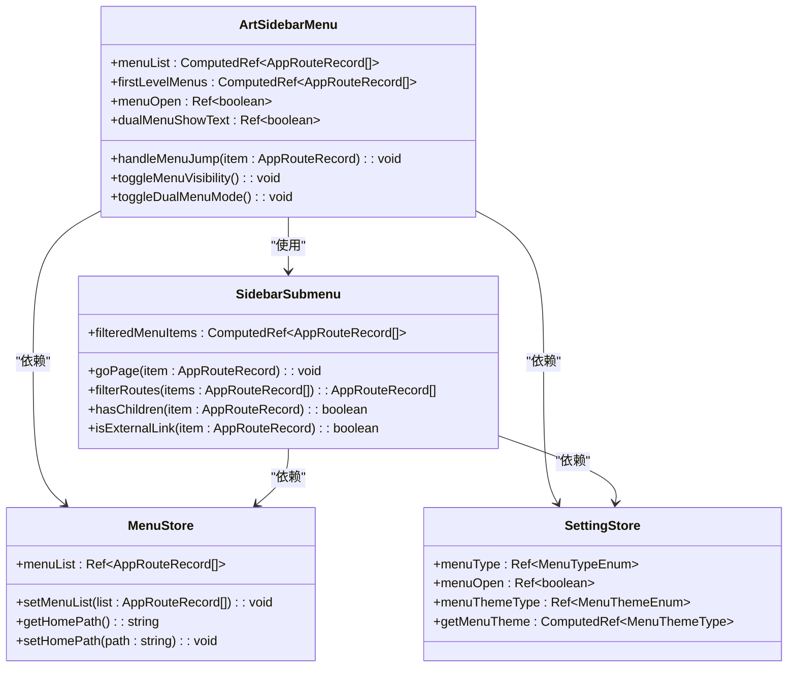
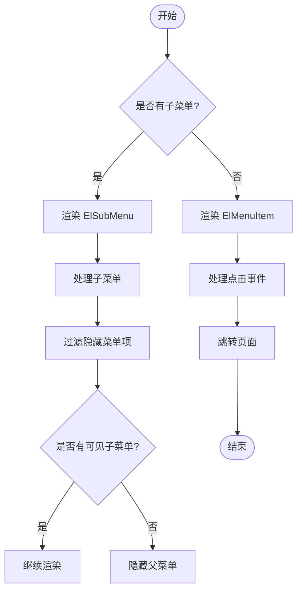
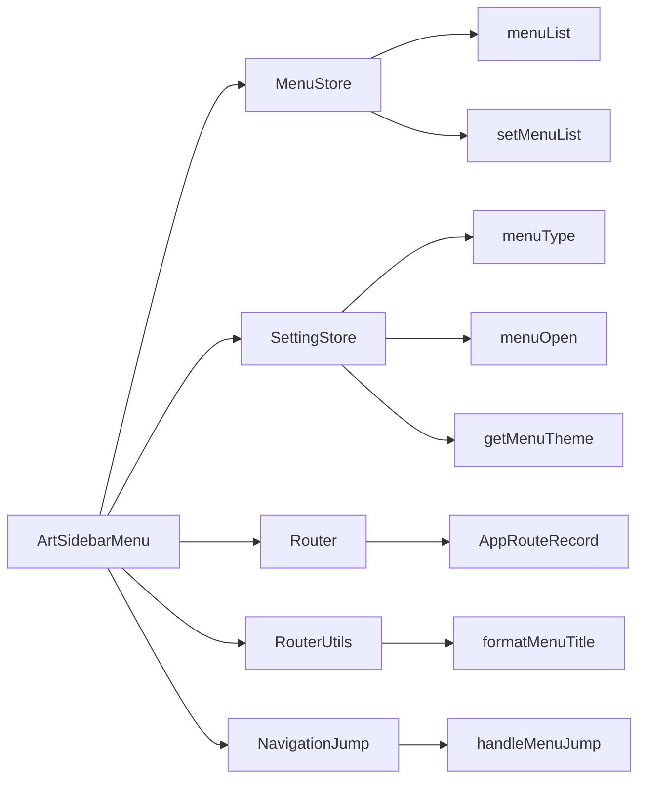

# 侧边栏菜单

<cite>
**本文档引用的文件**  
- [art-sidebar-menu/index.vue](file://src/components/core/layouts/art-menus/art-sidebar-menu/index.vue)
- [art-sidebar-menu/widget/SidebarSubmenu.vue](file://src/components/core/layouts/art-menus/art-sidebar-menu/widget/SidebarSubmenu.vue)
- [art-sidebar-menu/style.scss](file://src/components/core/layouts/art-menus/art-sidebar-menu/style.scss)
- [art-sidebar-menu/theme.scss](file://src/components/core/layouts/art-menus/art-sidebar-menu/theme.scss)
- [menu.ts](file://src/store/modules/menu.ts)
- [setting.ts](file://src/store/modules/setting.ts)
- [appEnum.ts](file://src/enums/appEnum.ts)
- [router/index.ts](file://src/types/router/index.ts)
- [router.ts](file://src/utils/router.ts)
- [jump.ts](file://src/utils/navigation/jump.ts)
- [art-logo/index.vue](file://src/components/core/base/art-logo/index.vue)
- [art-svg-icon/index.vue](file://src/components/core/base/art-svg-icon/index.vue)
</cite>

## 目录
1. [简介](#简介)
2. [项目结构](#项目结构)
3. [核心组件](#核心组件)
4. [架构概述](#架构概述)
5. [详细组件分析](#详细组件分析)
6. [依赖分析](#依赖分析)
7. [性能考虑](#性能考虑)
8. [故障排除指南](#故障排除指南)
9. [结论](#结论)

## 简介
侧边栏菜单组件是系统导航体系的核心部分，提供多级菜单渲染、动态折叠/展开状态管理、基于路由的权限过滤逻辑，以及与水平菜单的混合布局支持。该组件通过消费 store 中的菜单数据，响应路由变化高亮当前项，并集成菜单图标、徽标和快捷入口。本文档详细阐述其架构与行为，说明自定义菜单结构与权限控制的实现方式，并分析其性能优化策略。

## 项目结构
侧边栏菜单组件位于 `src/components/core/layouts/art-menus/art-sidebar-menu` 目录下，包含主组件文件、子组件、样式文件和主题文件。组件依赖于 store 中的菜单数据和设置数据，通过路由变化响应式更新菜单状态。

```mermaid
graph TB
subgraph "侧边栏菜单组件"
index["index.vue"]
widget["widget/SidebarSubmenu.vue"]
style["style.scss"]
theme["theme.scss"]
end
subgraph "依赖模块"
store["store/modules/menu.ts"]
setting["store/modules/setting.ts"]
router["types/router/index.ts"]
utils["utils/router.ts"]
navigation["utils/navigation/jump.ts"]
end
index --> widget
index --> style
index --> theme
index --> store
index --> setting
widget --> router
widget --> utils
widget --> navigation
```

**Diagram sources**
- [art-sidebar-menu/index.vue](file://src/components/core/layouts/art-menus/art-sidebar-menu/index.vue)
- [art-sidebar-menu/widget/SidebarSubmenu.vue](file://src/components/core/layouts/art-menus/art-sidebar-menu/widget/SidebarSubmenu.vue)
- [menu.ts](file://src/store/modules/menu.ts)
- [setting.ts](file://src/store/modules/setting.ts)
- [router/index.ts](file://src/types/router/index.ts)
- [router.ts](file://src/utils/router.ts)
- [jump.ts](file://src/utils/navigation/jump.ts)

**Section sources**
- [art-sidebar-menu/index.vue](file://src/components/core/layouts/art-menus/art-sidebar-menu/index.vue)
- [art-sidebar-menu/widget/SidebarSubmenu.vue](file://src/components/core/layouts/art-menus/art-sidebar-menu/widget/SidebarSubmenu.vue)

## 核心组件
侧边栏菜单组件由主组件 `index.vue` 和子组件 `SidebarSubmenu.vue` 组成。主组件负责整体布局和状态管理，子组件负责递归渲染多级菜单。组件通过 `useMenuStore` 和 `useSettingStore` 从 store 中获取菜单数据和设置数据，并通过 `handleMenuJump` 处理菜单跳转逻辑。

**Section sources**
- [art-sidebar-menu/index.vue](file://src/components/core/layouts/art-menus/art-sidebar-menu/index.vue)
- [art-sidebar-menu/widget/SidebarSubmenu.vue](file://src/components/core/layouts/art-menus/art-sidebar-menu/widget/SidebarSubmenu.vue)
- [menu.ts](file://src/store/modules/menu.ts)
- [setting.ts](file://src/store/modules/setting.ts)

## 架构概述
侧边栏菜单组件采用组合式 API 构建，利用 Vue 3 的响应式系统实现动态更新。组件通过计算属性 `menuList` 和 `firstLevelMenus` 过滤和处理菜单数据，根据当前路由和设置状态动态渲染菜单。组件支持多种菜单类型，包括左侧菜单、双列菜单等，并通过 `ElMenu` 和 `ElSubMenu` 实现多级菜单的展开和折叠。



**Diagram sources**
- [art-sidebar-menu/index.vue](file://src/components/core/layouts/art-menus/art-sidebar-menu/index.vue)
- [art-sidebar-menu/widget/SidebarSubmenu.vue](file://src/components/core/layouts/art-menus/art-sidebar-menu/widget/SidebarSubmenu.vue)
- [menu.ts](file://src/store/modules/menu.ts)
- [setting.ts](file://src/store/modules/setting.ts)

## 详细组件分析

### 主组件分析
主组件 `ArtSidebarMenu` 负责整体布局和状态管理。组件通过 `useMenuStore` 和 `useSettingStore` 获取菜单数据和设置数据，并通过计算属性 `menuList` 和 `firstLevelMenus` 过滤和处理菜单数据。组件根据当前路由和设置状态动态渲染菜单，并通过 `handleMenuJump` 处理菜单跳转逻辑。

#### 多级菜单渲染机制
组件通过 `ElMenu` 和 `ElSubMenu` 实现多级菜单的展开和折叠。子组件 `SidebarSubmenu` 递归渲染多级菜单，通过 `hasChildren` 判断菜单项是否有子菜单，通过 `filterRoutes` 过滤隐藏的菜单项。



**Diagram sources**
- [art-sidebar-menu/widget/SidebarSubmenu.vue](file://src/components/core/layouts/art-menus/art-sidebar-menu/widget/SidebarSubmenu.vue)

#### 动态折叠/展开状态管理
组件通过 `menuOpen` 状态管理菜单的展开和折叠。用户点击折叠按钮或在移动端切换菜单状态时，组件通过 `toggleMenuVisibility` 切换 `menuOpen` 状态，并通过 `settingStore.setMenuOpen` 更新 store 中的状态。

**Section sources**
- [art-sidebar-menu/index.vue](file://src/components/core/layouts/art-menus/art-sidebar-menu/index.vue)

#### 基于路由的权限过滤逻辑
组件通过 `filterRoutes` 方法过滤隐藏的菜单项。如果一个父菜单的所有子菜单都被隐藏，则父菜单也会被隐藏。组件根据 `meta.isHide` 属性判断菜单项是否隐藏，并递归过滤子菜单。

**Section sources**
- [art-sidebar-menu/widget/SidebarSubmenu.vue](file://src/components/core/layouts/art-menus/art-sidebar-menu/widget/SidebarSubmenu.vue)

#### 混合布局支持
组件支持多种菜单类型，包括左侧菜单、双列菜单等。通过 `menuType` 设置菜单类型，并根据 `isDualMenu` 计算属性渲染双列菜单。双列菜单的左侧显示一级菜单图标，右侧显示当前一级菜单的子菜单。

**Section sources**
- [art-sidebar-menu/index.vue](file://src/components/core/layouts/art-menus/art-sidebar-menu/index.vue)

#### 菜单高亮逻辑
组件通过 `routerPath` 计算属性获取当前路由路径，并将其传递给 `ElMenu` 的 `default-active` 属性，实现当前菜单项的高亮。对于一级菜单，通过 `firstLevelMenuPath` 计算属性判断是否高亮。

**Section sources**
- [art-sidebar-menu/index.vue](file://src/components/core/layouts/art-menus/art-sidebar-menu/index.vue)

### 子组件分析
子组件 `SidebarSubmenu` 负责递归渲染多级菜单。组件通过 `filteredMenuItems` 计算属性过滤隐藏的菜单项，并通过 `hasChildren` 判断菜单项是否有子菜单。组件通过 `goPage` 方法处理菜单跳转逻辑，并通过 `isExternalLink` 判断是否为外部链接。

**Section sources**
- [art-sidebar-menu/widget/SidebarSubmenu.vue](file://src/components/core/layouts/art-menus/art-sidebar-menu/widget/SidebarSubmenu.vue)

## 依赖分析
侧边栏菜单组件依赖于多个模块，包括菜单状态管理、设置状态管理、路由类型定义、路由工具函数和导航跳转工具。组件通过 `useMenuStore` 和 `useSettingStore` 从 store 中获取菜单数据和设置数据，并通过 `handleMenuJump` 处理菜单跳转逻辑。



**Diagram sources**
- [art-sidebar-menu/index.vue](file://src/components/core/layouts/art-menus/art-sidebar-menu/index.vue)
- [menu.ts](file://src/store/modules/menu.ts)
- [setting.ts](file://src/store/modules/setting.ts)
- [router/index.ts](file://src/types/router/index.ts)
- [router.ts](file://src/utils/router.ts)
- [jump.ts](file://src/utils/navigation/jump.ts)

## 性能考虑
侧边栏菜单组件通过计算属性和响应式系统实现高效更新。组件避免不必要的重新渲染，通过 `computed` 和 `ref` 管理状态。对于大型菜单，建议实现虚拟滚动以优化性能，但当前实现中未包含此功能。

**Section sources**
- [art-sidebar-menu/index.vue](file://src/components/core/layouts/art-menus/art-sidebar-menu/index.vue)
- [art-sidebar-menu/widget/SidebarSubmenu.vue](file://src/components/core/layouts/art-menus/art-sidebar-menu/widget/SidebarSubmenu.vue)

## 故障排除指南
- **菜单不显示**：检查 `menuType` 设置是否正确，确保 `showLeftMenu` 或 `isDualMenu` 计算属性返回 `true`。
- **菜单项不高亮**：检查 `routerPath` 计算属性是否正确获取当前路由路径，确保 `meta.activePath` 或 `route.path` 正确设置。
- **子菜单不显示**：检查 `menuList` 计算属性是否正确处理当前路由的子菜单，确保 `isIframe` 和 `isFirstLevel` 判断逻辑正确。
- **跳转失败**：检查 `handleMenuJump` 方法是否正确处理外部链接和内部路由，确保 `link` 和 `isIframe` 属性正确设置。

**Section sources**
- [art-sidebar-menu/index.vue](file://src/components/core/layouts/art-menus/art-sidebar-menu/index.vue)
- [art-sidebar-menu/widget/SidebarSubmenu.vue](file://src/components/core/layouts/art-menus/art-sidebar-menu/widget/SidebarSubmenu.vue)
- [jump.ts](file://src/utils/navigation/jump.ts)

## 结论
侧边栏菜单组件是一个功能丰富、可扩展的导航组件，支持多级菜单渲染、动态折叠/展开状态管理、基于路由的权限过滤逻辑，以及与水平菜单的混合布局支持。组件通过消费 store 中的菜单数据，响应路由变化高亮当前项，并集成菜单图标、徽标和快捷入口。通过合理使用计算属性和响应式系统，组件实现了高效更新和良好性能。开发者可以根据需要自定义菜单结构和权限控制，扩展菜单项类型。