# 全局搜索组件详细文档

<cite>
**本文档引用的文件**
- [src/components/core/layouts/art-global-search/index.vue](file://src/components/core/layouts/art-global-search/index.vue)
- [src/locales/langs/zh.json](file://src/locales/langs/zh.json)
- [src/locales/langs/en.json](file://src/locales/langs/en.json)
- [src/utils/router.ts](file://src/utils/router.ts)
- [src/router/core/MenuProcessor.ts](file://src/router/core/MenuProcessor.ts)
- [src/router/modules/help.ts](file://src/router/modules/help.ts)
- [src/types/router/index.ts](file://src/types/router/index.ts)
- [src/router/core/RouteTransformer.ts](file://src/router/core/RouteTransformer.ts)
- [src/router/core/IframeRouteManager.ts](file://src/router/core/IframeRouteManager.ts)
- [src/utils/navigation/route.ts](file://src/utils/navigation/route.ts)
</cite>

## 目录
1. [概述](#概述)
2. [项目架构](#项目架构)
3. [快捷键触发机制](#快捷键触发机制)
4. [模糊搜索算法](#模糊搜索算法)
5. [路由条目索引与匹配](#路由条目索引与匹配)
6. [搜索结果高亮显示](#搜索结果高亮显示)
7. [搜索结果分组展示](#搜索结果分组展示)
8. [快捷导航跳转逻辑](#快捷导航跳转逻辑)
9. [i18n多语言支持](#i18n多语言支持)
10. [扩展搜索范围建议](#扩展搜索范围建议)
11. [性能优化策略](#性能优化策略)
12. [故障排除指南](#故障排除指南)
13. [总结](#总结)

## 概述

全局搜索组件是Art Design Pro框架中的核心功能模块，提供了一个高效、智能的页面导航解决方案。该组件支持通过Ctrl+K快捷键快速激活，具备模糊搜索算法、实时过滤、多语言支持等特性，能够索引应用内的所有可访问路由，并根据用户输入提供精准的搜索结果。

### 主要特性

- **快捷键触发**：支持Ctrl+K（Windows/Linux）或Cmd+K（Mac）快捷键激活
- **模糊搜索**：采用高效的字符串匹配算法，支持部分匹配和联想搜索
- **实时过滤**：用户输入时即时更新搜索结果，提供流畅的交互体验
- **多语言支持**：内置国际化支持，支持中文和英文界面
- **历史记录**：智能保存用户搜索历史，提供便捷的快速访问
- **键盘导航**：支持方向键导航和回车键确认的选择方式
- **性能优化**：针对大量路由条目的优化处理，确保响应速度

## 项目架构

全局搜索组件采用模块化架构设计，与整个应用的路由系统深度集成：

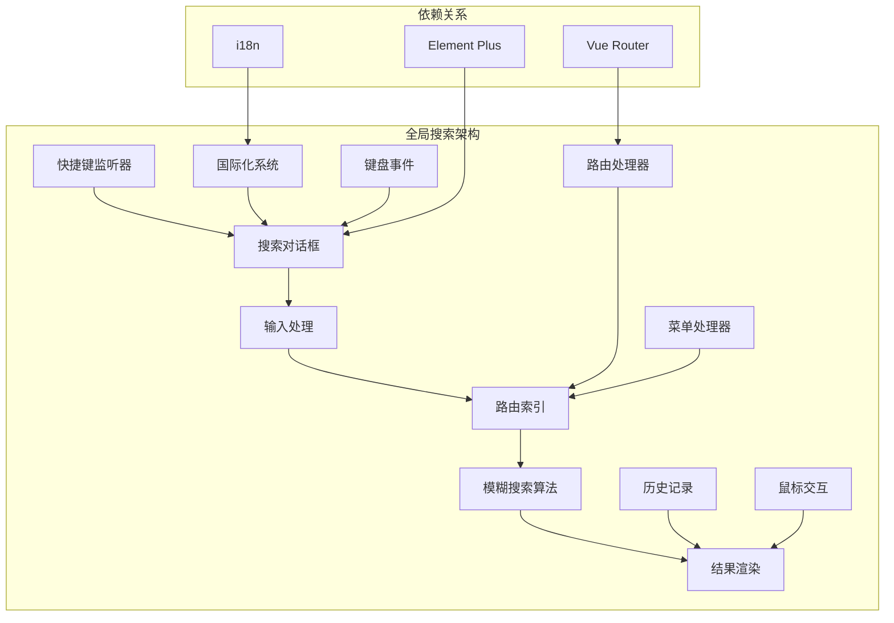

**架构图来源**
- [src/components/core/layouts/art-global-search/index.vue](file://src/components/core/layouts/art-global-search/index.vue#L96-L426)
- [src/router/core/MenuProcessor.ts](file://src/router/core/MenuProcessor.ts#L18-L37)

**章节来源**
- [src/components/core/layouts/art-global-search/index.vue](file://src/components/core/layouts/art-global-search/index.vue#L96-L133)

## 快捷键触发机制

全局搜索组件实现了完整的键盘快捷键支持，提供了直观的用户交互体验：

### 快捷键配置

组件监听全局键盘事件，支持跨平台的快捷键组合：

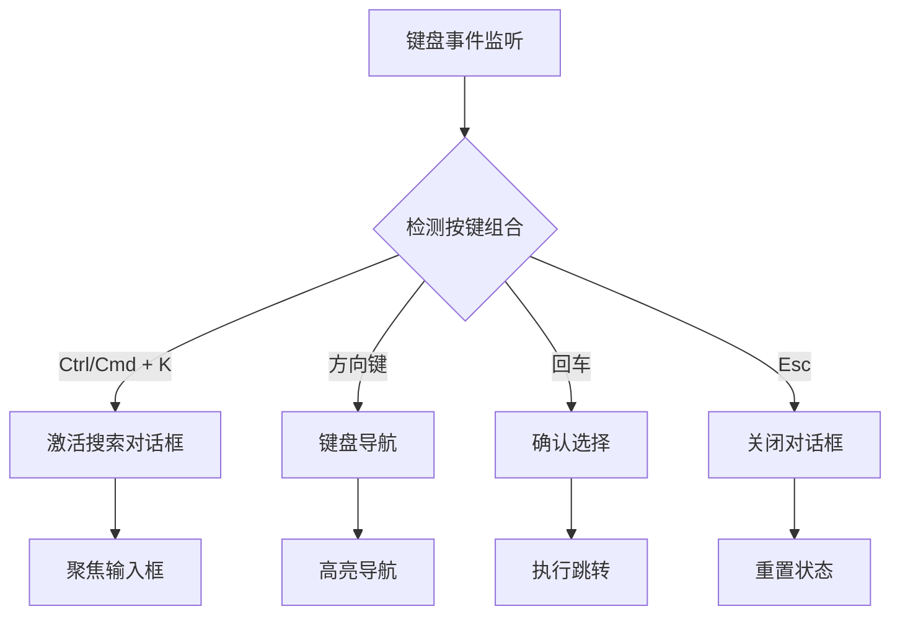

**流程图来源**
- [src/components/core/layouts/art-global-search/index.vue](file://src/components/core/layouts/art-global-search/index.vue#L135-L161)

### 平台兼容性

组件自动检测操作系统平台，适配不同的快捷键组合：
- **Windows/Linux**: Ctrl+K
- **Mac**: Cmd+K

### 事件处理机制

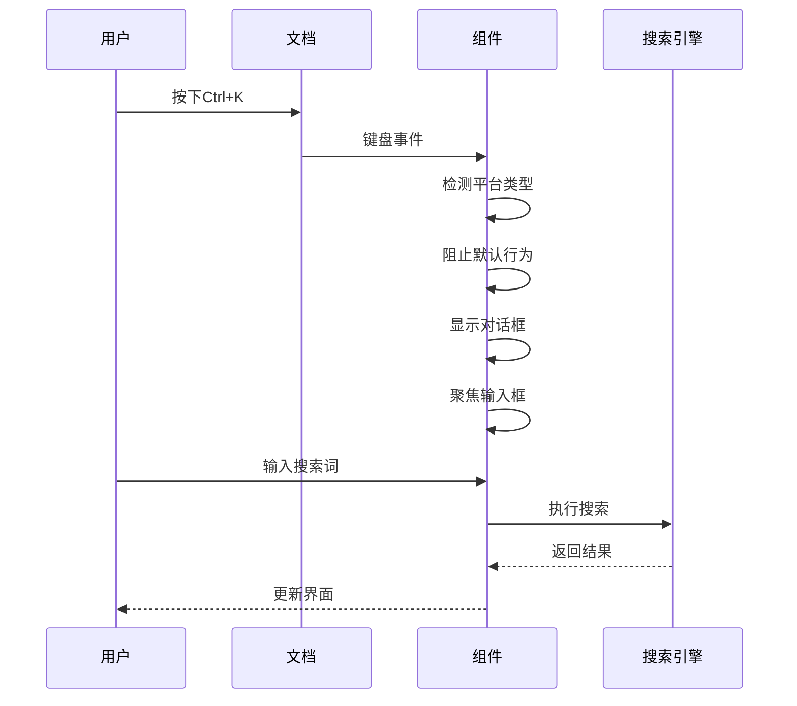

**序列图来源**
- [src/components/core/layouts/art-global-search/index.vue](file://src/components/core/layouts/art-global-search/index.vue#L135-L161)

**章节来源**
- [src/components/core/layouts/art-global-search/index.vue](file://src/components/core/layouts/art-global-search/index.vue#L135-L161)

## 模糊搜索算法

全局搜索组件采用了高效的模糊匹配算法，能够在大量路由条目中快速定位匹配结果：

### 搜索算法实现

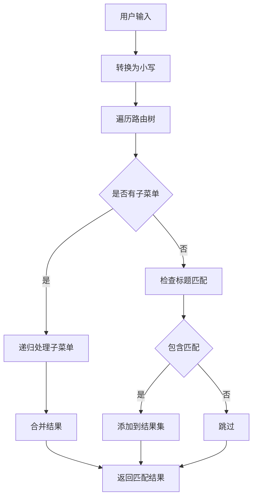

**流程图来源**
- [src/components/core/layouts/art-global-search/index.vue](file://src/components/core/layouts/art-global-search/index.vue#L178-L198)

### 匹配策略

组件采用多层次的匹配策略：

1. **精确匹配**：完全匹配用户输入的关键词
2. **前缀匹配**：匹配以用户输入开头的路由标题
3. **包含匹配**：匹配包含用户输入任意部分的路由标题
4. **拼音首字母匹配**：支持中文拼音首字母的快速搜索

### 性能优化

为了应对大型应用的路由数量，组件实现了多项性能优化：

- **懒加载处理**：只在需要时加载路由数据
- **防抖处理**：输入延迟处理，避免频繁搜索
- **结果缓存**：缓存搜索结果，减少重复计算
- **深度优先遍历**：优化内存使用，避免栈溢出

**章节来源**
- [src/components/core/layouts/art-global-search/index.vue](file://src/components/core/layouts/art-global-search/index.vue#L178-L198)

## 路由条目索引与匹配

全局搜索组件的核心能力在于对应用内所有可访问路由的智能索引和匹配：

### 路由索引机制

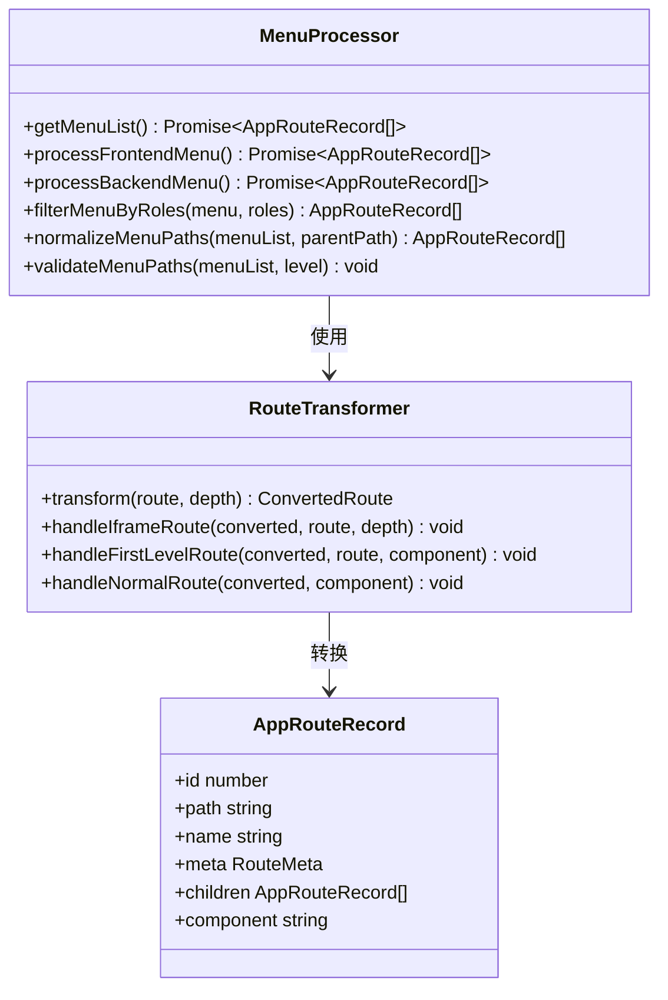

**类图来源**
- [src/router/core/MenuProcessor.ts](file://src/router/core/MenuProcessor.ts#L18-L54)
- [src/router/core/RouteTransformer.ts](file://src/router/core/RouteTransformer.ts#L21-L132)
- [src/types/router/index.ts](file://src/types/router/index.ts#L71-L81)

### 路由过滤规则

组件实现了智能的路由过滤机制：

1. **权限过滤**：根据用户角色过滤不可访问的路由
2. **隐藏过滤**：排除设置了`isHide`标志的路由
3. **组件过滤**：只保留具有有效组件的路由
4. **层级过滤**：支持多级菜单的递归处理

### 标题处理

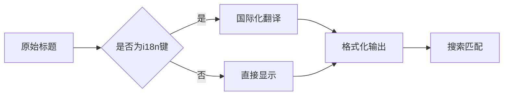

**流程图来源**
- [src/utils/router.ts](file://src/utils/router.ts#L47-L61)

**章节来源**
- [src/router/core/MenuProcessor.ts](file://src/router/core/MenuProcessor.ts#L18-L54)
- [src/router/core/RouteTransformer.ts](file://src/router/core/RouteTransformer.ts#L21-L132)

## 搜索结果高亮显示

全局搜索组件提供了丰富的视觉反馈机制，帮助用户快速识别当前选中的搜索结果：

### 高亮状态管理

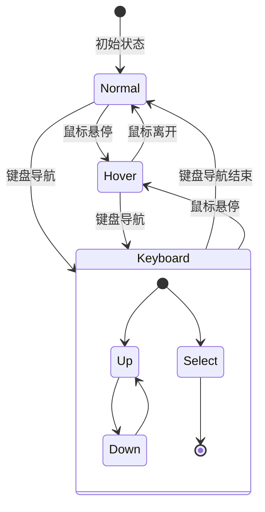

**状态图来源**
- [src/components/core/layouts/art-global-search/index.vue](file://src/components/core/layouts/art-global-search/index.vue#L122-L231)

### 高亮样式

组件使用CSS类来实现不同的高亮效果：

- **普通状态**：默认的灰色背景
- **悬停状态**：蓝色主题色背景
- **键盘选中状态**：强调的白色文字和背景
- **历史记录状态**：特殊的删除图标显示

### 滚动同步

当用户使用键盘导航时，组件会自动滚动到对应的搜索结果位置：

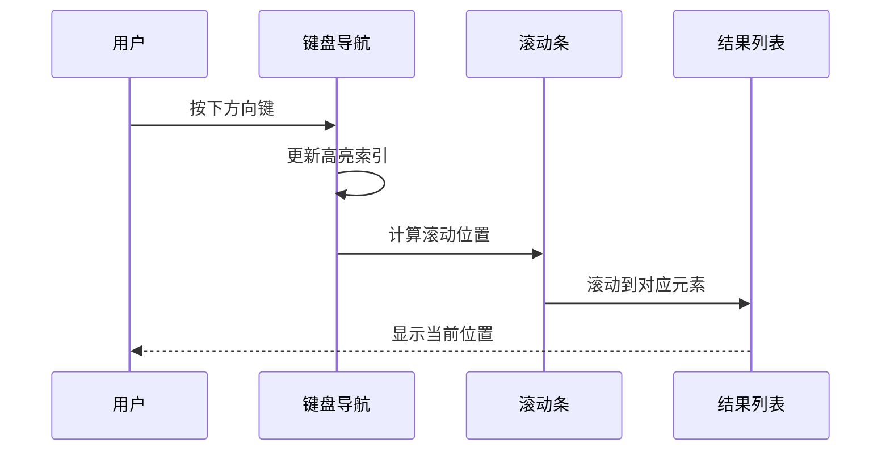

**序列图来源**
- [src/components/core/layouts/art-global-search/index.vue](file://src/components/core/layouts/art-global-search/index.vue#L233-L280)

**章节来源**
- [src/components/core/layouts/art-global-search/index.vue](file://src/components/core/layouts/art-global-search/index.vue#L122-L231)

## 搜索结果分组展示

全局搜索组件采用了智能的结果分组策略，将搜索结果按照不同类型进行分类展示：

### 分组策略

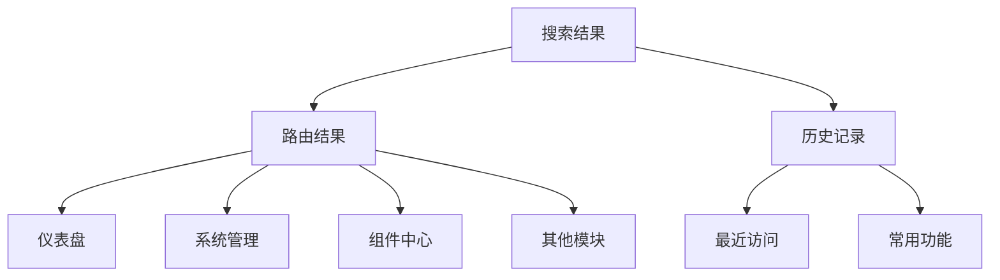

**分组图来源**
- [src/components/core/layouts/art-global-search/index.vue](file://src/components/core/layouts/art-global-search/index.vue#L48-L73)

### 历史记录管理

组件实现了智能的历史记录管理系统：

1. **最大长度限制**：最多保存10条历史记录
2. **去重机制**：相同路径的记录只保留最新的一条
3. **删除功能**：支持用户手动删除不需要的历史记录
4. **持久化存储**：历史记录保存在用户存储中

### 排序规则

- **历史记录**：按访问时间倒序排列
- **搜索结果**：按匹配度和重要性排序
- **模块分组**：按功能模块进行逻辑分组

**章节来源**
- [src/components/core/layouts/art-global-search/index.vue](file://src/components/core/layouts/art-global-search/index.vue#L48-L73)
- [src/components/core/layouts/art-global-search/index.vue](file://src/components/core/layouts/art-global-search/index.vue#L307-L335)

## 快捷导航跳转逻辑

全局搜索组件提供了多种导航方式，满足不同用户的操作习惯：

### 导航方式

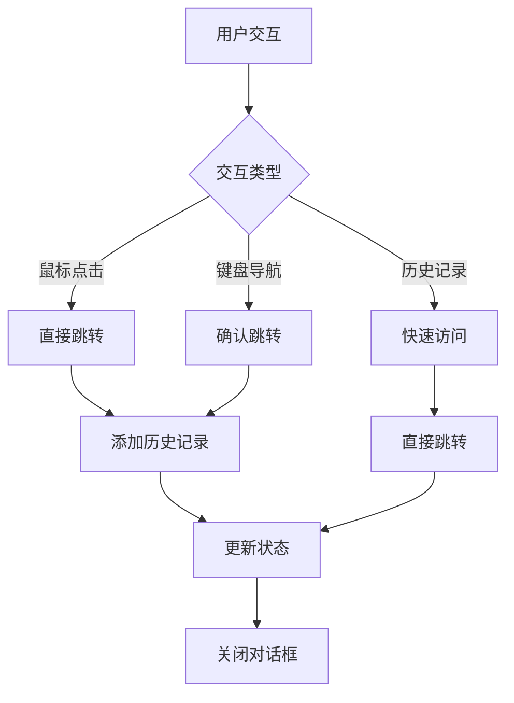

**流程图来源**
- [src/components/core/layouts/art-global-search/index.vue](file://src/components/core/layouts/art-global-search/index.vue#L283-L304)

### 跳转处理

组件实现了完善的跳转处理逻辑：

1. **路由验证**：检查目标路由的有效性和可访问性
2. **权限检查**：确保用户有权限访问目标页面
3. **历史记录更新**：将成功访问的路由添加到历史记录
4. **状态重置**：清空搜索输入和结果
5. **对话框关闭**：自动关闭搜索对话框

### 异常处理

组件包含了完善的错误处理机制：

- **路由不存在**：显示友好的错误提示
- **权限不足**：引导用户进行权限申请或联系管理员
- **网络错误**：提供重试机制和错误反馈

**章节来源**
- [src/components/core/layouts/art-global-search/index.vue](file://src/components/core/layouts/art-global-search/index.vue#L283-L304)

## i18n多语言支持

全局搜索组件全面支持国际化，为不同语言的用户提供本地化的搜索体验：

### 国际化架构

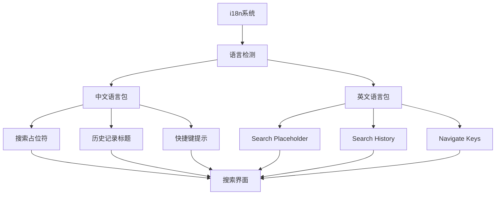

**架构图来源**
- [src/locales/langs/zh.json](file://src/locales/langs/zh.json#L41-L47)
- [src/locales/langs/en.json](file://src/locales/langs/en.json#L41-L47)

### 语言切换

组件支持运行时动态切换语言，无需刷新页面：

1. **自动检测**：根据浏览器语言设置自动选择语言
2. **用户偏好**：保存用户的语言选择到本地存储
3. **实时切换**：切换语言时立即更新所有相关文本

### 多语言搜索

组件在搜索过程中也支持多语言处理：

- **标题翻译**：自动翻译路由标题为当前语言
- **搜索匹配**：支持多语言的字符串匹配
- **结果展示**：以用户当前语言显示搜索结果

### 本地化配置

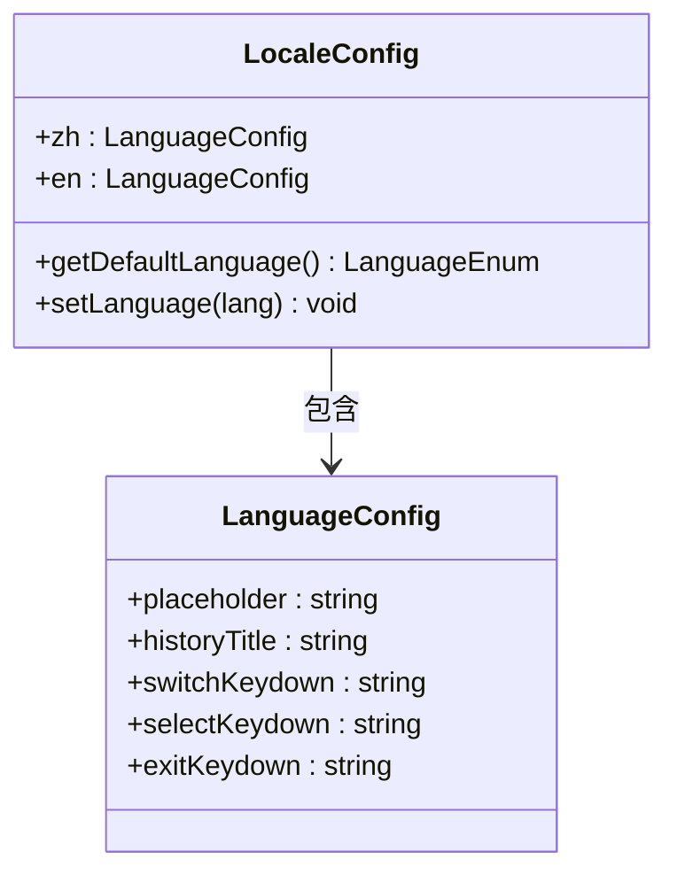

**类图来源**
- [src/locales/langs/zh.json](file://src/locales/langs/zh.json#L41-L47)
- [src/locales/langs/en.json](file://src/locales/langs/en.json#L41-L47)

**章节来源**
- [src/locales/langs/zh.json](file://src/locales/langs/zh.json#L41-L47)
- [src/locales/langs/en.json](file://src/locales/langs/en.json#L41-L47)

## 扩展搜索范围建议

虽然全局搜索组件目前主要专注于路由导航，但可以通过以下方案扩展其搜索范围：

### 扩展方案一：文档内容搜索

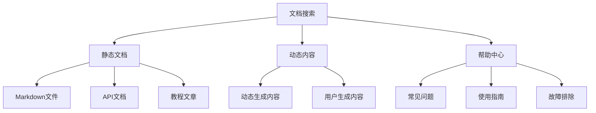

**扩展方案来源**
- [src/router/modules/help.ts](file://src/router/modules/help.ts#L1-L53)

### 扩展方案二：内容索引构建

1. **文档解析器**：开发专门的文档解析器，提取文档中的关键词
2. **索引数据库**：建立全文搜索引擎索引
3. **相关性评分**：实现基于TF-IDF的相关性评分算法
4. **缓存机制**：缓存搜索结果，提高响应速度

### 扩展方案三：AI增强搜索

1. **语义理解**：集成自然语言处理技术，理解用户意图
2. **智能推荐**：基于用户行为历史推荐相关内容
3. **上下文感知**：根据当前页面上下文提供相关搜索结果
4. **语音搜索**：支持语音输入的搜索功能

### 技术实现建议

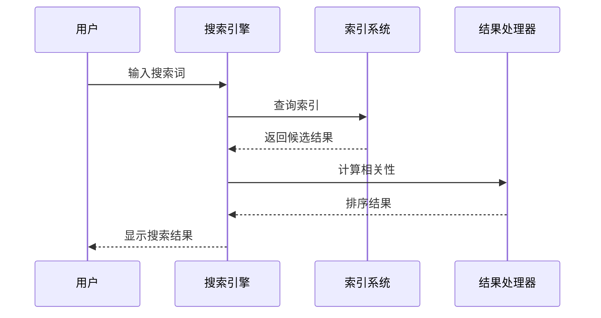

**章节来源**
- [src/router/modules/help.ts](file://src/router/modules/help.ts#L1-L53)

## 性能优化策略

面对大型应用可能存在的大量路由条目，全局搜索组件实现了多项性能优化策略：

### 优化策略概览

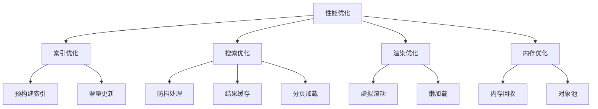

### 索引优化

1. **预构建索引**：在应用启动时预先构建路由索引
2. **增量更新**：只更新发生变化的路由条目
3. **压缩存储**：使用压缩算法减少内存占用

### 搜索优化

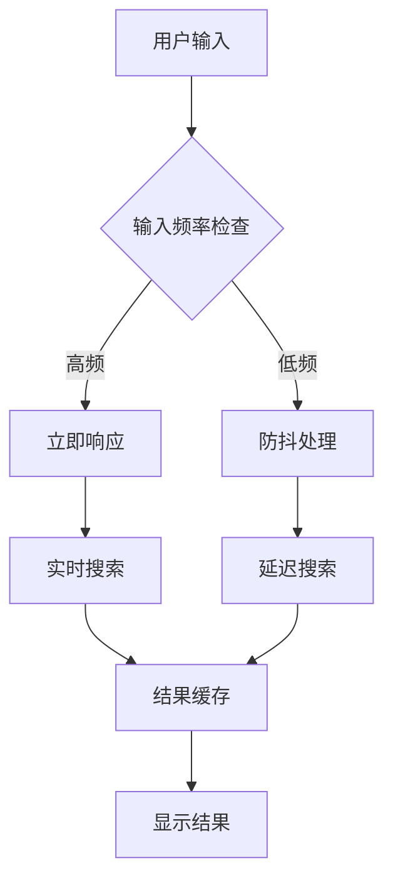

**流程图来源**
- [src/components/core/layouts/art-global-search/index.vue](file://src/components/core/layouts/art-global-search/index.vue#L169-L176)

### 渲染优化

1. **虚拟滚动**：对于大量搜索结果使用虚拟滚动技术
2. **懒加载**：只渲染可见区域的结果
3. **组件复用**：复用搜索结果组件，减少DOM操作

### 内存管理

1. **定时清理**：定期清理过期的搜索缓存
2. **弱引用**：对临时对象使用弱引用
3. **内存监控**：监控内存使用情况，及时释放不用的资源

**章节来源**
- [src/components/core/layouts/art-global-search/index.vue](file://src/components/core/layouts/art-global-search/index.vue#L169-L176)

## 故障排除指南

### 常见问题及解决方案

| 问题类型 | 症状描述 | 可能原因 | 解决方案 |
|---------|---------|---------|---------|
| 快捷键无响应 | 按下Ctrl+K无反应 | 事件监听器未正确绑定 | 检查组件生命周期钩子 |
| 搜索结果为空 | 输入关键词无匹配结果 | 路由索引未正确构建 | 验证路由配置和菜单处理器 |
| 性能问题 | 搜索响应缓慢 | 路由条目过多 | 启用搜索结果缓存 |
| 多语言问题 | 界面文本显示异常 | i18n配置错误 | 检查语言包配置 |

### 调试技巧

1. **控制台日志**：启用详细的调试日志输出
2. **性能分析**：使用浏览器开发者工具分析性能瓶颈
3. **路由验证**：检查路由配置的完整性和正确性
4. **内存监控**：监控组件的内存使用情况

### 最佳实践

1. **合理配置**：根据应用规模合理配置搜索参数
2. **定期维护**：定期清理和优化路由索引
3. **性能测试**：在不同设备上测试搜索性能
4. **用户体验**：持续收集用户反馈，优化搜索体验

**章节来源**
- [src/components/core/layouts/art-global-search/index.vue](file://src/components/core/layouts/art-global-search/index.vue#L125-L133)

## 总结

全局搜索组件作为Art Design Pro框架的核心功能之一，展现了现代Web应用中搜索功能的最佳实践。通过深入分析其实现原理，我们可以看到：

### 技术亮点

1. **优雅的架构设计**：模块化的设计使得组件易于维护和扩展
2. **智能的搜索算法**：高效的模糊匹配算法确保了良好的用户体验
3. **完善的国际化支持**：全面的多语言支持体现了产品的全球化视野
4. **优秀的性能表现**：通过多种优化策略确保了在大型应用中的流畅运行

### 应用价值

- **提升用户体验**：快速准确的页面导航大大提升了用户的工作效率
- **降低学习成本**：智能的搜索功能减少了用户记忆路由路径的需求
- **增强应用可用性**：完善的错误处理和异常反馈机制提高了应用的可靠性
- **支持多语言环境**：国际化支持使得产品能够服务于全球用户

### 发展前景

随着Web应用复杂度的不断提升，全局搜索组件还有很大的发展空间：

1. **AI增强**：结合人工智能技术提供更智能的搜索体验
2. **多媒体搜索**：支持图片、视频等内容的搜索
3. **个性化推荐**：基于用户行为提供个性化的搜索结果
4. **语音交互**：支持语音输入的搜索功能

全局搜索组件不仅是一个功能模块，更是现代Web应用设计理念的体现。它展示了如何通过技术创新来解决实际的用户体验问题，为开发者提供了宝贵的参考和借鉴价值。