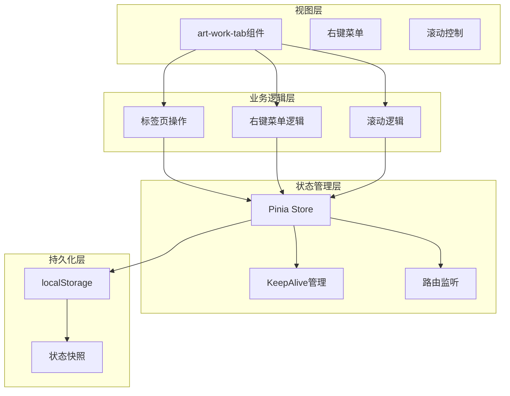
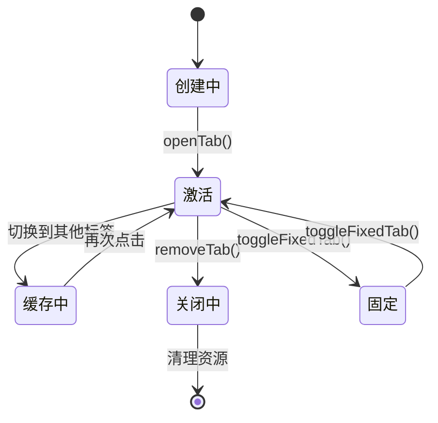
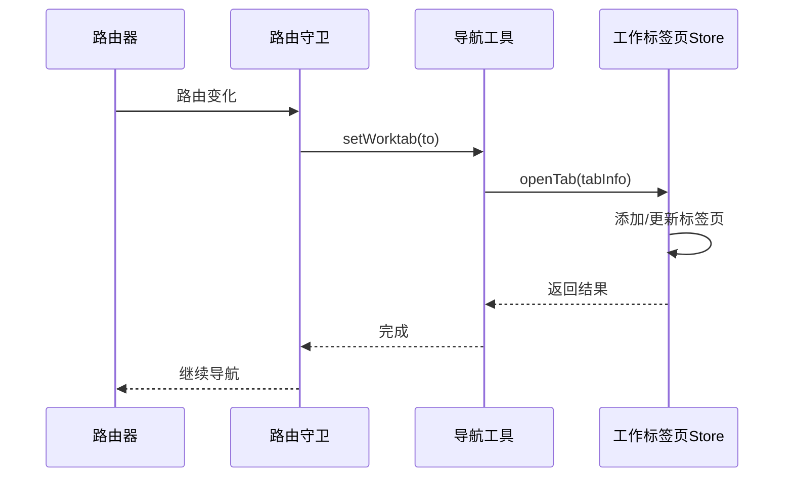
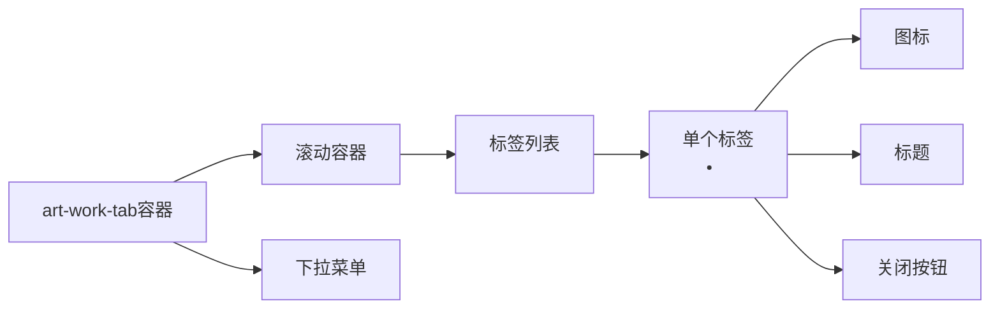
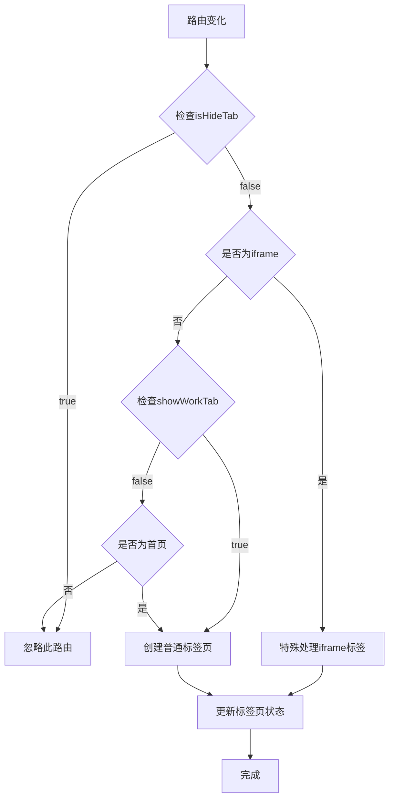
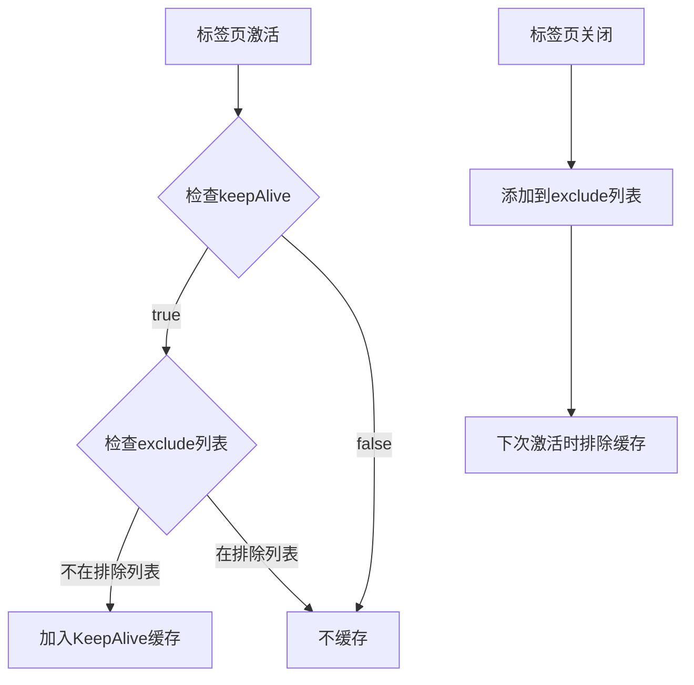
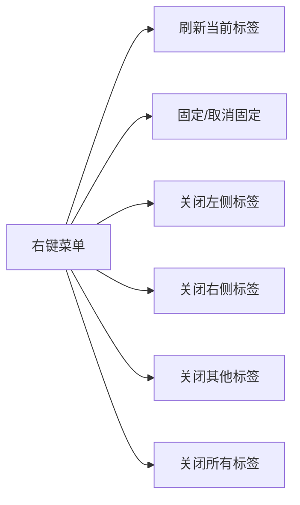
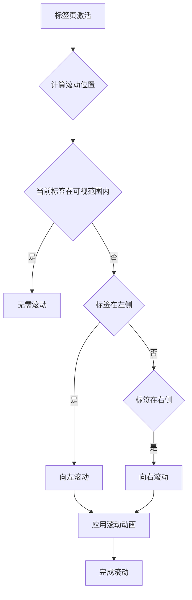

# 工作标签页组件技术文档

<cite>
**本文档中引用的文件**
- [src/components/core/layouts/art-work-tab/index.vue](file://src/components/core/layouts/art-work-tab/index.vue)
- [src/store/modules/worktab.ts](file://src/store/modules/worktab.ts)
- [src/utils/navigation/worktab.ts](file://src/utils/navigation/worktab.ts)
- [src/router/guards/beforeEach.ts](file://src/router/guards/beforeEach.ts)
- [src/types/store/index.ts](file://src/types/store/index.ts)
- [src/utils/ui/tabs.ts](file://src/utils/ui/tabs.ts)
- [src/views/examples/tabs/index.vue](file://src/views/examples/tabs/index.vue)
</cite>

## 目录
1. [概述](#概述)
2. [架构设计](#架构设计)
3. [核心功能](#核心功能)
4. [组件结构](#组件结构)
5. [状态管理](#状态管理)
6. [路由集成](#路由集成)
7. [缓存机制](#缓存机制)
8. [右键菜单操作](#右键菜单操作)
9. [滚动交互](#滚动交互)
10. [API接口](#api接口)
11. [最佳实践](#最佳实践)
12. [故障排除](#故障排除)

## 概述

工作标签页组件是Art Design Pro框架中的核心导航组件，提供了多标签页管理功能。该组件实现了智能的标签页生命周期管理、自动路由监听、持久化存储、缓存控制等功能，为用户提供类似浏览器标签页的体验。

### 主要特性

- **智能标签页复用**：基于路由名称的标签页复用机制
- **自动路由监听**：监听路由变化自动添加标签页
- **持久化存储**：使用localStorage持久化标签状态
- **灵活的缓存控制**：通过KeepAlive实现页面缓存管理
- **丰富的右键菜单**：支持关闭、固定、刷新等多种操作
- **响应式滚动**：支持鼠标滚轮和触摸滑动
- **多种标签样式**：支持默认、卡片、谷歌风格三种样式

## 架构设计

工作标签页组件采用分层架构设计，包含以下核心层次：

**图表来源**
- [src/components/core/layouts/art-work-tab/index.vue](file://src/components/core/layouts/art-work-tab/index.vue#L1-L585)
- [src/store/modules/worktab.ts](file://src/store/modules/worktab.ts#L1-L569)

## 核心功能

### 标签页生命周期管理

工作标签页组件实现了完整的标签页生命周期管理：

**图表来源**
- [src/store/modules/worktab.ts](file://src/store/modules/worktab.ts#L112-L164)

### 自动路由监听

组件通过路由守卫自动监听路由变化，实现标签页的自动创建和更新：

**图表来源**
- [src/router/guards/beforeEach.ts](file://src/router/guards/beforeEach.ts#L149-L152)
- [src/utils/navigation/worktab.ts](file://src/utils/navigation/worktab.ts#L35-L67)

**章节来源**
- [src/router/guards/beforeEach.ts](file://src/router/guards/beforeEach.ts#L149-L152)
- [src/utils/navigation/worktab.ts](file://src/utils/navigation/worktab.ts#L35-L67)

## 组件结构

### 组件模板结构

工作标签页组件采用简洁的模板结构，主要包含以下部分：

- **标签容器**：显示所有打开的标签页
- **滚动区域**：支持水平滚动的标签页容器
- **下拉菜单**：显示右键菜单选项
- **样式控制**：支持多种标签页样式

### 核心DOM结构

**图表来源**
- [src/components/core/layouts/art-work-tab/index.vue](file://src/components/core/layouts/art-work-tab/index.vue#L2-L83)

**章节来源**
- [src/components/core/layouts/art-work-tab/index.vue](file://src/components/core/layouts/art-work-tab/index.vue#L2-L83)

## 状态管理

### Pinia Store设计

工作标签页的状态管理基于Pinia Store，包含以下核心状态：

| 状态属性 | 类型 | 描述 |
|---------|------|------|
| current | Partial<WorkTab> | 当前激活的标签页 |
| opened | WorkTab[] | 所有打开的标签页列表 |
| keepAliveExclude | string[] | KeepAlive缓存排除列表 |

### 状态计算属性

| 计算属性 | 类型 | 描述 |
|---------|------|------|
| hasOpenedTabs | boolean | 是否有打开的标签页 |
| hasMultipleTabs | boolean | 是否有多于一个标签页 |
| currentTabIndex | number | 当前标签页在列表中的索引 |

### 核心方法

工作标签页Store提供了丰富的操作方法：

| 方法名 | 参数 | 描述 |
|--------|------|------|
| openTab | WorkTab | 打开或激活一个标签页 |
| removeTab | string | 关闭指定路径的标签页 |
| removeLeft | string | 关闭指定标签页左侧的所有标签 |
| removeRight | string | 关闭指定标签页右侧的所有标签 |
| removeOthers | string | 关闭除当前标签页外的所有标签 |
| removeAll | void | 关闭所有可关闭的标签页 |
| toggleFixedTab | string | 切换指定标签页的固定状态 |
| validateWorktabs | Router | 验证工作标签页的路由有效性 |

**章节来源**
- [src/store/modules/worktab.ts](file://src/store/modules/worktab.ts#L47-L560)

## 路由集成

### 路由守卫集成

工作标签页与Vue Router深度集成，通过全局前置守卫自动管理标签页：

**图表来源**
- [src/utils/navigation/worktab.ts](file://src/utils/navigation/worktab.ts#L38-L66)

### 路由元信息支持

工作标签页支持通过路由元信息配置标签行为：

| 元信息字段 | 类型 | 描述 |
|-----------|------|------|
| title | string | 标签页标题 |
| icon | string | 标签页图标 |
| keepAlive | boolean | 是否启用KeepAlive缓存 |
| fixedTab | boolean | 是否固定标签页 |
| isHideTab | boolean | 是否隐藏标签页 |

**章节来源**
- [src/utils/navigation/worktab.ts](file://src/utils/navigation/worktab.ts#L38-L66)
- [src/router/guards/beforeEach.ts](file://src/router/guards/beforeEach.ts#L149-L152)

## 缓存机制

### KeepAlive集成

工作标签页与Vue的KeepAlive组件深度集成，实现智能的页面缓存管理：

**图表来源**
- [src/store/modules/worktab.ts](file://src/store/modules/worktab.ts#L367-L396)

### 缓存排除策略

| 场景 | 排除策略 | 实现方式 |
|------|----------|----------|
| 标签页关闭 | 添加到排除列表 | addKeepAliveExclude() |
| 标签页切换 | 移除排除标记 | removeKeepAliveExclude() |
| 批量关闭 | 批量标记排除 | markTabsToRemove() |
| 页面刷新 | 持久化排除列表 | localStorage |

**章节来源**
- [src/store/modules/worktab.ts](file://src/store/modules/worktab.ts#L367-L396)

## 右键菜单操作

### 菜单选项设计

工作标签页提供了丰富的右键菜单选项：

**图表来源**
- [src/components/core/layouts/art-work-tab/index.vue](file://src/components/core/layouts/art-work-tab/index.vue#L182-L219)

### 菜单状态控制

右键菜单的每个选项都根据当前标签页状态进行动态禁用：

| 菜单项 | 禁用条件 |
|--------|----------|
| 刷新 | 不是当前激活标签 |
| 固定/取消固定 | 无限制 |
| 关闭左侧 | 是第一个标签或左侧全是固定标签 |
| 关闭右侧 | 是最后一个标签或右侧全是固定标签 |
| 关闭其他 | 只有一个标签或其他都是固定标签 |
| 关闭所有 | 只有一个标签或全是固定标签 |

**章节来源**
- [src/components/core/layouts/art-work-tab/index.vue](file://src/components/core/layouts/art-work-tab/index.vue#L182-L219)

## 滚动交互

### 滚动控制逻辑

工作标签页实现了智能的滚动控制，确保当前标签页始终可见：

**图表来源**
- [src/components/core/layouts/art-work-tab/index.vue](file://src/components/core/layouts/art-work-tab/index.vue#L262-L281)

### 触摸和鼠标交互

组件支持多种交互方式：

| 交互方式 | 实现功能 | 技术细节 |
|----------|----------|----------|
| 鼠标滚轮 | 水平滚动 | passive事件监听 |
| 触摸滑动 | 移动设备滚动 | touch事件处理 |
| 标签点击 | 切换标签页 | 路由跳转 |
| 右键菜单 | 批量操作 | 上下文菜单 |

**章节来源**
- [src/components/core/layouts/art-work-tab/index.vue](file://src/components/core/layouts/art-work-tab/index.vue#L304-L368)

## API接口

### 程序化控制接口

工作标签页提供了完整的程序化控制API：

#### 标签页操作API

| 方法名 | 参数 | 返回值 | 描述 |
|--------|------|--------|------|
| openTab | WorkTab | void | 打开新标签页或激活已有标签 |
| removeTab | string | void | 关闭指定路径的标签页 |
| removeLeft | string | void | 关闭指定标签页左侧的所有标签 |
| removeRight | string | void | 关闭指定标签页右侧的所有标签 |
| removeOthers | string | void | 关闭除当前标签页外的所有标签 |
| removeAll | void | void | 关闭所有可关闭的标签页 |

#### 标签页状态API

| 方法名 | 参数 | 返回值 | 描述 |
|--------|------|--------|------|
| getTab | string | WorkTab \| undefined | 获取指定路径的标签页信息 |
| findTabIndex | string | number | 查找指定路径标签页的索引 |
| isTabClosable | WorkTab | boolean | 检查标签页是否可关闭 |
| toggleFixedTab | string | void | 切换指定标签页的固定状态 |

#### 标题管理API

| 方法名 | 参数 | 返回值 | 描述 |
|--------|------|--------|------|
| updateTabTitle | string, string | void | 更新指定标签页的自定义标题 |
| resetTabTitle | string | void | 重置指定标签页的标题为默认值 |
| getTabTitle | string | WorkTab \| undefined | 获取指定路径的标签页标题 |

#### 缓存管理API

| 方法名 | 参数 | 返回值 | 描述 |
|--------|------|--------|------|
| addKeepAliveExclude | WorkTab | void | 将标签页添加到KeepAlive排除列表 |
| removeKeepAliveExclude | string | void | 从KeepAlive排除列表中移除组件 |
| markTabsToRemove | WorkTab[] | void | 批量标记标签页为缓存排除 |

#### 状态管理API

| 方法名 | 参数 | 返回值 | 描述 |
|--------|------|--------|------|
| validateWorktabs | Router | void | 验证工作标签页的路由有效性 |
| clearAll | void | void | 清空所有标签页状态 |
| getStateSnapshot | void | WorktabState | 获取当前状态快照用于持久化 |

**章节来源**
- [src/store/modules/worktab.ts](file://src/store/modules/worktab.ts#L527-L560)

## 最佳实践

### 性能优化建议

1. **合理使用固定标签页**
   - 仅对常用的页面设置固定标签
   - 避免过多固定标签影响性能

2. **控制标签页数量**
   - 设置合理的最大标签页数量限制
   - 提供批量关闭功能

3. **优化KeepAlive缓存**
   - 对频繁切换的页面启用缓存
   - 对大体积页面谨慎使用缓存

### 内存管理

1. **及时清理无用缓存**
   - 定期清理长时间未使用的标签页缓存
   - 实现LRU（最近最少使用）缓存策略

2. **监控内存使用**
   - 监控KeepAlive缓存占用的内存
   - 在内存压力大时主动清理缓存

### 用户体验优化

1. **标签页命名规范**
   - 使用清晰明确的标签页标题
   - 支持自定义标题功能

2. **快捷操作支持**
   - 提供键盘快捷键操作
   - 支持拖拽排序功能（如支持）

3. **视觉反馈**
   - 提供标签页切换的视觉效果
   - 显示标签页加载状态

## 故障排除

### 常见问题及解决方案

#### 标签页无法正常关闭

**问题描述**：点击关闭按钮后标签页仍然存在

**可能原因**：
- 标签页被设置为固定状态
- 路由守卫阻止了关闭操作
- KeepAlive缓存配置错误

**解决方案**：
1. 检查标签页是否被固定：`store.toggleFixedTab(path)`
2. 验证路由有效性：`store.validateWorktabs(router)`
3. 检查KeepAlive配置：确认组件名称正确

#### 标签页状态丢失

**问题描述**：页面刷新后标签页状态恢复为空

**可能原因**：
- localStorage存储失败
- 持久化配置错误
- 版本兼容性问题

**解决方案**：
1. 检查浏览器localStorage功能
2. 验证持久化配置：`persist: { key: 'worktab', storage: localStorage }`
3. 检查版本兼容性

#### 标签页滚动异常

**问题描述**：标签页滚动位置不正确或滚动动画异常

**可能原因**：
- DOM元素尺寸计算错误
- 滚动事件监听异常
- CSS样式冲突

**解决方案**：
1. 确保DOM渲染完成后再初始化滚动
2. 检查滚动事件监听器的正确绑定
3. 验证CSS样式配置

#### KeepAlive缓存失效

**问题描述**：页面切换时组件重新渲染而非使用缓存

**可能原因**：
- 组件名称不匹配
- KeepAlive排除列表配置错误
- 路由参数变化导致组件重新创建

**解决方案**：
1. 确保组件名称唯一且正确
2. 检查keepAliveExclude列表
3. 处理路由参数变化的影响

**章节来源**
- [src/store/modules/worktab.ts](file://src/store/modules/worktab.ts#L432-L477)

## 结论

工作标签页组件是Art Design Pro框架中的重要组成部分，它通过精心设计的架构和丰富的功能，为用户提供了优秀的多标签页导航体验。组件的模块化设计使其易于扩展和维护，而完善的API接口则为开发者提供了灵活的控制能力。

通过合理使用组件的各项功能，结合最佳实践和性能优化建议，可以构建出高效、稳定的多标签页应用。同时，完善的错误处理和故障排除指南能够帮助开发者快速定位和解决问题，确保应用的稳定运行。