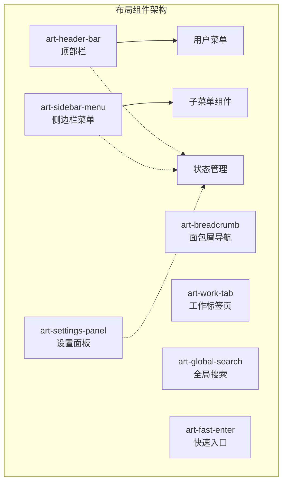
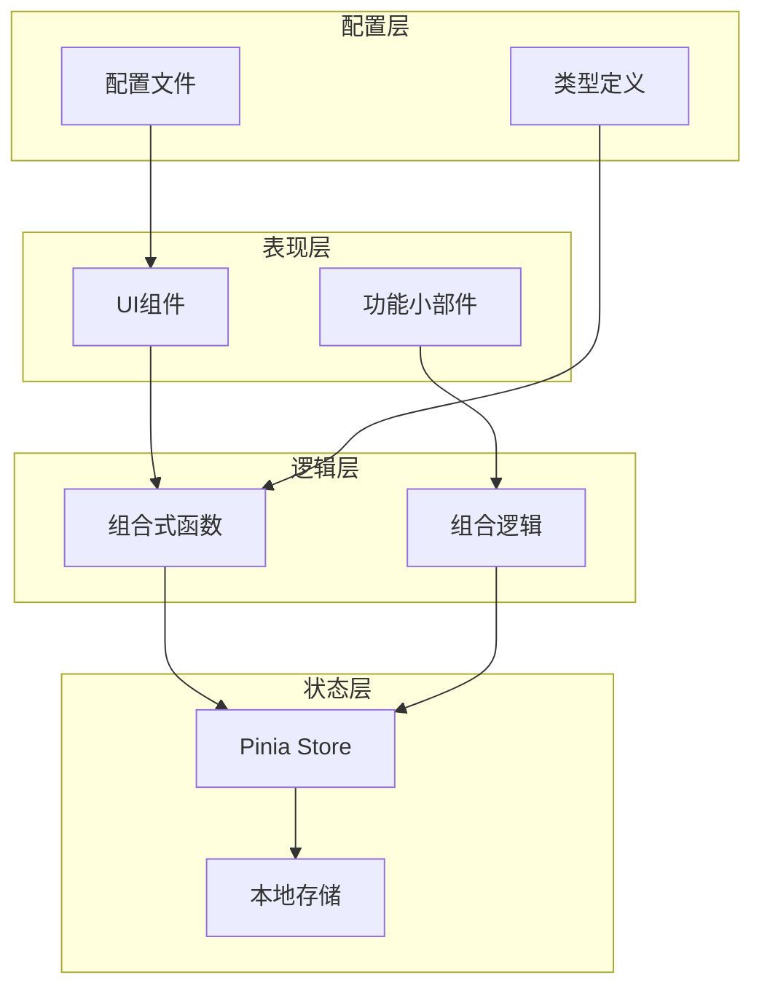
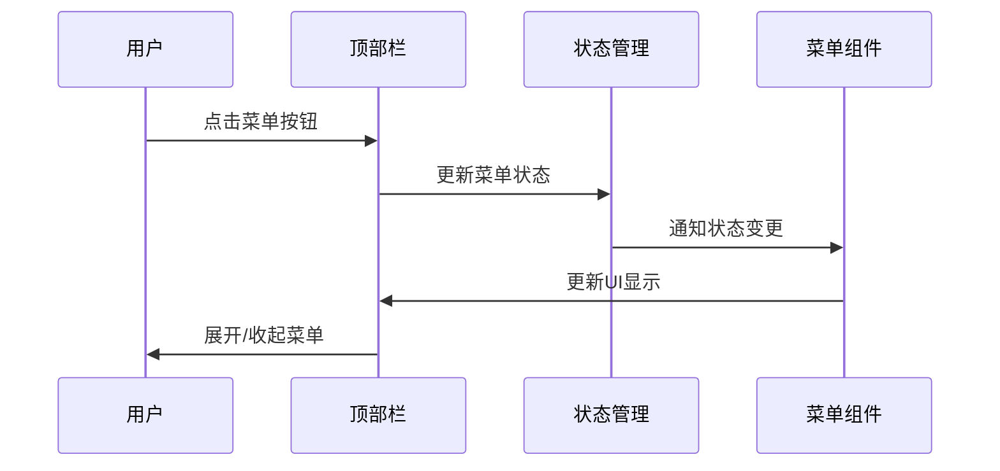
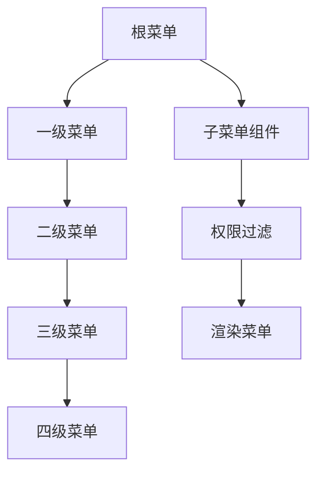
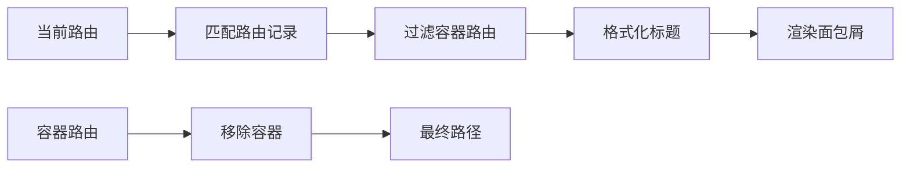
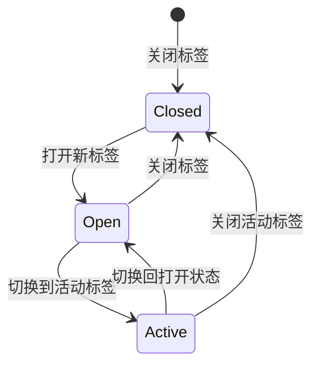
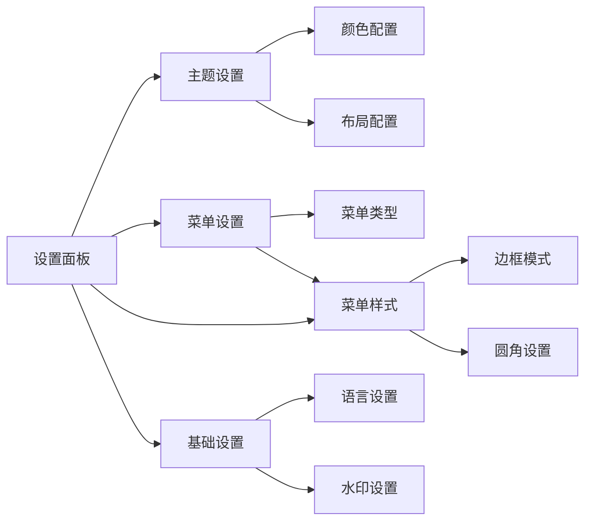
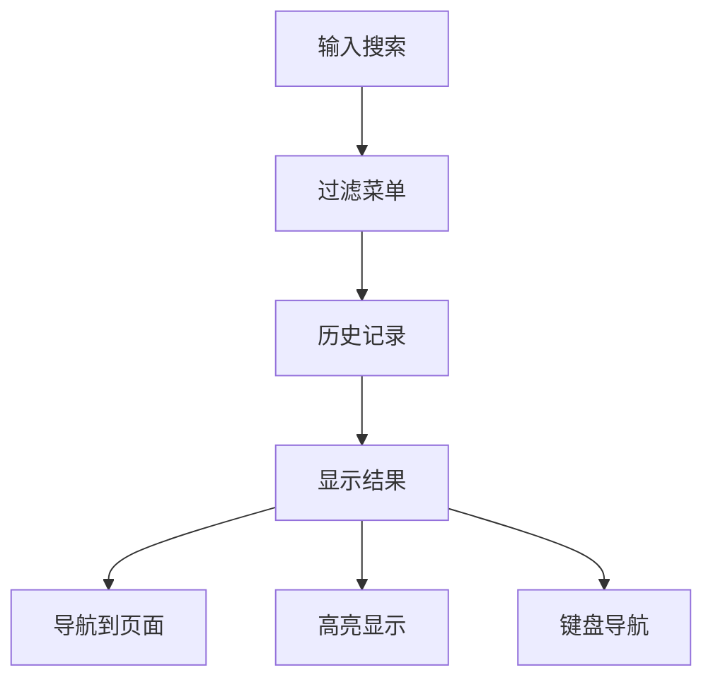
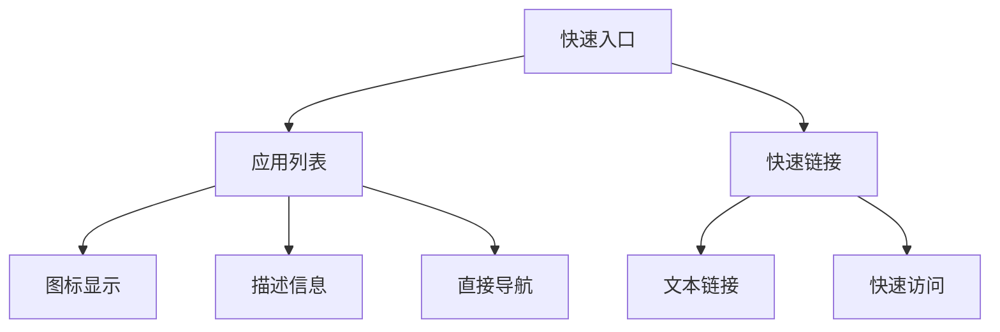
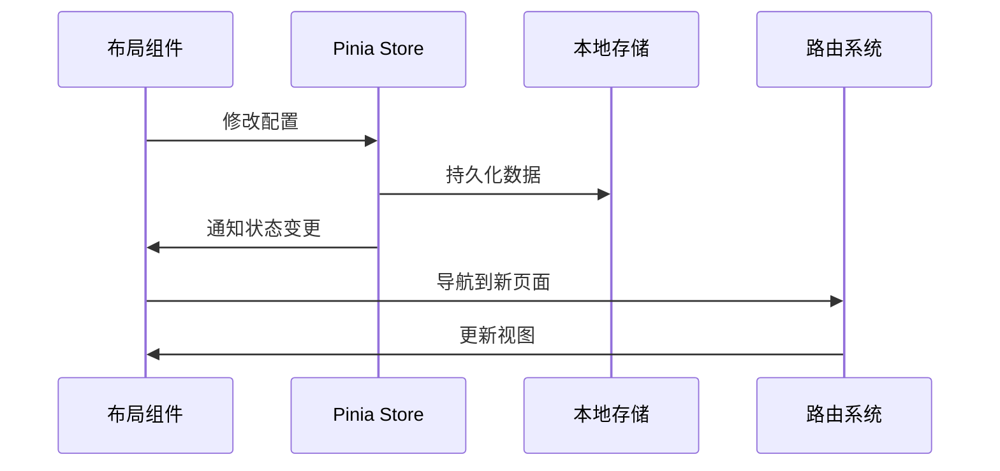

# 布局组件

<cite>
**本文档引用的文件**
- [art-header-bar/index.vue](file://src/components/core/layouts/art-header-bar/index.vue)
- [art-sidebar-menu/index.vue](file://src/components/core/layouts/art-sidebar-menu/index.vue)
- [art-breadcrumb/index.vue](file://src/components/core/layouts/art-breadcrumb/index.vue)
- [art-work-tab/index.vue](file://src/components/core/layouts/art-work-tab/index.vue)
- [art-settings-panel/index.vue](file://src/components/core/layouts/art-settings-panel/index.vue)
- [art-global-search/index.vue](file://src/components/core/layouts/art-global-search/index.vue)
- [art-fast-enter/index.vue](file://src/components/core/layouts/art-fast-enter/index.vue)
- [ArtUserMenu.vue](file://src/components/core/layouts/art-header-bar/widget/ArtUserMenu.vue)
- [SidebarSubmenu.vue](file://src/components/core/layouts/art-menus/art-sidebar-menu/widget/SidebarSubmenu.vue)
- [menu.ts](file://src/store/modules/menu.ts)
- [setting.ts](file://src/store/modules/setting.ts)
- [useHeaderBar.ts](file://src/hooks/core/useHeaderBar.ts)
- [useFastEnter.ts](file://src/hooks/core/useFastEnter.ts)
- [setting.ts](file://src/config/setting.ts)
- [index.ts](file://src/types/config/index.ts)
</cite>

## 目录
1. [概述](#概述)
2. [项目结构](#项目结构)
3. [核心布局组件](#核心布局组件)
4. [架构概览](#架构概览)
5. [详细组件分析](#详细组件分析)
6. [状态管理交互](#状态管理交互)
7. [响应式设计](#响应式设计)
8. [自定义集成指南](#自定义集成指南)
9. [总结](#总结)

## 概述

Art Design Pro 提供了一套完整的布局组件系统，采用模块化设计，支持多种菜单布局模式和丰富的个性化配置。该系统通过状态管理实现组件间的高效通信，提供了灵活的响应式布局能力和强大的配置扩展性。

## 项目结构

布局组件位于 `src/components/core/layouts/` 目录下，包含以下核心组件：

**图表来源**
- [art-header-bar/index.vue](file://src/components/core/layouts/art-header-bar/index.vue#L1-L50)
- [art-sidebar-menu/index.vue](file://src/components/core/layouts/art-sidebar-menu/index.vue#L1-L50)

## 核心布局组件

### 顶部栏组件 (art-header-bar)

顶部栏是整个应用的导航中枢，集成了多种功能模块：

- **系统信息展示**：显示系统名称和Logo
- **菜单控制**：提供菜单展开/收起功能
- **快速入口**：集成快速访问功能
- **面包屑导航**：显示当前页面路径
- **全局搜索**：提供快捷搜索功能
- **用户菜单**：集成用户信息和操作

### 侧边栏菜单组件 (art-sidebar-menu)

支持多种菜单布局模式：

- **左侧菜单**：传统的垂直菜单布局
- **顶部菜单**：水平菜单布局
- **混合菜单**：顶部+左侧组合布局
- **双列菜单**：左右分栏布局

### 面包屑导航 (art-breadcrumb)

智能路径导航系统：

- **自动路径生成**：基于路由结构自动生成导航路径
- **可点击导航**：支持点击返回上一级
- **权限过滤**：自动过滤无权限的导航项

### 工作标签页 (art-work-tab)

多标签页管理：

- **标签页切换**：支持多页面同时打开
- **拖拽排序**：支持标签页位置调整
- **右键菜单**：提供丰富的标签页操作
- **缓存策略**：智能缓存页面内容

**章节来源**
- [art-header-bar/index.vue](file://src/components/core/layouts/art-header-bar/index.vue#L1-L100)
- [art-sidebar-menu/index.vue](file://src/components/core/layouts/art-sidebar-menu/index.vue#L1-L100)
- [art-breadcrumb/index.vue](file://src/components/core/layouts/art-breadcrumb/index.vue#L1-L50)
- [art-work-tab/index.vue](file://src/components/core/layouts/art-work-tab/index.vue#L1-L100)

## 架构概览

布局组件系统采用分层架构设计，通过状态管理实现组件间解耦：

**图表来源**
- [menu.ts](file://src/store/modules/menu.ts#L1-L50)
- [setting.ts](file://src/store/modules/setting.ts#L1-L50)

## 详细组件分析

### art-header-bar 详细分析

#### 导航控制机制

顶部栏实现了复杂的导航控制逻辑：

**图表来源**
- [art-header-bar/index.vue](file://src/components/core/layouts/art-header-bar/index.vue#L245-L255)

#### 用户菜单集成

用户菜单提供了完整的用户管理功能：

- **头像显示**：显示用户头像和基本信息
- **功能入口**：集成个人中心、文档、GitHub等链接
- **安全功能**：提供锁屏和登出功能
- **响应式设计**：适配不同屏幕尺寸

#### 响应式行为

顶部栏具备完善的响应式能力：

- **屏幕宽度检测**：自动适应不同屏幕尺寸
- **功能优先级**：根据可用空间调整功能显示
- **动画效果**：提供流畅的过渡动画

**章节来源**
- [art-header-bar/index.vue](file://src/components/core/layouts/art-header-bar/index.vue#L170-L350)
- [ArtUserMenu.vue](file://src/components/core/layouts/art-header-bar/widget/ArtUserMenu.vue#L1-L100)

### art-sidebar-menu 详细分析

#### 多级菜单渲染

侧边栏菜单支持深度嵌套的菜单结构：

**图表来源**
- [SidebarSubmenu.vue](file://src/components/core/layouts/art-menus/art-sidebar-menu/widget/SidebarSubmenu.vue#L1-L50)

#### 折叠状态管理

菜单具备智能的折叠状态管理：

- **自动折叠**：根据屏幕宽度自动调整
- **状态持久化**：折叠状态保存到本地存储
- **动画过渡**：提供平滑的展开/收起动画

#### 权限过滤机制

菜单实现了细粒度的权限控制：

- **路由权限**：基于路由元信息进行权限判断
- **动态过滤**：运行时过滤无权限的菜单项
- **递归处理**：确保父菜单的完整性

**章节来源**
- [art-sidebar-menu/index.vue](file://src/components/core/layouts/art-sidebar-menu/index.vue#L130-L250)
- [SidebarSubmenu.vue](file://src/components/core/layouts/art-menus/art-sidebar-menu/widget/SidebarSubmenu.vue#L100-L189)

### art-breadcrumb 详细分析

#### 路由路径自动生成

面包屑导航实现了智能的路径生成逻辑：

**图表来源**
- [art-breadcrumb/index.vue](file://src/components/core/layouts/art-breadcrumb/index.vue#L50-L85)

#### 导航逻辑优化

面包屑提供了智能的导航体验：

- **点击导航**：支持点击返回上一级
- **路径优化**：自动处理容器路由和IFrame页面
- **权限感知**：只显示有权限的导航路径

**章节来源**
- [art-breadcrumb/index.vue](file://src/components/core/layouts/art-breadcrumb/index.vue#L115-L143)

### art-work-tab 详细分析

#### 多标签页管理

工作标签页提供了完整的多标签页管理功能：

**图表来源**
- [art-work-tab/index.vue](file://src/components/core/layouts/art-work-tab/index.vue#L370-L450)

#### 缓存策略

标签页实现了智能的缓存管理：

- **路由缓存**：基于路由路径的缓存策略
- **状态保持**：保持页面滚动位置和表单状态
- **内存优化**：自动清理长时间未使用的标签

#### 拖拽排序功能

支持灵活的标签页排序：

- **鼠标拖拽**：支持鼠标拖拽调整顺序
- **触摸手势**：移动端支持触摸手势操作
- **动画效果**：提供流畅的拖拽动画

**章节来源**
- [art-work-tab/index.vue](file://src/components/core/layouts/art-work-tab/index.vue#L220-L350)

### art-settings-panel 详细分析

#### 配置项组织

设置面板采用了模块化的配置组织方式：

**图表来源**
- [art-settings-panel/index.vue](file://src/components/core/layouts/art-settings-panel/index.vue#L1-L30)

#### 状态持久化

设置面板实现了完整的状态持久化：

- **本地存储**：配置信息保存到localStorage
- **版本兼容**：支持跨版本的数据迁移
- **默认恢复**：提供默认配置恢复功能

#### 实时预览功能

提供了即时的视觉反馈：

- **即时生效**：配置修改立即生效
- **预览模式**：支持配置预览功能
- **撤销恢复**：提供配置撤销功能

**章节来源**
- [art-settings-panel/index.vue](file://src/components/core/layouts/art-settings-panel/index.vue#L40-L73)

### art-global-search 详细分析

#### 快捷导航实现

全局搜索提供了高效的导航功能：

**图表来源**
- [art-global-search/index.vue](file://src/components/core/layouts/art-global-search/index.vue#L169-L200)

#### 智能搜索算法

搜索功能采用了智能的匹配算法：

- **模糊匹配**：支持部分匹配和拼音搜索
- **权重排序**：基于匹配程度和使用频率排序
- **历史记录**：保存用户的搜索历史

#### 键盘快捷键支持

提供了完整的键盘操作支持：

- **方向键导航**：支持上下选择菜单项
- **回车确认**：支持回车键确认选择
- **ESC退出**：支持ESC键快速退出

**章节来源**
- [art-global-search/index.vue](file://src/components/core/layouts/art-global-search/index.vue#L130-L200)

### art-fast-enter 详细分析

#### 入口配置

快速入口提供了便捷的功能访问：

**图表来源**
- [art-fast-enter/index.vue](file://src/components/core/layouts/art-fast-enter/index.vue#L20-L60)

#### 动态加载

支持灵活的配置和动态加载：

- **配置驱动**：基于配置文件动态生成入口
- **权限控制**：支持基于权限的入口显示
- **响应式布局**：根据屏幕宽度调整显示

**章节来源**
- [art-fast-enter/index.vue](file://src/components/core/layouts/art-fast-enter/index.vue#L70-L114)

## 状态管理交互

布局组件与状态管理系统的交互遵循统一的设计模式：

**图表来源**
- [menu.ts](file://src/store/modules/menu.ts#L40-L110)
- [setting.ts](file://src/store/modules/setting.ts#L40-L150)

### 菜单状态管理

菜单模块负责管理动态路由和菜单状态：

- **菜单列表管理**：存储和管理完整的菜单树结构
- **动态路由**：注册和移除动态路由
- **权限控制**：基于角色的菜单权限管理

### 设置状态管理

设置模块管理应用的各种配置：

- **主题配置**：管理主题颜色和样式
- **界面设置**：控制界面元素的显示状态
- **功能开关**：管理各种功能的启用状态

**章节来源**
- [menu.ts](file://src/store/modules/menu.ts#L40-L110)
- [setting.ts](file://src/store/modules/setting.ts#L40-L200)

## 响应式设计

布局组件具备完整的响应式设计能力：

### 断点管理

系统定义了标准的断点：

| 断点 | 屏幕宽度 | 适用场景 |
|------|----------|----------|
| Mobile | ≤ 768px | 移动设备 |
| Tablet | 768px - 1024px | 平板设备 |
| Desktop | > 1024px | 桌面设备 |

### 布局自适应

各组件具备智能的布局自适应能力：

- **菜单折叠**：根据屏幕宽度自动折叠菜单
- **功能隐藏**：在小屏幕上隐藏次要功能
- **紧凑布局**：在有限空间内优化布局密度

### 交互优化

针对不同设备优化交互体验：

- **触摸友好**：移动端提供更大的触摸目标
- **手势支持**：支持常见的手势操作
- **键盘导航**：提供完整的键盘操作支持

## 自定义集成指南

### 创建自定义布局组件

要创建新的布局组件，建议遵循以下步骤：

1. **继承基础样式**：使用现有的CSS变量和类名
2. **集成状态管理**：通过Pinia store获取必要的状态
3. **响应式处理**：使用VueUse提供的响应式工具
4. **权限控制**：集成权限验证机制

### 扩展菜单功能

可以通过以下方式扩展菜单功能：

1. **自定义菜单项**：添加新的菜单类型和渲染逻辑
2. **权限扩展**：实现更细粒度的权限控制
3. **动画定制**：自定义菜单展开/收起动画

### 配置系统集成

新功能的配置可以通过以下方式集成：

1. **配置文件扩展**：在配置文件中添加新的配置项
2. **类型定义**：在类型定义文件中添加新的接口
3. **状态管理**：在store中添加相应的状态管理逻辑

### 最佳实践

- **组件解耦**：保持组件的低耦合性
- **状态集中**：将状态管理集中在store中
- **配置外化**：将可配置项提取到配置文件
- **类型安全**：充分利用TypeScript的类型系统

## 总结

Art Design Pro 的布局组件系统提供了一个完整、灵活且可扩展的解决方案。通过模块化设计、状态管理和响应式支持，该系统能够满足各种复杂的应用需求。组件间的良好协作和清晰的职责分工，使得系统既易于维护又便于扩展。

主要特点包括：

- **模块化设计**：每个组件职责明确，易于维护和扩展
- **状态管理**：统一的状态管理机制确保组件间协调工作
- **响应式支持**：完整的响应式设计覆盖各种设备和屏幕尺寸
- **配置灵活**：丰富的配置选项支持个性化的定制需求
- **性能优化**：合理的缓存策略和渲染优化保证良好的用户体验

这套布局组件系统为开发者提供了一个坚实的基础，可以在此基础上构建更加复杂和功能丰富的应用界面。