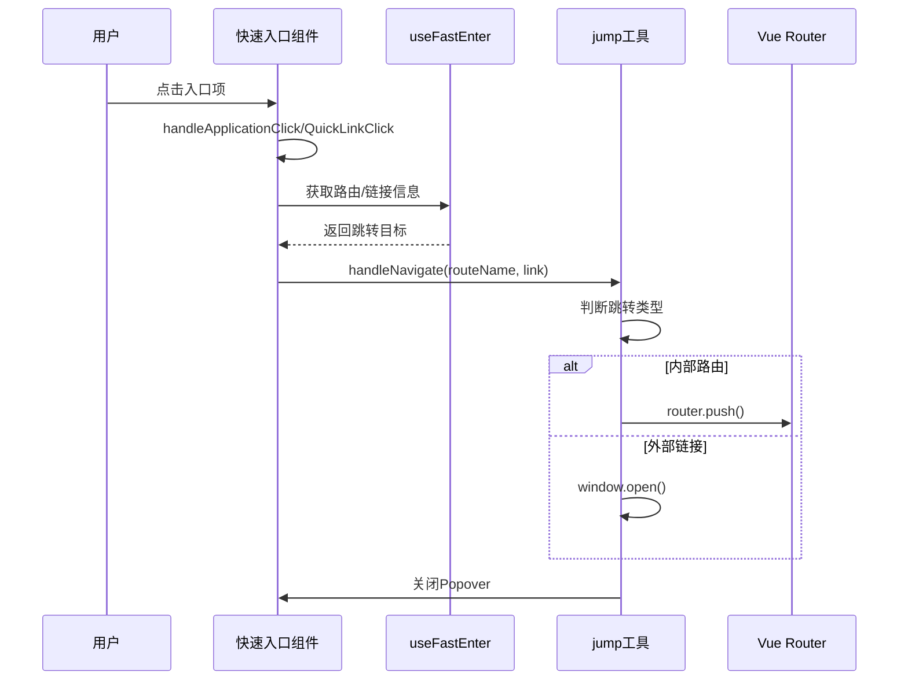

# 快速入口组件系统文档

<cite>
**本文档引用的文件**
- [src/components/core/layouts/art-fast-enter/index.vue](file://src/components/core/layouts/art-fast-enter/index.vue)
- [src/config/modules/fastEnter.ts](file://src/config/modules/fastEnter.ts)
- [src/hooks/core/useFastEnter.ts](file://src/hooks/core/useFastEnter.ts)
- [src/types/config/index.ts](file://src/types/config/index.ts)
- [src/utils/navigation/jump.ts](file://src/utils/navigation/jump.ts)
- [src/utils/constants/links.ts](file://src/utils/constants/links.ts)
- [src/config/index.ts](file://src/config/index.ts)
- [src/components/core/layouts/art-header-bar/index.vue](file://src/components/core/layouts/art-header-bar/index.vue)
</cite>

## 目录
1. [简介](#简介)
2. [项目结构](#项目结构)
3. [核心组件](#核心组件)
4. [架构概览](#架构概览)
5. [详细组件分析](#详细组件分析)
6. [配置系统](#配置系统)
7. [使用指南](#使用指南)
8. [扩展与定制](#扩展与定制)
9. [故障排除](#故障排除)
10. [总结](#总结)

## 简介

快速入口组件是Art Design Pro框架中的一个重要功能模块，它为用户提供了一个便捷的导航界面。该组件采用九宫格布局设计，支持应用列表和快速链接的展示，具备响应式布局、权限控制和动态配置等特性。

### 主要特性

- **九宫格布局**：采用网格布局展示应用和快速链接
- **响应式设计**：根据屏幕宽度自动调整显示状态
- **权限控制**：支持基于用户权限的入口显示控制
- **动态配置**：支持运行时修改入口配置
- **多种跳转方式**：支持内部路由跳转和外部链接打开

## 项目结构

快速入口组件的文件组织结构如下：


**图表来源**
- [src/components/core/layouts/art-fast-enter/index.vue](file://src/components/core/layouts/art-fast-enter/index.vue#L1-L114)
- [src/config/modules/fastEnter.ts](file://src/config/modules/fastEnter.ts#L1-L128)

## 核心组件

### 快速入口主组件

快速入口主组件负责渲染九宫格布局，包含应用列表和快速链接两个部分。组件采用Element Plus的Popover组件作为容器，提供悬停显示的效果。

### 状态管理钩子

`useFastEnter`钩子提供了快速入口的状态管理和配置解析功能，包括：
- 应用列表的启用状态过滤和排序
- 快速链接的启用状态过滤和排序
- 最小显示宽度配置

### 跳转工具函数

`jump.ts`提供了统一的导航跳转功能，支持：
- 内部路由跳转
- 外部链接打开
- iframe页面跳转
- 智能判断跳转目标类型

**章节来源**
- [src/components/core/layouts/art-fast-enter/index.vue](file://src/components/core/layouts/art-fast-enter/index.vue#L1-L114)
- [src/hooks/core/useFastEnter.ts](file://src/hooks/core/useFastEnter.ts#L1-L56)
- [src/utils/navigation/jump.ts](file://src/utils/navigation/jump.ts#L1-L63)

## 架构概览

快速入口组件采用分层架构设计，各层职责明确：


**图表来源**
- [src/components/core/layouts/art-fast-enter/index.vue](file://src/components/core/layouts/art-fast-enter/index.vue#L65-L113)
- [src/hooks/core/useFastEnter.ts](file://src/hooks/core/useFastEnter.ts#L22-L55)
- [src/config/modules/fastEnter.ts](file://src/config/modules/fastEnter.ts#L8-L127)

## 详细组件分析

### 快速入口组件实现

#### 组件结构分析

快速入口组件采用模板语法结合Vue 3的组合式API实现：


**图表来源**
- [src/components/core/layouts/art-fast-enter/index.vue](file://src/components/core/layouts/art-fast-enter/index.vue#L65-L113)
- [src/types/config/index.ts](file://src/types/config/index.ts#L90-L125)

#### 渲染逻辑分析

组件使用Grid布局实现九宫格效果：


**图表来源**
- [src/components/core/layouts/art-fast-enter/index.vue](file://src/components/core/layouts/art-fast-enter/index.vue#L26-L58)
- [src/hooks/core/useFastEnter.ts](file://src/hooks/core/useFastEnter.ts#L26-L47)

#### 点击事件处理

点击事件通过统一的导航处理函数实现：



**图表来源**
- [src/components/core/layouts/art-fast-enter/index.vue](file://src/components/core/layouts/art-fast-enter/index.vue#L77-L96)
- [src/utils/navigation/jump.ts](file://src/utils/navigation/jump.ts#L25-L62)

**章节来源**
- [src/components/core/layouts/art-fast-enter/index.vue](file://src/components/core/layouts/art-fast-enter/index.vue#L1-L114)
- [src/hooks/core/useFastEnter.ts](file://src/hooks/core/useFastEnter.ts#L1-L56)

## 配置系统

### 配置文件结构

快速入口配置采用模块化设计，支持灵活的配置管理：

| 配置项 | 类型 | 描述 | 默认值 |
|--------|------|------|--------|
| minWidth | number | 最小显示宽度 | 1200 |
| applications | FastEnterApplication[] | 应用列表配置 | 包含8个内置应用 |
| quickLinks | FastEnterQuickLink[] | 快速链接配置 | 包含6个常用链接 |

### 应用配置项详解

每个应用配置包含以下属性：

| 属性 | 类型 | 必填 | 描述 |
|------|------|------|------|
| name | string | 是 | 应用名称 |
| description | string | 是 | 应用描述 |
| icon | string | 是 | 图标标识符 |
| iconColor | string | 是 | 图标颜色 |
| enabled | boolean | 否 | 是否启用 |
| order | number | 否 | 排序权重 |
| routeName | string | 否 | 路由名称 |
| link | string | 否 | 外部链接 |

### 快速链接配置

快速链接配置相对简化，主要包含基本的导航信息：

| 属性 | 类型 | 必填 | 描述 |
|------|------|------|------|
| name | string | 是 | 链接名称 |
| enabled | boolean | 否 | 是否启用 |
| order | number | 否 | 排序权重 |
| routeName | string | 否 | 路由名称 |
| link | string | 否 | 外部链接 |

**章节来源**
- [src/config/modules/fastEnter.ts](file://src/config/modules/fastEnter.ts#L1-L128)
- [src/types/config/index.ts](file://src/types/config/index.ts#L90-L125)

## 使用指南

### 基础配置

在`fastEnter.ts`配置文件中定义快速入口的基本信息：

```typescript
// 基本配置结构
const fastEnterConfig: FastEnterConfig = {
  minWidth: 1200,
  applications: [...],
  quickLinks: [...]
}
```

### 添加自定义应用

要添加新的应用入口，需要在applications数组中添加配置：

```typescript
// 示例：添加新的应用配置
{
  name: '我的应用',
  description: '应用功能描述',
  icon: 'ri:custom-icon',
  iconColor: '#377dff',
  enabled: true,
  order: 9,
  routeName: 'MyCustomRoute'
}
```

### 添加外部链接

对于需要打开外部网站的链接，可以使用link属性：

```typescript
// 示例：添加外部链接
{
  name: 'GitHub仓库',
  description: '项目源码地址',
  icon: 'ri:github-line',
  iconColor: '#000000',
  enabled: true,
  order: 10,
  link: 'https://github.com/your-project'
}
```

### 权限控制

通过enabled属性控制入口的显示状态：

```typescript
// 示例：基于权限的显示控制
{
  name: '管理员功能',
  description: '仅管理员可见',
  icon: 'ri:admin-line',
  iconColor: '#ff0000',
  enabled: isAdmin(), // 动态判断权限
  order: 11,
  routeName: 'AdminDashboard'
}
```

### 响应式配置

通过minWidth属性控制组件的显示条件：

```typescript
// 示例：调整显示宽度
minWidth: 1024, // 在1024px以上才显示
```

**章节来源**
- [src/config/modules/fastEnter.ts](file://src/config/modules/fastEnter.ts#L8-L127)

## 扩展与定制

### 自定义图标

支持使用各种图标库，推荐使用Remix Icon：

```typescript
// 支持的图标格式
icon: 'ri:pie-chart-line'    // Remix Icon
icon: 'mdi:home'             // Material Design Icons
icon: 'ant-design:home-outlined' // Ant Design Icons
```

### 动态更新入口列表

通过修改配置文件实现动态更新：

```typescript
// 运行时修改配置示例
import appConfig from '@/config'

// 添加新的应用
appConfig.fastEnter.applications.push({
  name: '新功能',
  description: '功能说明',
  icon: 'ri:new-feature',
  iconColor: '#4CAF50',
  enabled: true,
  order: 100,
  routeName: 'NewFeature'
})
```

### 集成自定义动作

虽然快速入口主要用于导航，但可以通过路由拦截器实现更复杂的动作：

```typescript
// 示例：集成弹窗功能
{
  name: '创建任务',
  description: '新建工作任务',
  icon: 'ri:add-line',
  iconColor: '#2196F3',
  enabled: true,
  order: 101,
  routeName: 'CreateTask' // 路由会触发弹窗显示
}
```

### 主题定制

通过CSS变量系统实现主题定制：

```css
/* 自定义快速入口样式 */
.fast-enter-popover {
  --fast-enter-bg: var(--el-bg-color);
  --fast-enter-hover: var(--el-hover-color);
}

.grid .app-icon {
  background: var(--fast-enter-bg);
  transition: background-color 0.3s;
}

.grid .app-icon:hover {
  background: var(--fast-enter-hover);
}
```

**章节来源**
- [src/config/modules/fastEnter.ts](file://src/config/modules/fastEnter.ts#L127-L128)
- [src/components/core/layouts/art-fast-enter/index.vue](file://src/components/core/layouts/art-fast-enter/index.vue#L22-L58)

## 故障排除

### 常见问题及解决方案

#### 1. 快速入口不显示

**问题描述**：快速入口组件没有出现在界面上

**可能原因**：
- 屏幕宽度小于minWidth配置
- 组件未正确引入
- 配置文件加载失败

**解决方案**：
```typescript
// 检查配置
console.log(appConfig.fastEnter)

// 调整显示条件
minWidth: 900, // 减小显示宽度
```

#### 2. 跳转功能异常

**问题描述**：点击入口后无法正常跳转

**可能原因**：
- 路由名称不存在
- 外部链接格式错误
- 跳转工具函数异常

**解决方案**：
```typescript
// 检查路由配置
import { router } from '@/router'
console.log(router.getRoutes().map(r => r.name))

// 验证链接格式
const isValidUrl = (url: string) => {
  try {
    new URL(url)
    return true
  } catch {
    return false
  }
}
```

#### 3. 图标显示异常

**问题描述**：图标无法正常显示

**可能原因**：
- 图标库未正确安装
- 图标名称拼写错误
- 图标库版本不兼容

**解决方案**：
```typescript
// 检查可用图标
import { getIconDefinition } from '@iconify/vue'
const iconDef = getIconDefinition('ri', 'pie-chart-line')
console.log(iconDef)
```

#### 4. 权限控制失效

**问题描述**：enabled属性不起作用

**可能原因**：
- 计算属性缓存问题
- 权限判断逻辑错误
- 配置更新未触发重新渲染

**解决方案**：
```typescript
// 强制重新计算
import { useFastEnter } from '@/hooks/core/useFastEnter'
const { enabledApplications } = useFastEnter()

// 监听配置变化
watch(() => appConfig.fastEnter, () => {
  // 触发重新渲染
})
```

### 性能优化建议

#### 1. 配置懒加载

对于大型应用，可以考虑按需加载配置：

```typescript
// 示例：动态导入配置
const loadFastEnterConfig = async () => {
  const module = await import('@/config/modules/fastEnter')
  return module.default
}
```

#### 2. 图标优化

使用图标字体而非图片，减少资源加载：

```typescript
// 推荐：使用矢量图标
icon: 'ri:custom-icon' // 而不是 'images/custom-icon.png'
```

#### 3. 渲染优化

对于大量入口项，考虑虚拟滚动：

```typescript
// 示例：分页显示
const pageSize = 12
const currentPage = ref(1)
const paginatedItems = computed(() => {
  const start = (currentPage.value - 1) * pageSize
  const end = start + pageSize
  return items.value.slice(start, end)
})
```

**章节来源**
- [src/hooks/core/useFastEnter.ts](file://src/hooks/core/useFastEnter.ts#L26-L47)
- [src/utils/navigation/jump.ts](file://src/utils/navigation/jump.ts#L25-L62)

## 总结

快速入口组件是Art Design Pro框架中的重要导航工具，具有以下特点：

### 核心优势

1. **灵活配置**：支持应用列表和快速链接的灵活配置
2. **响应式设计**：智能适应不同屏幕尺寸
3. **权限控制**：支持基于权限的入口显示控制
4. **易于扩展**：提供清晰的扩展接口
5. **性能优化**：采用计算属性和响应式设计

### 最佳实践

1. **合理规划入口数量**：避免过多入口导致视觉混乱
2. **清晰的图标选择**：使用直观易懂的图标标识
3. **适当的排序**：按照用户使用频率排序
4. **及时更新配置**：定期检查和更新入口配置
5. **测试多场景**：确保在不同设备和分辨率下正常工作

### 发展方向

随着应用复杂度的增加，快速入口组件可以进一步扩展：
- 支持分类显示
- 增加搜索功能
- 实现个性化推荐
- 集成更多交互功能
- 优化移动端体验

通过合理的配置和使用，快速入口组件能够显著提升用户体验和应用的易用性。