# 设置面板架构与实时预览功能深度解析

<cite>
**本文档引用的文件**
- [src/components/core/layouts/art-settings-panel/index.vue](file://src/components/core/layouts/art-settings-panel/index.vue)
- [src/store/modules/setting.ts](file://src/store/modules/setting.ts)
- [src/config/setting.ts](file://src/config/setting.ts)
- [src/hooks/core/useTheme.ts](file://src/hooks/core/useTheme.ts)
- [src/components/core/layouts/art-settings-panel/composables/useSettingsPanel.ts](file://src/components/core/layouts/art-settings-panel/composables/useSettingsPanel.ts)
- [src/components/core/layouts/art-settings-panel/composables/useSettingsState.ts](file://src/components/core/layouts/art-settings-panel/composables/useSettingsState.ts)
- [src/components/core/layouts/art-settings-panel/composables/useSettingsHandlers.ts](file://src/components/core/layouts/art-settings-panel/composables/useSettingsHandlers.ts)
- [src/components/core/layouts/art-settings-panel/composables/useSettingsConfig.ts](file://src/components/core/layouts/art-settings-panel/composables/useSettingsConfig.ts)
- [src/components/core/layouts/art-settings-panel/widget/SettingDrawer.vue](file://src/components/core/layouts/art-settings-panel/widget/SettingDrawer.vue)
- [src/components/core/layouts/art-settings-panel/widget/SettingActions.vue](file://src/components/core/layouts/art-settings-panel/widget/SettingActions.vue)
- [src/components/core/layouts/art-settings-panel/widget/BasicSettings.vue](file://src/components/core/layouts/art-settings-panel/widget/BasicSettings.vue)
- [src/components/core/layouts/art-settings-panel/widget/ThemeSettings.vue](file://src/components/core/layouts/art-settings-panel/widget/ThemeSettings.vue)
- [src/components/core/layouts/art-settings-panel/widget/SettingItem.vue](file://src/components/core/layouts/art-settings-panel/widget/SettingItem.vue)
- [src/utils/ui/colors.ts](file://src/utils/ui/colors.ts)
- [src/assets/styles/core/theme-change.scss](file://src/assets/styles/core/theme-change.scss)
</cite>

## 目录
1. [引言](#引言)
2. [项目架构概览](#项目架构概览)
3. [模块化设计分析](#模块化设计分析)
4. [实时预览功能实现](#实时预览功能实现)
5. [composables状态管理](#composables状态管理)
6. [主题系统与CSS变量](#主题系统与css变量)
7. [配置持久化机制](#配置持久化机制)
8. [自定义设置项开发指南](#自定义设置项开发指南)
9. [性能优化策略](#性能优化策略)
10. [故障排除指南](#故障排除指南)
11. [总结](#总结)

## 引言

Art Design Pro的设置面板是一个高度模块化的系统，提供了完整的界面定制功能，包括主题色、布局模式、动画效果等配置项。该系统采用Vue 3 Composition API设计，通过composables模式实现了状态管理、事件处理和UI渲染的清晰分离，同时提供了实时预览功能，让用户能够即时看到配置更改的效果。

## 项目架构概览

设置面板的整体架构采用了分层设计模式，主要包含以下几个层次：

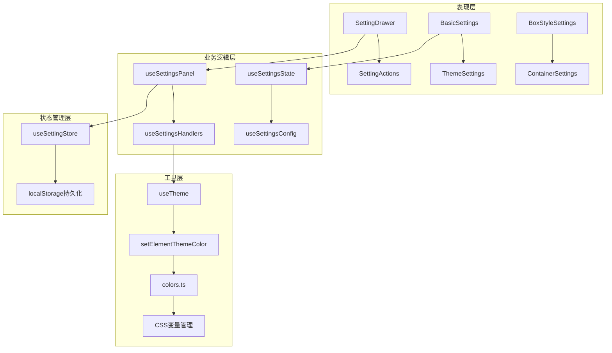

**图表来源**
- [src/components/core/layouts/art-settings-panel/index.vue](file://src/components/core/layouts/art-settings-panel/index.vue#L1-L50)
- [src/components/core/layouts/art-settings-panel/composables/useSettingsPanel.ts](file://src/components/core/layouts/art-settings-panel/composables/useSettingsPanel.ts#L1-L50)

**章节来源**
- [src/components/core/layouts/art-settings-panel/index.vue](file://src/components/core/layouts/art-settings-panel/index.vue#L1-L100)
- [src/store/modules/setting.ts](file://src/store/modules/setting.ts#L1-L100)

## 模块化设计分析

### 组件层次结构

设置面板采用组件化架构，每个配置区域都有独立的组件负责：

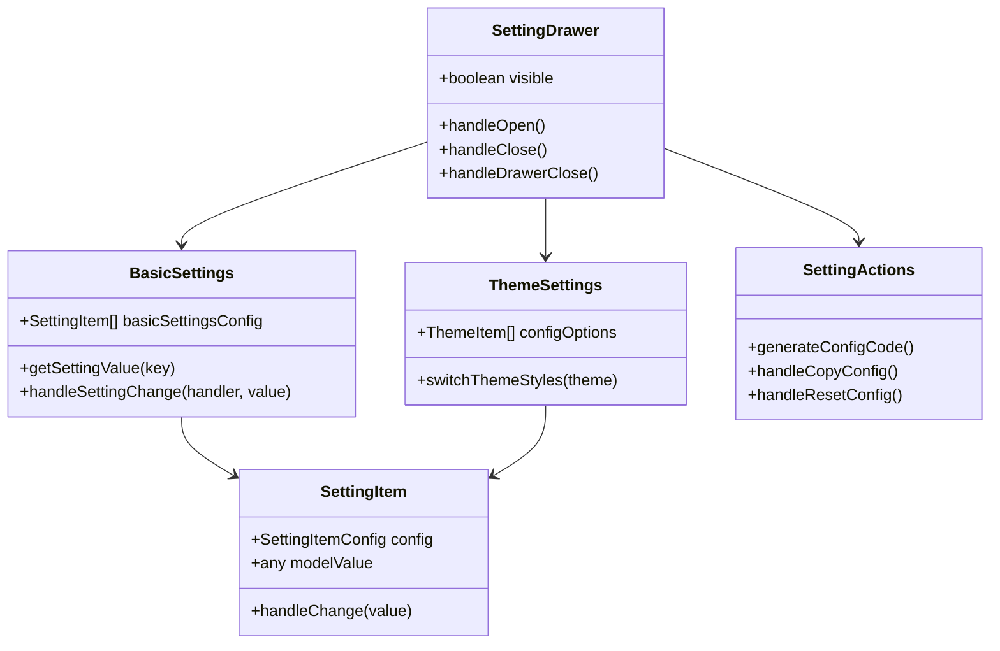

**图表来源**
- [src/components/core/layouts/art-settings-panel/widget/SettingDrawer.vue](file://src/components/core/layouts/art-settings-panel/widget/SettingDrawer.vue#L1-L52)
- [src/components/core/layouts/art-settings-panel/widget/BasicSettings.vue](file://src/components/core/layouts/art-settings-panel/widget/BasicSettings.vue#L1-L78)
- [src/components/core/layouts/art-settings-panel/widget/ThemeSettings.vue](file://src/components/core/layouts/art-settings-panel/widget/ThemeSettings.vue#L1-L29)

### 配置项分类体系

系统将设置项按照功能分为多个类别：

| 配置类别 | 包含项目 | 实现方式 |
|---------|---------|---------|
| 基础设置 | 工作台标签、面包屑、语言切换等 | Switch开关组件 |
| 主题设置 | 系统主题、菜单主题、主题色 | 下拉选择+图标预览 |
| 样式设置 | 边框模式、圆角大小、容器宽度 | Select选择器 |
| 功能设置 | 手风琴模式、色弱模式、水印 | 复合开关组合 |

**章节来源**
- [src/components/core/layouts/art-settings-panel/composables/useSettingsConfig.ts](file://src/components/core/layouts/art-settings-panel/composables/useSettingsConfig.ts#L1-L249)
- [src/components/core/layouts/art-settings-panel/widget/BasicSettings.vue](file://src/components/core/layouts/art-settings-panel/widget/BasicSettings.vue#L1-L78)

## 实时预览功能实现

### 实时预览机制

设置面板通过多层次的监听机制实现实时预览：

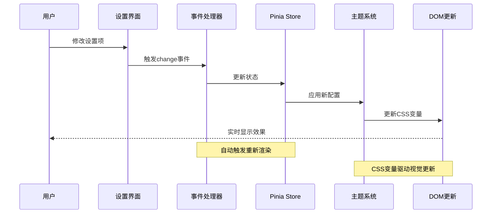

**图表来源**
- [src/components/core/layouts/art-settings-panel/composables/useSettingsHandlers.ts](file://src/components/core/layouts/art-settings-panel/composables/useSettingsHandlers.ts#L1-L168)
- [src/hooks/core/useTheme.ts](file://src/hooks/core/useTheme.ts#L1-L175)

### 过渡效果优化

为了防止主题切换时的闪烁问题，系统实现了智能的过渡效果管理：

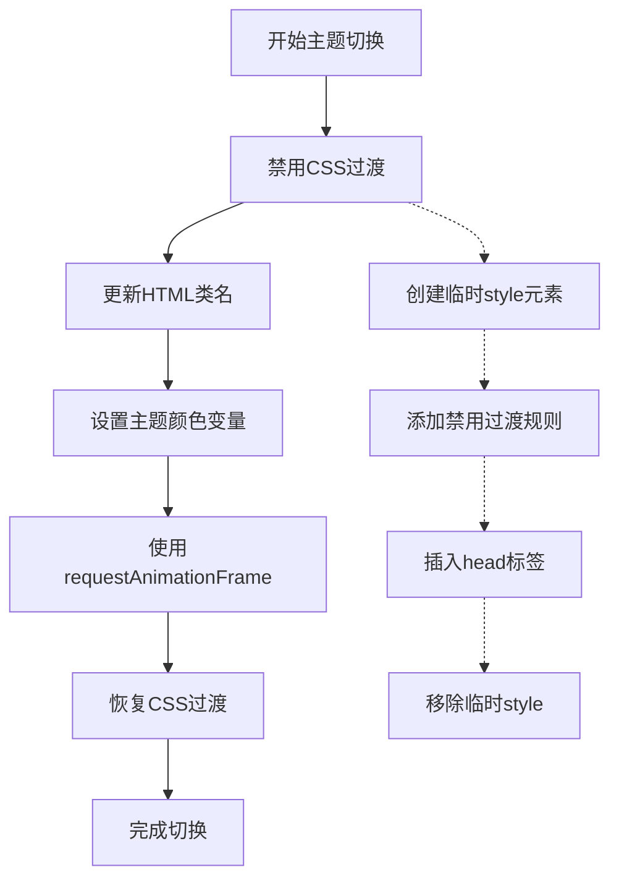

**图表来源**
- [src/hooks/core/useTheme.ts](file://src/hooks/core/useTheme.ts#L45-L98)
- [src/assets/styles/core/theme-change.scss](file://src/assets/styles/core/theme-change.scss#L1-L12)

**章节来源**
- [src/hooks/core/useTheme.ts](file://src/hooks/core/useTheme.ts#L42-L98)
- [src/assets/styles/core/theme-change.scss](file://src/assets/styles/core/theme-change.scss#L1-L12)

## composables状态管理

### useSettingsPanel核心控制器

`useSettingsPanel`作为设置面板的核心控制器，整合了所有子功能：

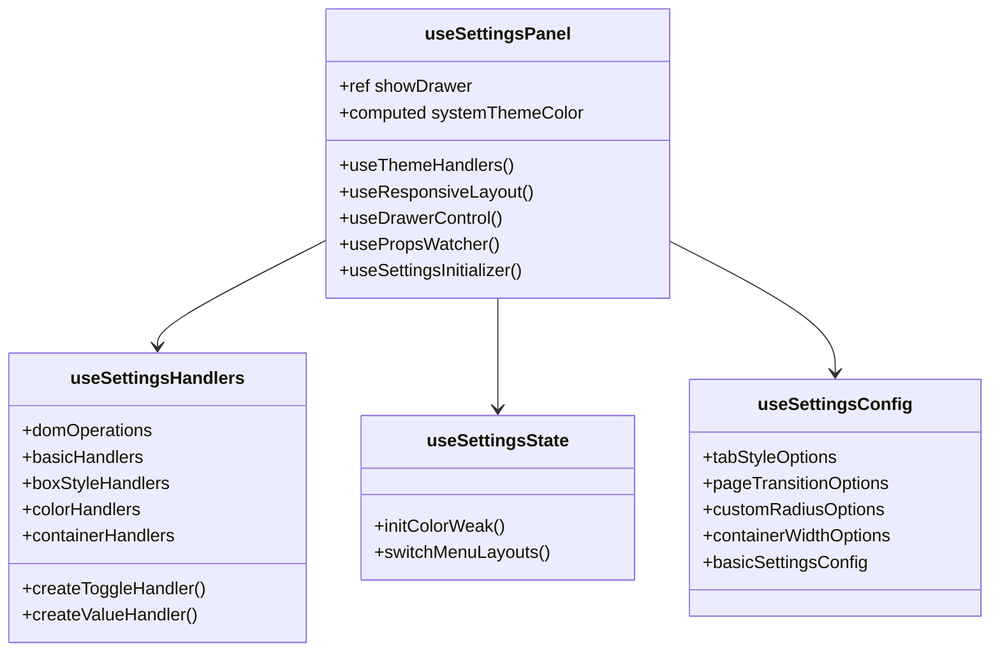

**图表来源**
- [src/components/core/layouts/art-settings-panel/composables/useSettingsPanel.ts](file://src/components/core/layouts/art-settings-panel/composables/useSettingsPanel.ts#L1-L193)
- [src/components/core/layouts/art-settings-panel/composables/useSettingsHandlers.ts](file://src/components/core/layouts/art-settings-panel/composables/useSettingsHandlers.ts#L1-L168)

### 状态同步机制

系统通过Pinia store实现了全局状态管理：

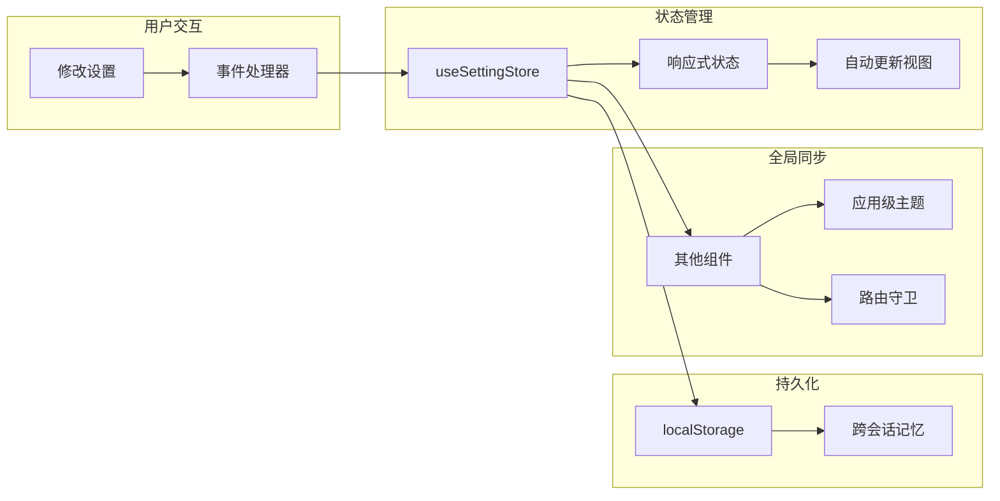

**图表来源**
- [src/store/modules/setting.ts](file://src/store/modules/setting.ts#L1-L451)

**章节来源**
- [src/components/core/layouts/art-settings-panel/composables/useSettingsPanel.ts](file://src/components/core/layouts/art-settings-panel/composables/useSettingsPanel.ts#L1-L193)
- [src/components/core/layouts/art-settings-panel/composables/useSettingsHandlers.ts](file://src/components/core/layouts/art-settings-panel/composables/useSettingsHandlers.ts#L1-L168)

## 主题系统与CSS变量

### CSS变量架构

系统采用CSS自定义属性实现主题切换：

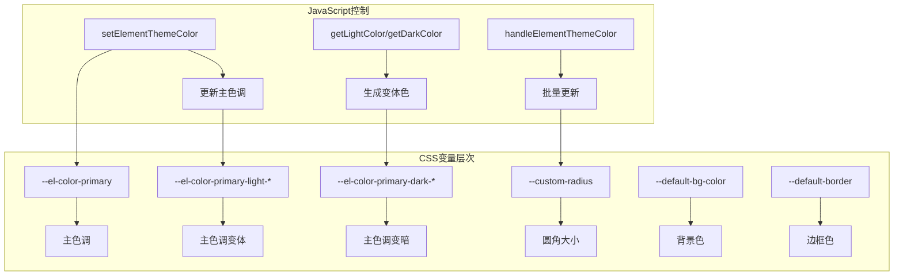

**图表来源**
- [src/utils/ui/colors.ts](file://src/utils/ui/colors.ts#L1-L274)
- [src/hooks/core/useTheme.ts](file://src/hooks/core/useTheme.ts#L80-L90)

### 主题切换流程

主题切换过程涉及多个层面的协调：

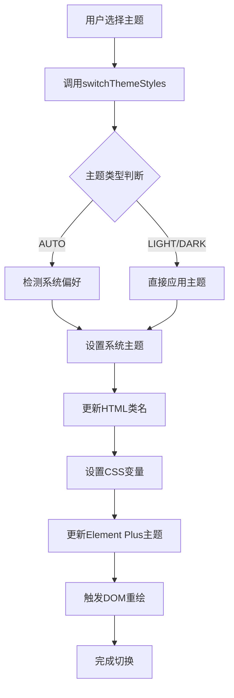

**图表来源**
- [src/hooks/core/useTheme.ts](file://src/hooks/core/useTheme.ts#L110-L122)

**章节来源**
- [src/hooks/core/useTheme.ts](file://src/hooks/core/useTheme.ts#L1-L175)
- [src/utils/ui/colors.ts](file://src/utils/ui/colors.ts#L1-L274)

## 配置持久化机制

### 存储策略

系统采用localStorage进行配置持久化：

| 存储键 | 类型 | 描述 |
|-------|------|------|
| setting | Object | 完整设置对象 |
| sys-v{version}-setting | String | 版本化配置数据 |

### 初始化流程

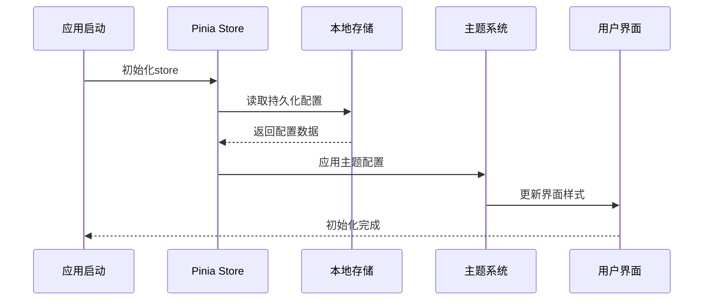

**图表来源**
- [src/store/modules/setting.ts](file://src/store/modules/setting.ts#L445-L449)

**章节来源**
- [src/store/modules/setting.ts](file://src/store/modules/setting.ts#L445-L449)
- [src/config/setting.ts](file://src/config/setting.ts#L1-L110)

## 自定义设置项开发指南

### 添加新的设置项

要添加新的设置项，需要遵循以下步骤：

1. **在配置文件中定义默认值**
2. **在store中添加状态**
3. **在composables中添加处理逻辑**
4. **在UI组件中添加配置项**

### 示例：添加自定义颜色设置

```typescript
// 1. 在配置文件中添加
export const SETTING_DEFAULT_CONFIG = {
  customAccentColor: '#ff6b6b'
}

// 2. 在store中添加
const customAccentColor = ref(SETTING_DEFAULT_CONFIG.customAccentColor)

// 3. 在composables中添加处理器
const colorHandlers = {
  setCustomAccent: (color: string) => {
    settingStore.setCustomAccentColor(color)
    document.documentElement.style.setProperty('--custom-accent', color)
  }
}

// 4. 在UI组件中添加配置项
{
  key: 'customAccentColor',
  label: '自定义强调色',
  type: 'color',
  handler: 'customAccent',
  headerBarKey: null
}
```

### UI组件注册规范

设置项组件需要遵循统一的接口规范：

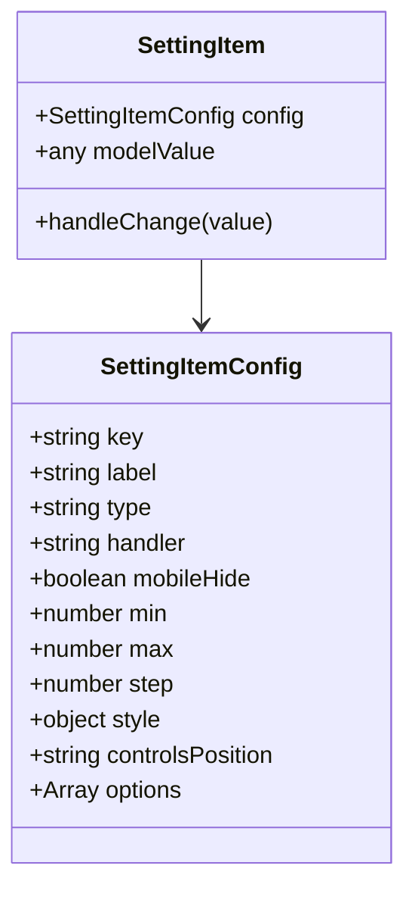

**图表来源**
- [src/components/core/layouts/art-settings-panel/widget/SettingItem.vue](file://src/components/core/layouts/art-settings-panel/widget/SettingItem.vue#L40-L54)

**章节来源**
- [src/components/core/layouts/art-settings-panel/composables/useSettingsConfig.ts](file://src/components/core/layouts/art-settings-panel/composables/useSettingsConfig.ts#L102-L234)
- [src/components/core/layouts/art-settings-panel/widget/SettingItem.vue](file://src/components/core/layouts/art-settings-panel/widget/SettingItem.vue#L1-L102)

## 性能优化策略

### 响应式优化

系统采用多种策略优化性能：

1. **使用VueUse的响应式工具**：`useBreakpoints`用于媒体查询监听
2. **懒加载组件**：抽屉组件按需加载
3. **防抖处理**：复杂计算使用防抖
4. **内存管理**：及时清理事件监听器

### 渲染优化

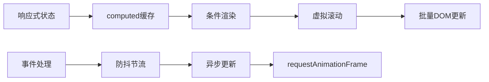

**图表来源**
- [src/components/core/layouts/art-settings-panel/composables/useSettingsPanel.ts](file://src/components/core/layouts/art-settings-panel/composables/useSettingsPanel.ts#L30-L32)

**章节来源**
- [src/components/core/layouts/art-settings-panel/composables/useSettingsPanel.ts](file://src/components/core/layouts/art-settings-panel/composables/useSettingsPanel.ts#L30-L32)

## 故障排除指南

### 常见问题及解决方案

| 问题类型 | 症状 | 解决方案 |
|---------|------|---------|
| 主题不生效 | 更改主题后界面无变化 | 检查CSS变量是否正确设置 |
| 配置丢失 | 刷新页面后设置重置 | 检查localStorage权限 |
| 性能问题 | 设置面板响应缓慢 | 检查是否有过多的watch监听 |
| 样式冲突 | 自定义样式被覆盖 | 检查CSS优先级和作用域 |

### 调试技巧

1. **使用浏览器开发者工具**：监控CSS变量变化
2. **Vue DevTools**：检查store状态
3. **Console调试**：查看错误日志
4. **网络面板**：检查资源加载

**章节来源**
- [src/components/core/layouts/art-settings-panel/widget/SettingActions.vue](file://src/components/core/layouts/art-settings-panel/widget/SettingActions.vue#L130-L235)

## 总结

Art Design Pro的设置面板展现了现代前端应用的最佳实践，通过模块化设计、composables模式和实时预览功能，为用户提供了强大而灵活的界面定制能力。系统的架构设计不仅保证了良好的用户体验，也为后续的功能扩展奠定了坚实的基础。

关键特性包括：
- **模块化架构**：清晰的职责分离和可维护性
- **实时预览**：即时反馈提升用户体验
- **状态管理**：统一的状态管理和持久化
- **性能优化**：智能的渲染和内存管理
- **扩展性**：易于添加新的设置项和功能

这套设计模式可以作为其他前端项目的参考，特别是在需要提供丰富配置选项的应用中。