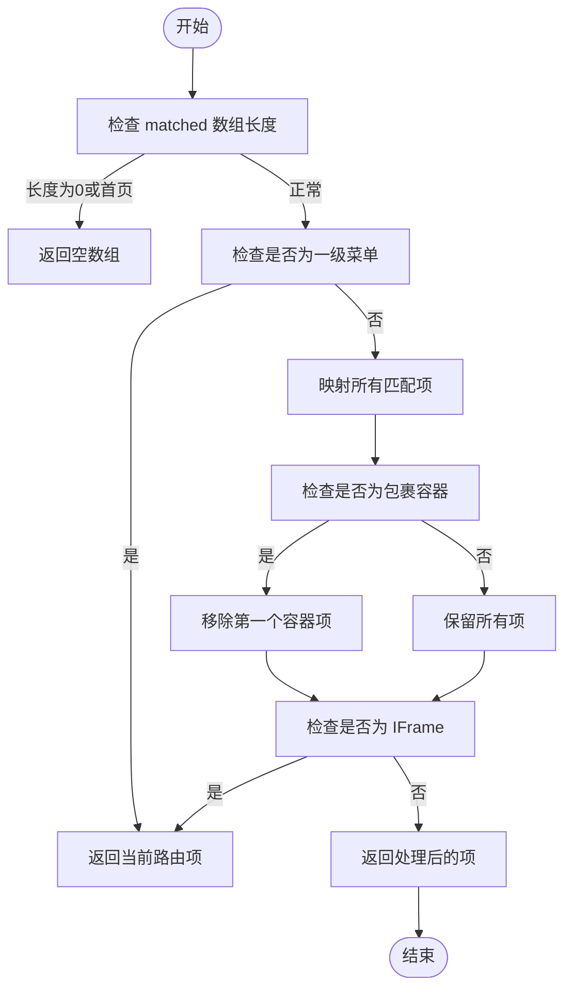
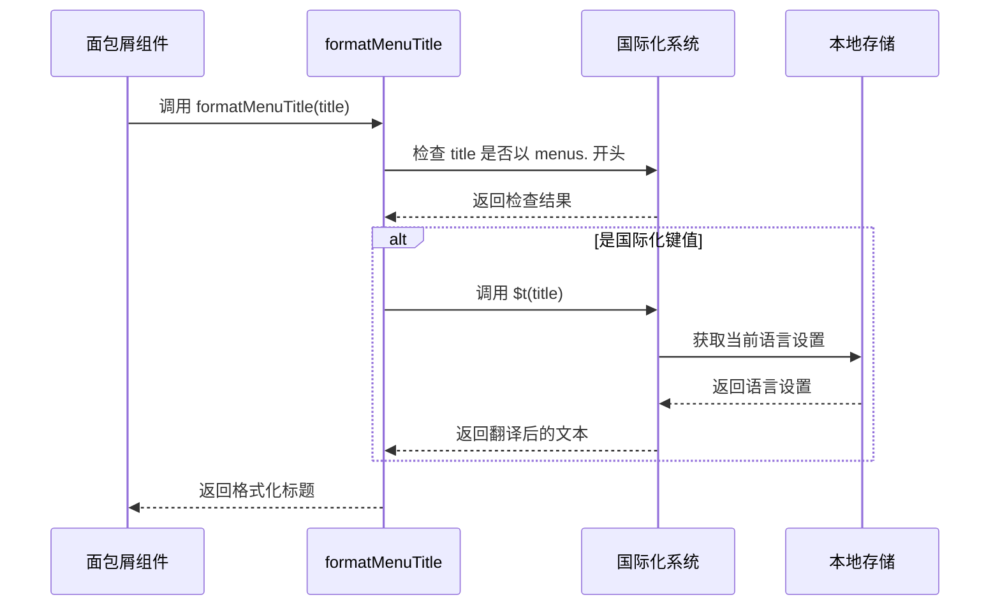
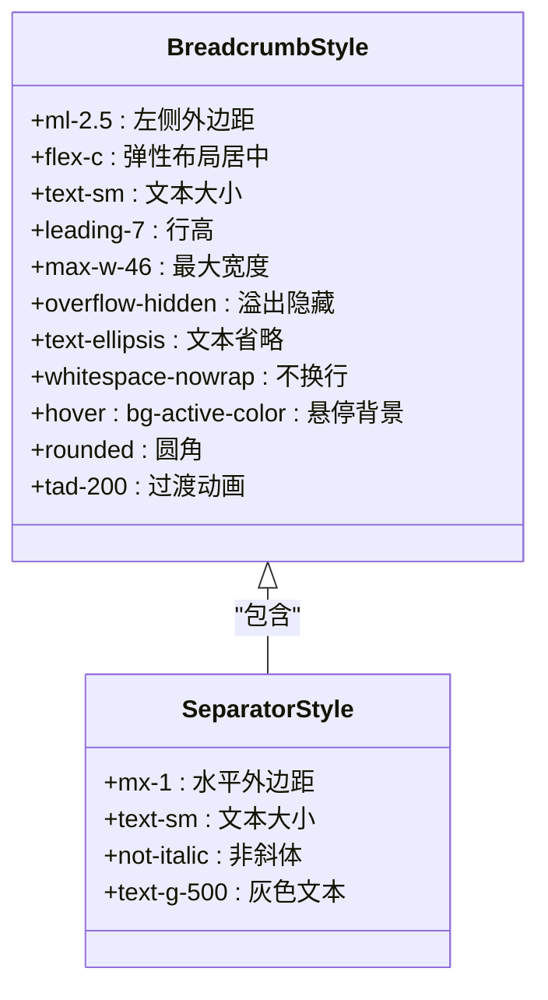
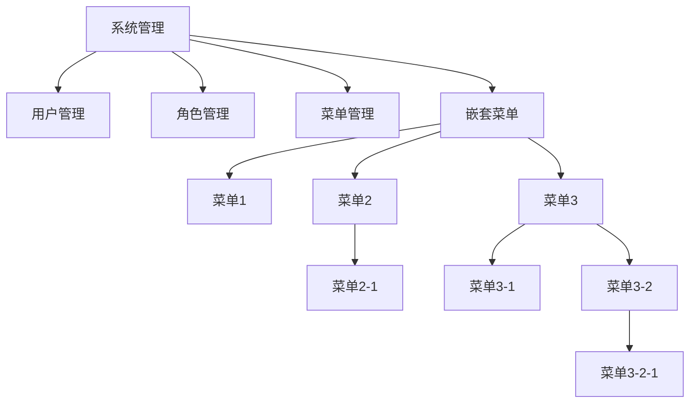

# 面包屑导航

<cite>
**本文档引用的文件**
- [art-breadcrumb/index.vue](file://src/components/core/layouts/art-breadcrumb/index.vue)
- [router.ts](file://src/utils/router.ts)
- [staticRoutes.ts](file://src/router/routes/staticRoutes.ts)
- [system.ts](file://src/router/modules/system.ts)
- [dashboard.ts](file://src/router/modules/dashboard.ts)
- [zh.json](file://src/locales/langs/zh.json)
- [en.json](file://src/locales/langs/en.json)
</cite>

## 目录
1. [简介](#简介)
2. [核心功能与实现原理](#核心功能与实现原理)
3. [路由记录解析逻辑](#路由记录解析逻辑)
4. [国际化语言包集成](#国际化语言包集成)
5. [自定义分隔符与样式](#自定义分隔符与样式)
6. [动态路由参数处理](#动态路由参数处理)
7. [层级显示控制](#层级显示控制)
8. [嵌套路由示例](#嵌套路由示例)
9. [总结](#总结)

## 简介
`art-breadcrumb` 组件是基于 Vue Router 的路由系统实现的导航路径组件，用于展示当前页面在应用中的层级位置。该组件通过解析 `$route.matched` 数组自动生成可点击的导航链，支持国际化、自定义样式和灵活的显示控制。

**本文档不分析具体文件**

## 核心功能与实现原理
`art-breadcrumb` 组件通过 Vue 3 的组合式 API 实现，利用 `useRoute` 和 `useRouter` 钩子获取当前路由信息和路由实例。组件的核心是 `breadcrumbItems` 计算属性，它基于当前路由的 `matched` 数组生成面包屑项目列表。

组件采用响应式设计，当路由发生变化时自动更新显示内容。每个面包屑项都包含路径和元信息，通过 `formatMenuTitle` 函数处理标题显示，支持点击导航功能。

**Section sources**
- [art-breadcrumb/index.vue](file://src/components/core/layouts/art-breadcrumb/index.vue#L52-L83)

## 路由记录解析逻辑
`art-breadcrumb` 组件通过解析 `$route.matched` 数组来生成导航路径。`$route.matched` 是一个包含当前路由匹配的所有路由记录的数组，按从父到子的顺序排列。

组件的解析逻辑包含以下几个关键步骤：

1. **首页处理**：如果当前路由是首页或匹配数组为空，则不显示面包屑
2. **一级菜单处理**：对于标记为一级菜单的路由，只显示当前页面项
3. **包裹容器过滤**：过滤掉作为容器的路由（如 `/outside`）
4. **IFrame 特殊处理**：对于 IFrame 页面进行特殊处理，确保正确显示

**Diagram sources**
- [art-breadcrumb/index.vue](file://src/components/core/layouts/art-breadcrumb/index.vue#L52-L83)

**Section sources**
- [art-breadcrumb/index.vue](file://src/components/core/layouts/art-breadcrumb/index.vue#L52-L83)

## 国际化语言包集成
`art-breadcrumb` 组件通过 `formatMenuTitle` 函数与国际化系统集成。当路由元信息中的 `title` 以 `menus.` 开头时，组件会将其视为国际化键值，并通过 `$t` 函数进行翻译。

系统支持中英文切换，语言包存储在 `src/locales/langs/` 目录下。用户语言偏好会自动从本地存储中恢复，确保用户体验的一致性。

**Diagram sources**
- [router.ts](file://src/utils/router.ts#L47-L61)
- [art-breadcrumb/index.vue](file://src/components/core/layouts/art-breadcrumb/index.vue#L20)

**Section sources**
- [router.ts](file://src/utils/router.ts#L47-L61)
- [zh.json](file://src/locales/langs/zh.json)
- [en.json](file://src/locales/langs/en.json)

## 自定义分隔符与样式
`art-breadcrumb` 组件使用斜杠 `/` 作为默认分隔符，在模板中通过条件渲染实现。分隔符只在非最后一项且有标题的项目之间显示。

组件样式采用 Tailwind CSS 和自定义类名结合的方式，主要样式包括：
- `ml-2.5`：左侧外边距
- `flex-c`：弹性布局居中
- `text-sm`：小号文本
- `hover:bg-active-color`：悬停背景色

通过 CSS 类的组合实现现代化的视觉效果，包括悬停状态、圆角和过渡动画。

**Diagram sources**
- [art-breadcrumb/index.vue](file://src/components/core/layouts/art-breadcrumb/index.vue#L3-L31)

**Section sources**
- [art-breadcrumb/index.vue](file://src/components/core/layouts/art-breadcrumb/index.vue#L3-L31)

## 动态路由参数处理
`art-breadcrumb` 组件对动态路由参数的处理主要体现在路径导航上。当用户点击面包屑项时，组件会根据目标路由的结构决定导航行为：

1. 如果目标路由没有子路由，直接导航到该路径
2. 如果目标路由有子路由，尝试查找第一个有效的子路由并导航到那里
3. 如果没有有效的子路由，则导航到目标路由本身

这种设计确保了用户点击面包屑时能够到达有意义的页面，而不是空的容器页面。

**Section sources**
- [art-breadcrumb/index.vue](file://src/components/core/layouts/art-breadcrumb/index.vue#L116-L138)

## 层级显示控制
`art-breadcrumb` 组件提供了多种方式来控制层级的显示：

1. **隐藏特定层级**：通过路由元信息中的 `isHide` 属性控制
2. **一级菜单模式**：通过 `isFirstLevel` 元信息标记，只显示当前页面
3. **容器路由处理**：自动过滤 `/outside` 等容器路由
4. **IFrame 特殊处理**：对 IFrame 页面进行特殊显示逻辑

这些控制机制确保面包屑导航的简洁性和实用性，避免显示不必要的层级。

**Section sources**
- [art-breadcrumb/index.vue](file://src/components/core/layouts/art-breadcrumb/index.vue#L68-L82)

## 嵌套路由示例
在嵌套路由中，`art-breadcrumb` 组件能够正确显示层级关系。以系统管理模块为例：

当用户访问 "菜单3-2-1" 页面时，面包屑将显示为：
`系统管理 / 菜单3 / 菜单3-2 / 菜单3-2-1`

这种层级显示清晰地反映了页面在应用结构中的位置，帮助用户理解当前所处的导航路径。

**Diagram sources**
- [system.ts](file://src/router/modules/system.ts#L3-L150)
- [art-breadcrumb/index.vue](file://src/components/core/layouts/art-breadcrumb/index.vue)

**Section sources**
- [system.ts](file://src/router/modules/system.ts#L3-L150)
- [art-breadcrumb/index.vue](file://src/components/core/layouts/art-breadcrumb/index.vue)

## 总结
`art-breadcrumb` 组件是一个功能完善、设计精良的导航组件，它通过智能解析路由记录、集成国际化系统、提供灵活的显示控制，为用户提供了清晰的导航体验。组件的设计考虑了各种使用场景，包括嵌套路由、IFrame 页面和动态路由参数，确保在复杂的应用结构中也能正确工作。

通过合理的抽象和封装，组件实现了高内聚、低耦合的设计原则，易于维护和扩展。其响应式设计和性能优化（使用 computed 而不是 watch）确保了良好的用户体验。

**本文档不分析具体文件**