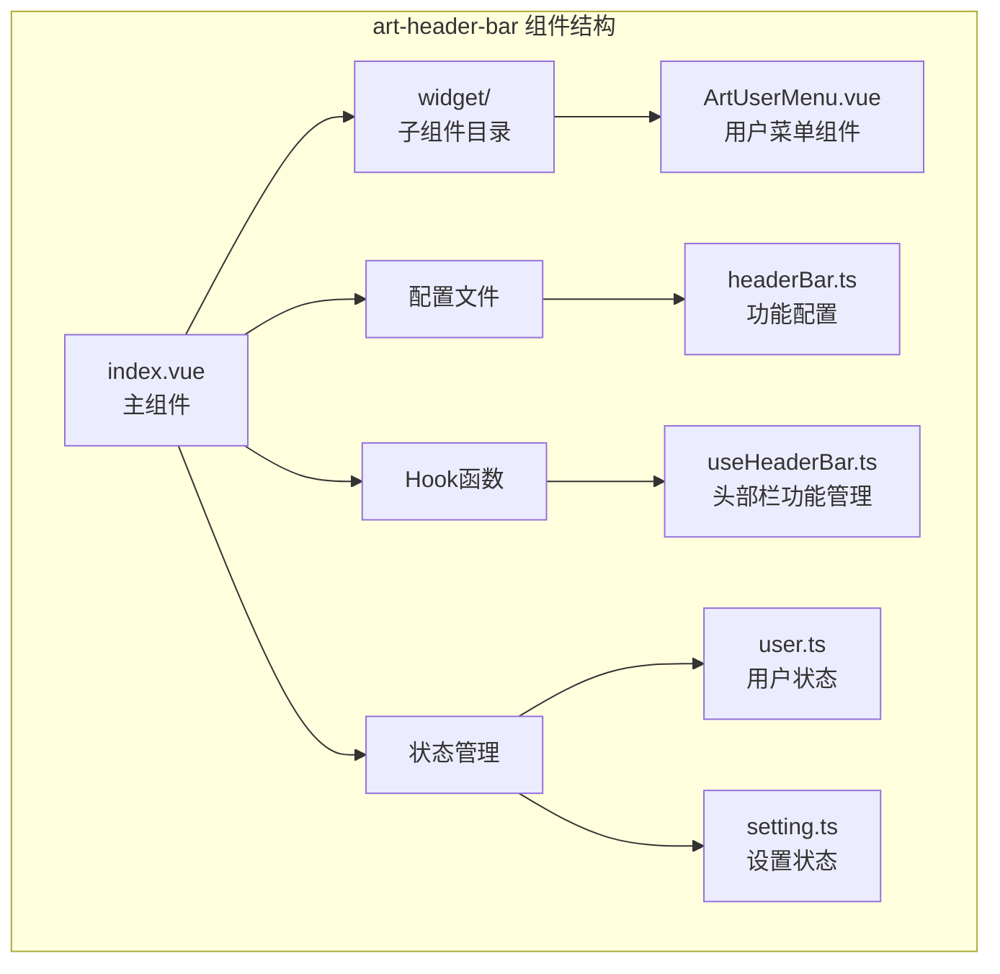
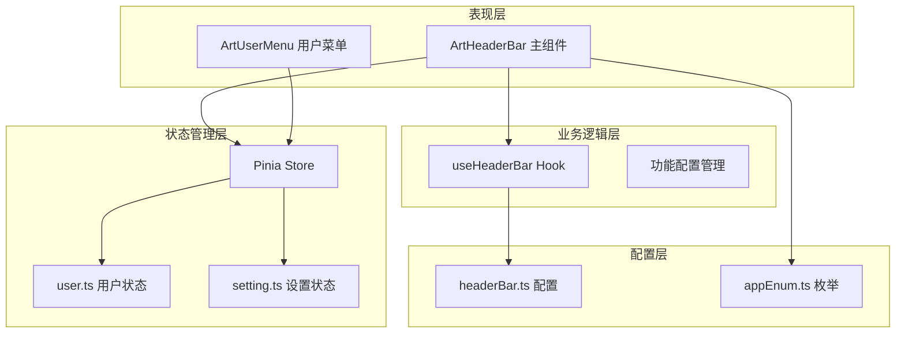
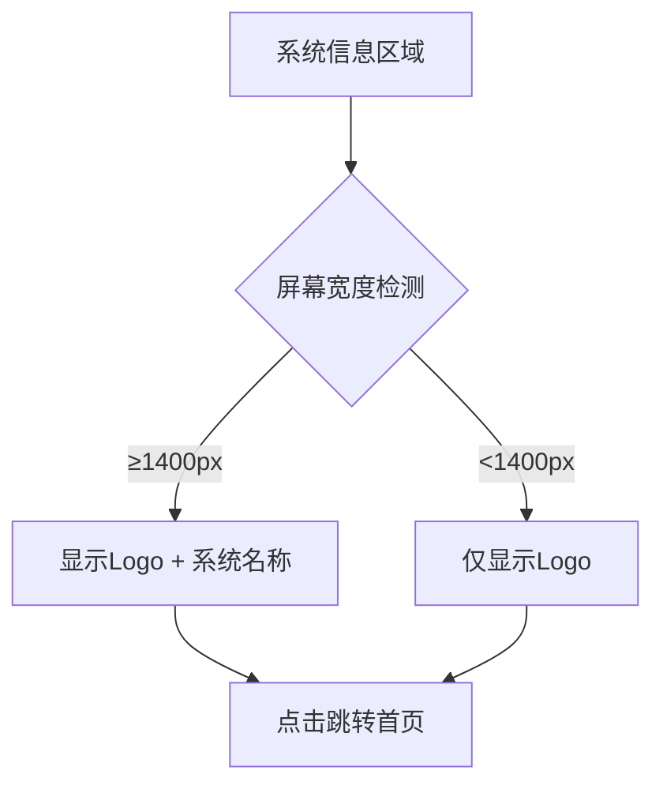
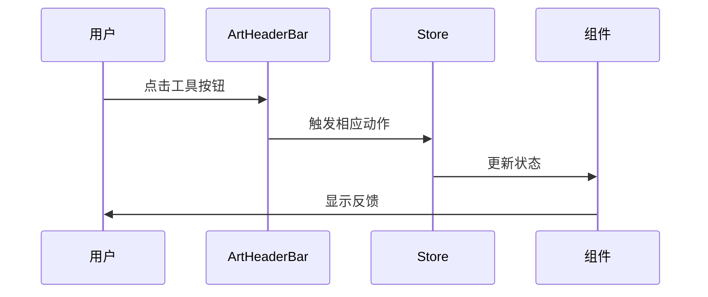
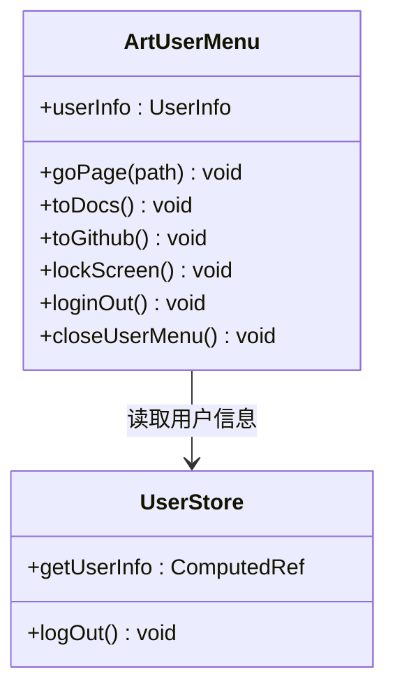
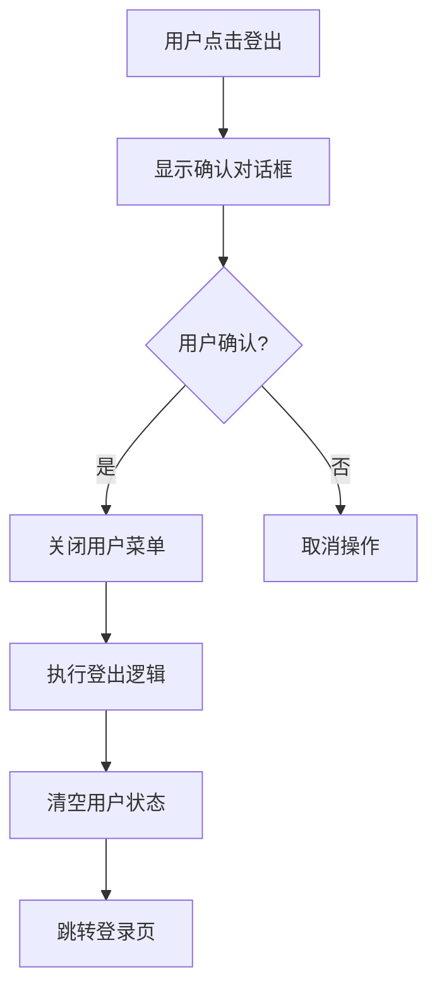
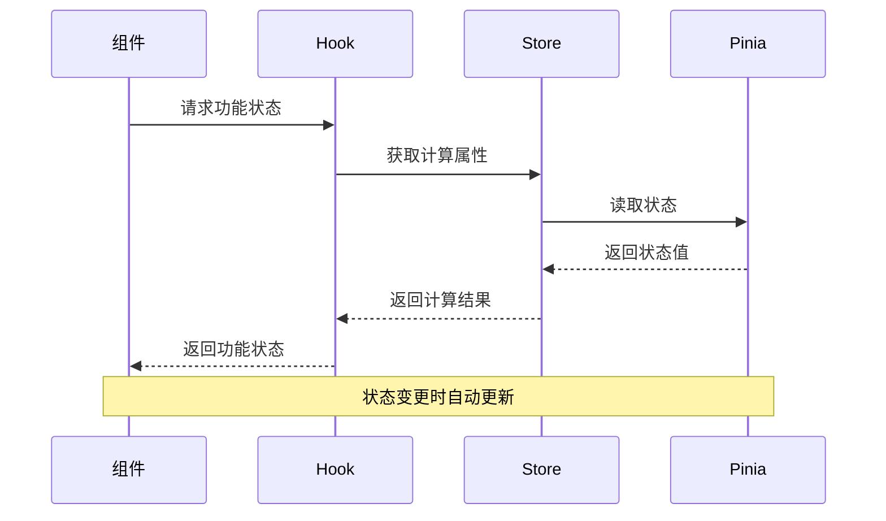
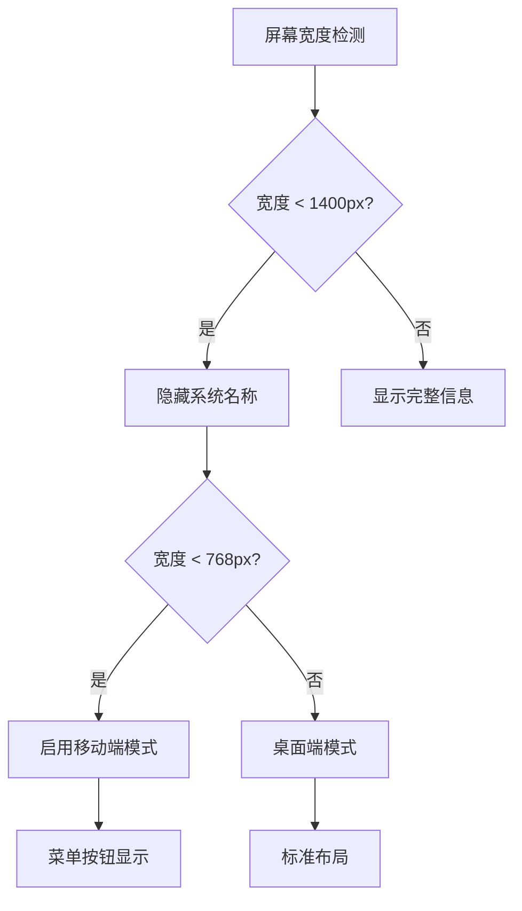

# 页眉组件

<cite>
**本文档引用的文件**
- [index.vue](file://src/components/core/layouts/art-header-bar/index.vue)
- [ArtUserMenu.vue](file://src/components/core/layouts/art-header-bar/widget/ArtUserMenu.vue)
- [user.ts](file://src/store/modules/user.ts)
- [setting.ts](file://src/store/modules/setting.ts)
- [useHeaderBar.ts](file://src/hooks/core/useHeaderBar.ts)
- [headerBar.ts](file://src/config/modules/headerBar.ts)
- [index.ts](file://src/types/config/index.ts)
- [appEnum.ts](file://src/enums/appEnum.ts)
</cite>

## 目录
1. [简介](#简介)
2. [项目结构](#项目结构)
3. [核心组件](#核心组件)
4. [架构概览](#架构概览)
5. [详细组件分析](#详细组件分析)
6. [Pinia状态管理](#pinia状态管理)
7. [响应式布局与移动端适配](#响应式布局与移动端适配)
8. [常见问题排查](#常见问题排查)
9. [总结](#总结)

## 简介

art-header-bar 是 Art Design Pro 项目中的核心页眉组件，提供了完整的顶部导航栏功能。该组件采用现代化的响应式设计理念，集成了导航控制、用户菜单、主题切换、国际化等多个功能模块，通过 Pinia 状态管理实现数据的统一管理和组件间的通信。

组件支持多种菜单布局模式（左侧、顶部、混合、双栏），具备完善的移动端适配能力，并提供了丰富的自定义选项和扩展接口。

## 项目结构

art-header-bar 组件位于 `src/components/core/layouts/art-header-bar/` 目录下，包含以下核心文件：



**图表来源**
- [index.vue](file://src/components/core/layouts/art-header-bar/index.vue#L1-L50)
- [ArtUserMenu.vue](file://src/components/core/layouts/art-header-bar/widget/ArtUserMenu.vue#L1-L30)

**章节来源**
- [index.vue](file://src/components/core/layouts/art-header-bar/index.vue#L1-L100)

## 核心组件

### 主组件 (ArtHeaderBar)

主组件负责整体布局和功能协调，包含以下核心功能模块：

- **系统信息展示**：显示系统名称和Logo
- **菜单控制**：提供菜单展开/收起功能
- **导航功能**：包括刷新、快速入口、面包屑导航
- **工具栏**：集成搜索、全屏、通知、聊天等功能
- **国际化**：语言切换功能
- **主题管理**：明暗主题切换
- **用户菜单**：用户信息展示和操作

### 用户菜单组件 (ArtUserMenu)

独立的用户交互组件，提供用户相关的操作功能：

- **头像展示**：显示用户头像和基本信息
- **功能菜单**：包含个人中心、文档链接、GitHub链接、锁屏功能
- **登出功能**：安全的用户登出流程

**章节来源**
- [index.vue](file://src/components/core/layouts/art-header-bar/index.vue#L171-L344)
- [ArtUserMenu.vue](file://src/components/core/layouts/art-header-bar/widget/ArtUserMenu.vue#L1-L168)

## 架构概览

art-header-bar 采用分层架构设计，实现了清晰的职责分离：



**图表来源**
- [index.vue](file://src/components/core/layouts/art-header-bar/index.vue#L171-L210)
- [useHeaderBar.ts](file://src/hooks/core/useHeaderBar.ts#L28-L202)

## 详细组件分析

### 主组件功能模块

#### 1. 系统信息展示区



**图表来源**
- [index.vue](file://src/components/core/layouts/art-header-bar/index.vue#L18-L22)

#### 2. 导航控制功能

组件通过 `useHeaderBar` hook 实现灵活的功能开关控制：

| 功能 | 配置项 | 默认状态 | 说明 |
|------|--------|----------|------|
| 菜单按钮 | menuButton.enabled | true | 控制左侧菜单的展开/收起 |
| 刷新按钮 | refreshButton.enabled | true | 页面刷新功能 |
| 快速入口 | fastEnter.enabled | true | 快速访问功能 |
| 面包屑 | breadcrumb.enabled | true | 当前页面路径导航 |
| 全局搜索 | globalSearch.enabled | true | 支持快捷键搜索 |
| 全屏功能 | fullscreen.enabled | true | 全屏切换 |
| 通知中心 | notification.enabled | true | 系统通知 |
| 聊天功能 | chat.enabled | true | 实时沟通 |
| 语言切换 | language.enabled | true | 多语言支持 |
| 设置面板 | settings.enabled | true | 系统设置 |
| 主题切换 | themeToggle.enabled | true | 明暗主题 |

**章节来源**
- [index.vue](file://src/components/core/layouts/art-header-bar/index.vue#L29-L159)
- [headerBar.ts](file://src/config/modules/headerBar.ts#L16-L61)

#### 3. 工具栏功能



**图表来源**
- [index.vue](file://src/components/core/layouts/art-header-bar/index.vue#L64-L159)

### 用户菜单组件分析

#### 用户信息展示

用户菜单组件通过 Pinia 状态管理获取用户信息：



**图表来源**
- [ArtUserMenu.vue](file://src/components/core/layouts/art-header-bar/widget/ArtUserMenu.vue#L62-L132)
- [user.ts](file://src/store/modules/user.ts#L70-L85)

#### 登出流程



**图表来源**
- [ArtUserMenu.vue](file://src/components/core/layouts/art-header-bar/widget/ArtUserMenu.vue#L109-L121)

**章节来源**
- [ArtUserMenu.vue](file://src/components/core/layouts/art-header-bar/widget/ArtUserMenu.vue#L62-L168)

## Pinia状态管理

### 用户状态管理 (user.ts)

用户状态模块管理用户的登录状态、个人信息、令牌等关键数据：

```mermaid
erDiagram
USER_STORE {
boolean isLogin
object info
string accessToken
string refreshToken
string language
boolean isLock
string lockPassword
array searchHistory
}
USER_ACTIONS {
setUserInfo()
setLoginStatus()
setToken()
setLanguage()
setLockStatus()
logOut()
checkAndClearWorktabs()
}
USER_STORE ||--o{ USER_ACTIONS : contains
```

**图表来源**
- [user.ts](file://src/store/modules/user.ts#L50-L227)

### 设置状态管理 (setting.ts)

设置状态模块管理系统的各种配置选项：

```mermaid
erDiagram
SETTING_STORE {
enum menuType
boolean menuOpen
enum systemThemeType
enum systemThemeMode
boolean showMenuButton
boolean showFastEnter
boolean showRefreshButton
boolean showCrumbs
string systemThemeColor
string customRadius
enum containerWidth
}
SETTING_ACTIONS {
switchMenuLayouts()
setGlopTheme()
setElementTheme()
setButton()
setFastEnter()
setMenuOpen()
reload()
}
SETTING_STORE ||--o{ SETTING_ACTIONS : contains
```

**图表来源**
- [setting.ts](file://src/store/modules/setting.ts#L47-L442)

### 状态交互流程



**图表来源**
- [useHeaderBar.ts](file://src/hooks/core/useHeaderBar.ts#L28-L202)

**章节来源**
- [user.ts](file://src/store/modules/user.ts#L1-L236)
- [setting.ts](file://src/store/modules/setting.ts#L1-L451)

## 响应式布局与移动端适配

### 断点配置

组件采用移动优先的设计理念，基于屏幕宽度实现响应式布局：

| 断点 | 屏幕宽度 | 显示内容 | 适配策略 |
|------|----------|----------|----------|
| 移动端 | ≤640px | 最小化工具栏 | 隐藏次要功能，使用下拉菜单 |
| 平板端 | 641px-768px | 紧凑工具栏 | 隐藏部分图标，调整间距 |
| 桌面端 | 769px-1440px | 标准工具栏 | 正常显示所有功能 |
| 大屏端 | ≥1440px | 完整工具栏 | 显示全部功能和文本 |

### 折叠逻辑



**图表来源**
- [index.vue](file://src/components/core/layouts/art-header-bar/index.vue#L19-L22)

### 移动端适配策略

1. **图标优化**：使用简洁的图标替代文字
2. **空间节省**：隐藏非关键信息
3. **交互优化**：增大触摸目标尺寸
4. **动画效果**：添加平滑的过渡动画

**章节来源**
- [index.vue](file://src/components/core/layouts/art-header-bar/index.vue#L473-L485)

## 常见问题排查

### 1. 菜单不显示问题

**症状**：顶部栏缺少某些功能按钮

**排查步骤**：
1. 检查 `headerBar.ts` 配置文件中的 `enabled` 属性
2. 验证对应的设置开关是否开启
3. 确认屏幕宽度是否满足显示要求

**解决方案**：
```typescript
// 修改配置文件
const headerBarConfig = {
  menuButton: {
    enabled: true, // 确保启用
    description: '控制左侧菜单的展开/收起按钮'
  }
}
```

### 2. 状态不同步问题

**症状**：用户信息或设置状态不正确

**排查步骤**：
1. 检查 Pinia store 的持久化配置
2. 验证本地存储的数据完整性
3. 确认状态更新的触发时机

**解决方案**：
```typescript
// 检查 store 配置
persist: {
  key: 'user',
  storage: localStorage
}
```

### 3. 主题切换失效

**症状**：主题切换按钮无反应

**排查步骤**：
1. 检查 `systemThemeType` 和 `systemThemeMode` 状态
2. 验证 CSS 变量的正确性
3. 确认动画函数的执行

**解决方案**：
```typescript
// 确保主题切换逻辑正确
const themeAnimation = () => {
  // 主题切换动画逻辑
  settingStore.setGlopTheme(
    settingStore.isDark ? SystemThemeEnum.LIGHT : SystemThemeEnum.DARK,
    SystemThemeEnum.AUTO
  )
}
```

### 4. 用户菜单不显示

**症状**：用户头像区域空白或无响应

**排查步骤**：
1. 检查用户登录状态
2. 验证用户信息的获取
3. 确认组件的渲染条件

**解决方案**：
```typescript
// 检查用户状态
const { isLogin, getUserInfo } = storeToRefs(userStore)
const hasUserInfo = computed(() => isLogin.value && !!getUserInfo.value.userId)
```

**章节来源**
- [useHeaderBar.ts](file://src/hooks/core/useHeaderBar.ts#L38-L173)
- [ArtUserMenu.vue](file://src/components/core/layouts/art-header-bar/widget/ArtUserMenu.vue#L75-L77)

## 总结

art-header-bar 组件是一个功能完整、设计精良的顶部导航栏解决方案。它通过以下特性实现了优秀的用户体验：

### 核心优势

1. **模块化设计**：清晰的组件分离和职责划分
2. **响应式布局**：完善的移动端适配和断点处理
3. **状态管理**：基于 Pinia 的统一状态管理
4. **可配置性**：灵活的功能开关和自定义选项
5. **性能优化**：合理的计算属性和懒加载机制

### 扩展建议

1. **国际化增强**：支持更多语言和本地化需求
2. **无障碍支持**：添加键盘导航和屏幕阅读器支持
3. **性能监控**：集成性能指标收集和分析
4. **主题系统**：提供更多自定义主题选项

该组件为现代 Web 应用提供了可靠的导航基础设施，是 Art Design Pro 项目中的重要组成部分。