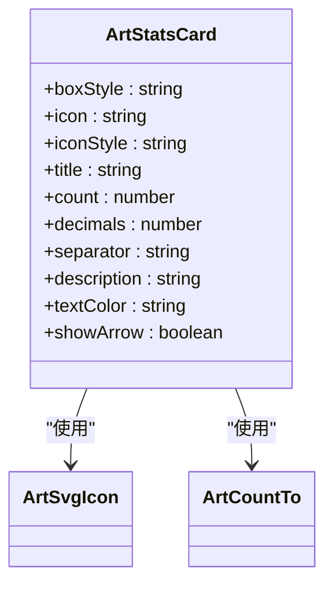
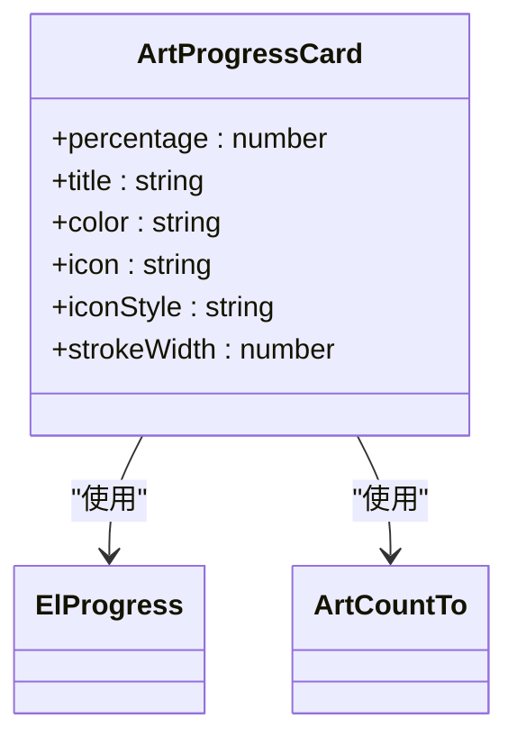
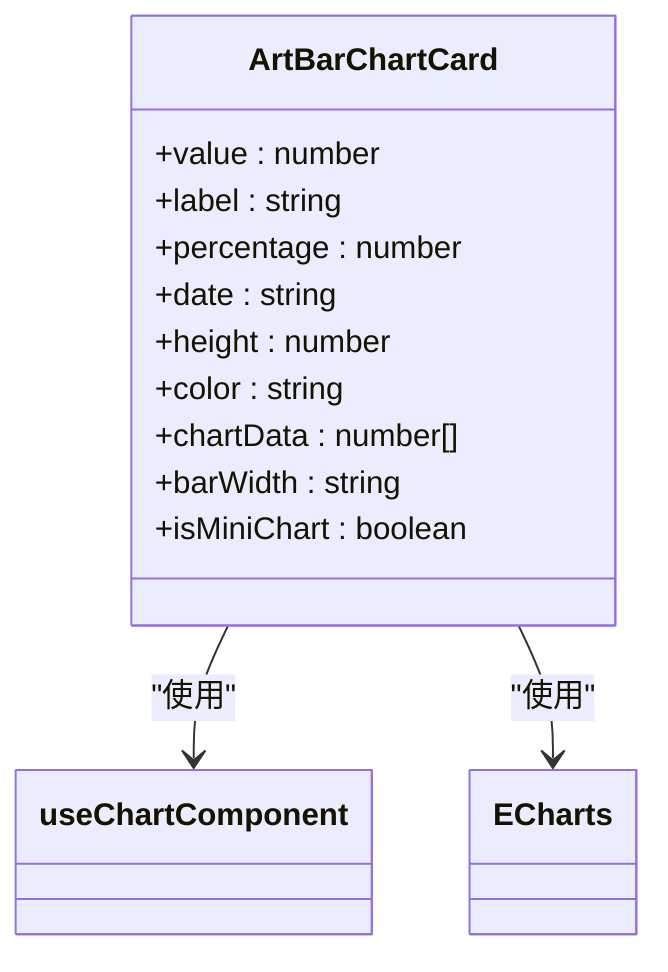
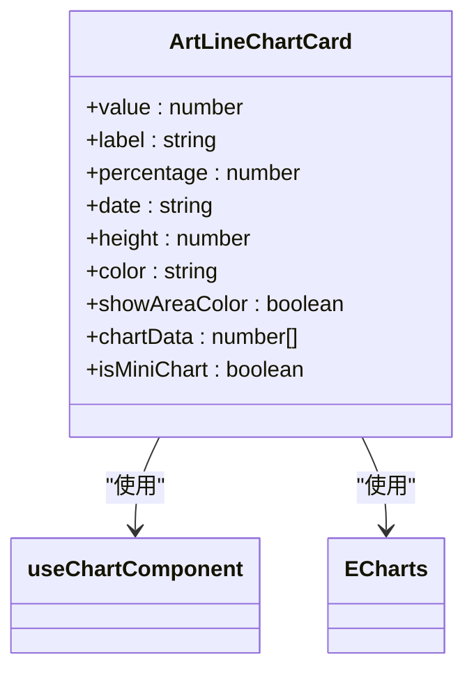
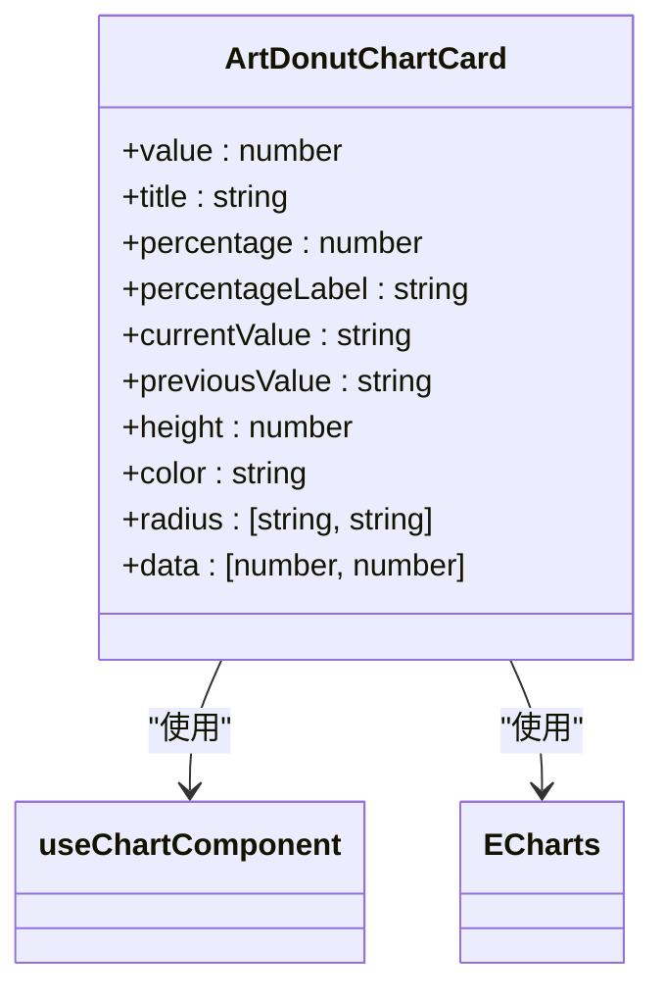
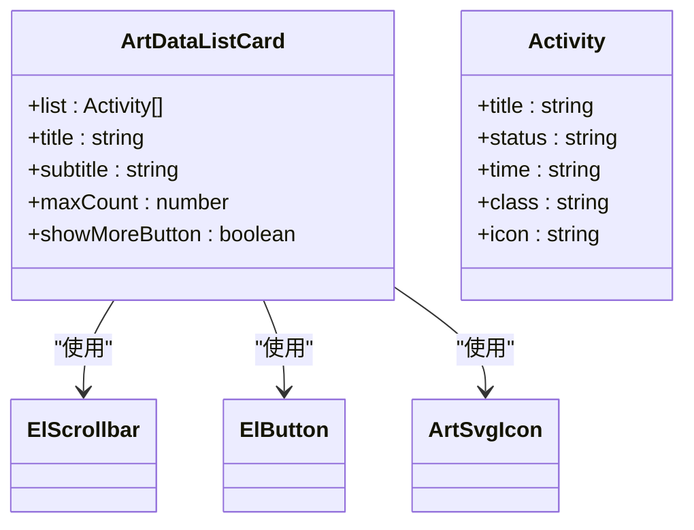
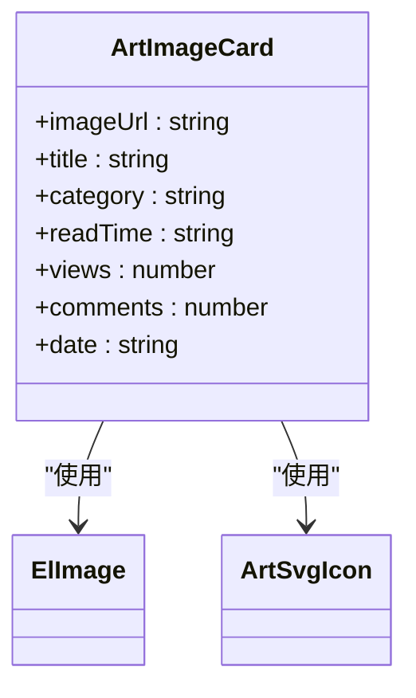
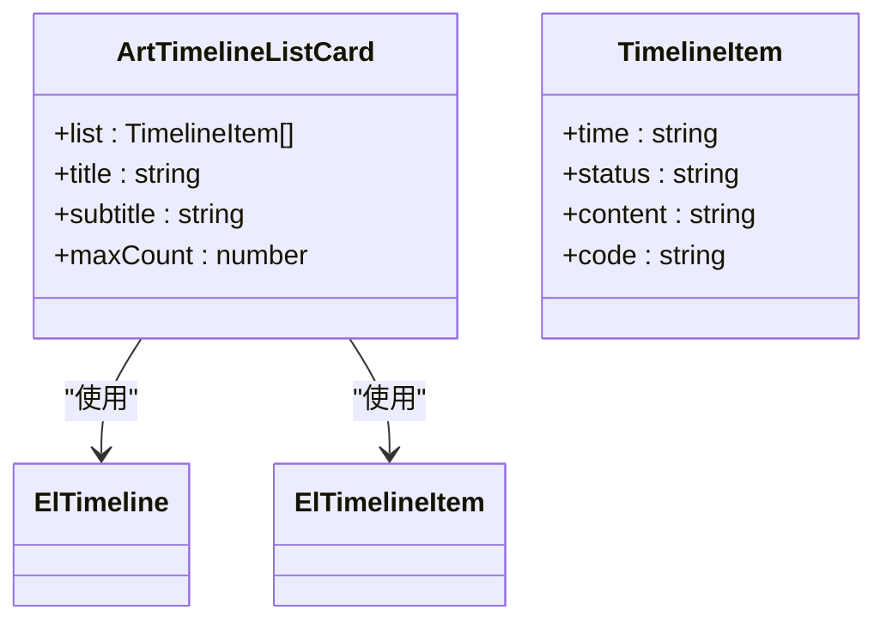
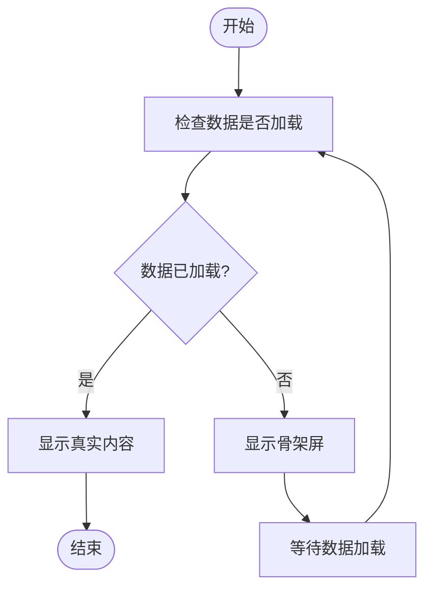

# 卡片组件

<cite>
**本文档引用的文件**   
- [art-stats-card/index.vue](file://src/components/core/cards/art-stats-card/index.vue)
- [art-progress-card/index.vue](file://src/components/core/cards/art-progress-card/index.vue)
- [art-bar-chart-card/index.vue](file://src/components/core/cards/art-bar-chart-card/index.vue)
- [art-line-chart-card/index.vue](file://src/components/core/cards/art-line-chart-card/index.vue)
- [art-donut-chart-card/index.vue](file://src/components/core/cards/art-donut-chart-card/index.vue)
- [art-data-list-card/index.vue](file://src/components/core/cards/art-data-list-card/index.vue)
- [art-image-card/index.vue](file://src/components/core/cards/art-image-card/index.vue)
- [art-timeline-list-card/index.vue](file://src/components/core/cards/art-timeline-list-card/index.vue)
- [useChart.ts](file://src/hooks/core/useChart.ts)
- [app.scss](file://src/assets/styles/core/app.scss)
</cite>

## 目录
1. [数据统计卡片 (art-stats-card)](#数据统计卡片-art-stats-card)
2. [进度条卡片 (art-progress-card)](#进度条卡片-art-progress-card)
3. [柱状图卡片 (art-bar-chart-card)](#柱状图卡片-art-bar-chart-card)
4. [折线图卡片 (art-line-chart-card)](#折线图卡片-art-line-chart-card)
5. [环形图卡片 (art-donut-chart-card)](#环形图卡片-art-donut-chart-card)
6. [数据列表卡片 (art-data-list-card)](#数据列表卡片-art-data-list-card)
7. [图片卡片 (art-image-card)](#图片卡片-art-image-card)
8. [时间轴列表卡片 (art-timeline-list-card)](#时间轴列表卡片-art-timeline-list-card)
9. [卡片网格布局与响应式](#卡片网格布局与响应式)
10. [常见问题与解决方案](#常见问题与解决方案)

## 数据统计卡片 (art-stats-card)

`art-stats-card` 组件用于展示关键数据指标，采用简洁的布局，包含图标、数值、标题和描述信息。该组件支持自定义图标、颜色和样式，适用于仪表盘和数据概览页面。

组件通过 `ArtSvgIcon` 组件集成图标，支持任意图标库的图标。数值展示使用 `ArtCountTo` 组件实现动态计数动画，提升视觉效果。组件还支持显示右箭头图标，可用于指示可点击的卡片。

**组件特性**：
- 图标与数值并排布局，视觉层次清晰
- 支持自定义图标样式和背景色
- 数值支持小数位和千位分隔符配置
- 标题和描述文本支持自定义颜色
- 悬停时有轻微上浮动画效果

**图源**
- [art-stats-card/index.vue](file://src/components/core/cards/art-stats-card/index.vue#L1-L68)

**节源**
- [art-stats-card/index.vue](file://src/components/core/cards/art-stats-card/index.vue#L1-L68)

## 进度条卡片 (art-progress-card)

`art-progress-card` 组件用于展示任务或指标的完成进度。该组件采用垂直布局，包含进度百分比、标题和进度条。进度条支持自定义颜色和宽度，百分比数值通过动画效果平滑递增。

组件使用 `ElProgress` 组件实现进度条，并通过 `requestAnimationFrame` 实现流畅的动画效果。当 `percentage` 属性变化时，会重新执行动画，确保进度变化的视觉连贯性。

**组件特性**：
- 支持图标与进度信息的灵活布局
- 进度百分比支持动态动画效果
- 进度条颜色可自定义，默认为绿色
- 进度条宽度可配置
- 动画时长为500毫秒，平滑过渡

**图源**
- [art-progress-card/index.vue](file://src/components/core/cards/art-progress-card/index.vue#L1-L87)

**节源**
- [art-progress-card/index.vue](file://src/components/core/cards/art-progress-card/index.vue#L1-L87)

## 柱状图卡片 (art-bar-chart-card)

`art-bar-chart-card` 组件用于在卡片内嵌入柱状图，实现数据可视化。该组件结合了数值展示和图表展示，顶部显示关键数值和标签，底部嵌入ECharts柱状图。

组件通过 `useChartComponent` Hook 管理图表生命周期，支持响应式调整、主题切换和空状态处理。图表配置中禁用了坐标轴显示，专注于数据趋势的视觉呈现。

**组件特性**：
- 顶部显示关键数值和标签，底部嵌入柱状图
- 支持迷你图表模式，适用于紧凑布局
- 柱状图宽度可配置，默认为26%
- 支持自定义颜色，未指定时使用主题色
- 图表高度可配置，默认为11rem
- 支持显示同比/环比百分比，正数绿色，负数红色

**图源**
- [art-bar-chart-card/index.vue](file://src/components/core/cards/art-bar-chart-card/index.vue#L1-L104)

**节源**
- [art-bar-chart-card/index.vue](file://src/components/core/cards/art-bar-chart-card/index.vue#L1-L104)

## 折线图卡片 (art-line-chart-card)

`art-line-chart-card` 组件用于在卡片内嵌入折线图，展示数据趋势。与柱状图卡片类似，该组件也采用上下布局，顶部显示关键数值，底部嵌入ECharts折线图。

组件支持显示区域填充颜色，通过 `showAreaColor` 属性控制。区域填充使用线性渐变，从主题色的20%透明度到1%透明度，创造深度感。折线图线条较粗，宽度为3像素，确保清晰可见。

**组件特性**：
- 折线图线条平滑，无数据点标记
- 可选区域填充，增强数据趋势的视觉表现
- X轴边界间隙关闭，折线图紧贴边缘
- 坐标轴隐藏，专注于数据曲线
- 支持迷你图表模式，适应不同布局需求
- 响应式设计，自动适应容器大小

**图源**
- [art-line-chart-card/index.vue](file://src/components/core/cards/art-line-chart-card/index.vue#L1-L127)

**节源**
- [art-line-chart-card/index.vue](file://src/components/core/cards/art-line-chart-card/index.vue#L1-L127)

## 环形图卡片 (art-donut-chart-card)

`art-donut-chart-card` 组件用于展示环形图（甜甜圈图），常用于比较两个数据点的比例关系。该组件采用左右布局，左侧显示数值、标题和对比信息，右侧嵌入环形图。

组件默认将数据分为两部分：当前值和历史值。当前值使用主题色填充，历史值使用浅灰色填充。组件支持自定义半径，通过 `radius` 属性配置内外半径，创建不同厚度的环形图。

**组件特性**：
- 左侧显示数值、标题和百分比变化
- 右侧嵌入环形图，直观展示比例关系
- 支持自定义环形图半径
- 数值自动添加千位分隔符
- 支持显示当前年份和去年年份的对比
- 图例通过颜色块在左侧文本中体现

**图源**
- [art-donut-chart-card/index.vue](file://src/components/core/cards/art-donut-chart-card/index.vue#L1-L125)

**节源**
- [art-donut-chart-card/index.vue](file://src/components/core/cards/art-donut-chart-card/index.vue#L1-L125)

## 数据列表卡片 (art-data-list-card)

`art-data-list-card` 组件用于展示数据列表，适用于活动日志、通知列表等场景。该组件包含标题、副标题和可滚动的列表内容。

列表项支持图标、标题、状态和时间的展示。每个列表项可配置自定义样式类名，实现多样化的视觉效果。组件使用 `ElScrollbar` 实现内容滚动，通过 `maxCount` 属性控制最大显示数量，超出部分隐藏。

**组件特性**：
- 支持固定高度的滚动列表
- 列表项可包含图标、标题、状态和时间
- 图标区域有固定大小和圆角背景
- 底部可显示"查看更多"按钮，支持点击事件
- 列表高度根据最大显示数量动态计算
- 使用波纹指令 `v-ripple` 增强按钮交互反馈

**图源**
- [art-data-list-card/index.vue](file://src/components/core/cards/art-data-list-card/index.vue#L1-L75)

**节源**
- [art-data-list-card/index.vue](file://src/components/core/cards/art-data-list-card/index.vue#L1-L75)

## 图片卡片 (art-image-card)

`art-image-card` 组件用于展示图文内容，适用于文章卡片、产品展示等场景。该组件包含图片、标题、分类、阅读时间、浏览量、评论数和日期等信息。

组件使用 `ElImage` 组件实现图片懒加载，提升页面性能。图片区域有占位符，当图片加载时显示Element Plus的图片图标。图片悬停时有缩放动画效果，增强交互体验。

**组件特性**：
- 图片支持懒加载和占位符
- 图片悬停时有0.3秒的缩放动画
- 阅读时间标签显示在图片右下角
- 分类标签显示在内容区域左上角
- 底部显示浏览量、评论数和日期
- 整个卡片可点击，触发点击事件
- 使用 `aspect-[16/10]` 保持图片宽高比

**图源**
- [art-image-card/index.vue](file://src/components/core/cards/art-image-card/index.vue#L1-L90)

**节源**
- [art-image-card/index.vue](file://src/components/core/cards/art-image-card/index.vue#L1-L90)

## 时间轴列表卡片 (art-timeline-list-card)

`art-timeline-list-card` 组件用于展示时间轴列表，适用于历史记录、流程跟踪等场景。该组件包含标题、副标题和可滚动的时间轴内容。

组件使用 `ElTimeline` 和 `ElTimelineItem` 组件构建时间轴，每个时间点可包含时间、内容和状态码。时间轴项的颜色由 `status` 属性控制，实现状态可视化。

**组件特性**：
- 时间轴垂直排列，时间显示在右侧
- 支持状态颜色自定义，实现状态可视化
- 可选显示状态码，用主题色高亮
- 时间轴居中对齐，视觉效果平衡
- 支持固定高度的滚动区域
- 时间轴项间距适中，阅读体验良好

**图源**
- [art-timeline-list-card/index.vue](file://src/components/core/cards/art-timeline-list-card/index.vue#L1-L70)

**节源**
- [art-timeline-list-card/index.vue](file://src/components/core/cards/art-timeline-list-card/index.vue#L1-L70)

## 卡片网格布局与响应式

卡片组件通常在网格布局中使用，通过CSS Grid或Flexbox实现响应式布局。项目中的卡片组件具有统一的基类 `art-card`，确保视觉一致性。

**响应式断点配置**：
- 移动端（<768px）：单列布局，卡片全宽
- 平板端（768px-1024px）：双列布局
- 桌面端（>1024px）：根据容器宽度自适应多列布局

**骨架屏实现方法**：
骨架屏用于在数据加载时提供视觉反馈，提升用户体验。可通过以下方式实现：
1. 创建与卡片结构相似的骨架组件
2. 使用灰色背景和动画效果模拟内容加载
3. 在数据加载完成前显示骨架屏，加载完成后替换为真实内容

**节源**
- [app.scss](file://src/assets/styles/core/app.scss#L84-L159)

## 常见问题与解决方案

### 卡片内容溢出
**问题**：当卡片内容过长时，可能出现文本溢出或布局错乱。
**解决方案**：
- 使用 `text-overflow: ellipsis` 实现文本省略
- 设置固定高度和 `overflow: hidden`
- 使用 `-webkit-line-clamp` 实现多行文本省略

### 响应式失效
**问题**：在特定屏幕尺寸下，卡片布局不符合预期。
**解决方案**：
- 检查CSS媒体查询断点设置
- 确保使用相对单位（如rem、%）而非固定像素值
- 使用CSS Grid的 `auto-fit` 或 `auto-fill` 实现自适应列数

### 图表渲染问题
**问题**：图表在容器大小变化后未能正确重绘。
**解决方案**：
- 确保调用 `chart.resize()` 方法
- 使用 `useChart` Hook 的 `handleResize` 方法
- 监听窗口大小变化和容器可见性

### 性能优化
**问题**：大量卡片同时渲染导致页面卡顿。
**解决方案**：
- 实现虚拟滚动，只渲染可视区域的卡片
- 使用懒加载，延迟加载非首屏卡片
- 优化图表渲染，避免不必要的重绘

**节源**
- [useChart.ts](file://src/hooks/core/useChart.ts#L85-L622)
- [app.scss](file://src/assets/styles/core/app.scss#L192-L201)