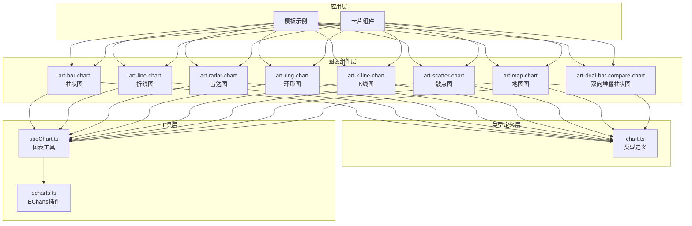
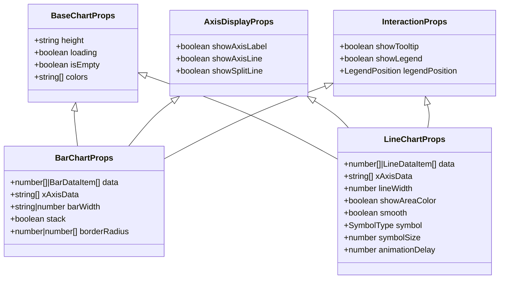
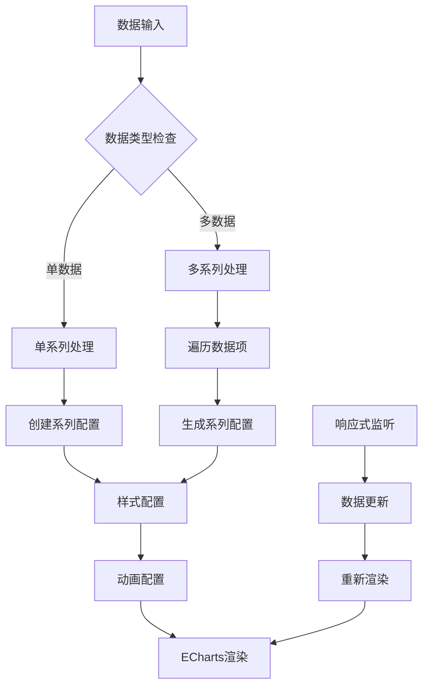
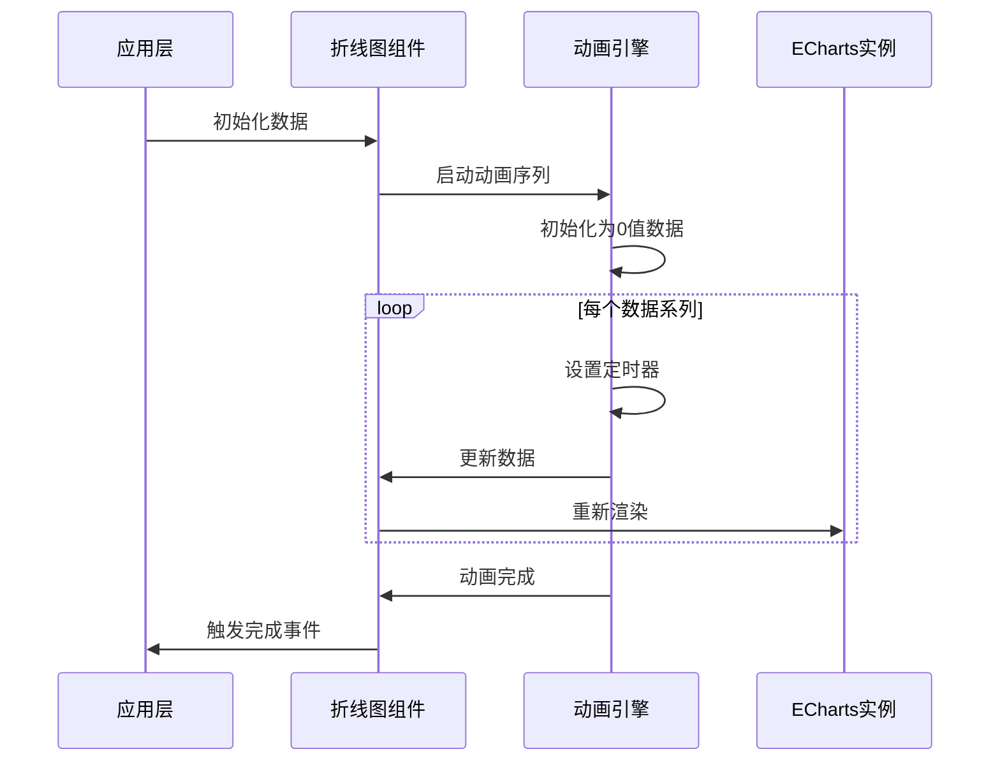
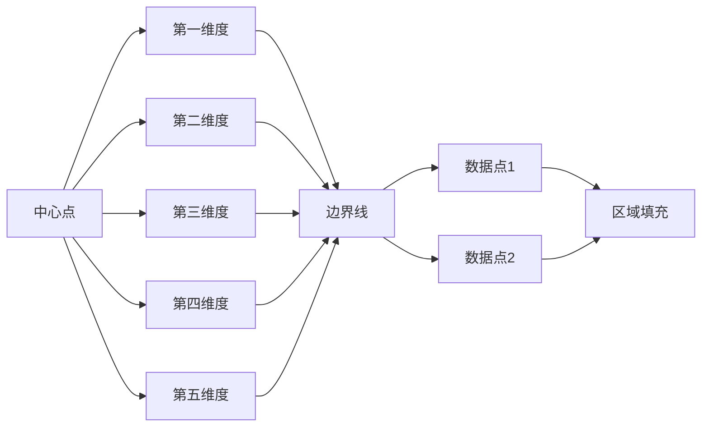
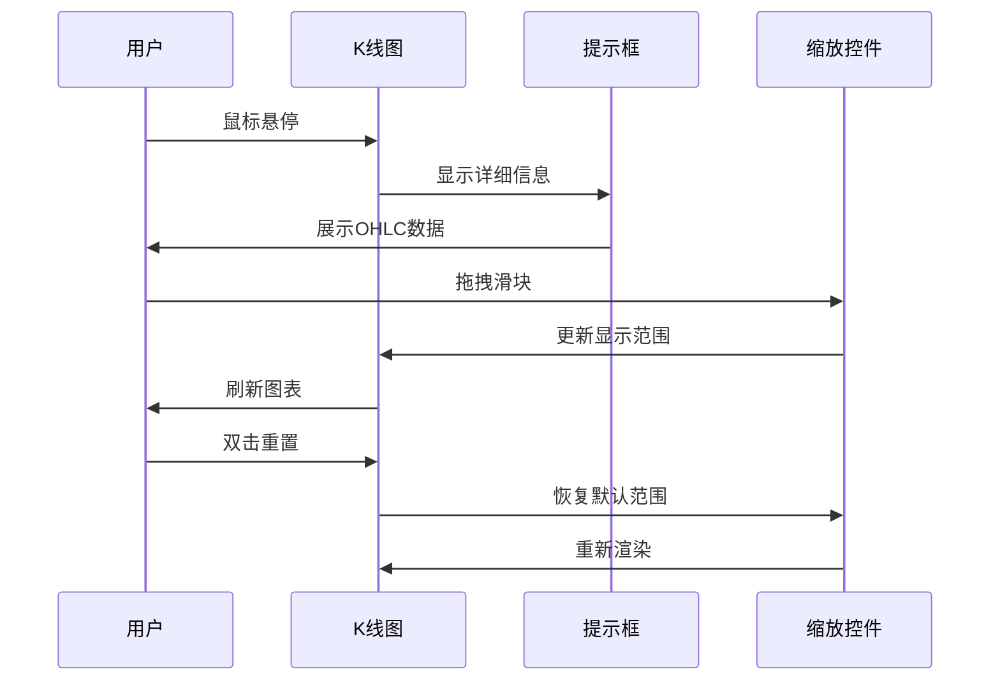
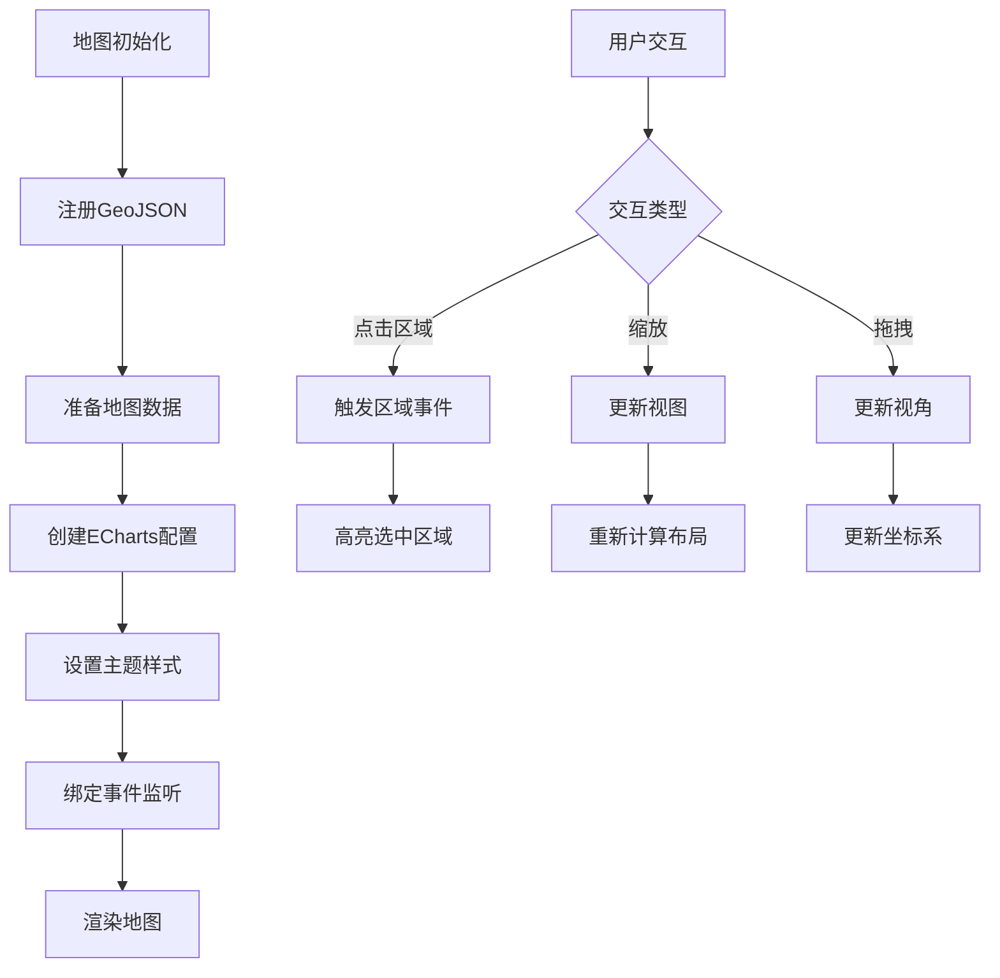
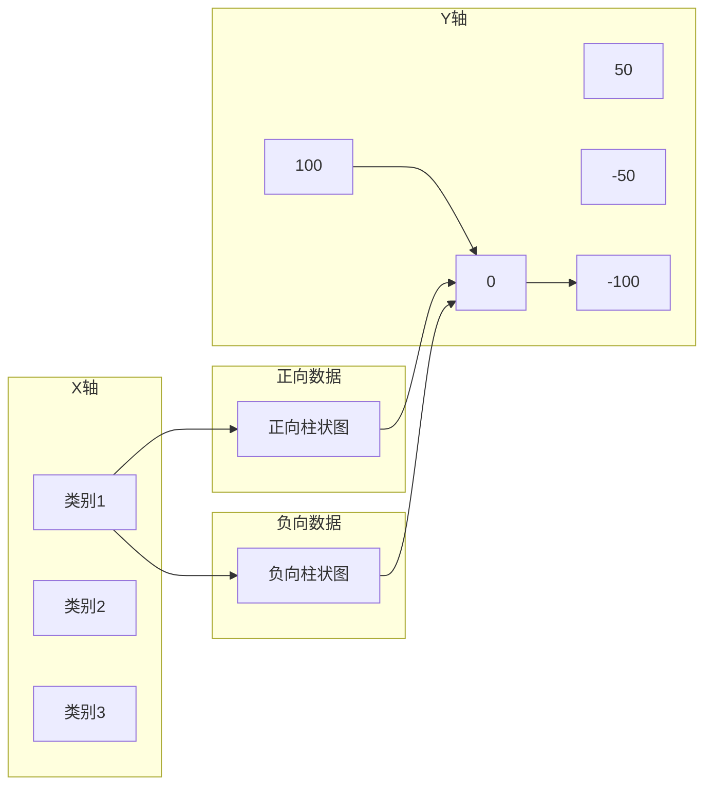
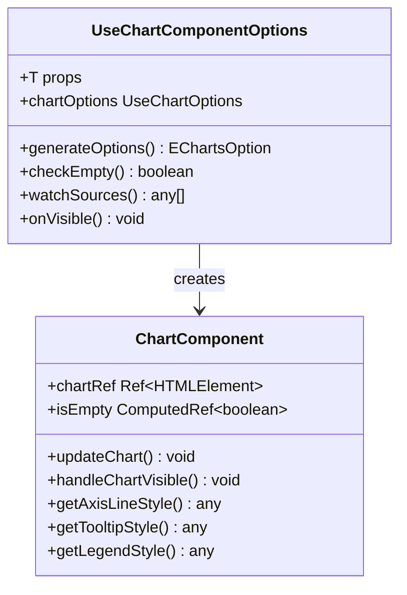

# 图表组件

<cite>
**本文档引用的文件**
- [src/types/component/chart.ts](file://src/types/component/chart.ts)
- [src/components/core/charts/art-bar-chart/index.vue](file://src/components/core/charts/art-bar-chart/index.vue)
- [src/components/core/charts/art-line-chart/index.vue](file://src/components/core/charts/art-line-chart/index.vue)
- [src/components/core/charts/art-radar-chart/index.vue](file://src/components/core/charts/art-radar-chart/index.vue)
- [src/components/core/charts/art-ring-chart/index.vue](file://src/components/core/charts/art-ring-chart/index.vue)
- [src/components/core/charts/art-k-line-chart/index.vue](file://src/components/core/charts/art-k-line-chart/index.vue)
- [src/components/core/charts/art-scatter-chart/index.vue](file://src/components/core/charts/art-scatter-chart/index.vue)
- [src/components/core/charts/art-map-chart/index.vue](file://src/components/core/charts/art-map-chart/index.vue)
- [src/components/core/charts/art-dual-bar-compare-chart/index.vue](file://src/components/core/charts/art-dual-bar-compare-chart/index.vue)
- [src/hooks/core/useChart.ts](file://src/hooks/core/useChart.ts)
- [src/views/template/charts/index.vue](file://src/views/template/charts/index.vue)
</cite>

## 目录
1. [简介](#简介)
2. [项目架构](#项目架构)
3. [核心类型定义](#核心类型定义)
4. [art-bar-chart 柱状图](#art-bar-chart-柱状图)
5. [art-line-chart 折线图](#art-line-chart-折线图)
6. [art-radar-chart 雷达图](#art-radar-chart-雷达图)
7. [art-ring-chart 环形图](#art-ring-chart-环形图)
8. [art-k-line-chart K线图](#art-k-line-chart-k线图)
9. [art-scatter-chart 散点图](#art-scatter-chart-散点图)
10. [art-map-chart 地图图](#art-map-chart-地图图)
11. [art-dual-bar-compare-chart 双向堆叠柱状图](#art-dual-bar-compare-chart-双向堆叠柱状图)
12. [图表组件抽象层](#图表组件抽象层)
13. [性能优化策略](#性能优化策略)
14. [故障排除指南](#故障排除指南)
15. [最佳实践](#最佳实践)

## 简介

本图表组件库基于 ECharts 构建，提供了完整的图表解决方案，包含 8 种不同类型的图表组件，支持响应式设计、主题自动切换、动态数据更新等功能。每个图表组件都经过精心优化，提供类型安全的配置方式和丰富的自定义选项。

## 项目架构



**图表来源**
- [src/types/component/chart.ts](file://src/types/component/chart.ts#L1-L325)
- [src/hooks/core/useChart.ts](file://src/hooks/core/useChart.ts#L1-L746)

## 核心类型定义

### 基础图表配置

所有图表组件都继承自基础配置接口，提供统一的配置方式：



**图表来源**
- [src/types/component/chart.ts](file://src/types/component/chart.ts#L71-L173)

### 图表数据结构

| 图表类型 | 数据格式 | 特殊配置 |
|---------|---------|---------|
| 柱状图 | `number[] \| BarDataItem[]` | 支持堆叠、圆角、宽度配置 |
| 折线图 | `number[] \| LineDataItem[]` | 支持区域填充、平滑曲线、动画延迟 |
| 雷达图 | `RadarDataItem[]` | 指标配置、数据映射 |
| 环形图 | `PieDataItem[]` | 内外半径、标签控制 |
| K线图 | `KLineDataItem[]` | 金融数据、缩放控件 |
| 散点图 | `ScatterDataItem[]` | 坐标值、符号大小 |
| 地图图 | `any[]` | 地图数据、区域选择 |
| 双向堆叠柱状图 | `number[]` | 正负数据分离 |

**章节来源**
- [src/types/component/chart.ts](file://src/types/component/chart.ts#L102-L308)

## art-bar-chart 柱状图

### 核心特性

art-bar-chart 是一个功能强大的柱状图组件，支持多种配置选项和高级特性：

#### 柱状图宽度配置
- **默认宽度**: `'40%'` - 自动计算的百分比宽度
- **固定宽度**: `26` - 像素值的固定宽度
- **动态宽度**: 支持响应式宽度调整

#### 堆叠模式
- **单组数据**: 支持单个数据系列的柱状图
- **多组数据**: 支持多个数据系列的堆叠显示
- **分组堆叠**: 支持按组进行堆叠配置

#### 圆角设置
- **统一圆角**: `4` - 所有角使用相同半径
- **独立圆角**: `[6, 6, 0, 0]` - 分别设置四个角的半径
- **动态圆角**: 支持根据数据动态调整圆角大小

#### 响应式数据绑定
- **实时更新**: 数据变化时自动重新渲染
- **动画过渡**: 支持平滑的数据更新动画
- **空数据处理**: 自动处理空数据状态

### 配置示例

```typescript
// 单数据柱状图配置
const singleBarConfig = {
  data: [120, 200, 150, 80, 70, 110, 130],
  xAxisData: ['周一', '周二', '周三', '周四', '周五', '周六', '周日'],
  barWidth: '26%',
  borderRadius: 4,
  stack: false
}

// 多数据堆叠柱状图配置
const multiStackConfig = {
  data: [
    { name: '销售额', data: [120, 200, 150, 80, 70, 110, 130], stack: 'total' },
    { name: '利润', data: [20, 50, 30, 15, 10, 25, 35], stack: 'total' }
  ],
  xAxisData: ['产品A', '产品B', '产品C', '产品D', '产品E'],
  barWidth: '26%',
  borderRadius: [6, 6, 0, 0],
  stack: true
}
```

### 实现原理



**图表来源**
- [src/components/core/charts/art-bar-chart/index.vue](file://src/components/core/charts/art-bar-chart/index.vue#L113-L203)

**章节来源**
- [src/components/core/charts/art-bar-chart/index.vue](file://src/components/core/charts/art-bar-chart/index.vue#L1-L204)

## art-line-chart 折线图

### 核心特性

art-line-chart 提供了丰富的折线图配置选项，特别注重动画效果和视觉体验：

#### 区域填充
- **渐变背景**: 支持从上到下的渐变填充效果
- **透明度控制**: 可配置起始和结束透明度
- **自定义样式**: 支持完全自定义的区域样式

#### 平滑曲线
- **贝塞尔曲线**: 支持平滑的曲线连接
- **曲线强度**: 可调节曲线的弯曲程度
- **节点优化**: 智能节点处理算法

#### 多数据动画延迟
- **阶梯式动画**: 多数据系列的分步动画效果
- **延迟间隔**: 可配置的动画延迟时间
- **同步控制**: 支持动画的同步和异步播放

### 配置参数详解

| 参数名 | 类型 | 默认值 | 说明 |
|-------|------|--------|------|
| `lineWidth` | `number` | `2.5` | 线条宽度 |
| `showAreaColor` | `boolean` | `false` | 是否显示区域填充 |
| `smooth` | `boolean` | `true` | 是否使用平滑曲线 |
| `symbol` | `SymbolType` | `'none'` | 数据点符号类型 |
| `symbolSize` | `number` | `6` | 数据点大小 |
| `animationDelay` | `number` | `200` | 动画延迟间隔 |

### 动画实现机制



**图表来源**
- [src/components/core/charts/art-line-chart/index.vue](file://src/components/core/charts/art-line-chart/index.vue#L265-L371)

**章节来源**
- [src/components/core/charts/art-line-chart/index.vue](file://src/components/core/charts/art-line-chart/index.vue#L1-L372)

## art-radar-chart 雷达图

### 核心特性

art-radar-chart 专为多维度数据分析设计，提供直观的雷达图展示：

#### 指标配置
- **动态指标**: 支持运行时添加和修改指标
- **最大值设定**: 每个指标可配置最大值范围
- **标签显示**: 支持指标名称的显示和样式定制

#### 数据映射方式
- **多系列对比**: 支持多个数据系列在同一雷达图中对比
- **颜色区分**: 自动为不同系列分配颜色
- **透明度控制**: 支持区域填充的透明度设置

### 配置示例

```typescript
// 雷达图配置示例
const radarConfig = {
  indicator: [
    { name: '销售', max: 100 },
    { name: '管理', max: 100 },
    { name: '技术', max: 100 },
    { name: '客服', max: 100 },
    { name: '开发', max: 100 }
  ],
  data: [
    {
      name: '预算分配',
      value: [80, 70, 90, 85, 75]
    },
    {
      name: '实际开销',
      value: [70, 75, 85, 80, 70]
    }
  ]
}
```

### 视觉效果



**图表来源**
- [src/components/core/charts/art-radar-chart/index.vue](file://src/components/core/charts/art-radar-chart/index.vue#L42-L105)

**章节来源**
- [src/components/core/charts/art-radar-chart/index.vue](file://src/components/core/charts/art-radar-chart/index.vue#L1-L106)

## art-ring-chart 环形图

### 核心特性

art-ring-chart 提供了灵活的环形图配置选项，适用于各种比例数据展示：

#### 内外半径配置
- **默认比例**: `['50%', '80%']` - 标准环形图比例
- **自定义半径**: 支持像素值和百分比混合配置
- **动态调整**: 运行时可调整半径比例

#### 中心文本显示
- **文本内容**: 支持自定义的中心文本
- **字体样式**: 可配置字体大小、粗细、颜色
- **位置对齐**: 支持精确的位置控制

#### 标签控制
- **显示开关**: 可控制标签的显示和隐藏
- **格式化**: 支持自定义标签格式
- **位置调整**: 可调整标签的显示位置

### 配置示例

```typescript
// 环形图配置示例
const ringConfig = {
  data: [
    { value: 35, name: '分类A' },
    { value: 28, name: '分类B' },
    { value: 42, name: '分类C' }
  ],
  radius: ['54%', '70%'],
  borderRadius: 10,
  centerText: '¥300,458',
  showLabel: true
}
```

### 布局计算

```mermaid
flowchart TD
A[图例位置] --> B{是否有图例?}
B --> |是| C[计算偏移位置]
B --> |否| D[使用默认中心]
C --> E{图例位置}
E --> |左| F[中心: [60%, 50%]]
E --> |右| G[中心: [40%, 50%]]
E --> |上| H[中心: [50%, 60%]]
E --> |下| I[中心: [50%, 40%]]
D --> J[最终中心位置]
F --> J
G --> J
H --> J
I --> J
```

**图表来源**
- [src/components/core/charts/art-ring-chart/index.vue](file://src/components/core/charts/art-ring-chart/index.vue#L48-L133)

**章节来源**
- [src/components/core/charts/art-ring-chart/index.vue](file://src/components/core/charts/art-ring-chart/index.vue#L1-L134)

## art-k-line-chart K线图

### 核心特性

art-k-line-chart 专为金融数据分析设计，提供专业的K线图展示：

#### 金融数据展示
- **OHLC数据**: 支持开盘价、收盘价、最高价、最低价数据
- **时间轴**: 自动处理时间序列数据
- **数据验证**: 自动验证金融数据的有效性

#### 数据缩放控件配置
- **内置缩放**: 支持内置的数据缩放控件
- **滑块控件**: 支持滑块形式的数据浏览
- **缩放范围**: 可配置初始缩放的开始和结束位置

### 数据结构

```typescript
// K线图数据项结构
interface KLineDataItem {
  time: string        // 时间标签
  open: number        // 开盘价
  close: number       // 收盘价  
  high: number        // 最高价
  low: number         // 最低价
}
```

### 配置示例

```typescript
// K线图配置示例
const kLineConfig = {
  data: [
    { time: '2024-01-01', open: 20, close: 23, high: 25, low: 18 },
    { time: '2024-01-02', open: 23, close: 21, high: 24, low: 20 },
    { time: '2024-01-03', open: 21, close: 25, high: 26, low: 21 }
  ],
  showDataZoom: true,
  dataZoomStart: 0,
  dataZoomEnd: 100
}
```

### 交互功能



**图表来源**
- [src/components/core/charts/art-k-line-chart/index.vue](file://src/components/core/charts/art-k-line-chart/index.vue#L69-L152)

**章节来源**
- [src/components/core/charts/art-k-line-chart/index.vue](file://src/components/core/charts/art-k-line-chart/index.vue#L1-L153)

## art-scatter-chart 散点图

### 核心特性

art-scatter-chart 提供了灵活的散点图配置，适用于相关性分析和分布展示：

#### 坐标值渲染
- **二维坐标**: 支持X-Y二维坐标系
- **数值范围**: 自动计算坐标轴范围
- **网格线**: 可配置的网格线显示

#### 符号大小控制
- **统一大小**: 所有数据点使用相同的大小
- **动态大小**: 支持根据数据值动态调整大小
- **视觉效果**: 支持阴影和高亮效果

### 配置参数

| 参数名 | 类型 | 默认值 | 说明 |
|-------|------|--------|------|
| `symbolSize` | `number` | `14` | 散点符号大小 |
| `showAxisLabel` | `boolean` | `true` | 是否显示坐标轴标签 |
| `showAxisLine` | `boolean` | `true` | 是否显示坐标轴线 |
| `showSplitLine` | `boolean` | `true` | 是否显示分割线 |

### 数据结构

```typescript
// 散点图数据项结构
interface ScatterDataItem {
  value: number[]  // [x, y] 坐标值
}
```

### 示例配置

```typescript
// 散点图配置示例
const scatterConfig = {
  data: [
    { value: [1, 3] },
    { value: [2, 4] },
    { value: [3, 5] },
    { value: [4, 6] },
    { value: [5, 7] }
  ],
  symbolSize: 14,
  showAxisLabel: true,
  showAxisLine: true,
  showSplitLine: true
}
```

**图表来源**
- [src/components/core/charts/art-scatter-chart/index.vue](file://src/components/core/charts/art-scatter-chart/index.vue#L57-L115)

**章节来源**
- [src/components/core/charts/art-scatter-chart/index.vue](file://src/components/core/charts/art-scatter-chart/index.vue#L1-L116)

## art-map-chart 地图图

### 核心特性

art-map-chart 提供了强大的地图可视化功能，支持中国地图和其他地理数据：

#### 地图数据绑定
- **GeoJSON支持**: 支持标准GeoJSON格式的地图数据
- **动态数据**: 支持运行时更新地图数据
- **数据验证**: 自动验证地图数据的有效性

#### 区域选择功能
- **点击事件**: 支持区域点击事件处理
- **高亮效果**: 区域点击后的高亮显示
- **状态管理**: 维护区域选择状态

### 配置参数

| 参数名 | 类型 | 默认值 | 说明 |
|-------|------|--------|------|
| `mapData` | `any[]` | `[]` | 地图数据数组 |
| `selectedRegion` | `string` | `''` | 选中的区域名称 |
| `showLabels` | `boolean` | `true` | 是否显示区域标签 |
| `showScatter` | `boolean` | `true` | 是否显示散点标记 |

### 地图渲染流程



**图表来源**
- [src/components/core/charts/art-map-chart/index.vue](file://src/components/core/charts/art-map-chart/index.vue#L199-L291)

**章节来源**
- [src/components/core/charts/art-map-chart/index.vue](file://src/components/core/charts/art-map-chart/index.vue#L1-L292)

## art-dual-bar-compare-chart 双向堆叠柱状图

### 核心特性

art-dual-bar-compare-chart 专门用于人口统计学和对比分析，采用独特的双向堆叠设计：

#### 双柱对比布局
- **正负分离**: 将正向和负向数据分别显示在两侧
- **对称布局**: 支持左右对称的布局设计
- **数据平衡**: 自动计算正负数据的平衡点

#### 颜色配置
- **独立配色**: 正负数据使用不同的颜色方案
- **渐变效果**: 支持渐变色的柱状图效果
- **主题适配**: 自动适配深色和浅色主题

### 配置参数详解

| 参数名 | 类型 | 默认值 | 说明 |
|-------|------|--------|------|
| `positiveData` | `number[]` | `[]` | 正向数据数组 |
| `negativeData` | `number[]` | `[]` | 负向数据数组 |
| `positiveName` | `string` | `'正向数据'` | 正向数据系列名称 |
| `negativeName` | `string` | `'负向数据'` | 负向数据系列名称 |
| `barWidth` | `number` | `16` | 柱状图宽度 |
| `yAxisMin` | `number` | `-100` | Y轴最小值 |
| `yAxisMax` | `number` | `100` | Y轴最大值 |

### 布局设计



**图表来源**
- [src/components/core/charts/art-dual-bar-compare-chart/index.vue](file://src/components/core/charts/art-dual-bar-compare-chart/index.vue#L110-L195)

**章节来源**
- [src/components/core/charts/art-dual-bar-compare-chart/index.vue](file://src/components/core/charts/art-dual-bar-compare-chart/index.vue#L1-L196)

## 图表组件抽象层

### useChart 工具函数

useChart 是整个图表系统的底层工具函数，提供了完整的图表生命周期管理：

#### 核心功能
- **自动初始化**: 支持延迟初始化和可见性检测
- **主题切换**: 自动响应系统主题变化
- **响应式调整**: 监听窗口大小和菜单变化
- **空状态处理**: 优雅的空数据展示

#### 性能优化
- **防抖处理**: 窗口resize事件的防抖处理
- **样式缓存**: 缓存样式配置以减少重复计算
- **requestAnimationFrame**: 使用RAF优化渲染时机

### useChartComponent 高级抽象

useChartComponent 提供了更高层次的图表组件封装：



**图表来源**
- [src/hooks/core/useChart.ts](file://src/hooks/core/useChart.ts#L625-L745)

**章节来源**
- [src/hooks/core/useChart.ts](file://src/hooks/core/useChart.ts#L1-L746)

## 性能优化策略

### 初始化性能优化

1. **延迟初始化**: 支持配置初始化延迟时间
2. **IntersectionObserver**: 使用可见性检测优化初始化时机
3. **防抖处理**: 窗口resize事件的防抖处理

### 运行时性能优化

1. **样式缓存**: 缓存样式配置以减少重复计算
2. **requestAnimationFrame**: 使用RAF优化渲染时机
3. **内存管理**: 及时清理定时器和事件监听器

### 数据更新优化

1. **深度监听**: 使用deep监听确保数据变更被正确捕获
2. **批量更新**: 避免频繁的单独更新操作
3. **空数据检查**: 快速检测空数据状态

## 故障排除指南

### 常见渲染异常

#### 图表未渲染
**症状**: 图表容器空白或显示"暂无数据"
**可能原因**:
- 数据为空或格式不正确
- 容器尺寸为0
- ECharts实例初始化失败

**解决方法**:
```typescript
// 检查数据有效性
const isValidData = (data) => {
  return Array.isArray(data) && 
         data.length > 0 && 
         data.some(item => item !== 0);
}

// 检查容器尺寸
const checkContainerSize = (element) => {
  const rect = element.getBoundingClientRect();
  return rect.width > 0 && rect.height > 0;
}
```

#### 数据错位
**症状**: 图表数据显示位置不正确
**可能原因**:
- X轴数据与Y轴数据长度不匹配
- 数据索引错误
- 坐标轴配置错误

**解决方法**:
```typescript
// 数据验证函数
const validateChartData = (data, xAxisData) => {
  if (Array.isArray(data)) {
    return data.every(item => 
      Array.isArray(item.data) && 
      item.data.length === xAxisData.length
    );
  }
  return data.length === xAxisData.length;
}
```

#### 动画异常
**症状**: 图表动画不流畅或卡顿
**可能原因**:
- 动画配置不当
- 数据量过大
- 浏览器性能问题

**解决方法**:
```typescript
// 动画优化配置
const optimizedAnimationConfig = {
  animationDuration: 1000,
  animationEasing: 'cubicOut',
  animationDelay: (idx) => idx * 100
};
```

### 调试技巧

1. **控制台日志**: 启用详细的控制台日志输出
2. **ECharts调试**: 使用ECharts的调试工具
3. **性能监控**: 监控图表的渲染性能
4. **内存泄漏**: 检查定时器和事件监听器的清理

## 最佳实践

### 类型安全配置

```typescript
// 使用类型定义确保配置正确
import type { BarChartProps, LineChartProps } from '@/types/component/chart';

const barChartProps: BarChartProps = {
  data: [120, 200, 150, 80, 70, 110, 130],
  xAxisData: ['周一', '周二', '周三', '周四', '周五', '周六', '周日'],
  barWidth: '26%',
  borderRadius: 4,
  stack: false,
  colors: ['#409eff', '#95E0FB']
};
```

### 主题自动响应

```typescript
// 自动响应主题变化
const { isDark } = useChartComponent({
  props,
  generateOptions: () => ({
    // 主题相关的配置会自动更新
    backgroundColor: isDark.value ? '#1f1f1f' : '#ffffff',
    color: isDark.value ? ['#ffffff', '#cccccc'] : ['#000000', '#666666']
  })
});
```

### 动态数据更新

```typescript
// 使用响应式数据
const chartData = ref<number[]>([]);
const updateChartData = () => {
  chartData.value = generateNewData(); // 自动生成新数据
};

// 监听数据变化
watch(chartData, () => {
  // 数据更新时自动重新渲染
});
```

### 性能优化建议

1. **合理使用动画**: 避免过多的动画效果
2. **控制数据量**: 限制单次渲染的数据量
3. **及时清理**: 在组件销毁时清理资源
4. **懒加载**: 对于大数据集使用懒加载策略

通过遵循这些最佳实践，可以确保图表组件在各种场景下都能提供优秀的用户体验和性能表现。