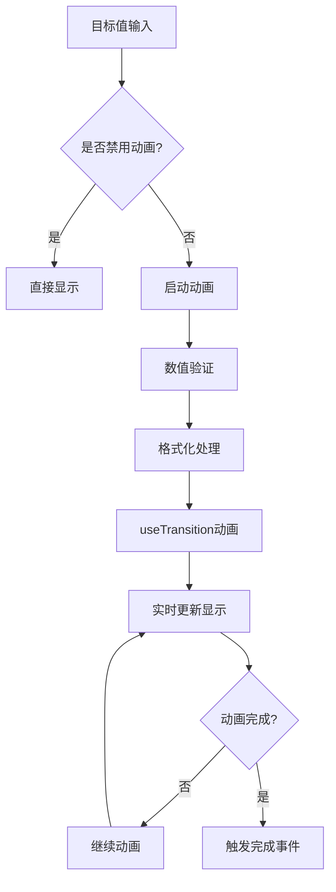

# 数据展示组件

<cite>
**本文档中引用的文件**
- [src/types/component/index.ts](file://src/types/component/index.ts)
- [src/types/component/chart.ts](file://src/types/component/chart.ts)
- [src/components/core/tables/art-table/index.vue](file://src/components/core/tables/art-table/index.vue)
- [src/components/core/charts/art-bar-chart/index.vue](file://src/components/core/charts/art-bar-chart/index.vue)
- [src/components/core/charts/art-line-chart/index.vue](file://src/components/core/charts/art-line-chart/index.vue)
- [src/components/core/text-effect/art-count-to/index.vue](file://src/components/core/text-effect/art-count-to/index.vue)
- [src/components/core/cards/art-stats-card/index.vue](file://src/components/core/cards/art-stats-card/index.vue)
- [src/components/core/cards/art-progress-card/index.vue](file://src/components/core/cards/art-progress-card/index.vue)
- [src/hooks/core/useChart.ts](file://src/hooks/core/useChart.ts)
</cite>

## 目录
1. [概述](#概述)
2. [核心类型定义](#核心类型定义)
3. [表格组件](#表格组件)
4. [图表组件](#图表组件)
5. [卡片组件](#卡片组件)
6. [数字动画组件](#数字动画组件)
7. [性能优化策略](#性能优化策略)
8. [最佳实践](#最佳实践)
9. [故障排除](#故障排除)

## 概述

Art Design Pro 提供了一套完整的数据可视化组件库，包含表格、图表、卡片和动画组件，专为现代Web应用设计。该组件库采用Vue 3 + TypeScript构建，提供了类型安全的配置、高性能的渲染和丰富的交互体验。

### 核心特性

- **类型安全**：完整的TypeScript类型定义，确保开发时的类型检查
- **高性能**：基于ECharts的图表渲染，支持大数据量优化
- **响应式设计**：自适应不同屏幕尺寸和设备
- **主题适配**：支持深色/浅色主题自动切换
- **懒加载**：智能的组件懒加载和可视区域检测

## 核心类型定义

### ColumnOption 接口

ColumnOption是表格列配置的核心接口，提供了丰富的列配置选项：


**图表来源**
- [src/types/component/index.ts](file://src/types/component/index.ts#L48-L88)
- [src/types/component/index.ts](file://src/types/component/index.ts#L91-L105)

### 图表类型系统

图表组件采用了统一的类型系统，支持多种图表类型：


**图表来源**
- [src/types/component/chart.ts](file://src/types/component/chart.ts#L71-L173)

**章节来源**
- [src/types/component/index.ts](file://src/types/component/index.ts#L48-L146)
- [src/types/component/chart.ts](file://src/types/component/chart.ts#L71-L325)

## 表格组件

### ArtTable 组件架构

ArtTable是基于Element Plus ElTable的增强版表格组件，提供了更丰富的功能和更好的性能：


**图表来源**
- [src/components/core/tables/art-table/index.vue](file://src/components/core/tables/art-table/index.vue#L1-L343)

### 核心功能特性

#### 1. 列配置系统
- **类型化列配置**：支持selection、expand、index、globalIndex等内置类型
- **灵活的渲染选项**：支持自定义formatter函数和插槽渲染
- **响应式布局**：支持固定列、宽度调整和排序过滤

#### 2. 分页控制
- **智能分页**：根据屏幕尺寸自动调整分页布局
- **自定义配置**：支持每页显示数量、布局样式等配置
- **事件驱动**：提供分页变更事件回调

#### 3. 插槽渲染系统
- **内容插槽**：支持列内容和表头的自定义插槽
- **作用域插槽**：提供row、column、$index等上下文信息
- **性能优化**：智能的插槽渲染和缓存机制

**章节来源**
- [src/components/core/tables/art-table/index.vue](file://src/components/core/tables/art-table/index.vue#L1-L343)

## 图表组件

### ECharts集成架构

所有图表组件都基于统一的useChart钩子，提供了完整的生命周期管理和性能优化：


**图表来源**
- [src/hooks/core/useChart.ts](file://src/hooks/core/useChart.ts#L1-L746)

### 图表组件类型

#### 柱状图 (ArtBarChart)
- **数据格式**：支持单组和多组数据
- **样式配置**：圆角、渐变色、堆叠显示
- **交互功能**：提示框、图例、动画效果

#### 折线图 (ArtLineChart)
- **动画系统**：阶梯式动画效果，支持多数据系列
- **平滑曲线**：可配置的贝塞尔曲线
- **区域填充**：渐变色区域填充

#### 饼图/环形图
- **数据格式**：键值对数据结构
- **标签配置**：支持内外标签显示
- **交互效果**：悬停高亮、点击交互

### 性能优化机制

#### 1. 可视区域检测
- **IntersectionObserver**：智能检测图表是否可见
- **延迟初始化**：未可见时延迟初始化，提升首屏性能
- **自动销毁**：组件卸载时自动清理资源

#### 2. 主题适配
- **CSS变量**：基于CSS变量的主题系统
- **自动切换**：深色/浅色主题自动适配
- **样式缓存**：避免重复的样式计算

#### 3. 响应式调整
- **防抖处理**：窗口resize事件防抖
- **多延迟策略**：不同场景下的延迟策略
- **requestAnimationFrame**：优化动画性能

**章节来源**
- [src/components/core/charts/art-bar-chart/index.vue](file://src/components/core/charts/art-bar-chart/index.vue#L1-L204)
- [src/components/core/charts/art-line-chart/index.vue](file://src/components/core/charts/art-line-chart/index.vue#L1-L372)
- [src/hooks/core/useChart.ts](file://src/hooks/core/useChart.ts#L1-L746)

## 卡片组件

### 设计模式

卡片组件采用统一的设计模式，提供了多种数据展示形式：


**图表来源**
- [src/components/core/cards/art-stats-card/index.vue](file://src/components/core/cards/art-stats-card/index.vue#L38-L67)
- [src/components/core/cards/art-progress-card/index.vue](file://src/components/core/cards/art-progress-card/index.vue#L32-L50)

### 数据映射策略

#### 1. 统计卡片 (ArtStatsCard)
- **数字滚动**：集成art-count-to组件实现平滑动画
- **格式化显示**：支持小数位数、千分位分隔符
- **图标系统**：SVG图标集成，支持自定义样式

#### 2. 进度卡片 (ArtProgressCard)
- **进度动画**：基于requestAnimationFrame的平滑进度动画
- **颜色配置**：支持自定义进度条颜色
- **实时更新**：百分比变化时自动重新动画

#### 3. 图表卡片
- **迷你图表**：支持内嵌的小型图表
- **数据绑定**：与主数据显示同步
- **响应式布局**：自适应卡片尺寸

**章节来源**
- [src/components/core/cards/art-stats-card/index.vue](file://src/components/core/cards/art-stats-card/index.vue#L1-L68)
- [src/components/core/cards/art-progress-card/index.vue](file://src/components/core/cards/art-progress-card/index.vue#L1-L87)

## 数字动画组件

### ArtCountTo 实现原理

art-count-to是一个高性能的数字滚动动画组件，基于VueUse的useTransition实现：



**图表来源**
- [src/components/core/text-effect/art-count-to/index.vue](file://src/components/core/text-effect/art-count-to/index.vue#L1-L311)

### 核心特性

#### 1. 类型安全的配置
- **严格类型检查**：完整的TypeScript类型定义
- **默认值处理**：智能的默认值配置
- **边界验证**：数值范围和精度验证

#### 2. 高性能动画
- **requestAnimationFrame**：原生动画性能优化
- **缓动函数**：支持多种缓动效果
- **中断处理**：支持动画暂停和重置

#### 3. 格式化功能
- **小数位控制**：精确的小数位数设置
- **千分位分隔**：支持自定义分隔符
- **前后缀支持**：货币符号、单位等

**章节来源**
- [src/components/core/text-effect/art-count-to/index.vue](file://src/components/core/text-effect/art-count-to/index.vue#L1-L311)

## 性能优化策略

### 大数据量优化

#### 1. 虚拟滚动技术
- **元素复用**：只渲染可见区域的元素
- **动态高度**：支持不等高的列表项
- **预加载机制**：提前加载即将可见的元素

#### 2. 懒加载策略
- **组件懒加载**：按需加载组件模块
- **图片懒加载**：基于IntersectionObserver的图片懒加载
- **数据懒加载**：分页或无限滚动的数据加载

#### 3. 渲染优化
- **防抖处理**：大量数据更新时的防抖处理
- **批量更新**：使用nextTick进行批量DOM更新
- **内存管理**：及时清理不需要的引用和事件监听器

### 常见渲染问题解决方案

#### 1. 内存泄漏防护
```typescript
// 组件卸载时的清理机制
onUnmounted(() => {
  // 清理定时器
  timers.forEach(timer => clearTimeout(timer))
  // 清理观察者
  observer?.disconnect()
  // 清理事件监听器
  chart?.dispose()
})
```

#### 2. 动画性能优化
- **requestAnimationFrame**：替代setTimeout实现流畅动画
- **CSS硬件加速**：利用GPU加速的transform属性
- **动画队列管理**：避免同时执行多个动画

#### 3. 主题切换优化
- **CSS变量**：使用CSS变量实现主题切换
- **样式缓存**：缓存计算后的样式配置
- **批量更新**：主题切换时的批量样式更新

## 最佳实践

### 1. 类型安全的使用
```typescript
// 推荐的类型使用方式
const columns: ColumnOption[] = [
  {
    type: 'index',
    label: '序号',
    width: 60
  },
  {
    prop: 'name',
    label: '姓名',
    formatter: (row) => row.name.toUpperCase()
  }
]

const pagination: PaginationConfig = {
  currentPage: 1,
  pageSize: 10,
  total: 100
}
```

### 2. 性能优化建议
- **合理使用懒加载**：对于大数据量的表格和图表
- **避免频繁的深度监听**：使用浅比较或自定义比较函数
- **组件缓存**：对于不经常变化的内容使用keep-alive

### 3. 主题适配
- **CSS变量使用**：统一使用CSS变量管理主题
- **暗色模式支持**：确保组件在暗色模式下的可用性
- **响应式设计**：考虑不同屏幕尺寸的显示效果

### 4. 可访问性
- **语义化HTML**：使用正确的HTML标签
- **键盘导航**：支持键盘操作
- **屏幕阅读器**：提供适当的ARIA属性

## 故障排除

### 常见问题及解决方案

#### 1. 图表不显示
**问题**：图表容器为空白或不显示
**解决方案**：
- 检查容器高度是否正确设置
- 确认数据格式是否符合要求
- 验证ECharts实例是否成功创建

#### 2. 性能问题
**问题**：大数据量时出现卡顿
**解决方案**：
- 启用虚拟滚动
- 使用分页加载
- 优化数据更新频率

#### 3. 主题不生效
**问题**：主题切换后样式没有变化
**解决方案**：
- 检查CSS变量是否正确设置
- 确认useChart钩子的autoTheme配置
- 验证样式缓存是否正确清除

#### 4. 内存泄漏
**问题**：长时间使用后内存占用过高
**解决方案**：
- 确保组件卸载时正确清理资源
- 检查事件监听器是否正确移除
- 验证定时器是否及时清理

### 调试工具

#### 1. 开发者工具
- **Vue DevTools**：监控组件状态和性能
- **浏览器性能面板**：分析渲染性能
- **内存分析器**：检测内存泄漏

#### 2. 组件调试
- **日志输出**：在关键节点添加日志
- **状态检查**：验证组件状态的正确性
- **性能监控**：记录关键操作的执行时间

通过遵循这些最佳实践和优化策略，可以充分发挥Art Design Pro数据可视化组件库的强大功能，构建高性能、用户体验优秀的数据展示应用。