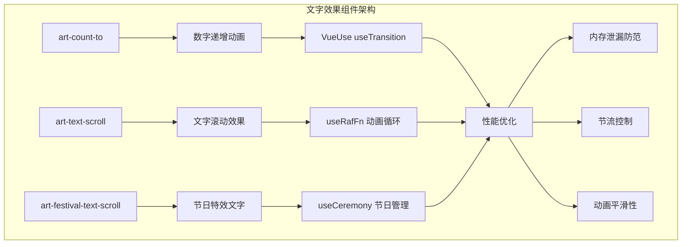
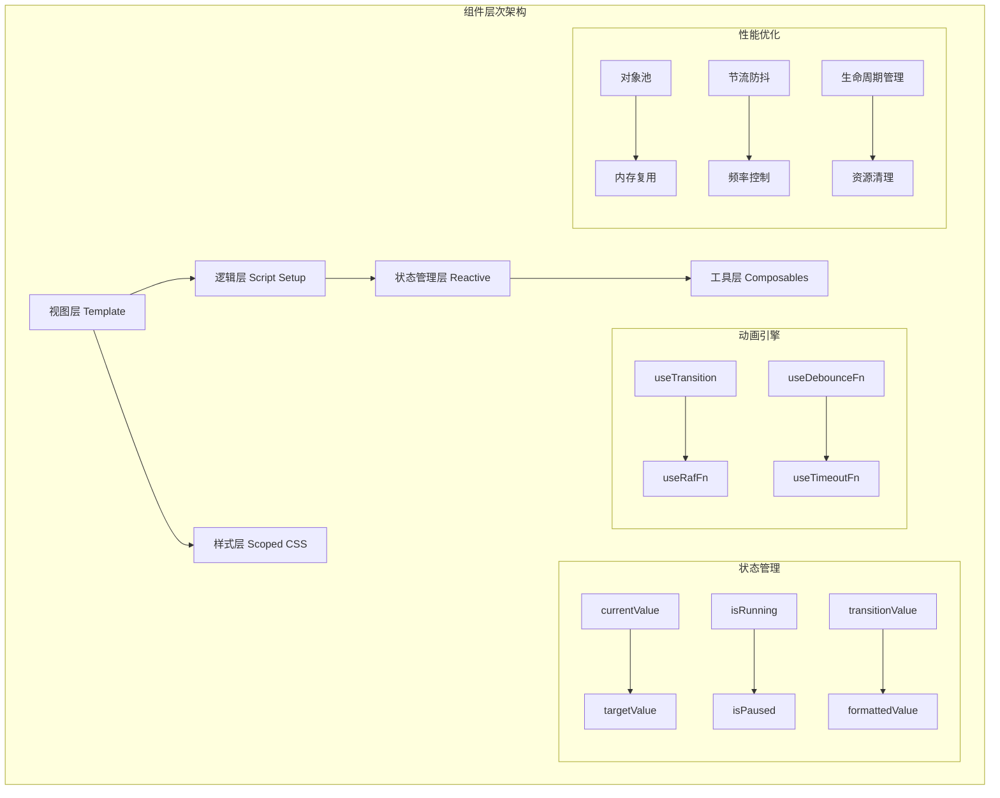
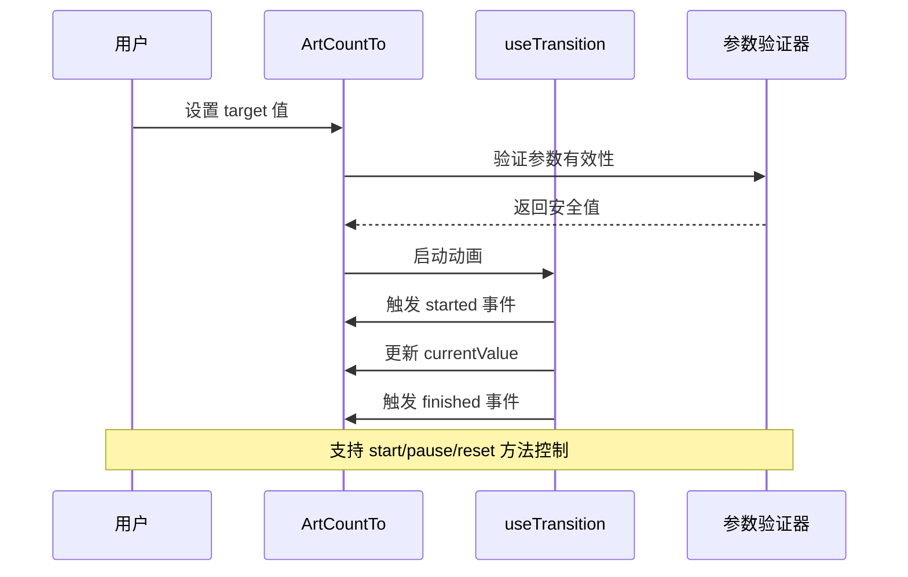
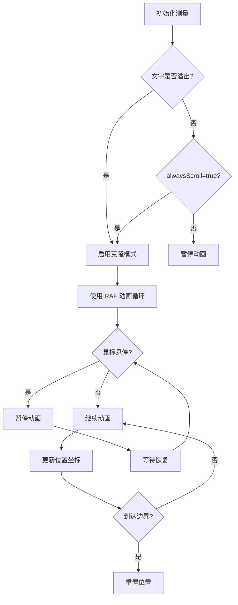
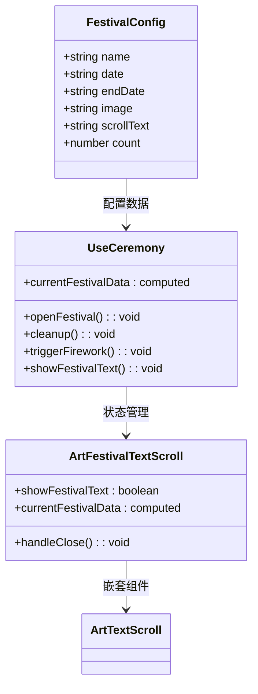

# 文字效果组件

<cite>
**本文档中引用的文件**
- [src/components/core/text-effect/art-count-to/index.vue](file://src/components/core/text-effect/art-count-to/index.vue)
- [src/components/core/text-effect/art-text-scroll/index.vue](file://src/components/core/text-effect/art-text-scroll/index.vue)
- [src/components/core/text-effect/art-festival-text-scroll/index.vue](file://src/components/core/text-effect/art-festival-text-scroll/index.vue)
- [src/views/widgets/count-to/index.vue](file://src/views/widgets/count-to/index.vue)
- [src/views/widgets/text-scroll/index.vue](file://src/views/widgets/text-scroll/index.vue)
- [src/hooks/core/useCeremony.ts](file://src/hooks/core/useCeremony.ts)
- [src/config/modules/festival.ts](file://src/config/modules/festival.ts)
- [src/store/modules/setting.ts](file://src/store/modules/setting.ts)
- [src/components/core/layouts/art-fireworks-effect/index.vue](file://src/components/core/layouts/art-fireworks-effect/index.vue)
</cite>

## 目录
1. [简介](#简介)
2. [项目结构](#项目结构)
3. [核心组件](#核心组件)
4. [架构概览](#架构概览)
5. [详细组件分析](#详细组件分析)
6. [性能优化策略](#性能优化策略)
7. [故障排除指南](#故障排除指南)
8. [结论](#结论)

## 简介

Art Design Pro 提供了一套完整而强大的文字效果组件系统，专门用于创建吸引人的视觉体验。该系统包含三个核心组件：`art-count-to` 数字递增动画、`art-text-scroll` 横向/纵向滚动文字以及 `art-festival-text-scroll` 节日特效文字滚动。这些组件不仅提供了丰富的配置选项，还实现了先进的性能优化策略，确保在高频率更新场景下的流畅运行。

## 项目结构

文字效果组件位于项目的 `src/components/core/text-effect/` 目录下，采用模块化架构设计：



**图表来源**
- [src/components/core/text-effect/art-count-to/index.vue](file://src/components/core/text-effect/art-count-to/index.vue#L1-L311)
- [src/components/core/text-effect/art-text-scroll/index.vue](file://src/components/core/text-effect/art-text-scroll/index.vue#L1-L286)
- [src/components/core/text-effect/art-festival-text-scroll/index.vue](file://src/components/core/text-effect/art-festival-text-scroll/index.vue#L1-L33)

**章节来源**
- [src/components/core/text-effect/art-count-to/index.vue](file://src/components/core/text-effect/art-count-to/index.vue#L1-L50)
- [src/components/core/text-effect/art-text-scroll/index.vue](file://src/components/core/text-effect/art-text-scroll/index.vue#L1-L50)
- [src/components/core/text-effect/art-festival-text-scroll/index.vue](file://src/components/core/text-effect/art-festival-text-scroll/index.vue#L1-L33)

## 核心组件

### 组件分类与功能概述

| 组件名称 | 主要功能 | 性能特点 | 应用场景 |
|---------|---------|---------|---------|
| art-count-to | 数字递增动画 | VueUse useTransition + 节流控制 | 统计数字展示、数据可视化 |
| art-text-scroll | 文字滚动效果 | useRafFn 动画循环 + 鼠标悬停暂停 | 公告滚动、新闻轮播 |
| art-festival-text-scroll | 节日特效文字 | 条件渲染 + 动画触发 | 节日庆祝、特殊活动 |

### 技术栈与依赖

所有组件都基于 Vue 3 Composition API 和 VueUse 工具库构建，确保了最佳的性能表现和开发体验。

**章节来源**
- [src/components/core/text-effect/art-count-to/index.vue](file://src/components/core/text-effect/art-count-to/index.vue#L11-L15)
- [src/components/core/text-effect/art-text-scroll/index.vue](file://src/components/core/text-effect/art-text-scroll/index.vue#L46-L52)

## 架构概览

文字效果组件采用了分层架构设计，每一层都有明确的职责分工：



**图表来源**
- [src/components/core/text-effect/art-count-to/index.vue](file://src/components/core/text-effect/art-count-to/index.vue#L136-L142)
- [src/components/core/text-effect/art-text-scroll/index.vue](file://src/components/core/text-effect/art-text-scroll/index.vue#L117-L120)

## 详细组件分析

### art-count-to 数字递增动画组件

#### 核心实现机制

`art-count-to` 组件基于 VueUse 的 `useTransition` 实现了高性能的数字递增动画。该组件的核心特性包括：

##### 配置参数详解

| 参数名 | 类型 | 默认值 | 描述 |
|--------|------|--------|------|
| target | number | 0 | 目标数值，动画结束时显示的值 |
| duration | number | 2000 | 动画持续时间（毫秒），最小100ms，最大60000ms |
| autoStart | boolean | true | 是否自动开始动画 |
| decimals | number | 0 | 小数位数，最多支持10位小数 |
| decimal | string | '.' | 小数点符号 |
| separator | string | '' | 千分位分隔符 |
| prefix | string | '' | 前缀字符串 |
| suffix | string | '' | 后缀字符串 |
| easing | keyof TransitionPresets | 'easeOutExpo' | 缓动函数类型 |
| disabled | boolean | false | 是否禁用动画 |

##### 动画控制流程



**图表来源**
- [src/components/core/text-effect/art-count-to/index.vue](file://src/components/core/text-effect/art-count-to/index.vue#L143-L156)
- [src/components/core/text-effect/art-count-to/index.vue](file://src/components/core/text-effect/art-count-to/index.vue#L182-L224)

##### 性能优化策略

1. **参数验证与边界检查**
   - 使用 `EPSILON` 常量处理浮点数精度问题
   - 实现 `clamp` 函数确保参数在合理范围内
   - 提供默认值回退机制

2. **内存管理**
   - 使用 `shallowRef` 减少不必要的响应式开销
   - 实现 `shouldSkipAnimation` 避免重复动画
   - 提供 `onUnmounted` 生命周期清理

3. **格式化优化**
   - 实现高效的数字格式化算法
   - 支持多种小数点和分隔符配置
   - 使用正则表达式进行千分位分割

**章节来源**
- [src/components/core/text-effect/art-count-to/index.vue](file://src/components/core/text-effect/art-count-to/index.vue#L60-L89)
- [src/components/core/text-effect/art-count-to/index.vue](file://src/components/core/text-effect/art-count-to/index.vue#L95-L116)

### art-text-scroll 文字滚动组件

#### 滚动模式与控制机制

`art-text-scroll` 组件提供了灵活的文字滚动功能，支持多种滚动模式：

##### 滚动方向配置

| 方向 | 描述 | 实现方式 |
|------|------|----------|
| left | 向左滚动 | 水平布局，负向位移 |
| right | 向右滚动 | 水平布局，正向位移 |
| up | 向上滚动 | 垂直布局，负向位移 |
| down | 向下滚动 | 垂直布局，正向位移 |

##### 动画实现原理



**图表来源**
- [src/components/core/text-effect/art-text-scroll/index.vue](file://src/components/core/text-effect/art-text-scroll/index.vue#L129-L138)
- [src/components/core/text-effect/art-text-scroll/index.vue](file://src/components/core/text-effect/art-text-scroll/index.vue#L221-L248)

##### 性能优化技术

1. **动画循环优化**
   - 使用 `useRafFn` 替代 `requestAnimationFrame`
   - 实现基于时间戳的精确动画控制
   - 支持鼠标悬停暂停功能

2. **尺寸测量优化**
   - 使用 `useDebounceFn` 防抖处理尺寸变化
   - 实现智能的克隆逻辑判断
   - 支持动态内容更新

3. **渲染优化**
   - 使用 `willChange` 提示浏览器优化
   - 实现条件渲染减少 DOM 操作
   - 支持渐隐渐显过渡效果

**章节来源**
- [src/components/core/text-effect/art-text-scroll/index.vue](file://src/components/core/text-effect/art-text-scroll/index.vue#L122-L124)
- [src/components/core/text-effect/art-text-scroll/index.vue](file://src/components/core/text-effect/art-text-scroll/index.vue#L191-L216)

### art-festival-text-scroll 节日特效组件

#### 节日动画触发机制

`art-festival-text-scroll` 组件集成了完整的节日庆祝功能，通过 `useCeremony` hook 实现智能的节日检测和动画触发：

##### 节日配置系统



**图表来源**
- [src/config/modules/festival.ts](file://src/config/modules/festival.ts#L26-L51)
- [src/hooks/core/useCeremony.ts](file://src/hooks/core/useCeremony.ts#L68-L185)
- [src/components/core/text-effect/art-festival-text-scroll/index.vue](file://src/components/core/text-effect/art-festival-text-scroll/index.vue#L19-L32)

##### 动画序列控制

节日特效遵循严格的动画序列：

1. **烟花效果阶段**
   - 延迟启动（300ms）
   - 间隔播放（1000ms/次）
   - 可配置播放次数（默认3次）

2. **文字显示阶段**
   - 烟花结束后延迟显示（2000ms）
   - 渐显动画效果
   - 支持手动关闭

**章节来源**
- [src/hooks/core/useCeremony.ts](file://src/hooks/core/useCeremony.ts#L53-L62)
- [src/hooks/core/useCeremony.ts](file://src/hooks/core/useCeremony.ts#L133-L150)

## 性能优化策略

### 内存泄漏防范措施

#### 对象池模式

组件系统广泛使用对象池模式来优化内存使用：

```mermaid
graph LR
subgraph "对象池管理"
A[预创建对象] --> B[循环索引分配]
B --> C[标记活跃状态]
C --> D[回收到池中]
D --> A
E[时间复杂度优化] --> F[O(1)查找]
F --> G[避免Array.find]
end
```

**图表来源**
- [src/components/core/layouts/art-fireworks-effect/index.vue](file://src/components/core/layouts/art-fireworks-effect/index.vue#L230-L247)

#### 生命周期管理

每个组件都实现了完善的生命周期管理：

1. **自动清理机制**
   - `onUnmounted` 钩子确保资源释放
   - 动画定时器自动停止
   - 事件监听器自动移除

2. **状态重置**
   - 组件销毁时重置所有状态
   - 清理缓存和临时数据
   - 重置动画状态

**章节来源**
- [src/components/core/text-effect/art-count-to/index.vue](file://src/components/core/text-effect/art-count-to/index.vue#L277-L282)
- [src/components/core/text-effect/art-text-scroll/index.vue](file://src/components/core/text-effect/art-text-scroll/index.vue#L282-L284)

### 节流控制与频率管理

#### 防抖与节流策略

| 优化技术 | 应用场景 | 实现方式 |
|---------|---------|----------|
| useDebounceFn | 尺寸变化监听 | 150ms 防抖 |
| useThrottleFn | 频繁更新 | 时间窗口控制 |
| useTimeoutFn | 延迟执行 | setTimeout 替代 |
| useIntervalFn | 定时任务 | setInterval 替代 |

#### 动画帧率优化

1. **RAF 动画循环**
   - 使用 `useRafFn` 实现同步显示器刷新率
   - 基于时间戳的精确动画控制
   - 自动暂停和恢复机制

2. **智能暂停策略**
   - 鼠标悬停时暂停动画
   - 文字未溢出时自动暂停
   - 可配置的暂停行为

**章节来源**
- [src/components/core/text-effect/art-text-scroll/index.vue](file://src/components/core/text-effect/art-text-scroll/index.vue#L216-L218)
- [src/components/core/text-effect/art-text-scroll/index.vue](file://src/components/core/text-effect/art-text-scroll/index.vue#L221-L248)

## 故障排除指南

### 常见问题与解决方案

#### 数字显示异常

**问题症状：**
- 数字显示不正确
- 小数位数异常
- 格式化错误

**排查步骤：**
1. 检查 `target` 值是否为有效数字
2. 验证 `decimals` 参数范围（0-10）
3. 确认 `decimal` 和 `separator` 符号设置

**解决方案：**
```typescript
// 使用参数验证函数
const safeTarget = computed(() => validateNumber(props.target, 'target', 0))
const safeDecimals = computed(() => clamp(validateNumber(props.decimals, 'decimals', 0), 0, 10))
```

#### 动画卡顿问题

**问题症状：**
- 动画不流畅
- 帧率下降
- CPU 使用率高

**排查步骤：**
1. 检查是否有过多同时运行的动画
2. 验证 `speed` 和 `duration` 参数设置
3. 确认浏览器兼容性

**解决方案：**
```typescript
// 使用 RAF 动画循环
const { pause, resume } = useRafFn(({ timestamp }) => {
  // 基于时间戳的精确动画控制
  const delta = (timestamp - lastTimestamp) / 1000
  const distance = props.speed * delta
  // ... 动画逻辑
})
```

#### 内存泄漏问题

**问题症状：**
- 页面内存持续增长
- 组件卸载后仍有活动监听器
- 动画定时器未清理

**排查步骤：**
1. 检查 `onUnmounted` 生命周期钩子
2. 验证事件监听器是否正确移除
3. 确认定时器是否被正确清理

**解决方案：**
```typescript
// 实现完整的生命周期管理
onMounted(() => {
  // 启动动画
  resume()
})

onBeforeUnmount(() => {
  // 清理动画
  pause()
  
  // 清理其他资源
  fireworksInterval?.pause()
})
```

### 调试工具与技巧

#### 性能监控

1. **动画状态监控**
   - 使用 Vue DevTools 观察组件状态
   - 监控 `isRunning` 和 `isPaused` 状态
   - 检查 `currentValue` 和 `targetValue` 变化

2. **内存使用监控**
   - 使用浏览器开发者工具的 Memory 面板
   - 监控对象池的使用情况
   - 检查是否有未释放的定时器

#### 日志记录

组件提供了完整的事件回调机制，便于调试：

```typescript
// 动画事件监听
const handleAnimationStarted = (value: number) => {
  console.log('动画开始，目标值:', value)
}

const handleAnimationFinished = (value: number) => {
  console.log('动画完成，最终值:', value)
}

const handleAnimationPaused = (value: number) => {
  console.log('动画暂停，当前值:', value)
}
```

**章节来源**
- [src/components/core/text-effect/art-count-to/index.vue](file://src/components/core/text-effect/art-count-to/index.vue#L146-L158)
- [src/components/core/text-effect/art-text-scroll/index.vue](file://src/components/core/text-effect/art-text-scroll/index.vue#L250-L255)

## 结论

Art Design Pro 的文字效果组件系统展现了现代前端开发的最佳实践。通过精心设计的架构和全面的性能优化策略，这些组件不仅提供了丰富的视觉效果，还确保了在各种使用场景下的稳定性和效率。

### 核心优势

1. **高性能动画**：基于 VueUse 的原生动画库，提供流畅的用户体验
2. **智能优化**：对象池、防抖节流等技术确保最佳性能
3. **灵活配置**：丰富的参数选项满足不同业务需求
4. **完善维护**：完整的生命周期管理和错误处理机制

### 最佳实践建议

1. **合理配置参数**：根据实际需求选择合适的动画时长和缓动效果
2. **性能监控**：定期检查组件的内存使用和动画性能
3. **错误处理**：实现适当的错误边界和降级方案
4. **用户体验**：考虑用户的设备性能差异，提供可配置的性能选项

这套文字效果组件系统为开发者提供了一个强大而可靠的解决方案，能够显著提升应用的视觉吸引力和用户体验。