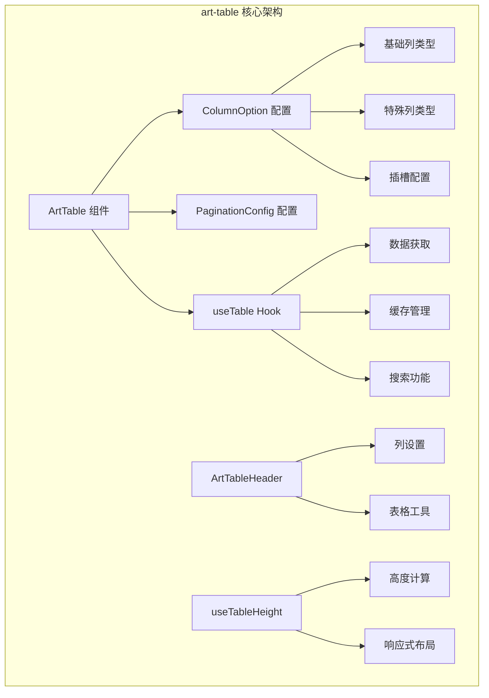
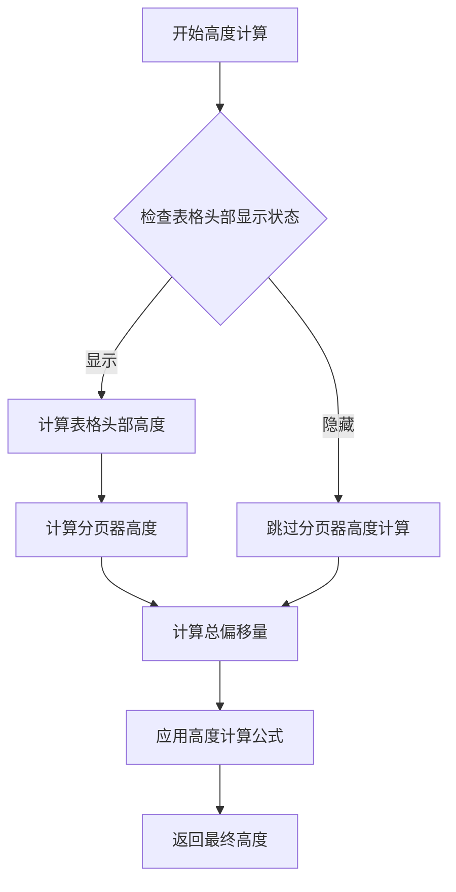
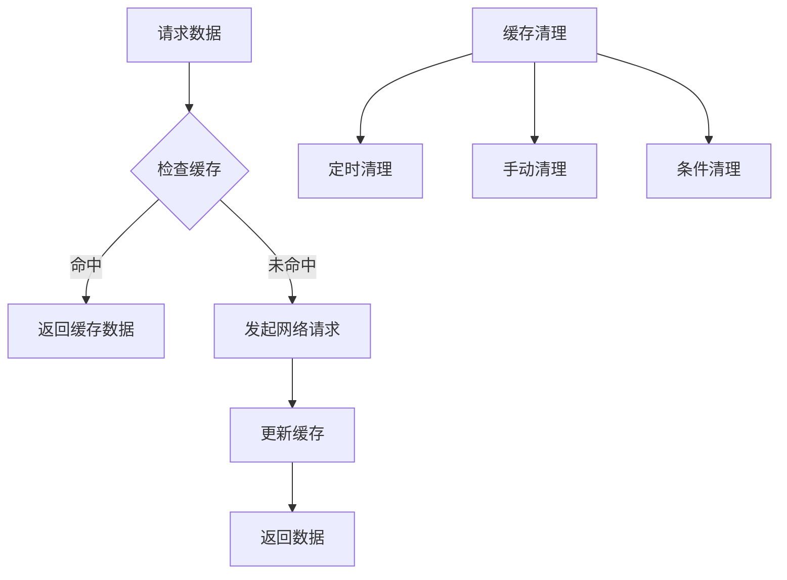

# art-table组件全面文档

<cite>
**本文档中引用的文件**
- [src/types/component/index.ts](file://src/types/component/index.ts)
- [src/components/core/tables/art-table/index.vue](file://src/components/core/tables/art-table/index.vue)
- [src/components/core/tables/art-table/style.scss](file://src/components/core/tables/art-table/style.scss)
- [src/components/core/tables/art-table-header/index.vue](file://src/components/core/tables/art-table-header/index.vue)
- [src/hooks/core/useTable.ts](file://src/hooks/core/useTable.ts)
- [src/hooks/core/useTableColumns.ts](file://src/hooks/core/useTableColumns.ts)
- [src/hooks/core/useTableHeight.ts](file://src/hooks/core/useTableHeight.ts)
- [src/store/modules/table.ts](file://src/store/modules/table.ts)
- [src/utils/table/tableCache.ts](file://src/utils/table/tableUtils.ts)
- [src/utils/table/tableUtils.ts](file://src/utils/table/tableUtils.ts)
- [src/views/examples/tables/basic.vue](file://src/views/examples/tables/basic.vue)
- [src/views/examples/tables/tree.vue](file://src/views/examples/tables/tree.vue)
</cite>

## 目录
1. [简介](#简介)
2. [核心架构](#核心架构)
3. [列配置详解](#列配置详解)
4. [分页配置](#分页配置)
5. [插槽渲染机制](#插槽渲染机制)
6. [响应式布局](#响应式布局)
7. [特殊列类型](#特殊列类型)
8. [样式定制](#样式定制)
9. [性能优化](#性能优化)
10. [常见问题解决方案](#常见问题解决方案)
11. [使用示例](#使用示例)
12. [最佳实践](#最佳实践)

## 简介

art-table是基于Element Plus的增强型表格组件，提供了完整的表格解决方案，包括数据管理、分页控制、列配置、样式定制等功能。该组件专为企业级应用设计，具有良好的扩展性和易用性。

### 主要特性

- **完整的数据管理**：内置useTable Hook，提供数据获取、缓存、搜索等功能
- **灵活的列配置**：支持多种列类型和自定义渲染
- **响应式设计**：自动适配不同屏幕尺寸
- **性能优化**：支持虚拟滚动和大数据量处理
- **样式定制**：提供丰富的SCSS变量和CSS类名扩展

## 核心架构

art-table采用模块化架构设计，主要由以下几个部分组成：



**图表来源**
- [src/components/core/tables/art-table/index.vue](file://src/components/core/tables/art-table/index.vue#L77-L343)
- [src/hooks/core/useTable.ts](file://src/hooks/core/useTable.ts#L115-L737)

**章节来源**
- [src/components/core/tables/art-table/index.vue](file://src/components/core/tables/art-table/index.vue#L1-L50)
- [src/types/component/index.ts](file://src/types/component/index.ts#L48-L105)

## 列配置详解

ColumnOption接口定义了表格列的所有配置选项，支持丰富的自定义功能。

### 基础属性配置

| 属性名 | 类型 | 默认值 | 说明 |
|--------|------|--------|------|
| `type` | `'selection'\|'expand'\|'index'\|'globalIndex'` | - | 列类型 |
| `prop` | `string` | - | 列对应的数据字段名 |
| `label` | `string` | - | 列标题 |
| `width` | `string \| number` | - | 列宽度 |
| `minWidth` | `string \| number` | - | 最小列宽度 |
| `fixed` | `boolean \| 'left' \| 'right'` | - | 固定列设置 |

### 排序和筛选配置

| 属性名 | 类型 | 默认值 | 说明 |
|--------|------|--------|------|
| `sortable` | `boolean` | `false` | 是否可排序 |
| `filters` | `any[]` | - | 筛选器选项 |
| `filterMethod` | `(value: any, row: any) => boolean` | - | 自定义筛选方法 |
| `filterPlacement` | `string` | - | 筛选器位置 |

### 显示控制配置

| 属性名 | 类型 | 默认值 | 说明 |
|--------|------|--------|------|
| `visible` | `boolean` | `true` | 是否显示列 |
| `disabled` | `boolean` | `false` | 是否禁用列 |
| `checked` | `boolean` | `true` | 是否选中显示 |

### 渲染配置

| 属性名 | 类型 | 默认值 | 说明 |
|--------|------|--------|------|
| `formatter` | `(row: T) => any` | - | 格式化函数 |
| `useSlot` | `boolean` | `false` | 是否使用插槽渲染 |
| `slotName` | `string` | `prop` | 插槽名称 |
| `useHeaderSlot` | `boolean` | `false` | 是否使用表头插槽 |
| `headerSlotName` | `string` | `${prop}-header` | 表头插槽名称 |

**章节来源**
- [src/types/component/index.ts](file://src/types/component/index.ts#L49-L88)

## 分页配置

PaginationConfig接口提供了完整的分页配置选项，支持多种布局和自定义设置。

### 基础分页配置

| 属性名 | 类型 | 默认值 | 说明 |
|--------|------|--------|------|
| `currentPage` | `number` | 1 | 当前页码 |
| `pageSize` | `number` | 10 | 每页条数 |
| `total` | `number` | 0 | 总条数 |

### 分页器配置选项

| 属性名 | 类型 | 默认值 | 说明 |
|--------|------|--------|------|
| `pageSizes` | `number[]` | `[10, 20, 30, 50, 100]` | 每页显示个数选择器的选项 |
| `layout` | `string` | 动态计算 | 分页器布局 |
| `align` | `'left' \| 'center' \| 'right'` | `'center'` | 对齐方式 |
| `small` | `boolean` | `false` | 是否为小型分页 |
| `background` | `boolean` | `true` | 是否显示背景色 |

### 布局配置

组件根据屏幕宽度自动调整分页器布局：

```typescript
const LAYOUT = {
  MOBILE: 'prev, pager, next, sizes, jumper, total',
  IPAD: 'prev, pager, next, jumper, total',
  DESKTOP: 'total, prev, pager, next, sizes, jumper'
}
```

**章节来源**
- [src/types/component/index.ts](file://src/types/component/index.ts#L92-L105)
- [src/components/core/tables/art-table/index.vue](file://src/components/core/tables/art-table/index.vue#L154-L178)

## 插槽渲染机制

art-table提供了强大的插槽渲染机制，支持自定义内容渲染。

### 插槽类型

1. **默认插槽**：用于自定义单元格内容
2. **表头插槽**：用于自定义表头内容
3. **展开行插槽**：用于自定义展开行内容

### 插槽配置

```typescript
// 使用默认插槽
{
  prop: 'action',
  label: '操作',
  useSlot: true,
  slotName: 'action-cell'
}

// 使用表头插槽
{
  prop: 'name',
  label: '用户名',
  useHeaderSlot: true,
  headerSlotName: 'name-header'
}
```

### 插槽作用域

插槽提供了丰富的作用域变量：

- `$index`: 当前行索引
- `row`: 当前行数据
- `column`: 当前列配置
- `prop`: 列属性名
- `value`: 当前列值

**章节来源**
- [src/types/component/index.ts](file://src/types/component/index.ts#L79-L87)
- [src/components/core/tables/art-table/index.vue](file://src/components/core/tables/art-table/index.vue#L28-L47)

## 响应式布局

art-table实现了完整的响应式布局系统，能够根据不同设备自动调整显示效果。

### 高度自适应

组件使用useTableHeight Hook实现智能高度计算：



**图表来源**
- [src/hooks/core/useTableHeight.ts](file://src/hooks/core/useTableHeight.ts#L37-L82)

### 屏幕适配

组件根据屏幕宽度自动调整：

- **移动端 (< 768px)**：简化布局，减少显示项
- **平板端 (768px - 1024px)**：中等布局，平衡功能和空间
- **桌面端 (> 1024px)**：完整布局，显示所有功能

### 动态高度监听

使用ResizeObserver监听高度变化，避免布局闪烁：

```typescript
// 监听分页器高度变化
useResizeObserver(paginationRef, (entries) => {
  const entry = entries[0]
  if (entry) {
    requestAnimationFrame(() => {
      paginationHeight.value = entry.contentRect.height
    })
  }
})
```

**章节来源**
- [src/components/core/tables/art-table/index.vue](file://src/components/core/tables/art-table/index.vue#L196-L230)
- [src/hooks/core/useTableHeight.ts](file://src/hooks/core/useTableHeight.ts#L1-L105)

## 特殊列类型

art-table支持多种特殊列类型，满足不同的业务需求。

### 选择列 (selection)

```typescript
{
  type: 'selection',
  width: 50,
  selectable: (row, index) => index % 2 === 0
}
```

### 展开行 (expand)

```typescript
{
  type: 'expand',
  formatter: (row) => {
    return h('div', { class: 'expand-content' }, [`展开内容: ${row.id}`])
  }
}
```

### 索引列 (index)

```typescript
{
  type: 'index',
  label: '序号',
  width: 60
}
```

### 全局序号列 (globalIndex)

```typescript
{
  type: 'globalIndex',
  label: '全局序号',
  width: 80
}
```

### 列拖拽排序

结合useTableColumns Hook实现列的拖拽排序：

```typescript
const { reorderColumns } = useTableColumns(() => [
  { prop: 'name', label: '姓名', visible: true },
  { prop: 'age', label: '年龄', visible: true }
])

// 重新排序
reorderColumns(0, 2) // 将第一个列移动到最后
```

**章节来源**
- [src/components/core/tables/art-table/index.vue](file://src/components/core/tables/art-table/index.vue#L13-L27)
- [src/hooks/core/useTableColumns.ts](file://src/hooks/core/useTableColumns.ts#L235-L249)

## 样式定制

art-table提供了丰富的样式定制选项，支持SCSS变量覆盖和CSS类名扩展。

### SCSS变量覆盖

```scss
// 自定义主题色
:root {
  --theme-color: #409eff;
  --theme-hover-color: #66b1ff;
  --theme-active-color: #3a8ee6;
}

// 自定义表格样式
.art-table {
  // 自定义分页器样式
  .pagination.custom-pagination {
    :deep(.el-pagination) {
      li.is-active {
        background-color: var(--theme-color);
      }
      
      .btn-prev, .btn-next {
        border-color: var(--art-gray-300);
        
        &:hover {
          border-color: var(--theme-color);
        }
      }
    }
  }
  
  // 自定义表格头部样式
  :deep(.el-table__header th) {
    background-color: var(--default-box-color);
    font-weight: 500;
  }
}
```

### CSS类名扩展

```html
<ArtTable
  class="custom-table-style"
  :class="{ 'compact-mode': isCompact }"
/>
```

### 主题配置

通过Pinia store管理全局主题配置：

```typescript
// 表格尺寸配置
const { tableSize } = useTableStore()

// 样式优先级：props > store > 默认值
const size = computed(() => props.size ?? tableSize.value)
```

### 响应式样式

```scss
.art-table {
  // 移动端样式
  @media (width <= 640px) {
    .pagination {
      flex-direction: column;
      align-items: center;
      
      :deep(.el-pagination) {
        margin-bottom: 10px;
      }
    }
  }
}
```

**章节来源**
- [src/components/core/tables/art-table/style.scss](file://src/components/core/tables/art-table/style.scss#L1-L100)
- [src/store/modules/table.ts](file://src/store/modules/table.ts#L36-L47)

## 性能优化

art-table针对大数据量场景进行了多项性能优化。

### 数据缓存机制

使用TableCache类实现智能缓存：



**图表来源**
- [src/utils/table/tableCache.ts](file://src/utils/table/tableCache.ts)

### 缓存策略

| 策略类型 | 说明 | 使用场景 |
|----------|------|----------|
| CLEAR_ALL | 清空所有缓存 | 手动刷新 |
| CLEAR_CURRENT | 清空当前搜索缓存 | 搜索数据 |
| CLEAR_PAGINATION | 清空分页缓存 | 新增数据 |
| KEEP_ALL | 保持缓存不变 | 读取数据 |

### 性能配置

```typescript
const { data, clearCache } = useTable({
  performance: {
    enableCache: true,           // 启用缓存
    cacheTime: 5 * 60 * 1000,   // 缓存时间5分钟
    debounceTime: 300,          // 防抖时间300ms
    maxCacheSize: 50            // 最大缓存条数
  }
})
```

### 内存管理

```typescript
// 定期清理过期缓存
const clearExpiredCache = (): number => {
  if (!cache) return 0
  const cleanedCount = cache.cleanupExpired()
  return cleanedCount
}

// 组件卸载时清理
onUnmounted(() => {
  if (cache) {
    cache.clear()
  }
  if (cacheCleanupTimer) {
    clearInterval(cacheCleanupTimer)
  }
})
```

**章节来源**
- [src/hooks/core/useTable.ts](file://src/hooks/core/useTable.ts#L28-L90)
- [src/utils/table/tableCache.ts](file://src/utils/table/tableCache.ts)

## 常见问题解决方案

### 表头错位问题

**问题描述**：表格列宽计算不准确导致表头与内容错位

**解决方案**：
1. 使用useResizeObserver监听列宽变化
2. 在数据更新后重新计算列宽
3. 确保列配置的width属性正确设置

```typescript
// 监听列宽变化
watch(columns, () => {
  nextTick(() => {
    elTableRef.value?.doLayout()
  })
})
```

### 分页状态不同步

**问题描述**：分页组件与表格数据状态不一致

**解决方案**：
1. 使用统一的分页状态管理
2. 确保分页事件正确触发
3. 避免重复请求

```typescript
// 防止重复调用
let isCurrentChanging = false

const handleCurrentChange = async (newCurrent: number) => {
  if (newCurrent <= 0) return
  if (isCurrentChanging) return
  
  try {
    isCurrentChanging = true
    pagination.current = newCurrent
    await getData()
  } finally {
    isCurrentChanging = false
  }
}
```

### 大数据量性能问题

**问题描述**：大量数据导致表格渲染缓慢

**解决方案**：
1. 启用虚拟滚动（需自行实现）
2. 使用分页加载
3. 优化列配置，减少不必要的渲染

```typescript
// 分页加载示例
const { data, pagination, handleSizeChange, handleCurrentChange } = useTable({
  core: {
    apiFn: fetchLargeDataset,
    apiParams: {
      current: 1,
      size: 50
    }
  }
})
```

### 列配置动态更新

**问题描述**：运行时修改列配置不生效

**解决方案**：
1. 使用ref包装列配置
2. 手动触发表格重新渲染
3. 使用key强制更新组件

```typescript
// 动态列配置
const columns = ref<ColumnOption[]>(initialColumns)

// 更新列配置
const updateColumns = () => {
  columns.value = newColumns
  // 强制重新渲染
  tableKey.value++
}
```

**章节来源**
- [src/components/core/tables/art-table/index.vue](file://src/components/core/tables/art-table/index.vue#L196-L230)
- [src/hooks/core/useTable.ts](file://src/hooks/core/useTable.ts#L503-L531)

## 使用示例

### 基础表格使用

```vue
<template>
  <ArtTable
    rowKey="id"
    :loading="loading"
    :data="data"
    :columns="columns"
    :pagination="pagination"
    @pagination:size-change="handleSizeChange"
    @pagination:current-change="handleCurrentChange"
  />
</template>

<script setup lang="ts">
import { useTable } from '@/hooks/core/useTable'

const { data, columns, loading, pagination, handleSizeChange, handleCurrentChange } = useTable({
  core: {
    apiFn: fetchUserData,
    columnsFactory: () => [
      { prop: 'id', label: 'ID' },
      { prop: 'name', label: '姓名' },
      { prop: 'age', label: '年龄', sortable: true },
      { prop: 'email', label: '邮箱' }
    ]
  }
})
</script>
```

### 树形表格使用

```vue
<template>
  <div class="tree-table-layout">
    <!-- 左侧树形结构 -->
    <div class="tree-container">
      <ElTree :data="treeData" @node-click="handleNodeClick" />
    </div>
    
    <!-- 右侧表格 -->
    <div class="table-container">
      <ArtTable
        rowKey="id"
        :loading="loading"
        :data="data"
        :columns="columns"
        :pagination="pagination"
      />
    </div>
  </div>
</template>
```

### 高级配置示例

```vue
<template>
  <ArtTable
    :loading="loading"
    :data="data"
    :columns="columns"
    :pagination="pagination"
    :border="true"
    :stripe="true"
    :size="tableSize"
  >
    <!-- 自定义列 -->
    <template #action-cell="{ row }">
      <ElButton @click="editRow(row)">编辑</ElButton>
      <ElButton @click="deleteRow(row)">删除</ElButton>
    </template>
    
    <!-- 自定义表头 -->
    <template #name-header>
      <span>用户名</span>
      <ElTooltip content="点击排序">
        <ElIcon><Sort /></ElIcon>
      </ElTooltip>
    </template>
  </ArtTable>
</template>

<script setup lang="ts">
const columns: ColumnOption[] = [
  {
    prop: 'name',
    label: '用户名',
    sortable: true,
    useSlot: true,
    slotName: 'action-cell',
    useHeaderSlot: true,
    headerSlotName: 'name-header'
  }
]
</script>
```

**章节来源**
- [src/views/examples/tables/basic.vue](file://src/views/examples/tables/basic.vue#L1-L64)
- [src/views/examples/tables/tree.vue](file://src/views/examples/tables/tree.vue#L1-L238)

## 最佳实践

### 列配置最佳实践

1. **合理设置列宽**：避免使用过小或过大的列宽
2. **使用语义化命名**：prop使用有意义的字段名
3. **提供默认值**：为可能为空的数据提供默认显示
4. **优化渲染性能**：避免复杂的formatter函数

```typescript
// 推荐的列配置
{
  prop: 'userName',
  label: '用户名',
  width: 120,
  formatter: (row) => row.userName || '--',
  sortable: true
}
```

### 数据管理最佳实践

1. **使用useTable Hook**：充分利用内置的数据管理功能
2. **合理配置缓存**：根据业务需求设置缓存策略
3. **处理错误状态**：提供友好的错误提示
4. **优化搜索体验**：使用防抖搜索避免频繁请求

```typescript
const { data, loading, error, refreshData } = useTable({
  core: {
    apiFn: fetchUserData,
    immediate: true
  },
  performance: {
    enableCache: true,
    debounceTime: 300
  },
  hooks: {
    onError: (error) => {
      console.error('数据加载失败:', error)
      // 显示错误提示
    }
  }
})
```

### 样式定制最佳实践

1. **使用SCSS变量**：便于主题切换和维护
2. **遵循CSS隔离原则**：避免样式污染
3. **提供暗色主题支持**：确保在不同主题下正常显示
4. **优化移动端体验**：考虑触摸交互和屏幕尺寸

```scss
// 主题变量
:root {
  --table-header-bg: var(--default-box-color);
  --table-row-hover: var(--el-fill-color-lighter);
  --table-border-color: var(--art-gray-300);
}

// 样式隔离
.art-table {
  :deep(.el-table) {
    th {
      background-color: var(--table-header-bg);
    }
    
    tr:hover {
      td {
        background-color: var(--table-row-hover);
      }
    }
  }
}
```

### 性能优化最佳实践

1. **合理使用虚拟滚动**：对于超大数据集
2. **优化列配置**：减少不必要的列和复杂渲染
3. **控制缓存大小**：避免内存泄漏
4. **及时清理资源**：组件卸载时清理定时器和订阅

```typescript
// 性能监控
const { cacheInfo } = useTable({
  performance: {
    enableCache: true,
    maxCacheSize: 100
  }
})

// 定期清理缓存
onMounted(() => {
  const cleanupInterval = setInterval(() => {
    clearExpiredCache()
  }, 5 * 60 * 1000) // 每5分钟清理一次
  
  onUnmounted(() => {
    clearInterval(cleanupInterval)
  })
})
```

通过遵循这些最佳实践，可以充分发挥art-table组件的优势，构建高性能、易维护的企业级表格应用。