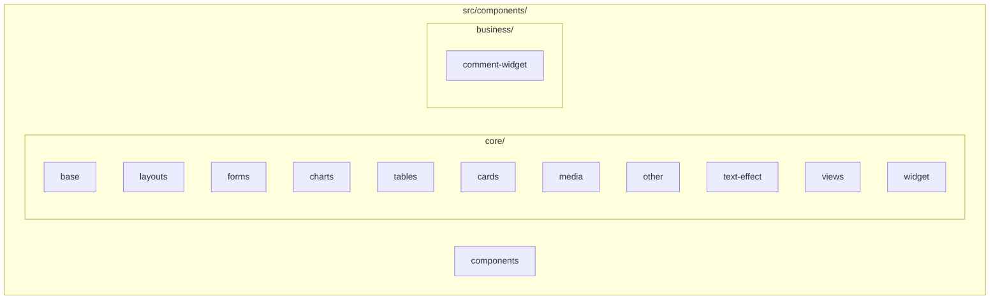
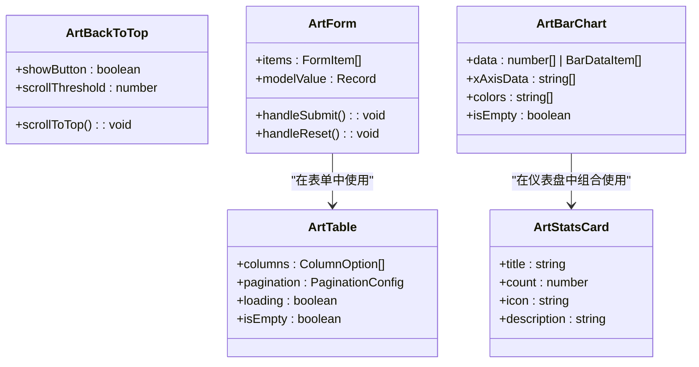
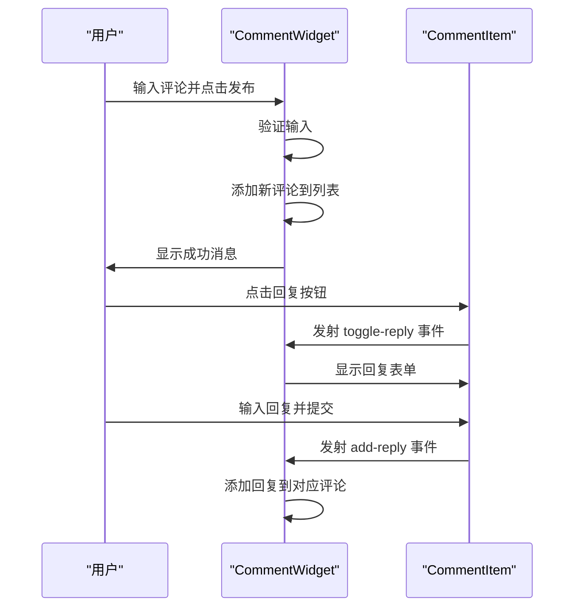
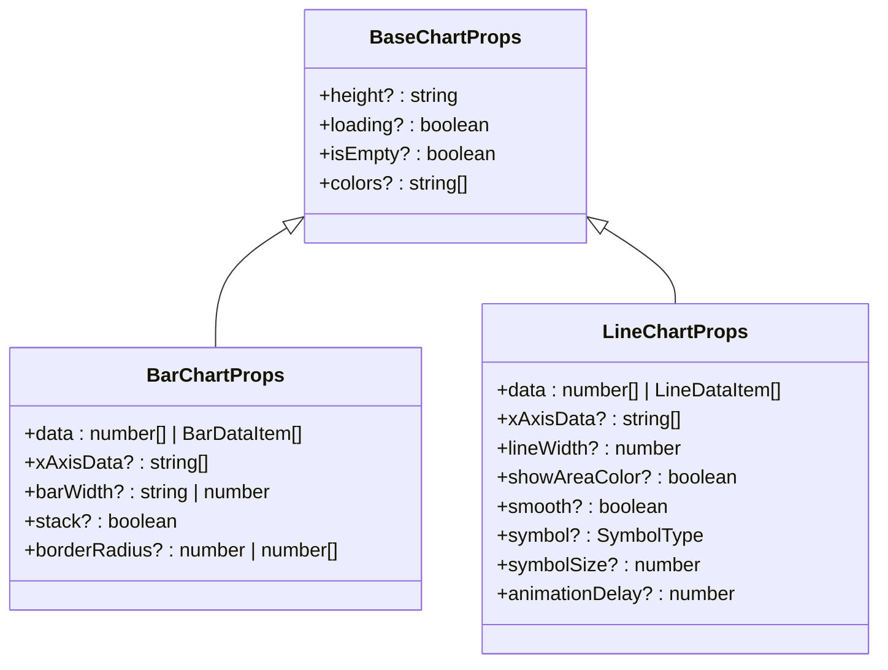

# 组件目录

<cite>
**本文档引用的文件**   
- [art-back-to-top/index.vue](file://src/components/core/base/art-back-to-top/index.vue)
- [art-bar-chart/index.vue](file://src/components/core/charts/art-bar-chart/index.vue)
- [art-line-chart/index.vue](file://src/components/core/charts/art-line-chart/index.vue)
- [art-form/index.vue](file://src/components/core/forms/art-form/index.vue)
- [art-stats-card/index.vue](file://src/components/core/cards/art-stats-card/index.vue)
- [art-table/index.vue](file://src/components/core/tables/art-table/index.vue)
- [art-header-bar/index.vue](file://src/components/core/layouts/art-header-bar/index.vue)
- [comment-widget/index.vue](file://src/components/business/comment-widget/index.vue)
- [chart.ts](file://src/types/component/chart.ts)
- [index.ts](file://src/types/component/index.ts)
- [mixin.scss](file://src/assets/styles/core/mixin.scss)
</cite>

## 目录
1. [项目结构](#项目结构)
2. [核心组件分类](#核心组件分类)
3. [业务组件封装](#业务组件封装)
4. [组件设计规范](#组件设计规范)
5. [样式与主题](#样式与主题)
6. [类型安全开发](#类型安全开发)
7. [使用示例](#使用示例)

## 项目结构

根据项目目录结构，`src/components/` 目录采用分层分类的设计哲学，将组件划分为基础功能组件和业务场景组件两大体系。核心组件位于 `core/` 目录下，按功能类型进一步细分为 `base`（基础）、`layouts`（布局）、`forms`（表单）、`charts`（图表）、`tables`（表格）、`cards`（卡片）等子目录，实现了高内聚、低耦合的模块化组织。



**Diagram sources**
- [art-back-to-top/index.vue](file://src/components/core/base/art-back-to-top/index.vue)
- [art-bar-chart/index.vue](file://src/components/core/charts/art-bar-chart/index.vue)
- [art-form/index.vue](file://src/components/core/forms/art-form/index.vue)
- [art-stats-card/index.vue](file://src/components/core/cards/art-stats-card/index.vue)
- [art-table/index.vue](file://src/components/core/tables/art-table/index.vue)
- [art-header-bar/index.vue](file://src/components/core/layouts/art-header-bar/index.vue)

**Section sources**
- [art-back-to-top/index.vue](file://src/components/core/base/art-back-to-top/index.vue)
- [art-bar-chart/index.vue](file://src/components/core/charts/art-bar-chart/index.vue)
- [art-form/index.vue](file://src/components/core/forms/art-form/index.vue)
- [art-stats-card/index.vue](file://src/components/core/cards/art-stats-card/index.vue)
- [art-table/index.vue](file://src/components/core/tables/art-table/index.vue)
- [art-header-bar/index.vue](file://src/components/core/layouts/art-header-bar/index.vue)

## 核心组件分类

`core/` 目录下的组件遵循单一职责原则，每个组件专注于解决特定的UI或交互问题。`base/` 目录存放最基础的原子组件，如 `art-back-to-top` 返回顶部按钮；`layouts/` 目录提供页面级布局结构，如 `art-header-bar` 顶部导航栏；`forms/` 目录封装了表单相关的复合组件，如 `art-form` 表单生成器；`charts/` 目录基于 ECharts 封装了各类图表，如 `art-bar-chart` 柱状图；`tables/` 目录提供了增强的表格组件 `art-table`；`cards/` 目录则包含各种信息展示卡片，如 `art-stats-card` 统计卡片。



**Diagram sources**
- [art-back-to-top/index.vue](file://src/components/core/base/art-back-to-top/index.vue)
- [art-form/index.vue](file://src/components/core/forms/art-form/index.vue)
- [art-bar-chart/index.vue](file://src/components/core/charts/art-bar-chart/index.vue)
- [art-stats-card/index.vue](file://src/components/core/cards/art-stats-card/index.vue)
- [art-table/index.vue](file://src/components/core/tables/art-table/index.vue)

**Section sources**
- [art-back-to-top/index.vue](file://src/components/core/base/art-back-to-top/index.vue)
- [art-form/index.vue](file://src/components/core/forms/art-form/index.vue)
- [art-bar-chart/index.vue](file://src/components/core/charts/art-bar-chart/index.vue)
- [art-stats-card/index.vue](file://src/components/core/cards/art-stats-card/index.vue)
- [art-table/index.vue](file://src/components/core/tables/art-table/index.vue)

## 业务组件封装

`business/` 目录下的 `comment-widget` 组件是一个典型的业务场景组件，它将评论功能的UI和逻辑封装在一起。该组件包含一个表单用于发布新评论，并通过 `CommentItem` 子组件递归渲染评论列表，支持评论的回复功能。组件通过 `props` 接收评论数据，通过 `events` 向外发射 `add-reply` 等事件，实现了清晰的父子通信。



**Diagram sources**
- [comment-widget/index.vue](file://src/components/business/comment-widget/index.vue)

**Section sources**
- [comment-widget/index.vue](file://src/components/business/comment-widget/index.vue)

## 组件设计规范

### Props、Events、Slots 设计

组件遵循 Vue 的最佳实践，通过 `defineProps` 定义输入属性（Props），通过 `defineEmits` 定义输出事件（Events），并通过 `<slot>` 提供内容分发（Slots）能力。例如，`art-form` 组件通过 `items` Prop 接收表单项配置，通过 `submit` 和 `reset` 事件向外通知表单操作，同时允许用户通过具名插槽自定义表单项的渲染。

### 组件属性接口定义
```typescript
interface FormItem {
  key: string
  label: string | (() => VNode) | Component
  type?: keyof typeof componentMap | string
  render?: (() => VNode) | Component
  hidden?: boolean
  span?: number
  options?: Record<string, any>
  props?: Record<string, any>
  slots?: Record<string, (() => any) | undefined>
  placeholder?: string
}
```

**Section sources**
- [art-form/index.vue](file://src/components/core/forms/art-form/index.vue)

## 样式与主题

组件通过 SCSS 实现样式隔离与主题继承。使用 `scoped` 样式确保组件样式不会污染全局，通过 CSS 变量（如 `var(--el-color-primary)`）实现主题继承。`assets/styles/core/mixin.scss` 文件定义了可复用的 Sass 混合宏，如 `ellipsis` 用于文本溢出省略，`userSelect` 用于控制文本选择行为。

```scss
// 使用混合宏
.title {
  @include ellipsis(2);
  @include userSelect(none);
}
```

**Section sources**
- [mixin.scss](file://src/assets/styles/core/mixin.scss)

## 类型安全开发

项目通过 `types/component/` 目录下的 TypeScript 类型定义实现了类型安全的组件开发。`chart.ts` 文件定义了所有图表组件的 Props 类型，如 `BarChartProps` 和 `LineChartProps`，它们都继承自 `BaseChartProps` 并扩展了特定属性。`index.ts` 文件则定义了表格列配置 `ColumnOption` 等通用类型。这些类型在组件中通过 `defineProps<BarChartProps>()` 被引用，确保了开发时的类型检查和智能提示。



**Diagram sources**
- [chart.ts](file://src/types/component/chart.ts)

**Section sources**
- [chart.ts](file://src/types/component/chart.ts)
- [index.ts](file://src/types/component/index.ts)

## 使用示例

### 基础用法
```vue
<ArtBackToTop />
```

### 属性配置
```vue
<ArtStatsCard 
  title="用户总数" 
  :count="12345" 
  icon="ri:user-line" 
  description="较昨日增长 12%" 
  showArrow 
/>
```

### 事件监听
```vue
<ArtForm @submit="handleSubmit" @reset="handleReset" />
```

### 插槽使用
```vue
<ArtForm>
  <template #customComponent>
    <div>自定义组件内容</div>
  </template>
</ArtForm>
```

**Section sources**
- [art-back-to-top/index.vue](file://src/components/core/base/art-back-to-top/index.vue)
- [art-stats-card/index.vue](file://src/components/core/cards/art-stats-card/index.vue)
- [art-form/index.vue](file://src/components/core/forms/art-form/index.vue)