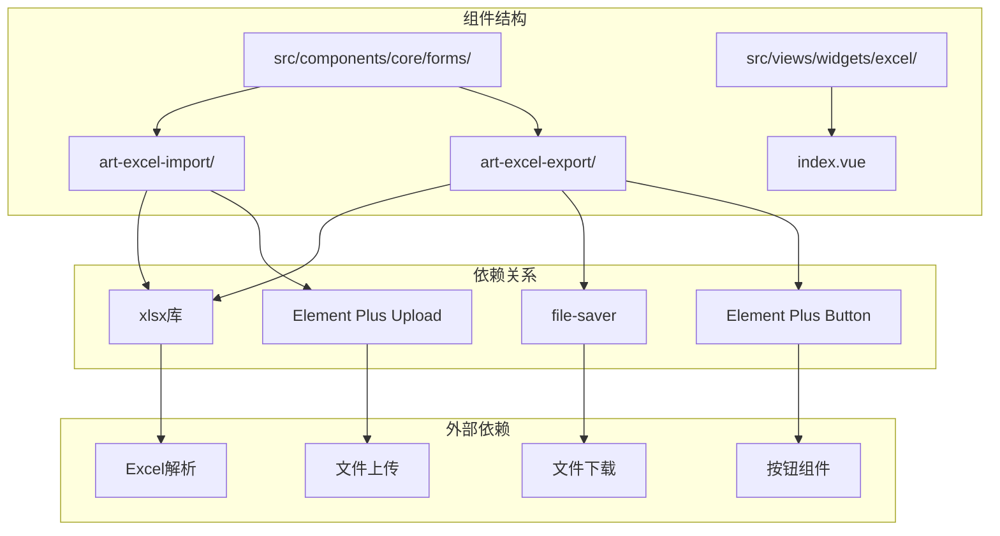
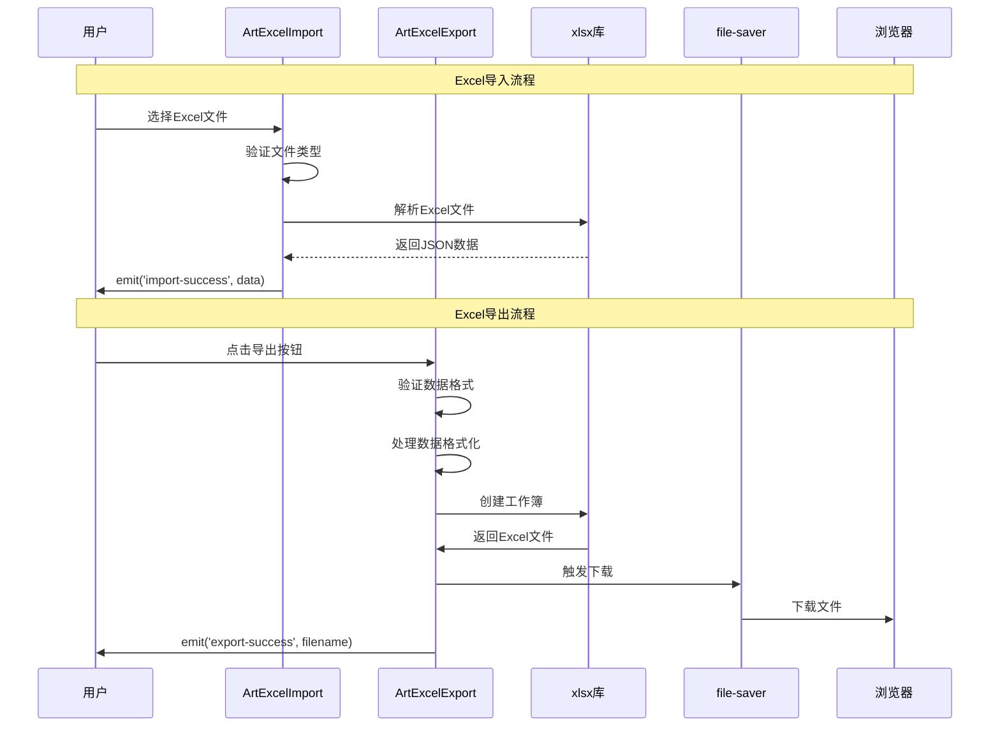
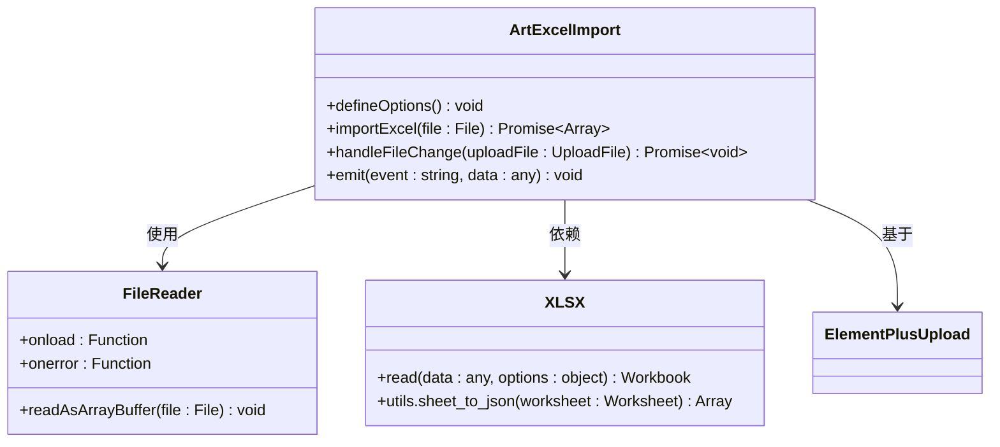
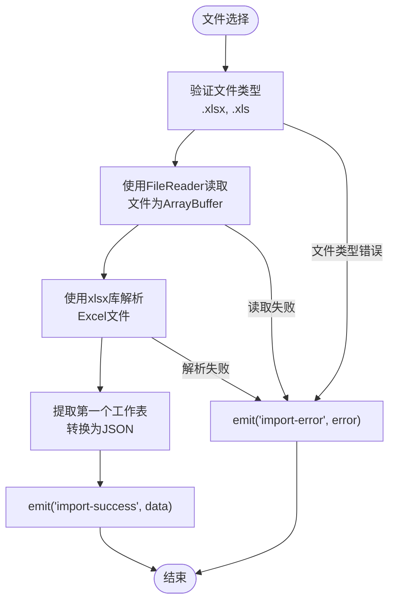
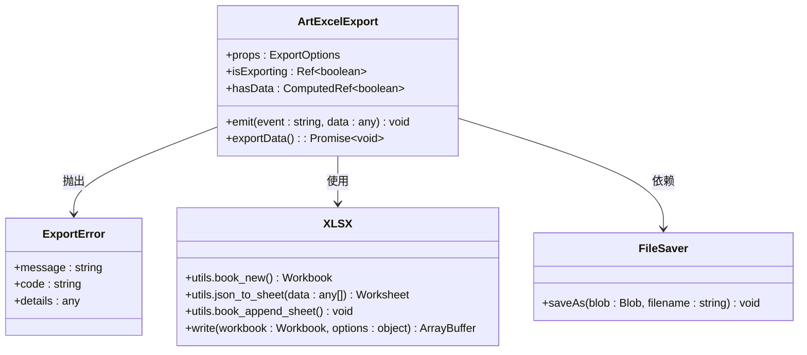
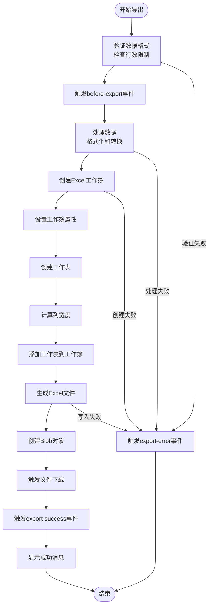
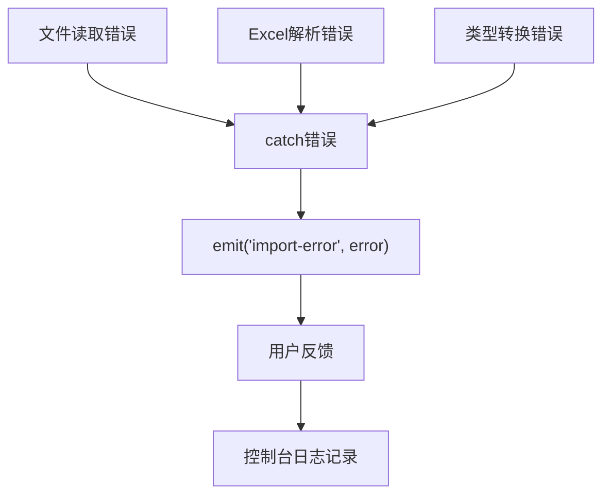
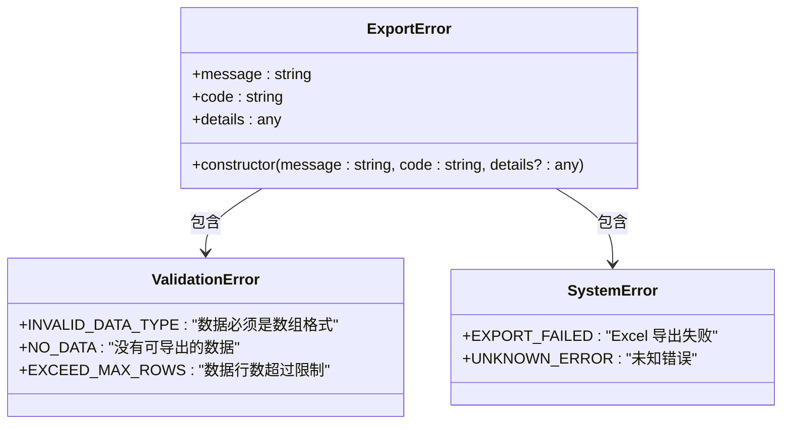
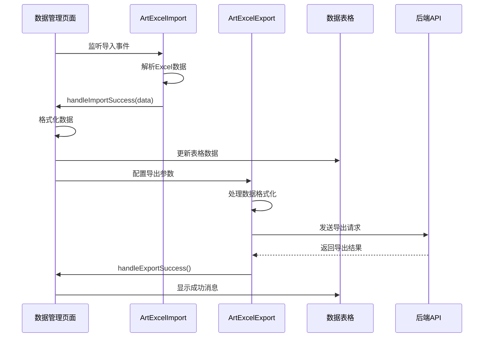

# Excel导入导出组件

<cite>
**本文档中引用的文件**
- [art-excel-import/index.vue](file://src/components/core/forms/art-excel-import/index.vue)
- [art-excel-export/index.vue](file://src/components/core/forms/art-excel-export/index.vue)
- [widgets/excel/index.vue](file://src/views/widgets/excel/index.vue)
- [package.json](file://package.json)
</cite>

## 目录
1. [简介](#简介)
2. [项目结构](#项目结构)
3. [核心组件](#核心组件)
4. [架构概览](#架构概览)
5. [详细组件分析](#详细组件分析)
6. [数据处理流程](#数据处理流程)
7. [错误处理机制](#错误处理机制)
8. [性能优化](#性能优化)
9. [集成示例](#集成示例)
10. [最佳实践](#最佳实践)
11. [总结](#总结)

## 简介

Art Design Pro 提供了一套完整的Excel文件处理解决方案，包含两个核心组件：`ArtExcelImport`用于Excel文件导入，`ArtExcelExport`用于Excel文件导出。这两个组件基于现代Web技术栈构建，支持TypeScript类型安全，提供了丰富的配置选项和完善的错误处理机制。

### 主要特性

- **文件类型支持**：支持.xlsx和.xls格式的Excel文件
- **数据格式转换**：自动处理JSON与Excel数据格式之间的转换
- **错误处理**：完善的错误捕获和用户反馈机制
- **用户体验**：加载状态指示、进度条、成功/错误消息提示
- **灵活配置**：丰富的配置选项满足不同业务需求
- **性能优化**：支持大数据量处理和导出进度监控

## 项目结构

Excel组件位于项目的表单组件目录中，采用模块化设计：

**图表来源**
- [art-excel-import/index.vue](file://src/components/core/forms/art-excel-import/index.vue#L1-L63)
- [art-excel-export/index.vue](file://src/components/core/forms/art-excel-export/index.vue#L1-L390)

**章节来源**
- [art-excel-import/index.vue](file://src/components/core/forms/art-excel-import/index.vue#L1-L63)
- [art-excel-export/index.vue](file://src/components/core/forms/art-excel-export/index.vue#L1-L390)

## 核心组件

### ArtExcelImport - Excel导入组件

ArtExcelImport是一个专门用于Excel文件导入的Vue组件，基于Element Plus的上传组件构建，支持拖拽和点击两种文件选择方式。

#### 主要功能
- **文件接收**：支持input[type=file]和拖拽区域两种文件输入方式
- **格式验证**：自动验证文件类型为.xlsx或.xls
- **数据解析**：使用xlsx库解析Excel文件为JSON格式
- **事件通知**：通过emit事件向外传递解析结果

#### 技术实现
- 基于`FileReader` API读取文件内容
- 使用`xlsx`库进行Excel文件解析
- Promise模式处理异步操作
- 类型安全的TypeScript接口定义

### ArtExcelExport - Excel导出组件

ArtExcelExport是一个功能强大的Excel导出组件，支持复杂的数据格式化、列配置和进度监控。

#### 主要功能
- **数据处理**：支持多种数据类型的格式化和转换
- **列配置**：灵活的列标题、宽度和格式化函数配置
- **工作簿属性**：可配置的工作簿元数据信息
- **进度监控**：实时导出进度反馈
- **文件下载**：自动触发浏览器下载功能

#### 技术实现
- 基于`xlsx`库创建和操作Excel工作簿
- 使用`file-saver`库处理文件下载
- 支持大量数据的分步处理
- 内置防抖机制防止重复导出

**章节来源**
- [art-excel-import/index.vue](file://src/components/core/forms/art-excel-import/index.vue#L1-L63)
- [art-excel-export/index.vue](file://src/components/core/forms/art-excel-export/index.vue#L1-L390)

## 架构概览

Excel组件的整体架构采用事件驱动的设计模式，通过Vue的emit机制实现组件间的通信。

**图表来源**
- [art-excel-import/index.vue](file://src/components/core/forms/art-excel-import/index.vue#L24-L61)
- [art-excel-export/index.vue](file://src/components/core/forms/art-excel-export/index.vue#L240-L365)

## 详细组件分析

### ArtExcelImport 组件详细分析

#### 组件结构

**图表来源**
- [art-excel-import/index.vue](file://src/components/core/forms/art-excel-import/index.vue#L24-L61)

#### 数据处理流程

**图表来源**
- [art-excel-import/index.vue](file://src/components/core/forms/art-excel-import/index.vue#L24-L61)

**章节来源**
- [art-excel-import/index.vue](file://src/components/core/forms/art-excel-import/index.vue#L1-L63)

### ArtExcelExport 组件详细分析

#### 组件结构

**图表来源**
- [art-excel-export/index.vue](file://src/components/core/forms/art-excel-export/index.vue#L38-L128)
- [art-excel-export/index.vue](file://src/components/core/forms/art-excel-export/index.vue#L240-L365)

#### 数据处理与导出流程

**图表来源**
- [art-excel-export/index.vue](file://src/components/core/forms/art-excel-export/index.vue#L240-L365)

**章节来源**
- [art-excel-export/index.vue](file://src/components/core/forms/art-excel-export/index.vue#L1-L390)

## 数据处理流程

### 导入数据处理

Excel导入过程中的数据转换遵循以下流程：

1. **文件读取阶段**
   - 使用FileReader API读取文件为ArrayBuffer
   - 验证文件类型和大小限制
   - 处理文件读取异常

2. **Excel解析阶段**
   - 使用xlsx库解析ArrayBuffer为工作簿对象
   - 提取第一个工作表作为数据源
   - 转换工作表为JSON格式数组

3. **数据标准化阶段**
   - 保持原始数据结构不变
   - 确保所有字段值的类型一致性
   - 处理空值和缺失字段

### 导出数据处理

Excel导出过程包含多个数据处理步骤：

1. **数据验证阶段**
   - 检查数据是否为数组格式
   - 验证数据行数不超过限制
   - 确保每行数据结构一致

2. **数据格式化阶段**
   - 应用列配置中的格式化函数
   - 处理特殊数据类型（日期、布尔值等）
   - 添加序号列（如果启用）

3. **列配置处理**
   - 映射原始字段名到显示标题
   - 应用自定义列宽配置
   - 处理向后兼容的headers配置

**章节来源**
- [art-excel-import/index.vue](file://src/components/core/forms/art-excel-import/index.vue#L24-L43)
- [art-excel-export/index.vue](file://src/components/core/forms/art-excel-export/index.vue#L136-L210)

## 错误处理机制

### 导入错误处理

ArtExcelImport实现了完善的错误处理机制：

**图表来源**
- [art-excel-import/index.vue](file://src/components/core/forms/art-excel-import/index.vue#L58-L60)

#### 错误类型
- **文件读取错误**：文件损坏或无法访问
- **格式解析错误**：非Excel文件或格式不支持
- **数据转换错误**：解析过程中出现异常

### 导出错误处理

ArtExcelExport提供了更复杂的错误处理体系：

**图表来源**
- [art-excel-export/index.vue](file://src/components/core/forms/art-excel-export/index.vue#L119-L127)

#### 错误分类与处理

1. **数据验证错误**
   - 数据类型不正确
   - 数据为空
   - 行数超出限制

2. **系统错误**
   - Excel生成失败
   - 文件下载失败
   - 内存不足

3. **用户友好错误**
   - 显示具体的错误信息
   - 提供错误代码便于调试
   - 记录详细的错误详情

**章节来源**
- [art-excel-import/index.vue](file://src/components/core/forms/art-excel-import/index.vue#L58-L60)
- [art-excel-export/index.vue](file://src/components/core/forms/art-excel-export/index.vue#L119-L127)

## 性能优化

### 导入性能优化

1. **异步处理**
   - 使用Promise处理文件读取和解析
   - 避免阻塞主线程
   - 支持大文件处理

2. **内存管理**
   - 及时释放文件读取器资源
   - 防止内存泄漏
   - 优化大数据集处理

### 导出性能优化

1. **分步处理**
   - 导出过程分为多个阶段
   - 每个阶段完成后更新进度
   - 支持长时间任务的中断和恢复

2. **防抖机制**
   - 使用`useThrottleFn`防止重复导出
   - 默认1秒的防抖间隔
   - 避免用户误操作导致的多次导出

3. **进度监控**
   - 实时更新导出进度
   - 分阶段报告完成度
   - 提供用户体验反馈

**图表来源**
- [art-excel-export/index.vue](file://src/components/core/forms/art-excel-export/index.vue#L246-L306)

**章节来源**
- [art-excel-export/index.vue](file://src/components/core/forms/art-excel-export/index.vue#L318-L365)

## 集成示例

### 数据管理页面集成

以下是在数据管理页面中集成Excel导入导出功能的完整示例：

#### 基础集成

**图表来源**
- [widgets/excel/index.vue](file://src/views/widgets/excel/index.vue#L1-L151)

#### 完整的集成代码结构

1. **组件配置**
   - 设置数据源和列配置
   - 配置文件名和工作表名称
   - 定义事件处理器

2. **数据转换**
   - 导入时的数据格式化
   - 导出时的数据预处理
   - 字段映射和类型转换

3. **错误处理**
   - 用户友好的错误提示
   - 日志记录和调试信息
   - 降级处理方案

**章节来源**
- [widgets/excel/index.vue](file://src/views/widgets/excel/index.vue#L1-L151)

## 最佳实践

### 数据格式转换最佳实践

1. **类型安全**
   - 使用TypeScript定义数据接口
   - 确保导入导出数据的一致性
   - 提供默认值处理缺失字段

2. **数据验证**
   - 在导入时验证数据完整性
   - 导出前检查数据格式
   - 提供清晰的错误信息

3. **性能考虑**
   - 处理大量数据时使用分页或流式处理
   - 优化列宽计算算法
   - 避免不必要的数据复制

### 用户体验最佳实践

1. **加载状态**
   - 显示明确的加载指示器
   - 提供进度条反馈
   - 避免用户重复操作

2. **错误处理**
   - 提供具体的错误信息
   - 建议可能的解决方案
   - 记录详细的错误日志

3. **文件格式**
   - 支持常见的Excel格式
   - 提供格式模板下载
   - 显示支持的文件类型

### 错误恢复最佳实践

1. **渐进式处理**
   - 导入失败时保留已处理的数据
   - 导出失败时提供重试机制
   - 支持部分成功的情况

2. **数据备份**
   - 导入前备份现有数据
   - 导出时生成临时文件
   - 提供撤销操作

3. **降级策略**
   - 处理超大数据量时的分批处理
   - 内存不足时的压缩处理
   - 网络异常时的重试机制

## 总结

Art Design Pro的Excel导入导出组件提供了一套完整、可靠的Excel文件处理解决方案。通过精心设计的架构和完善的错误处理机制，这些组件能够满足各种业务场景下的Excel文件处理需求。

### 核心优势

1. **技术先进性**
   - 基于现代Web标准构建
   - 充分利用TypeScript的类型安全
   - 采用事件驱动的架构模式

2. **功能完整性**
   - 支持完整的Excel文件格式
   - 提供丰富的配置选项
   - 实现了完善的错误处理

3. **用户体验**
   - 直观的操作界面
   - 实时的进度反馈
   - 友好的错误提示

4. **性能优化**
   - 异步处理避免阻塞
   - 分步处理支持大文件
   - 防抖机制防止误操作

这套Excel组件不仅解决了技术层面的问题，更重要的是为开发者提供了一个可扩展、易维护的解决方案，能够适应不断变化的业务需求。通过合理的配置和适当的错误处理，可以为用户提供流畅、可靠的Excel文件处理体验。