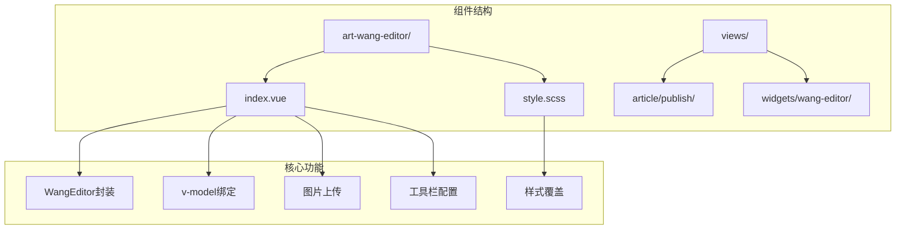
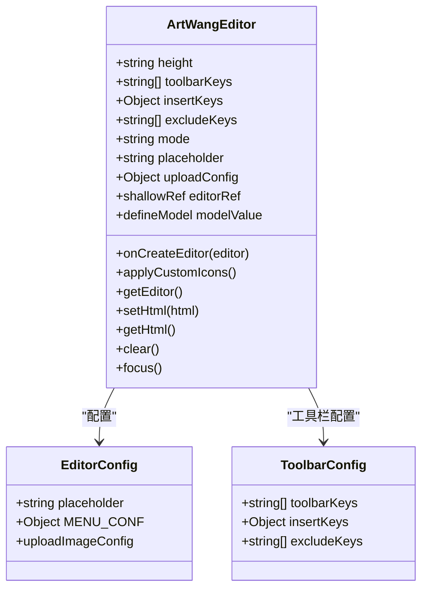
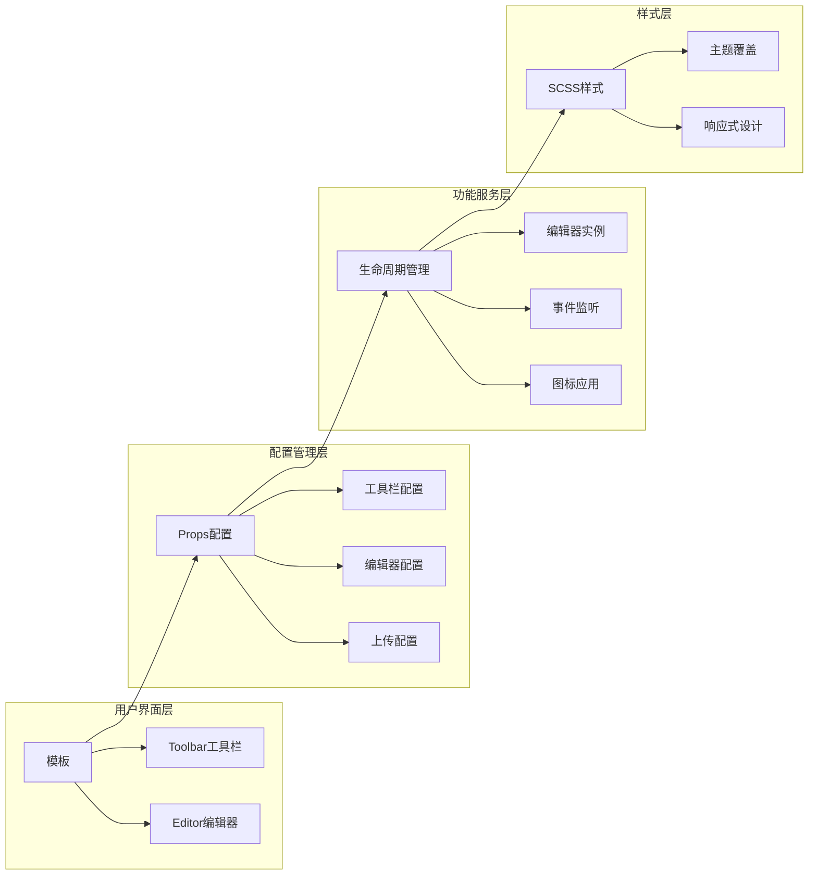
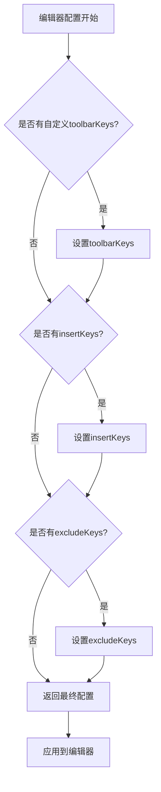
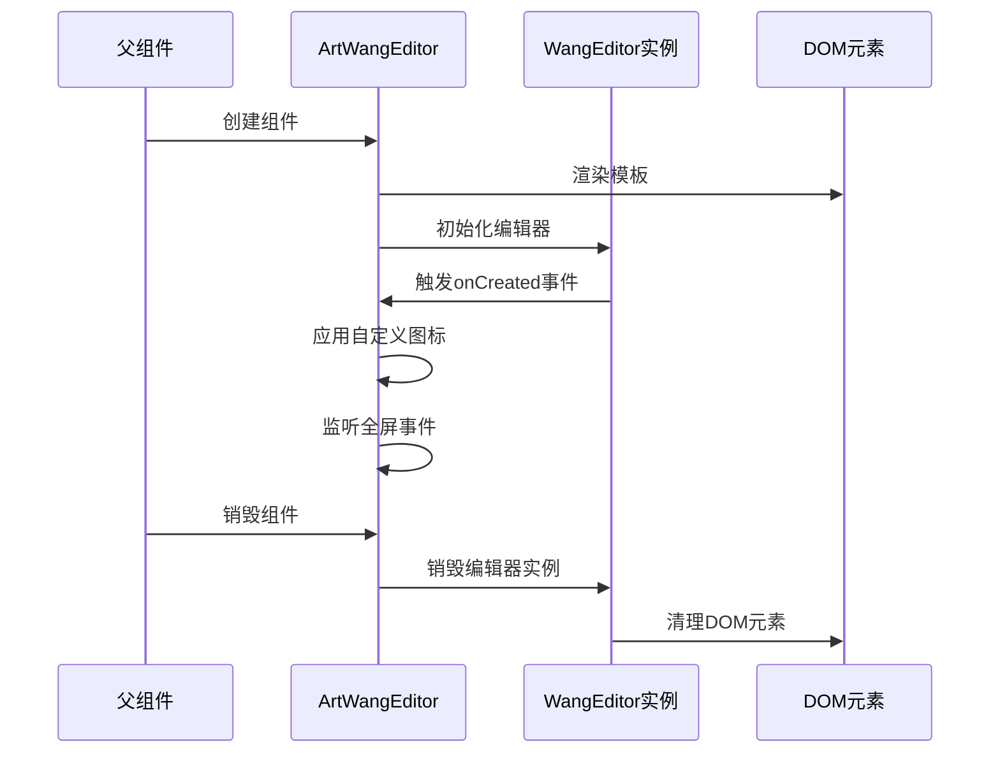
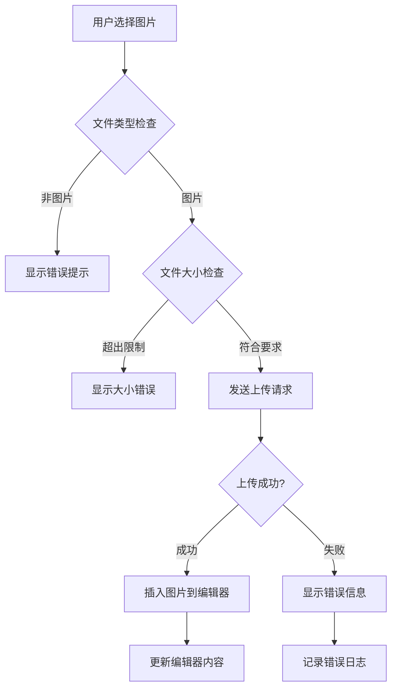
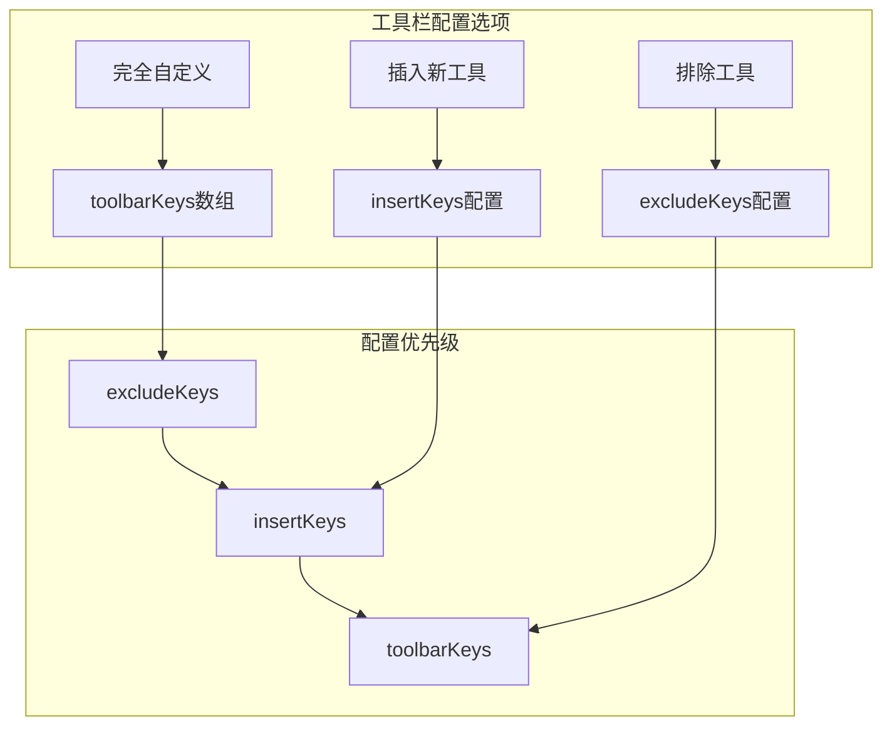
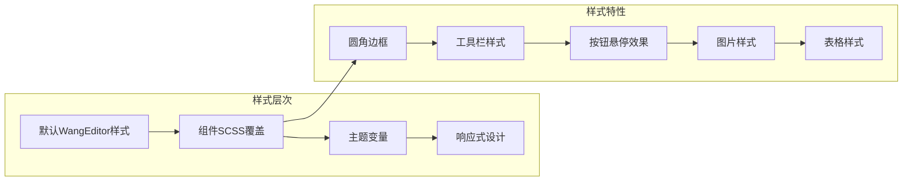

# 富文本编辑器组件 (art-wang-editor)

<cite>
**本文档中引用的文件**
- [index.vue](file://src/components/core/forms/art-wang-editor/index.vue)
- [style.scss](file://src/components/core/forms/art-wang-editor/style.scss)
- [publish/index.vue](file://src/views/article/publish/index.vue)
- [widgets/wang-editor/index.vue](file://src/views/widgets/wang-editor/index.vue)
</cite>

## 目录
1. [简介](#简介)
2. [项目结构](#项目结构)
3. [核心组件](#核心组件)
4. [架构概览](#架构概览)
5. [详细组件分析](#详细组件分析)
6. [图片上传功能](#图片上传功能)
7. [工具栏自定义](#工具栏自定义)
8. [样式定制](#样式定制)
9. [使用示例](#使用示例)
10. [常见问题解决](#常见问题解决)
11. [总结](#总结)

## 简介

art-wang-editor是一个基于WangEditor的Vue 3富文本编辑器组件，提供了完整的富文本编辑功能，支持图片上传、工具栏自定义、样式覆盖等功能。该组件通过v-model实现与父组件的数据双向绑定，为项目提供了统一的富文本编辑解决方案。

## 项目结构

art-wang-editor组件位于项目的表单组件目录中，具有清晰的文件组织结构：



**图表来源**
- [index.vue](file://src/components/core/forms/art-wang-editor/index.vue#L1-L220)
- [style.scss](file://src/components/core/forms/art-wang-editor/style.scss#L1-L211)

**章节来源**
- [index.vue](file://src/components/core/forms/art-wang-editor/index.vue#L1-L220)
- [style.scss](file://src/components/core/forms/art-wang-editor/style.scss#L1-L211)

## 核心组件

### 组件架构设计

art-wang-editor组件采用Vue 3 Composition API设计，集成了WangEditor的核心功能：



**图表来源**
- [index.vue](file://src/components/core/forms/art-wang-editor/index.vue#L30-L57)
- [index.vue](file://src/components/core/forms/art-wang-editor/index.vue#L108-L129)

**章节来源**
- [index.vue](file://src/components/core/forms/art-wang-editor/index.vue#L30-L142)

## 架构概览

art-wang-editor组件采用了模块化的设计架构，主要包含以下几个核心模块：



**图表来源**
- [index.vue](file://src/components/core/forms/art-wang-editor/index.vue#L2-L17)
- [index.vue](file://src/components/core/forms/art-wang-editor/index.vue#L58-L83)

## 详细组件分析

### Props接口定义

组件通过TypeScript接口定义了完整的Props配置：

| 属性名 | 类型 | 默认值 | 描述 |
|--------|------|--------|------|
| height | string | '500px' | 编辑器高度 |
| toolbarKeys | string[] | - | 自定义工具栏按钮列表 |
| insertKeys | Object | - | 在指定位置插入新工具 |
| excludeKeys | string[] | ['fontFamily'] | 排除的工具栏项 |
| mode | 'default' \| 'simple' | 'default' | 编辑器模式 |
| placeholder | string | '请输入内容...' | 占位符文本 |
| uploadConfig | Object | - | 上传配置对象 |

**章节来源**
- [index.vue](file://src/components/core/forms/art-wang-editor/index.vue#L30-L57)

### 编辑器配置

编辑器配置通过computed属性动态生成，支持多种自定义选项：



**图表来源**
- [index.vue](file://src/components/core/forms/art-wang-editor/index.vue#L86-L105)

**章节来源**
- [index.vue](file://src/components/core/forms/art-wang-editor/index.vue#L86-L105)

### 生命周期管理

组件实现了完整的生命周期管理，确保资源的正确初始化和销毁：



**图表来源**
- [index.vue](file://src/components/core/forms/art-wang-editor/index.vue#L131-L142)
- [index.vue](file://src/components/core/forms/art-wang-editor/index.vue#L204-L214)

**章节来源**
- [index.vue](file://src/components/core/forms/art-wang-editor/index.vue#L131-L142)
- [index.vue](file://src/components/core/forms/art-wang-editor/index.vue#L204-L214)

## 图片上传功能

### 上传配置详解

art-wang-editor提供了完整的图片上传功能，支持多种配置选项：

| 配置项 | 默认值 | 描述 |
|--------|--------|------|
| maxFileSize | 3MB | 最大文件大小限制 |
| maxNumberOfFiles | 10 | 最大上传文件数量 |
| fieldName | 'file' | 文件字段名称 |
| allowedFileTypes | ['image/*'] | 允许的文件类型 |

**章节来源**
- [index.vue](file://src/components/core/forms/art-wang-editor/index.vue#L66-L71)

### 上传流程实现



**图表来源**
- [index.vue](file://src/components/core/forms/art-wang-editor/index.vue#L110-L126)
- [publish/index.vue](file://src/views/article/publish/index.vue#L312-L329)

### 上传服务器配置

组件支持两种上传服务器配置方式：

1. **默认配置**：使用环境变量中的API URL
2. **自定义配置**：通过uploadConfig参数指定

**章节来源**
- [index.vue](file://src/components/core/forms/art-wang-editor/index.vue#L73-L77)
- [index.vue](file://src/components/core/forms/art-wang-editor/index.vue#L115-L117)

## 工具栏自定义

### 工具栏配置方式

art-wang-editor提供了三种工具栏配置方式：



**图表来源**
- [index.vue](file://src/components/core/forms/art-wang-editor/index.vue#L89-L105)

### 常用工具栏按钮

以下是常用的工具栏按钮配置：

| 功能类别 | 按钮名称 | 描述 |
|----------|----------|------|
| 文本格式 | bold | 加粗 |
| 文本格式 | italic | 斜体 |
| 文本格式 | underline | 下划线 |
| 段落格式 | bulletedList | 无序列表 |
| 段落格式 | numberedList | 有序列表 |
| 插入功能 | insertLink | 插入链接 |
| 插入功能 | insertImage | 插入图片 |
| 编辑操作 | undo | 撤销 |
| 编辑操作 | redo | 重做 |

**章节来源**
- [index.vue](file://src/components/core/forms/art-wang-editor/index.vue#L89-L105)
- [widgets/wang-editor/index.vue](file://src/views/widgets/wang-editor/index.vue#L226-L239)

## 样式定制

### SCSS样式覆盖

art-wang-editor通过style.scss文件提供了完整的样式定制能力：



**图表来源**
- [style.scss](file://src/components/core/forms/art-wang-editor/style.scss#L1-L211)

### 主题变量系统

组件使用CSS变量系统实现主题适配：

| 变量名 | 默认值 | 用途 |
|--------|--------|------|
| --art-gray-300 | - | 边框颜色 |
| --art-gray-200 | - | 背景颜色 |
| --art-gray-800 | - | 文字颜色 |
| --w-e-toolbar-active-bg-color | - | 工具栏激活背景 |
| --w-e-toolbar-color | - | 工具栏文字颜色 |

**章节来源**
- [style.scss](file://src/components/core/forms/art-wang-editor/style.scss#L1-L211)

## 使用示例

### 基础使用

最简单的使用方式是直接绑定v-model：

```vue
<template>
  <ArtWangEditor v-model="content" />
</template>

<script setup>
import { ref } from 'vue'

const content = ref('<p>初始内容</p>')
</script>
```

### 完整工具栏配置

```vue
<template>
  <ArtWangEditor
    v-model="content"
    :exclude-keys="[]"
    height="500px"
    placeholder="请输入内容..."
  />
</template>
```

### 简化工具栏配置

```vue
<template>
  <ArtWangEditor
    v-model="content"
    :toolbar-keys="[
      'bold', 'italic', 'underline', '|',
      'bulletedList', 'numberedList', '|',
      'insertLink', 'insertImage', '|',
      'undo', 'redo'
    ]"
    height="400px"
  />
</template>
```

### 图片上传配置

```vue
<template>
  <ArtWangEditor
    v-model="content"
    :upload-config="{
      maxFileSize: 5 * 1024 * 1024,
      maxNumberOfFiles: 5
    }"
  />
</template>
```

**章节来源**
- [widgets/wang-editor/index.vue](file://src/views/widgets/wang-editor/index.vue#L1-L316)

## 常见问题解决

### 跨域上传问题

**问题描述**：图片上传时出现跨域错误

**解决方案**：
1. 确保后端API支持CORS
2. 配置正确的上传服务器地址
3. 设置正确的请求头

```javascript
// 上传配置示例
const uploadConfig = {
  server: 'https://your-api-domain.com/api/upload',
  headers: {
    'Authorization': `Bearer ${accessToken}`,
    'Access-Control-Allow-Origin': '*'
  }
}
```

### 上传进度监控

WangEditor本身不直接提供上传进度监控，但可以通过以下方式实现：

```javascript
// 在onCreateEditor中添加进度监控
const onCreateEditor = (editor) => {
  editorRef.value = editor
  
  // 监听上传事件
  editor.on('uploadImage', (event) => {
    console.log('上传开始:', event.file.name)
  })
  
  // 监听上传成功
  editor.on('uploadImageSuccess', (url) => {
    console.log('上传成功:', url)
  })
}
```

### 图片大小限制

组件内置了图片大小限制功能：

```javascript
// 默认配置
const DEFAULT_UPLOAD_CONFIG = {
  maxFileSize: 3 * 1024 * 1024, // 3MB
  maxNumberOfFiles: 10,
  fieldName: 'file',
  allowedFileTypes: ['image/*']
}
```

**章节来源**
- [index.vue](file://src/components/core/forms/art-wang-editor/index.vue#L66-L71)
- [publish/index.vue](file://src/views/article/publish/index.vue#L312-L329)

### 编辑器初始化问题

**问题**：工具栏图标未正确显示

**解决方案**：组件使用重试机制确保图标正确应用：

```javascript
// 应用自定义图标（带重试机制）
const applyCustomIcons = () => {
  let retryCount = 0
  const maxRetries = 10
  const retryDelay = 100
  
  const tryApplyIcons = () => {
    // 检查编辑器实例和DOM元素
    // 如果未找到则重试
  }
}
```

**章节来源**
- [index.vue](file://src/components/core/forms/art-wang-editor/index.vue#L144-L188)

## 总结

art-wang-editor组件是一个功能完善、易于定制的富文本编辑器解决方案。它通过以下特性为项目提供了强大的富文本编辑能力：

1. **完整的WangEditor封装**：继承了WangEditor的所有核心功能
2. **v-model双向绑定**：与Vue 3生态系统完美集成
3. **灵活的工具栏配置**：支持完全自定义、插入和排除功能
4. **强大的图片上传功能**：支持文件类型检查、大小限制和错误处理
5. **主题样式定制**：通过SCSS变量系统实现统一的主题风格
6. **完善的生命周期管理**：确保资源的正确初始化和清理

该组件特别适用于需要富文本编辑功能的文章发布、内容管理系统等场景，为开发者提供了开箱即用的解决方案，同时保持了足够的灵活性以满足各种定制需求。