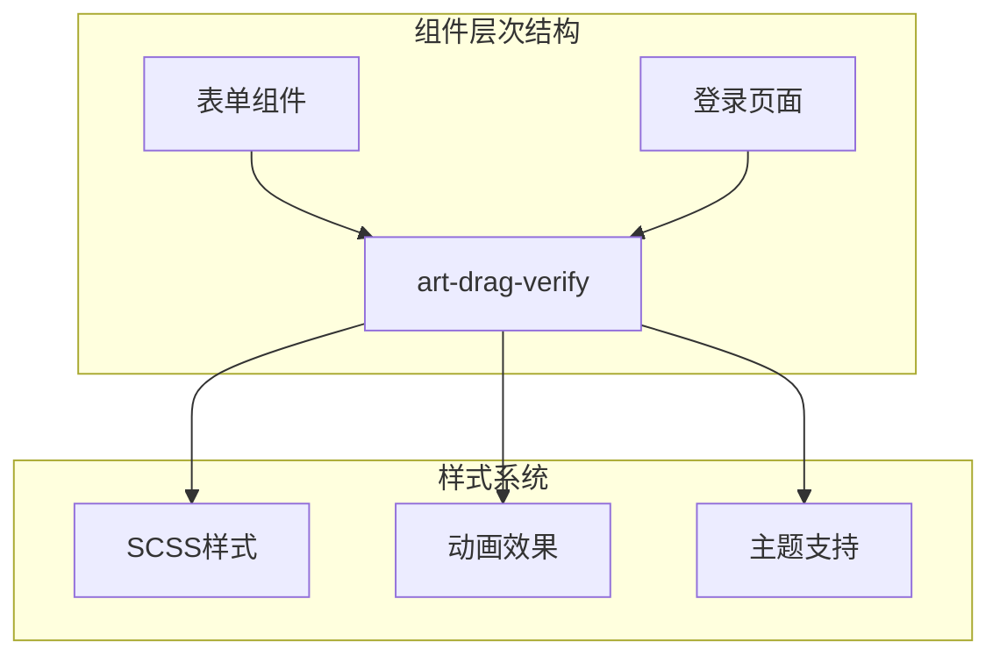
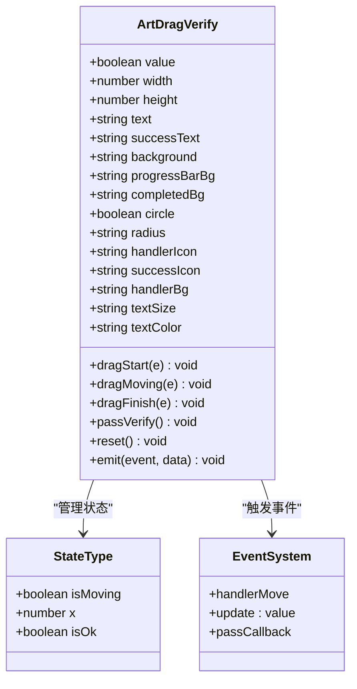
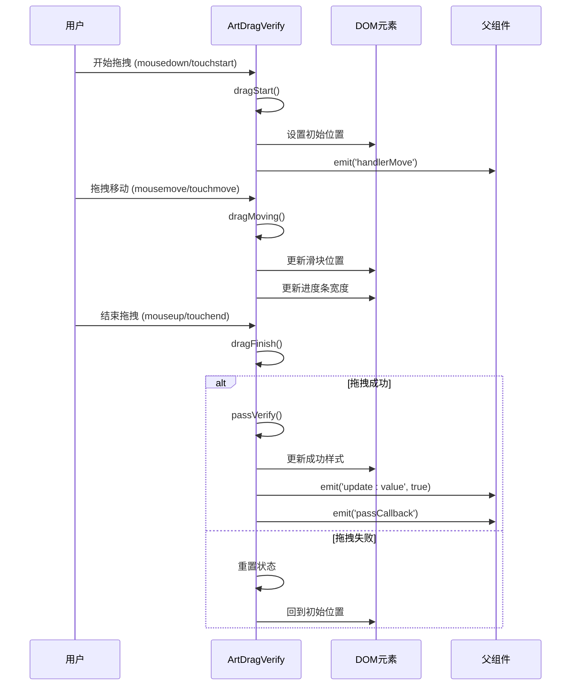
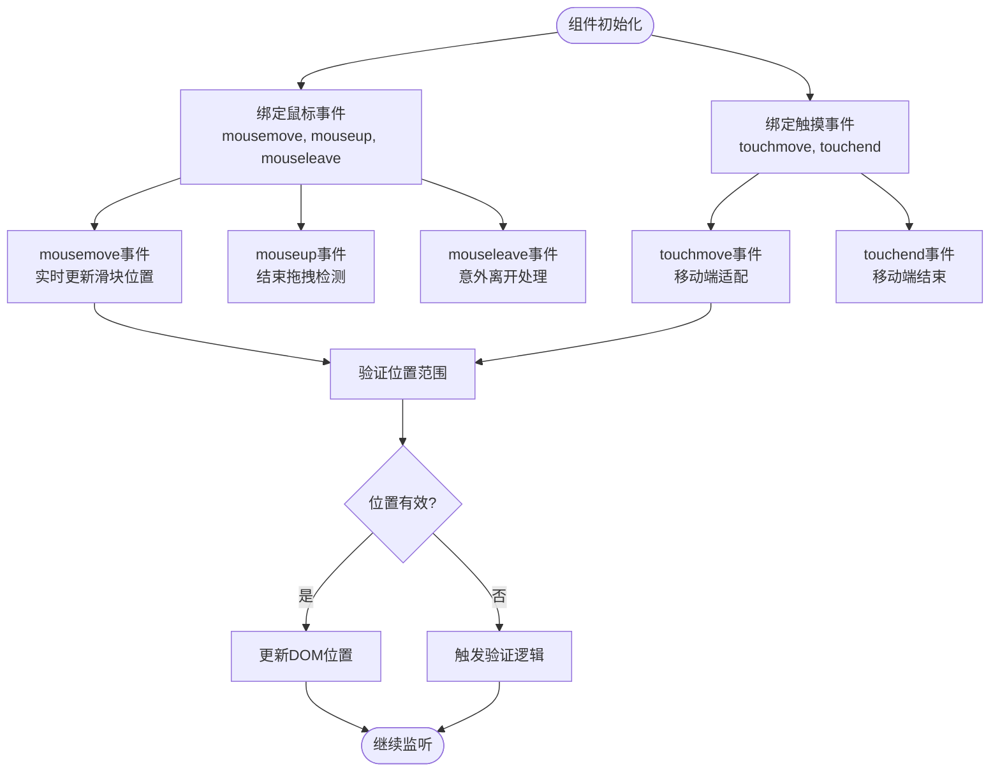
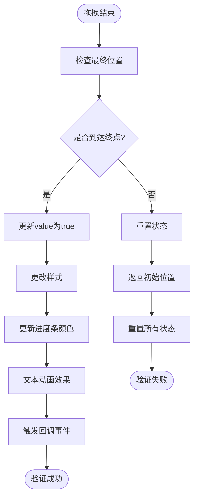
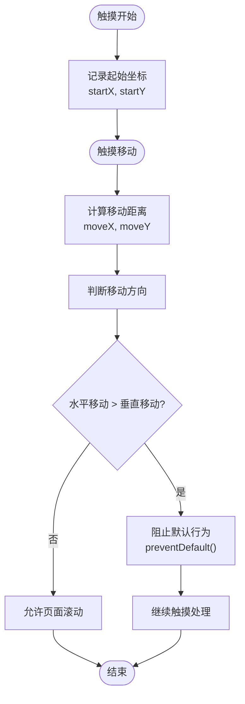
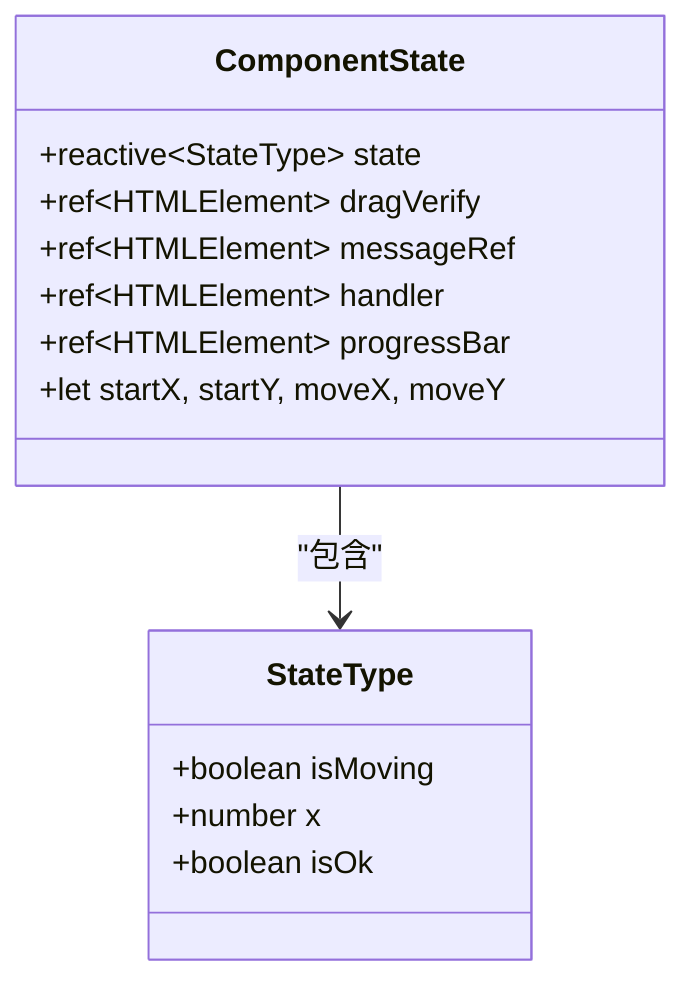
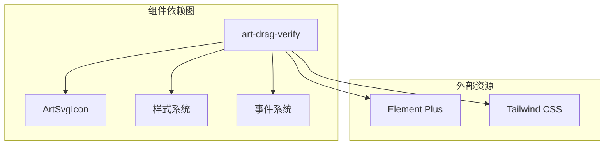

# 拖拽验证组件 (art-drag-verify) 详细文档

<cite>
**本文档中引用的文件**
- [index.vue](file://src/components/core/forms/art-drag-verify/index.vue)
- [login/index.vue](file://src/views/auth/login/index.vue)
- [style.css](file://src/views/auth/login/style.css)
</cite>

## 目录
1. [简介](#简介)
2. [项目结构](#项目结构)
3. [核心组件](#核心组件)
4. [架构概览](#架构概览)
5. [详细组件分析](#详细组件分析)
6. [依赖关系分析](#依赖关系分析)
7. [性能考虑](#性能考虑)
8. [故障排除指南](#故障排除指南)
9. [结论](#结论)

## 简介

art-drag-verify 是一个专为安全验证设计的拖拽验证组件，广泛应用于登录保护和敏感操作场景。该组件提供了直观的用户体验，通过拖拽滑块来完成验证过程，有效防止自动化攻击和机器人入侵。

### 核心特性

- **视觉引导**：带有缺口的滑块和可拖动的滑块设计
- **多事件支持**：完整支持鼠标和触摸事件
- **实时反馈**：拖拽过程中的进度条显示和动态效果
- **安全增强**：随机缺口位置和样式变化
- **灵活配置**：丰富的props配置选项
- **事件驱动**：完整的生命周期事件系统

## 项目结构

art-drag-verify 组件位于项目的表单组件目录中，与其他UI组件协同工作：

**图表来源**
- [index.vue](file://src/components/core/forms/art-drag-verify/index.vue#L1-L431)
- [login/index.vue](file://src/views/auth/login/index.vue#L1-L286)

**章节来源**
- [index.vue](file://src/components/core/forms/art-drag-verify/index.vue#L1-L50)

## 核心组件

### 组件结构

art-drag-verify 组件采用模块化设计，包含以下核心部分：

1. **主容器**：承载整个验证界面
2. **进度条**：显示拖拽进度
3. **提示文本**：提供用户指导信息
4. **滑块处理器**：可拖拽的核心交互元素

### 视觉设计元素

- **缺口设计**：独特的缺口形状增加验证难度
- **渐变文字**：动态的渐变效果提升视觉体验
- **平滑动画**：流畅的过渡效果改善用户体验

**章节来源**
- [index.vue](file://src/components/core/forms/art-drag-verify/index.vue#L2-L40)

## 架构概览

### 组件架构图

**图表来源**
- [index.vue](file://src/components/core/forms/art-drag-verify/index.vue#L43-L118)

### 事件流程图

**图表来源**
- [index.vue](file://src/components/core/forms/art-drag-verify/index.vue#L231-L295)

**章节来源**
- [index.vue](file://src/components/core/forms/art-drag-verify/index.vue#L231-L295)

## 详细组件分析

### 鼠标事件监听机制

组件通过精确的事件监听实现拖拽功能：

#### 事件绑定策略

**图表来源**
- [index.vue](file://src/components/core/forms/art-drag-verify/index.vue#L7-L11)
- [index.vue](file://src/components/core/forms/art-drag-verify/index.vue#L231-L295)

#### 拖拽轨迹计算

组件实现了精确的拖拽轨迹跟踪：

1. **起始位置计算**：记录鼠标按下时的相对位置
2. **实时位置更新**：根据鼠标移动计算当前坐标
3. **边界约束**：确保滑块在有效范围内移动
4. **精度控制**：像素级的位置调整

**章节来源**
- [index.vue](file://src/components/core/forms/art-drag-verify/index.vue#L231-L295)

### 验证逻辑实现

#### 成功验证流程

**图表来源**
- [index.vue](file://src/components/core/forms/art-drag-verify/index.vue#L297-L309)

#### 重置机制

组件提供了完整的状态重置功能：

- **滑块位置重置**：回到初始位置
- **进度条重置**：清空进度显示
- **样式恢复**：恢复原始外观
- **状态清理**：清除所有内部状态

**章节来源**
- [index.vue](file://src/components/core/forms/art-drag-verify/index.vue#L311-L328)

### 样式系统与动画

#### 动画效果

组件使用了多层次的CSS动画：

1. **渐变文字动画**：`slidetounlock` 和 `slidetounlock2` 关键帧动画
2. **滑块过渡动画**：平滑的位置变化
3. **进度条动画**：渐进式的宽度变化

#### 主题适配

组件支持多种主题配置：

- **背景色系**：可配置的背景和进度条颜色
- **圆角设计**：支持直角和圆角样式
- **字体配置**：可调节的文字大小和颜色

**章节来源**
- [index.vue](file://src/components/core/forms/art-drag-verify/index.vue#L336-L430)

### 触摸设备优化

#### 触摸事件处理

**图表来源**
- [index.vue](file://src/components/core/forms/art-drag-verify/index.vue#L129-L149)

#### 页面滑动控制

组件实现了智能的页面滑动控制机制：

- **方向检测**：区分水平和垂直滑动
- **行为阻止**：防止误触导致页面滚动
- **被动事件**：优化移动端性能

**章节来源**
- [index.vue](file://src/components/core/forms/art-drag-verify/index.vue#L129-L149)

### 状态管理系统

#### 内部状态结构

**图表来源**
- [index.vue](file://src/components/core/forms/art-drag-verify/index.vue#L103-L118)

#### 生命周期管理

组件实现了完整的生命周期管理：

1. **挂载阶段**：初始化样式和事件监听器
2. **运行阶段**：处理用户交互和状态更新
3. **卸载阶段**：清理事件监听器避免内存泄漏

**章节来源**
- [index.vue](file://src/components/core/forms/art-drag-verify/index.vue#L172-L193)

## 依赖关系分析

### 外部依赖

组件主要依赖于以下技术栈：

- **Vue 3**：基于Composition API的现代前端框架
- **TypeScript**：提供类型安全保障
- **Element Plus**：UI库集成
- **SCSS**：样式预处理

### 内部依赖

**图表来源**
- [index.vue](file://src/components/core/forms/art-drag-verify/index.vue#L1-L10)
- [login/index.vue](file://src/views/auth/login/index.vue#L1-L50)

**章节来源**
- [index.vue](file://src/components/core/forms/art-drag-verify/index.vue#L1-L10)

## 性能考虑

### 事件处理优化

- **事件委托**：合理使用事件委托减少内存占用
- **防抖节流**：在必要位置实施性能优化
- **被动事件**：移动端触摸事件使用被动模式

### 渲染性能

- **虚拟DOM**：利用Vue的响应式系统
- **样式缓存**：避免重复的样式计算
- **动画优化**：使用CSS硬件加速

### 内存管理

- **事件清理**：组件卸载时自动清理事件监听器
- **引用管理**：合理管理DOM引用避免内存泄漏

## 故障排除指南

### 常见问题及解决方案

#### 拖拽不流畅

**问题描述**：拖拽过程中出现卡顿或延迟

**可能原因**：
- 事件监听器过多
- 样式计算复杂
- 浏览器性能不足

**解决方案**：
- 检查事件绑定数量
- 优化CSS选择器
- 使用浏览器开发者工具分析性能

#### 触摸设备兼容性

**问题描述**：在移动设备上无法正常拖拽

**可能原因**：
- 触摸事件处理不当
- 页面滑动冲突
- 设备性能限制

**解决方案**：
- 确保正确处理触摸事件
- 实施正确的页面滑动控制
- 测试不同设备和浏览器

#### 样式显示异常

**问题描述**：组件样式显示不正确

**可能原因**：
- CSS变量未正确设置
- 样式优先级冲突
- 主题配置错误

**解决方案**：
- 检查CSS自定义属性
- 调整样式优先级
- 验证主题配置

**章节来源**
- [index.vue](file://src/components/core/forms/art-drag-verify/index.vue#L172-L193)

## 结论

art-drag-verify 组件是一个功能完善、设计精良的拖拽验证解决方案。它不仅提供了优秀的用户体验，还具备强大的安全防护能力。通过模块化的架构设计、完善的事件处理机制和灵活的配置选项，该组件能够满足各种应用场景的需求。

### 主要优势

1. **安全性**：多重验证机制和随机化设计
2. **易用性**：直观的用户界面和流畅的交互体验
3. **可扩展性**：丰富的配置选项和事件系统
4. **性能**：优化的事件处理和渲染性能
5. **兼容性**：全面的跨平台支持

### 应用建议

在实际应用中，建议：

- 在登录页面等敏感操作场景中部署
- 配合其他安全措施形成防护体系
- 根据具体需求调整验证严格程度
- 定期更新和维护组件代码

通过合理使用art-drag-verify组件，可以显著提升应用的安全性和用户体验。