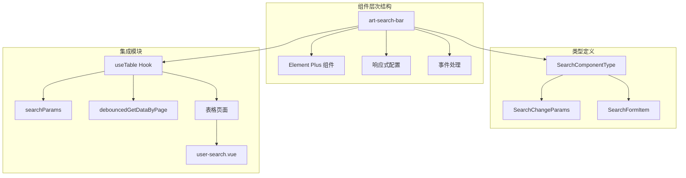
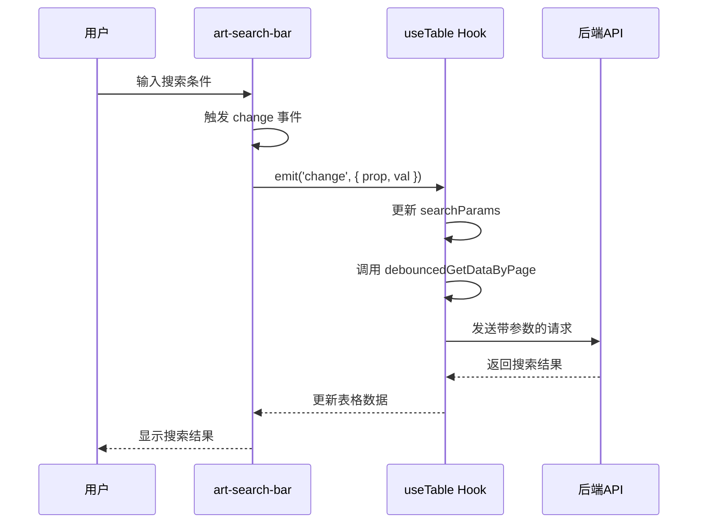
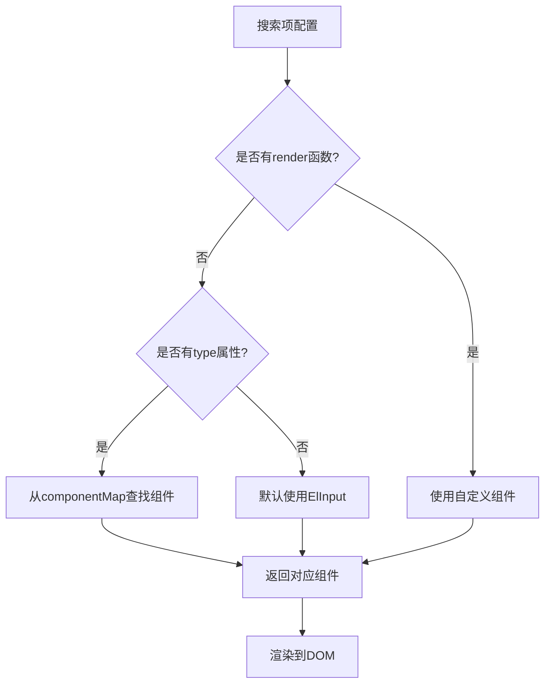
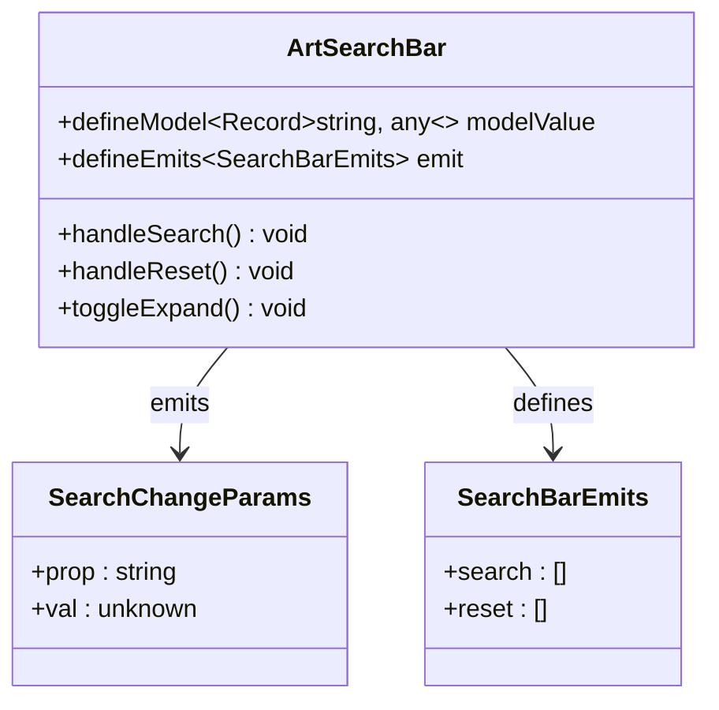
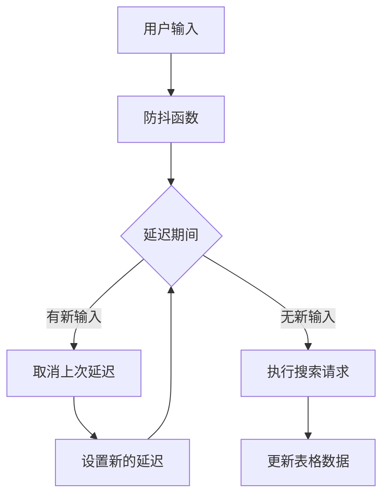
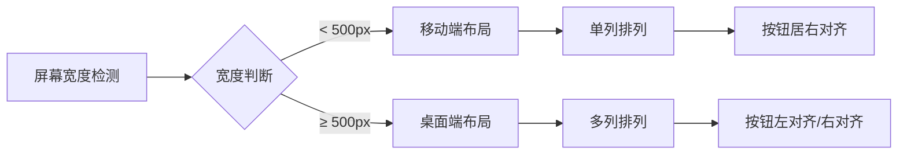
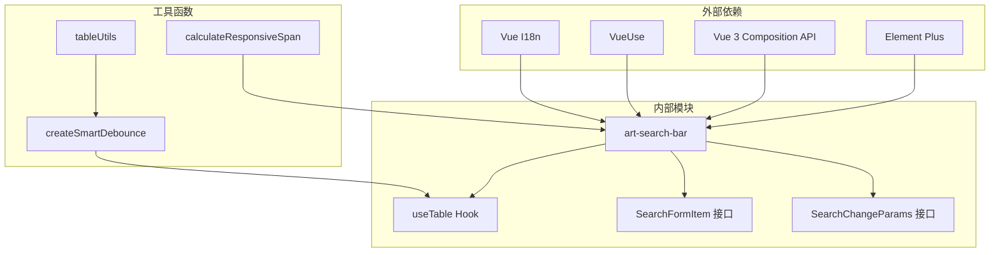

# 搜索栏组件 (art-search-bar) 全面文档

<cite>
**本文档中引用的文件**
- [index.vue](file://src/components/core/forms/art-search-bar/index.vue)
- [index.ts](file://src/types/component/index.ts)
- [useTable.ts](file://src/hooks/core/useTable.ts)
- [search-bar.vue](file://src/views/examples/forms/search-bar.vue)
- [user-search.vue](file://src/views/system/user/modules/user-search.vue)
- [tableUtils.ts](file://src/utils/table/tableUtils.ts)
</cite>

## 目录
1. [简介](#简介)
2. [项目结构](#项目结构)
3. [核心组件](#核心组件)
4. [架构概览](#架构概览)
5. [详细组件分析](#详细组件分析)
6. [依赖关系分析](#依赖关系分析)
7. [性能考虑](#性能考虑)
8. [故障排除指南](#故障排除指南)
9. [结论](#结论)

## 简介

art-search-bar 是一个功能强大的动态搜索表单组件，专为表格页面设计。它能够接收包含搜索项配置的数组，每个配置项包含 prop、type（使用 SearchComponentType 枚举）、label 等属性，从而动态生成多样化的搜索控件。组件通过 emit('change', { prop, val }) 事件向外传递值变化，并与 useTable 等组合式函数中的 searchParams 进行双向绑定，确保类型安全的事件参数传递。

## 项目结构

art-search-bar 组件位于项目的表单组件目录中，与其他核心组件协同工作：

**图表来源**
- [index.vue](file://src/components/core/forms/art-search-bar/index.vue#L1-L50)
- [index.ts](file://src/types/component/index.ts#L24-L46)

**章节来源**
- [index.vue](file://src/components/core/forms/art-search-bar/index.vue#L1-L438)
- [index.ts](file://src/types/component/index.ts#L1-L105)

## 核心组件

### 组件配置接口

art-search-bar 通过 `SearchFormItem` 接口定义搜索项配置，支持丰富的属性配置：

| 属性 | 类型 | 描述 | 必需 |
|------|------|------|------|
| key | string | 表单项的唯一标识 | 是 |
| label | string \| Function \| Component | 表单项标签文本或自定义渲染函数 | 否 |
| type | keyof typeof componentMap \| string | 表单项类型，支持预定义组件类型 | 否 |
| render | Function \| Component | 自定义渲染函数或组件 | 否 |
| hidden | boolean | 是否隐藏该表单项 | 否 |
| span | number | 表单项占据的列宽（基于24格栅格系统） | 否 |
| options | Record<string, any> | 选项数据，用于 select、checkbox-group、radio-group 等 | 否 |
| props | Record<string, any> | 传递给表单项组件的属性 | 否 |
| slots | Record<string, Function> | 表单项的插槽配置 | 否 |

### 支持的组件类型

组件映射表定义了所有支持的搜索组件类型：

| 类型 | 组件 | 用途 |
|------|------|------|
| input | ElInput | 文本输入框 |
| select | ElSelect | 下拉选择器 |
| radio | ElRadio | 单选框 |
| checkbox | ElCheckbox | 复选框 |
| date | ElDatePicker | 日期选择器 |
| datetime | ElDatePicker | 日期时间选择器 |
| daterange | ElDatePicker | 日期范围选择器 |
| datetimerange | ElDatePicker | 日期时间范围选择器 |
| month | ElDatePicker | 月份选择器 |
| year | ElDatePicker | 年份选择器 |
| week | ElDatePicker | 星期选择器 |
| time | ElTimePicker | 时间选择器 |
| timerange | ElTimePicker | 时间范围选择器 |
| slider | ElSlider | 滑块 |
| rate | ElRate | 评分 |
| switch | ElSwitch | 开关 |
| cascader | ElCascader | 级联选择器 |
| treeselect | ElTreeSelect | 树形选择器 |

**章节来源**
- [index.vue](file://src/components/core/forms/art-search-bar/index.vue#L158-L183)
- [index.vue](file://src/components/core/forms/art-search-bar/index.vue#L131-L149)

## 架构概览

art-search-bar 采用声明式配置和响应式设计模式，通过 Vue 3 的组合式 API 实现高度灵活的搜索功能：

**图表来源**
- [index.vue](file://src/components/core/forms/art-search-bar/index.vue#L347-L352)
- [useTable.ts](file://src/hooks/core/useTable.ts#L440-L441)

## 详细组件分析

### 动态组件生成机制

art-search-bar 通过 `getComponent` 方法动态生成搜索控件：

**图表来源**
- [index.vue](file://src/components/core/forms/art-search-bar/index.vue#L272-L279)

### 事件处理与双向绑定

组件通过 Vue 3 的 `defineModel` 实现双向绑定，并提供类型安全的事件处理：

**图表来源**
- [index.vue](file://src/components/core/forms/art-search-bar/index.vue#L235-L236)
- [index.ts](file://src/types/component/index.ts#L43-L46)

### 防抖机制优化

组件集成了智能防抖机制来优化性能：

**图表来源**
- [tableUtils.ts](file://src/utils/table/tableUtils.ts#L202-L264)
- [useTable.ts](file://src/hooks/core/useTable.ts#L440-L441)

**章节来源**
- [index.vue](file://src/components/core/forms/art-search-bar/index.vue#L272-L280)
- [index.vue](file://src/components/core/forms/art-search-bar/index.vue#L347-L352)
- [tableUtils.ts](file://src/utils/table/tableUtils.ts#L202-L264)

### 响应式布局系统

组件实现了智能的响应式布局，根据屏幕尺寸自动调整表单项排列：

**图表来源**
- [index.vue](file://src/components/core/forms/art-search-bar/index.vue#L154-L156)
- [index.vue](file://src/components/core/forms/art-search-bar/index.vue#L267-L269)

**章节来源**
- [index.vue](file://src/components/core/forms/art-search-bar/index.vue#L267-L269)
- [index.vue](file://src/components/core/forms/art-search-bar/index.vue#L312-L321)

## 依赖关系分析

art-search-bar 与项目中的其他模块存在密切的依赖关系：

**图表来源**
- [index.vue](file://src/components/core/forms/art-search-bar/index.vue#L104-L126)
- [useTable.ts](file://src/hooks/core/useTable.ts#L440-L441)

**章节来源**
- [index.vue](file://src/components/core/forms/art-search-bar/index.vue#L104-L126)
- [useTable.ts](file://src/hooks/core/useTable.ts#L440-L441)

## 性能考虑

### 防抖优化策略

art-search-bar 实现了多层次的性能优化：

1. **智能防抖**: 使用 `createSmartDebounce` 函数实现可取消和立即执行的防抖
2. **缓存机制**: 与 useTable 的缓存系统集成，避免重复请求
3. **响应式布局**: 根据屏幕尺寸动态调整，减少不必要的 DOM 操作
4. **懒加载**: 支持按需加载选项数据，减少初始加载时间

### 内存管理

组件实现了完善的内存管理机制：

- 组件卸载时自动清理防抖定时器
- 响应式数据的合理使用避免内存泄漏
- 缓存清理机制防止长期占用内存

## 故障排除指南

### 常见问题及解决方案

| 问题 | 原因 | 解决方案 |
|------|------|----------|
| 搜索参数未正确传递 | 类型定义不匹配 | 检查 SearchChangeParams 接口使用 |
| 防抖失效 | 防抖函数未正确调用 | 确保使用 debouncedGetDataByPage |
| 响应式布局异常 | 屏幕尺寸检测错误 | 检查 useWindowSize 的使用 |
| 组件渲染失败 | 配置项缺失必要属性 | 验证 SearchFormItem 配置 |

### 调试技巧

1. **使用 Vue DevTools** 检查组件状态和事件
2. **启用日志记录** 通过 `enableLog: true` 查看详细信息
3. **检查类型定义** 确保配置项符合接口要求
4. **监控网络请求** 验证防抖机制是否正常工作

**章节来源**
- [useTable.ts](file://src/hooks/core/useTable.ts#L440-L441)
- [tableUtils.ts](file://src/utils/table/tableUtils.ts#L202-L264)

## 结论

art-search-bar 组件是一个功能完善、性能优化的动态搜索表单解决方案。它通过声明式配置、响应式设计和智能防抖机制，为表格页面提供了强大而灵活的搜索功能。组件与 useTable Hook 的深度集成，确保了搜索参数的类型安全和性能优化。

主要优势包括：
- **高度可配置**: 支持多种输入类型和自定义组件
- **性能优化**: 智能防抖和缓存机制
- **类型安全**: 完整的 TypeScript 类型定义
- **响应式设计**: 自适应不同屏幕尺寸
- **易于集成**: 与现有项目架构无缝对接

该组件为现代 Web 应用程序的表格搜索功能提供了标准化、高性能的解决方案，是构建复杂数据管理界面的理想选择。