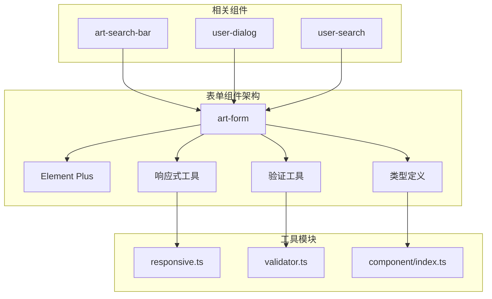
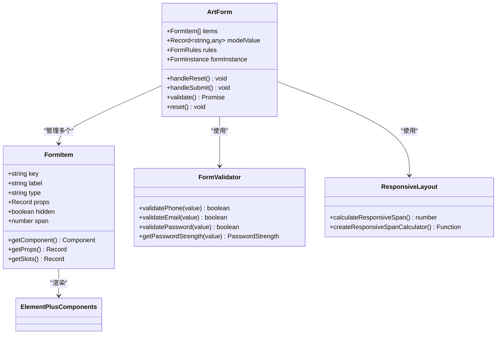
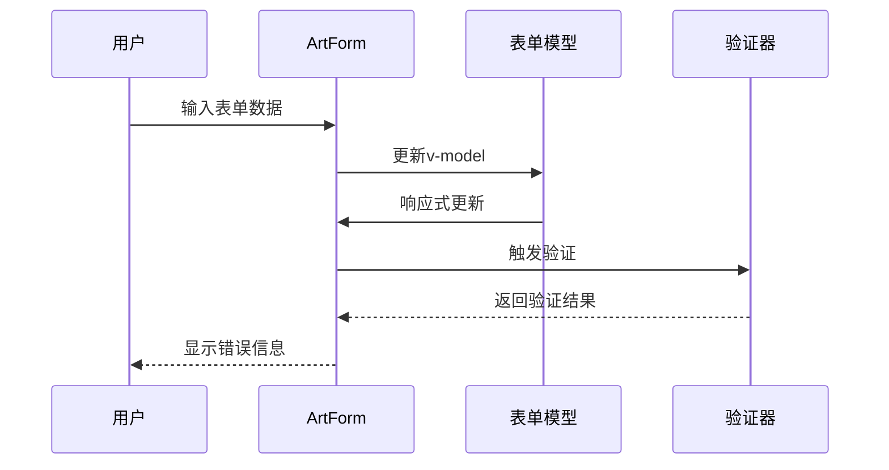
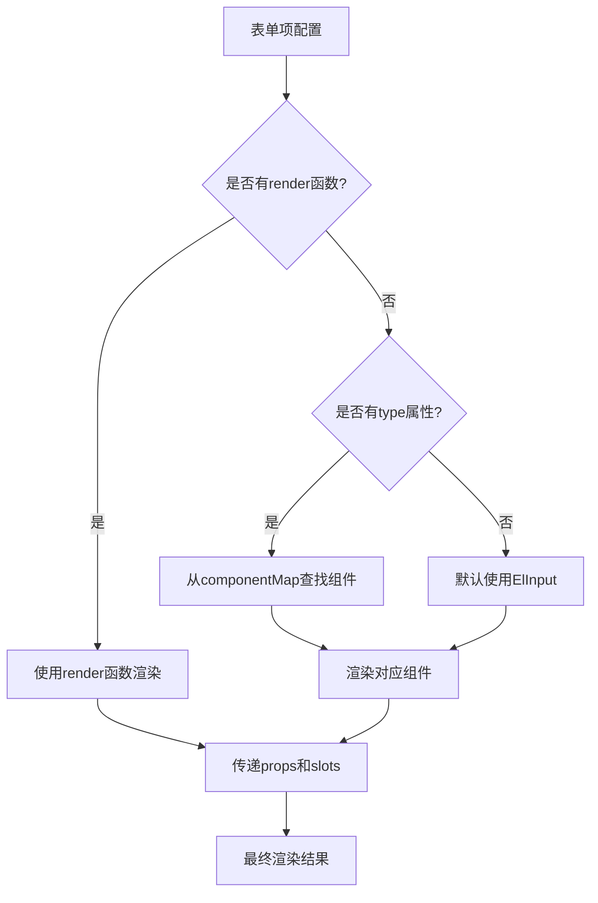
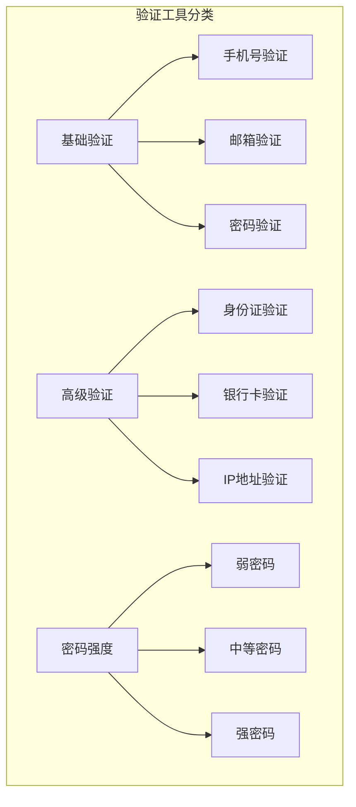
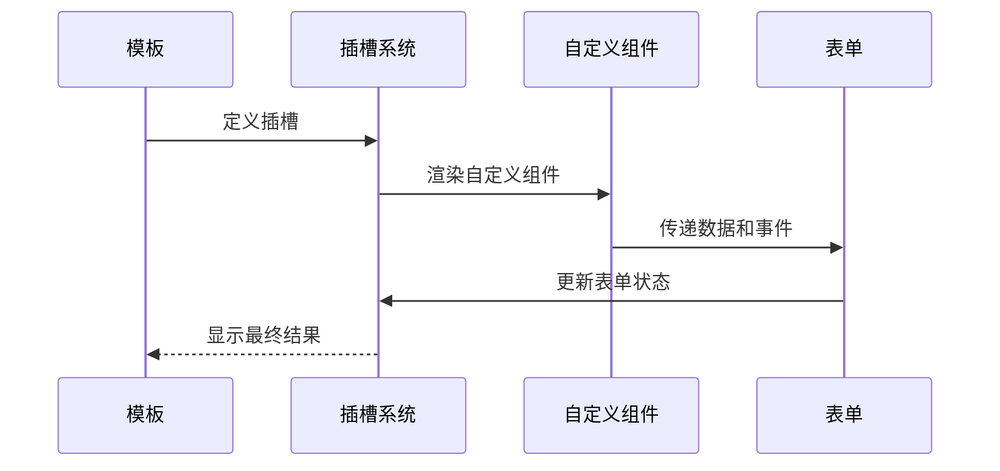
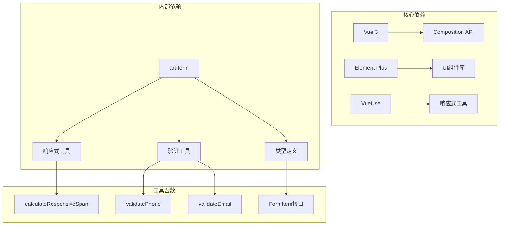

# 表单组件 (art-form)

<cite>
**本文档引用的文件**
- [src/components/core/forms/art-form/index.vue](file://src/components/core/forms/art-form/index.vue)
- [src/types/component/index.ts](file://src/types/component/index.ts)
- [src/views/system/user/index.vue](file://src/views/system/user/index.vue)
- [src/views/system/user/modules/user-dialog.vue](file://src/views/system/user/modules/user-dialog.vue)
- [src/views/system/user/modules/user-search.vue](file://src/views/system/user/modules/user-search.vue)
- [src/views/examples/forms/index.vue](file://src/views/examples/forms/index.vue)
- [src/utils/form/responsive.ts](file://src/utils/form/responsive.ts)
- [src/utils/form/validator.ts](file://src/utils/form/validator.ts)
- [src/utils/form/index.ts](file://src/utils/form/index.ts)
</cite>

## 目录
1. [简介](#简介)
2. [项目结构](#项目结构)
3. [核心组件](#核心组件)
4. [架构概览](#架构概览)
5. [详细组件分析](#详细组件分析)
6. [依赖关系分析](#依赖关系分析)
7. [性能考虑](#性能考虑)
8. [故障排除指南](#故障排除指南)
9. [结论](#结论)

## 简介

art-form是基于Vue 3 Composition API和Element Plus构建的响应式表单组件，提供了灵活的表单配置、验证和渲染能力。该组件支持多种表单控件类型，具备强大的插槽系统和响应式布局特性，能够满足复杂的业务表单需求。

### 主要特性

- **基于Composition API的设计**：充分利用Vue 3的组合式API，提供更好的逻辑复用和代码组织
- **类型安全的表单配置**：通过TypeScript接口确保表单配置的类型安全
- **灵活的表单控件**：支持Element Plus的所有表单控件类型
- **响应式布局**：智能的栅格系统和断点适配
- **强大的验证机制**：内置表单验证规则和异步验证支持
- **插槽扩展**：支持自定义组件和复杂布局的灵活扩展

## 项目结构

art-form组件位于项目的表单组件目录中，与其他核心组件协同工作：



**图表来源**
- [src/components/core/forms/art-form/index.vue](file://src/components/core/forms/art-form/index.vue#L1-L50)
- [src/utils/form/responsive.ts](file://src/utils/form/responsive.ts#L1-L30)

**章节来源**
- [src/components/core/forms/art-form/index.vue](file://src/components/core/forms/art-form/index.vue#L1-L312)

## 核心组件

### 表单配置接口

art-form通过FormProps接口接收表单配置，支持以下核心配置项：

| 配置项 | 类型 | 默认值 | 说明 |
|--------|------|--------|------|
| items | FormItem[] | [] | 表单项配置数组 |
| span | number | 6 | 每列的宽度（基于24格布局） |
| gutter | number | 12 | 表单控件间隙 |
| labelPosition | 'left' \| 'right' \| 'top' | 'right' | 标签位置 |
| labelWidth | string \| number | '70px' | 标签宽度 |
| buttonLeftLimit | number | 2 | 按钮靠左对齐限制 |
| showReset | boolean | true | 是否显示重置按钮 |
| showSubmit | boolean | true | 是否显示提交按钮 |
| disabledSubmit | boolean | false | 是否禁用提交按钮 |

### 表单项接口

FormItem接口定义了单个表单项的完整配置：

| 属性 | 类型 | 说明 |
|------|------|------|
| key | string | 表单项的唯一标识 |
| label | string \| Component | 表单项标签 |
| labelWidth | string \| number | 标签宽度（覆盖全局设置） |
| type | keyof typeof componentMap \| string | 表单项类型 |
| render | Component \| Function | 自定义渲染函数 |
| hidden | boolean | 是否隐藏 |
| span | number | 列宽（基于24格系统） |
| options | Record<string, any> | 选项数据 |
| props | Record<string, any> | 传递给组件的属性 |
| slots | Record<string, Function> | 插槽配置 |
| placeholder | string | 占位符文本 |

**章节来源**
- [src/components/core/forms/art-form/index.vue](file://src/components/core/forms/art-form/index.vue#L152-L176)
- [src/components/core/forms/art-form/index.vue](file://src/components/core/forms/art-form/index.vue#L178-L209)

## 架构概览

art-form采用模块化的架构设计，将功能分解为独立的模块：



**图表来源**
- [src/components/core/forms/art-form/index.vue](file://src/components/core/forms/art-form/index.vue#L98-L311)
- [src/utils/form/validator.ts](file://src/utils/form/validator.ts#L1-L50)
- [src/utils/form/responsive.ts](file://src/utils/form/responsive.ts#L63-L100)

## 详细组件分析

### 组件核心实现

#### 响应式表单数据绑定

art-form使用v-model实现双向数据绑定，通过defineModel创建响应式表单数据：



**图表来源**
- [src/components/core/forms/art-form/index.vue](file://src/components/core/forms/art-form/index.vue#L219-L220)

#### 表单控件渲染机制

组件通过动态组件系统渲染不同的表单控件：



**图表来源**
- [src/components/core/forms/art-form/index.vue](file://src/components/core/forms/art-form/index.vue#L242-L250)

#### 响应式布局系统

art-form实现了智能的响应式布局，根据屏幕尺寸自动调整表单项宽度：

```mermaid
graph LR
A[屏幕宽度检测] --> B{断点判断}
B --> |xs (< 768px)| C[手机模式]
B --> |sm (≥ 768px)| D[平板模式]
B --> |md (≥ 992px)| E[中等屏幕]
B --> |lg (≥ 1200px)| F[大屏幕]
B --> |xl (≥ 1920px)| G[超大屏幕]
C --> H[span ≤ 12: 24<br/>span > 12: 原始span]
D --> I[span ≤ 12: 12<br/>span > 12: 原始span]
E --> J[span ≤ 8: 8<br/>span > 8: 原始span]
F --> K[使用原始span]
G --> K
```

**图表来源**
- [src/utils/form/responsive.ts](file://src/utils/form/responsive.ts#L55-L61)

**章节来源**
- [src/components/core/forms/art-form/index.vue](file://src/components/core/forms/art-form/index.vue#L242-L250)
- [src/utils/form/responsive.ts](file://src/utils/form/responsive.ts#L63-L100)

### 表单验证机制

#### FormRule接口定义

FormRule接口提供了完整的表单验证规则定义：

| 属性 | 类型 | 说明 |
|------|------|------|
| required | boolean | 是否必填 |
| message | string | 错误提示信息 |
| trigger | string \| string[] | 触发方式 |
| min | number | 最小长度 |
| max | number | 最大长度 |
| pattern | RegExp | 正则表达式 |
| validator | Function | 自定义验证函数 |

#### 内置验证工具

art-form集成了强大的验证工具库，支持多种验证场景：



**图表来源**
- [src/types/component/index.ts](file://src/types/component/index.ts#L108-L123)
- [src/utils/form/validator.ts](file://src/utils/form/validator.ts#L55-L150)

**章节来源**
- [src/types/component/index.ts](file://src/types/component/index.ts#L108-L123)
- [src/utils/form/validator.ts](file://src/utils/form/validator.ts#L1-L317)

### 插槽系统

#### 自定义组件渲染

art-form提供了强大的插槽系统，支持自定义组件的灵活扩展：



**图表来源**
- [src/components/core/forms/art-form/index.vue](file://src/components/core/forms/art-form/index.vue#L30-L66)

#### 动态插槽支持

组件支持动态插槽配置，允许在运行时添加或移除插槽：

| 插槽类型 | 用途 | 示例 |
|----------|------|------|
| prepend | 前缀插槽 | 添加图标或文本 |
| append | 后缀插槽 | 添加单位或按钮 |
| prefix | 前置插槽 | 添加标签或装饰 |
| suffix | 后置插槽 | 添加单位或图标 |
| default | 默认插槽 | 自定义内容 |

**章节来源**
- [src/components/core/forms/art-form/index.vue](file://src/components/core/forms/art-form/index.vue#L30-L66)

## 依赖关系分析

### 外部依赖

art-form依赖以下主要外部库：



**图表来源**
- [src/components/core/forms/art-form/index.vue](file://src/components/core/forms/art-form/index.vue#L99-L119)

### 内部模块依赖

art-form与项目其他模块的集成关系：

| 模块 | 依赖关系 | 用途 |
|------|----------|------|
| art-search-bar | 继承 | 搜索表单的基础功能 |
| user-dialog | 使用 | 用户管理表单 |
| user-search | 使用 | 用户搜索表单 |
| examples/forms | 示例 | 完整的使用示例 |

**章节来源**
- [src/components/core/forms/art-form/index.vue](file://src/components/core/forms/art-form/index.vue#L99-L119)
- [src/views/system/user/modules/user-dialog.vue](file://src/views/system/user/modules/user-dialog.vue#L42-L44)

## 性能考虑

### 响应式优化

art-form采用了多种性能优化策略：

1. **计算属性缓存**：使用computed缓存复杂的计算结果
2. **懒加载选项**：异步加载表单项的选项数据
3. **虚拟滚动**：对于大量选项的下拉选择器
4. **防抖处理**：对频繁触发的验证进行防抖

### 内存管理

组件实现了良好的内存管理机制：

- 自动清理事件监听器
- 避免循环引用
- 及时释放大型对象

## 故障排除指南

### 常见问题及解决方案

#### 表单验证问题

**问题**：表单验证不生效
**解决方案**：
1. 检查rules配置是否正确
2. 确认表单项的key与rules匹配
3. 验证trigger触发时机

#### 响应式布局问题

**问题**：表单项在小屏幕下显示异常
**解决方案**：
1. 检查span配置是否合理
2. 验证断点配置是否正确
3. 确认gutter设置是否合适

#### 插槽渲染问题

**问题**：自定义插槽不显示
**解决方案**：
1. 检查插槽名称是否正确
2. 确认插槽作用域变量
3. 验证组件导入是否完整

**章节来源**
- [src/components/core/forms/art-form/index.vue](file://src/components/core/forms/art-form/index.vue#L280-L307)

## 结论

art-form是一个功能强大、设计精良的响应式表单组件，它成功地将Vue 3的Composition API与Element Plus的优势结合起来，为开发者提供了灵活、易用且高性能的表单解决方案。

### 主要优势

1. **类型安全**：完整的TypeScript类型定义确保开发时的类型安全
2. **灵活扩展**：强大的插槽系统支持各种自定义需求
3. **响应式设计**：智能的布局系统适应各种屏幕尺寸
4. **验证完善**：内置丰富的验证工具和规则
5. **易于使用**：简洁的API设计降低学习成本

### 最佳实践

1. **合理配置表单结构**：根据业务需求选择合适的布局和验证规则
2. **优化性能**：对于大型表单，考虑使用懒加载和虚拟滚动
3. **保持代码整洁**：使用工厂函数创建表单项配置
4. **测试覆盖**：确保表单的各种交互场景都经过充分测试

art-form为现代Web应用的表单开发提供了优秀的基础设施，是构建高质量用户界面的重要工具。