# 表单组件

<cite>
**本文档中引用的文件**
- [art-form/index.vue](file://src/components/core/forms/art-form/index.vue)
- [art-search-bar/index.vue](file://src/components/core/forms/art-search-bar/index.vue)
- [art-drag-verify/index.vue](file://src/components/core/forms/art-drag-verify/index.vue)
- [art-excel-import/index.vue](file://src/components/core/forms/art-excel-import/index.vue)
- [art-excel-export/index.vue](file://src/components/core/forms/art-excel-export/index.vue)
- [art-wang-editor/index.vue](file://src/components/core/forms/art-wang-editor/index.vue)
- [types/component/index.ts](file://src/types/component/index.ts)
- [utils/form/validator.ts](file://src/utils/form/validator.ts)
- [utils/form/responsive.ts](file://src/utils/form/responsive.ts)
- [views/examples/forms/index.vue](file://src/views/examples/forms/index.vue)
- [views/examples/forms/search-bar.vue](file://src/views/examples/forms/search-bar.vue)
</cite>

## 目录
1. [简介](#简介)
2. [项目结构](#项目结构)
3. [核心组件](#核心组件)
4. [架构概览](#架构概览)
5. [详细组件分析](#详细组件分析)
6. [类型定义与验证](#类型定义与验证)
7. [响应式布局系统](#响应式布局系统)
8. [最佳实践](#最佳实践)
9. [故障排除](#故障排除)
10. [总结](#总结)

## 简介

Art Design Pro 提供了一套完整的表单组件解决方案，包含表单布局、数据绑定、验证规则集成、搜索功能、拖拽验证、文件处理和富文本编辑等功能。这些组件设计遵循 Element Plus 的 API 设计理念，提供类型安全的开发体验和高度可定制的配置选项。

## 项目结构

表单组件位于 `src/components/core/forms/` 目录下，包含以下核心组件：

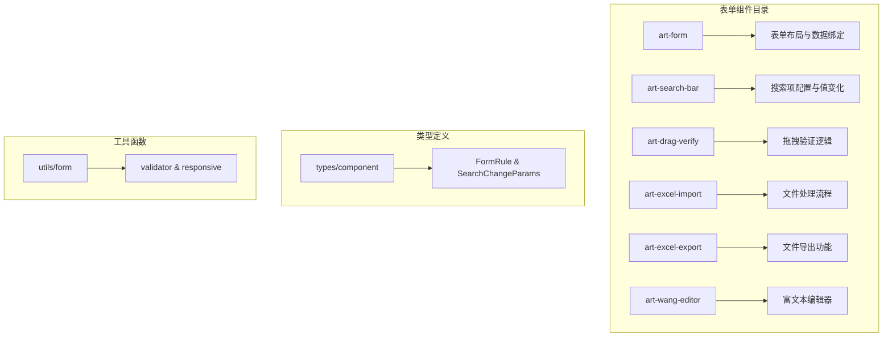

**图表来源**
- [art-form/index.vue](file://src/components/core/forms/art-form/index.vue#L1-L312)
- [art-search-bar/index.vue](file://src/components/core/forms/art-search-bar/index.vue#L1-L438)
- [types/component/index.ts](file://src/types/component/index.ts#L1-L146)

## 核心组件

### 组件特性概览

| 组件 | 主要功能 | 核心特性 |
|------|----------|----------|
| art-form | 表单布局与数据绑定 | 类型安全、响应式布局、插槽支持 |
| art-search-bar | 搜索项配置与值变化 | 展开收起、动态表单项、事件处理 |
| art-drag-verify | 拖拽验证逻辑 | 安全校验、动画效果、移动端适配 |
| art-excel-import | 文件处理流程 | 错误恢复、进度监控、格式验证 |
| art-excel-export | 文件导出功能 | 大数据处理、自定义格式、批量导出 |
| art-wang-editor | 富文本编辑器 | 图片上传、自定义样式、工具栏配置 |

**章节来源**
- [art-form/index.vue](file://src/components/core/forms/art-form/index.vue#L1-L312)
- [art-search-bar/index.vue](file://src/components/core/forms/art-search-bar/index.vue#L1-L438)
- [art-drag-verify/index.vue](file://src/components/core/forms/art-drag-verify/index.vue#L1-L431)
- [art-excel-import/index.vue](file://src/components/core/forms/art-excel-import/index.vue#L1-L63)
- [art-excel-export/index.vue](file://src/components/core/forms/art-excel-export/index.vue#L1-L390)
- [art-wang-editor/index.vue](file://src/components/core/forms/art-wang-editor/index.vue#L1-L220)

## 架构概览

### 组件间关系图

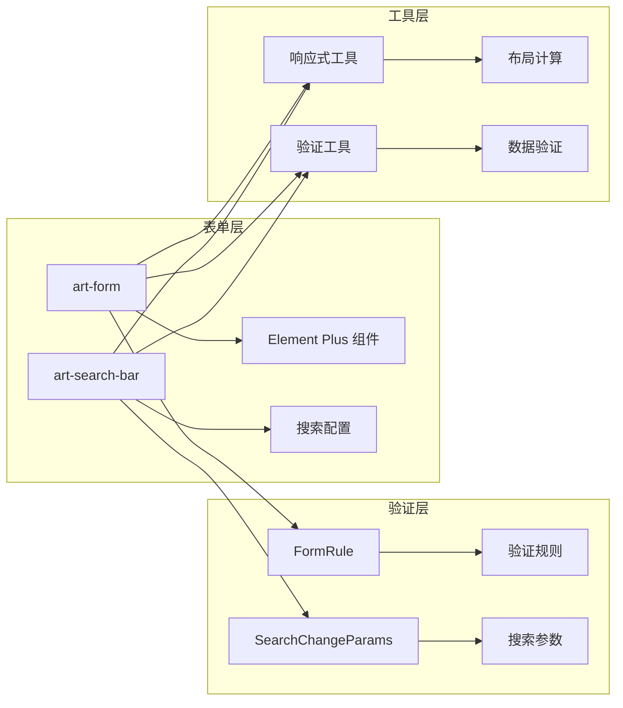

**图表来源**
- [types/component/index.ts](file://src/types/component/index.ts#L107-L123)
- [utils/form/responsive.ts](file://src/utils/form/responsive.ts#L1-L123)
- [utils/form/validator.ts](file://src/utils/form/validator.ts#L1-L317)

## 详细组件分析

### art-form - 表单组件

art-form 是一个功能强大的表单组件，支持多种表单控件类型、自定义组件渲染和插槽系统。

#### 核心功能架构

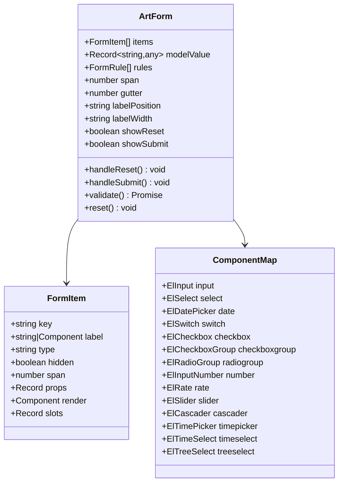

**图表来源**
- [art-form/index.vue](file://src/components/core/forms/art-form/index.vue#L152-L176)
- [art-form/index.vue](file://src/components/core/forms/art-form/index.vue#L124-L142)

#### 表单布局系统

art-form 采用基于 Element Plus Grid 的响应式布局系统：

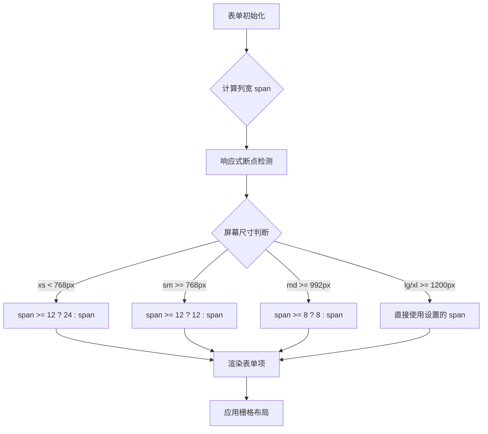

**图表来源**
- [utils/form/responsive.ts](file://src/utils/form/responsive.ts#L64-L100)

**章节来源**
- [art-form/index.vue](file://src/components/core/forms/art-form/index.vue#L1-L312)
- [utils/form/responsive.ts](file://src/utils/form/responsive.ts#L1-L123)

### art-search-bar - 搜索栏组件

art-search-bar 专为表格搜索场景设计，提供灵活的搜索项配置和动态展开功能。

#### 搜索配置架构

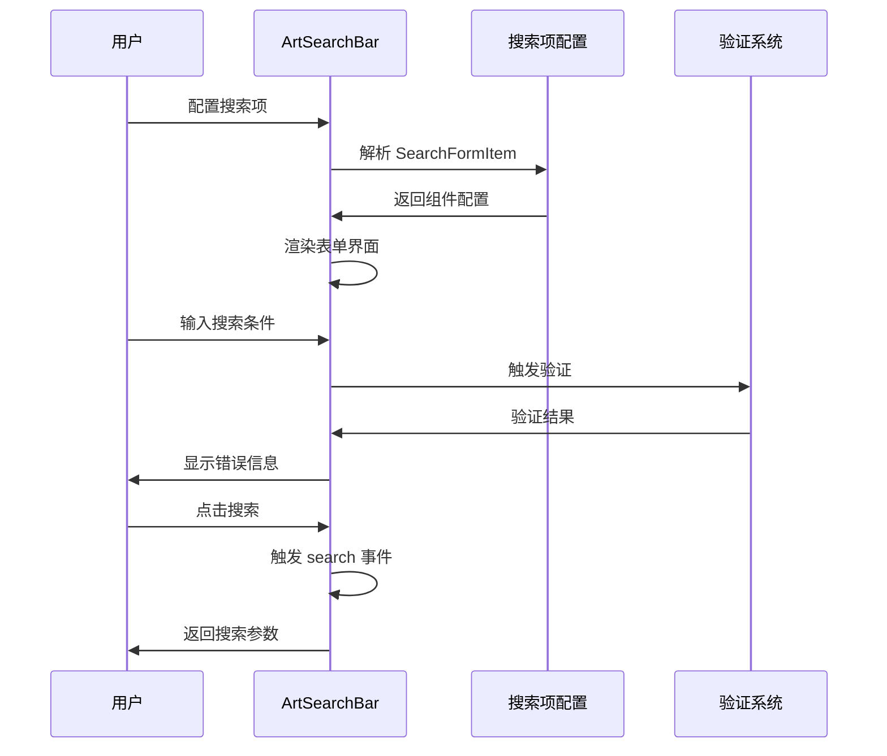

**图表来源**
- [art-search-bar/index.vue](file://src/components/core/forms/art-search-bar/index.vue#L159-L182)
- [types/component/index.ts](file://src/types/component/index.ts#L42-L46)

#### 展开收起逻辑

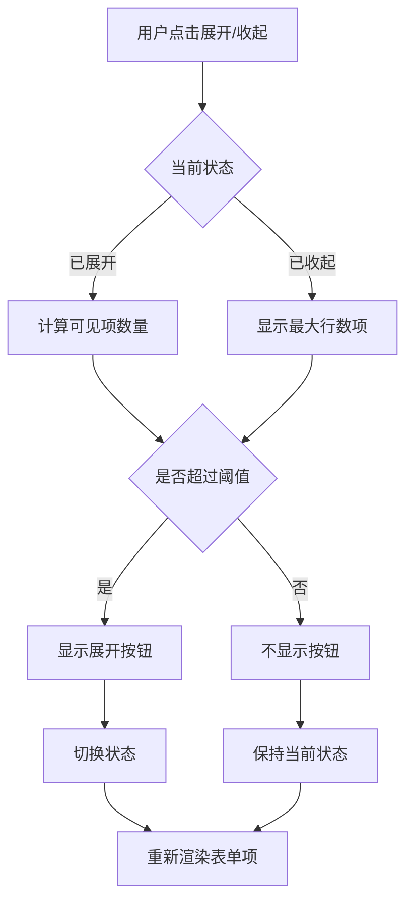

**图表来源**
- [art-search-bar/index.vue](file://src/components/core/forms/art-search-bar/index.vue#L283-L302)

**章节来源**
- [art-search-bar/index.vue](file://src/components/core/forms/art-search-bar/index.vue#L1-L438)
- [types/component/index.ts](file://src/types/component/index.ts#L25-L46)

### art-drag-verify - 拖拽验证组件

art-drag-verify 提供安全可靠的拖拽验证功能，支持多种样式配置和动画效果。

#### 验证流程架构

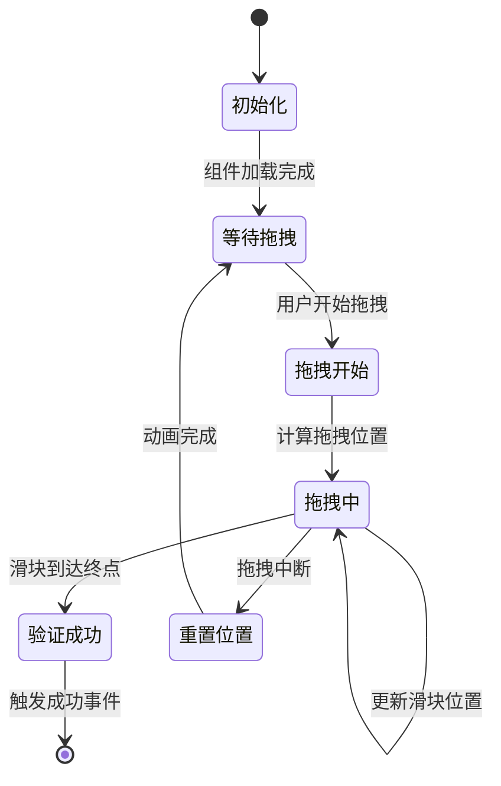

**图表来源**
- [art-drag-verify/index.vue](file://src/components/core/forms/art-drag-verify/index.vue#L232-L292)

#### 安全校验机制

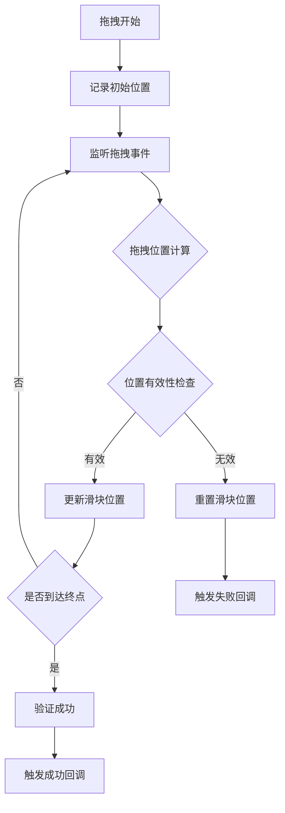

**图表来源**
- [art-drag-verify/index.vue](file://src/components/core/forms/art-drag-verify/index.vue#L247-L292)

**章节来源**
- [art-drag-verify/index.vue](file://src/components/core/forms/art-drag-verify/index.vue#L1-L431)

### art-excel-import - Excel 导入组件

art-excel-import 提供完整的 Excel 文件导入功能，支持错误处理和进度监控。

#### 文件处理流程

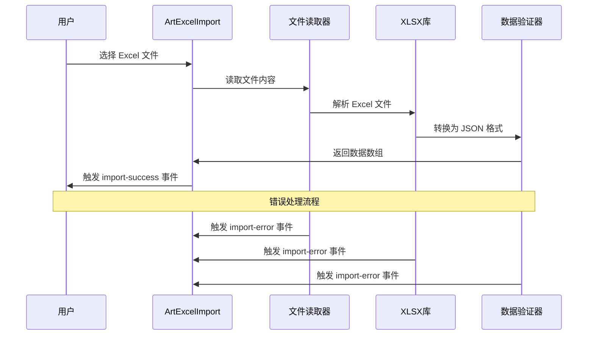

**图表来源**
- [art-excel-import/index.vue](file://src/components/core/forms/art-excel-import/index.vue#L24-L60)

**章节来源**
- [art-excel-import/index.vue](file://src/components/core/forms/art-excel-import/index.vue#L1-L63)

### art-excel-export - Excel 导出组件

art-excel-export 提供高性能的 Excel 导出功能，支持大数据处理和自定义格式。

#### 导出性能优化流程

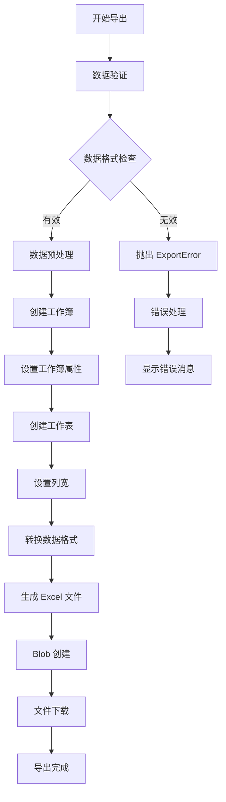

**图表来源**
- [art-excel-export/index.vue](file://src/components/core/forms/art-excel-export/index.vue#L240-L315)

#### 大数据处理策略

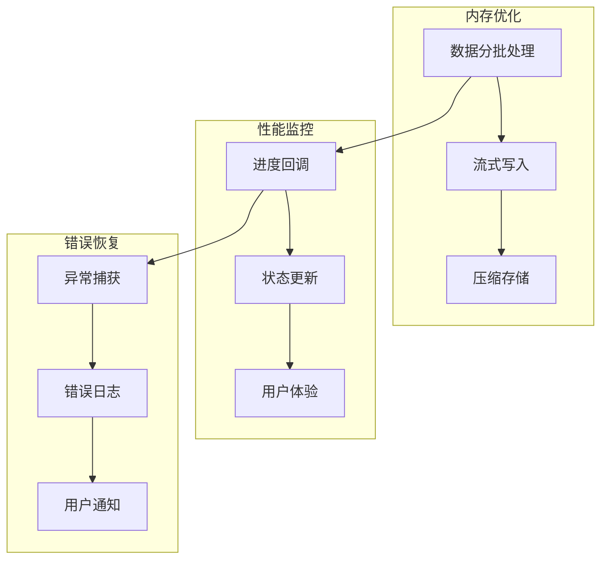

**图表来源**
- [art-excel-export/index.vue](file://src/components/core/forms/art-excel-export/index.vue#L318-L365)

**章节来源**
- [art-excel-export/index.vue](file://src/components/core/forms/art-excel-export/index.vue#L1-L390)

### art-wang-editor - 富文本编辑器

art-wang-editor 集成 Wangeditor，提供丰富的富文本编辑功能和图片上传支持。

#### 编辑器集成架构

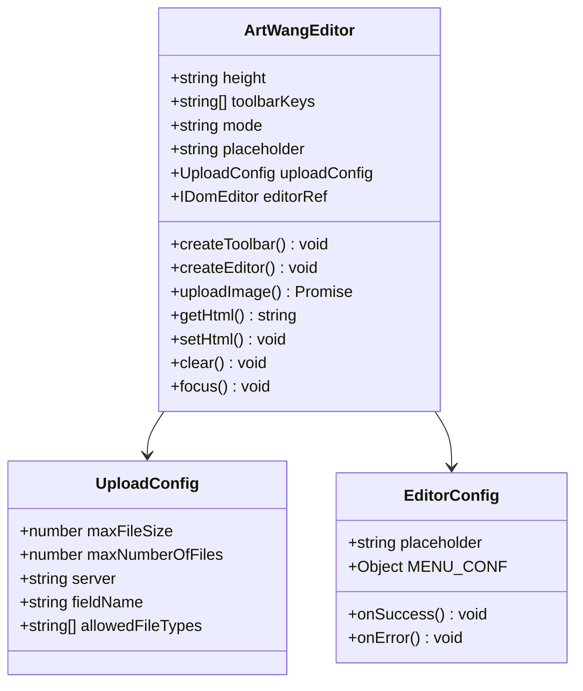

**图表来源**
- [art-wang-editor/index.vue](file://src/components/core/forms/art-wang-editor/index.vue#L31-L57)
- [art-wang-editor/index.vue](file://src/components/core/forms/art-wang-editor/index.vue#L108-L127)

#### 图片上传流程

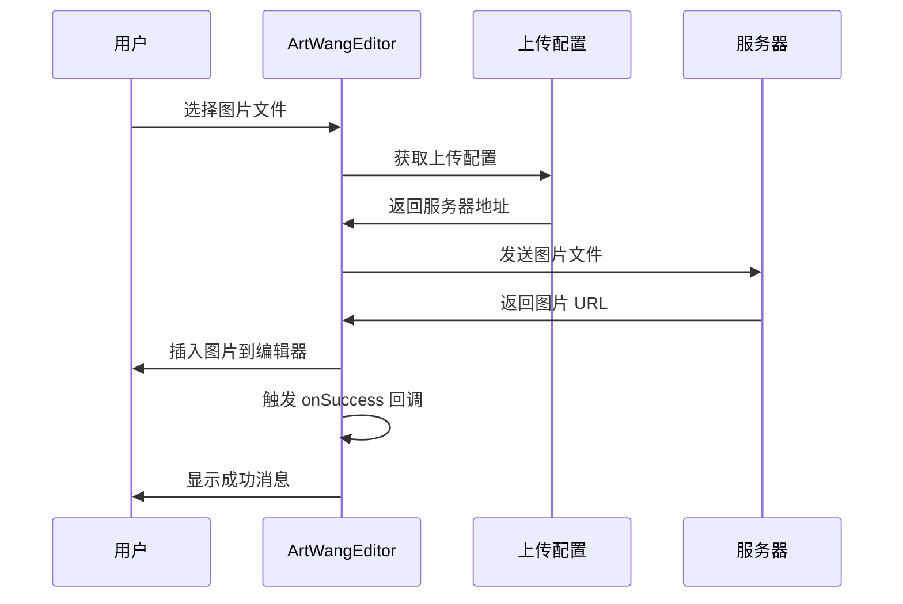

**图表来源**
- [art-wang-editor/index.vue](file://src/components/core/forms/art-wang-editor/index.vue#L111-L126)

**章节来源**
- [art-wang-editor/index.vue](file://src/components/core/forms/art-wang-editor/index.vue#L1-L220)

## 类型定义与验证

### FormRule 类型系统

FormRule 提供类型安全的表单验证规则定义：

```typescript
interface FormRule {
  required?: boolean
  message?: string
  trigger?: string | string[]
  min?: number
  max?: number
  pattern?: RegExp
  validator?: (rule: any, value: any, callback: any) => void
}
```

### SearchChangeParams 类型

SearchChangeParams 定义搜索参数的类型安全：

```typescript
interface SearchChangeParams {
  prop: string
  val: unknown
}
```

### 验证工具函数

系统提供了丰富的验证工具函数：

| 验证函数 | 功能描述 | 使用场景 |
|----------|----------|----------|
| validatePhone | 手机号码验证 | 用户注册、联系方式 |
| validateEmail | 邮箱地址验证 | 用户登录、联系信息 |
| validatePassword | 密码强度验证 | 用户密码设置 |
| validateStrongPassword | 强密码验证 | 高安全要求场景 |
| validateBankCard | 银行卡号验证 | 支付功能 |
| validateChineseIDCard | 身份证验证 | 实名认证 |

**章节来源**
- [types/component/index.ts](file://src/types/component/index.ts#L107-L123)
- [utils/form/validator.ts](file://src/utils/form/validator.ts#L1-L317)

## 响应式布局系统

### 断点配置

系统采用 Element Plus Grid 的响应式断点：

| 断点 | 屏幕宽度 | span 降级规则 |
|------|----------|---------------|
| xs | < 768px | span >= 12 ? 24 : span |
| sm | ≥ 768px | span >= 12 ? 12 : span |
| md | ≥ 992px | span >= 8 ? 8 : span |
| lg | ≥ 1200px | 直接使用设置的 span |
| xl | ≥ 1920px | 直接使用设置的 span |

### 响应式计算函数

```typescript
function calculateResponsiveSpan(
  itemSpan: number | undefined,
  defaultSpan: number,
  breakpoint: ResponsiveBreakpoint
): number {
  const finalSpan = itemSpan ?? defaultSpan
  const config = BREAKPOINT_CONFIG[breakpoint]
  
  if (!config) return finalSpan
  
  return finalSpan >= config.threshold ? finalSpan : config.fallback
}
```

**章节来源**
- [utils/form/responsive.ts](file://src/utils/form/responsive.ts#L1-L123)

## 最佳实践

### 复杂表单场景集成

#### 动态表单项

```typescript
// 动态添加表单项
const formItems = computed(() => [
  ...baseItems,
  ...(showAdvanced ? advancedItems : [])
])

// 条件隐藏表单项
{
  label: '高级选项',
  key: 'advancedOption',
  type: 'input',
  hidden: !showAdvanced
}
```

#### 异步验证

```typescript
// 自定义异步验证器
const asyncValidator = (rule, value, callback) => {
  setTimeout(() => {
    if (value === 'valid') {
      callback()
    } else {
      callback(new Error('验证失败'))
    }
  }, 1000)
}

// 表单规则配置
const formRules = {
  username: [
    { required: true, message: '请输入用户名' },
    { validator: asyncValidator, trigger: 'blur' }
  ]
}
```

### 性能优化建议

1. **懒加载组件**：对于复杂的表单项使用懒加载
2. **防抖处理**：对频繁触发的验证进行防抖
3. **虚拟滚动**：大量数据时使用虚拟滚动
4. **缓存策略**：缓存静态配置和选项数据

### 错误处理最佳实践

```typescript
// 统一错误处理
const handleError = (error) => {
  if (error instanceof ExportError) {
    ElMessage.error(error.message)
  } else {
    ElMessage.error('操作失败，请稍后重试')
  }
}

// 表单验证错误处理
const handleFormError = (error) => {
  if (error.errorFields) {
    error.errorFields.forEach(field => {
      ElMessage.error(`${field.name} 验证失败: ${field.errors.join(', ')}`)
    })
  }
}
```

## 故障排除

### 常见问题及解决方案

#### 表单验证问题

**问题**：表单验证不生效
**解决方案**：
1. 检查 FormRule 配置是否正确
2. 确认触发时机设置（trigger）
3. 验证数据绑定是否正确

#### 响应式布局问题

**问题**：表单项在小屏幕下显示异常
**解决方案**：
1. 检查 span 配置
2. 验证断点设置
3. 确认 gutter 值合适

#### Excel 导入导出问题

**问题**：大文件处理超时
**解决方案**：
1. 增加 maxRows 限制
2. 使用分批处理
3. 优化数据格式

#### 富文本编辑器问题

**问题**：图片上传失败
**解决方案**：
1. 检查服务器配置
2. 验证 CORS 设置
3. 确认文件大小限制

**章节来源**
- [art-excel-export/index.vue](file://src/components/core/forms/art-excel-export/index.vue#L344-L360)
- [art-wang-editor/index.vue](file://src/components/core/forms/art-wang-editor/index.vue#L123-L126)

## 总结

Art Design Pro 的表单组件系统提供了完整的表单开发解决方案，具有以下特点：

1. **类型安全**：完整的 TypeScript 类型定义，确保开发时的类型安全
2. **高度可定制**：丰富的配置选项和插槽系统，满足各种业务需求
3. **响应式设计**：智能的响应式布局系统，适配各种设备
4. **性能优化**：针对大数据场景的性能优化策略
5. **错误处理**：完善的错误处理和恢复机制
6. **易于集成**：遵循 Element Plus 设计理念，易于学习和使用

这套表单组件系统能够满足从简单表单到复杂业务场景的各种需求，为开发者提供了高效、可靠的表单开发体验。