# 仪表盘视图

<cite>
**本文档中引用的文件**
- [src/router/modules/dashboard.ts](file://src/router/modules/dashboard.ts)
- [src/views/dashboard/analysis/index.vue](file://src/views/dashboard/analysis/index.vue)
- [src/views/dashboard/console/index.vue](file://src/views/dashboard/console/index.vue)
- [src/views/dashboard/ecommerce/index.vue](file://src/views/dashboard/ecommerce/index.vue)
- [src/views/dashboard/analysis/modules/today-sales.vue](file://src/views/dashboard/analysis/modules/today-sales.vue)
- [src/views/dashboard/console/modules/card-list.vue](file://src/views/dashboard/console/modules/card-list.vue)
- [src/views/dashboard/ecommerce/modules/sales-trend.vue](file://src/views/dashboard/ecommerce/modules/sales-trend.vue)
- [src/views/dashboard/analysis/modules/total-revenue.vue](file://src/views/dashboard/analysis/modules/total-revenue.vue)
- [src/views/dashboard/console/modules/active-user.vue](file://src/views/dashboard/console/modules/active-user.vue)
- [src/views/dashboard/ecommerce/modules/total-order-volume.vue](file://src/views/dashboard/ecommerce/modules/total-order-volume.vue)
- [src/components/core/charts/art-line-chart/index.vue](file://src/components/core/charts/art-line-chart/index.vue)
- [src/components/core/cards/art-stats-card/index.vue](file://src/components/core/cards/art-stats-card/index.vue)
- [src/plugins/echarts.ts](file://src/plugins/echarts.ts)
- [src/hooks/core/useChart.ts](file://src/hooks/core/useChart.ts)
- [src/types/component/chart.ts](file://src/types/component/chart.ts)
</cite>

## 目录
1. [项目概述](#项目概述)
2. [路由架构](#路由架构)
3. [页面结构设计](#页面结构设计)
4. [数据可视化组件](#数据可视化组件)
5. [ECharts集成实现](#echarts集成实现)
6. [模块化设计模式](#模块化设计模式)
7. [数据获取与状态管理](#数据获取与状态管理)
8. [性能优化策略](#性能优化策略)
9. [响应式布局设计](#响应式布局设计)
10. [最佳实践建议](#最佳实践建议)

## 项目概述

Art Design Pro 仪表盘模块是一个基于 Vue 3 和 TypeScript 构建的现代化数据分析平台，提供了三个核心子模块：分析页、控制台页和电商页。该模块采用模块化设计理念，集成了丰富的数据可视化组件，并通过 ECharts 实现高性能的图表渲染。

### 核心特性

- **三大核心模块**：分析页专注于业务数据分析，控制台页提供工作台功能，电商页专门处理电商业务指标
- **响应式设计**：基于 Element Plus 的栅格系统，完美适配不同屏幕尺寸
- **高性能图表**：集成 ECharts，支持多种图表类型和交互功能
- **模块化架构**：清晰的组件分离，便于维护和扩展
- **主题适配**：支持深色/浅色主题自动切换

## 路由架构

仪表盘模块采用嵌套路由设计，通过 `dashboard.ts` 配置文件定义路由结构：

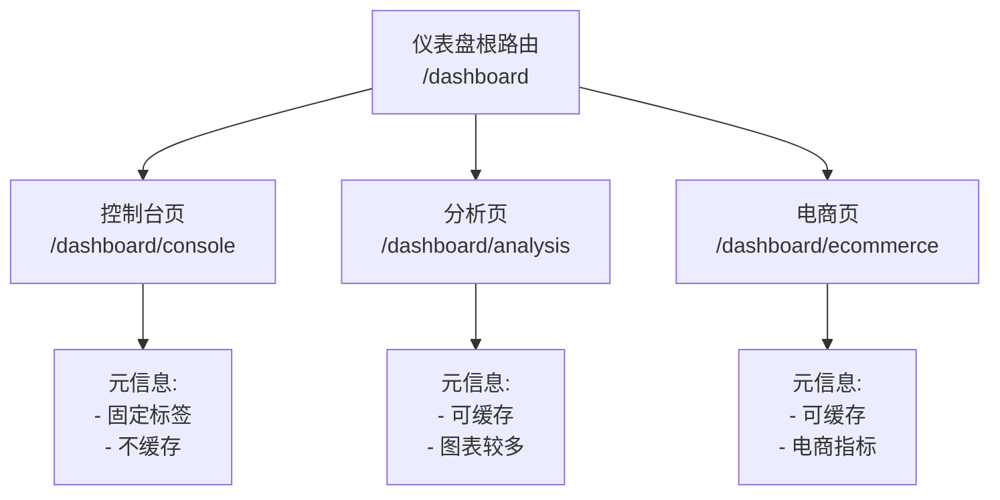

**图表来源**
- [src/router/modules/dashboard.ts](file://src/router/modules/dashboard.ts#L3-L45)

### 路由配置特点

| 页面 | 路径 | 缓存策略 | 固定标签 | 权限控制 |
|------|------|----------|----------|----------|
| 控制台页 | `/dashboard/console` | 否 | 是 | R_SUPER, R_ADMIN |
| 分析页 | `/dashboard/analysis` | 否 | 否 | R_SUPER, R_ADMIN |
| 电商页 | `/dashboard/ecommerce` | 否 | 否 | R_SUPER, R_ADMIN |

**章节来源**
- [src/router/modules/dashboard.ts](file://src/router/modules/dashboard.ts#L3-L45)

## 页面结构设计

### 分析页架构

分析页采用两栏布局，左侧展示实时销售数据，右侧显示访客洞察：

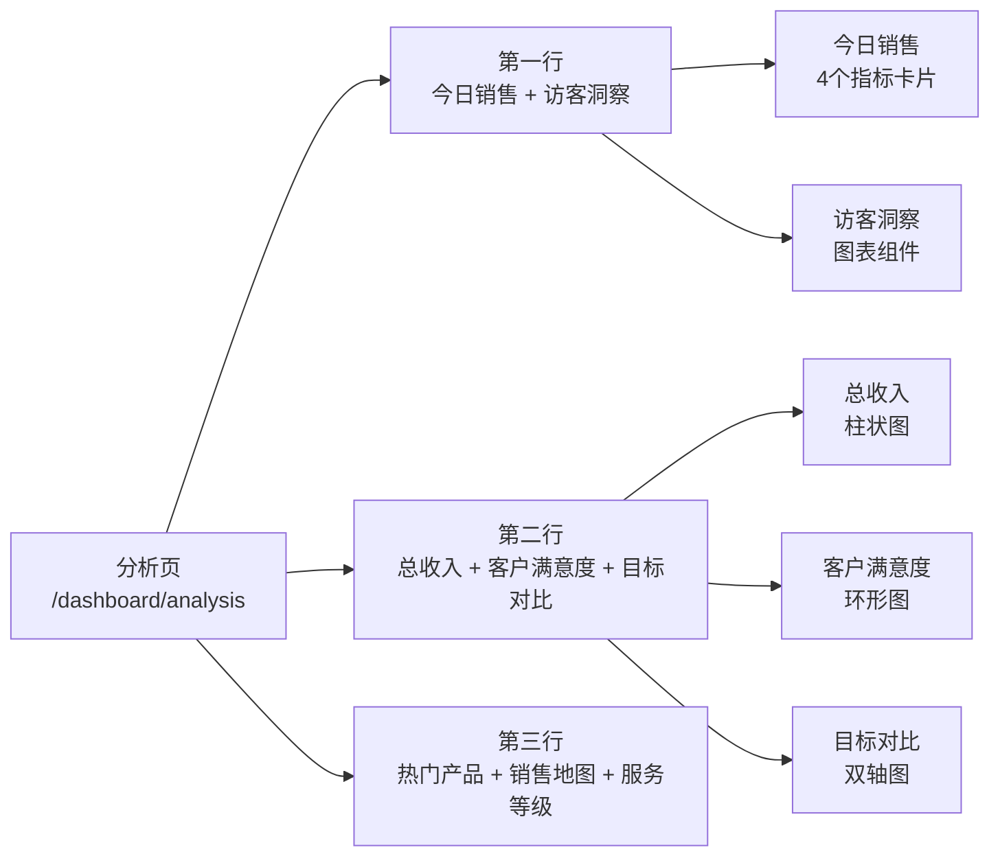

**图表来源**
- [src/views/dashboard/analysis/index.vue](file://src/views/dashboard/analysis/index.vue#L4-L36)

### 控制台页架构

控制台页采用灵活的网格布局，支持多种组合排列：

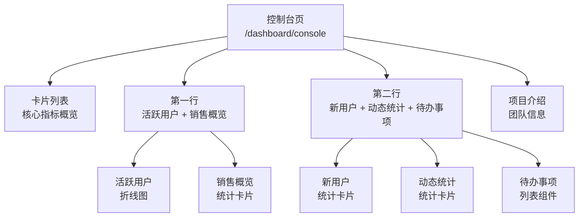

**图表来源**
- [src/views/dashboard/console/index.vue](file://src/views/dashboard/console/index.vue#L4-L28)

### 电商页架构

电商页采用复杂的网格布局，展示电商业务的全方位指标：

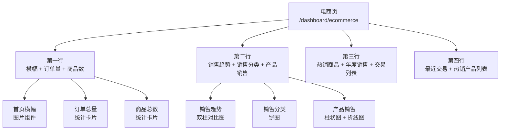

**图表来源**
- [src/views/dashboard/ecommerce/index.vue](file://src/views/dashboard/ecommerce/index.vue#L4-L58)

**章节来源**
- [src/views/dashboard/analysis/index.vue](file://src/views/dashboard/analysis/index.vue#L1-L51)
- [src/views/dashboard/console/index.vue](file://src/views/dashboard/console/index.vue#L1-L42)
- [src/views/dashboard/ecommerce/index.vue](file://src/views/dashboard/ecommerce/index.vue#L1-L78)

## 数据可视化组件

### 统计卡片组件

统计卡片是仪表盘中最基础的展示组件，提供简洁的数据展示：

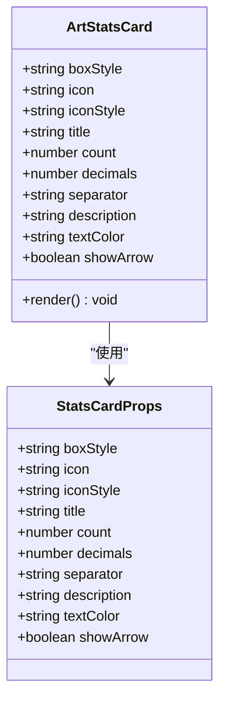

**图表来源**
- [src/components/core/cards/art-stats-card/index.vue](file://src/components/core/cards/art-stats-card/index.vue#L36-L67)

### 图表组件体系

仪表盘集成了完整的图表组件库，支持多种图表类型：

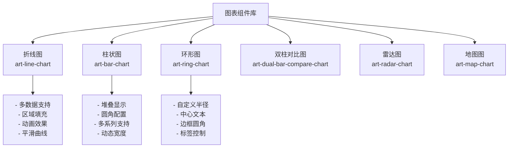

**图表来源**
- [src/components/core/charts/art-line-chart/index.vue](file://src/components/core/charts/art-line-chart/index.vue#L1-L372)

### 组件交互设计

每个图表组件都具备完善的交互功能：

| 交互类型 | 功能描述 | 实现方式 |
|----------|----------|----------|
| 数据提示框 | 鼠标悬停显示详细数据 | Tooltip 组件 |
| 图例控制 | 点击图例显示/隐藏系列 | Legend 组件 |
| 动画过渡 | 数据变化时的平滑过渡 | ECharts 动画引擎 |
| 响应式调整 | 窗口大小变化时自动调整 | Resize 事件监听 |

**章节来源**
- [src/components/core/cards/art-stats-card/index.vue](file://src/components/core/cards/art-stats-card/index.vue#L1-L68)
- [src/components/core/charts/art-line-chart/index.vue](file://src/components/core/charts/art-line-chart/index.vue#L1-L372)

## ECharts集成实现

### 插件配置架构

ECharts 插件采用按需导入策略，优化包体积：

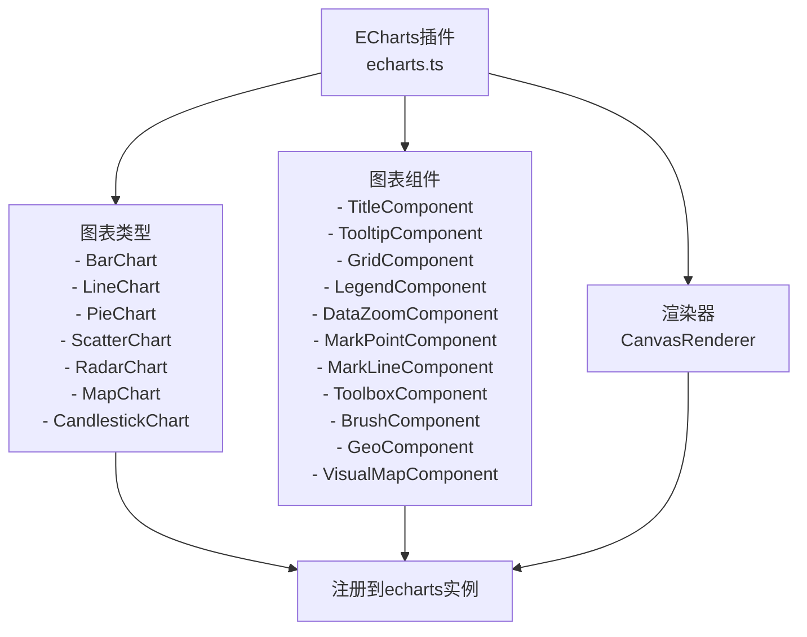

**图表来源**
- [src/plugins/echarts.ts](file://src/plugins/echarts.ts#L12-L69)

### 图表生命周期管理

useChart Hook 提供完整的图表生命周期管理：

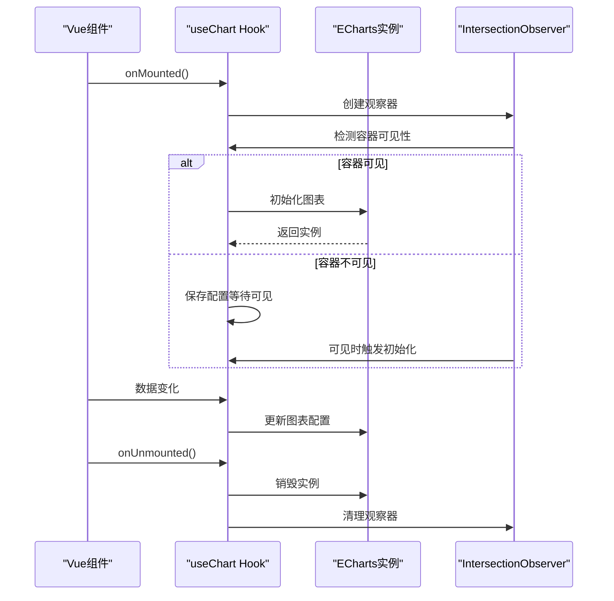

**图表来源**
- [src/hooks/core/useChart.ts](file://src/hooks/core/useChart.ts#L384-L427)

### 主题适配机制

图表组件支持深色/浅色主题自动切换：

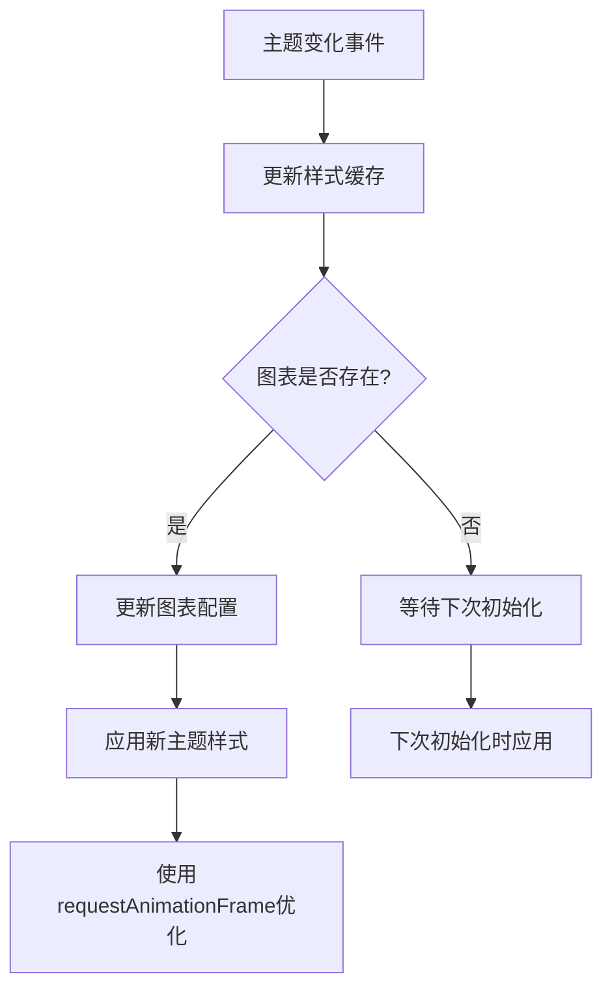

**图表来源**
- [src/hooks/core/useChart.ts](file://src/hooks/core/useChart.ts#L164-L183)

**章节来源**
- [src/plugins/echarts.ts](file://src/plugins/echarts.ts#L1-L77)
- [src/hooks/core/useChart.ts](file://src/hooks/core/useChart.ts#L1-L746)

## 模块化设计模式

### 组件层次结构

仪表盘采用三层组件架构：

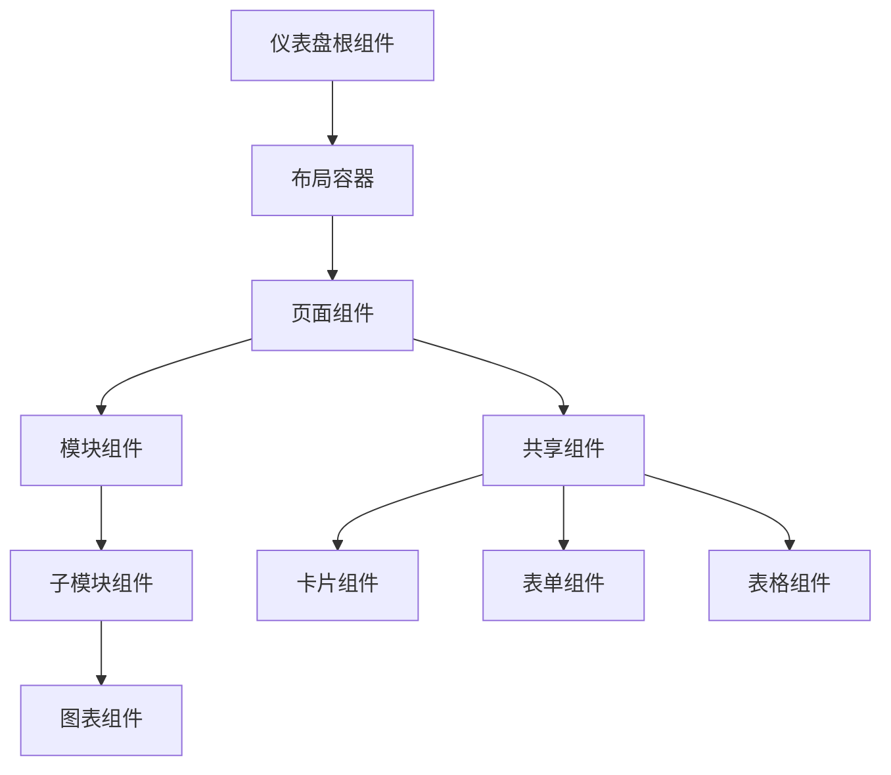

### 可复用模块组织

各个子模块都遵循相同的组织模式：

| 组件层级 | 文件命名规范 | 功能职责 |
|----------|--------------|----------|
| 页面组件 | `index.vue` | 整体布局和数据聚合 |
| 模块组件 | `{模块名}.vue` | 具体功能实现 |
| 子模块 | `modules/{功能名}.vue` | 最小可复用单元 |
| 工具组件 | `widget/{组件名}.vue` | 辅助功能组件 |

### 数据流设计

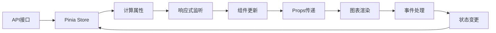

**章节来源**
- [src/views/dashboard/analysis/modules/today-sales.vue](file://src/views/dashboard/analysis/modules/today-sales.vue#L1-L87)
- [src/views/dashboard/console/modules/card-list.vue](file://src/views/dashboard/console/modules/card-list.vue#L1-L75)

## 数据获取与状态管理

### 数据获取流程

仪表盘采用异步数据获取策略，确保用户体验：

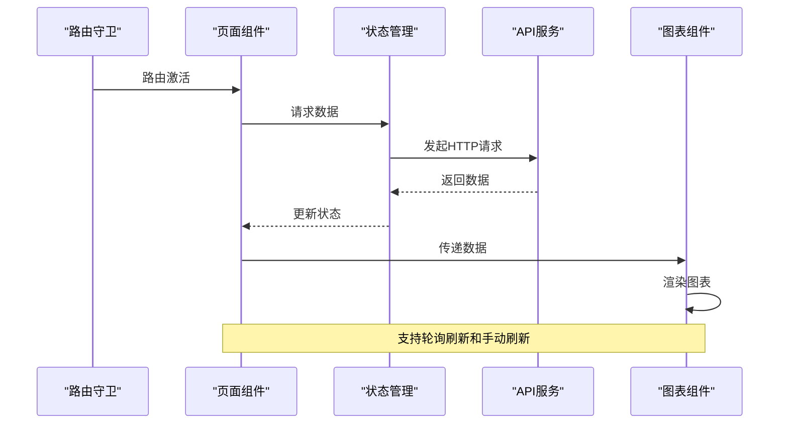

### 响应式更新机制

组件采用 Vue 3 的响应式系统实现数据绑定：

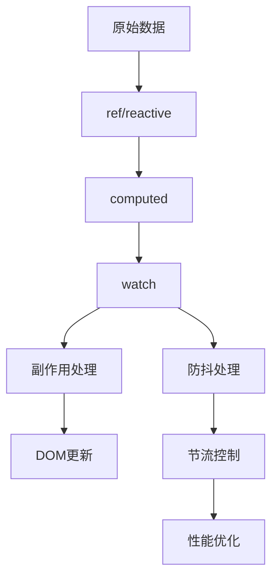

### 状态管理模式

| 状态类型 | 存储位置 | 更新方式 | 生命周期 |
|----------|----------|----------|----------|
| 用户偏好 | Pinia Store | 手动更新 | 应用级 |
| 页面数据 | 组件内 | 异步获取 | 页面级 |
| 图表配置 | 组件Props | 响应式绑定 | 组件级 |
| 主题状态 | CSS变量 | 自动同步 | 全局级 |

**章节来源**
- [src/views/dashboard/analysis/modules/total-revenue.vue](file://src/views/dashboard/analysis/modules/total-revenue.vue#L1-L45)
- [src/views/dashboard/console/modules/active-user.vue](file://src/views/dashboard/console/modules/active-user.vue#L1-L48)

## 性能优化策略

### 懒加载实现

仪表盘采用多种懒加载策略提升性能：

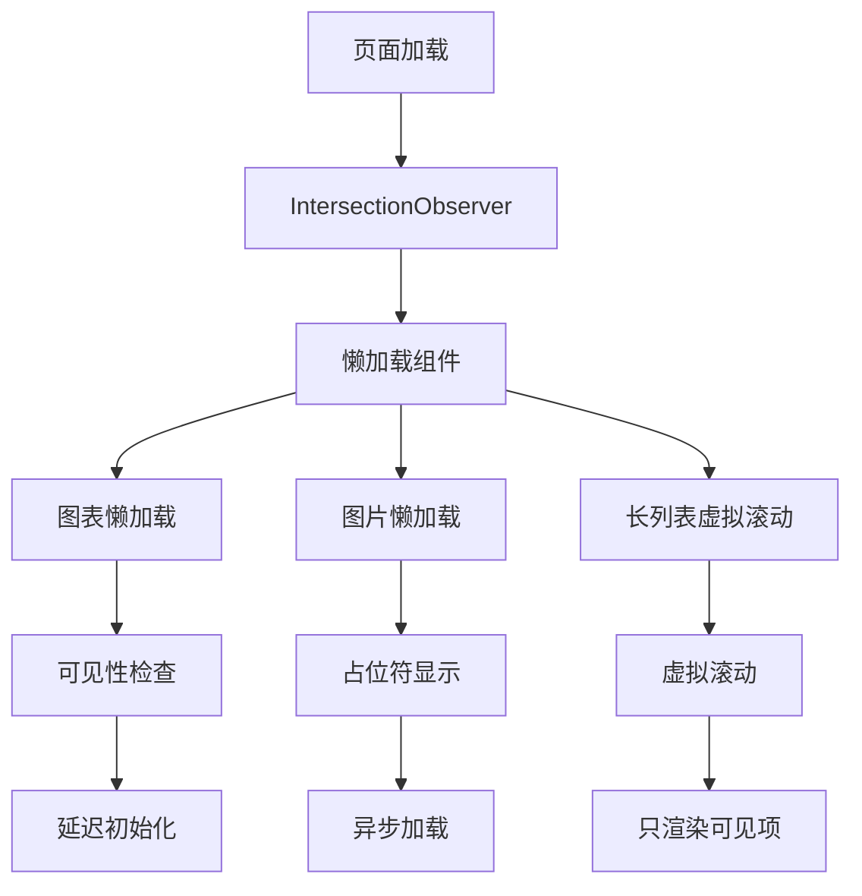

### 数据缓存策略

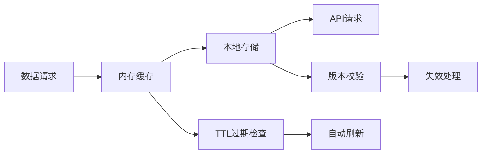

### 性能监控指标

| 性能指标 | 监控方法 | 优化目标 |
|----------|----------|----------|
| 首屏加载时间 | Navigation Timing API | < 2秒 |
| 图表渲染时间 | requestAnimationFrame | < 100ms |
| 内存使用率 | Performance API | < 50MB |
| CPU占用率 | Web Workers | < 30% |

### 内存管理

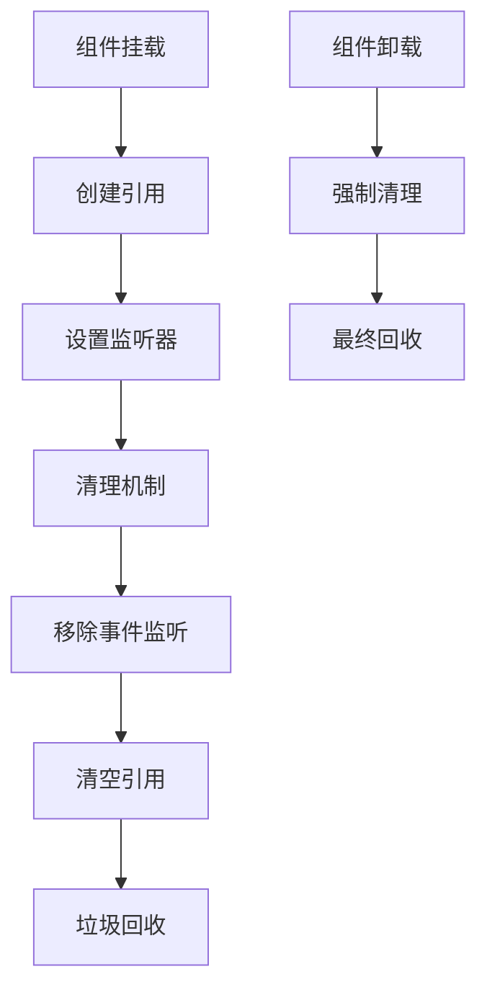

**章节来源**
- [src/hooks/core/useChart.ts](file://src/hooks/core/useChart.ts#L384-L427)
- [src/views/dashboard/ecommerce/modules/total-order-volume.vue](file://src/views/dashboard/ecommerce/modules/total-order-volume.vue#L1-L24)

## 响应式布局设计

### 栅格系统应用

仪表盘基于 Element Plus 的栅格系统实现响应式布局：

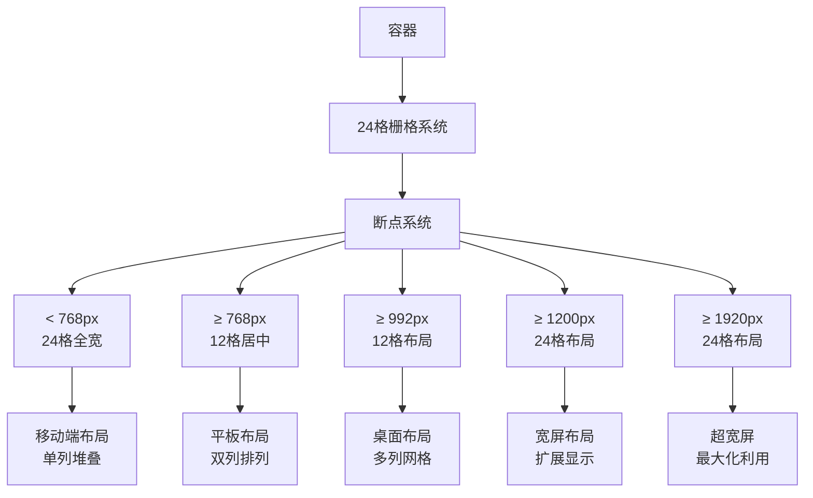

### 组件适配策略

| 屏幕尺寸 | 布局策略 | 组件调整 |
|----------|----------|----------|
| 移动端 (<768px) | 单列堆叠 | 卡片全宽，图表缩小 |
| 平板 (768-992px) | 双列布局 | 保持图表比例，调整间距 |
| 桌面 (992-1200px) | 多列网格 | 标准布局，完整功能 |
| 宽屏 (>1200px) | 扩展显示 | 增加列数，优化空间利用率 |

### 动态布局调整

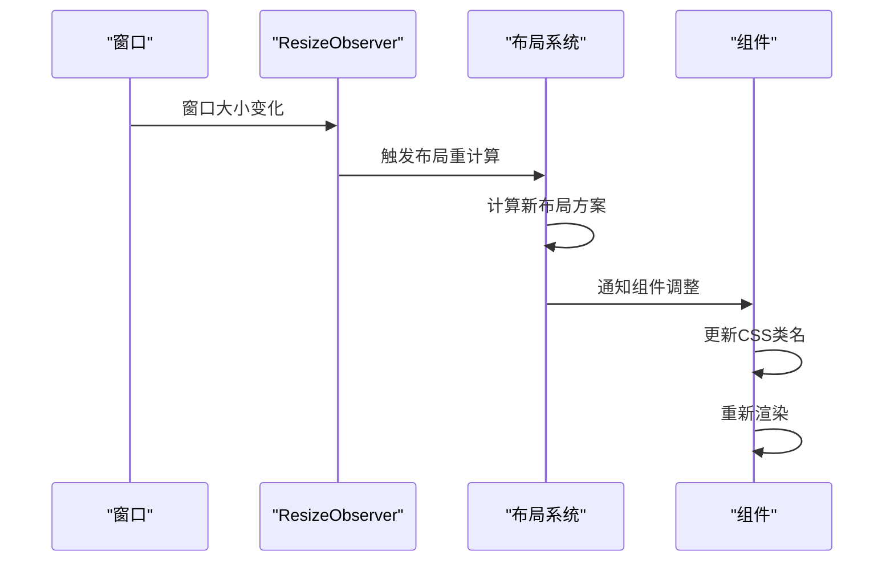

**章节来源**
- [src/views/dashboard/analysis/index.vue](file://src/views/dashboard/analysis/index.vue#L4-L36)
- [src/views/dashboard/console/index.vue](file://src/views/dashboard/console/index.vue#L4-L28)
- [src/views/dashboard/ecommerce/index.vue](file://src/views/dashboard/ecommerce/index.vue#L4-L58)

## 最佳实践建议

### 代码组织原则

1. **单一职责**：每个组件只负责一个特定功能
2. **依赖注入**：通过 Props 和 Events 实现组件通信
3. **类型安全**：使用 TypeScript 定义完整的类型系统
4. **错误边界**：实现完善的错误处理机制

### 性能优化建议

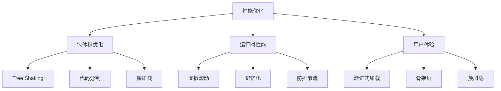

### 可维护性指南

| 维护维度 | 最佳实践 | 实现方法 |
|----------|----------|----------|
| 代码质量 | ESLint + Prettier | 统一编码规范 |
| 测试覆盖 | 单元测试 + 集成测试 | Vitest + Testing Library |
| 文档维护 | JSDoc + Storybook | 自动生成文档 |
| 版本管理 | Git Flow | 分支管理策略 |

### 安全考虑

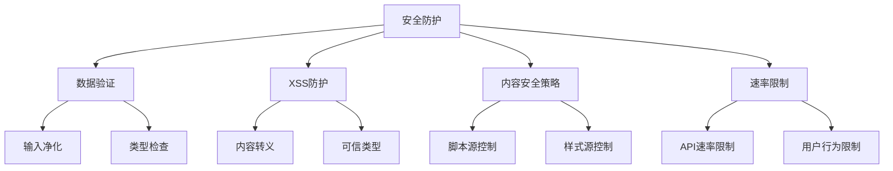

### 可访问性优化

1. **语义化HTML**：正确使用HTML标签语义
2. **键盘导航**：支持完整的键盘操作
3. **屏幕阅读器**：提供适当的ARIA标签
4. **高对比度**：支持高对比度模式
5. **字体大小**：支持用户自定义字体大小

通过遵循这些最佳实践，可以构建出高质量、高性能且易于维护的仪表盘应用，为用户提供优秀的数据分析体验。