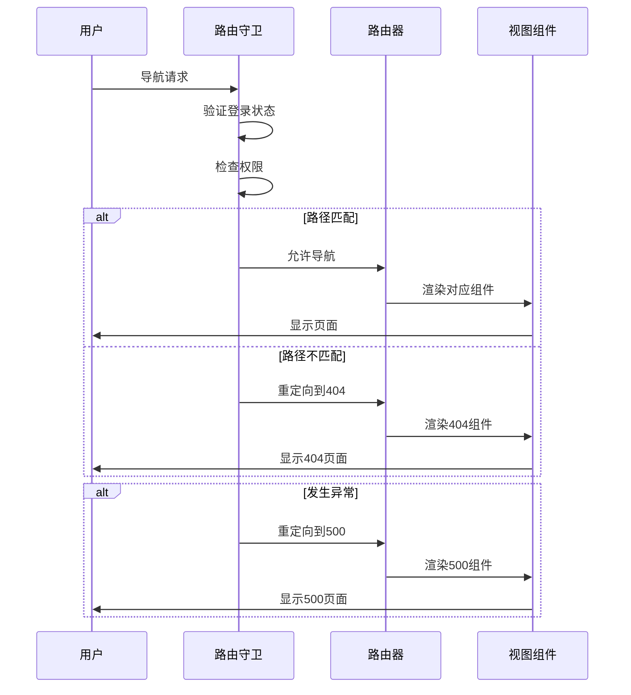
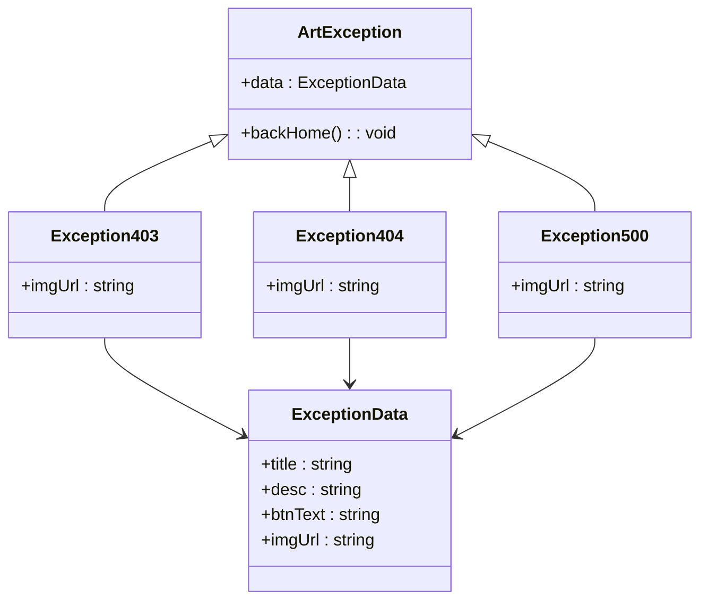
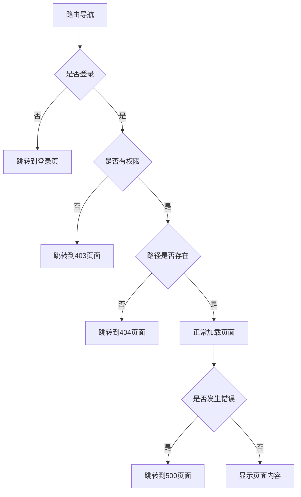
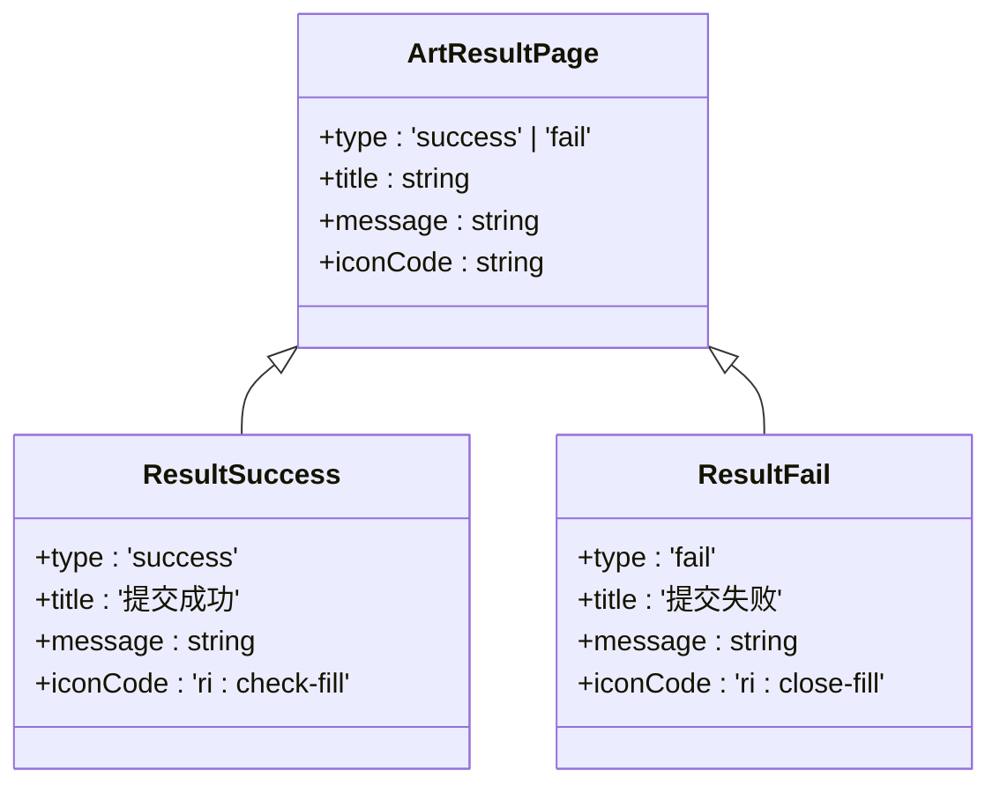
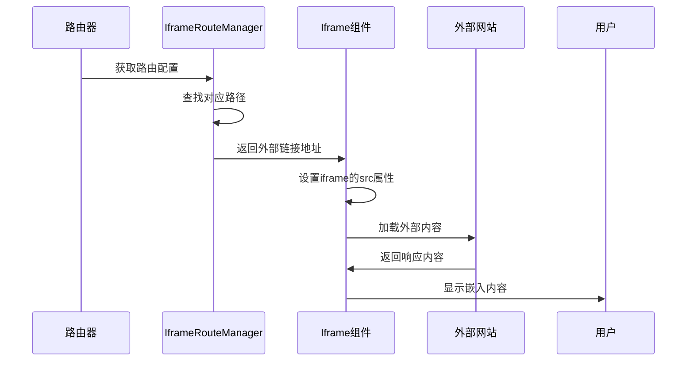
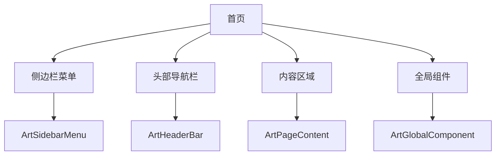
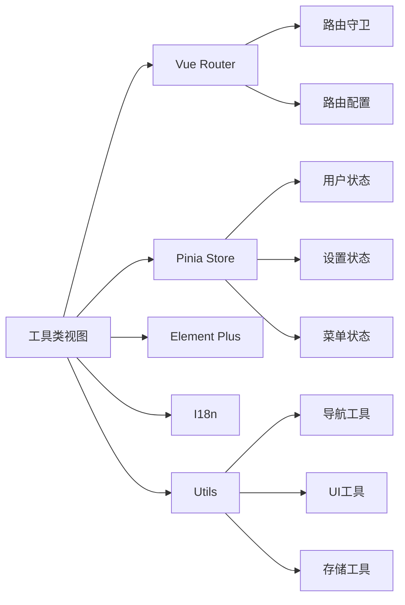

# 工具类视图

<cite>
**本文档引用的文件**
- [ArtException.vue](file://src/components/core/views/exception/ArtException.vue)
- [ArtResultPage.vue](file://src/components/core/views/result/ArtResultPage.vue)
- [Iframe.vue](file://src/views/outside/Iframe.vue)
- [index.vue](file://src/views/index/index.vue)
- [exception.ts](file://src/router/modules/exception.ts)
- [result.ts](file://src/router/modules/result.ts)
- [beforeEach.ts](file://src/router/guards/beforeEach.ts)
- [staticRoutes.ts](file://src/router/routes/staticRoutes.ts)
- [IframeRouteManager.ts](file://src/router/core/IframeRouteManager.ts)
- [403/index.vue](file://src/views/exception/403/index.vue)
- [404/index.vue](file://src/views/exception/404/index.vue)
- [500/index.vue](file://src/views/exception/500/index.vue)
- [success/index.vue](file://src/views/result/success/index.vue)
- [fail/index.vue](file://src/views/result/fail/index.vue)
- [app.scss](file://src/assets/styles/core/app.scss)
- [links.ts](file://src/utils/constants/links.ts)
</cite>

## 目录
1. [简介](#简介)
2. [项目结构](#项目结构)
3. [核心组件](#核心组件)
4. [架构概述](#架构概述)
5. [详细组件分析](#详细组件分析)
6. [依赖分析](#依赖分析)
7. [性能考虑](#性能考虑)
8. [故障排除指南](#故障排除指南)
9. [结论](#结论)

## 简介
本文档集中说明系统中的工具类视图组件，包括异常处理页面（403/404/500）、结果反馈页面（成功/失败）、外部链接页面（Iframe）和首页。分析异常页面的统一设计模式与路由守卫的集成方式，结果页面的状态提示机制，Iframe页面的外部内容嵌入方案，以及首页的布局结构与核心功能入口。结合路由配置说明这些工具页面的全局可用性和导航规则，为开发者提供一致的用户体验指导。

## 项目结构
本项目采用基于Vue 3的组件化架构，工具类视图组件主要分布在`src/views`和`src/components/core/views`目录下。异常处理页面、结果反馈页面和外部链接页面作为独立的视图组件存在，而首页则作为应用的主要布局容器。路由配置通过模块化方式组织，确保工具页面的全局可用性。

```mermaid
graph TD
subgraph "视图组件"
A[异常处理页面] --> A1[/exception/403/index.vue]
A --> A2[/exception/404/index.vue]
A --> A3[/exception/500/index.vue]
B[结果反馈页面] --> B1[/result/success/index.vue]
B --> B2[/result/fail/index.vue]
C[外部链接页面] --> C1[/outside/Iframe.vue]
D[首页] --> D1[/index/index.vue]
end
subgraph "组件库"
E[核心视图组件] --> E1[/components/core/views/exception/ArtException.vue]
E --> E2[/components/core/views/result/ArtResultPage.vue]
end
subgraph "路由配置"
F[路由模块] --> F1[/router/modules/exception.ts]
F --> F2[/router/modules/result.ts]
F --> F3[/router/routes/staticRoutes.ts]
F --> F4[/router/guards/beforeEach.ts]
end
A --> E1
B --> E2
F --> A
F --> B
F --> C
F --> D
```

**图示来源**
- [ArtException.vue](file://src/components/core/views/exception/ArtException.vue)
- [ArtResultPage.vue](file://src/components/core/views/result/ArtResultPage.vue)
- [Iframe.vue](file://src/views/outside/Iframe.vue)
- [index.vue](file://src/views/index/index.vue)
- [exception.ts](file://src/router/modules/exception.ts)
- [result.ts](file://src/router/modules/result.ts)
- [staticRoutes.ts](file://src/router/routes/staticRoutes.ts)

**本节来源**
- [ArtException.vue](file://src/components/core/views/exception/ArtException.vue)
- [ArtResultPage.vue](file://src/components/core/views/result/ArtResultPage.vue)
- [Iframe.vue](file://src/views/outside/Iframe.vue)
- [index.vue](file://src/views/index/index.vue)

## 核心组件
系统中的工具类视图组件主要包括异常处理页面、结果反馈页面、外部链接页面和首页。这些组件通过统一的设计模式和路由配置实现全局可用性，为用户提供一致的用户体验。

**本节来源**
- [ArtException.vue](file://src/components/core/views/exception/ArtException.vue)
- [ArtResultPage.vue](file://src/components/core/views/result/ArtResultPage.vue)
- [Iframe.vue](file://src/views/outside/Iframe.vue)
- [index.vue](file://src/views/index/index.vue)

## 架构概述
系统采用基于Vue Router的前端路由架构，通过路由守卫实现权限控制和异常处理。工具类视图组件通过静态路由配置实现全局可用性，确保在任何情况下都能正确显示相应的页面。



**图示来源**
- [beforeEach.ts](file://src/router/guards/beforeEach.ts)
- [staticRoutes.ts](file://src/router/routes/staticRoutes.ts)
- [exception.ts](file://src/router/modules/exception.ts)

## 详细组件分析

### 异常处理页面分析
异常处理页面包括403（禁止访问）、404（页面不存在）和500（服务器错误）三种类型。这些页面通过统一的`ArtException`组件实现，确保视觉风格的一致性。

#### 异常页面统一设计模式


**图示来源**
- [ArtException.vue](file://src/components/core/views/exception/ArtException.vue)
- [403/index.vue](file://src/views/exception/403/index.vue)
- [404/index.vue](file://src/views/exception/404/index.vue)
- [500/index.vue](file://src/views/exception/500/index.vue)

#### 路由守卫集成方式
异常处理页面与路由守卫紧密集成，通过全局前置守卫实现自动跳转。当用户访问未授权页面时，系统会自动跳转到403页面；当访问不存在的页面时，跳转到404页面；当发生系统错误时，跳转到500页面。



**图示来源**
- [beforeEach.ts](file://src/router/guards/beforeEach.ts)
- [exception.ts](file://src/router/modules/exception.ts)
- [staticRoutes.ts](file://src/router/routes/staticRoutes.ts)

**本节来源**
- [ArtException.vue](file://src/components/core/views/exception/ArtException.vue)
- [403/index.vue](file://src/views/exception/403/index.vue)
- [404/index.vue](file://src/views/exception/404/index.vue)
- [500/index.vue](file://src/views/exception/500/index.vue)
- [beforeEach.ts](file://src/router/guards/beforeEach.ts)

### 结果反馈页面分析
结果反馈页面用于向用户展示操作结果，包括成功和失败两种状态。这些页面通过`ArtResultPage`组件实现，提供清晰的状态提示和后续操作指引。

#### 状态提示机制


**图示来源**
- [ArtResultPage.vue](file://src/components/core/views/result/ArtResultPage.vue)
- [success/index.vue](file://src/views/result/success/index.vue)
- [fail/index.vue](file://src/views/result/fail/index.vue)

**本节来源**
- [ArtResultPage.vue](file://src/components/core/views/result/ArtResultPage.vue)
- [success/index.vue](file://src/views/result/success/index.vue)
- [fail/index.vue](file://src/views/result/fail/index.vue)

### 外部链接页面分析
外部链接页面通过Iframe组件实现外部内容的嵌入，支持动态加载外部网站内容。

#### 外部内容嵌入方案


**图示来源**
- [Iframe.vue](file://src/views/outside/Iframe.vue)
- [IframeRouteManager.ts](file://src/router/core/IframeRouteManager.ts)
- [staticRoutes.ts](file://src/router/routes/staticRoutes.ts)

**本节来源**
- [Iframe.vue](file://src/views/outside/Iframe.vue)
- [IframeRouteManager.ts](file://src/router/core/IframeRouteManager.ts)

### 首页分析
首页作为应用的主要布局容器，包含侧边栏菜单、头部导航栏和内容区域，为用户提供核心功能入口。

#### 布局结构与核心功能入口


**图示来源**
- [index.vue](file://src/views/index/index.vue)
- [art-sidebar-menu/index.vue](file://src/components/core/layouts/art-menus/art-sidebar-menu/index.vue)
- [art-header-bar/index.vue](file://src/components/core/layouts/art-header-bar/index.vue)
- [art-page-content/index.vue](file://src/components/core/layouts/art-page-content/index.vue)

**本节来源**
- [index.vue](file://src/views/index/index.vue)

## 依赖分析
工具类视图组件依赖于路由系统、状态管理、UI组件库等多个核心模块，形成完整的功能闭环。



**图示来源**
- [beforeEach.ts](file://src/router/guards/beforeEach.ts)
- [store/modules/user.ts](file://src/store/modules/user.ts)
- [store/modules/setting.ts](file://src/store/modules/setting.ts)
- [store/modules/menu.ts](file://src/store/modules/menu.ts)
- [utils/navigation/index.ts](file://src/utils/navigation/index.ts)
- [utils/ui/index.ts](file://src/utils/ui/index.ts)
- [utils/storage/index.ts](file://src/utils/storage/index.ts)

**本节来源**
- [beforeEach.ts](file://src/router/guards/beforeEach.ts)
- [store/index.ts](file://src/store/index.ts)
- [utils/index.ts](file://src/utils/index.ts)

## 性能考虑
工具类视图组件在设计时考虑了性能优化，通过懒加载、缓存机制和资源优化等方式提升用户体验。

- 异常页面和结果页面采用静态路由配置，确保快速加载
- Iframe页面使用加载状态指示器，提升用户感知性能
- 首页布局采用组件化设计，支持按需加载
- 图片资源采用SVG格式，确保在不同分辨率下的清晰度
- 路由守卫中使用进度条和加载动画，提供良好的用户反馈

## 故障排除指南
当工具类视图组件出现问题时，可参考以下排查步骤：

1. **异常页面无法显示**：检查路由配置是否正确，确保静态路由中包含异常页面的配置
2. **结果页面样式异常**：检查`ArtResultPage`组件的props传递是否正确
3. **Iframe内容无法加载**：检查外部链接地址是否正确，确认跨域策略是否允许
4. **首页布局错乱**：检查CSS变量设置是否正确，确认主题配置是否生效
5. **路由守卫不生效**：检查`beforeEach`守卫是否正确注册，确认路由实例是否正确传递

**本节来源**
- [beforeEach.ts](file://src/router/guards/beforeEach.ts)
- [staticRoutes.ts](file://src/router/routes/staticRoutes.ts)
- [app.scss](file://src/assets/styles/core/app.scss)
- [links.ts](file://src/utils/constants/links.ts)

## 结论
本文档详细分析了系统中的工具类视图组件，包括异常处理页面、结果反馈页面、外部链接页面和首页。这些组件通过统一的设计模式和路由配置实现全局可用性，为用户提供一致的用户体验。异常页面与路由守卫紧密集成，确保在各种情况下都能正确显示相应的错误信息；结果页面通过清晰的状态提示机制，帮助用户理解操作结果；Iframe页面提供灵活的外部内容嵌入方案；首页作为主要布局容器，为用户提供核心功能入口。开发者在使用这些组件时，应遵循统一的设计规范，确保应用的整体一致性和用户体验。