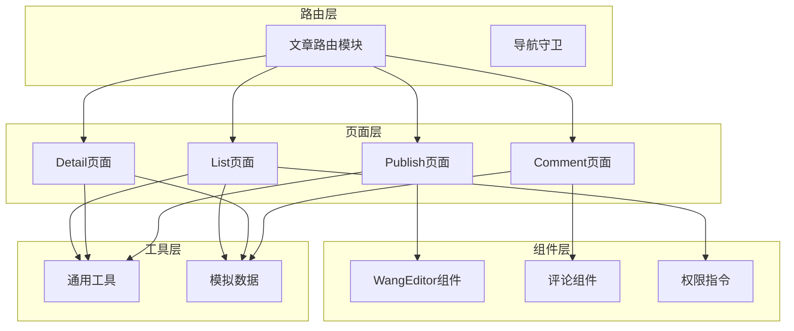
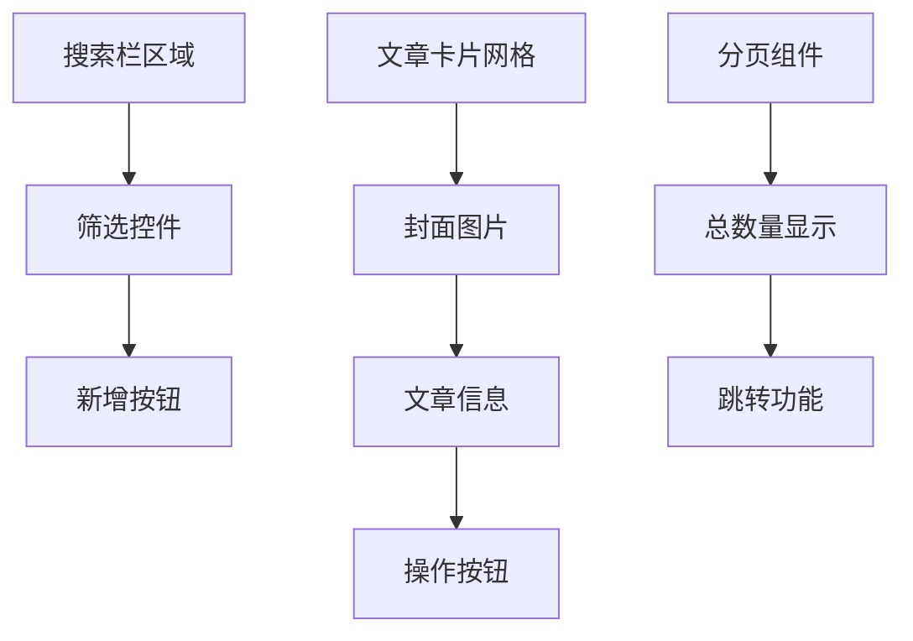
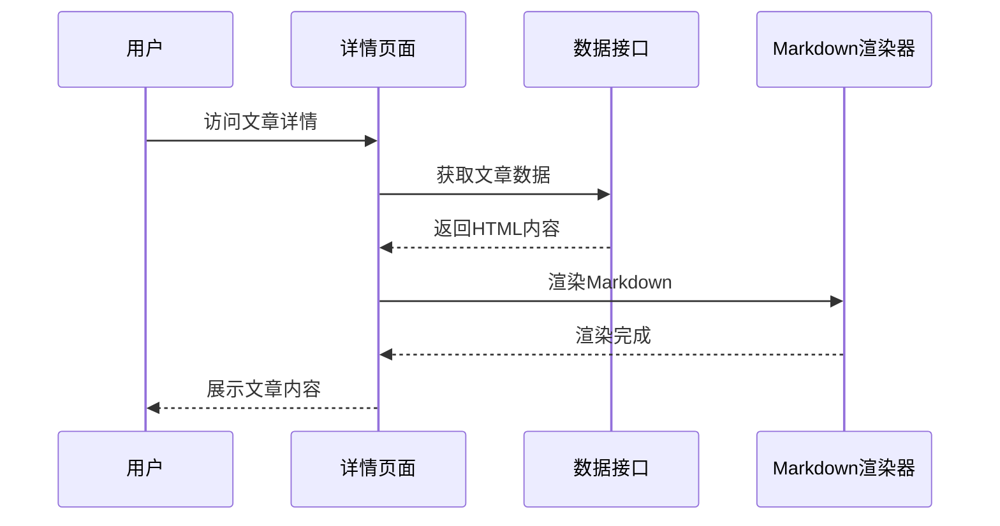
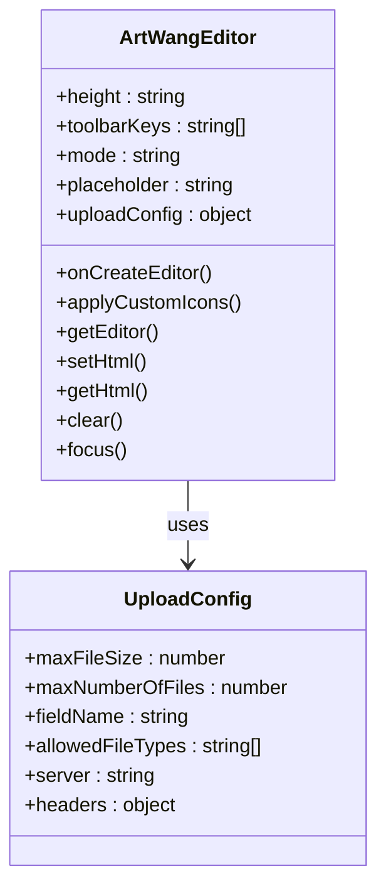
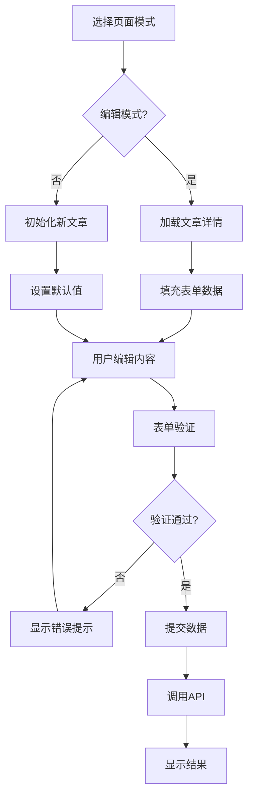
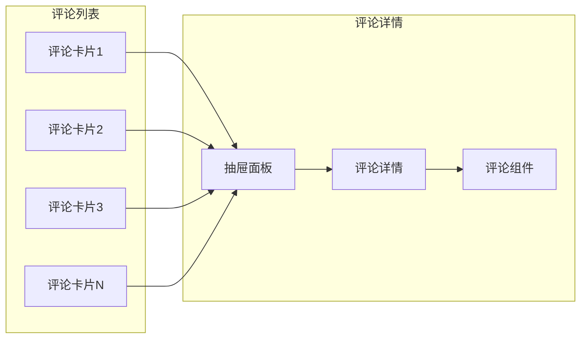
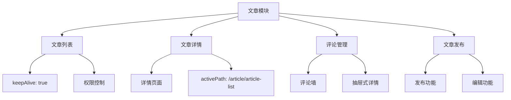
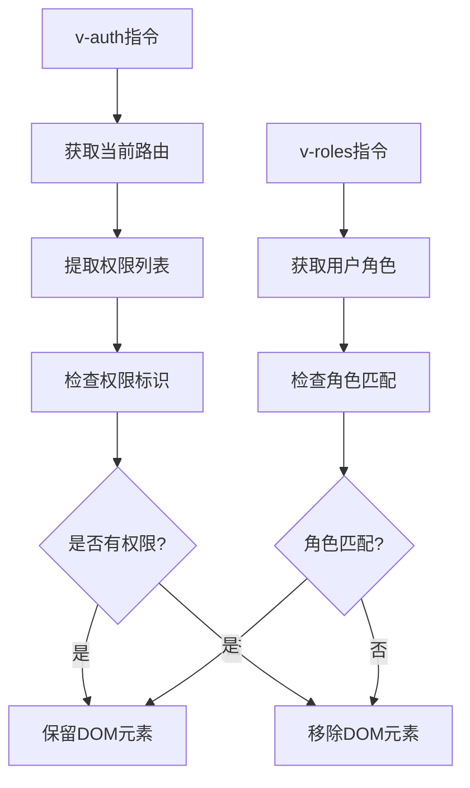
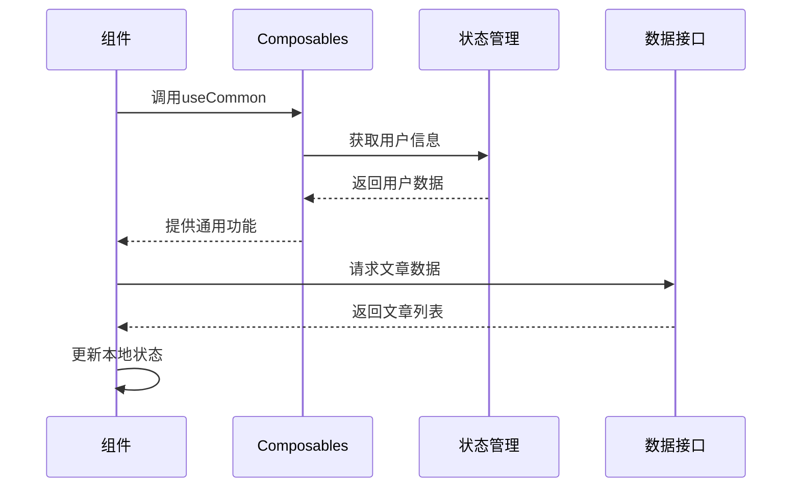

# 文章管理视图

<cite>
**本文档引用的文件**
- [src/views/article/list/index.vue](file://src/views/article/list/index.vue)
- [src/views/article/detail/index.vue](file://src/views/article/detail/index.vue)
- [src/views/article/publish/index.vue](file://src/views/article/publish/index.vue)
- [src/views/article/comment/index.vue](file://src/views/article/comment/index.vue)
- [src/router/modules/article.ts](file://src/router/modules/article.ts)
- [src/components/core/forms/art-wang-editor/index.vue](file://src/components/core/forms/art-wang-editor/index.vue)
- [src/components/business/comment-widget/index.vue](file://src/components/business/comment-widget/index.vue)
- [src/components/business/comment-widget/widget/CommentItem.vue](file://src/components/business/comment-widget/widget/CommentItem.vue)
- [src/hooks/core/useCommon.ts](file://src/hooks/core/useCommon.ts)
- [src/mock/temp/articleList.ts](file://src/mock/temp/articleList.ts)
- [src/mock/temp/commentList.ts](file://src/mock/temp/commentList.ts)
- [src/directives/core/auth.ts](file://src/directives/core/auth.ts)
</cite>

## 目录
1. [概述](#概述)
2. [系统架构](#系统架构)
3. [文章列表页面](#文章列表页面)
4. [文章详情页面](#文章详情页面)
5. [文章发布页面](#文章发布页面)
6. [评论管理页面](#评论管理页面)
7. [路由配置与导航](#路由配置与导航)
8. [权限控制机制](#权限控制机制)
9. [数据流与状态管理](#数据流与状态管理)
10. [技术实现细节](#技术实现细节)
11. [开发指导原则](#开发指导原则)

## 概述

文章管理模块是系统的核心内容管理功能，提供完整的文章生命周期管理能力。该模块包含四个主要页面：文章列表、文章详情、文章发布和评论管理，形成了一个完整的文章内容管理体系。

### 核心功能特性

- **文章列表管理**：支持分页浏览、搜索筛选、批量操作
- **富文本编辑**：集成wang-editor实现专业级内容创作
- **权限控制**：基于角色和操作的精细化权限管理
- **评论互动**：完整的评论系统，支持回复和互动
- **响应式设计**：适配多种设备和屏幕尺寸

## 系统架构

**图表来源**
- [src/router/modules/article.ts](file://src/router/modules/article.ts#L1-L61)
- [src/views/article/list/index.vue](file://src/views/article/list/index.vue#L1-L50)
- [src/views/article/publish/index.vue](file://src/views/article/publish/index.vue#L1-L50)

## 文章列表页面

文章列表页面是内容管理的核心入口，提供直观的卡片式展示和强大的筛选功能。

### 页面布局设计

**图表来源**
- [src/views/article/list/index.vue](file://src/views/article/list/index.vue#L2-L22)
- [src/views/article/list/index.vue](file://src/views/article/list/index.vue#L25-L67)

### 关键功能实现

#### 分页与筛选机制

页面采用分页加载策略，支持以下筛选功能：
- **标题搜索**：实时搜索匹配的文章标题
- **年份筛选**：按创建年份筛选文章
- **分页控制**：支持自定义每页显示数量

#### 响应式网格布局

采用CSS Grid实现响应式布局，根据屏幕尺寸自动调整列数：
- 大屏幕：5列布局
- 中等屏幕：3-4列布局  
- 小屏幕：2列布局
- 移动端：单列布局

#### 操作列设计

每个文章卡片包含：
- **查看详情**：点击进入文章详情页
- **编辑操作**：仅授权用户可见的编辑按钮
- **视觉反馈**：悬停时显示编辑按钮

**章节来源**
- [src/views/article/list/index.vue](file://src/views/article/list/index.vue#L1-L196)

## 文章详情页面

文章详情页面负责内容的展示和阅读体验优化。

### 内容渲染架构

**图表来源**
- [src/views/article/detail/index.vue](file://src/views/article/detail/index.vue#L35-L56)

### Markdown渲染优化

详情页面集成了专业的Markdown渲染功能：

#### 代码高亮与复制
- **语法高亮**：支持多种编程语言语法高亮
- **行号显示**：提供代码行号便于定位
- **一键复制**：鼠标悬停时显示复制按钮

#### 图片优化
- **响应式图片**：自动适应容器宽度
- **懒加载**：提升页面加载性能
- **边框样式**：增强视觉效果

#### 交互功能
- **回到顶部**：便捷的页面导航
- **平滑滚动**：优化用户体验

**章节来源**
- [src/views/article/detail/index.vue](file://src/views/article/detail/index.vue#L1-L137)

## 文章发布页面

文章发布页面集成富文本编辑器，提供专业的内容创作环境。

### 富文本编辑器集成

**图表来源**
- [src/components/core/forms/art-wang-editor/index.vue](file://src/components/core/forms/art-wang-editor/index.vue#L20-L85)

### 编辑器配置特性

#### 工具栏定制
- **默认模式**：提供完整的编辑功能
- **简单模式**：精简的编辑界面
- **自定义工具**：支持添加和移除工具

#### 上传功能
- **图片上传**：支持拖拽和点击上传
- **文件限制**：最大2MB，支持JPG/PNG格式
- **上传进度**：实时显示上传状态

#### 内容验证
- **必填检查**：确保所有必要字段填写
- **内容清理**：自动清理多余的空白字符
- **格式验证**：确保内容符合要求

### 发布流程设计

**图表来源**
- [src/views/article/publish/index.vue](file://src/views/article/publish/index.vue#L128-L140)
- [src/views/article/publish/index.vue](file://src/views/article/publish/index.vue#L192-L216)

**章节来源**
- [src/views/article/publish/index.vue](file://src/views/article/publish/index.vue#L1-L340)

## 评论管理页面

评论管理页面提供完整的评论系统，支持评论展示和互动功能。

### 评论展示架构

**图表来源**
- [src/views/article/comment/index.vue](file://src/views/article/comment/index.vue#L7-L35)

### 评论组件设计

#### 交互式卡片
- **颜色主题**：为每个评论分配独特背景色
- **统计信息**：显示点赞和回复数量
- **悬停效果**：提供平滑的交互体验

#### 抽屉式详情
- **全屏展示**：提供完整的评论查看体验
- **嵌套评论**：支持多级回复展示
- **实时互动**：即时显示评论和回复

### 评论系统功能

#### 评论发布
- **表单验证**：确保评论信息完整性
- **实时预览**：即时显示评论内容
- **成功提示**：友好的操作反馈

#### 回复功能
- **层级结构**：支持多级回复
- **展开控制**：灵活的评论展开/收起
- **作者标识**：清晰的评论者标识

**章节来源**
- [src/views/article/comment/index.vue](file://src/views/article/comment/index.vue#L1-L133)

## 路由配置与导航

文章模块采用模块化的路由配置，支持完整的导航守卫和权限控制。

### 路由结构设计

**图表来源**
- [src/router/modules/article.ts](file://src/router/modules/article.ts#L3-L60)

### 导航守卫应用

路由配置中集成了多层次的权限控制：

#### 角色权限
- **超级管理员**：完全访问权限
- **普通管理员**：受限访问权限
- **普通用户**：只读权限

#### 操作权限
- **新增权限**：控制新增文章功能
- **编辑权限**：控制编辑文章功能
- **删除权限**：控制删除文章功能

#### 页面缓存
- **keepAlive**：启用页面缓存，提升用户体验
- **路由复用**：避免重复加载

**章节来源**
- [src/router/modules/article.ts](file://src/router/modules/article.ts#L1-L61)

## 权限控制机制

系统采用基于角色和操作的双重权限控制机制。

### 权限指令系统

**图表来源**
- [src/directives/core/auth.ts](file://src/directives/core/auth.ts#L42-L52)

### 权限控制实现

#### 基于操作的权限
- **指令绑定**：通过`v-auth="'add'"`形式使用
- **动态验证**：运行时检查权限状态
- **DOM移除**：无权限时直接移除元素

#### 基于角色的权限
- **角色匹配**：检查用户是否拥有指定角色
- **多角色支持**：支持多个角色的OR关系
- **响应式更新**：角色变化时自动更新

#### 权限配置
- **路由级配置**：在路由meta中定义权限列表
- **细粒度控制**：支持具体的权限标识
- **继承机制**：子路由继承父路由权限

**章节来源**
- [src/directives/core/auth.ts](file://src/directives/core/auth.ts#L1-L68)

## 数据流与状态管理

系统采用响应式数据流和组合式API实现数据管理。

### 数据流架构

**图表来源**
- [src/hooks/core/useCommon.ts](file://src/hooks/core/useCommon.ts#L22-L87)

### 状态管理策略

#### 组件级状态
- **响应式引用**：使用`ref()`和`reactive()`管理本地状态
- **计算属性**：通过`computed()`实现派生状态
- **生命周期**：合理使用`onMounted()`和`onUnmounted()`

#### 通用工具函数
- **滚动控制**：提供平滑滚动和快速滚动功能
- **页面刷新**：支持页面内容重新加载
- **路径管理**：统一的路径获取和处理

#### 数据缓存机制
- **内存缓存**：在组件内缓存常用数据
- **持久化**：支持关键数据的本地存储
- **失效策略**：合理的缓存失效和更新机制

**章节来源**
- [src/hooks/core/useCommon.ts](file://src/hooks/core/useCommon.ts#L1-L88)

## 技术实现细节

### 富文本编辑器深度集成

#### wang-editor配置优化
- **自定义图标**：通过重试机制确保图标正确加载
- **上传配置**：支持自定义上传服务器和认证
- **工具栏定制**：灵活的工具栏配置选项

#### 编辑器生命周期
- **创建回调**：监听编辑器创建事件
- **销毁处理**：正确清理编辑器实例
- **状态同步**：确保双向绑定的稳定性

### 评论系统实现

#### 组件化设计
- **父子组件**：评论列表和评论项的清晰分离
- **事件通信**：通过emit实现组件间通信
- **状态共享**：使用响应式数据管理评论状态

#### 交互优化
- **防抖处理**：防止频繁的DOM操作
- **动画效果**：平滑的展开/收起动画
- **错误处理**：完善的错误提示机制

### 性能优化策略

#### 懒加载实现
- **图片懒加载**：减少初始加载时间
- **组件懒加载**：按需加载评论组件
- **数据分页**：避免大量数据一次性加载

#### 内存管理
- **事件清理**：及时移除不需要的事件监听
- **定时器管理**：合理使用和清理定时器
- **缓存控制**：避免不必要的数据缓存

## 开发指导原则

### 代码组织规范

#### 文件结构
- **页面组件**：按功能划分独立的页面组件
- **业务组件**：封装可复用的业务逻辑组件
- **工具函数**：集中管理通用的工具函数

#### 命名约定
- **组件命名**：使用PascalCase格式
- **变量命名**：使用camelCase格式
- **常量命名**：使用UPPER_SNAKE_CASE格式

### 最佳实践

#### 响应式设计
- **断点设置**：合理设置响应式断点
- **弹性布局**：使用Flexbox和Grid布局
- **字体缩放**：支持字体大小的自适应

#### 错误处理
- **优雅降级**：提供备用方案
- **用户提示**：友好的错误信息
- **日志记录**：详细的错误日志

#### 可访问性
- **语义化标记**：使用正确的HTML标签
- **键盘导航**：支持键盘操作
- **屏幕阅读器**：提供适当的ARIA属性

### 测试策略

#### 单元测试
- **组件测试**：测试组件的功能和行为
- **工具函数测试**：验证工具函数的正确性
- **集成测试**：测试组件间的交互

#### 端到端测试
- **用户流程测试**：模拟真实的用户操作
- **跨浏览器测试**：确保兼容性
- **性能测试**：验证性能指标

### 维护指南

#### 版本管理
- **语义化版本**：遵循SemVer规范
- **变更日志**：记录重要的变更
- **向后兼容**：保持API的向后兼容性

#### 文档维护
- **代码注释**：提供清晰的代码说明
- **API文档**：维护完整的API文档
- **使用指南**：提供详细的使用说明

通过遵循这些指导原则，可以确保文章管理模块的高质量开发和长期维护。模块化的设计、完善的权限控制、优秀的用户体验和可靠的技术实现，共同构成了一个完整的文章管理解决方案。