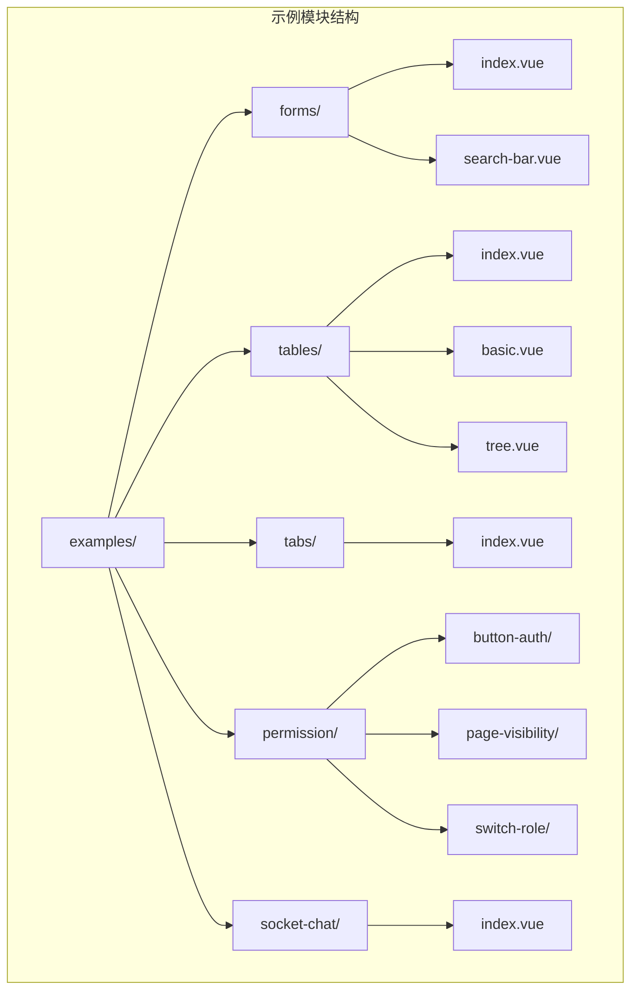
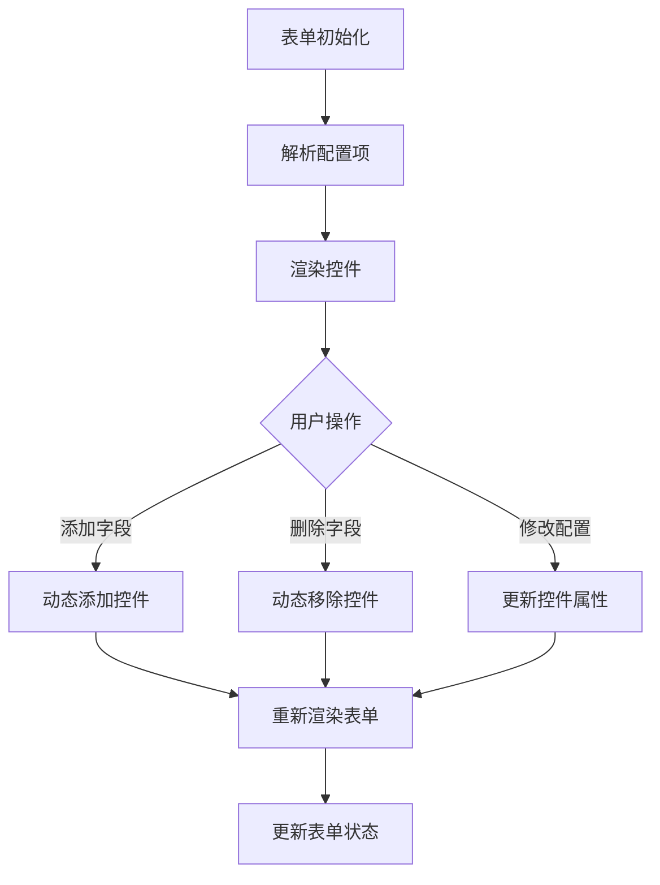
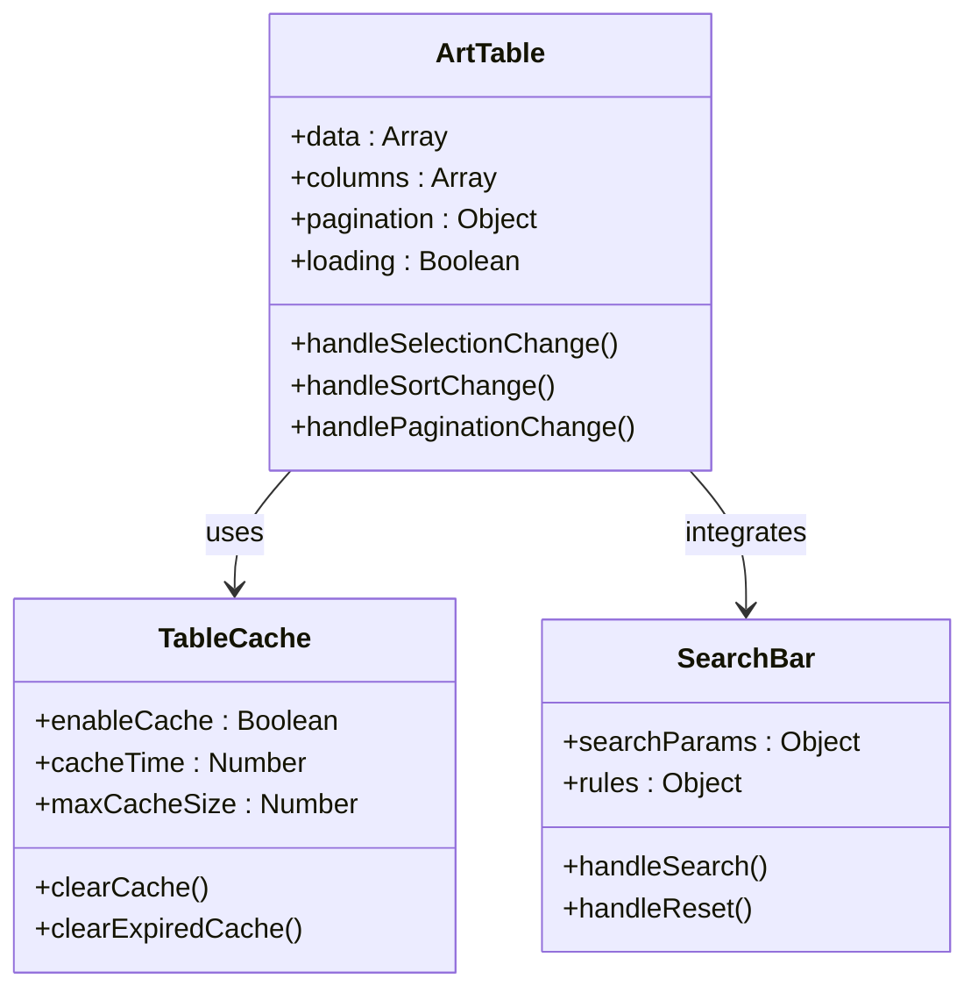
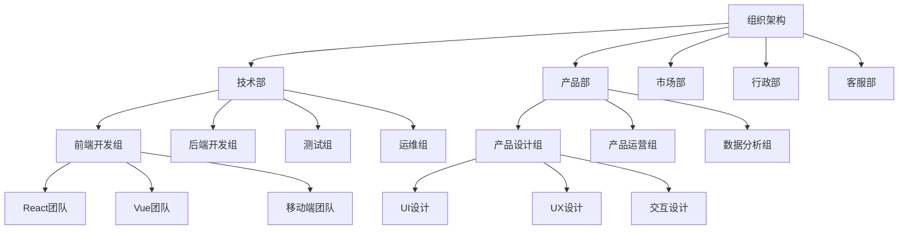
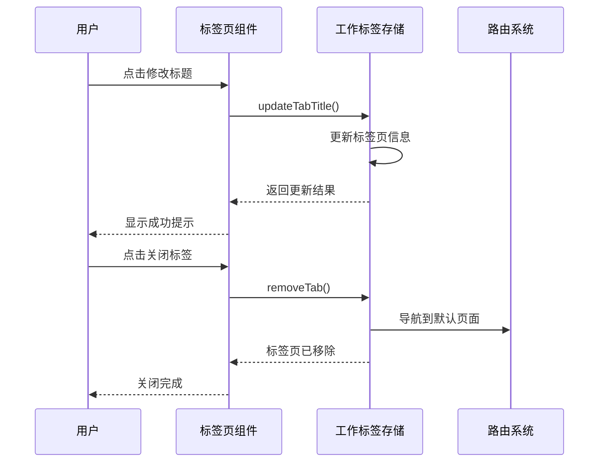
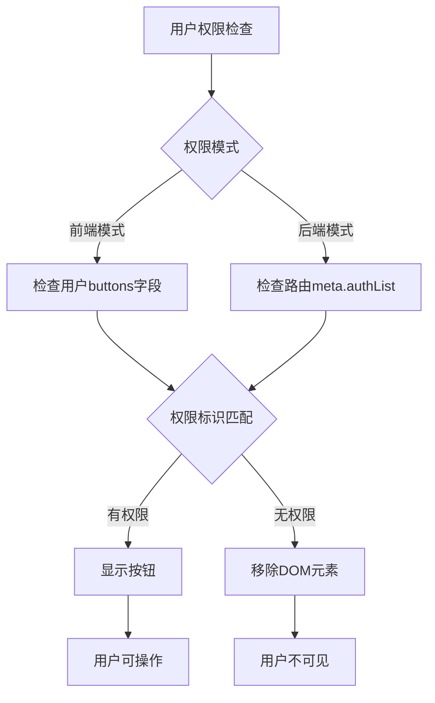
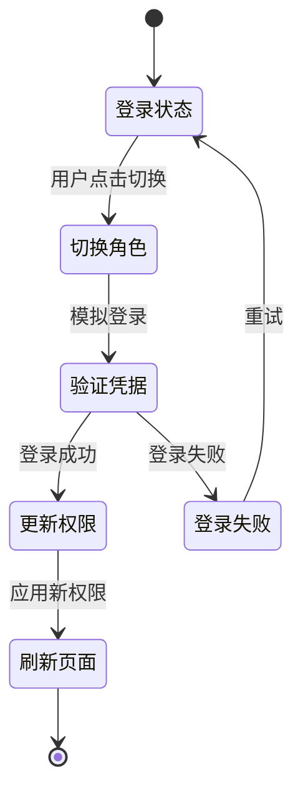
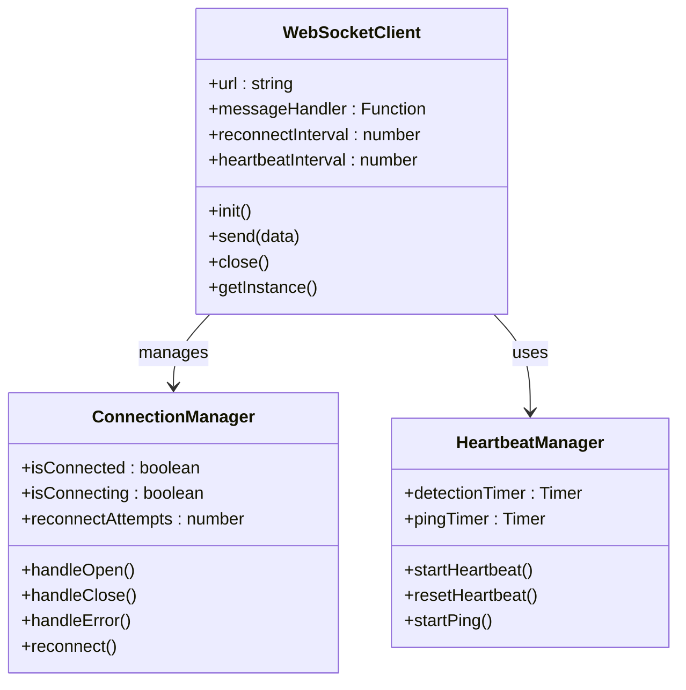
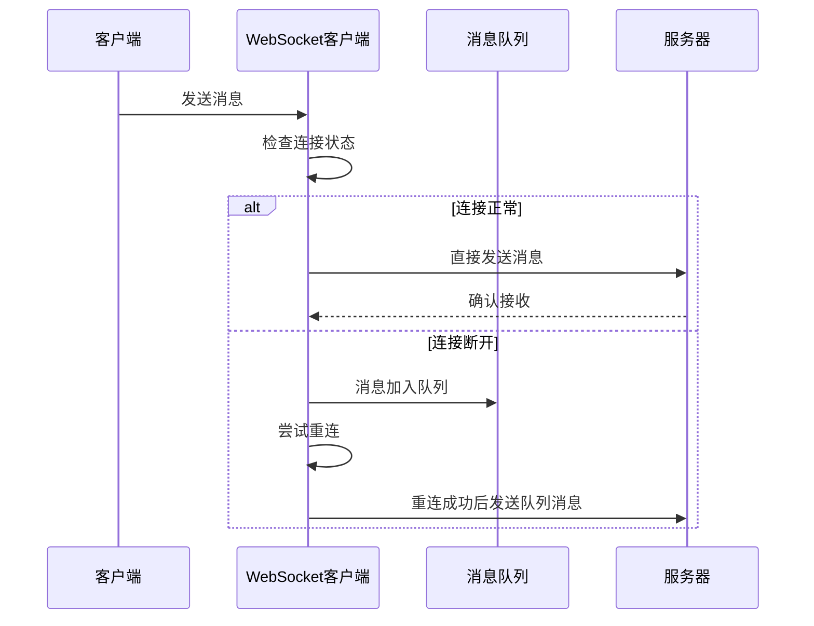
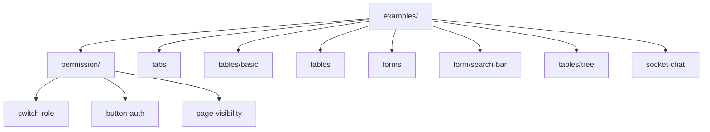

# 示例页面

<cite>
**本文档中引用的文件**
- [src/router/modules/examples.ts](file://src/router/modules/examples.ts)
- [src/views/examples/forms/index.vue](file://src/views/examples/forms/index.vue)
- [src/views/examples/tables/index.vue](file://src/views/examples/tables/index.vue)
- [src/views/examples/tabs/index.vue](file://src/views/examples/tabs/index.vue)
- [src/views/examples/socket-chat/index.vue](file://src/views/examples/socket-chat/index.vue)
- [src/views/examples/permission/button-auth/index.vue](file://src/views/examples/permission/button-auth/index.vue)
- [src/views/examples/permission/page-visibility/index.vue](file://src/views/examples/permission/page-visibility/index.vue)
- [src/views/examples/permission/switch-role/index.vue](file://src/views/examples/permission/switch-role/index.vue)
- [src/views/examples/tables/basic.vue](file://src/views/examples/tables/basic.vue)
- [src/views/examples/tables/tree.vue](file://src/views/examples/tables/tree.vue)
- [src/utils/socket/index.ts](file://src/utils/socket/index.ts)
- [src/directives/core/auth.ts](file://src/directives/core/auth.ts)
- [src/directives/core/roles.ts](file://src/directives/core/roles.ts)
</cite>

## 目录
1. [概述](#概述)
2. [项目结构](#项目结构)
3. [表单示例](#表单示例)
4. [表格示例](#表格示例)
5. [标签页示例](#标签页示例)
6. [权限控制示例](#权限控制示例)
7. [实时通信示例](#实时通信示例)
8. [路由组织方式](#路由组织方式)
9. [技术实现要点](#技术实现要点)
10. [最佳实践](#最佳实践)

## 概述

示例模块是 Art Design Pro 框架中的重要组成部分，提供了丰富的功能演示页面，涵盖了现代Web应用开发中的核心场景。该模块包含了表单处理、表格管理、权限控制、实时通信等多个方面的功能演示，为开发者提供了完整的参考实现。

### 主要功能模块

- **表单示例**：展示各种表单控件的使用方法和验证机制
- **表格示例**：演示数据表格的各种应用场景和高级功能
- **标签页示例**：展示动态标签页管理和操作
- **权限控制示例**：演示多层次的权限控制机制
- **实时通信示例**：展示WebSocket集成和实时消息处理

## 项目结构

示例模块的文件组织结构清晰，按照功能分类进行模块化管理：



**图表来源**
- [src/router/modules/examples.ts](file://src/router/modules/examples.ts#L1-L136)

**章节来源**
- [src/router/modules/examples.ts](file://src/router/modules/examples.ts#L1-L136)

## 表单示例

表单示例页面展示了Art Design Pro框架中表单组件的完整功能集合，包括各种输入控件、验证机制和动态配置能力。

### 核心特性

- **多样化表单控件**：支持输入框、选择器、日期时间、文件上传等多种控件类型
- **动态表单配置**：支持运行时动态添加、删除和修改表单项
- **智能验证**：内置表单验证规则和实时验证提示
- **响应式布局**：支持栅格布局和响应式调整

### 技术实现要点

#### 表单控件类型

表单页面支持超过30种不同的表单控件类型，包括：

- **基础输入控件**：input、textarea、number
- **选择控件**：select、radio、checkbox、switch
- **日期时间控件**：datetime、date、time、daterange
- **高级控件**：cascader、treeselect、rate、slider
- **文件控件**：upload、wang-editor（富文本编辑器）

#### 动态表单管理



**图表来源**
- [src/views/examples/forms/index.vue](file://src/views/examples/forms/index.vue#L344-L460)

#### 表单验证机制

表单验证采用多层次的验证策略：

1. **前端验证**：实时输入验证和提交验证
2. **后端验证**：API接口验证和业务规则验证
3. **用户体验**：即时反馈和错误提示

**章节来源**
- [src/views/examples/forms/index.vue](file://src/views/examples/forms/index.vue#L1-L741)

## 表格示例

表格示例页面展示了Art Design Pro框架中表格组件的强大功能，包括高级表格能力、树形结构展示和左树右表布局。

### 高级表格功能

#### 核心功能特性

- **智能缓存**：基于LRU算法的数据缓存机制
- **防抖搜索**：智能的搜索防抖处理
- **多种刷新策略**：支持软刷新、硬刷新等多种刷新模式
- **错误处理**：完善的错误捕获和处理机制

#### 表格配置系统



**图表来源**
- [src/views/examples/tables/index.vue](file://src/views/examples/tables/index.vue#L616-L766)

### 树形表格结构

树形表格是表格示例中的重要功能，支持左侧树形结构和右侧数据表格的联动展示：

#### 树形数据结构



**图表来源**
- [src/views/examples/tables/tree.vue](file://src/views/examples/tables/tree.vue#L66-L167)

### 表格性能优化

表格组件采用了多项性能优化策略：

1. **虚拟滚动**：大数据量下的流畅滚动体验
2. **懒加载**：按需加载表格数据
3. **缓存机制**：智能缓存减少重复请求
4. **防抖处理**：搜索和筛选的防抖优化

**章节来源**
- [src/views/examples/tables/index.vue](file://src/views/examples/tables/index.vue#L1-L800)
- [src/views/examples/tables/basic.vue](file://src/views/examples/tables/basic.vue#L1-L64)
- [src/views/examples/tables/tree.vue](file://src/views/examples/tables/tree.vue#L1-L238)

## 标签页示例

标签页示例页面展示了动态标签页管理系统的核心功能，包括标签页的创建、修改、关闭和状态管理。

### 标签页管理功能

#### 核心操作功能

- **标签页标题修改**：动态修改当前标签页的显示标题
- **标签页信息获取**：获取指定路径标签页的详细信息
- **标签页关闭操作**：支持关闭当前标签、关闭其他标签和关闭所有标签
- **标签页状态管理**：维护标签页的打开状态和历史记录

#### 标签页状态管理流程



**图表来源**
- [src/views/examples/tabs/index.vue](file://src/views/examples/tabs/index.vue#L67-L121)

### 标签页存储机制

标签页信息通过Vuex状态管理进行持久化存储，支持以下功能：

1. **状态持久化**：页面刷新后标签页信息保持不变
2. **跨页面共享**：多个页面间共享标签页状态
3. **历史记录**：维护标签页的访问历史
4. **恢复机制**：支持标签页的恢复和重建

**章节来源**
- [src/views/examples/tabs/index.vue](file://src/views/examples/tabs/index.vue#L1-L122)

## 权限控制示例

权限控制示例页面展示了Art Design Pro框架中多层次的权限控制机制，包括按钮级权限、页面级权限和角色切换功能。

### 权限控制层次

#### 1. 按钮级权限控制

按钮级权限控制是最细粒度的权限控制方式，基于权限标识进行精确控制：



**图表来源**
- [src/views/examples/permission/button-auth/index.vue](file://src/views/examples/permission/button-auth/index.vue#L410-L530)

#### 2. 页面级权限控制

页面级权限控制通过路由配置实现，确保用户只能访问授权的页面：

- **前端控制模式**：基于用户角色的前端权限过滤
- **后端控制模式**：基于菜单接口的动态路由生成

#### 3. 角色切换功能

角色切换功能允许开发者模拟不同用户角色的登录效果：



**图表来源**
- [src/views/examples/permission/switch-role/index.vue](file://src/views/examples/permission/switch-role/index.vue#L176-L208)

### 权限指令系统

框架提供了两个核心权限指令：

#### v-auth指令
- **用途**：基于权限标识的细粒度权限控制
- **特点**：移除DOM元素而非隐藏
- **适用场景**：按钮权限、功能模块权限

#### v-roles指令  
- **用途**：基于用户角色的粗粒度权限控制
- **特点**：支持单个或多个角色检查
- **适用场景**：功能模块可见性控制

**章节来源**
- [src/views/examples/permission/button-auth/index.vue](file://src/views/examples/permission/button-auth/index.vue#L1-L530)
- [src/views/examples/permission/page-visibility/index.vue](file://src/views/examples/permission/page-visibility/index.vue#L1-L256)
- [src/views/examples/permission/switch-role/index.vue](file://src/views/examples/permission/switch-role/index.vue#L1-L210)

## 实时通信示例

实时通信示例页面展示了WebSocket集成在socket-chat中的应用模式，提供了完整的实时消息通信解决方案。

### WebSocket客户端架构

#### 核心功能特性

- **自动重连机制**：网络中断后的自动重连功能
- **心跳检测**：定期的心跳包检测连接状态
- **消息队列**：连接断开时的消息缓存和重发
- **状态监控**：实时的连接状态和消息统计

#### WebSocket连接管理



**图表来源**
- [src/utils/socket/index.ts](file://src/utils/socket/index.ts#L12-L389)

### 实时通信流程

#### 消息发送流程



**图表来源**
- [src/views/examples/socket-chat/index.vue](file://src/views/examples/socket-chat/index.vue#L380-L415)

### 聊天界面功能

聊天界面提供了完整的实时通信功能：

#### 连接配置
- **服务器地址**：支持自定义WebSocket服务器地址
- **自动重连**：可配置的自动重连机制
- **心跳检测**：可配置的心跳包检测

#### 消息处理
- **消息类型**：支持文本、JSON、心跳包等多种消息类型
- **消息历史**：保存最近50条消息记录
- **状态指示**：实时显示连接状态和消息统计

#### 日志监控
- **连接日志**：记录连接状态变化
- **消息日志**：记录消息发送和接收情况
- **错误日志**：记录错误信息和警告

**章节来源**
- [src/views/examples/socket-chat/index.vue](file://src/views/examples/socket-chat/index.vue#L1-L500)
- [src/utils/socket/index.ts](file://src/utils/socket/index.ts#L1-L389)

## 路由组织方式

示例模块的路由组织采用了层级化的管理模式，通过router/modules/examples.ts文件统一管理所有示例页面的路由配置。

### 路由结构设计

#### 层级化路由配置



**图表来源**
- [src/router/modules/examples.ts](file://src/router/modules/examples.ts#L12-L135)

### 路由配置详解

#### 权限配置

每个路由都配备了详细的权限配置：

- **title**：国际化标题配置
- **icon**：图标配置
- **keepAlive**：页面缓存配置
- **authList**：后端权限列表（按钮权限）
- **roles**：角色访问控制（页面权限）

#### 动态权限支持

```typescript
// 按钮权限配置示例
meta: {
  authList: [
    { title: '新增', authMark: 'add' },
    { title: '编辑', authMark: 'edit' },
    { title: '删除', authMark: 'delete' }
  ]
}

// 角色权限配置示例
meta: {
  roles: ['R_SUPER']
}
```

### 路由守卫机制

框架实现了完整的路由守卫机制：

1. **权限验证**：检查用户是否具有访问权限
2. **角色过滤**：基于用户角色过滤可访问路由
3. **动态加载**：支持异步路由组件加载
4. **缓存管理**：页面组件的缓存和清理

**章节来源**
- [src/router/modules/examples.ts](file://src/router/modules/examples.ts#L1-L136)

## 技术实现要点

### 表单验证机制

#### 多层次验证策略

1. **前端实时验证**
   - 输入时即时验证
   - 实时错误提示
   - 样式反馈

2. **表单提交验证**
   - 完整性检查
   - 业务规则验证
   - 错误汇总显示

3. **后端验证补充**
   - 数据完整性验证
   - 业务逻辑验证
   - 安全性检查

#### 动态表单配置

表单支持运行时动态配置，包括：

- **字段动态添加/删除**
- **验证规则动态调整**
- **样式和布局动态变化**
- **事件处理器动态绑定**

### 表格性能优化

#### 缓存策略

- **LRU缓存算法**：最近最少使用的数据优先淘汰
- **智能缓存键**：基于查询参数生成唯一缓存键
- **缓存失效机制**：支持手动和自动缓存清理

#### 虚拟滚动

- **大数据量优化**：只渲染可视区域内的数据
- **内存占用控制**：避免大量DOM元素导致的内存问题
- **滚动性能优化**：流畅的滚动体验

### 权限控制实现

#### 前端权限控制

```typescript
// 角色权限检查
function checkRolePermission(requiredRoles: string[]): boolean {
  const userRoles = userStore.getUserInfo.roles
  return requiredRoles.some(role => userRoles.includes(role))
}

// 权限标识检查
function checkAuthPermission(authMark: string): boolean {
  const authList = route.meta.authList || []
  return authList.some(item => item.authMark === authMark)
}
```

#### 后端权限控制

- **菜单接口**：动态获取用户可访问菜单
- **路由过滤**：基于权限过滤生成路由表
- **API保护**：接口级别的权限验证

### WebSocket通信优化

#### 连接管理

- **自动重连**：指数退避重连策略
- **心跳检测**：定期心跳包维持连接
- **连接池管理**：多个WebSocket连接的统一管理

#### 消息处理

- **消息队列**：断线时的消息缓存
- **消息去重**：防止重复消息处理
- **错误恢复**：消息发送失败的自动重试

## 最佳实践

### 表单开发最佳实践

1. **统一验证策略**
   - 前后端验证相结合
   - 实时验证提升用户体验
   - 错误信息友好化

2. **动态表单设计**
   - 配置驱动的表单生成
   - 支持复杂的表单嵌套
   - 灵活的布局调整

3. **用户体验优化**
   - 加载状态提示
   - 错误处理友好化
   - 表单状态持久化

### 表格开发最佳实践

1. **性能优化**
   - 合理使用缓存机制
   - 虚拟滚动处理大数据
   - 防抖处理频繁操作

2. **功能扩展**
   - 插槽系统支持自定义渲染
   - 动态列配置支持
   - 导出导入功能集成

3. **用户体验**
   - 加载状态明确提示
   - 错误处理优雅降级
   - 响应式设计适配

### 权限控制最佳实践

1. **安全第一**
   - 后端验证不可替代前端
   - 最小权限原则
   - 多层防护机制

2. **灵活性考虑**
   - 支持多种权限模式
   - 灵活的角色配置
   - 可扩展的权限体系

3. **开发效率**
   - 统一的权限指令系统
   - 灵活的配置方式
   - 完善的开发工具

### 实时通信最佳实践

1. **连接稳定性**
   - 自动重连机制
   - 心跳检测保障
   - 错误处理完善

2. **消息可靠性**
   - 消息确认机制
   - 消息去重处理
   - 离线消息缓存

3. **性能优化**
   - 连接池管理
   - 消息压缩传输
   - 资源及时释放

### 代码组织最佳实践

1. **模块化设计**
   - 功能模块独立封装
   - 组件复用最大化
   - 接口标准化

2. **类型安全**
   - TypeScript全面应用
   - 类型定义完整
   - 编译时错误检查

3. **测试覆盖**
   - 单元测试完备
   - 集成测试充分
   - 性能测试关注

通过这些示例页面的学习和参考，开发者可以掌握现代Web应用开发中的核心技能，为构建高质量的企业级应用奠定坚实基础。