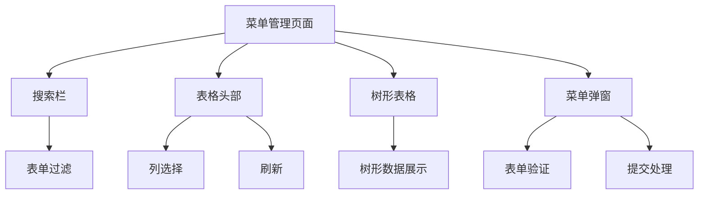
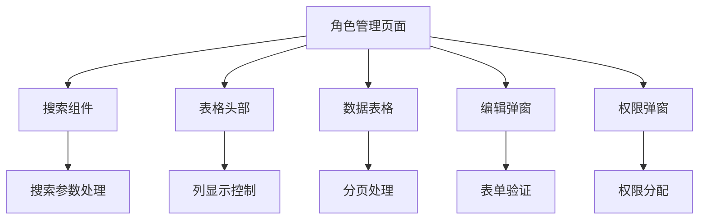
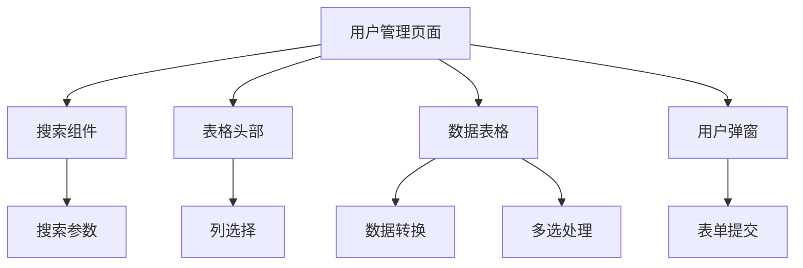
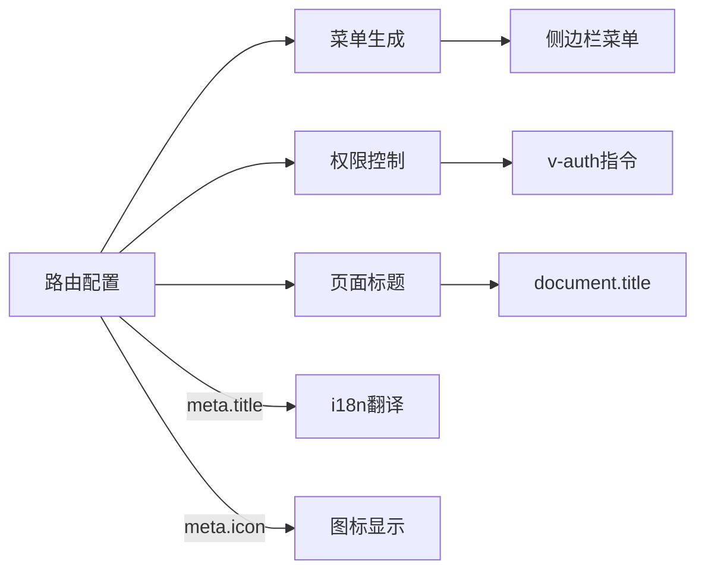
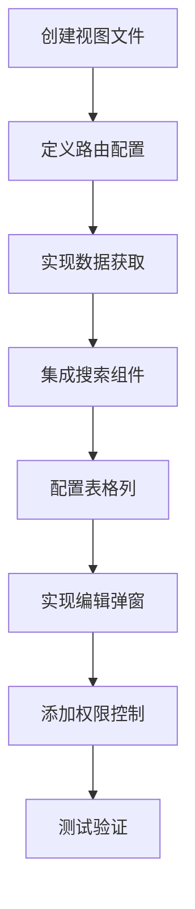

# 系统管理视图

<cite>
**本文档引用的文件**  
- [menu/index.vue](file://src/views/system/menu/index.vue)
- [role/index.vue](file://src/views/system/role/index.vue)
- [user/index.vue](file://src/views/system/user/index.vue)
- [system.ts](file://src/router/modules/system.ts)
- [auth.ts](file://src/directives/core/auth.ts)
- [menu-dialog.vue](file://src/views/system/menu/modules/menu-dialog.vue)
- [role-edit-dialog.vue](file://src/views/system/role/modules/role-edit-dialog.vue)
- [user-dialog.vue](file://src/views/system/user/modules/user-dialog.vue)
- [index.vue](file://src/views/system/nested/menu1/index.vue)
- [index.vue](file://src/views/system/nested/menu2/index.vue)
- [index.vue](file://src/views/system/nested/menu3/index.vue)
- [menu3-2/index.vue](file://src/views/system/nested/menu3/menu3-2/index.vue)
- [index.ts](file://src/types/router/index.ts)
- [router.ts](file://src/utils/router.ts)
- [api.d.ts](file://src/types/api/api.d.ts)
</cite>

## 目录
1. [系统管理模块概述](#系统管理模块概述)
2. [菜单管理页面实现](#菜单管理页面实现)
3. [角色管理页面实现](#角色管理页面实现)
4. [用户管理页面实现](#用户管理页面实现)
5. [嵌套路由页面结构](#嵌套路由页面结构)
6. [权限控制视图实现](#权限控制视图实现)
7. [动态路由与菜单联动](#动态路由与菜单联动)
8. [新增管理页面开发流程](#新增管理页面开发流程)

## 系统管理模块概述

系统管理模块包含菜单管理、角色管理、用户管理三大核心功能，以及嵌套路由的层级导航功能。该模块通过统一的UI模式实现CRUD操作，包括表格展示、对话框编辑、搜索过滤等组件的集成。权限控制在视图层通过指令和元数据实现，支持按钮级权限和页面可见性控制。

**Section sources**
- [menu/index.vue](file://src/views/system/menu/index.vue#L1-L480)
- [role/index.vue](file://src/views/system/role/index.vue#L1-L243)
- [user/index.vue](file://src/views/system/user/index.vue#L1-L262)

## 菜单管理页面实现

菜单管理页面采用树形表格展示菜单结构，支持搜索过滤、展开收起等操作。页面通过`ArtSearchBar`组件实现搜索功能，`ArtTableHeader`提供列显示控制和刷新功能，`ArtTable`以树形结构展示菜单数据。



**Diagram sources**
- [menu/index.vue](file://src/views/system/menu/index.vue#L1-L480)

**Section sources**
- [menu/index.vue](file://src/views/system/menu/index.vue#L1-L480)
- [menu-dialog.vue](file://src/views/system/menu/modules/menu-dialog.vue#L1-L385)

## 角色管理页面实现

角色管理页面使用`useTable`组合式函数管理表格状态，包含搜索、分页、排序等功能。通过`RoleSearch`组件实现搜索条件，`ArtTableHeader`提供列配置，`ArtTable`展示角色列表数据。



**Diagram sources**
- [role/index.vue](file://src/views/system/role/index.vue#L1-L243)

**Section sources**
- [role/index.vue](file://src/views/system/role/index.vue#L1-L243)
- [role-edit-dialog.vue](file://src/views/system/role/modules/role-edit-dialog.vue#L1-L163)

## 用户管理页面实现

用户管理页面同样基于`useTable`组合式函数，但增加了数据转换功能。通过`UserSearch`组件实现搜索，`ArtTableHeader`提供列配置，`ArtTable`展示用户列表，并支持多选操作。



**Diagram sources**
- [user/index.vue](file://src/views/system/user/index.vue#L1-L262)

**Section sources**
- [user/index.vue](file://src/views/system/user/index.vue#L1-L262)
- [user-dialog.vue](file://src/views/system/user/modules/user-dialog.vue#L1-L144)

## 嵌套路由页面结构

嵌套路由页面实现了多层级的导航结构，从`/system/nested`开始，包含`menu1`、`menu2`和`menu3`三个主要分支，其中`menu3`还包含更深层级的`menu3-2`。

```mermaid
graph TD
A[/system/nested] --> B[menu1]
A --> C[menu2]
A --> D[menu3]
C --> E[menu2-1]
D --> F[menu3-1]
D --> G[menu3-2]
G --> H[menu3-2-1]
```

**Diagram sources**
- [system.ts](file://src/router/modules/system.ts#L63-L148)
- [menu1/index.vue](file://src/views/system/nested/menu1/index.vue#L1-L6)
- [menu2/index.vue](file://src/views/system/nested/menu2/index.vue#L1-L6)
- [menu3/index.vue](file://src/views/system/nested/menu3/index.vue#L1-L6)
- [menu3-2/index.vue](file://src/views/system/nested/menu3/menu3-2/index.vue#L1-L6)

**Section sources**
- [system.ts](file://src/router/modules/system.ts#L63-L148)

## 权限控制视图实现

权限控制在视图层通过`v-auth`指令和路由元数据实现。`v-auth`指令根据当前路由的权限列表验证用户权限，无权限时直接移除DOM元素。

```mermaid
classDiagram
class AuthDirective {
+checkAuthPermission(el, binding)
+removeElement(el)
+mounted
+updated
}
class RouteMeta {
+authList : Array<{title, authMark}>
+roles : string[]
+isHide : boolean
+isHideTab : boolean
}
AuthDirective --> RouteMeta : "uses"
```

**Diagram sources**
- [auth.ts](file://src/directives/core/auth.ts#L1-L69)
- [system.ts](file://src/router/modules/system.ts#L56-L61)

**Section sources**
- [auth.ts](file://src/directives/core/auth.ts#L1-L69)
- [menu/index.vue](file://src/views/system/menu/index.vue#L22)

## 动态路由与菜单联动

动态路由注册与菜单数据通过`system.ts`文件中的路由配置实现联动。路由配置中的`meta`字段包含菜单标题、图标、权限等信息，这些信息被用于生成菜单和权限控制。



**Diagram sources**
- [system.ts](file://src/router/modules/system.ts#L3-L149)
- [router.ts](file://src/utils/router.ts#L47-L61)

**Section sources**
- [system.ts](file://src/router/modules/system.ts#L3-L149)
- [router.ts](file://src/utils/router.ts#L47-L61)

## 新增管理页面开发流程

新增管理页面的标准开发流程包括：创建视图文件、定义路由配置、实现CRUD操作、集成搜索和表格组件、添加权限控制。



**Diagram sources**
- [system.ts](file://src/router/modules/system.ts#L3-L149)
- [menu/index.vue](file://src/views/system/menu/index.vue#L1-L480)

**Section sources**
- [system.ts](file://src/router/modules/system.ts#L3-L149)
- [menu/index.vue](file://src/views/system/menu/index.vue#L1-L480)
- [menu-dialog.vue](file://src/views/system/menu/modules/menu-dialog.vue#L1-L385)