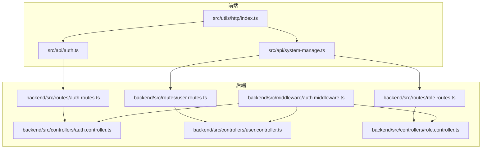
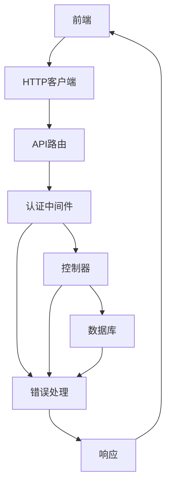
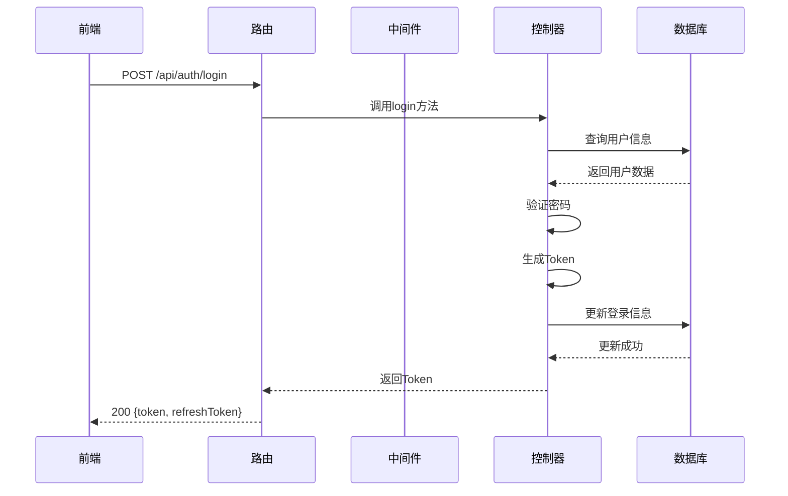
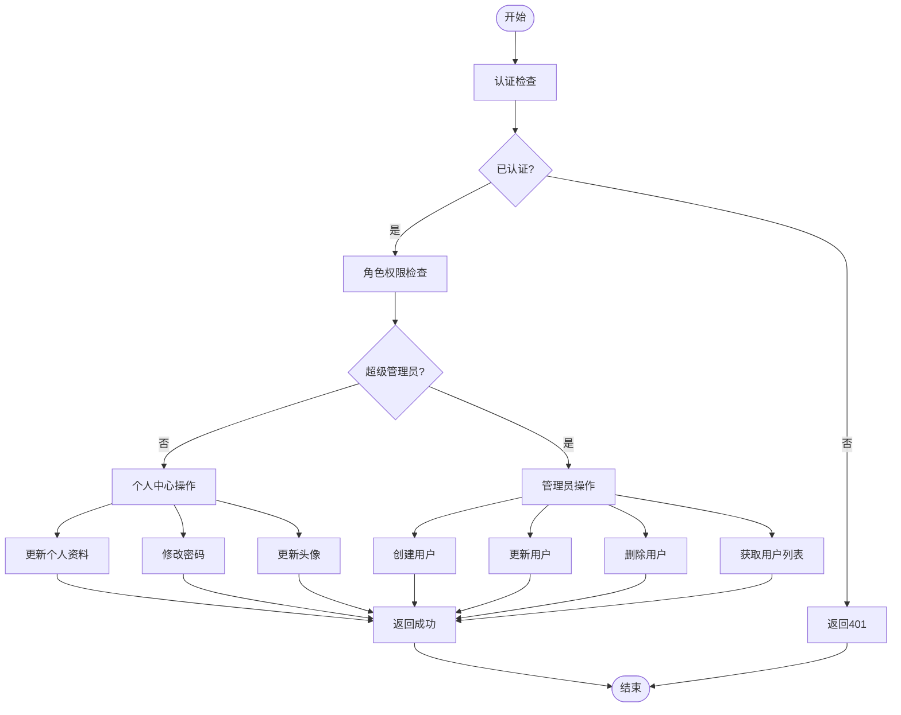
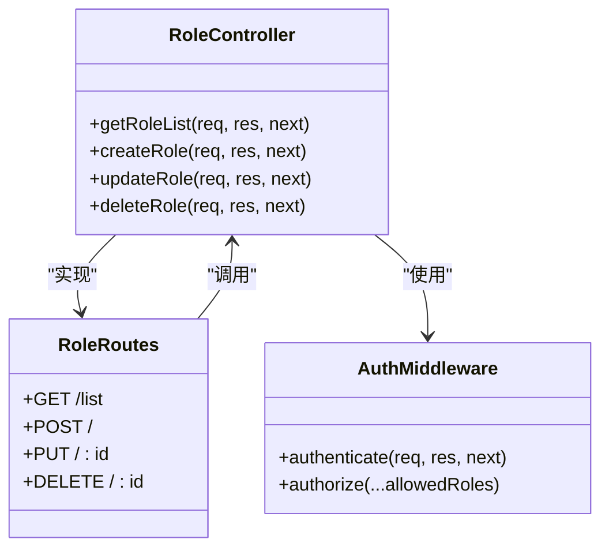
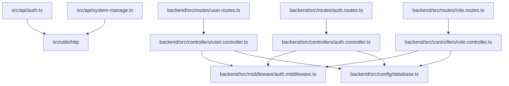

# API文档

<cite>
**本文档引用的文件**   
- [auth.ts](file://src/api/auth.ts)
- [system-manage.ts](file://src/api/system-manage.ts)
- [api.d.ts](file://src/types/api/api.d.ts)
- [index.ts](file://src/utils/http/index.ts)
- [auth.controller.ts](file://backend/src/controllers/auth.controller.ts)
- [user.controller.ts](file://backend/src/controllers/user.controller.ts)
- [role.controller.ts](file://backend/src/controllers/role.controller.ts)
- [auth.routes.ts](file://backend/src/routes/auth.routes.ts)
- [user.routes.ts](file://backend/src/routes/user.routes.ts)
- [role.routes.ts](file://backend/src/routes/role.routes.ts)
- [auth.middleware.ts](file://backend/src/middleware/auth.middleware.ts)
- [error.middleware.ts](file://backend/src/middleware/error.middleware.ts)
- [auth.util.ts](file://backend/src/utils/auth.util.ts)
- [response.ts](file://src/types/common/response.ts)
</cite>

## 目录

1. [简介](#简介)
2. [项目结构](#项目结构)
3. [核心组件](#核心组件)
4. [架构概述](#架构概述)
5. [详细组件分析](#详细组件分析)
6. [依赖分析](#依赖分析)
7. [性能考虑](#性能考虑)
8. [故障排除指南](#故障排除指南)
9. [结论](#结论)

## 简介

本API文档详细描述了art-design-pro项目中的后端API接口设计、认证机制、权限控制和数据交互模式。系统采用Express框架构建RESTful API，通过JWT实现认证授权，为前端提供用户管理、角色管理和认证服务等核心功能。API设计遵循统一的响应格式，包含完善的错误处理机制和安全防护措施。

## 项目结构

项目采用前后端分离架构，后端API服务位于backend目录，前端位于src目录。后端使用TypeScript和Express框架，前端使用Vue 3和TypeScript。API接口通过路由文件组织，控制器处理业务逻辑，中间件负责认证和错误处理。

**Diagram sources**

- [auth.ts](file://src/api/auth.ts)
- [system-manage.ts](file://src/api/system-manage.ts)
- [auth.routes.ts](file://backend/src/routes/auth.routes.ts)
- [user.routes.ts](file://backend/src/routes/user.routes.ts)
- [role.routes.ts](file://backend/src/routes/role.routes.ts)

**Section sources**

- [auth.ts](file://src/api/auth.ts)
- [system-manage.ts](file://src/api/system-manage.ts)
- [auth.routes.ts](file://backend/src/routes/auth.routes.ts)
- [user.routes.ts](file://backend/src/routes/user.routes.ts)
- [role.routes.ts](file://backend/src/routes/role.routes.ts)

## 核心组件

系统核心组件包括认证服务、用户管理服务和角色管理服务。认证服务处理用户登录、注册和Token管理；用户管理服务提供用户CRUD操作和信息查询；角色管理服务负责角色的增删改查。所有服务通过统一的响应格式返回数据，包含code、data和message字段。

**Section sources**

- [auth.controller.ts](file://backend/src/controllers/auth.controller.ts)
- [user.controller.ts](file://backend/src/controllers/user.controller.ts)
- [role.controller.ts](file://backend/src/controllers/role.controller.ts)
- [response.ts](file://src/types/common/response.ts)

## 架构概述

系统采用分层架构设计，包含路由层、控制器层、服务层和数据访问层。路由层定义API端点，控制器层处理请求和响应，中间件层负责认证和错误处理，数据访问层与数据库交互。前端通过封装的HTTP客户端调用API，实现前后端数据交互。

**Diagram sources**

- [index.ts](file://backend/src/index.ts)
- [auth.middleware.ts](file://backend/src/middleware/auth.middleware.ts)
- [error.middleware.ts](file://backend/src/middleware/error.middleware.ts)

## 详细组件分析

### 认证组件分析

认证组件提供用户登录、注册、Token刷新和登出功能。采用JWT进行状态管理，包含Access Token和Refresh Token双Token机制，提高系统安全性。

#### 认证流程序列图

**Diagram sources**

- [auth.controller.ts](file://backend/src/controllers/auth.controller.ts)
- [auth.routes.ts](file://backend/src/routes/auth.routes.ts)
- [auth.util.ts](file://backend/src/utils/auth.util.ts)

**Section sources**

- [auth.controller.ts](file://backend/src/controllers/auth.controller.ts)
- [auth.routes.ts](file://backend/src/routes/auth.routes.ts)
- [auth.util.ts](file://backend/src/utils/auth.util.ts)

### 用户管理组件分析

用户管理组件提供用户信息查询、个人资料更新、密码修改和用户CRUD操作。区分个人中心接口和管理员接口，通过权限中间件控制访问。

#### 用户管理功能流程图

**Diagram sources**

- [user.controller.ts](file://backend/src/controllers/user.controller.ts)
- [user.routes.ts](file://backend/src/routes/user.routes.ts)
- [auth.middleware.ts](file://backend/src/middleware/auth.middleware.ts)

**Section sources**

- [user.controller.ts](file://backend/src/controllers/user.controller.ts)
- [user.routes.ts](file://backend/src/routes/user.routes.ts)

### 角色管理组件分析

角色管理组件提供角色的增删改查功能，仅超级管理员可访问。支持角色列表查询、创建、更新和删除操作。

#### 角色管理API类图

**Diagram sources**

- [role.controller.ts](file://backend/src/controllers/role.controller.ts)
- [role.routes.ts](file://backend/src/routes/role.routes.ts)
- [auth.middleware.ts](file://backend/src/middleware/auth.middleware.ts)

**Section sources**

- [role.controller.ts](file://backend/src/controllers/role.controller.ts)
- [role.routes.ts](file://backend/src/routes/role.routes.ts)

## 依赖分析

系统依赖关系清晰，前端API模块依赖HTTP工具类，后端路由依赖控制器，控制器依赖数据库和中间件。认证中间件是核心依赖，被所有需要认证的接口使用。

**Diagram sources**

- [auth.ts](file://src/api/auth.ts)
- [system-manage.ts](file://src/api/system-manage.ts)
- [auth.routes.ts](file://backend/src/routes/auth.routes.ts)
- [user.routes.ts](file://backend/src/routes/user.routes.ts)
- [role.routes.ts](file://backend/src/routes/role.routes.ts)
- [auth.controller.ts](file://backend/src/controllers/auth.controller.ts)
- [user.controller.ts](file://backend/src/controllers/user.controller.ts)
- [role.controller.ts](file://backend/src/controllers/role.controller.ts)
- [auth.middleware.ts](file://backend/src/middleware/auth.middleware.ts)
- [database.ts](file://backend/src/config/database.ts)

**Section sources**

- [auth.ts](file://src/api/auth.ts)
- [system-manage.ts](file://src/api/system-manage.ts)
- [auth.routes.ts](file://backend/src/routes/auth.routes.ts)
- [user.routes.ts](file://backend/src/routes/user.routes.ts)
- [role.routes.ts](file://backend/src/routes/role.routes.ts)

## 性能考虑

系统在性能方面进行了多项优化，包括响应压缩、数据库查询优化和Token验证缓存。HTTP客户端实现了请求重试机制，在网络不稳定时自动重试。数据库查询使用参数化查询防止SQL注入，同时对常用查询进行了索引优化。

## 故障排除指南

常见问题包括认证失败、权限不足和接口404。认证失败通常由于Token过期或无效，需重新登录获取新Token。权限不足错误表明当前用户角色无权访问该接口。接口404错误可能是路由配置错误或API版本不匹配。

**Section sources**

- [auth.middleware.ts](file://backend/src/middleware/auth.middleware.ts)
- [error.middleware.ts](file://backend/src/middleware/error.middleware.ts)
- [auth.controller.ts](file://backend/src/controllers/auth.controller.ts)

## 结论

art-design-pro项目的API设计合理，结构清晰，安全性高。通过JWT实现无状态认证，权限控制精细，响应格式统一。建议在生产环境中启用HTTPS，定期轮换JWT密钥，并监控API调用频率防止滥用。
