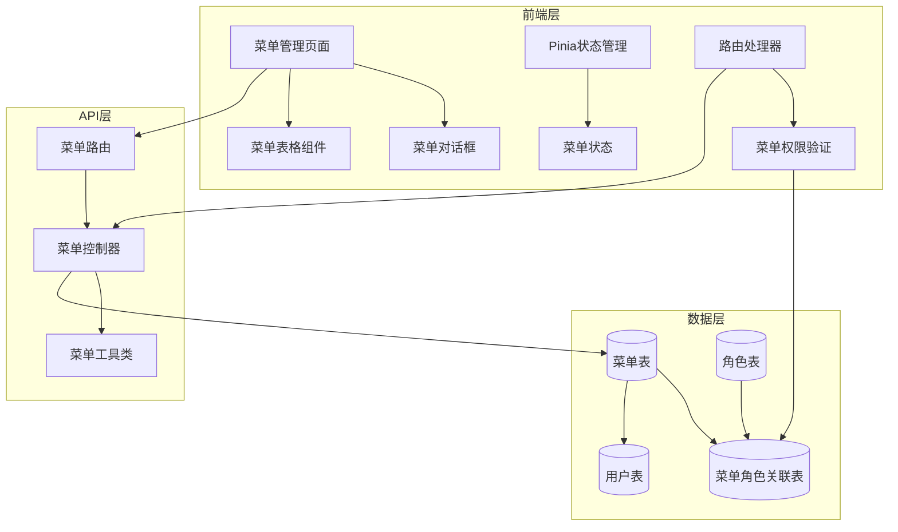
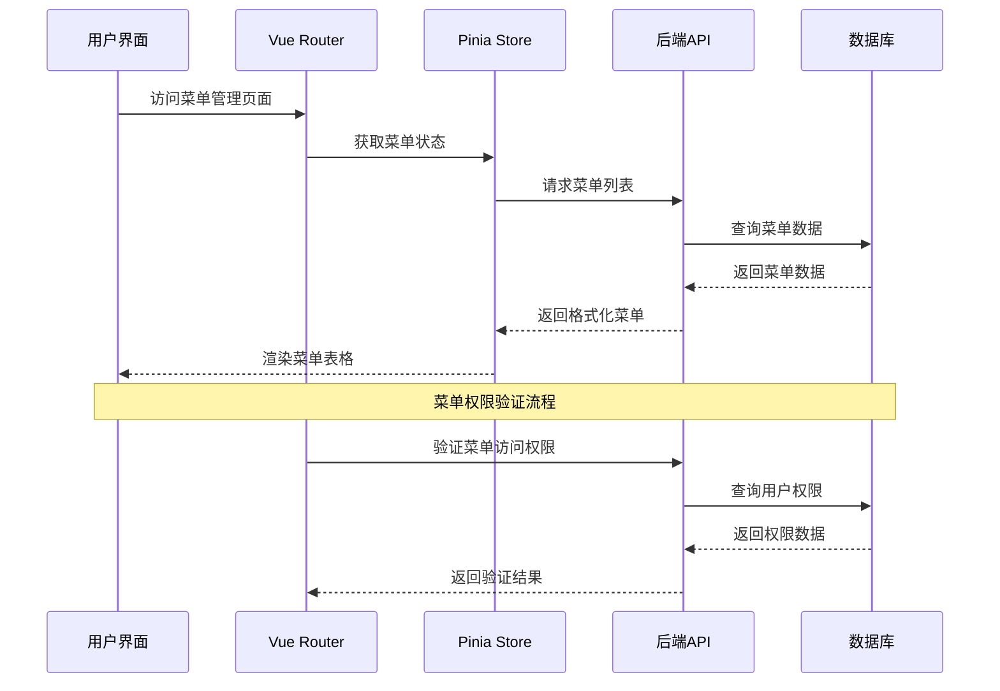
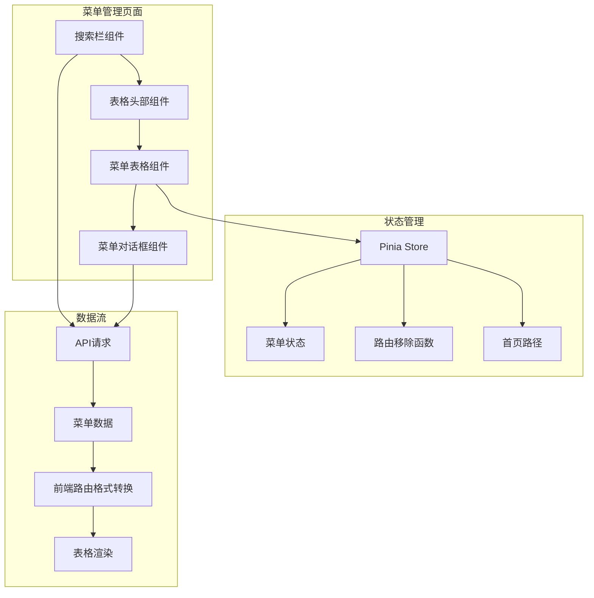
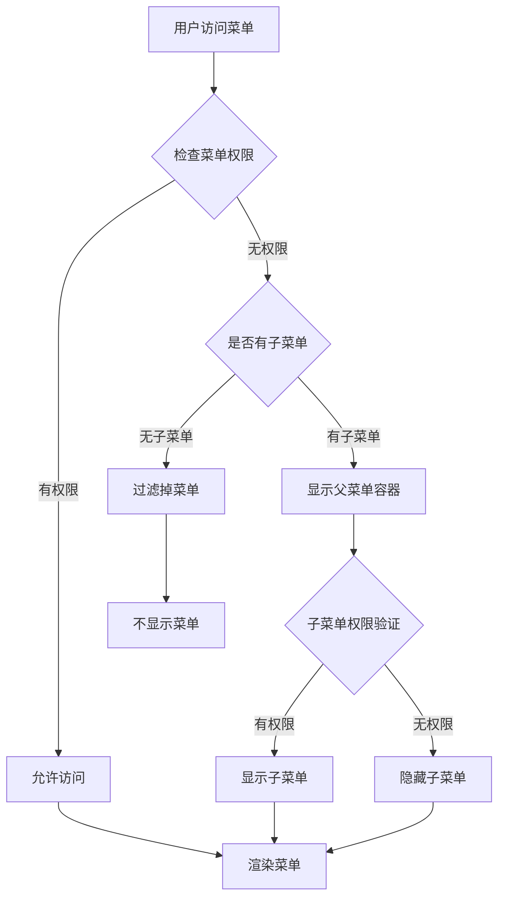

# 菜单管理API文档

<cite>
**本文档引用的文件**
- [menu.controller.ts](file://backend/src/controllers/menu.controller.ts)
- [menu.routes.ts](file://backend/src/routes/menu.routes.ts)
- [menu.util.ts](file://backend/src/utils/menu.util.ts)
- [system-manage.ts](file://src/api/system-manage.ts)
- [menu.ts](file://src/store/modules/menu.ts)
- [api.d.ts](file://src/types/api/api.d.ts)
- [response.ts](file://src/types/common/response.ts)
- [init-database.sql](file://scripts/init-database.sql)
- [index.vue](file://src/views/system/menu/index.vue)
- [menu-dialog.vue](file://src/views/system/menu/modules/menu-dialog.vue)
- [MenuProcessor.ts](file://src/router/core/MenuProcessor.ts)
</cite>

## 目录

1. [简介](#简介)
2. [系统架构](#系统架构)
3. [数据库设计](#数据库设计)
4. [API接口规范](#api接口规范)
5. [前端组件架构](#前端组件架构)
6. [菜单权限控制](#菜单权限控制)
7. [数据类型定义](#数据类型定义)
8. [错误处理](#错误处理)
9. [最佳实践](#最佳实践)
10. [故障排除](#故障排除)

## 简介

菜单管理系统是Art Design Pro框架中的核心功能模块，负责管理系统的导航菜单结构、权限控制和路由配置。该系统采用前后端分离架构，支持树形菜单结构、多级权限控制和动态路由生成。

### 主要特性

- **树形菜单结构**：支持无限层级的菜单组织
- **多级权限控制**：基于角色的菜单权限分配
- **动态路由生成**：根据菜单配置自动生成Vue Router路由
- **灵活的菜单类型**：支持菜单、按钮、外链等多种类型
- **实时权限验证**：运行时动态验证用户菜单访问权限

## 系统架构

### 整体架构图



**架构图来源**

- [menu.routes.ts](file://backend/src/routes/menu.routes.ts#L1-L34)
- [menu.controller.ts](file://backend/src/controllers/menu.controller.ts#L1-L50)
- [MenuProcessor.ts](file://src/router/core/MenuProcessor.ts#L1-L50)

### 前后端交互流程



**序列图来源**

- [index.vue](file://src/views/system/menu/index.vue#L108-L124)
- [MenuProcessor.ts](file://src/router/core/MenuProcessor.ts#L21-L40)

**章节来源**

- [menu.routes.ts](file://backend/src/routes/menu.routes.ts#L1-L34)
- [menu.controller.ts](file://backend/src/controllers/menu.controller.ts#L1-L50)

## 数据库设计

### 菜单表结构

菜单系统的核心数据结构包含以下关键字段：

| 字段名          | 类型         | 约束                        | 说明                             |
| --------------- | ------------ | --------------------------- | -------------------------------- |
| id              | INT          | PRIMARY KEY, AUTO_INCREMENT | 菜单ID，主键                     |
| parent_id       | INT          | FOREIGN KEY, NULLABLE       | 父菜单ID，NULL表示顶级菜单       |
| menu_type       | VARCHAR(20)  | NOT NULL, DEFAULT 'menu'    | 菜单类型：menu-菜单，button-按钮 |
| name            | VARCHAR(100) | NOT NULL, UNIQUE            | 路由名称（唯一标识），如 User    |
| path            | VARCHAR(255) | NULLABLE                    | 路由路径，按钮类型为NULL         |
| component       | VARCHAR(255) | NULLABLE                    | 组件路径                         |
| title           | VARCHAR(100) | NOT NULL                    | 菜单标题（支持国际化键名）       |
| icon            | VARCHAR(100) | NULLABLE                    | 图标名称                         |
| sort            | INT          | NOT NULL, DEFAULT 1         | 排序号，数字越小越靠前           |
| enabled         | TINYINT      | NOT NULL, DEFAULT 1         | 启用状态：1-启用，0-禁用         |
| is_hide         | TINYINT      | NOT NULL, DEFAULT 0         | 是否隐藏菜单：1-是，0-否         |
| is_hide_tab     | TINYINT      | NOT NULL, DEFAULT 0         | 是否隐藏标签页：1-是，0-否       |
| keep_alive      | TINYINT      | NOT NULL, DEFAULT 0         | 是否缓存页面：1-是，0-否         |
| link            | VARCHAR(500) | NULLABLE                    | 外部链接URL                      |
| is_iframe       | TINYINT      | NOT NULL, DEFAULT 0         | 是否内嵌页面：1-是，0-否         |
| show_badge      | TINYINT      | NOT NULL, DEFAULT 0         | 是否显示徽章：1-是，0-否         |
| show_text_badge | VARCHAR(50)  | NULLABLE                    | 文本徽章内容                     |
| fixed_tab       | TINYINT      | NOT NULL, DEFAULT 0         | 是否固定标签：1-是，0-否         |
| active_path     | VARCHAR(255) | NULLABLE                    | 激活菜单路径                     |
| is_full_page    | TINYINT      | NOT NULL, DEFAULT 0         | 是否全屏页面：1-是，0-否         |
| auth_mark       | VARCHAR(100) | NULLABLE                    | 权限标识（按钮类型使用）         |

### 菜单角色关联表

| 字段名     | 类型     | 约束                                | 说明         |
| ---------- | -------- | ----------------------------------- | ------------ |
| id         | INT      | PRIMARY KEY, AUTO_INCREMENT         | 关联ID，主键 |
| menu_id    | INT      | NOT NULL, FOREIGN KEY               | 菜单ID       |
| role_id    | INT      | NOT NULL, FOREIGN KEY               | 角色ID       |
| created_at | DATETIME | NOT NULL, DEFAULT CURRENT_TIMESTAMP | 创建时间     |

**章节来源**

- [init-database.sql](file://scripts/init-database.sql#L95-L132)
- [init-database.sql](file://scripts/init-database.sql#L135-L148)

## API接口规范

### 菜单列表查询

#### 接口描述

获取菜单列表，支持树形结构和平铺模式两种展示方式。

#### 请求URL

`GET /api/menus`

#### 请求参数

| 参数名     | 类型    | 必填 | 说明                         |
| ---------- | ------- | ---- | ---------------------------- |
| current    | number  | 否   | 当前页码，默认1              |
| size       | number  | 否   | 每页条数，默认20             |
| menuName   | string  | 否   | 菜单名称关键词               |
| menuPath   | string  | 否   | 路由路径关键词               |
| menuType   | string  | 否   | 菜单类型：menu/button        |
| enabled    | boolean | 否   | 启用状态过滤                 |
| returnTree | string  | 否   | 是否返回树形结构，默认'true' |

#### 响应格式

**树形结构模式响应**：

```typescript
interface TreeResponse {
  code: 200
  data: MenuTreeItem[]
}

interface MenuTreeItem {
  id: number
  parentId?: number
  menuType: 'menu' | 'button'
  name: string
  path?: string
  component?: string
  title: string
  icon?: string
  sort: number
  enabled: boolean
  meta?: {
    title?: string
    icon?: string
    sort?: number
    isHide?: boolean
    isHideTab?: boolean
    keepAlive?: boolean
    link?: string
    isIframe?: boolean
    showBadge?: boolean
    showTextBadge?: string
    fixedTab?: boolean
    activePath?: string
    isFullPage?: boolean
    authMark?: string
    roles?: string[]
    authList?: Array<{
      title: string
      authMark: string
      sort: number
    }>
  }
  children?: MenuTreeItem[]
}
```

**平铺模式响应**：

```typescript
interface ListResponse {
  code: 200
  data: {
    records: MenuListItem[]
    total: number
    current: number
    size: number
  }
}
```

#### 示例请求

```bash
# 获取树形菜单结构
curl -X GET "http://localhost:3000/api/menus?returnTree=true"

# 获取分页菜单列表
curl -X GET "http://localhost:3000/api/menus?current=1&size=10&menuType=menu"

# 搜索特定菜单
curl -X GET "http://localhost:3000/api/menus?menuName=用户&enabled=true"
```

### 菜单详情查询

#### 接口描述

获取指定ID的菜单详细信息。

#### 请求URL

`GET /api/menus/:id`

#### 路径参数

| 参数名 | 类型   | 必填 | 说明   |
| ------ | ------ | ---- | ------ |
| id     | number | 是   | 菜单ID |

#### 响应格式

```typescript
interface DetailResponse {
  code: 200
  data: MenuDetail
}

interface MenuDetail {
  id: number
  parentId?: number
  menuType: 'menu' | 'button'
  name: string
  path?: string
  component?: string
  title: string
  icon?: string
  sort: number
  enabled: boolean
  isHide: boolean
  isHideTab: boolean
  keepAlive: boolean
  link?: string
  isIframe: boolean
  showBadge: boolean
  showTextBadge?: string
  fixedTab: boolean
  activePath?: string
  isFullPage: boolean
  authMark?: string
  roles?: string[]
  createdAt: string
  updatedAt: string
}
```

### 菜单创建

#### 接口描述

创建新的菜单或权限按钮。

#### 请求URL

`POST /api/menus`

#### 请求体参数

```typescript
interface CreateMenuParams {
  parentId?: number // 父级菜单ID
  menuType: 'menu' | 'button' // 菜单类型
  name: string // 路由名称
  path?: string // 路由路径
  component?: string // 组件路径
  title: string // 菜单标题
  icon?: string // 图标
  sort?: number // 排序
  enabled?: boolean // 启用状态
  isHide?: boolean // 隐藏菜单
  isHideTab?: boolean // 隐藏标签页
  keepAlive?: boolean // 页面缓存
  link?: string // 外部链接
  isIframe?: boolean // 内嵌页面
  showBadge?: boolean // 显示徽章
  showTextBadge?: string // 文本徽章
  fixedTab?: boolean // 固定标签
  activePath?: string // 激活路径
  isFullPage?: boolean // 全屏页面
  authMark?: string // 权限标识
  roles?: number[] // 关联角色ID列表
}
```

#### 响应格式

```typescript
interface CreateResponse {
  code: 201
  message: '菜单创建成功'
  data: { id: number }
}
```

### 菜单更新

#### 接口描述

更新现有菜单信息。

#### 请求URL

`PUT /api/menus/:id`

#### 路径参数

| 参数名 | 类型   | 必填 | 说明   |
| ------ | ------ | ---- | ------ |
| id     | number | 是   | 菜单ID |

#### 请求体参数

与创建菜单类似，但所有字段都是可选的。

#### 响应格式

```typescript
interface UpdateResponse {
  code: 200
  message: '菜单更新成功'
  data: null
}
```

### 菜单删除

#### 接口描述

删除指定菜单，支持级联删除子菜单。

#### 请求URL

`DELETE /api/menus/:id`

#### 路径参数

| 参数名 | 类型   | 必填 | 说明   |
| ------ | ------ | ---- | ------ |
| id     | number | 是   | 菜单ID |

#### 响应格式

```typescript
interface DeleteResponse {
  code: 200
  message: '菜单删除成功'
  data: null
}
```

**章节来源**

- [menu.controller.ts](file://backend/src/controllers/menu.controller.ts#L17-L393)
- [system-manage.ts](file://src/api/system-manage.ts#L129-L179)

## 前端组件架构

### 菜单管理页面结构



**组件图来源**

- [index.vue](file://src/views/system/menu/index.vue#L1-L50)
- [menu-dialog.vue](file://src/views/system/menu/modules/menu-dialog.vue#L1-L50)

### 菜单对话框组件

菜单对话框支持两种模式：菜单创建/编辑和权限按钮创建/编辑。

#### 菜单模式表单字段

| 字段名        | 类型               | 说明       |
| ------------- | ------------------ | ---------- |
| menuType      | 'menu' \| 'button' | 菜单类型   |
| parentId      | number \| null     | 父级菜单ID |
| name          | string             | 菜单名称   |
| path          | string             | 路由路径   |
| component     | string             | 组件路径   |
| icon          | string             | 图标       |
| sort          | number             | 排序       |
| enabled       | boolean            | 启用状态   |
| isHide        | boolean            | 隐藏菜单   |
| isHideTab     | boolean            | 隐藏标签页 |
| keepAlive     | boolean            | 页面缓存   |
| link          | string             | 外部链接   |
| isIframe      | boolean            | 内嵌页面   |
| showBadge     | boolean            | 显示徽章   |
| showTextBadge | string             | 文本徽章   |
| fixedTab      | boolean            | 固定标签   |
| activePath    | string             | 激活路径   |
| isFullPage    | boolean            | 全屏页面   |
| roles         | number[]           | 关联角色ID |

#### 权限按钮模式表单字段

| 字段名   | 类型               | 说明     |
| -------- | ------------------ | -------- |
| menuType | 'menu' \| 'button' | 菜单类型 |
| authName | string             | 权限名称 |
| authMark | string             | 权限标识 |
| authSort | number             | 权限排序 |

**章节来源**

- [index.vue](file://src/views/system/menu/index.vue#L1-L541)
- [menu-dialog.vue](file://src/views/system/menu/modules/menu-dialog.vue#L1-L507)

## 菜单权限控制

### 权限验证流程



**流程图来源**

- [MenuProcessor.ts](file://src/router/core/MenuProcessor.ts#L91-L150)

### 菜单类型说明

#### 菜单类型分类

1. **目录菜单 (Directory)**
   - `menuType: 'menu'`
   - 无路由路径 (`path: null`)
   - 可包含子菜单
   - 用于组织菜单结构

2. **普通菜单 (Normal Menu)**
   - `menuType: 'menu'`
   - 有路由路径 (`path: '/dashboard'`)
   - 映射到具体页面组件

3. **按钮权限 (Button Permission)**
   - `menuType: 'button'`
   - 无路由路径 (`path: null`)
   - 用于细粒度权限控制
   - 显示在父菜单的权限列表中

4. **外链菜单 (External Link)**
   - `menuType: 'menu'`
   - 有外部链接 (`link: 'https://...'`)
   - 打开新窗口或内嵌页面

5. **内嵌页面 (Iframe)**
   - `menuType: 'menu'`
   - 有iframe标志 (`isIframe: true`)
   - 在当前页面内嵌显示

### 权限控制机制

#### 基于角色的权限控制

```typescript
// 角色权限检查示例
function checkRolePermission(menu: MenuTreeItem, userRoles: string[]): boolean {
  const menuRoles = menu.meta?.roles || []
  return menuRoles.length === 0 || menuRoles.some((role) => userRoles.includes(role))
}
```

#### 基于数据库的权限控制

系统支持通过数据库配置精确控制每个菜单的访问权限，提供更细粒度的权限管理。

**章节来源**

- [MenuProcessor.ts](file://src/router/core/MenuProcessor.ts#L72-L150)

## 数据类型定义

### 后端类型定义

#### 菜单列表项类型

```typescript
interface MenuListItem {
  id: number
  parentId?: number
  menuType: 'menu' | 'button'
  name: string
  path?: string
  component?: string
  title: string
  icon?: string
  sort: number
  enabled: boolean
  isHide: boolean
  isHideTab: boolean
  keepAlive: boolean
  link?: string
  isIframe: boolean
  showBadge: boolean
  showTextBadge?: string
  fixedTab: boolean
  activePath?: string
  isFullPage: boolean
  authMark?: string
  roles?: string[]
  createdAt: string
  updatedAt: string
}
```

#### 菜单树形节点类型

```typescript
interface MenuTreeItem extends MenuListItem {
  children?: MenuTreeItem[]
  meta?: {
    title?: string
    icon?: string
    sort?: number
    isHide?: boolean
    isHideTab?: boolean
    keepAlive?: boolean
    link?: string
    isIframe?: boolean
    showBadge?: boolean
    showTextBadge?: string
    fixedTab?: boolean
    activePath?: string
    isFullPage?: boolean
    authMark?: string
    roles?: string[]
    authList?: Array<{
      title: string
      authMark: string
      sort: number
    }>
  }
}
```

### 前端类型定义

#### 路由记录类型

```typescript
interface AppRouteRecord {
  path: string
  name: string
  component?: string
  meta: {
    title: string
    icon?: string
    sort?: number
    isHide?: boolean
    isHideTab?: boolean
    keepAlive?: boolean
    link?: string
    isIframe?: boolean
    showBadge?: boolean
    showTextBadge?: string
    fixedTab?: boolean
    activePath?: string
    isFullPage?: boolean
    authMark?: string
    authList?: Array<{
      title: string
      authMark: string
      sort: number
    }>
    roles?: string[]
  }
  children?: AppRouteRecord[]
  _backendId?: number
  parentId?: number
}
```

**章节来源**

- [api.d.ts](file://src/types/api/api.d.ts#L212-L310)
- [api.d.ts](file://src/types/api/api.d.ts#L312-L314)

## 错误处理

### 常见错误码

| 错误码 | 说明           | 处理建议               |
| ------ | -------------- | ---------------------- |
| 400    | 请求参数错误   | 检查必填字段和参数格式 |
| 401    | 未授权访问     | 检查用户登录状态       |
| 403    | 权限不足       | 确认用户角色权限       |
| 404    | 资源不存在     | 检查菜单ID是否正确     |
| 500    | 服务器内部错误 | 查看服务器日志         |

### 错误处理策略

#### 前端错误处理

```typescript
// API请求错误处理示例
async function fetchMenuList() {
  try {
    const response = await fetchGetMenuTree()
    return response.data
  } catch (error) {
    if (error.response?.status === 401) {
      // 重新登录
      router.push('/login')
    } else if (error.response?.status === 403) {
      // 权限不足提示
      ElMessage.error('您没有访问该功能的权限')
    } else {
      // 通用错误提示
      ElMessage.error('获取菜单列表失败，请稍后重试')
    }
    throw error
  }
}
```

#### 后端错误处理

```typescript
// 错误中间件示例
function errorHandler(err, req, res, next) {
  const statusCode = err.statusCode || 500
  const message = err.message || 'Internal Server Error'

  res.status(statusCode).json({
    code: statusCode,
    message: message,
    data: null
  })
}
```

**章节来源**

- [menu.controller.ts](file://backend/src/controllers/menu.controller.ts#L161-L163)

## 最佳实践

### 菜单设计原则

1. **层次清晰**
   - 顶级菜单不超过7个
   - 子菜单层级不超过3级
   - 同级菜单数量均衡

2. **命名规范**
   - 菜单名称使用中文，支持国际化
   - 路由名称使用英文，遵循驼峰命名法
   - 权限标识使用英文，简短明确

3. **权限设计**
   - 采用最小权限原则
   - 支持细粒度权限控制
   - 定期审查权限配置

### 性能优化

1. **懒加载**
   - 大型菜单采用懒加载
   - 按需加载子菜单数据
   - 使用虚拟滚动优化长列表

2. **缓存策略**
   - 菜单数据本地缓存
   - 版本控制避免缓存问题
   - 定期刷新菜单配置

3. **权限验证优化**
   - 前端快速权限验证
   - 后端最终权限确认
   - 权限缓存减少数据库查询

### 安全考虑

1. **输入验证**
   - 严格验证所有输入参数
   - 防止SQL注入攻击
   - 过滤特殊字符

2. **权限隔离**
   - 不同角色权限完全隔离
   - 避免权限提升漏洞
   - 审计敏感操作

3. **数据保护**
   - 敏感菜单信息加密存储
   - 访问日志记录
   - 定期安全审计

## 故障排除

### 常见问题及解决方案

#### 1. 菜单无法显示

**问题现象**：菜单列表为空或部分菜单不显示

**可能原因**：

- 用户权限不足
- 菜单配置错误
- 数据库连接问题

**解决步骤**：

1. 检查用户角色权限配置
2. 验证菜单数据完整性
3. 查看浏览器开发者工具网络请求
4. 检查后端服务日志

#### 2. 菜单权限验证失败

**问题现象**：有权限的用户无法访问菜单

**可能原因**：

- 权限配置错误
- 缓存数据过期
- 路由配置问题

**解决步骤**：

1. 重新分配用户菜单权限
2. 清除前端权限缓存
3. 重启后端服务
4. 检查路由配置

#### 3. 新增菜单不生效

**问题现象**：创建新菜单后无法正常访问

**可能原因**：

- 路由配置错误
- 组件路径问题
- 权限配置遗漏

**解决步骤**：

1. 检查路由路径配置
2. 验证组件文件存在
3. 确认权限配置完整
4. 刷新页面重新加载

### 调试工具

#### 浏览器开发者工具

- Network面板：查看API请求响应
- Console面板：查看JavaScript错误
- Application面板：检查本地存储

#### 后端调试

- 日志级别调整
- 数据库查询优化
- 性能监控指标

#### 前端调试

- Vue DevTools：检查组件状态
- Pinia DevTools：检查状态管理
- 路由调试：验证路由配置

**章节来源**

- [index.vue](file://src/views/system/menu/index.vue#L108-L124)
- [MenuProcessor.ts](file://src/router/core/MenuProcessor.ts#L220-L280)
