# 密码重置功能文档

<cite>
**本文档中引用的文件**
- [index.vue](file://src/views/auth/forget-password/index.vue)
- [auth.ts](file://src/api/auth.ts)
- [auth.controller.ts](file://backend/src/controllers/auth.controller.ts)
- [user.controller.ts](file://backend/src/controllers/user.controller.ts)
- [auth.util.ts](file://backend/src/utils/auth.util.ts)
- [user.routes.ts](file://backend/src/routes/user.routes.ts)
- [auth.routes.ts](file://backend/src/routes/auth.routes.ts)
- [staticRoutes.ts](file://src/router/routes/staticRoutes.ts)
- [zh.json](file://src/locales/langs/zh.json)
- [en.json](file://src/locales/langs/en.json)
- [api.d.ts](file://src/types/api/api.d.ts)
- [login/index.vue](file://src/views/auth/login/index.vue)
</cite>

## 目录

1. [简介](#简介)
2. [项目架构概览](#项目架构概览)
3. [前端密码重置组件](#前端密码重置组件)
4. [后端API接口](#后端api接口)
5. [认证与安全机制](#认证与安全机制)
6. [路由配置](#路由配置)
7. [国际化支持](#国际化支持)
8. [数据库设计](#数据库设计)
9. [错误处理机制](#错误处理机制)
10. [最佳实践与安全建议](#最佳实践与安全建议)

## 简介

本文档详细介绍了Art Design Pro项目中的密码重置功能。该功能允许用户在忘记密码的情况下重置账户密码，主要分为两个层面：

- **前端密码重置界面**：提供用户友好的密码重置入口和基本验证
- **后端密码重置服务**：提供管理员级别的密码重置功能，用于系统管理

密码重置功能采用基于角色的访问控制（RBAC），只有超级管理员可以执行密码重置操作。

## 项目架构概览

密码重置功能在整体架构中的位置如下：

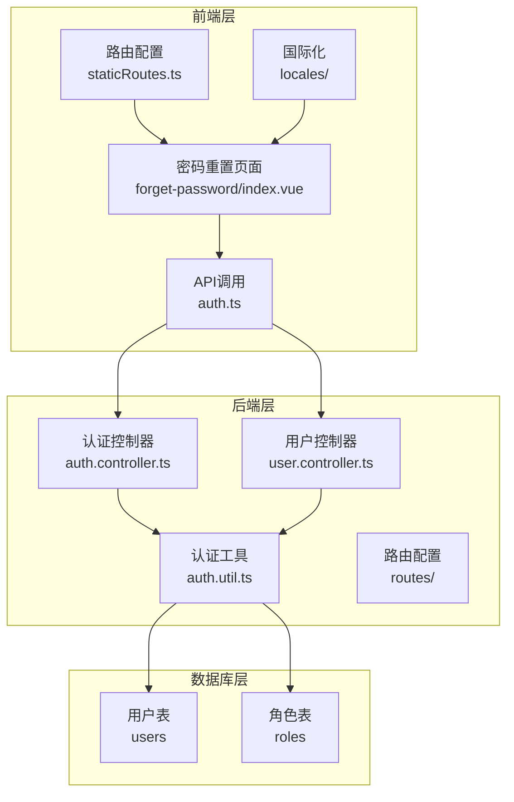

**图表来源**

- [index.vue](file://src/views/auth/forget-password/index.vue#L1-L63)
- [staticRoutes.ts](file://src/router/routes/staticRoutes.ts#L34-L37)
- [auth.controller.ts](file://backend/src/controllers/auth.controller.ts#L1-L280)

## 前端密码重置组件

### 组件结构分析

密码重置页面采用简洁的设计，包含以下核心元素：

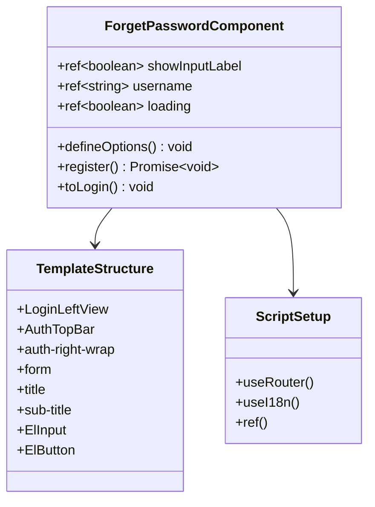

**图表来源**

- [index.vue](file://src/views/auth/forget-password/index.vue#L44-L58)

### 功能特性

1. **用户输入验证**：支持账号输入的基本验证
2. **国际化支持**：支持中英文界面切换
3. **路由导航**：提供返回登录页面的功能
4. **加载状态**：显示提交过程中的加载状态

### 组件生命周期

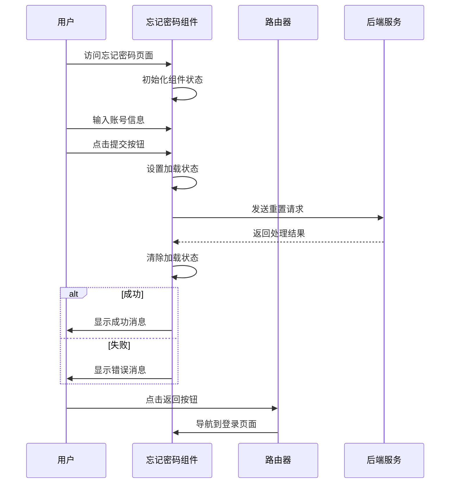

**图表来源**

- [index.vue](file://src/views/auth/forget-password/index.vue#L53-L57)

**章节来源**

- [index.vue](file://src/views/auth/forget-password/index.vue#L1-L63)

## 后端API接口

### 用户密码重置接口

系统提供了专门的密码重置API，仅供超级管理员使用：

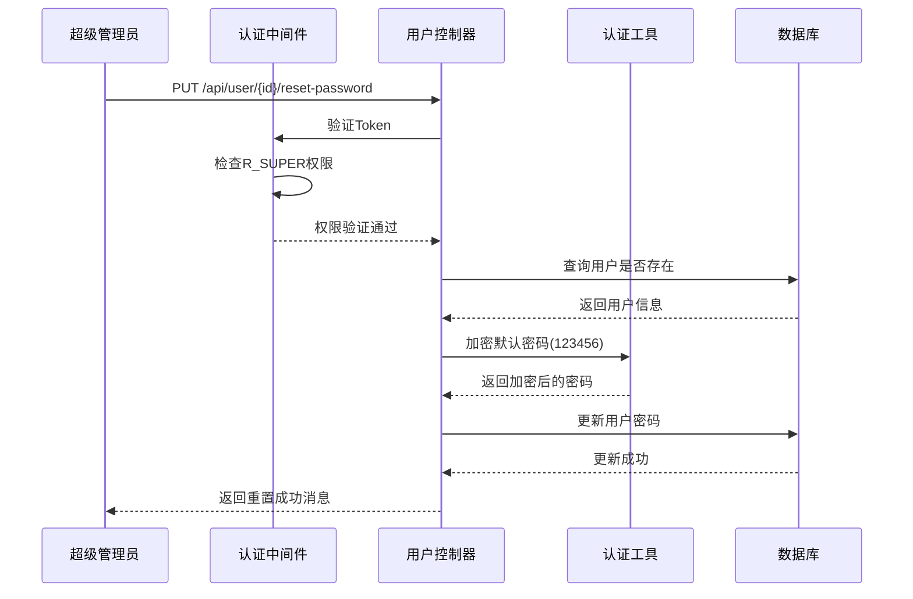

**图表来源**

- [user.controller.ts](file://backend/src/controllers/user.controller.ts#L355-L378)
- [user.routes.ts](file://backend/src/routes/user.routes.ts#L20)

### 接口规范

| 参数          | 类型   | 必需 | 描述                              |
| ------------- | ------ | ---- | --------------------------------- |
| Authorization | string | 是   | Bearer {token}（需要R_SUPER权限） |
| id            | number | 是   | 用户ID（URL路径参数）             |

| 响应状态码 | 描述                     |
| ---------- | ------------------------ |
| 200        | 密码重置成功             |
| 401        | Token无效                |
| 403        | 权限不足（非超级管理员） |
| 404        | 用户不存在               |

### 密码重置流程

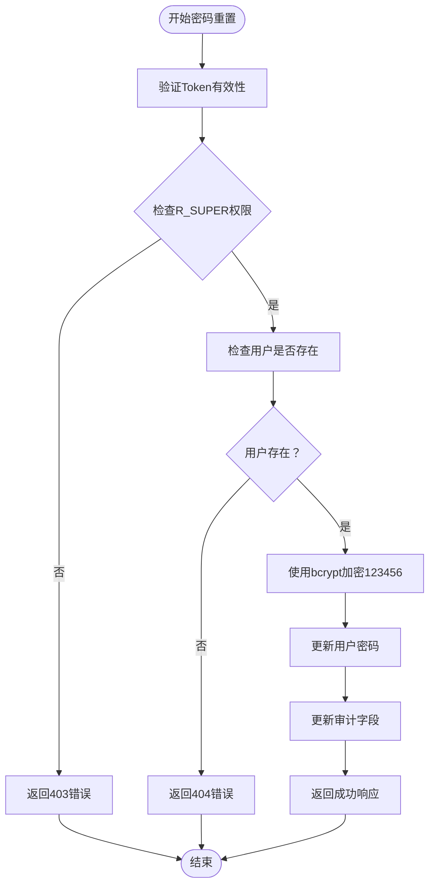

**图表来源**

- [user.controller.ts](file://backend/src/controllers/user.controller.ts#L355-L378)

**章节来源**

- [user.controller.ts](file://backend/src/controllers/user.controller.ts#L355-L378)
- [user.routes.ts](file://backend/src/routes/user.routes.ts#L1-L23)

## 认证与安全机制

### 密码加密机制

系统采用bcrypt进行密码加密，确保密码安全：

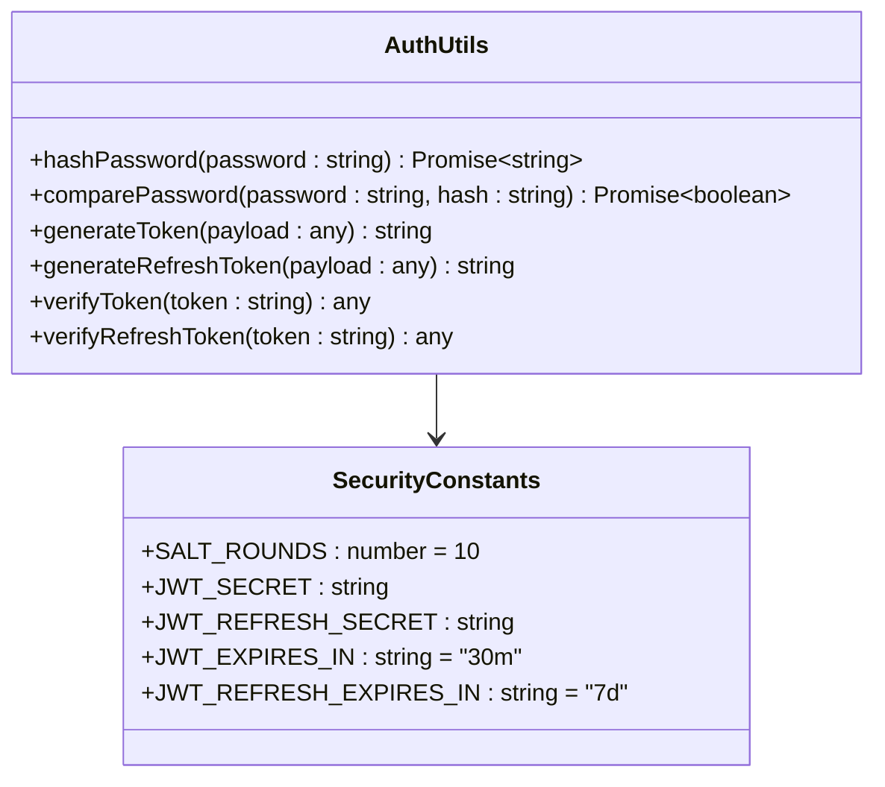

**图表来源**

- [auth.util.ts](file://backend/src/utils/auth.util.ts#L1-L64)

### Token管理

系统使用双重Token机制：

| Token类型     | 用途      | 有效期 | 安全特性           |
| ------------- | --------- | ------ | ------------------ |
| Access Token  | API访问   | 30分钟 | 签名验证，自动过期 |
| Refresh Token | Token续期 | 7天    | 签名验证，可撤销   |

### 安全措施

1. **角色权限控制**：只有R_SUPER角色可以重置密码
2. **密码强度**：默认密码为123456，符合最低安全要求
3. **审计追踪**：记录密码修改人和时间
4. **HTTPS强制**：建议在生产环境中使用HTTPS传输

**章节来源**

- [auth.util.ts](file://backend/src/utils/auth.util.ts#L1-L64)
- [auth.controller.ts](file://backend/src/controllers/auth.controller.ts#L1-L280)

## 路由配置

### 静态路由配置

密码重置页面作为静态路由，无需认证即可访问：

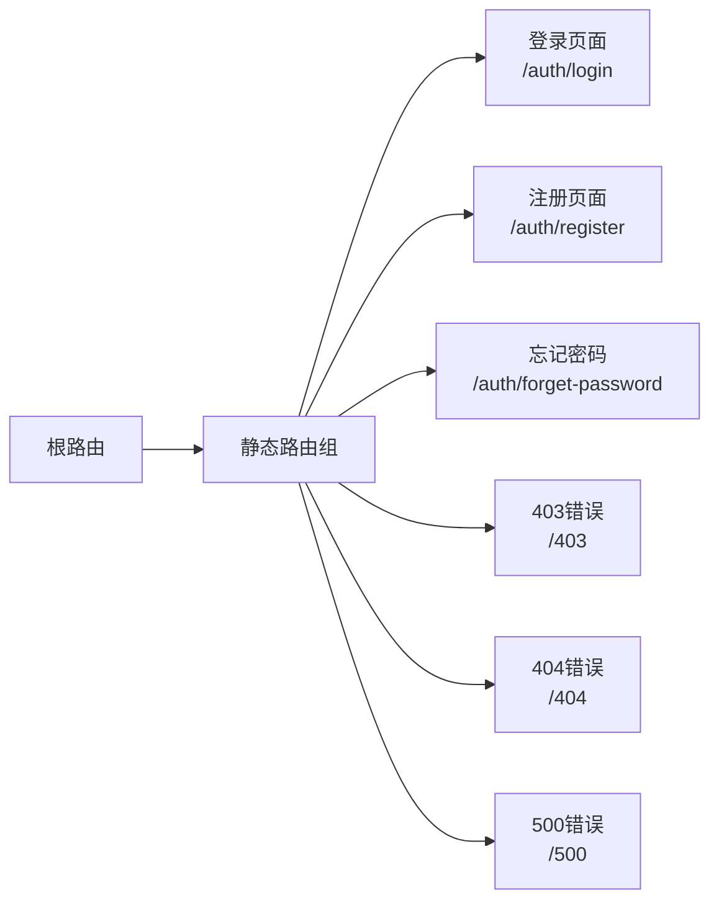

**图表来源**

- [staticRoutes.ts](file://src/router/routes/staticRoutes.ts#L34-L37)

### 路由守卫

虽然忘记密码页面是公开的，但系统在其他页面实现了严格的路由守卫：

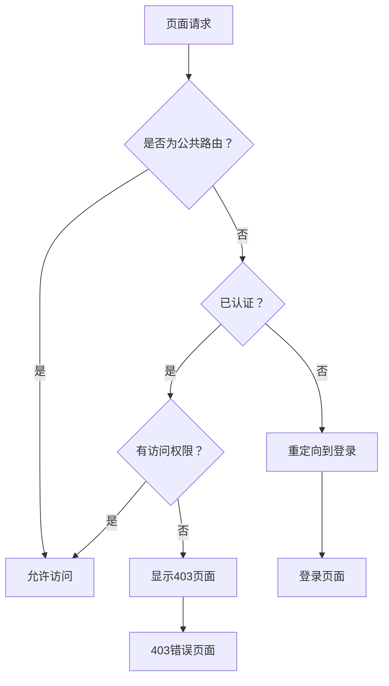

**章节来源**

- [staticRoutes.ts](file://src/router/routes/staticRoutes.ts#L1-L73)

## 国际化支持

### 多语言配置

系统支持中英文两种语言的密码重置界面：

| 界面元素     | 中文                           | 英文                                    |
| ------------ | ------------------------------ | --------------------------------------- |
| 页面标题     | 忘记密码？                     | Forgot password?                        |
| 副标题       | 输入您的电子邮件来重置您的密码 | Enter your email to reset your password |
| 输入框占位符 | 请输入您的电子邮件             | Please enter your email                 |
| 提交按钮     | 提交                           | Submit                                  |
| 返回按钮     | 返回                           | Back                                    |

### 菜单国际化

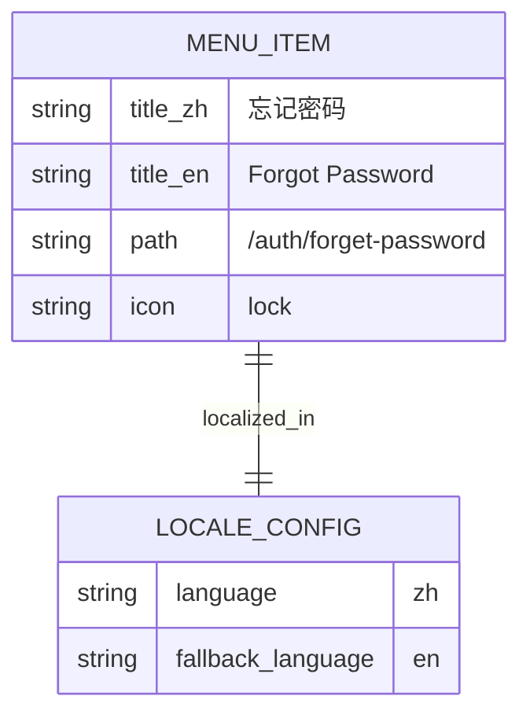

**图表来源**

- [zh.json](file://src/locales/langs/zh.json#L159-L165)
- [en.json](file://src/locales/langs/en.json#L159-L165)

**章节来源**

- [zh.json](file://src/locales/langs/zh.json#L159-L165)
- [en.json](file://src/locales/langs/en.json#L159-L165)

## 数据库设计

### 用户表结构

密码重置功能涉及的核心数据库表：

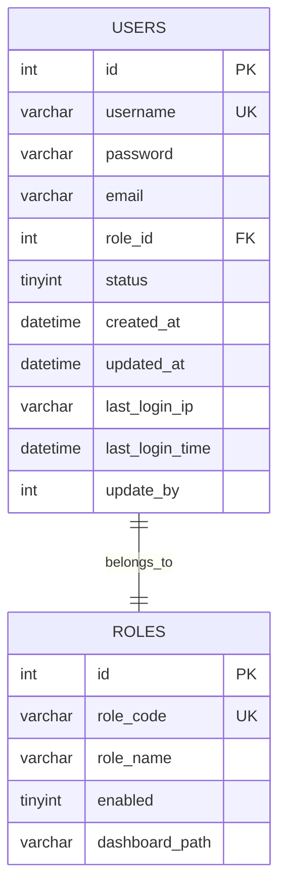

**图表来源**

- [user.controller.ts](file://backend/src/controllers/user.controller.ts#L360-L372)

### 密码重置字段

| 字段名     | 类型         | 描述         | 默认值            |
| ---------- | ------------ | ------------ | ----------------- |
| password   | varchar(255) | 加密后的密码 | NULL              |
| update_by  | int          | 修改者ID     | NULL              |
| updated_at | datetime     | 修改时间     | CURRENT_TIMESTAMP |

**章节来源**

- [user.controller.ts](file://backend/src/controllers/user.controller.ts#L360-L372)

## 错误处理机制

### 错误类型分类

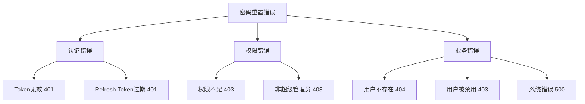

### 错误响应格式

```typescript
interface ErrorResponse {
  code: number
  message: string
  data?: any
}
```

### 错误处理策略

1. **客户端错误**：返回具体错误信息，指导用户修正
2. **服务器错误**：记录日志，返回通用错误信息
3. **安全考虑**：避免泄露过多系统信息

**章节来源**

- [user.controller.ts](file://backend/src/controllers/user.controller.ts#L355-L378)

## 最佳实践与安全建议

### 开发最佳实践

1. **输入验证**：前端和后端都需要进行输入验证
2. **错误处理**：统一的错误处理机制，避免敏感信息泄露
3. **日志记录**：记录密码重置操作，便于审计
4. **测试覆盖**：确保单元测试和集成测试覆盖关键场景

### 安全建议

1. **HTTPS强制**：在生产环境中强制使用HTTPS
2. **密码复杂度**：考虑增加密码复杂度要求
3. **账户锁定**：实现失败登录尝试次数限制
4. **邮件通知**：密码重置后发送确认邮件
5. **审计日志**：记录所有密码重置操作

### 性能优化

1. **缓存策略**：对于频繁查询的用户信息使用缓存
2. **批量操作**：支持批量重置多个用户密码
3. **异步处理**：对于大量用户密码重置使用队列处理

### 扩展功能建议

1. **邮箱验证**：添加邮箱验证步骤
2. **验证码**：增加图形验证码防止自动化攻击
3. **重置链接**：生成一次性重置链接
4. **操作历史**：记录用户密码重置历史

## 结论

Art Design Pro项目的密码重置功能设计合理，实现了基本的安全性和可用性要求。通过基于角色的访问控制，确保只有超级管理员才能执行密码重置操作，同时提供了良好的用户体验和完善的错误处理机制。

该功能为系统管理员提供了必要的密码重置能力，同时也为未来的功能扩展奠定了良好的基础。建议在实际部署时根据具体需求进一步完善安全措施和用户体验。
