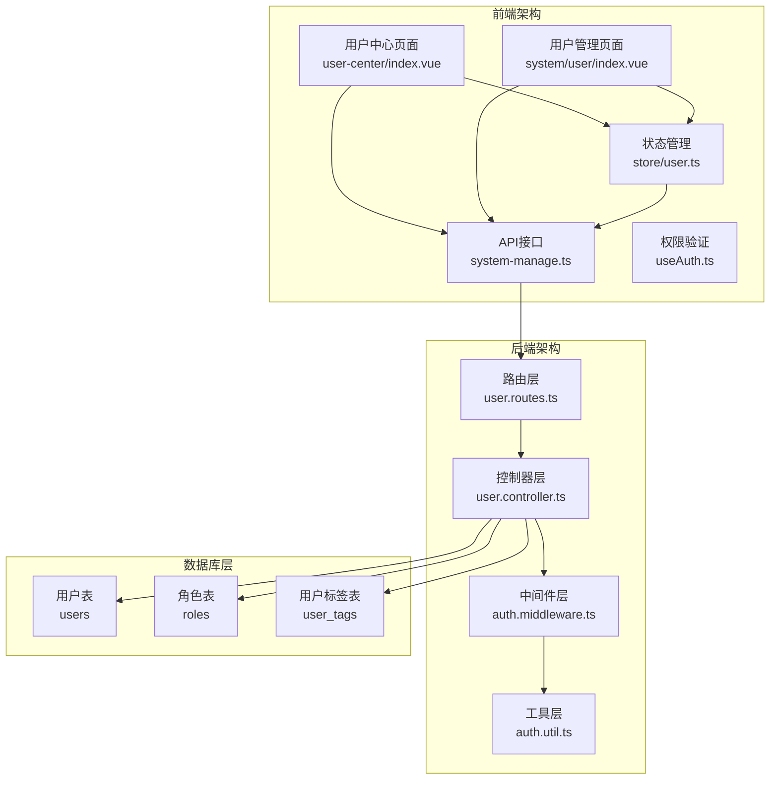
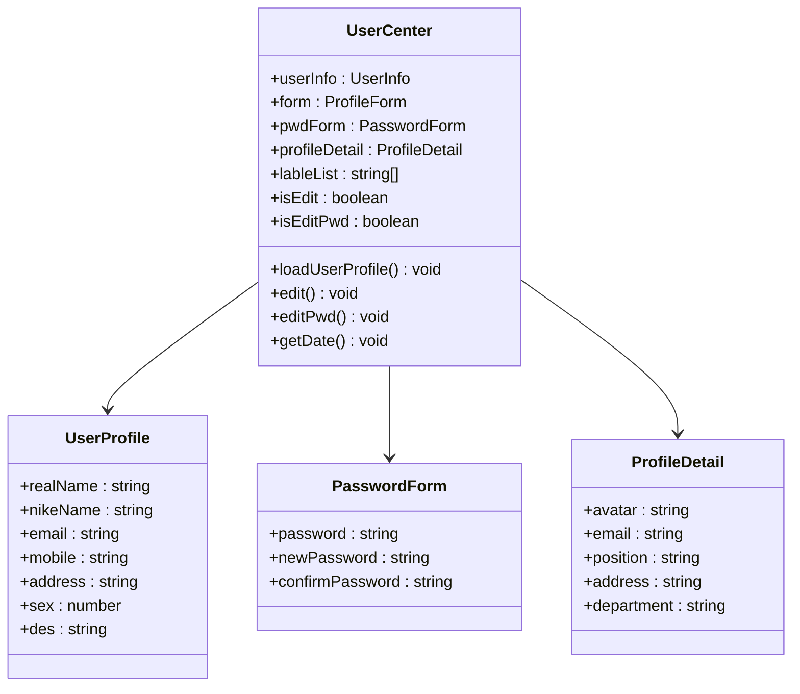
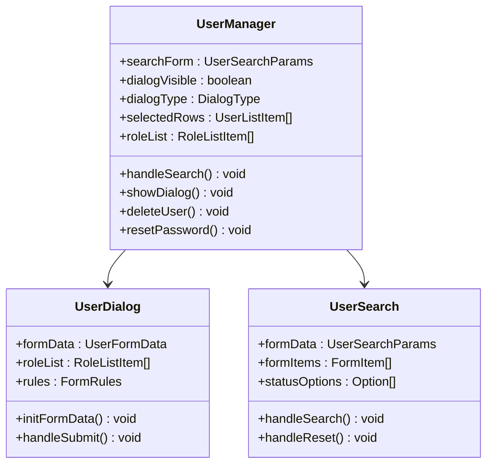
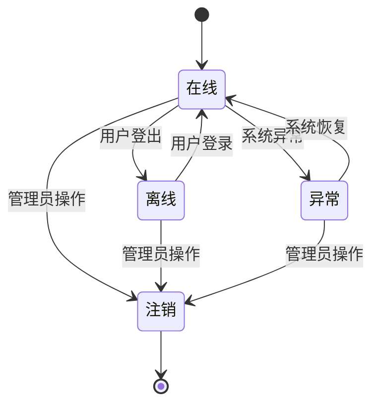
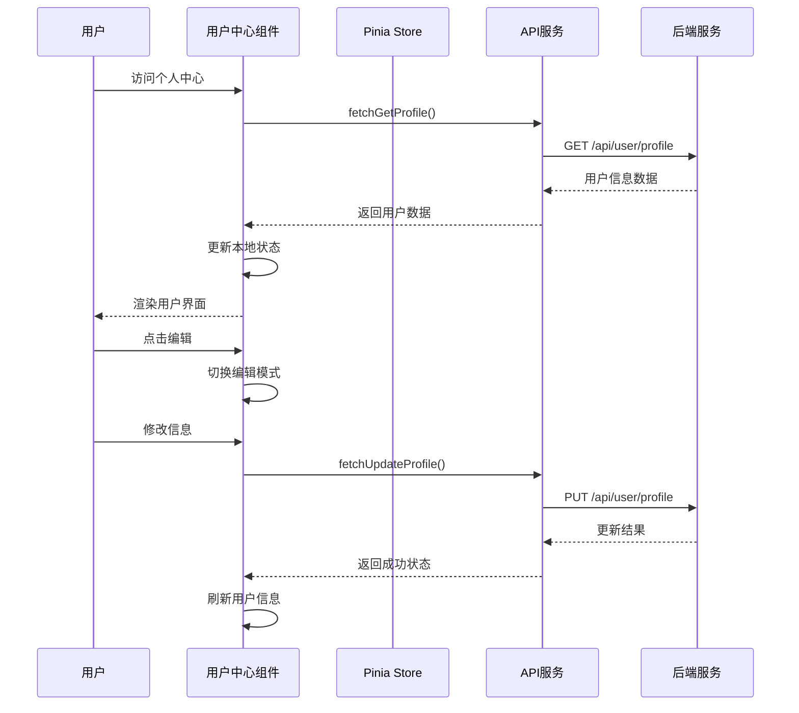
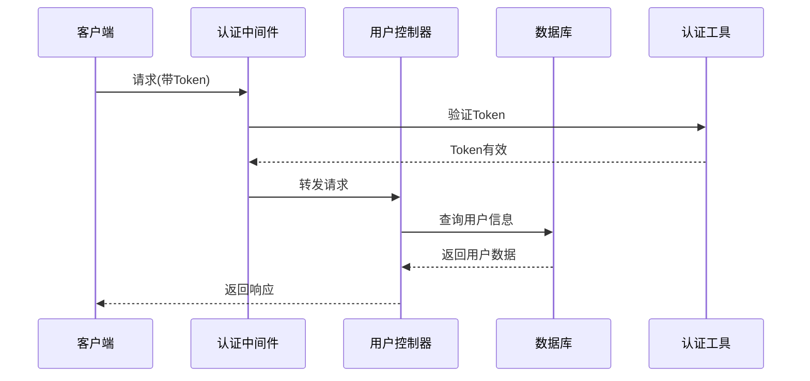
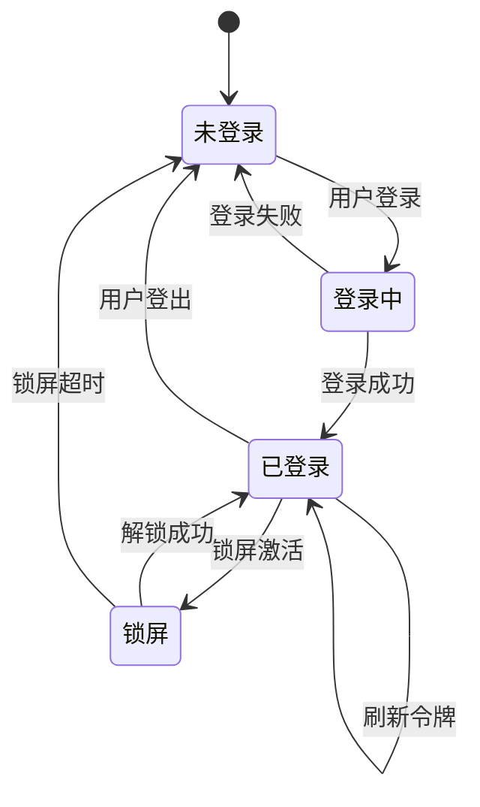

# 用户中心

<cite>
**本文档引用的文件**
- [src/views/system/user-center/index.vue](file://src/views/system/user-center/index.vue)
- [backend/src/controllers/user.controller.ts](file://backend/src/controllers/user.controller.ts)
- [backend/src/routes/user.routes.ts](file://backend/src/routes/user.routes.ts)
- [src/store/modules/user.ts](file://src/store/modules/user.ts)
- [src/hooks/core/useAuth.ts](file://src/hooks/core/useAuth.ts)
- [src/api/system-manage.ts](file://src/api/system-manage.ts)
- [src/types/api/api.d.ts](file://src/types/api/api.d.ts)
- [src/views/system/user/index.vue](file://src/views/system/user/index.vue)
- [src/views/system/user/modules/user-dialog.vue](file://src/views/system/user/modules/user-dialog.vue)
- [src/views/system/user/modules/user-search.vue](file://src/views/system/user/modules/user-search.vue)
</cite>

## 目录

1. [简介](#简介)
2. [项目架构](#项目架构)
3. [核心组件](#核心组件)
4. [用户中心功能](#用户中心功能)
5. [用户管理功能](#用户管理功能)
6. [权限管理](#权限管理)
7. [数据流分析](#数据流分析)
8. [API接口设计](#api接口设计)
9. [状态管理](#状态管理)
10. [安全机制](#安全机制)
11. [性能优化](#性能优化)
12. [故障排除](#故障排除)
13. [总结](#总结)

## 简介

用户中心是本系统的核心功能模块之一，提供完整的用户个人信息管理和用户管理系统。该模块采用前后端分离架构，前端基于Vue 3 + TypeScript + Element Plus构建，后端使用Express + TypeScript + MySQL实现，为用户提供便捷的个人资料管理、密码修改、用户信息维护等功能。

## 项目架构

### 整体架构图



**图表来源**

- [src/views/system/user-center/index.vue](file://src/views/system/user-center/index.vue#L1-L50)
- [backend/src/controllers/user.controller.ts](file://backend/src/controllers/user.controller.ts#L1-L50)

### 技术栈

| 层级         | 技术         | 版本   | 说明                 |
| ------------ | ------------ | ------ | -------------------- |
| 前端框架     | Vue          | 3.x    | 组件化开发框架       |
| 前端状态管理 | Pinia        | 最新版 | 响应式状态管理       |
| 前端UI库     | Element Plus | 最新版 | 组件库               |
| 前端类型系统 | TypeScript   | 最新版 | 类型安全保障         |
| 后端框架     | Express      | 最新版 | Web应用框架          |
| 数据库       | MySQL        | 8.x+   | 关系型数据库         |
| 编程语言     | TypeScript   | 最新版 | 类型安全的JavaScript |

**章节来源**

- [src/views/system/user-center/index.vue](file://src/views/system/user-center/index.vue#L1-L100)
- [backend/src/controllers/user.controller.ts](file://backend/src/controllers/user.controller.ts#L1-L50)

## 核心组件

### 用户中心组件架构



**图表来源**

- [src/views/system/user-center/index.vue](file://src/views/system/user-center/index.vue#L157-L220)

### 用户管理组件架构



**图表来源**

- [src/views/system/user/index.vue](file://src/views/system/user/index.vue#L44-L100)
- [src/views/system/user/modules/user-dialog.vue](file://src/views/system/user/modules/user-dialog.vue#L41-L80)

**章节来源**

- [src/views/system/user-center/index.vue](file://src/views/system/user-center/index.vue#L156-L407)
- [src/views/system/user/index.vue](file://src/views/system/user/index.vue#L44-L336)

## 用户中心功能

### 个人资料管理

用户中心提供完整的个人资料管理功能，包括：

#### 1. 个人信息展示

- **头像展示**：支持自定义头像，支持默认头像
- **基本信息**：姓名、昵称、邮箱、手机号、地址
- **个人介绍**：支持富文本编辑
- **用户标签**：支持添加和管理用户标签

#### 2. 信息编辑功能

- **编辑模式切换**：点击"编辑"进入编辑模式，点击"保存"保存更改
- **表单验证**：实时验证输入数据的合法性
- **数据持久化**：自动保存到服务器并更新本地状态

#### 3. 密码管理

- **密码修改**：支持当前密码验证和新密码设置
- **密码强度**：新密码最小长度6位
- **确认验证**：确保新密码输入一致性

### 功能特性

| 功能     | 实现方式        | 验证规则         | 说明         |
| -------- | --------------- | ---------------- | ------------ |
| 头像上传 | 图片上传组件    | 支持常见图片格式 | 支持默认头像 |
| 姓名验证 | 必填 + 长度限制 | 2-50字符         | 必填字段     |
| 邮箱验证 | 格式验证        | Email格式        | 必填字段     |
| 手机验证 | 格式验证        | 11位手机号       | 必填字段     |
| 性别选择 | 单选按钮        | 男/女            | 必填字段     |
| 密码验证 | 多重验证        | 长度+格式        | 当前密码必填 |

**章节来源**

- [src/views/system/user-center/index.vue](file://src/views/system/user-center/index.vue#L222-L255)

## 用户管理功能

### 用户列表管理

用户管理页面提供完整的用户生命周期管理功能：

#### 1. 用户列表展示

- **分页查询**：支持大数据量分页显示
- **条件搜索**：支持用户名、手机号、邮箱、状态、性别等多维度搜索
- **状态标识**：在线、离线、异常、注销状态标识
- **角色显示**：显示用户所属角色，支持角色名称映射

#### 2. 用户操作功能

- **新增用户**：支持批量创建用户，自动分配默认密码
- **编辑用户**：支持修改用户基本信息和角色分配
- **删除用户**：支持用户注销，不可删除自身
- **重置密码**：一键重置用户密码为默认值

#### 3. 数据表格功能

- **多选操作**：支持批量选择和批量操作
- **排序功能**：支持按创建时间等字段排序
- **固定列**：操作列固定在右侧
- **图片预览**：支持用户头像点击预览

### 用户状态管理



**图表来源**

- [src/views/system/user/index.vue](file://src/views/system/user/index.vue#L76-L95)

**章节来源**

- [src/views/system/user/index.vue](file://src/views/system/user/index.vue#L1-L336)
- [src/views/system/user/modules/user-dialog.vue](file://src/views/system/user/modules/user-dialog.vue#L1-L186)

## 权限管理

### 权限验证机制

系统采用双重权限验证机制，支持前端模式和后端模式：

#### 1. 前端权限验证

- **按钮权限**：从用户信息中获取按钮权限列表
- **角色权限**：基于用户角色进行权限控制
- **动态渲染**：根据权限动态显示/隐藏功能按钮

#### 2. 后端权限验证

- **路由保护**：通过中间件保护敏感路由
- **操作授权**：验证用户是否有执行特定操作的权限
- **资源隔离**：确保用户只能访问授权的资源

### 权限配置

| 权限类型 | 验证方式     | 应用场景         | 示例                 |
| -------- | ------------ | ---------------- | -------------------- |
| 页面访问 | 路由中间件   | 整个页面访问控制 | 用户管理页面         |
| 按钮操作 | 前端权限钩子 | CRUD操作权限     | 新增、编辑、删除按钮 |
| 数据查询 | 后端过滤     | 数据权限控制     | 用户列表查询         |
| 敏感操作 | 权限校验     | 高危操作验证     | 密码重置、用户删除   |

**章节来源**

- [src/hooks/core/useAuth.ts](file://src/hooks/core/useAuth.ts#L1-L75)

## 数据流分析

### 前端数据流



**图表来源**

- [src/views/system/user-center/index.vue](file://src/views/system/user-center/index.vue#L273-L301)
- [src/store/modules/user.ts](file://src/store/modules/user.ts#L1-L50)

### 后端数据流



**图表来源**

- [backend/src/controllers/user.controller.ts](file://backend/src/controllers/user.controller.ts#L81-L136)
- [backend/src/routes/user.routes.ts](file://backend/src/routes/user.routes.ts#L1-L23)

**章节来源**

- [src/views/system/user-center/index.vue](file://src/views/system/user-center/index.vue#L273-L301)
- [backend/src/controllers/user.controller.ts](file://backend/src/controllers/user.controller.ts#L81-L136)

## API接口设计

### 用户中心接口

| 接口路径             | 方法 | 权限   | 功能             | 参数             |
| -------------------- | ---- | ------ | ---------------- | ---------------- |
| `/api/user/profile`  | GET  | 需认证 | 获取当前用户信息 | 无               |
| `/api/user/profile`  | PUT  | 需认证 | 更新当前用户信息 | 用户信息对象     |
| `/api/user/password` | POST | 需认证 | 修改当前用户密码 | 当前密码、新密码 |
| `/api/user/tags`     | POST | 需认证 | 更新当前用户标签 | 标签数组         |
| `/api/user/avatar`   | POST | 需认证 | 上传用户头像     | 头像URL          |

### 用户管理接口

| 接口路径                       | 方法   | 权限    | 功能         | 参数               |
| ------------------------------ | ------ | ------- | ------------ | ------------------ |
| `/api/user/list`               | GET    | R_SUPER | 获取用户列表 | 分页参数、搜索条件 |
| `/api/user`                    | POST   | R_SUPER | 创建用户     | 用户基本信息       |
| `/api/user/:id`                | PUT    | R_SUPER | 更新用户     | 用户ID、更新信息   |
| `/api/user/:id`                | DELETE | R_SUPER | 删除用户     | 用户ID             |
| `/api/user/:id/reset-password` | PUT    | R_SUPER | 重置密码     | 用户ID             |

### 接口响应结构

```typescript
interface ApiResponse<T = any> {
  code: number
  message?: string
  data?: T
}

interface UserProfile {
  id: number
  username: string
  realName: string
  nickname: string
  avatar: string
  gender: number
  email: string
  phone: string
  address: string
  description: string
  tags: string[]
}
```

**章节来源**

- [src/api/system-manage.ts](file://src/api/system-manage.ts#L1-L179)
- [backend/src/routes/user.routes.ts](file://backend/src/routes/user.routes.ts#L1-L23)
- [src/types/api/api.d.ts](file://src/types/api/api.d.ts#L132-L171)

## 状态管理

### Pinia状态管理

系统使用Pinia进行状态管理，主要管理以下状态：

#### 1. 用户基本信息

- **用户信息**：存储完整的用户信息对象
- **登录状态**：管理用户的登录/登出状态
- **令牌信息**：管理访问令牌和刷新令牌
- **语言设置**：管理界面语言偏好

#### 2. 工作台状态

- **标签页管理**：管理多标签页的打开状态
- **布局配置**：管理界面布局设置
- **主题配置**：管理主题和颜色方案

#### 3. 持久化策略

- **localStorage**：持久化用户信息和设置
- **自动清理**：登出时自动清理敏感信息
- **版本兼容**：支持状态迁移和版本升级

### 状态流转图



**图表来源**

- [src/store/modules/user.ts](file://src/store/modules/user.ts#L149-L188)

**章节来源**

- [src/store/modules/user.ts](file://src/store/modules/user.ts#L1-L249)

## 安全机制

### 密码安全

#### 1. 密码加密

- **哈希算法**：使用bcrypt进行密码哈希
- **盐值随机**：每次加密使用不同盐值
- **强度要求**：新密码最小6位长度

#### 2. 传输安全

- **HTTPS协议**：强制使用HTTPS传输
- **Token保护**：JWT Token包含用户身份信息
- **刷新机制**：支持Token刷新，减少暴露风险

### 访问控制

#### 1. 权限分级

- **超级管理员**：拥有最高权限
- **管理员**：拥有大部分管理权限
- **普通用户**：仅能访问个人功能

#### 2. 资源隔离

- **数据隔离**：用户只能访问自己的数据
- **操作限制**：某些操作需要额外权限验证
- **审计日志**：记录重要操作的审计信息

### 输入验证

#### 1. 前端验证

- **实时验证**：输入时实时验证
- **格式检查**：检查数据格式正确性
- **业务规则**：验证业务逻辑合理性

#### 2. 后端验证

- **完整性检查**：验证必需字段存在
- **数据类型**：验证数据类型正确性
- **业务约束**：验证业务规则约束

**章节来源**

- [backend/src/controllers/user.controller.ts](file://backend/src/controllers/user.controller.ts#L158-L196)

## 性能优化

### 前端优化

#### 1. 组件优化

- **懒加载**：按需加载用户管理组件
- **虚拟滚动**：大数据量列表使用虚拟滚动
- **防抖节流**：搜索和输入操作防抖处理

#### 2. 网络优化

- **请求合并**：合并相似的API请求
- **缓存策略**：合理使用浏览器缓存
- **CDN加速**：静态资源使用CDN

#### 3. 渲染优化

- **响应式设计**：移动端适配良好
- **图片优化**：头像图片压缩处理
- **动画效果**：流畅的过渡动画

### 后端优化

#### 1. 数据库优化

- **索引优化**：为常用查询字段建立索引
- **查询优化**：优化复杂查询语句
- **连接池**：使用数据库连接池

#### 2. 缓存策略

- **Redis缓存**：缓存热点数据
- **内存缓存**：缓存用户权限信息
- **CDN缓存**：静态资源CDN缓存

#### 3. 并发处理

- **异步处理**：耗时操作异步处理
- **队列机制**：非关键操作使用队列
- **负载均衡**：支持水平扩展

## 故障排除

### 常见问题及解决方案

#### 1. 登录相关问题

- **问题**：登录后无法访问受保护的页面
- **原因**：Token验证失败或过期
- **解决**：检查网络连接，重新登录

- **问题**：密码修改失败
- **原因**：当前密码错误或新密码不符合规范
- **解决**：确认当前密码正确，检查新密码格式

#### 2. 数据加载问题

- **问题**：用户信息加载缓慢
- **原因**：网络延迟或数据库查询慢
- **解决**：检查网络状况，优化查询语句

- **问题**：用户列表显示异常
- **原因**：分页参数错误或权限不足
- **解决**：检查分页参数，确认用户权限

#### 3. 权限相关问题

- **问题**：无法看到某些功能按钮
- **原因**：用户权限不足或前端权限配置错误
- **解决**：联系管理员调整权限

### 调试技巧

#### 1. 浏览器调试

- **开发者工具**：使用Console查看错误信息
- **Network面板**：监控API请求状态
- **Application面板**：检查本地存储数据

#### 2. 后端调试

- **日志分析**：查看服务器日志定位问题
- **数据库查询**：验证SQL语句执行情况
- **中间件检查**：确认认证中间件正常工作

**章节来源**

- [src/views/system/user-center/index.vue](file://src/views/system/user-center/index.vue#L370-L395)

## 总结

用户中心模块作为系统的核心功能，提供了完整的用户管理解决方案。通过前后端分离架构，实现了良好的用户体验和系统的可维护性。

### 主要特点

1. **功能完整**：涵盖用户个人信息管理、密码修改、用户管理等核心功能
2. **安全可靠**：采用多重安全机制，保障用户数据安全
3. **易于扩展**：模块化设计，便于功能扩展和维护
4. **性能优秀**：前后端优化措施，确保良好的用户体验
5. **权限清晰**：完善的权限管理体系，支持细粒度权限控制

### 技术亮点

- **TypeScript类型安全**：确保代码质量和开发效率
- **响应式状态管理**：使用Pinia实现高效的状态管理
- **组件化开发**：模块化组件设计，提高代码复用性
- **RESTful API设计**：遵循REST原则，接口设计规范
- **安全性考虑**：密码加密、Token验证、权限控制等安全措施

该用户中心模块为系统提供了坚实的基础，支撑了整个系统的用户管理需求，是一个设计合理、实现优秀的功能模块。
