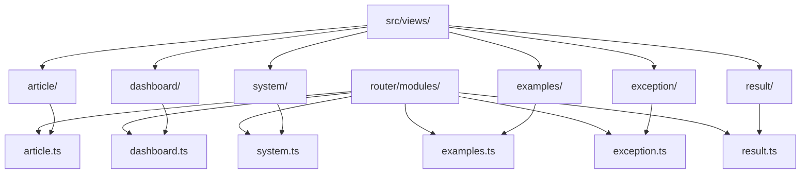
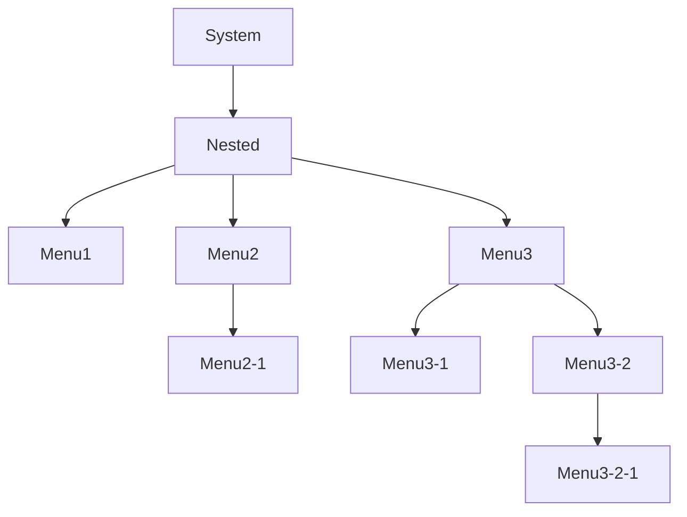
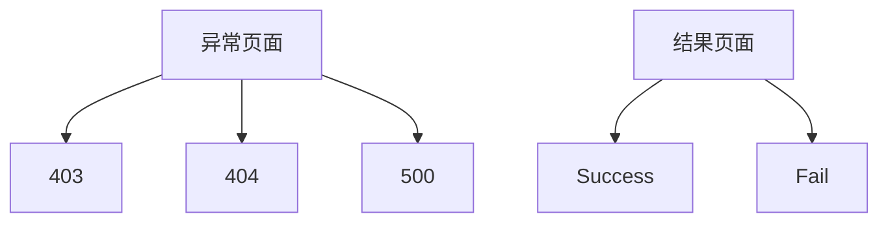

# 视图目录

<cite>
**本文档引用的文件**  
- [dashboard.ts](file://src/router/modules/dashboard.ts)
- [system.ts](file://src/router/modules/system.ts)
- [article.ts](file://src/router/modules/article.ts)
- [exception.ts](file://src/router/modules/exception.ts)
- [result.ts](file://src/router/modules/result.ts)
- [index.ts](file://src/router/modules/index.ts)
- [asyncRoutes.ts](file://src/router/routes/asyncRoutes.ts)
- [staticRoutes.ts](file://src/router/routes/staticRoutes.ts)
- [index.vue](file://src/views/index/index.vue)
- [console.vue](file://src/views/dashboard/console/index.vue)
- [list.vue](file://src/views/article/list/index.vue)
- [user.vue](file://src/views/system/user/index.vue)
- [404.vue](file://src/views/exception/404/index.vue)
- [success.vue](file://src/views/result/success/index.vue)
- [menu1.vue](file://src/views/system/nested/menu1/index.vue)
- [examples.ts](file://src/router/modules/examples.ts)
</cite>

## 目录

1. [功能域页面组织结构](#功能域页面组织结构)  
2. [页面组件结构设计](#页面组件结构设计)  
3. [嵌套路由实现方式](#嵌套路由实现方式)  
4. [动态路由参数处理](#动态路由参数处理)  
5. [异常与结果页面设计模式](#异常与结果页面设计模式)  
6. [新页面开发标准化流程](#新页面开发标准化流程)

## 功能域页面组织结构

项目中的页面组件按照功能域进行组织，每个功能域对应一个独立的目录，位于 `src/views/` 下。主要功能域包括：`article`（文章管理）、`dashboard`（仪表盘）、`system`（系统管理）、`examples`（功能示例）等。

每个功能域的页面组件与 `router/modules/` 中的路由配置文件一一对应。例如：
- `src/views/article/` 对应 `src/router/modules/article.ts`
- `src/views/system/` 对应 `src/router/modules/system.ts`
- `src/views/dashboard/` 对应 `src/router/modules/dashboard.ts`

路由模块通过 `routeModules` 数组统一导出，并在 `asyncRoutes.ts` 中作为动态路由使用，确保只有具备权限的用户才能访问相应页面。



**图示来源**  
- [article.ts](file://src/router/modules/article.ts)
- [system.ts](file://src/router/modules/system.ts)
- [dashboard.ts](file://src/router/modules/dashboard.ts)
- [examples.ts](file://src/router/modules/examples.ts)

**本节来源**  
- [article.ts](file://src/router/modules/article.ts)
- [system.ts](file://src/router/modules/system.ts)
- [dashboard.ts](file://src/router/modules/dashboard.ts)
- [examples.ts](file://src/router/modules/examples.ts)

## 页面组件结构设计

页面组件遵循统一的结构设计原则，包含布局、数据获取、状态管理和用户交互处理。

### 布局结构
所有页面均基于 `src/views/index/index.vue` 的主布局容器，采用侧边栏 + 主内容区的结构。主布局包含：
- `ArtSidebarMenu`：左侧菜单
- `ArtHeaderBar`：顶部导航栏
- `ArtPageContent`：页面内容区域

### 数据获取
页面通过组合式 API（Composition API）进行数据获取。例如，在 `article/list/index.vue` 中使用 `onMounted` 钩子调用 `getArticleList` 方法从 API 获取数据，并支持搜索、分页等操作。

### 状态管理集成
状态管理通过 Pinia 实现，存储于 `src/store/` 目录下。页面组件通过 `useStore()` 获取状态，如用户信息、菜单配置等。

### 用户交互处理
用户交互通过事件绑定实现，如按钮点击、表单提交、分页切换等。权限控制通过自定义指令 `v-auth` 实现，确保只有具备相应权限的用户才能看到或操作特定元素。

**本节来源**  
- [index.vue](file://src/views/index/index.vue)
- [list.vue](file://src/views/article/list/index.vue)
- [user.vue](file://src/views/system/user/index.vue)

## 嵌套路由实现方式

嵌套路由用于实现多级菜单结构，如 `system/nested/` 下的多层嵌套页面。其核心实现方式如下：

在 `system.ts` 路由配置中，`nested` 路由项包含 `children` 字段，定义了子路由。每个子路由可继续包含 `children`，形成多级嵌套。

例如：
```ts
{
  path: 'nested',
  name: 'Nested',
  children: [
    {
      path: 'menu1',
      name: 'NestedMenu1',
      component: '/system/nested/menu1'
    },
    {
      path: 'menu2',
      name: 'NestedMenu2',
      children: [
        {
          path: 'menu2-1',
          name: 'NestedMenu2-1',
          component: '/system/nested/menu2'
        }
      ]
    }
  ]
}
```

对应的页面组件位于 `src/views/system/nested/` 目录下，按层级组织。前端通过递归渲染菜单组件实现多级菜单展示。



**图示来源**  
- [system.ts](file://src/router/modules/system.ts)
- [menu1.vue](file://src/views/system/nested/menu1/index.vue)

**本节来源**  
- [system.ts](file://src/router/modules/system.ts)

## 动态路由参数处理

动态路由参数用于实现详情页、编辑页等需要传递参数的场景。项目通过 Vue Router 的动态路径参数实现。

例如，在 `article.ts` 中定义：
```ts
{
  path: 'detail/:id',
  name: 'ArticleDetail',
  component: '/article/detail'
}
```

在页面中通过 `useRoute().params.id` 获取参数，并根据 ID 请求对应数据。跳转时通过 `router.push({ name: 'ArticleDetail', params: { id: item.id } })` 传递参数。

**本节来源**  
- [article.ts](file://src/router/modules/article.ts)
- [list.vue](file://src/views/article/list/index.vue)

## 异常与结果页面设计模式

### 异常页面（exception/）
异常页面统一放置在 `src/views/exception/` 目录下，包含 403、404、500 等状态码页面。这些页面在 `staticRoutes.ts` 中注册为静态路由，无需权限即可访问。

例如，404 页面配置：
```ts
{
  path: '/:pathMatch(.*)*',
  name: 'Exception404',
  component: () => import('@views/exception/404/index.vue')
}
```

页面使用 `ArtException` 组件统一渲染，传入标题、描述、按钮文本和图片 URL。

### 结果页面（result/）
结果页面用于操作成功或失败后的反馈，位于 `src/views/result/` 目录下。通过 `ArtResultPage` 组件统一渲染，支持成功、失败等多种类型。

例如，成功页面：
```vue
<ArtResultPage type="success" title="提交成功" message="..." />
```



**图示来源**  
- [staticRoutes.ts](file://src/router/routes/staticRoutes.ts)
- [404.vue](file://src/views/exception/404/index.vue)
- [success.vue](file://src/views/result/success/index.vue)

**本节来源**  
- [exception.ts](file://src/router/modules/exception.ts)
- [result.ts](file://src/router/modules/result.ts)
- [staticRoutes.ts](file://src/router/routes/staticRoutes.ts)

## 新页面开发标准化流程

### 1. 文件创建
在对应功能域目录下创建页面组件文件，如 `src/views/article/new-page/index.vue`。

### 2. 路由注册
在对应的路由模块文件中添加路由配置，如 `article.ts`：
```ts
{
  path: 'new-page',
  name: 'NewPage',
  component: '/article/new-page',
  meta: {
    title: 'menus.article.newPage',
    icon: 'ri:new-icon',
    keepAlive: true
  }
}
```

### 3. 权限配置
若需权限控制，在 `meta` 中添加 `roles` 或 `authList` 字段：
```ts
meta: {
  roles: ['R_SUPER'],
  authList: [
    { title: '新增', authMark: 'add' },
    { title: '编辑', authMark: 'edit' }
  ]
}
```

### 4. 菜单国际化
在 `locales/langs/zh.json` 和 `en.json` 中添加菜单标题：
```json
"menus": {
  "article": {
    "newPage": "新页面"
  }
}
```

### 5. 组件注册（可选）
若为全局组件，可在 `components/` 中注册；否则直接在页面中使用。

**本节来源**  
- [article.ts](file://src/router/modules/article.ts)
- [system.ts](file://src/router/modules/system.ts)
- [staticRoutes.ts](file://src/router/routes/staticRoutes.ts)