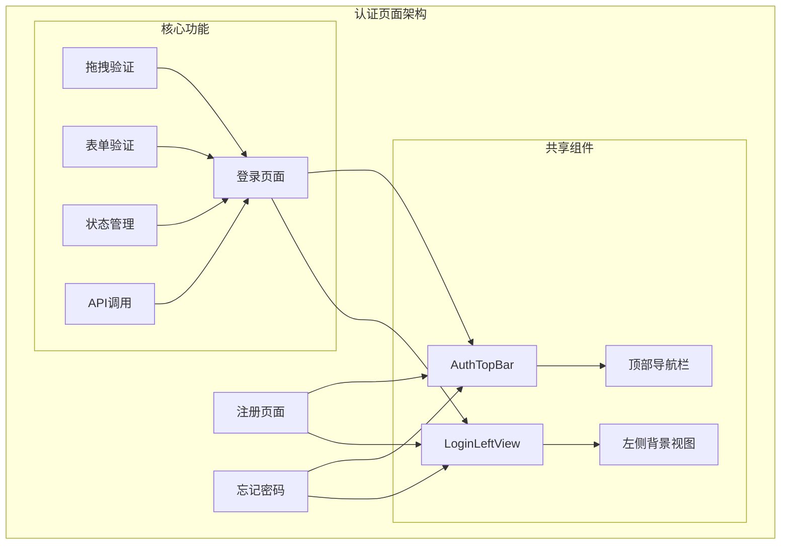
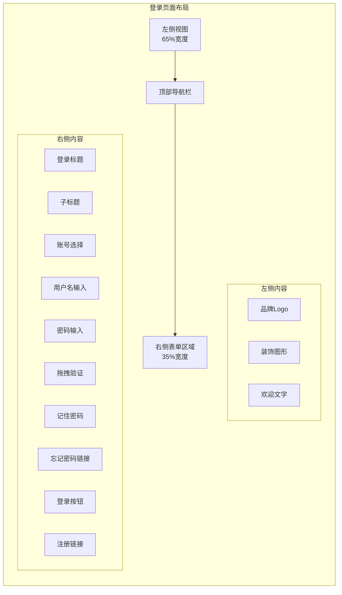
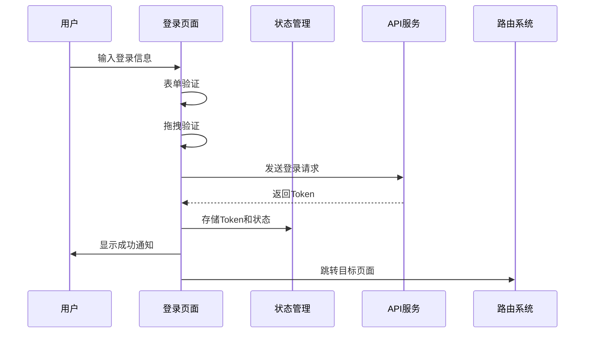
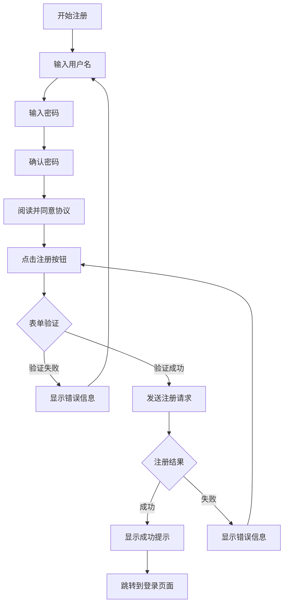
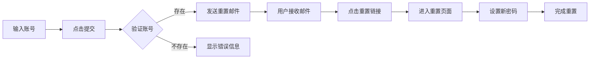
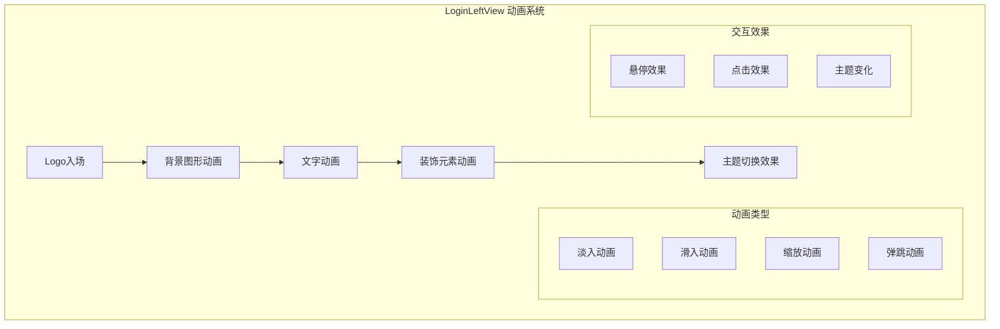
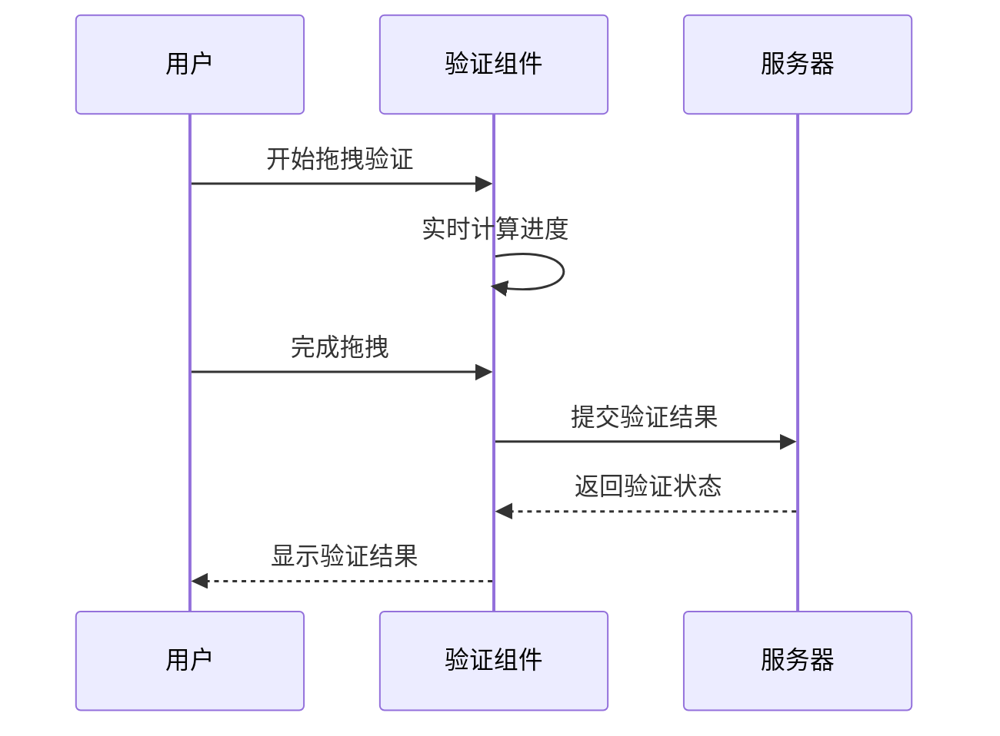
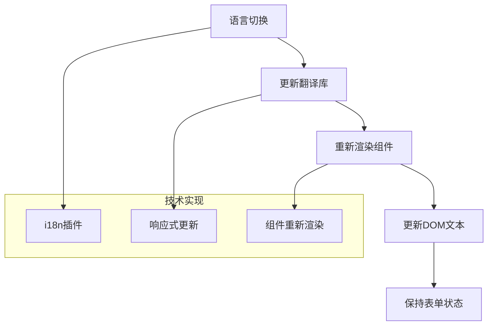

# 认证视图

<cite>
**本文档引用的文件**
- [src/views/auth/login/index.vue](file://src/views/auth/login/index.vue)
- [src/views/auth/register/index.vue](file://src/views/auth/register/index.vue)
- [src/views/auth/forget-password/index.vue](file://src/views/auth/forget-password/index.vue)
- [src/components/core/views/login/AuthTopBar.vue](file://src/components/core/views/login/AuthTopBar.vue)
- [src/components/core/views/login/LoginLeftView.vue](file://src/components/core/views/login/LoginLeftView.vue)
- [src/views/auth/login/style.css](file://src/views/auth/login/style.css)
- [src/router/routes/staticRoutes.ts](file://src/router/routes/staticRoutes.ts)
- [src/api/auth.ts](file://src/api/auth.ts)
- [src/store/modules/user.ts](file://src/store/modules/user.ts)
- [src/hooks/core/useAuth.ts](file://src/hooks/core/useAuth.ts)
- [src/components/core/forms/art-drag-verify/index.vue](file://src/components/core/forms/art-drag-verify/index.vue)
</cite>

## 目录
1. [项目概述](#项目概述)
2. [认证页面架构](#认证页面架构)
3. [登录页面详细分析](#登录页面详细分析)
4. [注册页面详细分析](#注册页面详细分析)
5. [忘记密码页面详细分析](#忘记密码页面详细分析)
6. [共享组件分析](#共享组件分析)
7. [路由配置与导航](#路由配置与导航)
8. [安全机制与最佳实践](#安全机制与最佳实践)
9. [国际化支持](#国际化支持)
10. [性能优化建议](#性能优化建议)

## 项目概述

Art Design Pro 是一个基于 Vue 3 + TypeScript + Element Plus 的现代化后台管理系统，其认证系统采用模块化设计，包含登录、注册和忘记密码三大核心页面。系统具备完整的用户认证流程，支持多种安全验证机制，并提供优秀的用户体验。

### 核心特性

- **多模式登录布局**：支持左侧视图与顶部导航的灵活组合
- **智能表单验证**：集成拖拽验证、密码强度检测等多重验证机制
- **国际化支持**：完整的中英文双语支持
- **响应式设计**：适配不同屏幕尺寸的设备
- **安全认证**：基于 JWT 的令牌管理和权限控制

## 认证页面架构

系统采用组件化架构设计，三大认证页面共享核心组件，确保视觉风格一致性和功能复用性。



**图表来源**
- [src/views/auth/login/index.vue](file://src/views/auth/login/index.vue#L1-L286)
- [src/views/auth/register/index.vue](file://src/views/auth/register/index.vue#L1-L241)
- [src/views/auth/forget-password/index.vue](file://src/views/auth/forget-password/index.vue#L1-L63)

**章节来源**
- [src/views/auth/login/index.vue](file://src/views/auth/login/index.vue#L1-L286)
- [src/views/auth/register/index.vue](file://src/views/auth/register/index.vue#L1-L241)
- [src/views/auth/forget-password/index.vue](file://src/views/auth/forget-password/index.vue#L1-L63)

## 登录页面详细分析

登录页面是系统的核心入口，采用创新的多模式布局设计，提供丰富的用户体验和强大的认证功能。

### 页面布局结构

登录页面采用左右分屏设计，左侧为视觉背景区域，右侧为主内容区域，支持响应式布局适配。



**图表来源**
- [src/views/auth/login/index.vue](file://src/views/auth/login/index.vue#L3-L107)
- [src/components/core/views/login/LoginLeftView.vue](file://src/components/core/views/login/LoginLeftView.vue#L1-L603)

### 多模式布局设计

系统支持两种主要布局模式：

1. **标准模式**（宽屏设备）：左侧65%视觉区域 + 右侧35%表单区域
2. **移动端模式**（窄屏设备）：隐藏左侧视觉内容，仅保留Logo和基础导航

### 表单验证逻辑

登录页面实现了多层次的表单验证机制：

#### 1. 基础字段验证
- **用户名验证**：必填项，支持预设账号选择
- **密码验证**：必填项，支持明文/密文切换
- **账号类型**：支持超级管理员、管理员、普通用户三种角色

#### 2. 高级验证机制
- **拖拽验证**：集成 ArtDragVerify 组件，防止机器人攻击
- **实时验证**：输入过程中即时反馈验证结果
- **错误提示**：友好的错误信息引导用户修正

### 认证状态管理

系统采用 Pinia 状态管理，实现完整的认证生命周期：



**图表来源**
- [src/views/auth/login/index.vue](file://src/views/auth/login/index.vue#L204-L255)
- [src/store/modules/user.ts](file://src/store/modules/user.ts#L127-L136)

**章节来源**
- [src/views/auth/login/index.vue](file://src/views/auth/login/index.vue#L1-L286)
- [src/store/modules/user.ts](file://src/store/modules/user.ts#L1-L236)

## 注册页面详细分析

注册页面提供完整的用户注册流程，包含严格的表单验证和用户协议确认机制。

### 流程设计

注册页面遵循简洁直观的设计原则，引导用户完成注册过程：



**图表来源**
- [src/views/auth/register/index.vue](file://src/views/auth/register/index.vue#L198-L225)

### 表单验证规则

注册页面实现了严格的验证规则：

#### 字段验证规则
- **用户名**：必填，长度3-20字符
- **密码**：必填，最小6位，实时验证
- **确认密码**：必填，必须与密码一致
- **用户协议**：必须同意

#### 验证逻辑实现
- **密码强度验证**：实时检测密码复杂度
- **一致性验证**：确认密码与密码字段匹配
- **协议确认**：强制用户阅读并同意条款

### 注册成功处理

系统提供流畅的注册体验：

1. **即时反馈**：验证过程中实时显示结果
2. **成功提示**：注册成功后显示通知
3. **自动跳转**：延迟后自动跳转到登录页面
4. **错误处理**：友好的错误信息和重试机制

**章节来源**
- [src/views/auth/register/index.vue](file://src/views/auth/register/index.vue#L1-L241)

## 忘记密码页面详细分析

忘记密码页面提供便捷的密码重置功能，虽然目前处于开发阶段，但已具备基本框架。

### 重置机制设计

忘记密码页面采用简洁的设计，专注于核心功能：



**图表来源**
- [src/views/auth/forget-password/index.vue](file://src/views/auth/forget-password/index.vue#L53-L53)

### 功能特点

- **简洁界面**：专注核心功能，减少干扰元素
- **导航支持**：提供返回登录页面的快捷方式
- **扩展性**：预留API接口，便于后续功能扩展
- **一致性**：与整体认证系统的视觉风格保持一致

**章节来源**
- [src/views/auth/forget-password/index.vue](file://src/views/auth/forget-password/index.vue#L1-L63)

## 共享组件分析

三大认证页面共享核心组件，确保视觉一致性和功能复用。

### AuthTopBar 组件

顶部导航栏组件提供全局导航功能：

#### 核心功能
- **主题切换**：支持亮色/暗色主题切换
- **语言切换**：支持中英文语言切换
- **颜色主题**：可自定义应用主题色
- **响应式设计**：适配不同屏幕尺寸

#### 交互特性
- **动画效果**：平滑的主题切换动画
- **状态持久化**：用户偏好设置持久化存储
- **实时更新**：主题变更即时生效

### LoginLeftView 组件

左侧背景视图组件提供视觉吸引力和品牌展示：

#### 视觉设计
- **几何装饰**：动态几何图形动画效果
- **品牌展示**：系统名称和Logo展示
- **响应式布局**：移动端适配优化

#### 动画系统
- **入场动画**：元素逐个出现的动画序列
- **交互效果**：鼠标悬停和点击效果
- **主题适配**：亮色/暗色主题下的视觉差异



**图表来源**
- [src/components/core/views/login/LoginLeftView.vue](file://src/components/core/views/login/LoginLeftView.vue#L19-L69)

**章节来源**
- [src/components/core/views/login/AuthTopBar.vue](file://src/components/core/views/login/AuthTopBar.vue#L1-L150)
- [src/components/core/views/login/LoginLeftView.vue](file://src/components/core/views/login/LoginLeftView.vue#L1-L603)

## 路由配置与导航

系统采用静态路由配置，确保认证页面的独立性和安全性。

### 路由结构

```mermaid
graph TD
A[根路由] --> B[认证路由组]
B --> C[/auth/login]
B --> D[/auth/register]
B --> E[/auth/forget-password]
subgraph "路由特性"
F[独立访问]
G[无标签页显示]
H[无需权限验证]
I[SEO友好]
end
C -.-> F
D -.-> F
E -.-> F
C -.-> G
D -.-> G
E -.-> G
C -.-> H
D -.-> H
E -.-> H
```

**图表来源**
- [src/router/routes/staticRoutes.ts](file://src/router/routes/staticRoutes.ts#L21-L37)

### 导航控制策略

- **独立路由**：每个认证页面都有独立的路由路径
- **无标签页**：认证页面不在标签页中显示
- **重定向机制**：登录成功后根据redirect参数跳转
- **安全保护**：防止直接访问和恶意跳转

**章节来源**
- [src/router/routes/staticRoutes.ts](file://src/router/routes/staticRoutes.ts#L1-L47)

## 安全机制与最佳实践

系统实现了多层次的安全防护机制，确保用户数据和系统安全。

### 密码安全

#### 密码强度验证
- **最小长度**：密码至少6位字符
- **复杂度要求**：支持大小写字母、数字和特殊字符
- **实时反馈**：输入过程中实时显示强度等级

#### 密码存储
- **加密传输**：HTTPS协议保护数据传输
- **安全存储**：服务器端密码加密存储
- **定期更新**：支持密码定期更换机制

### 验证码集成

#### 拖拽验证机制
系统集成了 ArtDragVerify 拖拽验证组件：



**图表来源**
- [src/components/core/forms/art-drag-verify/index.vue](file://src/components/core/forms/art-drag-verify/index.vue#L269-L295)

#### 验证机制特点
- **防机器人攻击**：阻止自动化脚本攻击
- **用户体验**：直观的拖拽操作
- **安全性**：基于时间戳和随机数的验证算法
- **可配置性**：支持自定义样式和行为

### 会话管理

#### Token管理
- **JWT Token**：使用JSON Web Token进行身份验证
- **自动刷新**：支持refresh token自动续期
- **安全传输**：通过HTTP Only Cookie传输
- **过期处理**：自动检测和处理Token过期

#### 状态同步
- **客户端状态**：本地存储认证状态
- **服务器同步**：定期与服务器状态同步
- **异常处理**：Token失效时的优雅降级

### 最佳实践建议

#### 开发阶段
1. **完善验证**：实现邮箱验证和手机验证
2. **增强安全**：添加二次验证机制
3. **日志记录**：记录认证相关操作日志
4. **监控告警**：建立异常登录监控机制

#### 生产环境
1. **HTTPS部署**：确保所有通信都使用HTTPS
2. **CSP策略**：实施内容安全策略
3. **CSRF防护**：添加跨站请求伪造防护
4. **定期审计**：定期进行安全漏洞扫描

**章节来源**
- [src/views/auth/login/index.vue](file://src/views/auth/login/index.vue#L51-L74)
- [src/components/core/forms/art-drag-verify/index.vue](file://src/components/core/forms/art-drag-verify/index.vue#L1-L351)

## 国际化支持

系统提供完整的国际化支持，涵盖认证相关的所有文本内容。

### 支持的语言

- **中文简体**：默认语言，完整的本地化支持
- **英文**：国际化的英文版本

### 文本分类

#### 登录页面文本
- **标题和副标题**：欢迎信息和说明文字
- **表单占位符**：输入框提示文本
- **按钮文本**：操作按钮的文字描述
- **错误提示**：验证失败时的错误信息
- **成功提示**：操作成功的通知信息

#### 注册页面文本
- **表单验证规则**：各种验证条件的说明
- **用户协议**：隐私政策链接文本
- **操作按钮**：注册和返回按钮文本

#### 忘记密码页面
- **重置说明**：密码重置的指导文字
- **操作按钮**：提交和返回按钮文本

### 动态文本处理

系统支持运行时语言切换：



**图表来源**
- [src/views/auth/login/index.vue](file://src/views/auth/login/index.vue#L127-L130)

**章节来源**
- [src/locales/langs/zh.json](file://src/locales/langs/zh.json#L133-L225)
- [src/locales/langs/en.json](file://src/locales/langs/en.json#L132-L172)

## 性能优化建议

为了提升认证系统的性能和用户体验，建议采取以下优化措施：

### 加载性能优化

#### 组件懒加载
- **路由级别懒加载**：认证页面采用异步导入
- **按需加载**：非关键组件延迟加载
- **代码分割**：将认证相关代码独立打包

#### 资源优化
- **图片压缩**：左侧背景图片的合理压缩
- **CSS优化**：移除未使用的样式规则
- **JavaScript压缩**：生产环境的代码压缩

### 运行时性能优化

#### 状态管理优化
- **状态持久化**：关键状态本地存储
- **状态更新优化**：避免不必要的状态更新
- **内存泄漏防护**：及时清理事件监听器

#### 渲染性能优化
- **虚拟滚动**：大量选项时使用虚拟滚动
- **防抖处理**：输入验证的防抖处理
- **批量更新**：合并多个DOM更新操作

### 用户体验优化

#### 响应式设计
- **移动端优先**：优先考虑移动设备体验
- **触摸友好**：增大触摸目标区域
- **手势支持**：支持常见的手势操作

#### 加载状态管理
- **加载指示器**：长时间操作的进度提示
- **错误恢复**：网络错误时的重试机制
- **离线支持**：有限的离线功能支持

### 安全性能平衡

#### 验证性能
- **客户端验证**：快速的客户端验证
- **服务端验证**：最终的服务端验证
- **防暴力破解**：限制登录尝试次数

#### 数据传输优化
- **压缩传输**：启用Gzip/Brotli压缩
- **缓存策略**：合理的HTTP缓存策略
- **CDN加速**：静态资源的CDN分发

通过以上优化措施，可以显著提升认证系统的性能表现，为用户提供更加流畅和安全的体验。