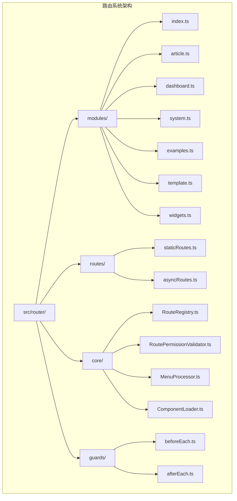
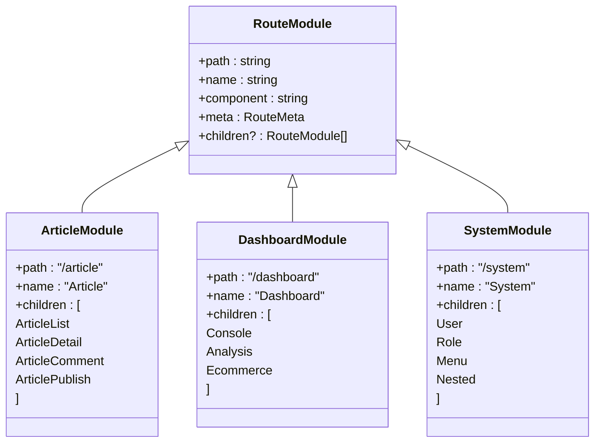
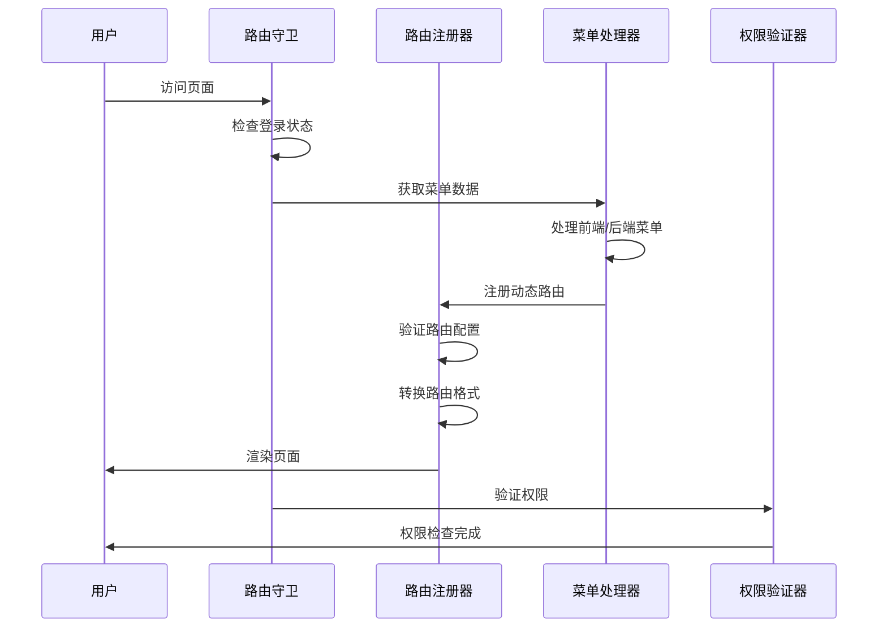
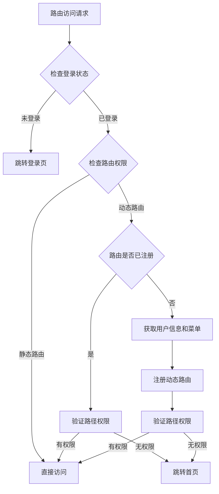
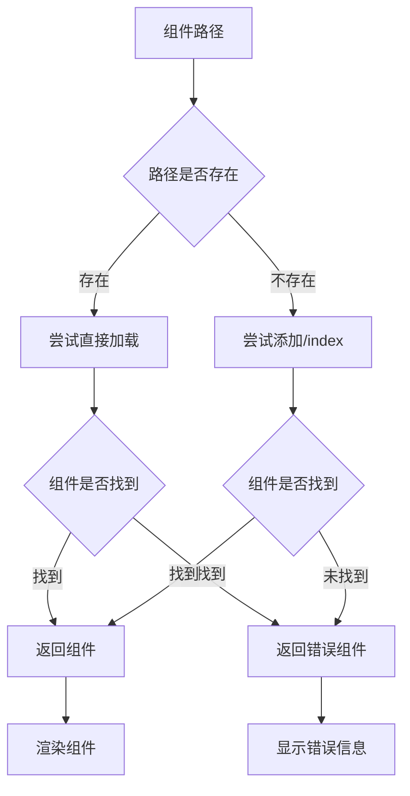

# 路由模块目录

<cite>
**本文档中引用的文件**
- [src/router/modules/index.ts](file://src/router/modules/index.ts)
- [src/router/modules/article.ts](file://src/router/modules/article.ts)
- [src/router/modules/dashboard.ts](file://src/router/modules/dashboard.ts)
- [src/router/modules/system.ts](file://src/router/modules/system.ts)
- [src/router/modules/examples.ts](file://src/router/modules/examples.ts)
- [src/router/modules/template.ts](file://src/router/modules/template.ts)
- [src/router/modules/widgets.ts](file://src/router/modules/widgets.ts)
- [src/router/index.ts](file://src/router/index.ts)
- [src/router/routes/staticRoutes.ts](file://src/router/routes/staticRoutes.ts)
- [src/router/routes/asyncRoutes.ts](file://src/router/routes/asyncRoutes.ts)
- [src/router/routesAlias.ts](file://src/router/routesAlias.ts)
- [src/router/core/RouteRegistry.ts](file://src/router/core/RouteRegistry.ts)
- [src/router/core/RoutePermissionValidator.ts](file://src/router/core/RoutePermissionValidator.ts)
- [src/router/core/MenuProcessor.ts](file://src/router/core/MenuProcessor.ts)
- [src/router/core/ComponentLoader.ts](file://src/router/core/ComponentLoader.ts)
- [src/router/guards/beforeEach.ts](file://src/router/guards/beforeEach.ts)
- [src/types/router/index.ts](file://src/types/router/index.ts)
- [src/utils/router.ts](file://src/utils/router.ts)
</cite>

## 目录
1. [简介](#简介)
2. [项目结构概览](#项目结构概览)
3. [模块化路由设计](#模块化路由设计)
4. [核心模块分析](#核心模块分析)
5. [路由注册机制](#路由注册机制)
6. [权限控制系统](#权限控制系统)
7. [高级特性实现](#高级特性实现)
8. [新增页面流程指南](#新增页面流程指南)
9. [总结](#总结)

## 简介

Art Design Pro 采用了一套高度模块化的路由设计方案，通过将路由配置按功能域拆分到不同的模块文件中，实现了代码的清晰组织和维护性提升。该系统基于 Vue Router 4 构建，提供了完整的动态路由注册、权限控制、菜单生成等功能。

## 项目结构概览

路由系统的核心文件结构如下：



**图表来源**
- [src/router/modules/index.ts](file://src/router/modules/index.ts#L1-L28)
- [src/router/routes/staticRoutes.ts](file://src/router/routes/staticRoutes.ts#L1-L73)
- [src/router/core/RouteRegistry.ts](file://src/router/core/RouteRegistry.ts#L1-L91)

## 模块化路由设计

### 设计理念

路由模块化设计遵循以下原则：

1. **功能域分离**：每个模块专注于特定的功能领域
2. **单一职责**：每个路由模块只负责一组相关的页面
3. **可维护性**：减少单个文件的复杂度，便于维护
4. **扩展性**：易于添加新的功能模块

### 模块组织结构



**图表来源**
- [src/router/modules/article.ts](file://src/router/modules/article.ts#L3-L61)
- [src/router/modules/dashboard.ts](file://src/router/modules/dashboard.ts#L3-L46)
- [src/router/modules/system.ts](file://src/router/modules/system.ts#L3-L150)

**章节来源**
- [src/router/modules/index.ts](file://src/router/modules/index.ts#L1-L28)
- [src/router/modules/article.ts](file://src/router/modules/article.ts#L1-L61)
- [src/router/modules/dashboard.ts](file://src/router/modules/dashboard.ts#L1-L46)
- [src/router/modules/system.ts](file://src/router/modules/system.ts#L1-L150)

## 核心模块分析

### Article 模块 - 文章管理

Article 模块负责文章相关的所有页面，包括文章列表、详情、评论和发布功能。

主要特性：
- **嵌套路由结构**：支持文章详情页的父子关系
- **权限控制**：针对不同操作（新增、编辑）设置细粒度权限
- **缓存策略**：根据页面重要性设置 keepAlive 配置

### Dashboard 模块 - 仪表板

Dashboard 模块包含三个主要的仪表板视图：
- **控制台**：系统概览和快速操作
- **分析**：数据分析和报表
- **电商**：电商相关的业务数据

### System 模块 - 系统管理

System 模块是最复杂的模块，包含用户管理、角色管理、菜单管理和嵌套菜单演示。

特点：
- **多层级权限**：不同功能需要不同角色权限
- **嵌套菜单支持**：支持无限层级的菜单嵌套
- **操作权限**：每个功能都有独立的操作权限控制

**章节来源**
- [src/router/modules/article.ts](file://src/router/modules/article.ts#L3-L61)
- [src/router/modules/dashboard.ts](file://src/router/modules/dashboard.ts#L3-L46)
- [src/router/modules/system.ts](file://src/router/modules/system.ts#L3-L150)

## 路由注册机制

### 动态路由注册流程



**图表来源**
- [src/router/guards/beforeEach.ts](file://src/router/guards/beforeEach.ts#L118-L275)
- [src/router/core/RouteRegistry.ts](file://src/router/core/RouteRegistry.ts#L34-L58)
- [src/router/core/MenuProcessor.ts](file://src/router/core/MenuProcessor.ts#L22-L37)

### RouteRegistry 核心功能

RouteRegistry 是路由注册的核心类，负责：

1. **路由验证**：确保路由配置的正确性
2. **动态注册**：将模块化路由注册到 Vue Router 实例
3. **生命周期管理**：提供路由的注册和注销功能
4. **错误处理**：处理路由注册过程中的各种异常

**章节来源**
- [src/router/core/RouteRegistry.ts](file://src/router/core/RouteRegistry.ts#L1-L91)
- [src/router/guards/beforeEach.ts](file://src/router/guards/beforeEach.ts#L118-L275)

## 权限控制系统

### 权限验证机制



**图表来源**
- [src/router/guards/beforeEach.ts](file://src/router/guards/beforeEach.ts#L132-L181)
- [src/router/core/RoutePermissionValidator.ts](file://src/router/core/RoutePermissionValidator.ts#L35-L46)

### RoutePermissionValidator 功能

RoutePermissionValidator 提供以下核心功能：

1. **路径权限检查**：验证用户是否有访问指定路径的权限
2. **路径集合构建**：将菜单树扁平化为路径集合
3. **前缀匹配**：支持动态路由参数的权限匹配
4. **路径验证**：确保目标路径的有效性

### 菜单处理流程

MenuProcessor 负责菜单数据的处理和过滤：

1. **前端模式**：从本地 asyncRoutes 中获取菜单
2. **后端模式**：从 API 获取菜单数据
3. **角色过滤**：根据用户角色过滤菜单项
4. **路径规范化**：确保路径格式的一致性

**章节来源**
- [src/router/core/RoutePermissionValidator.ts](file://src/router/core/RoutePermissionValidator.ts#L1-L120)
- [src/router/core/MenuProcessor.ts](file://src/router/core/MenuProcessor.ts#L1-L242)

## 高级特性实现

### 组件动态加载

ComponentLoader 实现了智能的组件加载机制：



**图表来源**
- [src/router/core/ComponentLoader.ts](file://src/router/core/ComponentLoader.ts#L23-L42)

### 路由别名系统

路由别名通过 RoutesAlias 枚举统一管理：

- **Layout**：布局容器路径 `/index/index`
- **Login**：登录页面路径 `/auth/login`

### 嵌套路由支持

系统完全支持 Vue Router 的嵌套路由特性：

1. **多层级菜单**：支持无限层级的菜单嵌套
2. **组件继承**：子路由可以继承父路由的组件
3. **路径继承**：子路由路径自动继承父路径

### 懒加载机制

通过动态导入实现组件的懒加载：

- **按需加载**：只有访问页面时才加载对应组件
- **性能优化**：减少初始包大小，提升首屏速度
- **错误处理**：组件加载失败时提供友好的错误提示

**章节来源**
- [src/router/core/ComponentLoader.ts](file://src/router/core/ComponentLoader.ts#L1-L83)
- [src/router/routesAlias.ts](file://src/router/routesAlias.ts#L1-L9)

## 新增页面流程指南

### 步骤 1：创建页面组件

在 `src/views/` 目录下创建对应的 Vue 组件文件。

### 步骤 2：更新路由模块

选择合适的路由模块或创建新模块，在其中添加路由配置：

```typescript
// 示例：在 article.ts 中添加新路由
{
  path: 'new-feature',
  name: 'NewFeature',
  component: '/article/new-feature',
  meta: {
    title: 'menus.article.newFeature',
    icon: 'ri:new-feature-line',
    keepAlive: true,
    roles: ['R_SUPER', 'R_ADMIN']
  }
}
```

### 步骤 3：国际化配置

在 `src/locales/langs/zh.json` 和 `en.json` 中添加对应的菜单标题：

```json
{
  "menus": {
    "article": {
      "newFeature": "新功能"
    }
  }
}
```

### 步骤 4：权限配置

根据页面需求配置相应的权限：

- **角色权限**：通过 `roles` 数组配置
- **操作权限**：通过 `authList` 配置具体操作权限
- **缓存配置**：通过 `keepAlive` 控制页面缓存

### 步骤 5：测试验证

1. 启动应用
2. 验证菜单显示
3. 测试权限控制
4. 检查页面功能

### 最佳实践

1. **命名规范**：保持路由名称和组件名称的一致性
2. **权限设计**：遵循最小权限原则
3. **性能考虑**：合理设置 keepAlive 配置
4. **国际化**：确保所有菜单文本都支持多语言

**章节来源**
- [src/router/modules/article.ts](file://src/router/modules/article.ts#L1-L61)
- [src/router/modules/index.ts](file://src/router/modules/index.ts#L1-L28)

## 总结

Art Design Pro 的路由模块化设计体现了现代前端框架的最佳实践：

1. **模块化架构**：通过功能域拆分降低复杂度
2. **动态路由**：支持运行时的路由注册和权限控制
3. **权限系统**：提供细粒度的角色和操作权限控制
4. **性能优化**：通过懒加载和缓存提升应用性能
5. **开发友好**：提供清晰的新增页面流程和最佳实践

这套路由系统不仅保证了应用的功能完整性，还为后续的功能扩展提供了良好的基础架构。开发者可以通过模块化的设计轻松添加新功能，同时保持代码的整洁和可维护性。