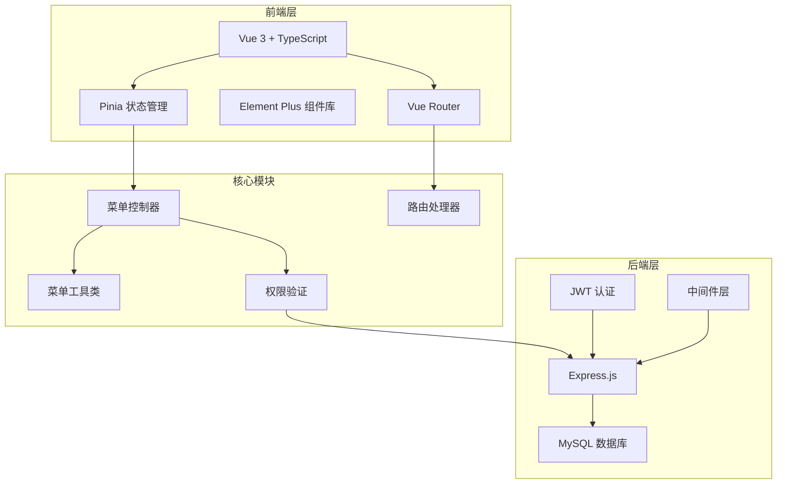
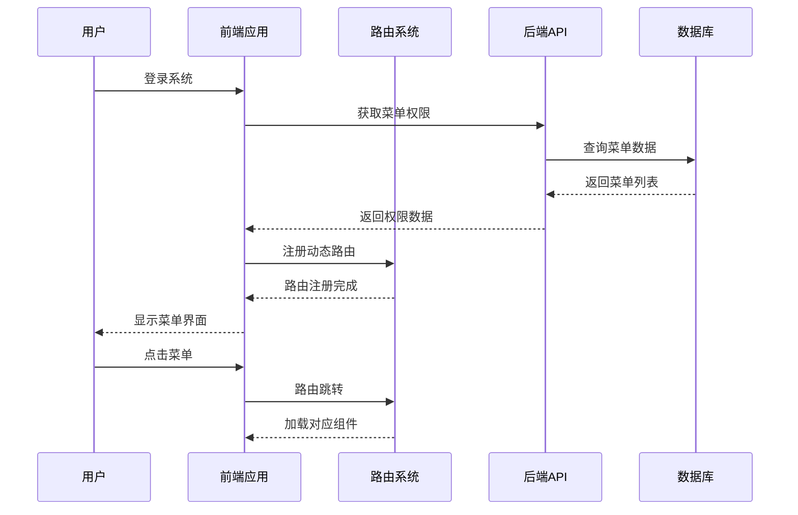
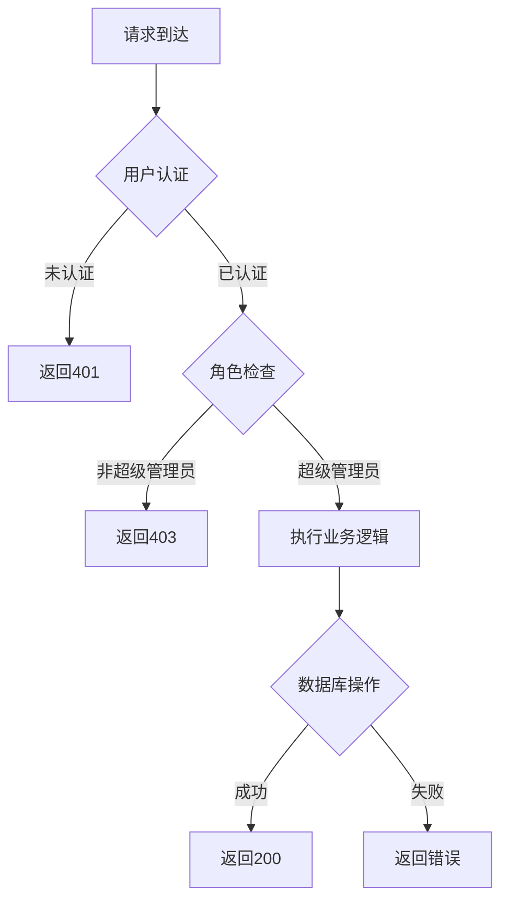
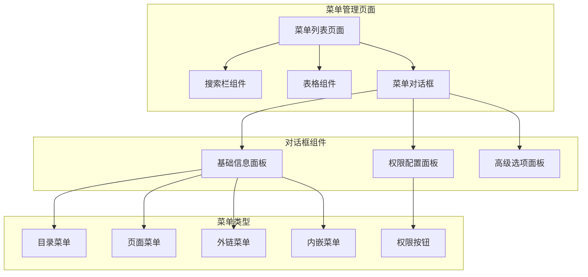
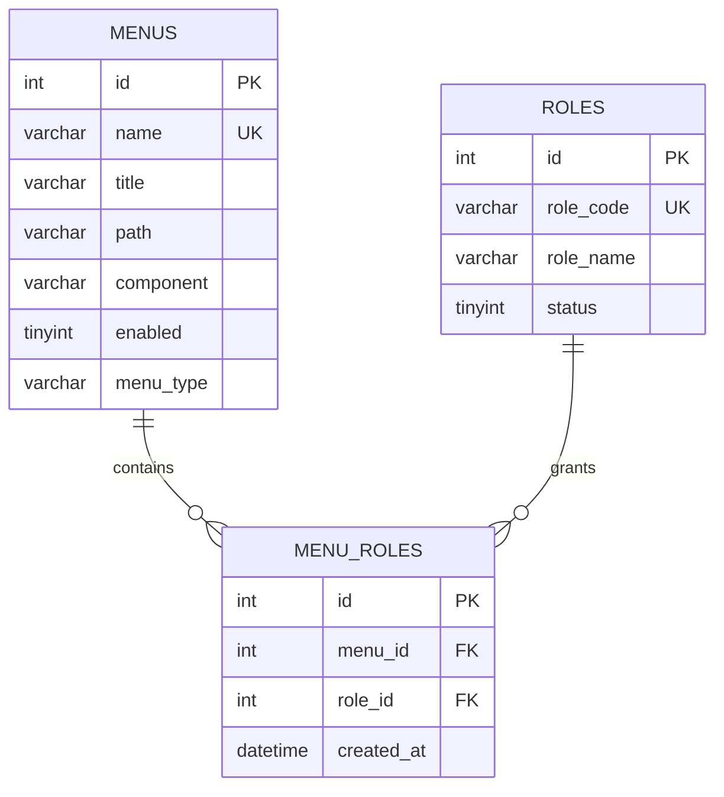
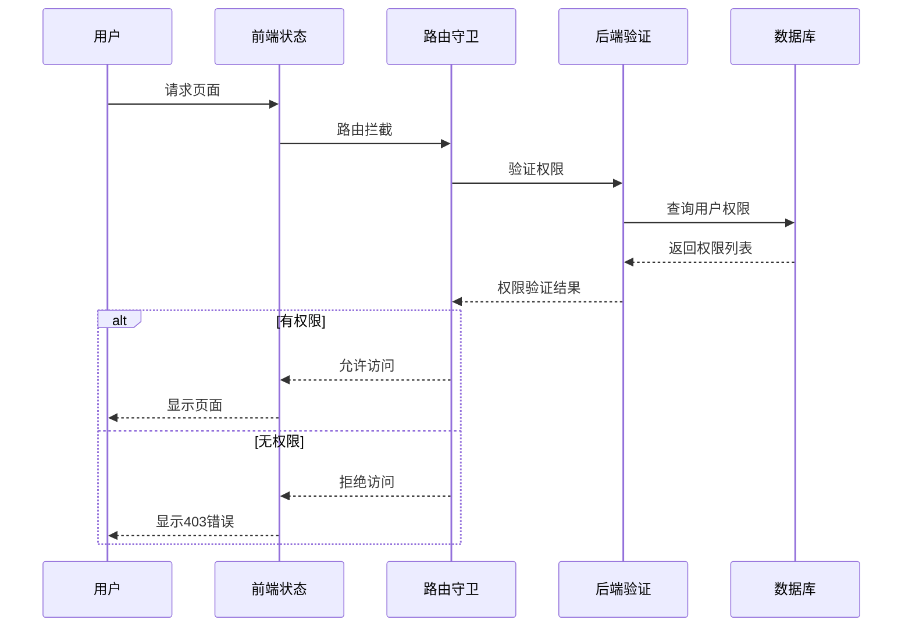
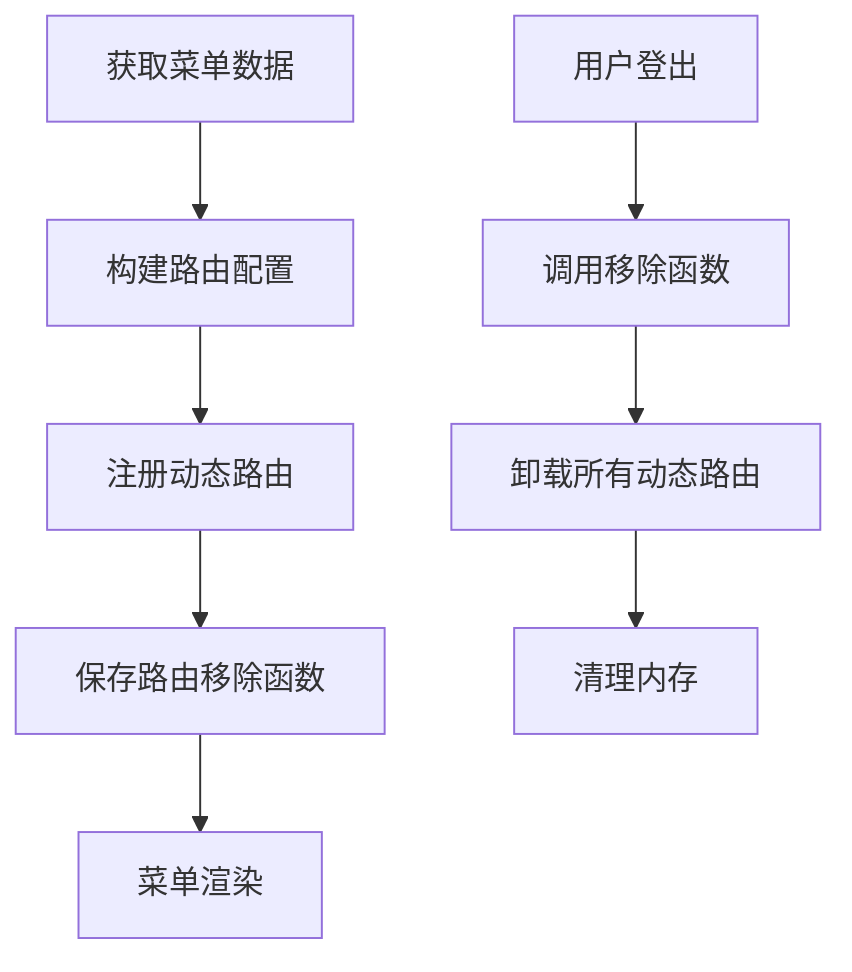
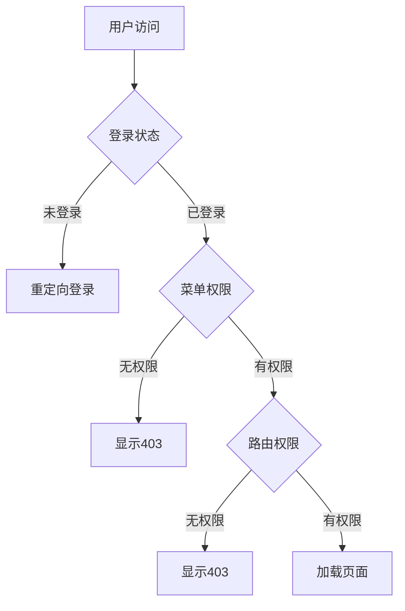

# 菜单管理系统

<cite>
**本文档引用的文件**
- [menu.controller.ts](file://backend/src/controllers/menu.controller.ts) - *更新了权限模型和超级管理员限制*
- [menu.routes.ts](file://backend/src/routes/menu.routes.ts)
- [menu.util.ts](file://backend/src/utils/menu.util.ts)
- [menu.ts](file://src/store/modules/menu.ts)
- [MenuProcessor.ts](file://src/router/core/MenuProcessor.ts)
- [asyncRoutes.ts](file://src/router/routes/asyncRoutes.ts)
- [index.vue](file://src/views/system/menu/index.vue)
- [menu-dialog.vue](file://src/views/system/menu/modules/menu-dialog.vue) - *更新了角色权限配置为roleIds*
- [art-sidebar-menu/index.vue](file://src/components/core/layouts/art-menus/art-sidebar-menu/index.vue)
- [art-horizontal-menu/index.vue](file://src/components/core/layouts/art-menus/art-horizontal-menu/index.vue)
- [system-manage.ts](file://src/api/system-manage.ts) - *更新了API参数类型*
- [useRolePermission.ts](file://src/hooks/core/useRolePermission.ts)
- [init-database.sql](file://scripts/init-database.sql)
- [router/index.ts](file://src/router/index.ts)
- [index.ts](file://src/types/router/index.ts)
- [role.controller.ts](file://backend/src/controllers/role.controller.ts) - *更新了角色权限管理接口*
- [auth.middleware.ts](file://backend/src/middleware/auth.middleware.ts) - *增强了超级管理员权限验证*
- [api.d.ts](file://src/types/api/api.d.ts) - *更新了CreateMenuParams和UpdateMenuParams类型*
</cite>

## 更新摘要

**变更内容**

- 将权限模型从roleCode转换为roleIds，使用角色ID进行权限关联
- 增强超级管理员权限限制，仅R_SUPER角色可进行菜单管理操作
- 更新前端表单和API接口以支持新的权限模型
- 修改数据库查询逻辑，从角色编码匹配改为角色ID匹配
- 更新相关文档和代码注释以反映变更

## 目录

1. [系统概述](#系统概述)
2. [技术架构](#技术架构)
3. [数据库设计](#数据库设计)
4. [后端API设计](#后端api设计)
5. [前端组件架构](#前端组件架构)
6. [菜单权限管理](#菜单权限管理)
7. [动态路由系统](#动态路由系统)
8. [菜单类型与配置](#菜单类型与配置)
9. [权限验证机制](#权限验证机制)
10. [系统集成与使用](#系统集成与使用)
11. [最佳实践](#最佳实践)
12. [故障排除](#故障排除)

## 系统概述

菜单管理系统是一个完整的权限控制解决方案，提供灵活的菜单配置、权限管理和动态路由功能。系统支持多种菜单类型，包括目录菜单、页面菜单、外链菜单、内嵌菜单和权限按钮，并具备完善的前后端权限验证机制。

### 核心特性

- **多层级菜单结构**：支持无限级菜单嵌套，自动构建树形结构
- **灵活的菜单类型**：目录、页面、外链、内嵌、权限按钮等多种类型
- **权限控制**：基于角色ID的细粒度权限管理
- **动态路由**：运行时动态加载和卸载路由
- **前后端分离**：支持前端权限模式和后端权限模式
- **国际化支持**：菜单标题支持国际化
- **响应式设计**：适配多种设备和屏幕尺寸

## 技术架构

### 系统架构图



**图表来源**

- [menu.controller.ts](file://backend/src/controllers/menu.controller.ts#L1-L50)
- [MenuProcessor.ts](file://src/router/core/MenuProcessor.ts#L1-L30)
- [menu.ts](file://src/store/modules/menu.ts#L1-L50)

### 数据流架构



**图表来源**

- [MenuProcessor.ts](file://src/router/core/MenuProcessor.ts#L20-L40)
- [menu.ts](file://src/store/modules/menu.ts#L40-L80)

## 数据库设计

### 菜单表结构

菜单系统的核心数据结构基于MySQL数据库，包含菜单表和菜单角色关联表。

| 字段名 | 类型 | 约束 | 说明 |
| --- | --- | --- | --- |
| id | INT | PRIMARY KEY, AUTO_INCREMENT | 菜单唯一标识符 |
| parent_id | INT | NULLABLE, FOREIGN KEY | 父菜单ID，NULL表示顶级菜单 |
| menu_type | VARCHAR(20) | NOT NULL | 菜单类型：menu-菜单，button-按钮 |
| name | VARCHAR(100) | NOT NULL, UNIQUE | 路由名称，必须唯一 |
| path | VARCHAR(255) | NULLABLE | 路由路径，按钮类型为NULL |
| component | VARCHAR(255) | NULLABLE | 组件路径 |
| title | VARCHAR(100) | NOT NULL | 菜单标题（支持国际化键名） |
| icon | VARCHAR(100) | NULLABLE | 图标名称 |
| sort | INT | NOT NULL, DEFAULT 1 | 排序号，数字越小越靠前 |
| enabled | TINYINT | NOT NULL, DEFAULT 1 | 启用状态：1-启用，0-禁用 |
| is_hide | TINYINT | NOT NULL, DEFAULT 0 | 是否隐藏菜单：1-是，0-否 |
| is_hide_tab | TINYINT | NOT NULL, DEFAULT 0 | 是否隐藏标签页：1-是，0-否 |
| keep_alive | TINYINT | NOT NULL, DEFAULT 0 | 是否缓存页面：1-是，0-否 |
| link | VARCHAR(500) | NULLABLE | 外部链接URL |
| is_iframe | TINYINT | NOT NULL, DEFAULT 0 | 是否内嵌页面：1-是，0-否 |
| show_badge | TINYINT | NOT NULL, DEFAULT 0 | 是否显示徽章：1-是，0-否 |
| show_text_badge | VARCHAR(50) | NULLABLE | 文本徽章内容 |
| fixed_tab | TINYINT | NOT NULL, DEFAULT 0 | 是否固定标签：1-是，0-否 |
| active_path | VARCHAR(255) | NULLABLE | 激活菜单路径 |
| is_full_page | TINYINT | NOT NULL, DEFAULT 0 | 是否全屏页面：1-是，0-否 |
| auth_mark | VARCHAR(100) | NULLABLE | 权限标识（按钮类型使用） |
| created_at | DATETIME | NOT NULL, DEFAULT CURRENT_TIMESTAMP | 创建时间 |
| updated_at | DATETIME | NOT NULL, DEFAULT CURRENT_TIMESTAMP ON UPDATE CURRENT_TIMESTAMP | 更新时间 |
| create_by | INT | NULLABLE, FOREIGN KEY | 创建人ID |
| update_by | INT | NULLABLE, FOREIGN KEY | 更新人ID |

**节来源**

- [init-database.sql](file://scripts/init-database.sql#L95-L132)

### 菜单角色关联表

| 字段名     | 类型     | 约束                                | 说明         |
| ---------- | -------- | ----------------------------------- | ------------ |
| id         | INT      | PRIMARY KEY, AUTO_INCREMENT         | 关联ID，主键 |
| menu_id    | INT      | NOT NULL, FOREIGN KEY               | 菜单ID       |
| role_id    | INT      | NOT NULL, FOREIGN KEY               | 角色ID       |
| created_at | DATETIME | NOT NULL, DEFAULT CURRENT_TIMESTAMP | 创建时间     |

**节来源**

- [init-database.sql](file://scripts/init-database.sql#L139-L148)

## 后端API设计

### 菜单管理API接口

系统提供了完整的RESTful API接口，支持菜单的增删改查操作。

#### GET /api/menus

**功能**：获取菜单列表 **参数**：

- `current` (number, 默认: 1)：当前页码
- `size` (number, 默认: 20)：每页大小
- `menuName` (string)：菜单名称搜索
- `menuPath` (string)：菜单路径搜索
- `menuType` (string)：菜单类型过滤
- `enabled` (boolean)：启用状态过滤
- `returnTree` (boolean, 默认: true)：是否返回树形结构

**响应**：

```typescript
interface MenuResponse {
  code: number
  data: MenuTreeItem[] | PaginatedMenuList
}
```

#### GET /api/menus/:id

**功能**：获取菜单详情 **参数**：

- `id` (number)：菜单ID

**响应**：

```typescript
interface MenuDetailResponse {
  code: number
  data: MenuDetail
}
```

#### POST /api/menus

**功能**：创建菜单 **请求体**：

```typescript
interface CreateMenuParams {
  menuType: 'menu' | 'button'
  name: string
  title: string
  path?: string
  component?: string
  icon?: string
  sort?: number
  enabled?: boolean
  isHide?: boolean
  isHideTab?: boolean
  keepAlive?: boolean
  link?: string
  isIframe?: boolean
  showBadge?: boolean
  showTextBadge?: string
  fixedTab?: boolean
  activePath?: string
  isFullPage?: boolean
  authMark?: string
  roles?: number[] // 角色ID数组，替换原有的roleCode字符串数组
}
```

#### PUT /api/menus/:id

**功能**：更新菜单 **参数**：

- `id` (number)：菜单ID **请求体**：同创建菜单参数

#### DELETE /api/menus/:id

**功能**：删除菜单（级联删除） **参数**：

- `id` (number)：菜单ID

**节来源**

- [menu.controller.ts](file://backend/src/controllers/menu.controller.ts#L18-L387)
- [menu.routes.ts](file://backend/src/routes/menu.routes.ts#L1-L34)

### 权限验证机制

系统实现了严格的权限验证机制，确保只有授权用户才能执行敏感操作。超级管理员权限已增强，仅R_SUPER角色可进行菜单管理操作。



**图表来源**

- [menu.controller.ts](file://backend/src/controllers/menu.controller.ts#L208-L215)

## 前端组件架构

### 菜单管理界面

前端菜单管理界面采用现代化的Vue 3 + TypeScript架构，提供直观的可视化操作体验。

#### 主要组件结构



**图表来源**

- [index.vue](file://src/views/system/menu/index.vue#L1-L50)
- [menu-dialog.vue](file://src/views/system/menu/modules/menu-dialog.vue#L1-L50)

### 菜单渲染组件

系统提供了多种菜单渲染组件，适应不同的布局需求。

#### 侧边栏菜单

侧边栏菜单是最常用的菜单形式，支持折叠、展开和多种主题切换。

**主要特性**：

- 支持水平和垂直两种布局模式
- 自动识别当前激活的菜单项
- 支持多级菜单嵌套
- 响应式设计，适配移动端

#### 水平菜单

水平菜单适用于顶部导航栏，提供简洁的横向菜单展示。

**主要特性**：

- 支持下拉菜单
- 智能隐藏不重要的菜单项
- 支持移动端滑动操作

**节来源**

- [art-sidebar-menu/index.vue](file://src/components/core/layouts/art-menus/art-sidebar-menu/index.vue#L1-L100)
- [art-horizontal-menu/index.vue](file://src/components/core/layouts/art-menus/art-horizontal-menu/index.vue#L1-L50)

## 菜单权限管理

### 权限模型

系统采用基于角色ID的访问控制模型，通过菜单角色关联表实现细粒度的权限控制。权限模型已从基于roleCode的字符串匹配改为基于roleIds的整数ID匹配。



**图表来源**

- [init-database.sql](file://scripts/init-database.sql#L95-L148)

### 权限验证流程



**图表来源**

- [MenuProcessor.ts](file://src/router/core/MenuProcessor.ts#L40-L80)
- [useRolePermission.ts](file://src/hooks/core/useRolePermission.ts#L70-L85)

### 角色权限配置

系统支持灵活的角色权限配置，管理员可以通过图形界面为不同角色分配菜单权限。角色权限配置已更新为使用角色ID数组（roleIds）而非角色编码（roleCode）。

**节来源**

- [role-permission-dialog.vue](file://src/views/system/role/modules/role-permission-dialog.vue#L47-L155)

## 动态路由系统

### 路由注册机制

系统实现了完整的动态路由注册和卸载机制，支持运行时动态加载菜单对应的路由。



**图表来源**

- [MenuProcessor.ts](file://src/router/core/MenuProcessor.ts#L20-L40)
- [menu.ts](file://src/store/modules/menu.ts#L40-L90)

### 路由处理流程

菜单处理器负责处理各种类型的菜单，包括前端权限模式和后端权限模式。

**主要功能**：

- 菜单数据获取和过滤
- 权限验证和过滤
- 路径规范化处理
- 菜单树形结构构建

**节来源**

- [MenuProcessor.ts](file://src/router/core/MenuProcessor.ts#L17-L310)

## 菜单类型与配置

### 菜单类型详解

系统支持多种菜单类型，每种类型都有特定的用途和配置方式。

| 菜单类型 | 说明                 | 路径配置          | 组件配置 | 适用场景       |
| -------- | -------------------- | ----------------- | -------- | -------------- |
| 目录     | 用于组织子菜单的容器 | 留空              | 留空     | 多级菜单组织   |
| 页面     | 独立的功能页面       | 以/开头的绝对路径 | 组件路径 | 功能页面       |
| 外链     | 外部网站链接         | 完整URL           | 留空     | 第三方系统集成 |
| 内嵌     | 嵌入外部页面         | 留空              | 留空     | iframe集成     |
| 权限按钮 | 页面内的操作权限     | 留空              | 留空     | 按钮级权限控制 |

### 菜单配置选项

每个菜单项都支持丰富的配置选项，满足复杂的业务需求。

**基础配置**：

- 菜单名称和标题
- 图标和排序
- 启用状态和可见性
- 缓存和标签页配置

**高级配置**：

- 外部链接和内嵌页面
- 徽章和文本徽章
- 固定标签页
- 全屏页面模式
- 激活路径配置

**节来源**

- [menu-dialog.vue](file://src/views/system/menu/modules/menu-dialog.vue#L160-L260)

## 权限验证机制

### 前端权限验证

系统提供了多层次的前端权限验证机制，确保用户只能访问有权限的资源。



**图表来源**

- [useRolePermission.ts](file://src/hooks/core/useRolePermission.ts#L1-L100)

### 后端权限验证

后端同样实现了严格的权限验证，确保即使前端绕过也能保证安全性。超级管理员权限已增强，仅R_SUPER角色可进行菜单管理操作。

**验证层次**：

1. JWT令牌验证
2. 用户角色验证
3. 菜单权限验证
4. 具体操作权限验证

**节来源**

- [auth.controller.ts](file://backend/src/controllers/auth.controller.ts#L102-L130)

## 系统集成与使用

### 集成步骤

1. **数据库初始化**：执行初始化脚本创建必要的表结构
2. **后端配置**：配置数据库连接和JWT密钥
3. **前端配置**：配置路由和菜单数据源
4. **权限初始化**：创建初始角色和菜单权限

### 使用指南

#### 创建新菜单

1. 进入菜单管理页面
2. 点击"添加菜单"按钮
3. 选择菜单类型
4. 填写基本信息
5. 配置权限选项
6. 保存并测试

#### 配置角色权限

1. 进入角色管理页面
2. 选择目标角色
3. 点击"配置权限"按钮
4. 在菜单树中勾选权限
5. 保存配置

**节来源**

- [system-manage.ts](file://src/api/system-manage.ts#L130-L179)

## 最佳实践

### 菜单设计原则

1. **层次清晰**：合理规划菜单层级，避免过深的嵌套
2. **命名规范**：使用有意义的菜单名称和路由名称
3. **权限最小化**：遵循最小权限原则，只授予必要的权限
4. **性能优化**：合理使用缓存和懒加载机制
5. **用户体验**：提供清晰的菜单分类和搜索功能

### 开发建议

1. **类型安全**：使用TypeScript确保类型安全
2. **错误处理**：完善错误处理和用户反馈
3. **国际化**：支持多语言菜单标题
4. **响应式设计**：确保移动端友好
5. **文档维护**：及时更新相关文档

### 安全考虑

1. **输入验证**：严格验证用户输入
2. **权限检查**：双重权限验证
3. **日志记录**：记录重要操作日志
4. **定期审计**：定期审查权限配置
5. **备份恢复**：定期备份菜单配置

## 故障排除

### 常见问题

#### 菜单不显示

**可能原因**：

- 用户没有相应菜单权限
- 菜单被设置为隐藏
- 路由配置错误

**解决方法**：

1. 检查用户角色权限配置
2. 验证菜单的启用状态
3. 检查路由路径配置

#### 权限验证失败

**可能原因**：

- JWT令牌过期
- 角色权限配置错误
- 后端服务异常

**解决方法**：

1. 重新登录获取新令牌
2. 检查角色权限配置
3. 查看后端服务日志

#### 菜单树形结构异常

**可能原因**：

- 数据库外键约束问题
- 菜单层级关系错误
- 数据同步问题

**解决方法**：

1. 检查数据库外键约束
2. 验证菜单层级关系
3. 重新同步菜单数据

### 调试技巧

1. **浏览器开发者工具**：查看网络请求和响应
2. **控制台日志**：检查JavaScript错误
3. **后端日志**：查看服务器端错误
4. **数据库查询**：直接查询数据库验证数据
5. **权限验证**：使用权限验证工具测试

**节来源**

- [MenuProcessor.ts](file://src/router/core/MenuProcessor.ts#L220-L280)
