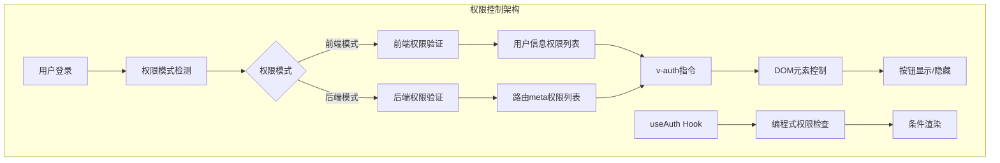
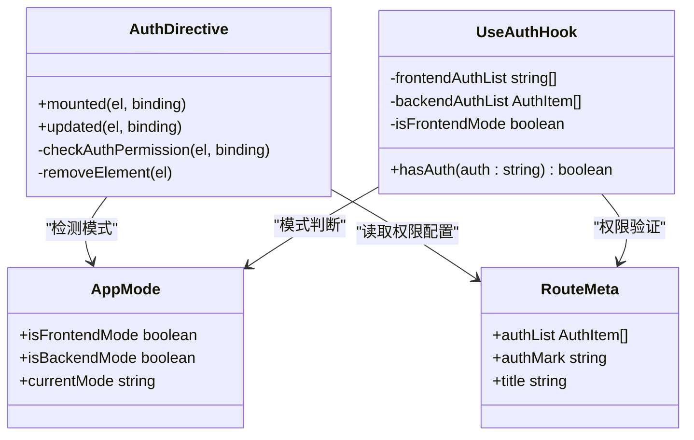
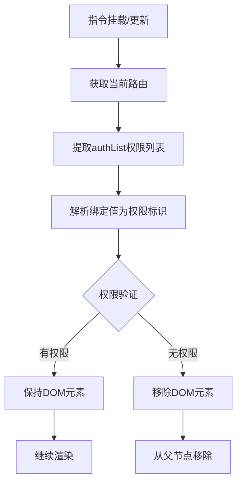
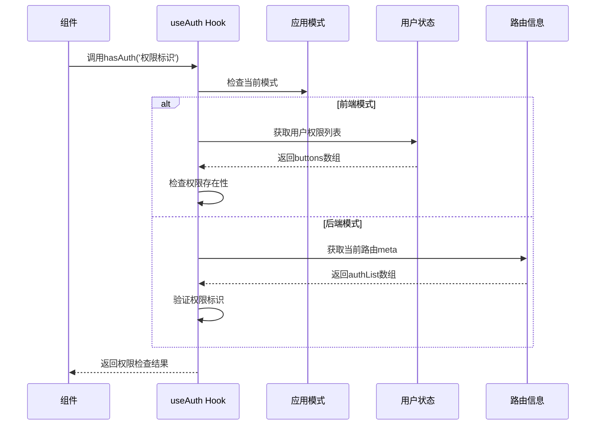
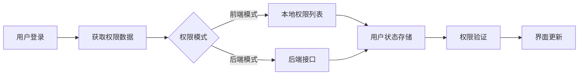

# 按钮权限控制详细文档

<cite>
**本文档引用的文件**
- [src/directives/core/auth.ts](file://src/directives/core/auth.ts)
- [src/hooks/core/useAuth.ts](file://src/hooks/core/useAuth.ts)
- [src/hooks/core/useAppMode.ts](file://src/hooks/core/useAppMode.ts)
- [src/views/examples/permission/button-auth/index.vue](file://src/views/examples/permission/button-auth/index.vue)
- [src/router/modules/examples.ts](file://src/router/modules/examples.ts)
- [src/types/router/index.ts](file://src/types/router/index.ts)
- [src/store/modules/user.ts](file://src/store/modules/user.ts)
- [src/directives/index.ts](file://src/directives/index.ts)
- [src/main.ts](file://src/main.ts)
</cite>

## 目录
1. [简介](#简介)
2. [系统架构](#系统架构)
3. [核心组件分析](#核心组件分析)
4. [权限模式详解](#权限模式详解)
5. [v-auth指令实现](#v-auth指令实现)
6. [useAuth组合式函数](#useauth组合式函数)
7. [权限配置与管理](#权限配置与管理)
8. [最佳实践](#最佳实践)
9. [性能优化](#性能优化)
10. [常见问题解决](#常见问题解决)
11. [总结](#总结)

## 简介

Art Design Pro 提供了一套完整的按钮级别权限控制系统，支持前端模式和后端模式两种权限验证方式。该系统通过 `v-auth` 指令和 `useAuth` 组合式函数，实现了细粒度的操作权限控制，确保用户只能看到和操作自己有权限的功能。

### 主要特性

- **双模式支持**：兼容前端模式和后端模式的权限验证
- **细粒度控制**：基于权限标识的按钮级权限控制
- **响应式更新**：权限变化时自动更新界面状态
- **DOM优化**：无权限时直接移除DOM元素，而非简单隐藏
- **灵活配置**：支持多种权限配置方式和验证策略

## 系统架构



**图表来源**
- [src/hooks/core/useAuth.ts](file://src/hooks/core/useAuth.ts#L43-L74)
- [src/directives/core/auth.ts](file://src/directives/core/auth.ts#L42-L68)

## 核心组件分析

### 权限指令系统

系统的核心是一个基于Vue指令的权限控制机制，主要包含以下组件：



**图表来源**
- [src/directives/core/auth.ts](file://src/directives/core/auth.ts#L61-L68)
- [src/hooks/core/useAuth.ts](file://src/hooks/core/useAuth.ts#L43-L74)
- [src/hooks/core/useAppMode.ts](file://src/hooks/core/useAppMode.ts#L20-L45)

**章节来源**
- [src/directives/core/auth.ts](file://src/directives/core/auth.ts#L1-L69)
- [src/hooks/core/useAuth.ts](file://src/hooks/core/useAuth.ts#L1-L75)

## 权限模式详解

系统支持两种不同的权限控制模式，每种模式适用于不同的应用场景：

### 前端模式（Frontend Mode）

前端模式适用于小型项目或演示环境，权限由前端路由配置控制。

**特点：**
- 权限配置在前端路由中定义
- 用户信息中包含按钮权限列表
- 无需后端接口验证
- 适合静态权限管理

**权限配置示例：**
```typescript
// 用户信息中的权限列表
info.value = {
  buttons: ['add', 'edit', 'delete', 'export']
}
```

### 后端模式（Backend Mode）

后端模式适用于企业级应用，权限由后端接口返回的菜单数据控制。

**特点：**
- 权限配置在路由meta中定义
- 基于路由权限列表进行验证
- 需要后端接口支持
- 适合动态权限管理

**权限配置示例：**
```typescript
// 路由meta中的权限配置
meta: {
  authList: [
    { title: '新增', authMark: 'add' },
    { title: '编辑', authMark: 'edit' },
    { title: '删除', authMark: 'delete' }
  ]
}
```

**章节来源**
- [src/hooks/core/useAppMode.ts](file://src/hooks/core/useAppMode.ts#L1-L46)
- [src/views/examples/permission/button-auth/index.vue](file://src/views/examples/permission/button-auth/index.vue#L198-L227)

## v-auth指令实现

### 指令核心逻辑

`v-auth` 指令是系统中最核心的权限控制组件，它基于路由meta中的权限列表验证用户权限，并直接控制DOM元素的显示和隐藏。

#### 实现原理



**图表来源**
- [src/directives/core/auth.ts](file://src/directives/core/auth.ts#L42-L68)

#### 关键函数分析

**checkAuthPermission函数：**
- **功能**：验证用户是否具有指定权限
- **实现**：从当前路由的meta.authList中查找匹配的权限标识
- **响应式**：在指令的mounted和updated生命周期中都会执行

**removeElement函数：**
- **功能**：安全地从DOM树中移除元素
- **实现**：检查父节点存在性，避免空指针异常
- **作用**：确保无权限时元素被彻底移除

#### 使用示例

```vue
<!-- 基础用法 -->
<el-button v-auth="'add'">新增</el-button>
<el-button v-auth="'edit'">编辑</el-button>
<el-button v-auth="'delete'">删除</el-button>

<!-- 条件渲染 -->
<div v-if="hasAuth('config')">
  <el-button v-auth="'export'">导出</el-button>
</div>
```

**章节来源**
- [src/directives/core/auth.ts](file://src/directives/core/auth.ts#L1-L69)

## useAuth组合式函数

### 函数设计

`useAuth` 是一个提供统一权限验证功能的组合式函数，支持前端和后端两种权限模式。

#### 核心功能



**图表来源**
- [src/hooks/core/useAuth.ts](file://src/hooks/core/useAuth.ts#L56-L74)

#### 权限验证逻辑

**前端模式验证：**
- 从用户信息的 `buttons` 字段获取权限列表
- 使用 `includes` 方法检查权限存在性
- 性能高效，适合频繁调用

**后端模式验证：**
- 从当前路由的 `meta.authList` 获取权限配置
- 使用 `some` 方法查找匹配的权限标识
- 支持复杂的权限配置结构

#### 编程式权限控制

```typescript
// 基础权限检查
const { hasAuth } = useAuth()

if (hasAuth('add')) {
  // 显示新增按钮
}

// 条件渲染
<template>
  <el-button v-if="hasAuth('edit')">编辑</el-button>
  <el-button v-if="hasAuth('delete')">删除</el-button>
</template>

// 动态功能控制
const dynamicFeatureEnabled = ref(hasAuth('config'))
```

**章节来源**
- [src/hooks/core/useAuth.ts](file://src/hooks/core/useAuth.ts#L1-L75)

## 权限配置与管理

### 路由权限配置

权限配置主要通过路由的meta字段实现，支持两种配置方式：

#### 前端权限配置

```typescript
// 用户信息中的权限列表配置
interface UserInfo {
  buttons: string[] // 权限标识数组
  roles: string[]  // 角色标识数组
  permissions: string[] // 权限码数组
}
```

#### 后端权限配置

```typescript
// 路由meta中的权限配置
interface RouteMeta {
  authList?: Array<{
    title: string    // 权限名称
    authMark: string // 权限标识
  }>
}
```

### 权限标识规范

为了确保权限系统的可维护性和一致性，建议遵循以下命名规范：

| 权限类型 | 命名规则 | 示例 |
|---------|---------|------|
| CRUD操作 | `{动词}` | add, edit, delete, view |
| 功能模块 | `{模块}_{功能}` | user_manage, order_export |
| 系统功能 | `{功能}` | config, backup, restore |
| 特殊权限 | `{特殊}_权限` | super_admin, readonly |

### 权限数据流



**图表来源**
- [src/store/modules/user.ts](file://src/store/modules/user.ts#L62-L82)

**章节来源**
- [src/router/modules/examples.ts](file://src/router/modules/examples.ts#L39-L46)
- [src/types/router/index.ts](file://src/types/router/index.ts#L49-L52)

## 最佳实践

### 1. 权限设计原则

**最小权限原则：**
- 用户只获得完成任务所需的最小权限
- 避免过度授权导致的安全风险
- 定期审查和调整权限配置

**权限分离：**
- 将不同类型的权限分开管理
- 避免单一权限包含过多功能
- 支持细粒度的权限控制

### 2. 组件开发最佳实践

**指令使用规范：**
```vue
<!-- 推荐：明确的权限标识 -->
<el-button v-auth="'add'">新增</el-button>

<!-- 不推荐：复杂的条件判断 -->
<el-button v-if="userInfo.buttons.includes('add')">新增</el-button>

<!-- 推荐：结合useAuth进行复杂逻辑 -->
<template v-if="hasAuth('edit') && !isReadOnly">
  <el-button>编辑</el-button>
</template>
```

**权限检查时机：**
- 在组件挂载时进行权限检查
- 使用计算属性缓存权限结果
- 避免在事件处理器中重复检查权限

### 3. 性能优化策略

**权限缓存：**
- 缓存用户的权限列表，避免重复查询
- 使用响应式数据结构，自动更新界面
- 实现权限变更的实时同步

**DOM优化：**
- 无权限时直接移除DOM元素，减少内存占用
- 避免大量隐藏元素影响页面性能
- 合理使用v-if vs v-show

### 4. 错误处理与降级

**权限验证失败处理：**
```typescript
// 安全的权限检查
const safeHasAuth = (auth: string): boolean => {
  try {
    return hasAuth(auth)
  } catch (error) {
    console.warn('权限检查失败:', error)
    return false // 默认拒绝访问
  }
}
```

**网络异常处理：**
- 实现权限数据的本地缓存
- 提供离线模式下的默认权限
- 网络恢复后的权限数据同步

## 性能优化

### 1. 权限检查优化

**计算属性缓存：**
```typescript
// 缓存权限检查结果
const canEdit = computed(() => hasAuth('edit'))
const canDelete = computed(() => hasAuth('delete'))
```

**批量权限检查：**
```typescript
// 批量检查多个权限
const checkMultiplePermissions = (permissions: string[]): boolean[] => {
  return permissions.map(p => hasAuth(p))
}
```

### 2. DOM操作优化

**指令层面优化：**
- 在指令的mounted和updated钩子中执行权限检查
- 避免不必要的DOM操作
- 使用MutationObserver监听DOM变化

**组件层面优化：**
- 合理使用v-if vs v-show
- 避免频繁的权限检查触发重渲染
- 使用keep-alive缓存权限相关的组件

### 3. 内存管理

**事件监听器清理：**
```typescript
// 确保清理不需要的监听器
onUnmounted(() => {
  // 清理权限相关的事件监听
})
```

**响应式数据优化：**
- 避免创建过多的响应式引用
- 合理使用readonly保护权限数据
- 及时清理不再使用的权限缓存

## 常见问题解决

### 1. 权限检查不生效

**问题现象：**
- 使用v-auth指令但按钮仍然显示
- 权限检查返回错误结果

**解决方案：**
```typescript
// 检查权限模式配置
console.log('当前权限模式:', isFrontendMode.value ? '前端模式' : '后端模式')

// 检查权限配置
console.log('路由权限配置:', route.meta.authList)
console.log('用户权限列表:', userStore.info?.buttons)

// 检查指令注册
// 确保在main.ts中正确注册了全局指令
```

### 2. 权限变更不更新界面

**问题现象：**
- 用户权限变更后界面没有更新
- 权限状态显示不一致

**解决方案：**
```typescript
// 确保权限数据是响应式的
const { hasAuth } = useAuth()

// 使用计算属性确保响应式更新
const permissions = computed(() => ({
  add: hasAuth('add'),
  edit: hasAuth('edit'),
  delete: hasAuth('delete')
}))

// 在权限变更后强制更新
watch(() => userStore.info, () => {
  // 强制重新渲染相关组件
})
```

### 3. 权限继承问题

**问题现象：**
- 子路由权限不继承父路由权限
- 权限配置重复

**解决方案：**
```typescript
// 路由配置中合理组织权限关系
const parentRoute = {
  meta: {
    authList: [
      { authMark: 'parent_view' },
      { authMark: 'parent_config' }
    ]
  }
}

const childRoute = {
  meta: {
    authList: [
      { authMark: 'child_add' },
      { authMark: 'child_edit' }
      // 子路由可以添加额外权限
    ]
  }
}
```

### 4. 细粒度权限管理

**问题场景：**
- 需要更细粒度的权限控制
- 不同用户组有不同的权限组合

**解决方案：**
```typescript
// 实现权限组合逻辑
const hasAnyPermission = (permissions: string[]): boolean => {
  return permissions.some(p => hasAuth(p))
}

const hasAllPermissions = (permissions: string[]): boolean => {
  return permissions.every(p => hasAuth(p))
}

// 使用组合权限
const canManageUsers = hasAllPermissions(['user_view', 'user_edit', 'user_delete'])
const canEditContent = hasAnyPermission(['content_edit', 'content_publish'])
```

### 5. 权限调试工具

**开发阶段的权限调试：**
```typescript
// 添加权限调试辅助函数
const debugPermission = (auth: string, context?: string) => {
  const hasPerm = hasAuth(auth)
  console.group(`权限检查 - ${context || auth}`)
  console.log('权限标识:', auth)
  console.log('是否有权限:', hasPerm)
  console.log('当前模式:', isFrontendMode.value ? '前端' : '后端')
  console.log('权限详情:', {
    frontend: frontendAuthList,
    backend: backendAuthList
  })
  console.groupEnd()
  return hasPerm
}
```

## 总结

Art Design Pro 的按钮权限控制系统提供了完整而灵活的权限管理解决方案。通过 `v-auth` 指令和 `useAuth` 组合式函数，系统实现了从前端到后端的全方位权限控制。

### 核心优势

1. **双模式支持**：适应不同规模项目的权限管理需求
2. **细粒度控制**：基于权限标识的精确控制
3. **响应式更新**：权限变化时自动更新界面
4. **性能优化**：DOM优化和缓存策略
5. **易于使用**：简洁的API设计和丰富的示例

### 应用建议

- 根据项目规模选择合适的权限模式
- 遵循权限设计原则，确保系统的安全性和可维护性
- 合理使用指令和组合式函数，平衡开发效率和性能
- 建立完善的权限测试和调试机制
- 定期审查和优化权限配置

通过合理运用这套权限控制系统，开发者可以构建出既安全又易用的权限管理功能，为用户提供良好的使用体验。