# 权限管理

<cite>
**本文档引用文件**  
- [auth.ts](file://src/directives/core/auth.ts)
- [roles.ts](file://src/directives/core/roles.ts)
- [beforeEach.ts](file://src/router/guards/beforeEach.ts)
- [useAuth.ts](file://src/hooks/core/useAuth.ts)
- [user.ts](file://src/store/modules/user.ts)
- [index.ts](file://src/types/router/index.ts)
- [asyncRoutes.ts](file://src/router/routes/asyncRoutes.ts)
- [useAppMode.ts](file://src/hooks/core/useAppMode.ts)
- [RoutePermissionValidator.ts](file://src/router/core/RoutePermissionValidator.ts)
- [button-auth/index.vue](file://src/views/examples/permission/button-auth/index.vue)
- [page-visibility/index.vue](file://src/views/examples/permission/page-visibility/index.vue)
- [switch-role/index.vue](file://src/views/examples/permission/switch-role/index.vue)
- [role/index.vue](file://src/views/system/role/index.vue)
- [user/index.vue](file://src/views/system/user/index.vue)
</cite>

## 目录
1. [引言](#引言)
2. [权限系统架构](#权限系统架构)
3. [核心权限类型](#核心权限类型)
4. [自定义指令实现](#自定义指令实现)
5. [路由守卫权限验证](#路由守卫权限验证)
6. [权限配置指南](#权限配置指南)
7. [最佳实践与高级话题](#最佳实践与高级话题)
8. [常见问题解决方案](#常见问题解决方案)
9. [总结](#总结)

## 引言

权限管理系统是现代Web应用的核心安全组件，负责控制用户对系统资源的访问权限。本系统实现了基于角色的访问控制（RBAC）机制，支持路由权限、按钮权限和页面可见性控制三种主要权限类型。系统通过自定义指令、路由守卫和状态管理相结合的方式，提供了灵活且安全的权限控制解决方案。

**Section sources**
- [beforeEach.ts](file://src/router/guards/beforeEach.ts#L1-L361)
- [user.ts](file://src/store/modules/user.ts#L1-L236)

## 权限系统架构

本权限管理系统采用分层架构设计，包含前端控制层、路由控制层和状态管理层三个核心部分。系统支持前端模式和后端模式两种权限控制方式，通过环境变量VITE_ACCESS_MODE进行配置。

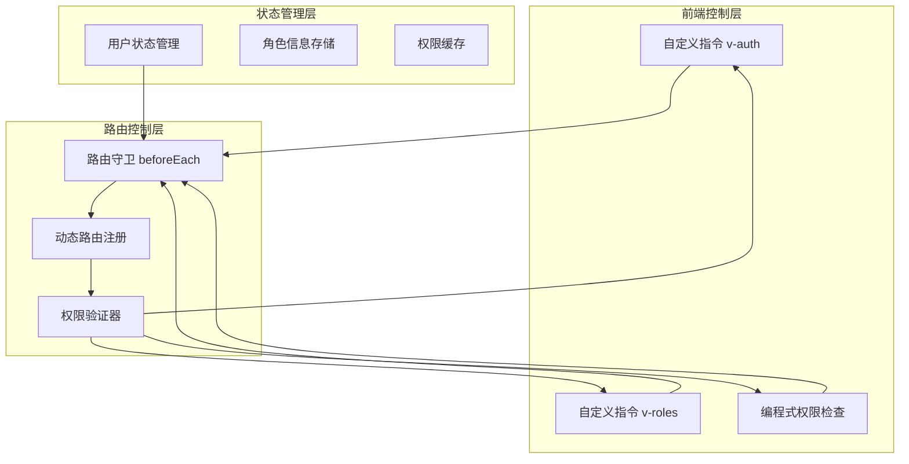

**Diagram sources**
- [beforeEach.ts](file://src/router/guards/beforeEach.ts#L1-L361)
- [auth.ts](file://src/directives/core/auth.ts#L1-L69)
- [roles.ts](file://src/directives/core/roles.ts#L1-L90)
- [user.ts](file://src/store/modules/user.ts#L1-L236)

**Section sources**
- [beforeEach.ts](file://src/router/guards/beforeEach.ts#L1-L361)
- [useAppMode.ts](file://src/hooks/core/useAppMode.ts#L1-L46)

## 核心权限类型

### 路由权限

路由权限控制用户对特定页面的访问能力。系统通过路由元数据中的roles字段定义访问权限，只有拥有指定角色的用户才能访问相应页面。在后端模式下，权限由后端接口返回的菜单列表控制，前端根据用户权限动态注册路由。

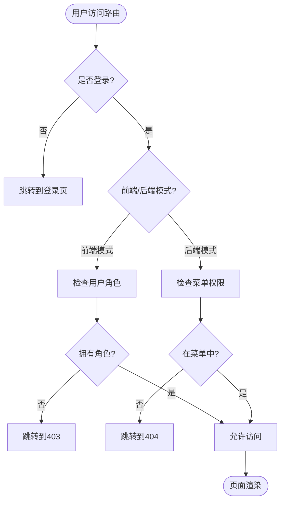

**Diagram sources**
- [beforeEach.ts](file://src/router/guards/beforeEach.ts#L1-L361)
- [RoutePermissionValidator.ts](file://src/router/core/RoutePermissionValidator.ts#L1-L120)

**Section sources**
- [beforeEach.ts](file://src/router/guards/beforeEach.ts#L1-L361)
- [page-visibility/index.vue](file://src/views/examples/permission/page-visibility/index.vue#L1-L256)

### 按钮权限

按钮权限控制界面元素的显示和交互能力。系统提供v-auth指令和hasAuth方法两种方式实现按钮级权限控制。v-auth指令根据权限标识直接从DOM中移除无权限的元素，而hasAuth方法提供编程式权限检查能力。

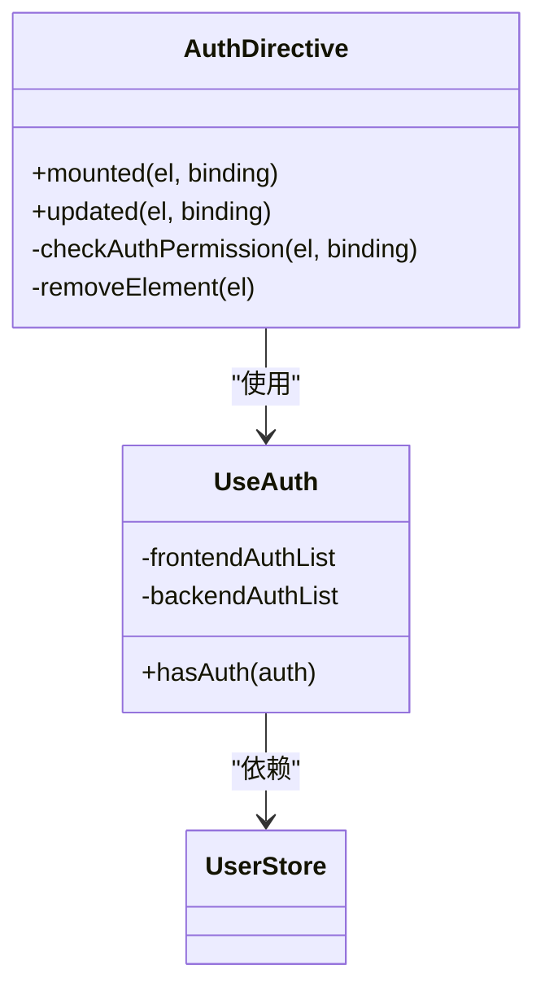

**Diagram sources**
- [auth.ts](file://src/directives/core/auth.ts#L1-L69)
- [useAuth.ts](file://src/hooks/core/useAuth.ts#L1-L75)
- [user.ts](file://src/store/modules/user.ts#L1-L236)

**Section sources**
- [auth.ts](file://src/directives/core/auth.ts#L1-L69)
- [useAuth.ts](file://src/hooks/core/useAuth.ts#L1-L75)
- [button-auth/index.vue](file://src/views/examples/permission/button-auth/index.vue#L1-L530)

### 页面可见性控制

页面可见性控制决定了用户能否看到特定的页面内容。系统通过路由守卫和菜单数据双重验证确保页面访问安全。前端模式下，权限由路由配置中的roles字段控制；后端模式下，权限由后端返回的菜单列表决定。

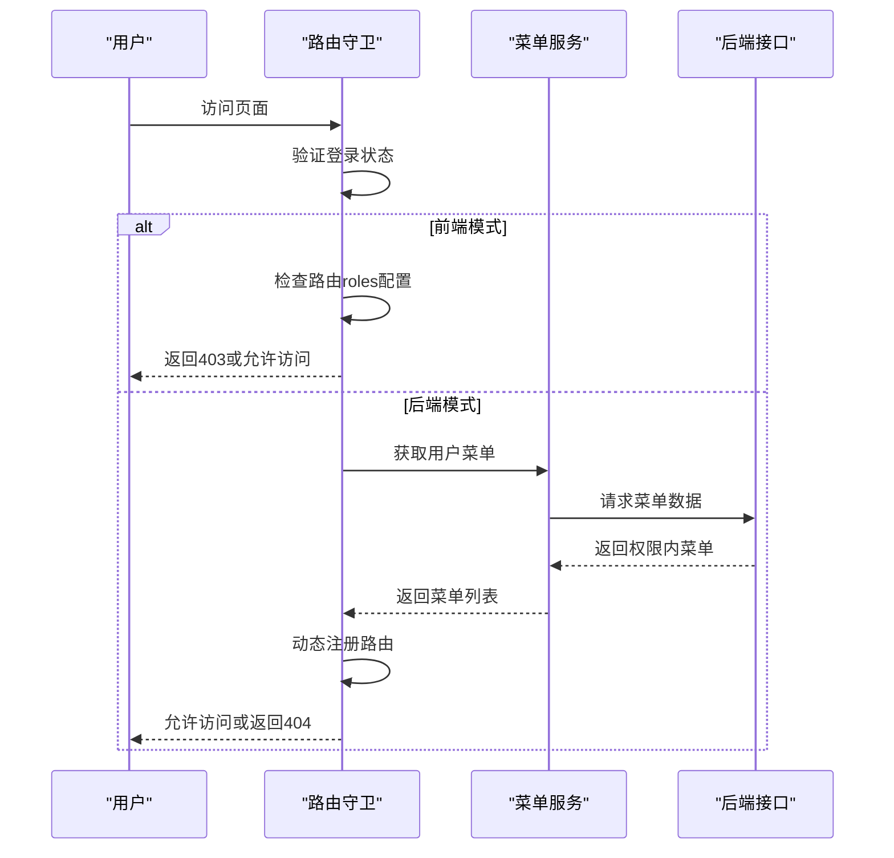

**Diagram sources**
- [beforeEach.ts](file://src/router/guards/beforeEach.ts#L1-L361)
- [RoutePermissionValidator.ts](file://src/router/core/RoutePermissionValidator.ts#L1-L120)

**Section sources**
- [beforeEach.ts](file://src/router/guards/beforeEach.ts#L1-L361)
- [page-visibility/index.vue](file://src/views/examples/permission/page-visibility/index.vue#L1-L256)

## 自定义指令实现

### auth指令

v-auth指令用于实现基于权限标识的细粒度权限控制。该指令在后端模式下工作，根据当前路由meta中的authList配置验证用户权限。如果用户没有对应权限，指令会直接从DOM中移除元素，而非简单隐藏。

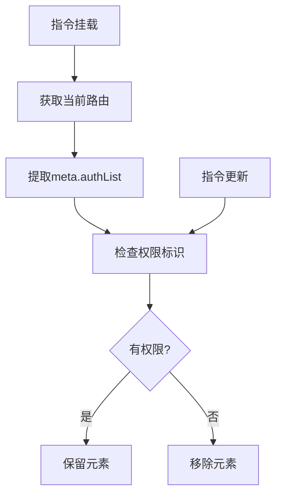

**Diagram sources**
- [auth.ts](file://src/directives/core/auth.ts#L1-L69)

**Section sources**
- [auth.ts](file://src/directives/core/auth.ts#L1-L69)

### roles指令

v-roles指令基于用户角色控制元素的显示。支持单个角色或多个角色（满足其一即可）的权限检查。该指令适用于基于角色的粗粒度权限控制场景，如管理员功能区域的显示控制。

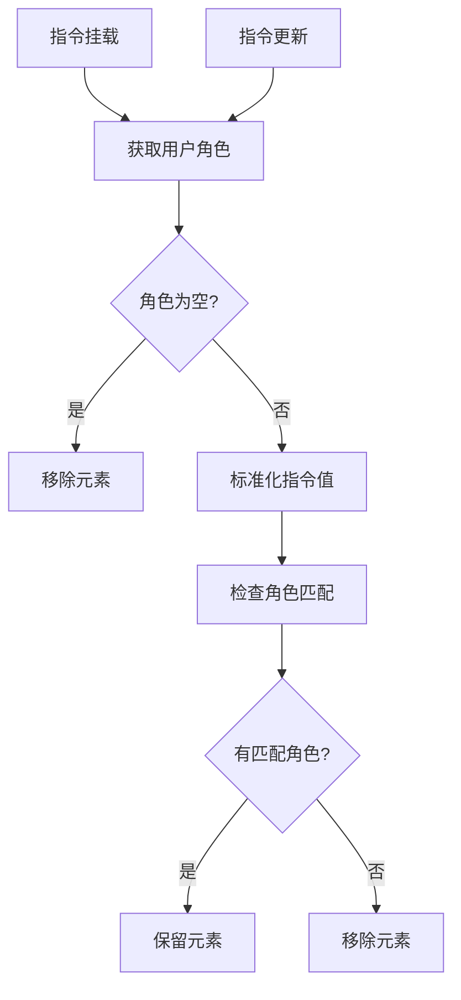

**Diagram sources**
- [roles.ts](file://src/directives/core/roles.ts#L1-L90)

**Section sources**
- [roles.ts](file://src/directives/core/roles.ts#L1-L90)

## 路由守卫权限验证

### 验证流程

路由守卫beforeEach.ts实现了完整的权限验证流程，包括登录状态检查、动态路由注册、权限匹配等关键步骤。守卫在路由跳转前执行，确保用户只能访问其权限范围内的页面。

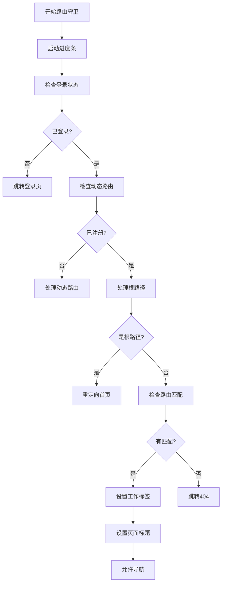

**Diagram sources**
- [beforeEach.ts](file://src/router/guards/beforeEach.ts#L1-L361)

**Section sources**
- [beforeEach.ts](file://src/router/guards/beforeEach.ts#L1-L361)

### 权限匹配逻辑

权限匹配逻辑通过RoutePermissionValidator类实现，支持精确匹配和前缀匹配两种方式。系统首先构建用户可访问的菜单路径集合，然后检查目标路径是否在集合中或是否匹配某个路径前缀。

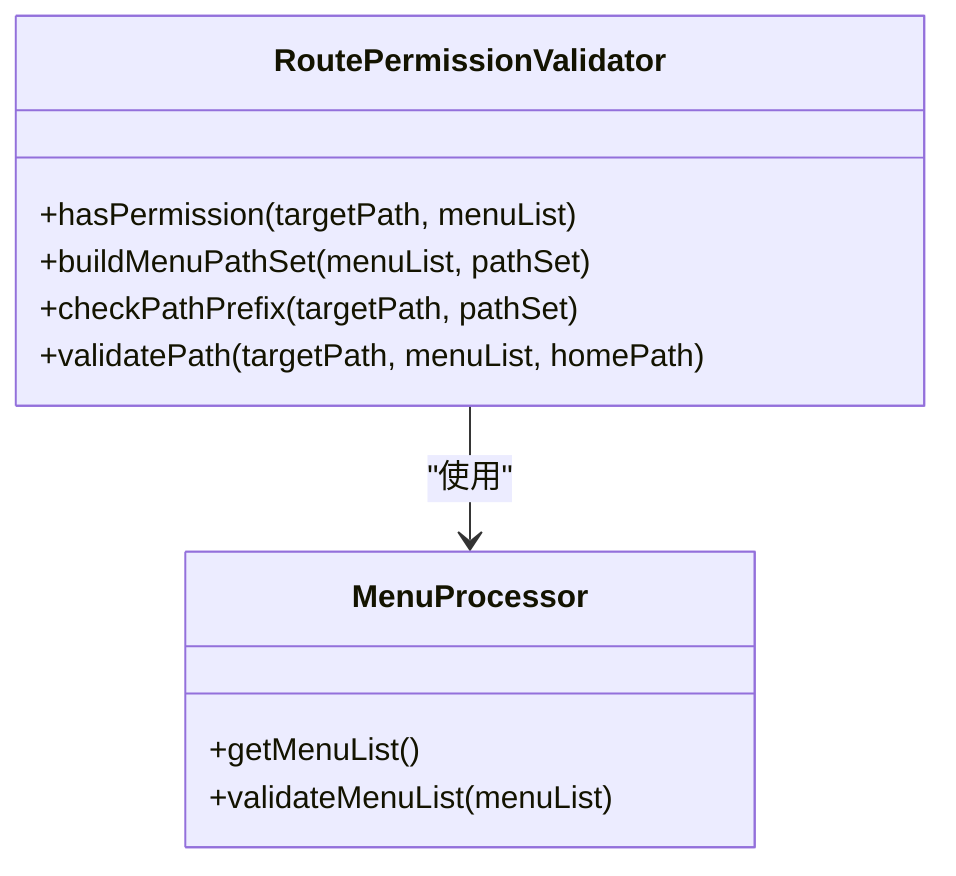

**Diagram sources**
- [RoutePermissionValidator.ts](file://src/router/core/RoutePermissionValidator.ts#L1-L120)
- [beforeEach.ts](file://src/router/guards/beforeEach.ts#L1-L361)

**Section sources**
- [RoutePermissionValidator.ts](file://src/router/core/RoutePermissionValidator.ts#L1-L120)
- [beforeEach.ts](file://src/router/guards/beforeEach.ts#L1-L361)

## 权限配置指南

### 定义权限规则

权限规则通过路由元数据进行定义。在types/router/index.ts中，RouteMeta接口定义了authList和roles等权限相关字段。开发者可以在路由配置中设置这些字段来定义页面的访问权限。

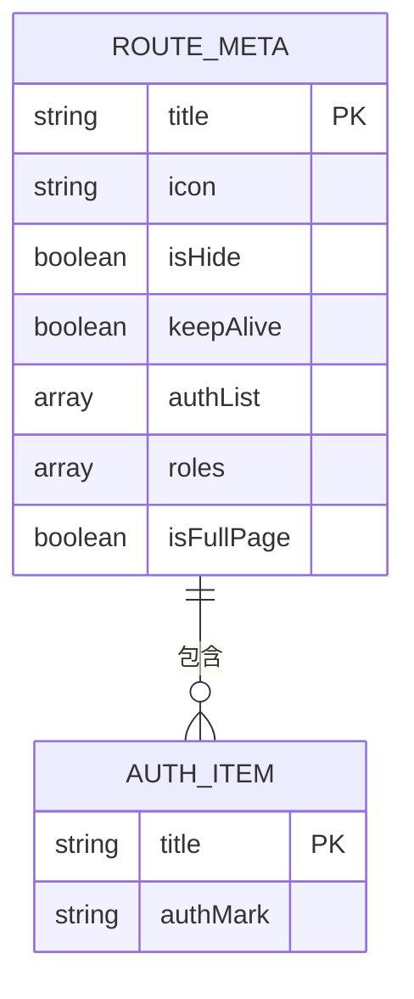

**Diagram sources**
- [index.ts](file://src/types/router/index.ts#L1-L81)

**Section sources**
- [index.ts](file://src/types/router/index.ts#L1-L81)

### 分配角色权限

角色权限通过系统管理模块进行分配。在role/index.vue中，系统提供了角色管理界面，支持创建、编辑和删除角色，并为角色分配菜单权限。用户管理界面user/index.vue则用于将用户与角色关联。

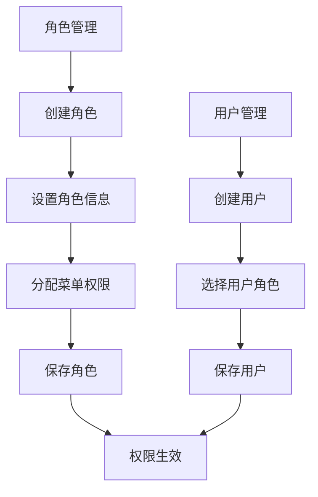

**Diagram sources**
- [role/index.vue](file://src/views/system/role/index.vue#L1-L243)
- [user/index.vue](file://src/views/system/user/index.vue#L1-L262)

**Section sources**
- [role/index.vue](file://src/views/system/role/index.vue#L1-L243)
- [user/index.vue](file://src/views/system/user/index.vue#L1-L262)

### 组件中使用权限控制

在组件中使用权限控制有多种方式。可以通过v-auth和v-roles指令控制元素显示，也可以通过useAuth钩子进行编程式权限检查。系统还提供了权限切换演示页面，方便开发者测试不同权限场景。

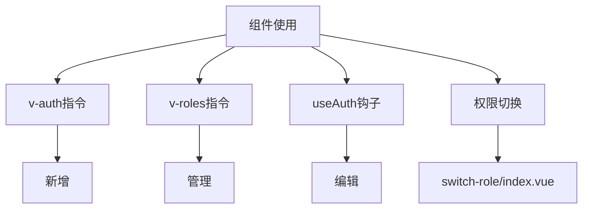

**Diagram sources**
- [button-auth/index.vue](file://src/views/examples/permission/button-auth/index.vue#L1-L530)
- [switch-role/index.vue](file://src/views/examples/permission/switch-role/index.vue#L1-L210)

**Section sources**
- [button-auth/index.vue](file://src/views/examples/permission/button-auth/index.vue#L1-L530)
- [switch-role/index.vue](file://src/views/examples/permission/switch-role/index.vue#L1-L210)

## 最佳实践与高级话题

### 权限缓存

系统通过Pinia状态管理实现权限缓存。用户信息、角色和权限数据存储在userStore中，并配置了localStorage持久化。这确保了页面刷新后用户权限状态不会丢失，同时避免了重复请求用户信息。

```mermaid
classDiagram
class UserStore {
+isLogin
+info
+roles
+buttons
+setUserInfo()
+setLoginStatus()
+logOut()
}
UserStore --> "localStorage" : "持久化"
UserStore --> "beforeEach" : "提供权限数据"
UserStore --> "auth指令" : "提供角色信息"
```

**Diagram sources**
- [user.ts](file://src/store/modules/user.ts#L1-L236)
- [beforeEach.ts](file://src/router/guards/beforeEach.ts#L1-L361)

**Section sources**
- [user.ts](file://src/store/modules/user.ts#L1-L236)

### 动态权限更新

系统支持动态权限更新。当用户权限发生变化时（如角色变更），可以通过重新登录或调用权限刷新接口来更新权限状态。系统在每次动态路由注册时都会重新获取用户信息，确保权限数据的实时性。

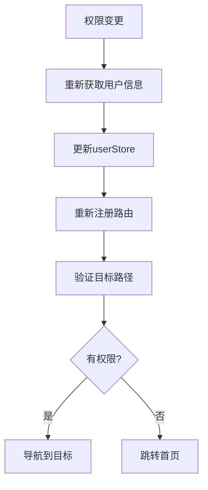

**Diagram sources**
- [beforeEach.ts](file://src/router/guards/beforeEach.ts#L1-L361)
- [user.ts](file://src/store/modules/user.ts#L1-L236)

**Section sources**
- [beforeEach.ts](file://src/router/guards/beforeEach.ts#L1-L361)

### 权限继承

系统支持基于角色的权限继承模型。通过合理设计角色层级，可以实现权限的继承和复用。例如，管理员角色可以继承普通用户的所有权限，同时拥有额外的管理权限，简化了权限管理的复杂度。

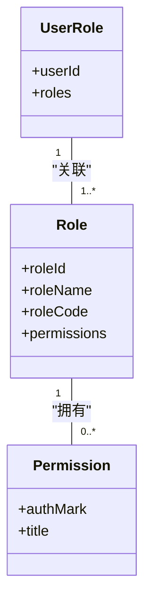

**Diagram sources**
- [role/index.vue](file://src/views/system/role/index.vue#L1-L243)
- [user/index.vue](file://src/views/system/user/index.vue#L1-L262)

**Section sources**
- [role/index.vue](file://src/views/system/role/index.vue#L1-L243)

## 常见问题解决方案

### 权限不生效

当权限控制不生效时，首先检查应用模式配置。前端模式和后端模式使用不同的权限来源，v-auth指令仅在后端模式下有效。同时确认路由元数据配置正确，权限标识拼写无误。

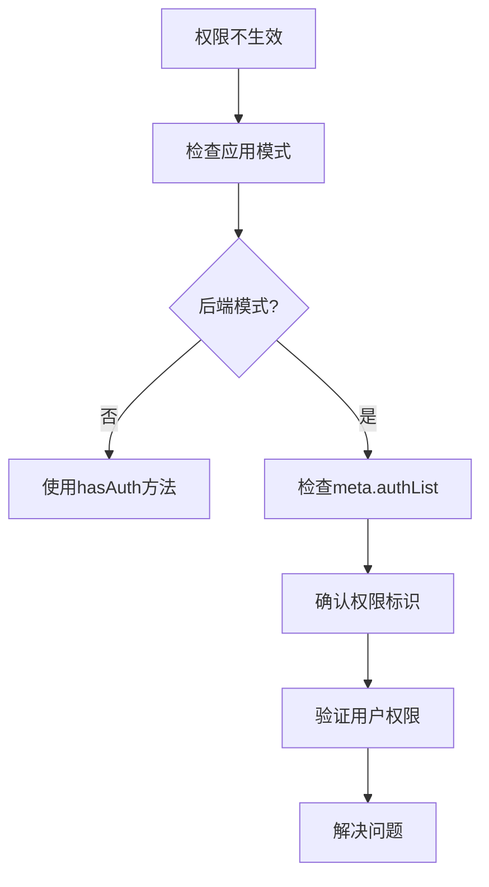

**Section sources**
- [useAppMode.ts](file://src/hooks/core/useAppMode.ts#L1-L46)
- [useAuth.ts](file://src/hooks/core/useAuth.ts#L1-L75)

### 路由权限冲突

路由权限冲突通常发生在动态路由注册过程中。系统通过路由注册器和菜单处理器协同工作，确保路由权限的一致性。当出现冲突时，检查菜单数据接口返回的权限配置是否正确。

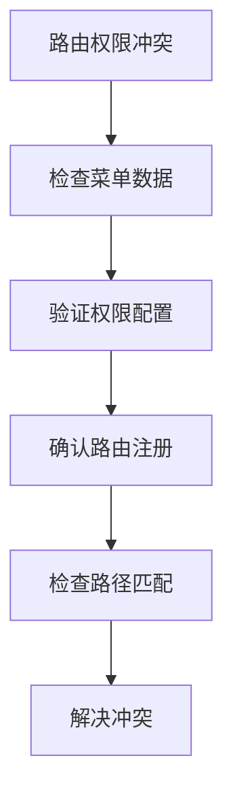

**Section sources**
- [beforeEach.ts](file://src/router/guards/beforeEach.ts#L1-L361)
- [RoutePermissionValidator.ts](file://src/router/core/RoutePermissionValidator.ts#L1-L120)

## 总结

本权限管理系统提供了完整的基于角色的访问控制解决方案，支持路由权限、按钮权限和页面可见性控制三种主要权限类型。通过自定义指令、路由守卫和状态管理的有机结合，系统实现了灵活且安全的权限控制机制。开发者可以根据具体需求选择前端模式或后端模式，利用提供的工具和组件快速实现复杂的权限管理功能。