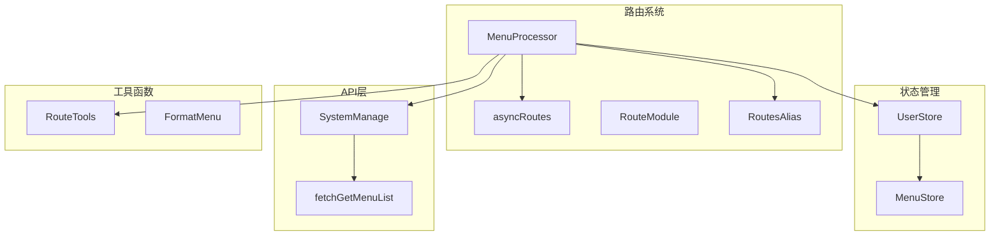
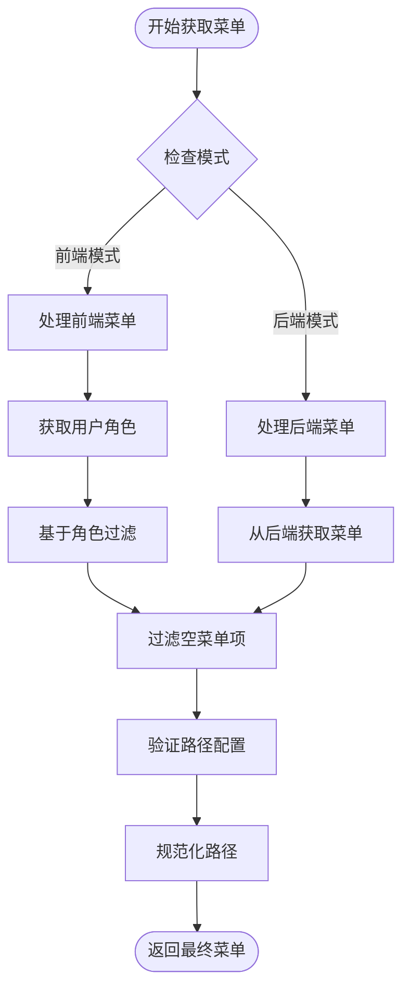
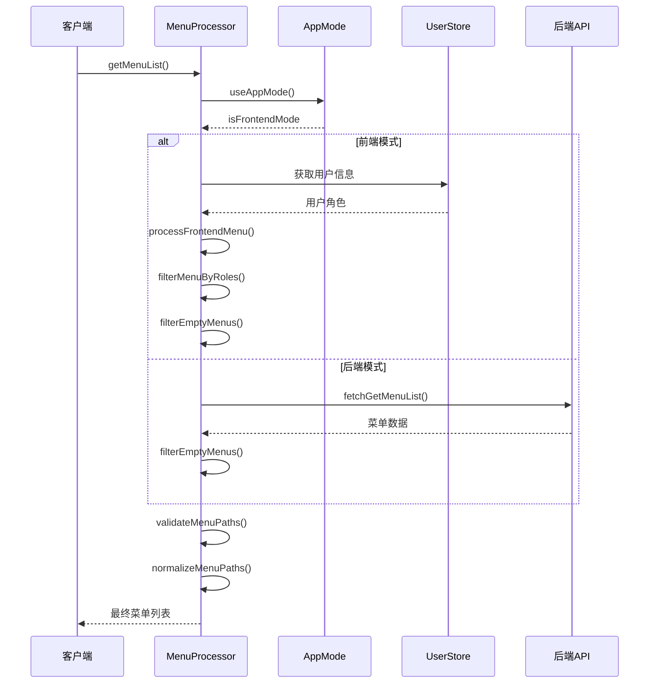
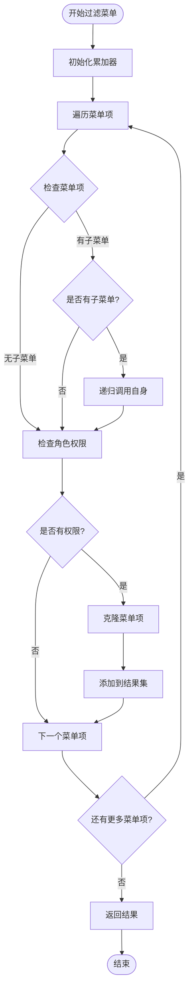
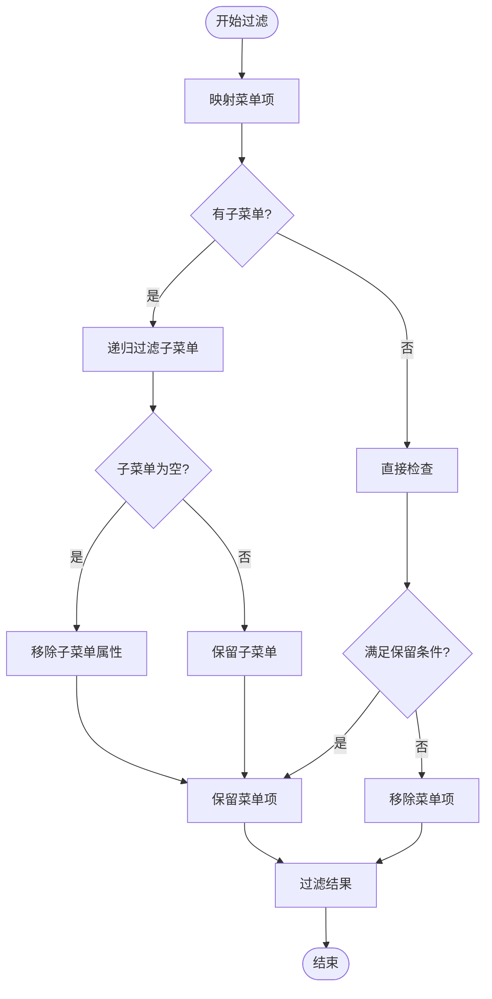
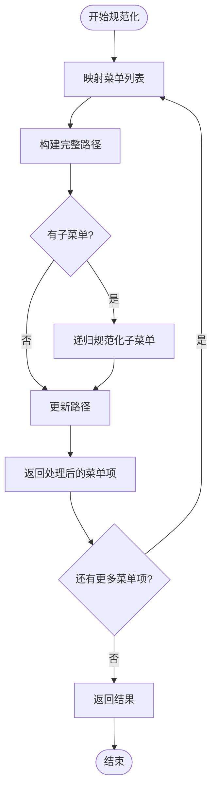
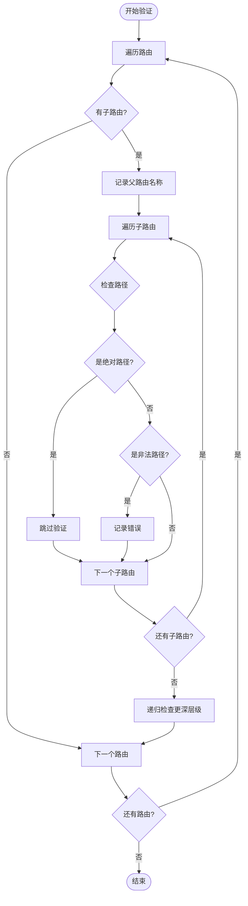
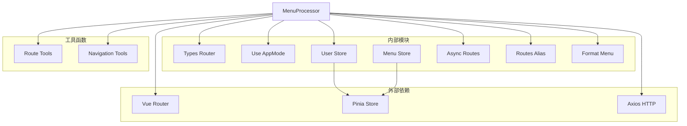

# 菜单权限过滤

<cite>
**本文档中引用的文件**
- [MenuProcessor.ts](file://src/router/core/MenuProcessor.ts)
- [index.ts](file://src/types/router/index.ts)
- [asyncRoutes.ts](file://src/router/routes/asyncRoutes.ts)
- [dashboard.ts](file://src/router/modules/dashboard.ts)
- [system.ts](file://src/router/modules/system.ts)
- [user.ts](file://src/store/modules/user.ts)
- [menu.ts](file://src/store/modules/menu.ts)
- [system-manage.ts](file://src/api/system-manage.ts)
- [route.ts](file://src/utils/navigation/route.ts)
</cite>

## 目录
1. [简介](#简介)
2. [项目结构](#项目结构)
3. [核心组件](#核心组件)
4. [架构概览](#架构概览)
5. [详细组件分析](#详细组件分析)
6. [依赖关系分析](#依赖关系分析)
7. [性能考虑](#性能考虑)
8. [故障排除指南](#故障排除指南)
9. [结论](#结论)

## 简介

MenuProcessor类是Art Design Pro框架中负责菜单权限过滤的核心组件。它实现了基于角色的访问控制（RBAC）机制，通过递归算法精确过滤菜单项，确保用户只能访问其具有相应权限的菜单内容。该类支持前后端两种菜单管理模式，提供了完整的菜单路径验证和规范化功能。

## 项目结构

MenuProcessor类位于路由核心模块中，与其他关键组件协同工作：



**图表来源**
- [MenuProcessor.ts](file://src/router/core/MenuProcessor.ts#L17-L240)
- [user.ts](file://src/store/modules/user.ts#L50-L236)
- [menu.ts](file://src/store/modules/menu.ts#L41-L109)

**章节来源**
- [MenuProcessor.ts](file://src/router/core/MenuProcessor.ts#L1-L242)

## 核心组件

MenuProcessor类包含以下核心方法：

### 主要方法概览

| 方法名 | 功能描述 | 参数 | 返回值 |
|--------|----------|------|--------|
| `getMenuList()` | 获取完整的菜单列表 | 无 | `Promise<AppRouteRecord[]>` |
| `processFrontendMenu()` | 处理前端权限模式 | 无 | `Promise<AppRouteRecord[]>` |
| `processBackendMenu()` | 处理后端权限模式 | 无 | `Promise<AppRouteRecord[]>` |
| `filterMenuByRoles()` | 基于角色过滤菜单 | `menu: AppRouteRecord[]`, `roles: string[]` | `AppRouteRecord[]` |
| `filterEmptyMenus()` | 过滤无效菜单项 | `menuList: AppRouteRecord[]` | `AppRouteRecord[]` |
| `normalizeMenuPaths()` | 规范化菜单路径 | `menuList: AppRouteRecord[]`, `parentPath: string` | `AppRouteRecord[]` |
| `validateMenuPaths()` | 验证菜单路径配置 | `menuList: AppRouteRecord[]`, `level: number` | `void` |

**章节来源**
- [MenuProcessor.ts](file://src/router/core/MenuProcessor.ts#L22-L240)

## 架构概览

MenuProcessor采用分层架构设计，支持灵活的菜单管理模式：



**图表来源**
- [MenuProcessor.ts](file://src/router/core/MenuProcessor.ts#L22-L36)

## 详细组件分析

### getMenuList方法 - 菜单获取入口

getMenuList方法是整个菜单处理流程的入口点，根据应用模式选择不同的处理策略：



**图表来源**
- [MenuProcessor.ts](file://src/router/core/MenuProcessor.ts#L22-L36)
- [user.ts](file://src/store/modules/user.ts#L43-L44)

**章节来源**
- [MenuProcessor.ts](file://src/router/core/MenuProcessor.ts#L22-L36)

### filterMenuByRoles方法 - 递归权限过滤

filterMenuByRoles方法实现了基于角色的递归菜单过滤机制：



**图表来源**
- [MenuProcessor.ts](file://src/router/core/MenuProcessor.ts#L67-L81)

#### 权限匹配逻辑详解

权限匹配遵循以下规则：
1. **无角色限制**：如果菜单项没有定义roles属性，则默认允许访问
2. **角色匹配**：菜单项的roles数组必须包含用户的一个或多个角色
3. **递归处理**：对于有子菜单的节点，递归应用相同的权限匹配逻辑

**章节来源**
- [MenuProcessor.ts](file://src/router/core/MenuProcessor.ts#L67-L81)

### processFrontendMenu与processBackendMenu差异处理

两种模式下的菜单处理逻辑存在显著差异：

| 特性 | 前端模式 | 后端模式 |
|------|----------|----------|
| 数据源 | `asyncRoutes` | 后端API `/api/v3/system/menus` |
| 权限控制 | 基于用户角色 | 基于后端权限配置 |
| 实时性 | 较低（需同步） | 较高（实时获取） |
| 性能开销 | 较低（本地计算） | 较高（网络请求） |
| 可控性 | 较高（前端定义） | 较高（后端定义） |

**章节来源**
- [MenuProcessor.ts](file://src/router/core/MenuProcessor.ts#L42-L61)

### filterEmptyMenus方法 - 无效菜单清理

filterEmptyMenus方法提供智能的菜单项过滤机制：



**图表来源**
- [MenuProcessor.ts](file://src/router/core/MenuProcessor.ts#L87-L118)

#### 保留条件详解

菜单项保留遵循以下优先级规则：
1. **目录菜单**：定义了children属性的菜单项（即使为空数组）
2. **外部链接**：meta.isIframe为true或存在link属性
3. **有效组件**：具有有效component属性且不等于RoutesAlias.Layout
4. **其他情况**：不符合上述条件的菜单项将被过滤

**章节来源**
- [MenuProcessor.ts](file://src/router/core/MenuProcessor.ts#L87-L118)

### normalizeMenuPaths方法 - 路径规范化

normalizeMenuPaths方法确保菜单路径的一致性和正确性：



**图表来源**
- [MenuProcessor.ts](file://src/router/core/MenuProcessor.ts#L132-L147)

#### 路径构建规则

路径规范化遵循以下规则：
1. **外部链接**：保持原样，不做修改
2. **绝对路径**：直接使用，不做修改
3. **相对路径**：与父路径拼接，确保形成完整路径
4. **根路径**：添加前导斜杠

**章节来源**
- [MenuProcessor.ts](file://src/router/core/MenuProcessor.ts#L132-L147)

### validateMenuPaths方法 - 路径配置验证

validateMenuPaths方法检测并报告菜单路径配置错误：



**图表来源**
- [MenuProcessor.ts](file://src/router/core/MenuProcessor.ts#L158-L178)

#### 非法路径检测规则

validateMenuPaths方法检测以下配置错误：
1. **非一级菜单使用绝对路径**：如`/dashboard`作为二级菜单路径
2. **外部链接和iframe路径**：这些路径不受此规则限制
3. **路径建议修正**：自动提供正确的相对路径建议

**章节来源**
- [MenuProcessor.ts](file://src/router/core/MenuProcessor.ts#L158-L178)

## 依赖关系分析

MenuProcessor类的依赖关系展现了清晰的分层架构：



**图表来源**
- [MenuProcessor.ts](file://src/router/core/MenuProcessor.ts#L10-L16)

**章节来源**
- [MenuProcessor.ts](file://src/router/core/MenuProcessor.ts#L10-L16)

## 性能考虑

MenuProcessor在设计时充分考虑了性能优化：

### 时间复杂度分析

| 方法 | 时间复杂度 | 空间复杂度 | 说明 |
|------|------------|------------|------|
| `filterMenuByRoles` | O(n×m) | O(n) | n为菜单项数量，m为角色数量 |
| `filterEmptyMenus` | O(n) | O(n) | 单次遍历，递归深度受限 |
| `normalizeMenuPaths` | O(n) | O(n) | 单次遍历，路径构建O(1) |
| `validateMenuPaths` | O(n×d) | O(d) | d为最大深度，常数级验证 |

### 优化策略

1. **惰性加载**：仅在需要时加载菜单数据
2. **递归优化**：使用reduce替代forEach减少中间变量
3. **内存优化**：合理使用对象克隆和引用传递
4. **早期退出**：在条件不满足时尽早返回

## 故障排除指南

### 常见配置错误及解决方案

#### 1. 菜单路径配置错误

**问题症状**：
```
[路由配置错误] 菜单 "系统管理" (name: System, path: /system) 配置错误
  位置: Dashboard > System
  问题: 2级菜单的 path 不能以 / 开头
  当前配置: path: '/system'
  应该改为: path: 'system'
```

**解决方案**：
- 移除二级菜单路径的前导斜杠
- 确保路径为相对路径而非绝对路径

#### 2. 权限过滤不生效

**排查步骤**：
1. 检查用户角色是否正确设置
2. 验证菜单项的roles配置
3. 确认MenuProcessor实例化正确

#### 3. 菜单显示异常

**排查步骤**：
1. 检查filterEmptyMenus过滤逻辑
2. 验证normalizeMenuPaths路径处理
3. 确认validateMenuPaths配置正确

**章节来源**
- [MenuProcessor.ts](file://src/router/core/MenuProcessor.ts#L195-L211)

### 调试技巧

1. **启用详细日志**：利用console.error输出详细的路径配置信息
2. **断点调试**：在关键方法设置断点观察执行流程
3. **单元测试**：为每个方法编写独立的测试用例

## 结论

MenuProcessor类通过精心设计的递归算法和完善的验证机制，实现了高效、可靠的菜单权限过滤功能。其支持的前后端双模式架构为不同应用场景提供了灵活的解决方案，而完善的路径验证和规范化功能确保了系统的稳定性和用户体验。

该组件的设计体现了以下优秀特性：
- **模块化设计**：职责清晰，易于维护和扩展
- **递归处理**：优雅解决多层级菜单的权限控制
- **完整性验证**：从配置到运行的全方位质量保证
- **性能优化**：合理的算法选择和内存使用策略

通过深入理解MenuProcessor的工作原理，开发者可以更好地利用其功能，同时避免常见的配置错误，构建更加健壮的权限控制系统。